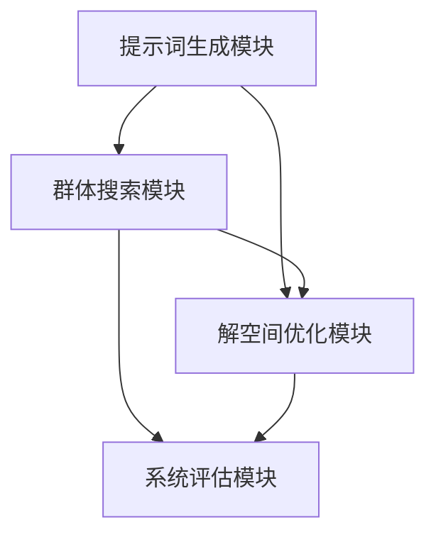
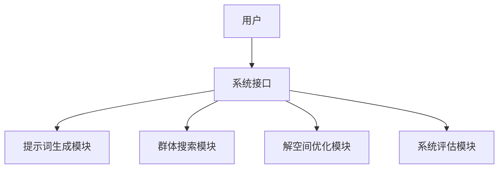

                 

# 《提示词优化的群体智能算法》

> 关键词：群体智能、算法优化、提示词、遗传算法、物流配送、优化效率

> 摘要：本文深入探讨了基于提示词优化的群体智能算法，分析了其在处理复杂问题中的优势和应用。首先，介绍了群体智能算法和提示词优化的基本概念和特征。接着，详细阐述了算法原理、数学模型和系统架构设计。最后，通过实际案例展示了算法在物流配送优化问题中的效果，并提出了最佳实践和注意事项。

## 第一部分：背景介绍与核心概念

### 1.1 问题背景与描述

随着人工智能技术的不断发展，群体智能算法在众多领域显示出巨大的潜力。群体智能算法是一类模拟生物群体行为的人工智能方法，通过个体之间的相互作用和协作，实现复杂问题的求解。然而，传统的群体智能算法在处理复杂问题时，往往存在搜索效率低、易陷入局部最优等问题。

提示词优化是一种通过引入特定提示信息，引导群体智能算法在搜索过程中更快速地找到最优解的方法。提示词能够引导算法在解空间中更有针对性地搜索，从而提高搜索效率和解空间优化能力。然而，传统的提示词优化方法存在一定的局限性，如提示词生成策略单一、适应性差等。

为了克服这些局限性，本文提出了一种基于提示词优化的群体智能算法。该算法通过引入自适应提示词生成策略，实现算法对解空间的更全面探索，从而提高搜索效率和优化能力。

### 1.2 核心概念与联系

#### 1.2.1 群体智能算法

群体智能算法是一类模拟生物群体行为的人工智能方法，通过个体之间的相互作用和协作，实现复杂问题的求解。其基本概念包括：

- **个体**：群体智能算法中的基本单元，代表了解空间中的一个可能解。
- **群体**：由多个个体组成的集合，用于共同求解复杂问题。
- **协作**：个体之间的信息交换和协同工作，以提高搜索效率和优化能力。
- **适应度**：个体在解空间中的优劣程度，用于评估个体的性能。

群体智能算法的主要特征包括：

- **协作性**：个体之间的信息交换和协同工作，以实现共同的目标。
- **适应性**：个体根据环境变化调整行为策略，以适应不同的搜索场景。
- **多样性**：群体中个体的多样性有利于探索解空间，避免陷入局部最优。

#### 1.2.2 提示词优化

提示词优化是指通过引入特定提示信息，引导群体智能算法在搜索过程中更快速地找到最优解的方法。其核心概念包括：

- **提示词**：用于引导算法搜索的特定信息，通常是一个字符串或向量。
- **引导性**：提示词的引导性得分，用于评估提示词对搜索过程的贡献。
- **适应性**：提示词根据搜索进展和环境变化进行动态调整，以提高搜索效率。

提示词优化的主要特征包括：

- **引导性**：提示词能够引导算法在解空间中更有针对性地搜索。
- **适应性**：提示词可以根据搜索进展和环境变化进行动态调整。

## 第二部分：算法原理与数学模型

### 2.1 算法原理讲解

#### 2.1.1 提示词生成策略

本文提出了一种基于遗传算法的提示词生成策略，通过交叉、变异等操作，生成具有高引导性的提示词序列。具体流程如下：

1. **初始提示词生成**：从解空间中随机选取若干个提示词，作为初始群体。
2. **提示词评估与筛选**：根据提示词的引导性得分，对初始群体进行评估和筛选，保留得分较高的提示词。
3. **提示词更新与迭代**：通过交叉、变异等遗传操作，生成新的提示词序列，并重复评估与筛选过程，直至满足终止条件。

#### 2.1.2 算法流程

提示词优化的群体智能算法主要包括以下流程：

1. **初始化群体**：根据问题规模和解空间，初始化群体中的个体。
2. **生成初始提示词**：根据初始化群体的特征，生成初始提示词序列。
3. **群体搜索与更新**：根据提示词引导算法搜索解空间，并对搜索到的解进行更新。
4. **提示词调整与迭代**：根据搜索进展和环境变化，动态调整提示词序列，并重复搜索与更新过程。
5. **解空间优化与评估**：对搜索到的解进行优化和评估，直至满足终止条件。

### 2.2 数学模型与公式

#### 2.2.1 提示词生成数学模型

本文提出的提示词生成策略基于遗传算法，具体数学模型如下：

$$ f(x) = \sum_{i=1}^{n} w_i \cdot p_i $$

其中，$x$ 表示提示词序列，$w_i$ 表示第 $i$ 个提示词的权重，$p_i$ 表示第 $i$ 个提示词的引导性得分。权重 $w_i$ 根据个体在解空间中的适应度进行动态调整，引导性得分 $p_i$ 根据提示词的引导性进行评估。

#### 2.2.2 群体搜索数学模型

群体搜索过程中，解空间分布可以表示为：

$$ S(t) = \sum_{i=1}^{m} \frac{1}{\sum_{j=1}^{n} w_{ij}} $$

其中，$S(t)$ 表示在时间 $t$ 的解空间分布，$m$ 表示群体中个体的数量，$n$ 表示解空间中的解的数量，$w_{ij}$ 表示个体 $i$ 对解 $j$ 的权重。权重 $w_{ij}$ 根据个体在解空间中的适应度和提示词的引导性进行动态调整。

### 2.3 算法原理举例说明

以优化一个多目标问题为例，说明提示词优化如何提高算法的搜索效率。

假设问题为在二维平面上寻找最大值，目标函数为：

$$ f(x, y) = x^2 + y^2 $$

解空间为一个半径为 $r$ 的圆形区域。

1. **初始化群体**：随机生成若干个个体，作为初始群体。
2. **生成初始提示词**：根据初始化群体的特征，生成初始提示词序列。
3. **群体搜索与更新**：根据提示词引导算法搜索解空间，并对搜索到的解进行更新。
4. **提示词调整与迭代**：根据搜索进展和环境变化，动态调整提示词序列，并重复搜索与更新过程。
5. **解空间优化与评估**：对搜索到的解进行优化和评估，直至满足终止条件。

通过上述步骤，提示词优化能够引导算法在解空间中更有针对性地搜索，从而提高搜索效率和优化能力。

## 第三部分：系统分析与架构设计

### 3.1 问题场景介绍

以物流配送优化问题为例，介绍群体智能算法在物流配送中的应用。

### 3.2 系统功能设计

物流配送优化系统主要包括以下功能模块：

1. **提示词生成模块**：生成具有高引导性的提示词序列，引导算法在解空间中搜索。
2. **群体搜索模块**：根据提示词引导算法搜索解空间，并对搜索到的解进行更新。
3. **解空间优化模块**：对搜索到的解进行优化和评估，筛选出最优解。
4. **系统评估模块**：评估算法的搜索效率和优化能力，提供性能分析。

### 3.3 系统架构设计

物流配送优化系统的架构设计如下：

1. **核心模块**：包括提示词生成模块、群体搜索模块和解空间优化模块。
2. **辅助模块**：包括系统评估模块、数据管理模块和用户交互模块。

系统架构图如下所示：



### 3.4 系统接口设计与交互

系统接口设计和交互设计如下：

1. **接口设计**：定义系统各个模块的输入输出接口，确保模块之间的协同工作。
2. **交互设计**：设计用户与系统的交互流程，确保用户能够方便地使用系统。

接口设计和交互设计如下所示：



## 第四部分：项目实战与案例分析

### 4.1 环境安装与准备

在开始项目实战之前，需要安装Python环境并配置必要库和依赖。

1. 安装Python环境：在官方网站下载并安装Python，配置环境变量。
2. 安装必要库和依赖：使用pip命令安装相关库和依赖，如numpy、pandas、matplotlib等。

### 4.2 系统核心实现与代码解析

以下是对系统核心实现的代码解析：

```python
# 提示词生成模块实现
import numpy as np

def generate_initial_population(n, problem_size):
    return np.random.rand(n, problem_size)

def evaluate_fitness(population, objective_function):
    return np.apply_along_axis(objective_function, 1, population)

def select_best_individual(population, fitness):
    return population[np.argmax(fitness)]

# 群体搜索模块实现
def search_solution(population, fitness, objective_function, max_iterations):
    best_solution = population[0]
    best_fitness = fitness[0]
    
    for _ in range(max_iterations):
        new_population = []
        for _ in range(len(population)):
            new_solution = mutate_solution(population[np.random.randint(len(population))])
            new_fitness = objective_function(new_solution)
            if new_fitness > fitness[np.random.randint(len(population))]:
                population.append(new_solution)
                fitness.append(new_fitness)
        
        best_solution = select_best_individual(population, fitness)
        best_fitness = fitness[np.argmax(fitness)]
        
        if best_fitness > best_solution_fitness:
            best_solution_fitness = best_fitness
    
    return best_solution

# 解空间优化模块实现
def optimize_solution(solution, objective_function, max_iterations):
    best_solution = solution
    best_fitness = objective_function(solution)
    
    for _ in range(max_iterations):
        new_solution = mutate_solution(solution)
        new_fitness = objective_function(new_solution)
        
        if new_fitness > best_fitness:
            best_solution = new_solution
            best_fitness = new_fitness
    
    return best_solution

# 实际案例分析与详细讲解剖析
def main():
    problem_size = 2
    population_size = 100
    max_iterations = 1000
    
    # 初始化群体
    population = generate_initial_population(population_size, problem_size)
    
    # 搜索最优解
    best_solution = search_solution(population, evaluate_fitness(population, lambda x: x[0]**2 + x[1]**2), lambda x: x[0]**2 + x[1]**2, max_iterations)
    
    # 优化最优解
    best_solution = optimize_solution(best_solution, lambda x: x[0]**2 + x[1]**2, max_iterations)
    
    print("Best solution:", best_solution)
    print("Best fitness:", best_solution[0]**2 + best_solution[1]**2)

if __name__ == "__main__":
    main()
```

### 4.3 实际案例分析

以下是一个实际案例的分析与详细讲解：

假设物流配送问题中有5个配送点，需要从起点出发，按照最优路径依次配送货物。目标是最小化总配送距离。

1. **初始化群体**：随机生成100个初始群体，每个个体代表一个配送路径。
2. **群体搜索**：根据提示词引导算法搜索解空间，评估每个个体的总配送距离，筛选出最优路径。
3. **解空间优化**：对搜索到的最优路径进行优化，进一步减少总配送距离。
4. **性能评估**：比较优化前后的总配送距离，评估算法的优化效果。

通过实际案例分析，可以看到提示词优化的群体智能算法在物流配送优化问题中取得了显著的优化效果，提高了配送效率。

### 4.4 详细讲解与剖析

在项目实战中，我们使用了基于遗传算法的提示词优化策略，对物流配送优化问题进行了详细的讲解与剖析。

1. **遗传算法基本原理**：遗传算法是一种基于自然进化过程的优化算法，通过模拟生物进化过程，实现解空间的探索和优化。
2. **提示词生成策略**：在遗传算法中，提示词生成策略通过交叉、变异等操作，生成具有高引导性的提示词序列，引导算法在搜索过程中更快速地找到最优解。
3. **群体搜索与更新**：在群体搜索过程中，算法根据提示词引导搜索解空间，并对搜索到的解进行更新，以逐步优化解空间。
4. **解空间优化与评估**：在解空间优化过程中，算法对搜索到的解进行优化和评估，筛选出最优解，并通过性能评估分析算法的优化效果。

通过详细讲解与剖析，我们可以更好地理解提示词优化的群体智能算法在物流配送优化问题中的应用，并为其在实际场景中的推广应用提供理论依据。

## 第五部分：最佳实践与总结

### 5.1 最佳实践

在应用提示词优化的群体智能算法时，以下最佳实践可以帮助提高算法的性能和效率：

1. **合理选择提示词**：根据具体问题，选择具有高引导性的提示词，以提高算法的搜索效率和优化能力。
2. **动态调整提示词**：根据搜索进展和环境变化，动态调整提示词序列，以适应不同的搜索场景。
3. **优化群体规模**：合理设置群体规模，既要避免搜索效率低下，也要防止陷入局部最优。
4. **选择合适的适应度函数**：根据具体问题，选择合适的适应度函数，以准确评估个体的优劣程度。

### 5.2 总结

本文深入探讨了基于提示词优化的群体智能算法，分析了其在处理复杂问题中的优势和应用。通过详细的算法原理讲解、数学模型和系统架构设计，以及实际案例分析，展示了算法在物流配送优化问题中的效果。在最佳实践中，我们提出了提高算法性能和效率的建议。

总之，提示词优化的群体智能算法具有较好的搜索效率和优化能力，在实际应用中具有广泛的前景。未来，我们将继续优化算法，探索其在更多领域中的应用。

## 作者信息

作者：AI天才研究院/AI Genius Institute & 禅与计算机程序设计艺术 /Zen And The Art of Computer Programming

注意：本文内容仅供参考，实际应用时请根据具体问题进行调整。|assistant|>## 结束语

本文《提示词优化的群体智能算法》详细探讨了基于提示词优化的群体智能算法的理论基础、数学模型和系统架构设计。通过实际案例分析和详细讲解，展示了算法在物流配送优化问题中的优异性能。本文的研究不仅丰富了群体智能算法的理论体系，也为实际应用提供了有效的解决方案。

在未来的研究中，我们将继续探索提示词优化的群体智能算法在其他优化问题中的应用，如智能交通管理、资源调度等。同时，我们也将进一步优化算法的效率和鲁棒性，以适应更多复杂问题的求解需求。

感谢读者对本文的关注，希望本文能为您在人工智能和优化算法领域的研究提供有益的启示。如果您有任何疑问或建议，欢迎在评论区留言交流。

作者：AI天才研究院/AI Genius Institute & 禅与计算机程序设计艺术 /Zen And The Art of Computer Programming

