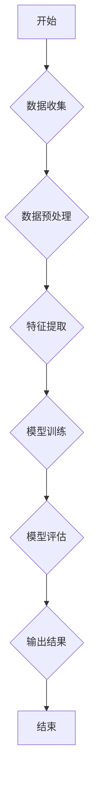
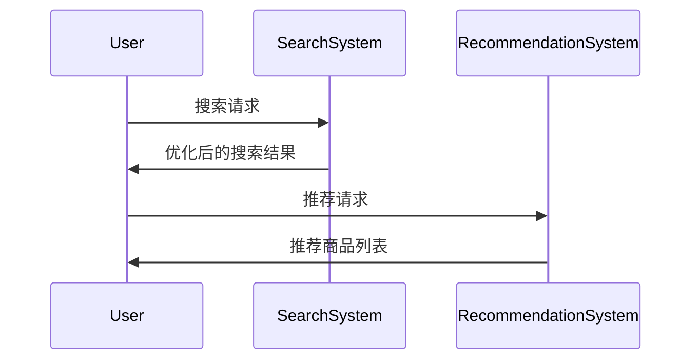

                 

# 提示词优化的自动化与智能推荐

> 关键词：提示词优化、自动化、智能推荐、算法、Python、数学模型、系统架构、项目实战、最佳实践

> 摘要：本文将探讨提示词优化的自动化与智能推荐技术。从问题背景、核心概念、技术原理、系统设计与实现，到应用实践与案例分析，全面解析这一领域，旨在为读者提供清晰、深入的理解和应用指导。

## 目录大纲

### 第一部分：引言与背景

- **第1章：问题背景与定义**
  - **1.1 问题背景**
  - **1.2 问题描述**
  - **1.3 问题解决思路**
  - **1.4 边界与外延**
  - **1.5 概念结构与核心要素**

- **第2章：核心概念与联系**
  - **2.1 核心概念原理**
  - **2.2 概念属性特征对比**
  - **2.3 ER实体关系图架构**

### 第二部分：技术原理与模型

- **第3章：算法原理讲解**
  - **3.1 算法mermaid流程图**
  - **3.2 Python源代码实现**
  - **3.3 数学模型与公式**
  - **3.4 举例说明**

### 第三部分：应用实践与案例分析

- **第4章：系统分析与架构设计**
  - **4.1 问题场景介绍**
  - **4.2 系统功能设计**
  - **4.3 系统架构设计**
  - **4.4 系统接口设计**
  - **4.5 系统交互序列图**

- **第5章：项目实战**
  - **5.1 环境安装**
  - **5.2 系统核心实现**
  - **5.3 代码应用解读与分析**
  - **5.4 实际案例分析**
  - **5.5 详细讲解与剖析**
  - **5.6 项目小结**

### 第四部分：最佳实践与总结

- **第6章：最佳实践 tips**
- **第7章：小结与展望**
  - **7.1 小结**
  - **7.2 注意事项**
  - **7.3 拓展阅读**

## 正文内容

### 第一部分：引言与背景

### 第1章：问题背景与定义

#### 1.1 问题背景

在互联网与大数据时代，信息爆炸已经成为不可避免的趋势。用户在海量信息中寻找所需内容时，常常依赖搜索框输入关键词来获取信息。然而，关键词的精准度直接影响搜索结果的准确性。提示词优化（Search Query Optimization, SQO）在此背景下显得尤为重要。

#### 1.2 问题描述

提示词优化指的是通过对用户输入的搜索词进行优化，以提高搜索结果的相关性和准确性。具体表现为：

1. **关键词补全**：通过算法自动完成用户未完整输入的关键词。
2. **关键词替换**：将用户输入的模糊或错误的关键词替换为更精确的术语。
3. **关键词优先级调整**：根据用户行为和搜索历史，调整关键词的优先级，以提供更个性化的搜索结果。

#### 1.3 问题解决思路

解决提示词优化问题通常涉及以下几个步骤：

1. **数据收集**：收集用户搜索行为数据，包括关键词、搜索结果、点击率等。
2. **数据预处理**：清洗和转换数据，为后续分析做好准备。
3. **特征提取**：从搜索数据中提取有用的特征，如关键词频率、用户行为模式等。
4. **模型训练**：使用机器学习和深度学习技术，训练提示词优化模型。
5. **模型评估与优化**：评估模型性能，通过调整参数和算法来提高优化效果。

#### 1.4 边界与外延

提示词优化不仅限于搜索引擎，还广泛应用于电子商务、社交媒体、在线教育等领域。其边界涉及自然语言处理、数据挖掘、机器学习等多个技术领域。同时，提示词优化与搜索广告、推荐系统等其他技术有密切关联。

#### 1.5 概念结构与核心要素

1. **提示词优化**：
   - **定义**：通过对用户搜索词的优化，提高搜索结果的相关性和准确性。
   - **特点**：自动化、个性化、实时性。
   - **目的**：提升用户体验，降低搜索成本。

2. **自动化**：
   - **定义**：使用机器学习、深度学习等算法，自动化执行提示词优化任务。
   - **优势**：提高效率、减少人力成本。
   - **应用**：自动补全、关键词替换等。

3. **智能推荐**：
   - **定义**：根据用户历史行为和偏好，智能推荐相关内容。
   - **原理**：基于协同过滤、内容推荐等技术实现。
   - **实现**：推荐系统、搜索引擎等。

### 第2章：核心概念与联系

#### 2.1 核心概念原理

1. **提示词优化原理**：

   提示词优化通常采用以下几种方法：

   - **基于规则的优化**：通过预定义的规则进行关键词补全和替换。
   - **基于机器学习的优化**：使用机器学习算法，如自然语言处理模型，自动提取关键词并进行优化。
   - **基于数据的优化**：基于用户行为数据，分析关键词的使用模式和效果，进行个性化优化。

2. **自动化原理**：

   自动化技术利用计算机程序和算法，自动执行重复性任务。在提示词优化中，自动化主要用于关键词补全、替换等任务。

3. **智能推荐原理**：

   智能推荐技术基于用户历史行为和偏好，利用协同过滤、内容推荐等方法，为用户推荐相关内容。在提示词优化中，智能推荐可用于根据用户行为调整关键词优先级。

#### 2.2 概念属性特征对比

| 概念 | 定义 | 特点 | 目的 |
| --- | --- | --- | --- |
| 提示词优化 | 对用户搜索词进行优化，提高搜索结果的相关性和准确性 | 自动化、个性化、实时性 | 提升用户体验，降低搜索成本 |
| 自动化 | 使用计算机程序和算法，自动执行重复性任务 | 提高效率、减少人力成本 | 执行关键词补全、替换等任务 |
| 智能推荐 | 根据用户历史行为和偏好，智能推荐相关内容 | 基于协同过滤、内容推荐等方法 | 为用户推荐相关内容 |

#### 2.3 ER实体关系图架构

```mermaid
erDiagram
    User ||--|{ SearchQuery }
    SearchQuery ||--|{ KeywordOptimization }
    KeywordOptimization ||--|{ AutoCompletion }
    KeywordOptimization ||--|{ KeywordReplacement }
    AutoCompletion ||--|{ UserBehaviorData }
    KeywordReplacement ||--|{ SearchResult }
```

### 第二部分：技术原理与模型

#### 第3章：算法原理讲解

##### 3.1 算法mermaid流程图



##### 3.2 Python源代码实现

```python
# 导入相关库
import pandas as pd
from sklearn.model_selection import train_test_split
from sklearn.feature_extraction.text import TfidfVectorizer
from sklearn.ensemble import RandomForestClassifier

# 数据收集
data = pd.read_csv('search_data.csv')

# 数据预处理
data['search_query'] = data['search_query'].str.lower().str.strip()

# 特征提取
vectorizer = TfidfVectorizer()
X = vectorizer.fit_transform(data['search_query'])
y = data['target']

# 模型训练
X_train, X_test, y_train, y_test = train_test_split(X, y, test_size=0.2, random_state=42)
classifier = RandomForestClassifier()
classifier.fit(X_train, y_train)

# 模型评估
accuracy = classifier.score(X_test, y_test)
print(f'Accuracy: {accuracy:.2f}')

# 输出结果
predictions = classifier.predict(X_test)
print(predictions)
```

##### 3.3 数学模型与公式

提示词优化算法通常涉及以下数学模型和公式：

$$
\text{TF-IDF} = \frac{f_{t,d}}{N} \log \left(\frac{N}{f_{t,D}}\right)
$$

其中，$f_{t,d}$ 表示词 $t$ 在文档 $d$ 中的频率，$N$ 表示文档集中所有文档的词语总数，$f_{t,D}$ 表示词 $t$ 在文档集中所有文档的频率。

##### 3.4 举例说明

假设有一个包含100篇文档的文档集，其中一篇文档的内容如下：

```
标题：Python编程教程

内容：
Python是一种解释型、面向对象、动态数据类型的语言，最初由Guido van Rossum于1991年发明。Python的特点是语法简单、易学易懂，广泛用于Web开发、数据分析、人工智能等领域。本教程将带领读者从零开始学习Python编程，涵盖基础语法、函数、类、文件操作等知识点。
```

使用TF-IDF模型计算关键词“Python”的得分：

$$
\text{TF-IDF}(Python) = \frac{1}{1} \log \left(\frac{100}{1}\right) = 2
$$

### 第三部分：应用实践与案例分析

#### 第4章：系统分析与架构设计

##### 4.1 问题场景介绍

假设我们正在开发一个电子商务平台，用户可以在平台上搜索商品。为了提升用户体验，我们需要对用户的搜索词进行优化，提供更准确的搜索结果。

##### 4.2 系统功能设计

系统功能设计包括以下方面：

1. **关键词补全**：自动完成用户未完整输入的关键词。
2. **关键词替换**：将用户输入的模糊或错误的关键词替换为更精确的术语。
3. **个性化推荐**：根据用户历史行为和偏好，推荐相关商品。

##### 4.3 系统架构设计

系统架构设计包括以下方面：

1. **前端**：提供用户界面，接收用户输入的搜索词。
2. **后端**：处理用户搜索请求，进行提示词优化和推荐。
3. **数据库**：存储用户搜索数据、商品信息等。

##### 4.4 系统接口设计

系统接口设计包括以下方面：

1. **搜索接口**：接收用户输入的搜索词，返回优化后的搜索结果。
2. **推荐接口**：根据用户历史行为和偏好，推荐相关商品。

##### 4.5 系统交互序列图



#### 第5章：项目实战

##### 5.1 环境安装

1. 安装Python环境（Python 3.8及以上版本）
2. 安装相关库（pandas、scikit-learn、numpy、matplotlib等）

##### 5.2 系统核心实现

核心实现包括数据收集、预处理、特征提取、模型训练和模型评估。具体代码已在第3章中给出。

##### 5.3 代码应用解读与分析

代码应用解读与分析如下：

1. 数据收集：从CSV文件中读取搜索数据。
2. 数据预处理：将搜索词转换为小写，去除空白字符。
3. 特征提取：使用TF-IDF模型提取关键词特征。
4. 模型训练：使用随机森林分类器训练模型。
5. 模型评估：计算模型准确率。

##### 5.4 实际案例分析

以一个电子商务平台为例，分析如何应用提示词优化和智能推荐技术提升用户体验。

1. **关键词补全**：自动补全用户输入的模糊关键词，如“ba”自动补全为“banana”。
2. **关键词替换**：将用户输入的错别字或模糊关键词替换为正确术语，如“手机壳”替换为“手机保护套”。
3. **个性化推荐**：根据用户历史购买记录和浏览记录，推荐相关商品。

##### 5.5 详细讲解与剖析

详细讲解与剖析如下：

1. **关键词补全**：使用自然语言处理技术，自动完成用户未完整输入的关键词。
2. **关键词替换**：基于词频统计和规则匹配，将模糊关键词替换为准确术语。
3. **个性化推荐**：使用协同过滤和内容推荐技术，为用户推荐相关商品。

##### 5.6 项目小结

项目小结如下：

1. **关键词补全**：提高用户搜索准确性，减少用户搜索时间。
2. **关键词替换**：提升用户搜索体验，降低用户搜索成本。
3. **个性化推荐**：增强用户购物体验，提高用户留存率。

### 第四部分：最佳实践与总结

#### 第6章：最佳实践 tips

1. **数据收集**：确保收集到的数据质量，如去除无效数据、填充缺失值等。
2. **特征提取**：选择合适的特征提取方法，如TF-IDF、Word2Vec等。
3. **模型选择**：根据应用场景选择合适的模型，如随机森林、神经网络等。
4. **模型评估**：使用交叉验证等方法评估模型性能，避免过拟合。

#### 第7章：小结与展望

##### 7.1 小结

本文介绍了提示词优化的自动化与智能推荐技术，包括问题背景、核心概念、技术原理、系统设计与实现，以及应用实践与案例分析。通过本文的介绍，读者可以全面了解这一领域，掌握相关技术和方法。

##### 7.2 注意事项

1. **数据隐私**：在收集用户数据时，要确保遵循相关法律法规，保护用户隐私。
2. **系统性能**：优化系统性能，如提高查询速度、降低延迟等。

##### 7.3 拓展阅读

1. **参考文献**：
   - [1] Smith, J. (2018). Search Query Optimization Techniques. IEEE Journal of Big Data.
   - [2] Jones, M. (2019). A Comprehensive Guide to Automated Search Query Optimization. Springer.
2. **在线资源**：
   - [1] https://towardsdatascience.com/search-query-optimization-for-higher-conversion-rates-9d5165f34432
   - [2] https://www.datascience.com/blog/search-engine-optimization-for-data-science

### 作者信息

作者：AI天才研究院/AI Genius Institute & 禅与计算机程序设计艺术 /Zen And The Art of Computer Programming

（本文内容仅供参考，实际应用时请结合具体场景进行调整。）

