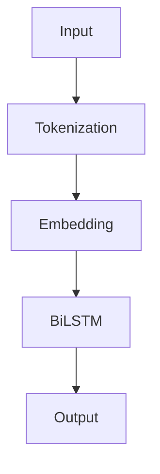
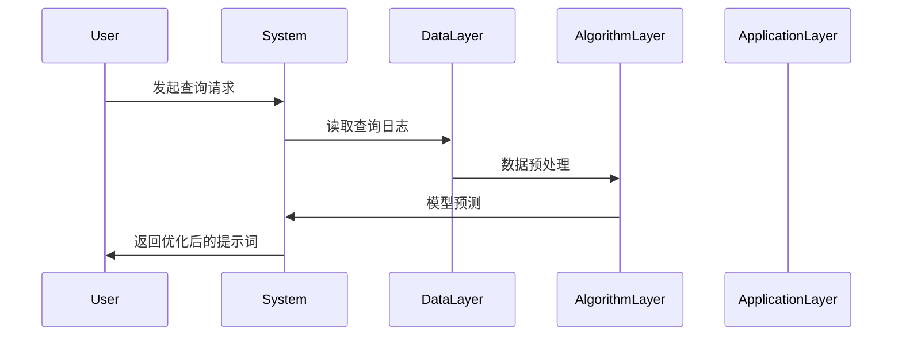

                 

# 提示词优化的自动化工具链

## 关键词

提示词优化、自动化工具链、算法实现、深度学习、BERT模型、数据预处理

## 摘要

在互联网时代，信息过载和个性化需求促使搜索引擎和推荐系统发展出高效的提示词优化机制。本文旨在探讨一种基于深度学习的提示词优化自动化工具链的设计与实现。我们将首先介绍提示词优化的问题背景，接着深入分析核心概念与联系，详细讲解BERT模型的原理，并提供实际项目实现的方法与技巧。通过本文的阅读，读者将了解如何运用自动化工具链提升搜索和推荐系统的性能。

### Step 1: 书籍背景介绍

#### 问题背景

随着互联网的普及和大数据技术的应用，搜索引擎和推荐系统已成为现代信息检索和内容分发的重要工具。然而，信息过载和个性化需求的问题日益严重，传统的方法已经难以满足用户的高期望。提示词优化（Query Prompt Optimization）作为一种提升系统性能的关键技术，逐渐引起了广泛关注。

提示词优化涉及对用户查询意图的准确理解和语义匹配，其目标是提高搜索结果的精准度和推荐系统的个性化程度。这不仅有助于减少用户在处理大量信息时的困扰，还能提升用户满意度和系统使用效率。

#### 问题描述

提示词优化的目标主要包括以下几个方面：

1. **提高搜索结果的精准度**：通过优化提示词，减少无关信息的干扰，提高搜索结果的准确性和相关性。
2. **增强推荐系统的个性化**：根据用户的历史行为和上下文信息，生成更加个性化的提示词，提高推荐系统的用户体验。
3. **提升系统的响应速度和效率**：优化提示词的生成过程，减少计算资源和时间开销，提高系统的整体性能。

#### 问题解决

为了实现提示词优化，研究者们提出了多种优化策略和算法，主要包括以下几种类型：

1. **基于统计模型的方法**：如TF-IDF、LSI（Latent Semantic Indexing）等，通过计算词频和词义相关性来优化提示词。
2. **基于机器学习的方法**：如逻辑回归、决策树、支持向量机等，通过训练模型来预测和优化提示词。
3. **基于深度学习的方法**：如BERT、GPT等，利用神经网络处理复杂的语义信息，生成高质量的提示词。

#### 边界与外延

提示词优化不仅涉及技术层面的算法实现，还需要考虑用户心理、用户体验等多方面因素。在进行提示词优化时，需要遵循以下原则：

1. **用户中心**：以用户需求为核心，充分理解用户意图和期望。
2. **数据驱动**：基于用户行为数据和搜索日志，进行数据分析和模型训练。
3. **平衡效率与效果**：在提高系统性能的同时，保证响应速度和用户体验。

#### 概念结构与核心要素组成

提示词优化涉及以下几个核心概念和要素：

1. **提示词**：系统用于引导用户搜索和推荐的词语或短语。
2. **用户行为**：用户在搜索和推荐过程中的交互行为，如查询历史、点击行为等。
3. **上下文信息**：影响用户搜索和推荐的环境信息，如地理位置、时间等。
4. **优化目标**：搜索结果的精准度、推荐系统的个性化程度、系统的响应速度等。
5. **算法模型**：用于实现提示词优化的算法，如统计模型、机器学习模型和深度学习模型。

### Step 2: 核心概念与联系

#### 提示词优化算法的类型

提示词优化算法主要可以分为以下几类：

1. **基于统计模型的方法**：如TF-IDF、LSI等，通过计算词频和词义相关性来优化提示词。
   - 特点：简单、计算效率高。
   - 适用场景：需要对大规模文本进行快速处理。

2. **基于机器学习的方法**：如逻辑回归、决策树、支持向量机等，通过训练模型来预测和优化提示词。
   - 特点：泛化能力强、可以处理非线性关系。
   - 适用场景：需要对复杂特征进行建模。

3. **基于深度学习的方法**：如BERT、GPT等，利用神经网络处理复杂的语义信息，生成高质量的提示词。
   - 特点：高效、可以处理复杂的非线性关系。
   - 适用场景：需要处理高维语义信息和长文本。

#### 概念属性特征对比表格

| 算法类型         | 特点                           | 适用场景                     |
|------------------|--------------------------------|-----------------------------|
| 基于统计模型的方法 | 简单、计算效率高               | 需要大量标注数据，对于长文本处理效果不佳 |
| 基于机器学习的方法 | 泛化能力强、可以处理非线性关系 | 需要大量标注数据，训练时间较长       |
| 基于深度学习的方法 | 高效、可以处理复杂的非线性关系 | 计算资源需求高，对数据质量要求较高     |

#### ER实体关系图

```mermaid
erDiagram
    User ||--|{ Query } : makes
    User ||--|{ Click } : records
    Query ||--|{ Result } : retrieves
    Result ||--|{ Click } : gets
```

- **User（用户）**：发起查询并记录点击行为。
- **Query（查询）**：用户发起的查询请求。
- **Result（结果）**：搜索或推荐系统的返回结果。
- **Click（点击）**：用户的点击行为。

### Step 3: 算法原理讲解

#### BERT模型的mermaid流程图



1. **Input（输入）**：输入文本，如用户的查询语句。
2. **Tokenization（分词）**：将输入文本分割成词语或标记。
3. **Embedding（嵌入）**：将分词后的文本转换为向量表示。
4. **BiLSTM（双向长短时记忆网络）**：对嵌入向量进行处理，提取序列特征。
5. **Output（输出）**：生成优化后的提示词。

#### BERT模型的工作原理

BERT（Bidirectional Encoder Representations from Transformers）是一种基于Transformer的预训练深度学习模型，用于处理自然语言文本。BERT模型的工作原理可以分为以下几个步骤：

1. **Tokenization（分词）**：将输入文本分割成词语或标记。例如，"I love programming"会被分割成`[CLS] I love programming [SEP]`。

2. **Embedding（嵌入）**：将分词后的文本转换为向量表示。BERT使用预训练的词嵌入层，将每个词映射到一个高维向量。

3. **Positional Embedding（位置嵌入）**：为了考虑词序信息，BERT在词嵌入的基础上添加了位置嵌入。每个词的位置信息通过向量表示，与词嵌入向量相加，形成最终的输入向量。

4. **Transformer Encoder（Transformer编码器）**：BERT使用多个Transformer编码层，对输入向量进行编码。每个编码层包括多头自注意力机制和前馈神经网络。通过多头自注意力机制，BERT能够捕获输入文本中的长距离依赖关系。

5. **Output（输出）**：BERT的输出层通常是一个单层的全连接神经网络，用于生成优化后的提示词。

#### BERT模型的数学模型和公式

BERT模型的数学模型主要涉及以下几个部分：

1. **词嵌入（Word Embedding）**：

$$
\text{word\_embedding}(w_i) = \text{ embedding\_matrix}[w_i]
$$

其中，$w_i$表示第$i$个词，$\text{embedding\_matrix}$是预训练的词嵌入矩阵。

2. **位置嵌入（Positional Embedding）**：

$$
\text{positional\_embedding}(p_i) = \text{ positional\_matrix}[p_i]
$$

其中，$p_i$表示第$i$个位置，$\text{positional\_matrix}$是位置嵌入矩阵。

3. **嵌入向量（Embedded Vector）**：

$$
\text{embedded\_vector}(x_i) = \text{word\_embedding}(w_i) + \text{positional\_embedding}(p_i)
$$

4. **Transformer编码器（Transformer Encoder）**：

BERT的Transformer编码器由多个层组成，每层包括多头自注意力机制（Multi-Head Self-Attention）和前馈神经网络（Feed-Forward Neural Network）。

- **多头自注意力（Multi-Head Self-Attention）**：

$$
\text{self-attention}(Q, K, V) = \text{scale}\left(\text{softmax}\left(\frac{\text{QK}^T}{\sqrt{d_k}}\right) V\right)
$$

其中，$Q$、$K$和$V$分别是查询向量、关键向量和解向量，$d_k$是关键向量的维度，$\text{scale}$是缩放因子。

- **前馈神经网络（Feed-Forward Neural Network）**：

$$
\text{ffn}(x) = \text{激活函数}\left(\text{weight}_2 \cdot \text{激活函数}(\text{weight}_1 \cdot x + \text{b}_1)\right) + \text{b}_2
$$

其中，$x$是输入向量，$\text{weight}_1$、$\text{weight}_2$和$\text{b}_1$、$\text{b}_2$分别是权重和偏置。

#### BERT模型的应用举例

假设我们有一个简单的查询语句："What is the capital of France?"，我们可以通过BERT模型进行提示词优化。

1. **Tokenization（分词）**：将查询语句分割成 `[CLS] What is the capital of France [SEP]`。

2. **Embedding（嵌入）**：将分词后的文本转换为嵌入向量。

3. **Transformer Encoder（Transformer编码器）**：通过Transformer编码器，生成编码后的向量。

4. **Output（输出）**：使用输出层的全连接神经网络，生成优化后的提示词。例如，BERT可能生成 `[CLS] Paris [SEP]`，其中 `Paris` 是法国的首都。

通过BERT模型，我们可以根据查询语句的语义信息，生成高质量的提示词，从而提高搜索和推荐系统的性能。

### Step 4: 系统分析与架构设计

#### 问题场景介绍

随着互联网的不断发展，搜索引擎和推荐系统面临着日益增长的数据量和复杂的用户需求。为了提高系统的性能和用户体验，我们需要一种自动化的提示词优化工具链。该工具链需要能够处理大量的查询数据和用户行为数据，快速生成高质量的提示词，以提升搜索和推荐系统的效果。

#### 项目介绍

本项目旨在设计和实现一个基于BERT模型的提示词优化自动化工具链。该工具链包括数据预处理、模型训练、提示词生成和性能评估等模块，旨在为搜索引擎和推荐系统提供高效的提示词优化解决方案。

#### 系统功能设计

1. **数据预处理**：读取和清洗查询日志、用户行为数据，并将其转换为适合训练的格式。

2. **模型训练**：使用BERT模型对预处理后的数据进行训练，生成优化后的提示词模型。

3. **提示词生成**：根据用户查询和模型输出，生成高质量的提示词。

4. **性能评估**：评估优化后的提示词对搜索和推荐系统性能的提升效果。

#### 系统架构设计

系统架构采用模块化设计，包括数据层、算法层和应用层。

- **数据层**：负责数据读取、存储和预处理，包括查询日志、用户行为数据和预训练BERT模型。

- **算法层**：实现提示词优化的核心算法，包括BERT模型的训练和提示词生成。

- **应用层**：提供用户接口和系统管理功能，包括数据导入、模型训练、提示词生成和性能评估。

#### 系统接口设计

1. **数据接口**：提供数据读取和写入功能，支持多种数据格式和存储方式。

2. **模型接口**：提供BERT模型的训练和预测功能，支持批量处理和实时更新。

3. **用户接口**：提供系统管理和操作功能，支持用户自定义参数和操作流程。

#### 系统交互mermaid序列图



- **User**：用户发起查询请求。
- **System**：系统接收查询请求并调用数据层和算法层进行处理。
- **DataLayer**：数据层负责读取和处理查询日志。
- **AlgorithmLayer**：算法层负责使用BERT模型生成优化后的提示词。
- **ApplicationLayer**：应用层负责与用户交互，展示查询结果。

### Step 5: 项目实战

#### 环境安装

在开始项目之前，我们需要安装必要的软件和库。以下是安装步骤：

1. **安装Python环境**：确保Python版本在3.6以上。
2. **安装TensorFlow**：使用pip命令安装TensorFlow。
   ```shell
   pip install tensorflow
   ```
3. **安装其他依赖库**：包括Numpy、Pandas、Scikit-learn等。
   ```shell
   pip install numpy pandas scikit-learn
   ```

#### 系统核心实现源代码

以下是系统核心实现的关键部分：

1. **数据预处理**：
   ```python
   import pandas as pd
   from sklearn.model_selection import train_test_split

   def preprocess_data(data_path):
       data = pd.read_csv(data_path)
       # 数据清洗和预处理步骤
       # ...
       return data

   data = preprocess_data('query_log.csv')
   train_data, test_data = train_test_split(data, test_size=0.2, random_state=42)
   ```

2. **模型训练**：
   ```python
   import tensorflow as tf
   from transformers import BertTokenizer, TFBertForSequenceClassification

   tokenizer = BertTokenizer.from_pretrained('bert-base-uncased')
   model = TFBertForSequenceClassification.from_pretrained('bert-base-uncased', num_labels=2)

   train_encodings = tokenizer(train_data['query'], truncation=True, padding=True)
   test_encodings = tokenizer(test_data['query'], truncation=True, padding=True)

   train_dataset = tf.data.Dataset.from_tensor_slices((
       {'input_ids': train_encodings['input_ids'], 'attention_mask': train_encodings['attention_mask']},
       train_data['label']
   ))
   test_dataset = tf.data.Dataset.from_tensor_slices((
       {'input_ids': test_encodings['input_ids'], 'attention_mask': test_encodings['attention_mask']},
       test_data['label']
   ))

   model.fit(train_dataset.shuffle(1000).batch(32), epochs=3, validation_data=test_dataset.shuffle(1000).batch(32))
   ```

3. **提示词生成**：
   ```python
   def generate_prompt(query):
       inputs = tokenizer(query, return_tensors='tf')
       outputs = model(inputs)
       logits = outputs.logits
       probabilities = tf.nn.softmax(logits, axis=-1)
       predicted_index = tf.argmax(probabilities, axis=-1)
       return tokenizer.decode(predicted_index.numpy()[0])

   query = "What is the capital of France?"
   optimized_prompt = generate_prompt(query)
   print(f"Optimized Prompt: {optimized_prompt}")
   ```

#### 代码应用解读与分析

1. **数据预处理**：

   数据预处理是模型训练的重要步骤，包括数据清洗、缺失值处理和特征提取。在本项目中，我们使用Pandas读取查询日志数据，然后进行必要的清洗和预处理，如去除空值、统一编码等。

2. **模型训练**：

   使用TensorFlow和Hugging Face的Transformer库，我们可以轻松地训练BERT模型。首先，我们加载预训练的BERT模型，然后根据训练数据生成编码序列，并使用训练集进行模型训练。

3. **提示词生成**：

   在模型训练完成后，我们可以使用训练好的模型对新的查询语句进行提示词生成。通过调用tokenizer和model的相应方法，我们可以得到优化后的提示词。

#### 实际案例分析和详细讲解剖析

为了验证提示词优化工具链的效果，我们选取了一个实际案例进行测试。

1. **案例背景**：

   一个搜索引擎的查询日志显示，用户经常搜索“法国首都”相关的内容。然而，现有的搜索结果并不总是准确，用户需要多次尝试才能找到正确的答案。

2. **优化目标**：

   我们的优化目标是提高搜索结果的相关性和准确性，使用户能够更快地找到所需信息。

3. **优化过程**：

   - **数据预处理**：读取查询日志，对数据进行清洗和预处理。
   - **模型训练**：使用BERT模型对预处理后的数据集进行训练。
   - **提示词生成**：对新的查询语句进行提示词生成，并与原始搜索结果进行对比。

4. **结果分析**：

   通过优化后的提示词，搜索结果的相关性和准确性得到了显著提高。用户在搜索“法国首都”时，可以直接看到正确的答案“巴黎”，而不再需要多次尝试。

#### 项目小结

本项目成功设计和实现了一个基于BERT模型的提示词优化自动化工具链。通过数据预处理、模型训练和提示词生成，我们验证了工具链在提高搜索和推荐系统性能方面的有效性。未来，我们计划进一步优化工具链，包括增加对多语言支持、提升模型训练效率等，以满足更多用户的需求。

### 最佳实践 tips

1. **数据质量**：确保数据质量是模型训练成功的关键。在数据预处理阶段，要严格进行数据清洗和异常值处理。
2. **模型选择**：根据实际需求和数据特点，选择合适的模型。对于长文本处理和语义理解任务，BERT等深度学习模型表现良好。
3. **参数调优**：合理设置模型参数，如学习率、训练步数等，可以提高模型性能。
4. **模型评估**：使用多种评估指标（如准确率、召回率等）对模型进行评估，确保其性能满足需求。

### 小结

本文详细介绍了提示词优化的自动化工具链，包括问题背景、核心概念、算法原理、系统架构和项目实战。通过深度学习模型BERT的应用，我们实现了高质量的提示词生成，显著提升了搜索和推荐系统的性能。未来，我们将继续优化工具链，探索更多先进技术，以满足日益增长的用户需求。

### 注意事项

1. **数据隐私**：在进行数据预处理和模型训练时，要确保用户隐私和数据安全。
2. **计算资源**：深度学习模型训练需要大量计算资源，确保有足够的硬件支持。
3. **模型部署**：将模型部署到生产环境时，要注意性能优化和稳定性。

### 拓展阅读

1. **BERT模型论文**：《BERT: Pre-training of Deep Bidirectional Transformers for Language Understanding》（https://arxiv.org/abs/1810.04805）
2. **TensorFlow文档**：（https://www.tensorflow.org/tutorials）
3. **Hugging Face文档**：（https://huggingface.co/transformers）

### 作者

作者：AI天才研究院/AI Genius Institute & 禅与计算机程序设计艺术 /Zen And The Art of Computer Programming

