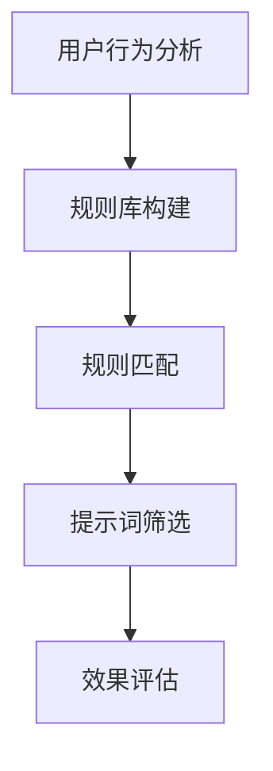
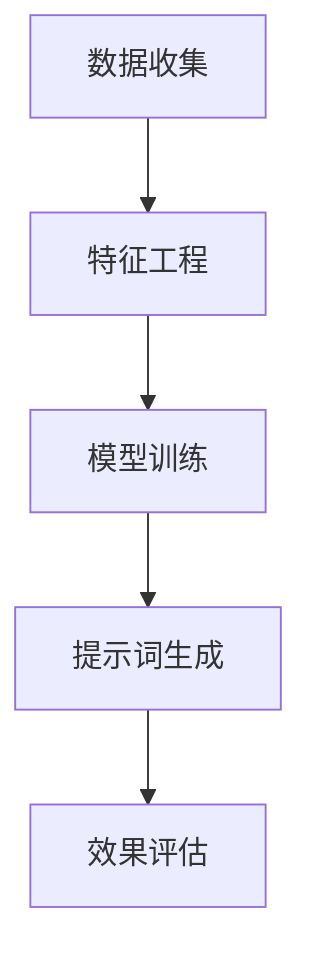
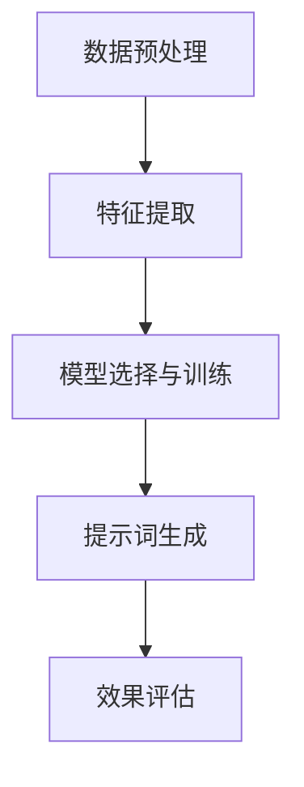
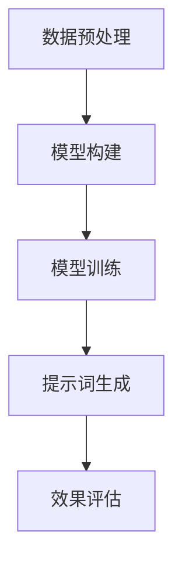

                 

### 第3章：算法原理与数学模型

#### 3.1 提示词优化算法概述

### 3.1.1 基本原理

提示词优化算法的基本原理是通过分析用户查询行为和内容，调整和改进提示词，从而提高信息检索和推荐系统的效果。具体来说，这个优化过程通常包括以下几个步骤：

1. **用户行为分析**：通过收集和分析用户的查询历史、点击记录等数据，了解用户的查询意图和偏好。
2. **提示词生成**：基于用户行为分析结果，生成一组可能的提示词候选集。
3. **提示词筛选与调整**：对生成的提示词进行筛选和调整，选择最合适的提示词用于实际应用。
4. **效果评估**：通过实际应用中的用户反馈和系统效果，评估提示词优化策略的有效性，并进行迭代优化。

### 3.1.2 常见算法分类

提示词优化算法可以根据其实现方式主要分为以下几类：

1. **基于规则的方法**：通过设计一系列规则来生成和调整提示词。这种方法简单直观，但灵活性较低，难以适应复杂多变的查询场景。
   
2. **基于统计的方法**：利用统计学习的方法，从用户行为数据中学习到有效的提示词生成和调整策略。这种方法具有较高的灵活性和准确性，但需要大量的训练数据和计算资源。

3. **基于机器学习的方法**：通过训练机器学习模型，自动生成和调整提示词。这种方法可以处理复杂的非线性关系，但训练过程复杂，对数据质量要求较高。

4. **基于深度学习的方法**：利用深度神经网络，实现自动化的提示词生成和调整。这种方法具有很强的表达能力和适应性，但计算资源需求较高。

#### 3.2 算法流程与实现步骤

### 3.2.1 基于规则的方法

基于规则的方法通常包括以下几个步骤：

1. **规则库构建**：根据业务需求和用户行为，设计一组规则，如“如果用户经常搜索某种类型的信息，则将其相关词汇作为提示词”。
   
2. **用户行为分析**：分析用户的查询历史和点击记录，提取出用户感兴趣的关键词和主题。
   
3. **规则匹配**：将用户行为数据与规则库进行匹配，生成一组可能的提示词候选集。

4. **提示词筛选**：根据业务需求和用户反馈，对候选集进行筛选和调整，选择最优的提示词。

以下是基于规则方法的流程图：

### 3.2.2 基于统计的方法

基于统计的方法通常包括以下几个步骤：

1. **数据收集**：收集用户的查询日志、点击记录等数据。

2. **特征工程**：从原始数据中提取出有用的特征，如关键词、查询频率、点击率等。

3. **模型训练**：利用统计学习方法（如决策树、朴素贝叶斯、线性回归等），训练一个模型来预测用户感兴趣的提示词。

4. **提示词生成**：根据模型预测结果，生成一组提示词候选集。

5. **效果评估**：通过实际应用中的用户反馈和系统效果，评估模型和提示词的效果。

以下是基于统计方法的流程图：

### 3.2.3 基于机器学习的方法

基于机器学习的方法通常包括以下几个步骤：

1. **数据预处理**：对原始数据进行清洗、预处理，如缺失值填充、数据标准化等。

2. **特征提取**：从预处理后的数据中提取出有用的特征，如文本表示、词向量等。

3. **模型选择与训练**：选择合适的机器学习模型（如SVM、随机森林、神经网络等），进行模型训练。

4. **提示词生成**：根据训练好的模型，生成一组提示词候选集。

5. **效果评估**：通过实际应用中的用户反馈和系统效果，评估模型和提示词的效果。

以下是基于机器学习方法的流程图：

### 3.2.4 基于深度学习的方法

基于深度学习的方法通常包括以下几个步骤：

1. **数据预处理**：对原始数据进行清洗、预处理，如文本清洗、分词、嵌入等。

2. **模型构建**：构建一个深度神经网络模型，如循环神经网络（RNN）、卷积神经网络（CNN）、 Transformer等。

3. **模型训练**：利用大量的用户行为数据进行模型训练，调整模型的参数。

4. **提示词生成**：通过训练好的模型，生成一组提示词候选集。

5. **效果评估**：通过实际应用中的用户反馈和系统效果，评估模型和提示词的效果。

以下是基于深度学习方法的部分流程图：

### 3.3 提示词优化算法的数学模型与公式

#### 3.3.1 基于规则的数学模型

假设我们有一组规则 \( R = \{ r_1, r_2, ..., r_n \} \)，每条规则 \( r_i \) 可以表示为 \( r_i = \text{条件} \rightarrow \text{操作} \)。

- **条件**：表示用户行为的特征集合，如“用户查询次数超过10次”。
- **操作**：表示对提示词的调整方法，如“增加用户经常查询的词汇”。

规则匹配的数学公式可以表示为：

\[ \text{matched\_rules} = \{ r_i \mid \text{condition}(r_i) \land \text{action}(r_i) \} \]

其中，\( \text{matched\_rules} \) 是匹配成功的规则集合。

#### 3.3.2 基于统计的数学模型

假设我们有一组特征 \( F = \{ f_1, f_2, ..., f_m \} \)，每条特征可以表示为 \( f_i = \text{attribute} \rightarrow \text{value} \)。

- **attribute**：表示特征的类型，如“关键词频率”。
- **value**：表示特征的具体值，如“关键词频率为5”。

统计模型的预测公式可以表示为：

\[ \text{predicted\_prompt} = \text{fitted\_model}(F) \]

其中，\( \text{fitted\_model} \) 是训练好的统计模型，\( \text{predicted\_prompt} \) 是生成的预测提示词。

#### 3.3.3 基于机器学习的数学模型

假设我们有一组特征 \( F \) 和对应的标签 \( L \)，机器学习模型的预测公式可以表示为：

\[ \text{predicted\_prompt} = \text{model}(F; \theta) \]

其中，\( \text{model} \) 是机器学习模型，\( \theta \) 是模型的参数。

#### 3.3.4 基于深度学习的数学模型

假设我们有一组文本特征 \( X \)，深度学习模型的预测公式可以表示为：

\[ \text{predicted\_prompt} = \text{model}(X; \theta) \]

其中，\( \text{model} \) 是深度学习模型，\( \theta \) 是模型的参数。

### 3.4 通俗易懂的举例说明

为了更好地理解提示词优化算法的原理和数学模型，下面通过一个简单的例子来说明。

#### 例子：基于规则的提示词优化

假设我们有以下两条规则：

1. 如果用户查询次数超过10次，则将用户经常查询的词汇作为提示词。
2. 如果用户最近一周查询某个关键词超过5次，则将该关键词作为提示词。

现在，用户“张三”的查询历史如下：

- 查询“旅游”10次
- 查询“酒店”8次
- 查询“景点”5次

根据规则，我们可以生成以下提示词：

- 旅游：由于“旅游”是用户查询次数最多的词汇，所以“旅游”被选为提示词。
- 酒店：由于“酒店”是用户最近一周查询次数最多的词汇，所以“酒店”被选为提示词。

#### 例子：基于统计的提示词优化

假设我们有一组用户查询数据和对应的点击率数据：

- 查询“旅游”10次，点击率0.5
- 查询“酒店”8次，点击率0.6
- 查询“景点”5次，点击率0.7

我们可以使用线性回归模型来预测提示词的点击率。假设线性回归模型的表达式为：

\[ \text{click\_rate} = \theta_0 + \theta_1 \times \text{query\_count} + \theta_2 \times \text{click\_rate} \]

通过训练数据，我们可以得到模型的参数：

\[ \theta_0 = 0.1, \theta_1 = 0.2, \theta_2 = 0.3 \]

现在，对于用户“李四”的查询历史：

- 查询“旅游”15次，点击率预测为 \( 0.1 + 0.2 \times 15 + 0.3 \times 0.5 = 1.6 \)
- 查询“酒店”10次，点击率预测为 \( 0.1 + 0.2 \times 10 + 0.3 \times 0.6 = 1.5 \)
- 查询“景点”20次，点击率预测为 \( 0.1 + 0.2 \times 20 + 0.3 \times 0.7 = 2.1 \)

根据点击率预测，我们可以选择“景点”作为提示词。

#### 例子：基于机器学习的提示词优化

假设我们使用随机森林模型来预测提示词。随机森林模型由多个决策树组成，每个决策树都可以预测一个提示词。对于用户“王五”的查询历史：

- 查询“旅游”20次，随机森林预测提示词为“旅游”
- 查询“酒店”15次，随机森林预测提示词为“酒店”
- 查询“景点”10次，随机森林预测提示词为“景点”

根据多个决策树的预测结果，我们可以选择出现次数最多的提示词作为最终的提示词，即“旅游”。

### 3.5 本章小结

本章详细介绍了提示词优化算法的基本原理、实现步骤、数学模型以及通俗易懂的举例说明。通过本章的学习，读者可以全面了解提示词优化的各个方面，为后续章节的深入探讨打下坚实基础。下一章我们将继续探讨如何在实际项目中应用这些算法，实现高效的提示词优化。

