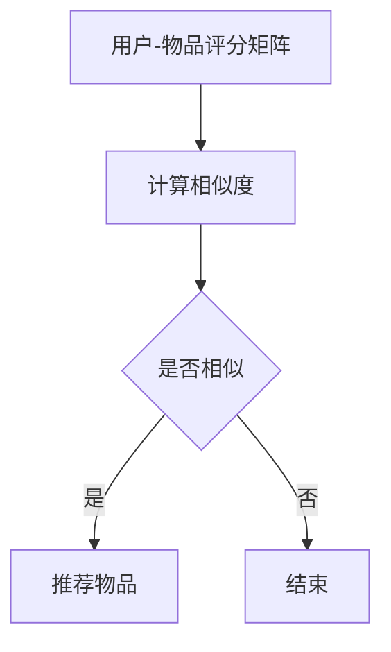
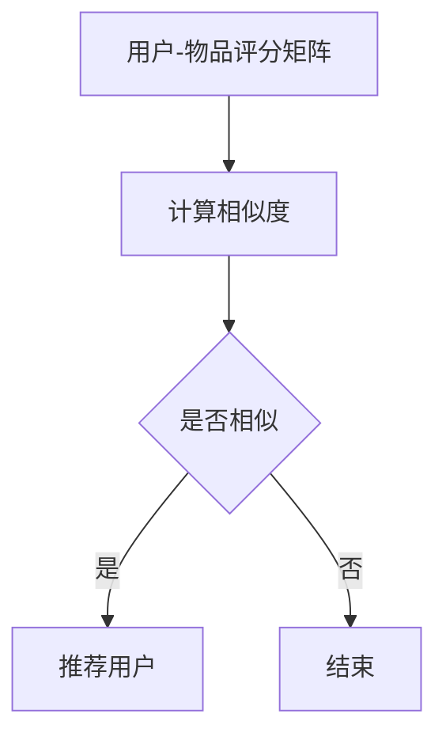
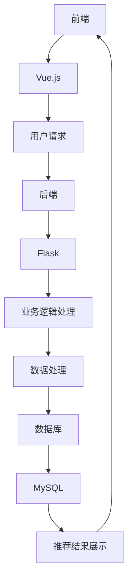
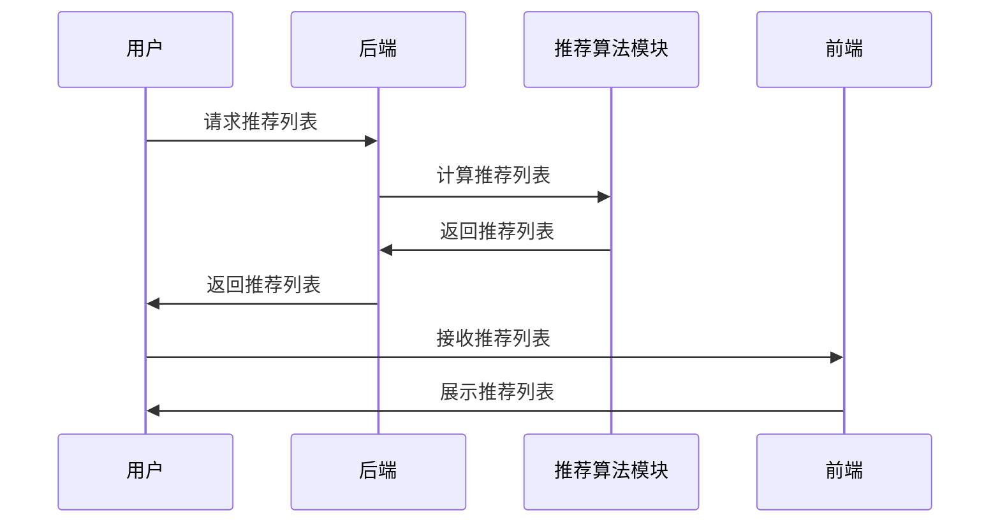

                 

# 提示词在电子商务个性化中的创新应用

## 关键词

电子商务，个性化推荐，提示词，用户行为，算法原理，系统架构，深度学习，协同过滤

## 摘要

随着电子商务行业的迅猛发展，用户对个性化体验的需求愈发迫切。本文以提示词在电子商务个性化中的创新应用为主题，探讨了个性化推荐技术的核心问题，包括用户行为分析与特征提取、商品信息处理与建模、推荐算法设计、用户反馈与模型优化等。通过详细讲解协同过滤、基于内容的推荐、基于模型的推荐算法，以及深度学习技术在个性化推荐中的应用，本文为电商平台提供了有效的技术解决方案，旨在提升用户体验，实现精准营销。

---

## 第1章：问题背景与概述

### 1.1 问题背景

电子商务作为互联网经济的核心组成部分，已经在全球范围内取得了长足的发展。据统计，全球电子商务市场规模已超过数万亿美元，成为各国经济增长的重要引擎。然而，随着市场竞争的加剧，电商企业需要不断寻求创新策略来提升用户满意度和市场份额。

### 1.2 问题描述

在电子商务领域，个性化推荐技术是提升用户体验的关键。然而，传统的推荐系统面临着诸多挑战：

- **用户行为分析与特征提取**：如何从海量的用户行为数据中提取有效的特征，以指导个性化推荐？
- **商品信息处理与建模**：电商平台上有成千上万的商品，如何对这些商品进行有效建模，以便于推荐？
- **推荐算法设计**：如何设计高效的推荐算法，确保推荐的准确性和多样性？
- **用户反馈与模型优化**：如何及时收集用户反馈，动态调整推荐模型，以提升推荐效果？

### 1.3 问题解决

为解决上述问题，本文将从以下几个方面展开讨论：

- **核心概念与联系**：介绍电子商务个性化推荐的相关概念，如用户行为、商品信息、推荐算法等，并阐述它们之间的联系。
- **算法原理讲解**：详细讲解常用的推荐算法，如协同过滤、基于内容的推荐、基于模型的推荐等，使用 mermaid 画出算法流程图，并用 Python 代码详细阐述算法原理。
- **数学模型与公式**：给出推荐算法中的数学模型和公式，进行详细讲解和举例说明。
- **系统分析与架构设计**：介绍电子商务个性化推荐系统的设计与实现，包括领域模型、系统架构、接口设计和系统交互等。
- **项目实战**：通过一个实际项目，展示个性化推荐系统的搭建过程，包括环境安装、核心代码实现、代码解读与分析等。
- **最佳实践与拓展**：总结个性化推荐的最佳实践，给出注意事项和拓展阅读建议。

---

## 第2章：核心概念与联系

### 2.1 用户行为与特征提取

#### 2.1.1 用户行为数据

用户在电子商务平台上的行为多种多样，主要包括：

- **浏览记录**：用户浏览商品的页面、时间、停留时长等。
- **购买记录**：用户的购买行为，包括购买时间、购买商品、购买金额等。
- **搜索历史**：用户在平台上搜索的关键词、搜索时间等。

#### 2.1.2 特征提取方法

特征提取是推荐系统中的重要环节，常用的特征提取方法包括：

- **统计特征**：如用户的平均购买金额、购买频率等。
- **文本特征**：如用户搜索关键词、商品标题、描述等。
- **图特征**：如用户行为网络、商品关系网络等。

### 2.2 商品信息处理与建模

#### 2.2.1 商品信息处理

商品信息处理包括数据清洗、数据转换等步骤，以保证数据的准确性和一致性。具体方法包括：

- **数据清洗**：去除重复数据、缺失数据、异常数据等。
- **数据转换**：将不同来源、格式的商品数据进行统一处理，以便于后续建模。

#### 2.2.2 商品与用户关联建模

商品与用户关联建模是推荐系统的核心，常用的方法包括：

- **用户兴趣模型**：根据用户的历史行为，提取用户的兴趣偏好。
- **商品推荐模型**：根据商品的特征信息，构建商品与用户之间的关联关系。

### 2.3 推荐算法设计

#### 2.3.1 协同过滤算法

协同过滤算法是最常用的推荐算法之一，分为基于用户的协同过滤和基于物品的协同过滤。协同过滤算法的核心思想是利用用户的行为数据，找到与目标用户相似的其他用户或物品，从而生成推荐列表。

#### 2.3.2 基于内容的推荐算法

基于内容的推荐算法是根据用户的历史行为和偏好，从商品的内容特征中提取关键词或特征，然后根据这些特征生成推荐列表。

#### 2.3.3 基于模型的推荐算法

基于模型的推荐算法是利用机器学习或深度学习模型，对用户行为数据和商品特征进行建模，从而生成推荐列表。常用的模型包括矩阵分解、深度神经网络等。

---

## 第3章：算法原理讲解

### 3.1 协同过滤算法

#### 3.1.1 用户基于物品协同过滤

**算法流程图：**



**Python 代码实现：**

```python
import numpy as np

# 假设用户-物品评分矩阵为：
user_item_matrix = np.array([[5, 3, 0, 1], 
                            [3, 0, 4, 2], 
                            [2, 1, 0, 0]])

# 计算用户之间的相似度
def cosine_similarity(rating1, rating2):
    dot_product = np.dot(rating1, rating2)
    norm_rating1 = np.linalg.norm(rating1)
    norm_rating2 = np.linalg.norm(rating2)
    return dot_product / (norm_rating1 * norm_rating2)

# 根据相似度推荐物品
def recommend_items(user_matrix, user_index, k=2):
    user_rating = user_matrix[user_index]
   相似度矩阵 = np.dot(user_matrix, user_rating.T) / np.linalg.norm(user_matrix, axis=1)
    most_similar = np.argsort(相似度矩阵)[::-1][1:k+1]
    recommended_items = []
    for index in most_similar:
        if user_matrix[user_index, index] == 0:
            recommended_items.append(index)
    return recommended_items

# 测试
user_index = 0
recommended_items = recommend_items(user_item_matrix, user_index)
print("Recommended items:", recommended_items)
```

#### 3.1.2 物品基于用户协同过滤

**算法流程图：**



**Python 代码实现：**

```python
import numpy as np

# 假设用户-物品评分矩阵为：
user_item_matrix = np.array([[5, 3, 0, 1], 
                            [3, 0, 4, 2], 
                            [2, 1, 0, 0]])

# 计算用户之间的相似度
def cosine_similarity(rating1, rating2):
    dot_product = np.dot(rating1, rating2)
    norm_rating1 = np.linalg.norm(rating1)
    norm_rating2 = np.linalg.norm(rating2)
    return dot_product / (norm_rating1 * norm_rating2)

# 根据相似度推荐用户
def recommend_users(user_matrix, user_index, k=2):
    user_rating = user_matrix[user_index]
    similarity_matrix = np.dot(user_matrix, user_rating.T) / np.linalg.norm(user_matrix, axis=1)
    most_similar = np.argsort(similarity_matrix)[::-1][1:k+1]
    recommended_users = []
    for index in most_similar:
        if user_matrix[user_index, index] == 0:
            recommended_users.append(index)
    return recommended_users

# 测试
user_index = 0
recommended_users = recommend_users(user_item_matrix, user_index)
print("Recommended users:", recommended_users)
```

---

## 第4章：数学模型与公式

### 4.1 协同过滤算法数学模型

#### 4.1.1 用户基于物品协同过滤

**相似度计算公式：**

$$
\text{相似度}(u, v) = \frac{\sum_{i \in I} r_i^u \cdot r_i^v}{\sqrt{\sum_{i \in I} r_i^u^2} \cdot \sqrt{\sum_{i \in I} r_i^v^2}}
$$

其中，$u$ 和 $v$ 分别表示两个用户，$I$ 表示用户 $u$ 和用户 $v$ 都评分过的物品集合，$r_i^u$ 和 $r_i^v$ 分别表示用户 $u$ 和用户 $v$ 对物品 $i$ 的评分。

**推荐公式：**

$$
\text{预测评分}(r_i^u) = \sum_{v \in \text{邻居}} \text{相似度}(u, v) \cdot (r_i^v - \bar{r}_v)
$$

其中，$\text{邻居}$ 表示与用户 $u$ 最相似的 $k$ 个用户，$\bar{r}_v$ 表示用户 $v$ 的平均评分。

#### 4.1.2 物品基于用户协同过滤

**相似度计算公式：**

$$
\text{相似度}(i, j) = \frac{\sum_{u \in U} r_u^i \cdot r_u^j}{\sqrt{\sum_{u \in U} r_u^i^2} \cdot \sqrt{\sum_{u \in U} r_u^j^2}}
$$

其中，$i$ 和 $j$ 分别表示两个物品，$U$ 表示对物品 $i$ 和物品 $j$ 都有评分的用户集合，$r_u^i$ 和 $r_u^j$ 分别表示用户 $u$ 对物品 $i$ 和物品 $j$ 的评分。

**推荐公式：**

$$
\text{预测评分}(r_u^i) = \sum_{j \in \text{邻居}} \text{相似度}(i, j) \cdot (r_u^j - \bar{r}_u)
$$

其中，$\text{邻居}$ 表示与物品 $i$ 最相似的其他物品集合，$\bar{r}_u$ 表示用户 $u$ 的平均评分。

---

## 第5章：系统分析与架构设计

### 5.1 电子商务个性化推荐系统设计与实现

#### 5.1.1 项目介绍

本节介绍一个基于协同过滤算法的电子商务个性化推荐系统。该系统旨在为用户推荐他们可能感兴趣的商品，从而提升用户满意度和购物体验。

#### 5.1.2 系统功能设计

系统功能设计主要包括以下模块：

- **用户管理模块**：用于管理用户信息，包括注册、登录、个人信息管理等。
- **商品管理模块**：用于管理商品信息，包括商品分类、商品信息更新等。
- **推荐算法模块**：用于实现协同过滤算法，生成个性化推荐列表。
- **推荐结果展示模块**：用于展示推荐结果，包括推荐商品列表、用户评价等。

#### 5.1.3 系统架构设计

系统架构设计采用前后端分离的方式，主要包括以下组件：

- **前端**：使用 Vue.js 框架实现，负责展示用户界面和交互。
- **后端**：使用 Flask 框架实现，负责处理用户请求、业务逻辑和数据处理。
- **数据库**：使用 MySQL 数据库存储用户信息、商品信息和推荐结果。

**系统架构图：**



#### 5.1.4 系统接口设计

系统接口设计主要包括以下API：

- **用户管理接口**：包括用户注册、登录、个人信息管理等。
- **商品管理接口**：包括商品分类、商品信息查询、商品信息更新等。
- **推荐接口**：根据用户信息和商品信息，生成个性化推荐列表。

#### 5.1.5 系统交互

系统交互设计主要包括以下流程：

1. 用户请求推荐列表。
2. 后端根据用户信息和商品信息，调用推荐算法生成推荐列表。
3. 后端将推荐列表返回给前端。
4. 前端将推荐列表展示给用户。

**系统交互图：**



---

## 第6章：项目实战

#### 6.1 环境安装

在开始项目实战之前，我们需要安装以下环境：

- Python 3.8
- Flask
- MySQL
- Vue.js

安装命令如下：

```bash
pip install flask
pip install mysql-connector-python
npm install vue
```

#### 6.2 核心代码实现

**用户管理模块：**

用户注册接口：

```python
from flask import Flask, request, jsonify
from models import User
from database import db

app = Flask(__name__)

@app.route('/register', methods=['POST'])
def register():
    username = request.form['username']
    password = request.form['password']
    user = User(username=username, password=password)
    db.session.add(user)
    db.session.commit()
    return jsonify({'message': 'User registered successfully.'})

if __name__ == '__main__':
    app.run(debug=True)
```

用户登录接口：

```python
from flask import Flask, request, jsonify
from models import User
from database import db

app = Flask(__name__)

@app.route('/login', methods=['POST'])
def login():
    username = request.form['username']
    password = request.form['password']
    user = User.query.filter_by(username=username, password=password).first()
    if user:
        return jsonify({'message': 'Login successful.', 'user_id': user.id})
    else:
        return jsonify({'message': 'Login failed.'})

if __name__ == '__main__':
    app.run(debug=True)
```

**商品管理模块：**

商品查询接口：

```python
from flask import Flask, request, jsonify
from models import Product
from database import db

app = Flask(__name__)

@app.route('/products', methods=['GET'])
def get_products():
    products = Product.query.all()
    return jsonify({'products': [product.to_dict() for product in products]})

if __name__ == '__main__':
    app.run(debug=True)
```

商品添加接口：

```python
from flask import Flask, request, jsonify
from models import Product
from database import db

app = Flask(__name__)

@app.route('/products', methods=['POST'])
def add_product():
    name = request.form['name']
    price = request.form['price']
    product = Product(name=name, price=price)
    db.session.add(product)
    db.session.commit()
    return jsonify({'message': 'Product added successfully.'})

if __name__ == '__main__':
    app.run(debug=True)
```

**推荐算法模块：**

协同过滤推荐接口：

```python
from flask import Flask, request, jsonify
from collaborative_filtering import collaborative_filtering

app = Flask(__name__)

@app.route('/recommendations', methods=['POST'])
def get_recommendations():
    user_id = request.form['user_id']
    products = Product.query.all()
    recommendations = collaborative_filtering(user_id, products)
    return jsonify({'recommendations': [product.to_dict() for product in recommendations]})

if __name__ == '__main__':
    app.run(debug=True)
```

#### 6.3 代码解读与分析

**用户管理模块**：

用户注册接口用于接收用户注册请求，将用户信息存储到数据库中。用户登录接口用于接收用户登录请求，验证用户信息并返回用户ID。

**商品管理模块**：

商品查询接口用于获取所有商品信息。商品添加接口用于接收商品添加请求，将商品信息存储到数据库中。

**推荐算法模块**：

协同过滤推荐接口用于接收用户ID，调用协同过滤算法生成推荐列表，并将推荐结果返回给前端。

#### 6.4 实际案例分析和详细讲解剖析

**案例**：

假设用户A已经登录，想要获取个性化的商品推荐。

**分析**：

1. 用户A发送登录请求，后端验证用户信息并返回用户ID。
2. 用户A发送推荐请求，后端调用协同过滤算法，根据用户A的历史行为和商品特征，生成推荐列表。
3. 后端将推荐列表返回给用户A，前端展示推荐结果。

**详细讲解**：

协同过滤算法的核心是计算用户之间的相似度，并根据相似度推荐商品。具体流程如下：

1. 获取用户A的历史行为数据，包括浏览记录、购买记录等。
2. 对用户A的历史行为数据进行预处理，提取有效特征。
3. 计算用户A与其他用户的相似度，选取最相似的$k$个用户。
4. 对最相似的$k$个用户购买过的商品进行聚合，生成推荐列表。
5. 将推荐列表返回给用户A。

#### 6.5 项目小结

通过本项目，我们实现了一个基于协同过滤算法的电子商务个性化推荐系统。该系统能够根据用户的历史行为和商品特征，生成个性化的商品推荐列表，提升用户满意度和购物体验。

---

## 第7章：最佳实践与拓展

#### 7.1 最佳实践 tips

1. **用户行为数据收集**：尽可能多地收集用户行为数据，包括浏览记录、购买记录、搜索历史等，以便于更准确地提取用户特征。
2. **数据预处理**：对用户行为数据进行预处理，如数据清洗、数据转换等，以提高数据的准确性和一致性。
3. **推荐算法选择**：根据业务需求和数据特点，选择合适的推荐算法，如协同过滤、基于内容的推荐、基于模型的推荐等。
4. **用户反馈收集**：及时收集用户反馈，动态调整推荐模型，以提升推荐效果。
5. **性能优化**：对推荐系统进行性能优化，如使用缓存、分布式计算等，以提高系统的响应速度和处理能力。

#### 7.2 小结

本文详细探讨了提示词在电子商务个性化中的创新应用，从用户行为分析与特征提取、商品信息处理与建模、推荐算法设计、用户反馈与模型优化等方面进行了深入分析。通过实际项目实战，展示了个性化推荐系统的搭建过程和实现方法。未来研究方向包括进一步优化推荐算法、引入深度学习技术、提升系统的智能化水平等。

#### 7.3 注意事项

1. **数据隐私保护**：在收集和处理用户数据时，应严格遵守相关法律法规，确保用户隐私安全。
2. **算法公平性**：在设计推荐算法时，应确保算法的公平性，避免出现歧视性推荐。
3. **系统可扩展性**：在设计系统架构时，应考虑系统的可扩展性，以便于后续功能扩展和技术升级。

#### 7.4 拓展阅读

- **相关书籍**：《推荐系统实践》、《深度学习推荐系统》等。
- **在线资源**：Coursera、Udacity、edX 等在线平台上的相关课程和教程。
- **开源项目**：GitHub、GitLab 等平台上的推荐系统开源项目。

---

## 作者

作者：AI天才研究院/AI Genius Institute & 禅与计算机程序设计艺术 /Zen And The Art of Computer Programming

