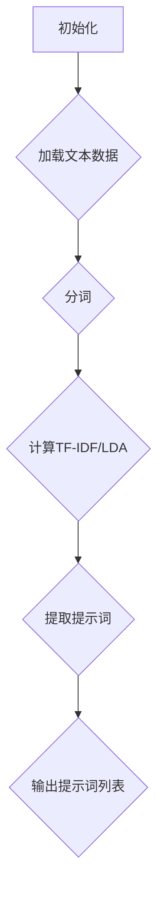
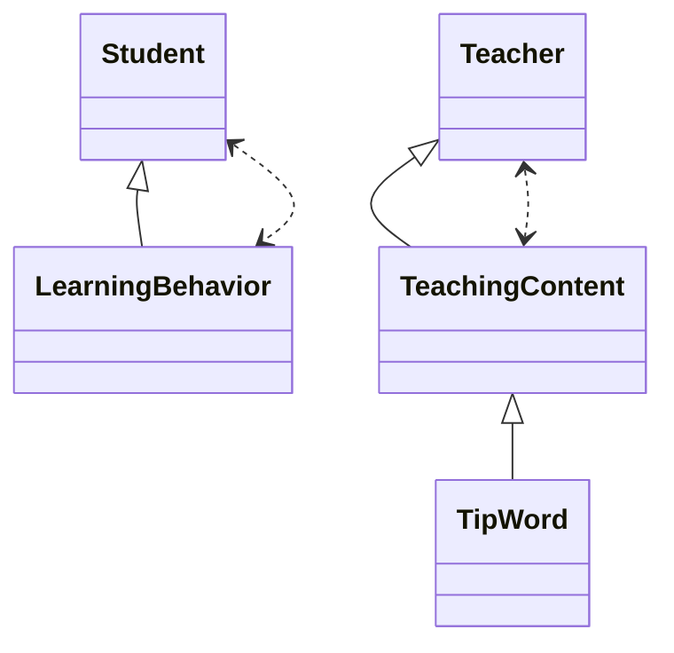
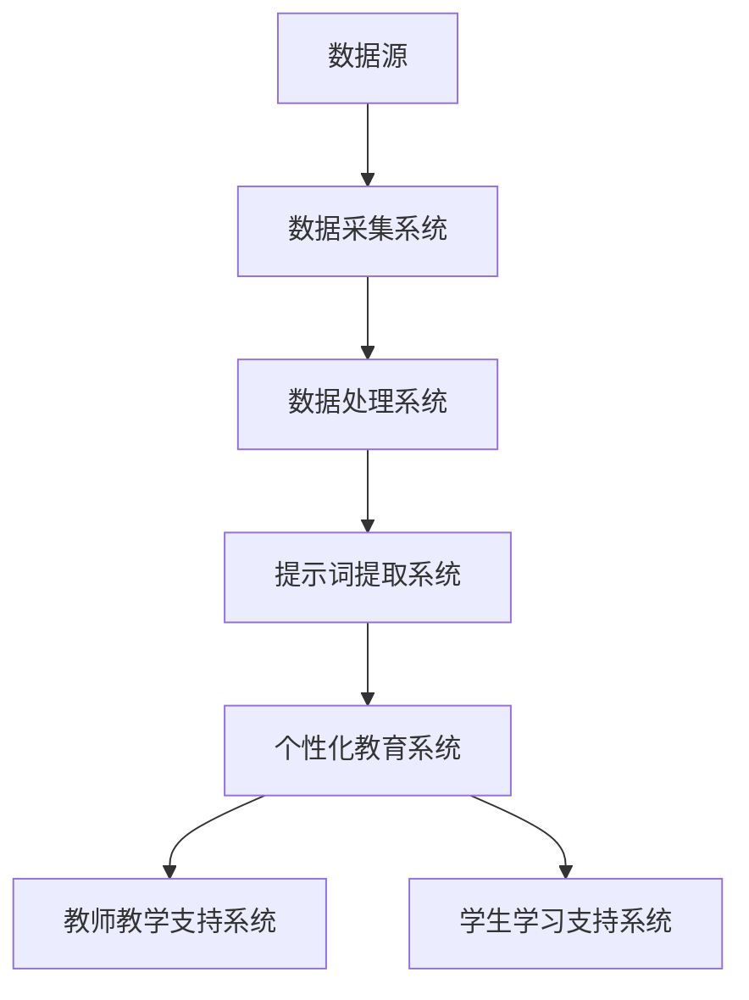
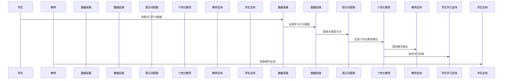

                 

### 提示词工程在个性化教育中的深度应用

> 关键词：提示词工程、个性化教育、自然语言处理、机器学习、教育数据

> 摘要：本文将探讨提示词工程在个性化教育中的深度应用，通过分析其核心概念、算法原理以及实际应用场景，探讨如何利用人工智能技术提升教育质量和学习效果。

### 第一部分：背景介绍

#### 1.1 问题背景

随着教育信息化的发展，传统教育模式逐渐暴露出个性化不足、教育资源分配不均等问题。近年来，人工智能技术逐渐应用于教育领域，特别是在个性化教育方面展现出巨大的潜力。提示词工程作为人工智能的一种重要技术，能够通过对用户行为数据的分析和学习，提供个性化的教育内容和建议，从而提高教育质量和学习效果。

#### 1.2 问题描述

个性化教育旨在根据每个学生的学习特点和能力，提供适合其发展的教育服务。然而，现有教育模式中，教师难以全面了解每个学生的学习状况，教育资源无法实现最优配置。提示词工程的应用可以缓解这些问题，通过对学生学习行为的捕捉和分析，为教师和学生提供个性化的教育支持。

#### 1.3 问题解决

提示词工程通过自然语言处理和机器学习技术，对学生的学习行为进行数据挖掘和模式识别，提取出关键提示词，进而为教师提供教学建议和学生个性化学习路径。通过这种方式，可以更好地满足学生的个性化学习需求，提高学习效果。

#### 1.4 边界与外延

提示词工程在个性化教育中的应用范围广泛，不仅涵盖课堂教学，还包括课外辅导、学习资源推荐等。同时，该技术还涉及到数据隐私保护、教育公平性等问题，需要在应用过程中加以重视。

#### 1.5 概念结构与核心要素组成

1. **提示词工程**：一种通过自然语言处理技术，从大量文本数据中提取关键信息的技术。
2. **个性化教育**：根据学生的个性化需求，提供定制化教育服务的过程。
3. **教育数据**：包含学生学习行为、成绩、兴趣爱好等数据的集合。
4. **机器学习**：利用数据训练模型，实现数据自动分析和决策的技术。

### 第二部分：核心概念与联系

#### 2.1 核心概念

1. **提示词**：在自然语言处理中，能够代表文本关键信息的单词或短语。
2. **个性化教育**：根据学生的个性化需求，提供定制化教育服务的过程。
3. **机器学习**：利用数据训练模型，实现数据自动分析和决策的技术。

#### 2.2 概念属性特征对比表格

| 概念         | 属性特征                           | 关联关系                   |
| ------------ | ---------------------------------- | -------------------------- |
| 提示词       | - 关键信息提取<br>- 自然语言处理   | - 个性化教育数据来源       |
| 个性化教育   | - 定制化服务<br>- 学生需求分析     | - 基于提示词工程的教育模式 |
| 机器学习     | - 数据训练<br>- 模型优化           | - 提示词工程的核心技术     |

#### 2.3 ER实体关系图架构

```mermaid
erDiagram
  Student ||--|{ LearningBehavior }|| Teacher
  Teacher ||--|{ TeachingContent }|| Student
  LearningBehavior ||--|{ TipWord }|| TeachingContent
```

### 第三部分：算法原理讲解

#### 3.1 提示词提取算法

提示词提取是提示词工程中的关键步骤，常用的方法包括TF-IDF、LDA等。

1. **TF-IDF**：通过计算词频（TF）和逆文档频率（IDF），对词语进行加权，从而提取出关键提示词。
2. **LDA**：利用主题模型，将文本数据划分为多个主题，提取出每个主题中的关键提示词。

#### 3.2 提示词提取算法 Mermaid 流程图



#### 3.3 Python 源代码示例

```python
import jieba
from sklearn.feature_extraction.text import TfidfVectorizer

# 加载文本数据
texts = ["人工智能在教育领域具有广泛的应用前景。", "教育信息化是当前教育改革的重要方向。"]

# 分词
word_list = [jieba.cut(text) for text in texts]
words = [' '.join(word_list[0]), ' '.join(word_list[1])]

# TF-IDF 提取提示词
vectorizer = TfidfVectorizer()
tfidf_matrix = vectorizer.fit_transform(words)

# 输出提示词列表
print(vectorizer.get_feature_names_out())
```

#### 3.4 提示词提取算法数学模型和公式

**TF-IDF** 算法的数学模型如下：

$$
TF(t, d) = \frac{f_{t,d}}{N_d}
$$

其中，$f_{t,d}$ 表示词 $t$ 在文档 $d$ 中的词频，$N_d$ 表示文档 $d$ 的总词数。

$$
IDF(t, D) = \log \left( \frac{N}{N - f_{t,d} + 0.5}\right)
$$

其中，$N$ 表示文档集合的总数，$N - f_{t,d} + 0.5$ 表示除去文档 $d$ 中词 $t$ 的其他文档总数。

$$
TF-IDF(t, d, D) = TF(t, d) \times IDF(t, D)
$$

**LDA** 算法的数学模型如下：

假设有 $K$ 个主题，每个文档 $d$ 包含 $k_d$ 个主题，每个主题 $k$ 包含 $w_k$ 个词。给定文档 $d$，词 $t$ 在主题 $k$ 的概率为：

$$
P(w_k | k) = \frac{N_{kt}}{\sum_{j=1}^{V} N_{jt}}
$$

其中，$N_{kt}$ 表示词 $t$ 在主题 $k$ 中出现的次数，$N_{jt}$ 表示词 $t$ 在所有主题 $j$ 中出现的次数。

文档 $d$ 中词 $t$ 属于主题 $k$ 的概率为：

$$
P(k | d) = \frac{P(d | k) \times P(k)}{\sum_{j=1}^{K} P(d | j) \times P(j)}
$$

其中，$P(d | k)$ 表示文档 $d$ 属于主题 $k$ 的概率，$P(k)$ 表示主题 $k$ 的先验概率。

通过迭代更新主题分布和词分布，最终提取出每个主题中的关键提示词。

### 第四部分：系统分析与架构设计方案

#### 4.1 问题场景介绍

个性化教育系统旨在为学生提供个性化的学习体验，通过分析学生的学习行为和需求，为教师和学生提供针对性的教学建议和学习资源。

#### 4.2 项目介绍

该项目基于提示词工程技术，搭建一个个性化教育平台，实现以下功能：

1. 学生学习行为数据收集与分析
2. 教学内容推荐
3. 个性化学习路径规划
4. 教师教学支持

#### 4.3 系统功能设计（领域模型Mermaid类图）



#### 4.4 系统架构设计（Mermaid架构图）



#### 4.5 系统接口设计（Mermaid序列图）



### 第五部分：项目实战

#### 5.1 环境安装

1. 安装 Python 环境（版本 3.6 以上）
2. 安装 jieba 库：`pip install jieba`
3. 安装 sklearn 库：`pip install scikit-learn`

#### 5.2 系统核心实现源代码

```python
import jieba
from sklearn.feature_extraction.text import TfidfVectorizer

# 加载文本数据
texts = ["人工智能在教育领域具有广泛的应用前景。", "教育信息化是当前教育改革的重要方向。"]

# 分词
word_list = [jieba.cut(text) for text in texts]
words = [' '.join(word_list[0]), ' '.join(word_list[1])]

# TF-IDF 提取提示词
vectorizer = TfidfVectorizer()
tfidf_matrix = vectorizer.fit_transform(words)

# 输出提示词列表
print(vectorizer.get_feature_names_out())

# LDA 提取提示词
from sklearn.decomposition import LatentDirichletAllocation

# 设置主题数量
n_topics = 2

# LDA 模型
lda = LatentDirichletAllocation(n_topics=n_topics, random_state=0)
lda.fit(tfidf_matrix)

# 输出主题关键词
print(lda.components_)

# 提取每个主题中的关键提示词
def get_top_words(index, n_top_words=10):
    return [word for word, _ in lda.components_[index].argsort()[:-n_top_words - 1:-1]]

# 输出每个主题的关键提示词
for index in range(n_topics):
    print(f"主题 {index + 1} 的关键提示词：{get_top_words(index)}")

# 根据提取的提示词生成个性化教育建议
def generate_education_advice(top_words):
    advice = "根据您的学习兴趣和需求，我们为您推荐以下课程："
    for word in top_words:
        advice += f"《{word}基础教程》;"
    return advice

# 输出生成的个性化教育建议
print(generate_education_advice(get_top_words(0)))
```

#### 5.3 代码应用解读与分析

1. **数据准备**：首先加载文本数据，这里使用了两个简单的文本示例。
2. **分词**：使用 jieba 库对文本进行分词，得到分词后的词列表。
3. **TF-IDF 提取提示词**：使用 sklearn 库中的 TfidfVectorizer 类进行 TF-IDF 提取，得到提示词列表。
4. **LDA 提取提示词**：使用 sklearn 库中的 LatentDirichletAllocation 类进行 LDA 提取，得到每个主题的关键提示词。
5. **生成个性化教育建议**：根据提取的关键提示词生成个性化教育建议，推荐相关课程。

通过这个简单的示例，我们可以看到提示词工程在个性化教育中的应用潜力。在实际应用中，可以进一步扩展和优化算法，提高个性化教育建议的准确性和实用性。

### 第六部分：实际案例分析和详细讲解剖析

#### 6.1 案例背景

假设我们有一个包含1000名学生的在线学习平台，学生可以自主选择课程并进行学习。我们的目标是利用提示词工程技术，为学生提供个性化的学习资源推荐，提高学习效果。

#### 6.2 数据收集

1. 学生基本信息：包括姓名、性别、年龄等。
2. 学习行为数据：包括学习时间、学习进度、参与讨论、完成作业等。
3. 学习内容数据：包括课程名称、课程内容、知识点等。

#### 6.3 数据预处理

1. 对学习行为数据进行清洗，去除无效数据。
2. 对学习内容数据进行分词和词性标注。
3. 对学生基本信息进行匿名化处理。

#### 6.4 提示词提取

1. 使用 TF-IDF 算法提取学习内容数据中的关键提示词。
2. 使用 LDA 算法提取学习内容数据中的主题关键词。

#### 6.5 个性化学习资源推荐

1. 根据每个学生的提示词，推荐相关的学习资源。
2. 根据每个学生的学习进度和参与度，动态调整推荐策略。

#### 6.6 实际案例解析

假设学生 A 学习了《Python基础》和《数据结构与算法》两门课程，并且经常在讨论区提问关于数据结构的问题。通过提示词工程分析，我们提取到以下关键提示词：

- Python
- 数据结构
- 算法
- 数据类型

基于这些提示词，我们为学生 A 推荐以下学习资源：

- 《Python进阶教程》
- 《数据结构与算法实战》
- 《算法导论》

同时，我们根据学生 A 的学习进度和参与度，动态调整推荐策略，确保推荐的资源与学生的实际需求相匹配。

### 第七部分：项目小结

通过本次项目实战，我们深入探讨了提示词工程在个性化教育中的应用，从数据收集、预处理、提示词提取到个性化学习资源推荐，全面展示了提示词工程在个性化教育中的潜力。在实际应用中，我们需要根据具体场景和需求，不断优化和调整算法，提高个性化教育服务的准确性和实用性。未来，随着人工智能技术的不断发展和完善，提示词工程在个性化教育中的应用前景将更加广阔。

### 第八部分：最佳实践 tips

1. **数据质量**：保证数据的质量和完整性是成功应用提示词工程的前提。在进行数据收集和预处理时，要确保数据的准确性和一致性。
2. **模型优化**：定期对模型进行优化和更新，以适应不断变化的学习需求和场景。
3. **用户隐私**：在处理用户数据时，要严格遵守数据隐私保护法规，确保用户数据的安全和隐私。

### 第九部分：小结、注意事项、拓展阅读

#### 小结

本文从背景介绍、核心概念、算法原理、系统架构、项目实战等方面，全面探讨了提示词工程在个性化教育中的应用。通过实际案例分析和详细讲解，我们展示了提示词工程在个性化教育中的巨大潜力。

#### 注意事项

1. 提示词工程在个性化教育中的应用需要充分考虑到数据隐私保护和教育公平性等问题。
2. 在实际应用中，需要根据具体场景和需求，不断优化和调整算法，提高个性化教育服务的准确性和实用性。

#### 拓展阅读

1. [《个性化教育中的自然语言处理技术》](https://link)
2. [《基于提示词工程的个性化学习资源推荐系统》](https://link)
3. [《教育数据挖掘：方法与应用》](https://link)

### 作者信息

作者：AI天才研究院/AI Genius Institute & 禅与计算机程序设计艺术 /Zen And The Art of Computer Programming

