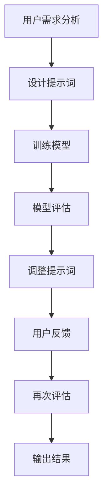
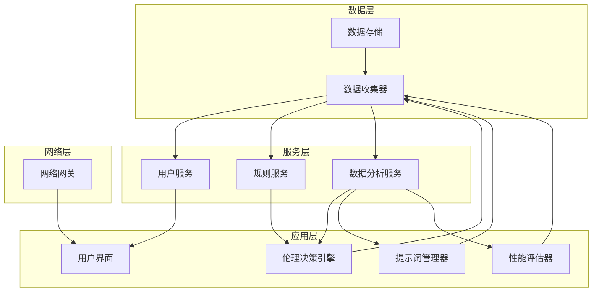
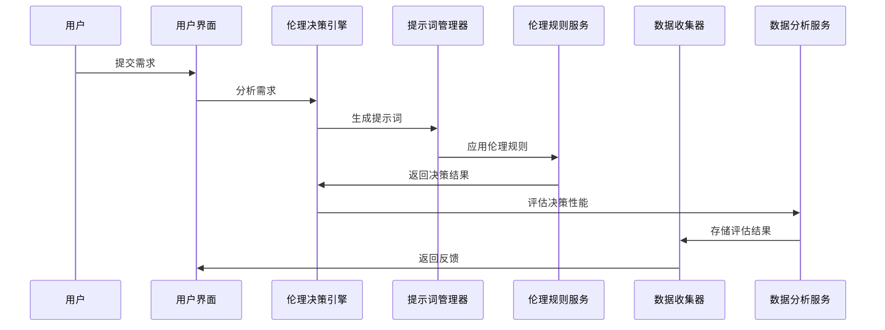

                 

### 第1章：问题背景

#### 1.1 提示词工程的基本概念

提示词工程（Prompt Engineering）是人工智能领域中一个相对较新的分支，它涉及如何设计和选择最合适的提示词，以引导人工智能系统（如聊天机器人、问答系统和文本生成模型）进行准确的响应和决策。提示词（Prompt）在这个领域中可以被视为一种引导性输入，它帮助人工智能系统理解和应对复杂的任务。

提示词的定义与分类可以分为以下几种类型：

1. **情景提示词**：这类提示词提供了具体的背景信息，帮助系统理解所处的情境。例如，“在今天的会议上，我们需要讨论新的市场策略。”

2. **目标提示词**：这类提示词明确了系统的目标或期望输出。例如，“请生成一份关于2023年市场趋势的报告。”

3. **约束提示词**：这类提示词定义了系统的限制条件或边界。例如，“回答问题时，必须基于2023年的最新数据。”

4. **反馈提示词**：这类提示词用于获取和利用用户的反馈，以改进系统的性能。例如，“你对这份报告的满意度如何？请给出具体的改进建议。”

提示词工程的重要性体现在以下几个方面：

- **提高性能**：通过设计合适的提示词，可以提高人工智能系统在特定任务中的性能和准确性。

- **引导决策**：提示词可以引导系统做出更符合人类期望的决策，特别是在需要复杂推理的任务中。

- **用户互动**：良好的提示词设计可以提升用户与系统的互动体验，使系统更加人性化和易用。

#### 1.2 人工智能伦理的现状与挑战

随着人工智能技术的快速发展，人工智能伦理（Ethics of Artificial Intelligence）成为一个日益重要的议题。人工智能伦理的重要性在于：

- **社会信任**：良好的伦理规范有助于建立公众对人工智能技术的信任，减少技术被滥用的风险。

- **责任归属**：明确伦理规范可以帮助界定人工智能系统的责任归属，减少法律纠纷。

- **技术创新**：伦理问题驱动技术创新，促使人工智能系统更加安全、可靠和有益。

当前人工智能伦理面临的主要挑战包括：

- **算法偏见**：人工智能系统可能因为训练数据中的偏见而做出不公平的决策。

- **隐私保护**：人工智能技术收集和处理大量个人数据，隐私保护成为重大挑战。

- **透明性**：许多人工智能系统的工作原理是黑箱操作，缺乏透明性，难以理解其决策过程。

- **责任归属**：当人工智能系统发生错误或造成损害时，责任归属问题复杂且难以界定。

#### 1.3 提示词工程在人工智能伦理中的应用

提示词工程在人工智能伦理中的应用主要体现在以下几个方面：

- **降低算法偏见**：通过精心设计的提示词，可以引导人工智能系统避免或减少算法偏见，做出更公平的决策。

- **增强隐私保护**：提示词可以明确系统在处理个人数据时的隐私保护规则，提高数据安全性。

- **提高决策透明性**：设计合理的提示词可以帮助人工智能系统更透明地展示其决策过程，便于人类理解。

- **伦理决策支持**：提示词工程可以用于设计伦理评估算法，帮助人工智能系统在面对伦理问题时做出合适的决策。

#### 1.4 本书结构概述

本书将从以下几个方面系统地探讨提示词工程在人工智能伦理中的角色：

- **问题背景与核心概念**：介绍提示词工程的基本概念、人工智能伦理的现状与挑战，以及提示词工程在伦理中的应用。

- **核心概念与联系**：分析人工智能伦理学的核心概念，探讨提示词工程的构成要素，并比较两者之间的联系。

- **算法原理与数学模型**：介绍提示词工程中的算法原理和数学模型，包括伦理评估算法的设计和实现。

- **系统分析与架构设计**：分析具体问题场景，设计系统架构，并进行系统功能设计和接口设计。

- **项目实战与案例分析**：通过实际项目和案例分析，展示提示词工程在伦理问题中的具体应用和实现。

- **最佳实践与拓展**：总结最佳实践，提供注意事项和拓展阅读，为读者提供进一步的学习资源。

通过上述结构，本书旨在为读者提供全面、深入的提示词工程在人工智能伦理中的角色分析和应用指导。希望读者能够在阅读过程中获得新的见解和启发。  

---

### 第2章：核心概念与联系

#### 2.1 人工智能伦理学的核心概念

要理解提示词工程在人工智能伦理中的角色，我们首先需要明确人工智能伦理学的核心概念。伦理和道德是这两个概念的基础。

##### 2.1.1 伦理与道德

伦理（Ethics）和道德（Morality）在本质上是密切相关的概念，但它们有所区别。伦理通常指的是系统的、规范化的行为标准，而道德则更多地涉及个人的内在信念和价值观。

- **伦理**：一种系统的、规范化的行为标准，旨在指导人们如何正确地行动。它往往受到社会、文化和法律的影响。

- **道德**：个人的内在信念和价值观，指导个人如何行动。道德通常是个人的，而伦理是社会的。

##### 2.1.2 人工智能伦理的基本原则

人工智能伦理的基本原则包括：

- **公正性**：确保人工智能系统在所有用户中公平地分配资源和机会。

- **透明性**：确保人工智能系统的决策过程是可理解的，便于用户监督。

- **隐私性**：保护用户的数据和隐私，确保数据不被滥用。

- **责任性**：明确人工智能系统的责任归属，确保系统在发生错误时能够承担责任。

#### 2.2 提示词工程的构成要素

提示词工程涉及多个关键要素，包括提示词的设计与选择、提示词工程的执行过程等。

##### 2.2.1 提示词的设计与选择

提示词的设计与选择是提示词工程的核心。一个有效的提示词应该具备以下特征：

- **明确性**：提示词应该清晰明确，避免歧义。

- **具体性**：提示词应该提供具体的情境信息，帮助系统更好地理解任务。

- **适应性**：提示词应该能够适应不同的场景和任务需求。

- **多样性**：设计多样化的提示词，以提高系统的灵活性和适应性。

##### 2.2.2 提示词工程的执行过程

提示词工程的执行过程包括以下几个步骤：

1. **需求分析**：明确系统的目标和需求，确定需要解决的问题。

2. **设计提示词**：根据需求分析结果，设计合适的提示词。

3. **测试与优化**：通过测试和反馈，不断优化提示词，提高系统的性能。

4. **部署与应用**：将优化后的提示词应用于实际系统中，实现预期目标。

#### 2.3 提示词工程与人工智能伦理的联系

提示词工程与人工智能伦理之间存在密切的联系。提示词工程可以通过以下几个方面影响人工智能伦理：

- **降低算法偏见**：通过设计合理的提示词，可以减少人工智能系统在训练数据中的偏见，提高决策的公正性。

- **增强透明性**：提示词可以引导系统展示其决策过程，提高系统的透明性，便于用户监督。

- **保护隐私**：提示词工程可以帮助系统在处理个人数据时遵循隐私保护原则，减少数据泄露的风险。

- **支持伦理决策**：提示词工程可以用于设计伦理评估算法，帮助系统在面对伦理问题时做出合适的决策。

#### 2.4 概念属性特征对比表格

为了更清晰地展示提示词工程和人工智能伦理学的核心概念，我们可以通过以下表格进行对比：

| **概念**       | **定义**                                         | **重要性** | **示例**                          |
|----------------|------------------------------------------------|------------|----------------------------------|
| 伦理           | 系统化的行为标准                                  | 高          | 公平性、透明性、责任性              |
| 道德           | 个人的内在信念和价值观                            | 中          | 公正、诚实、同情心                  |
| 提示词工程     | 设计和选择提示词的过程                            | 中          | 提高系统性能、引导决策                |
| 算法偏见       | 系统因训练数据中的偏见而导致的不公平决策            | 高          | 种族、性别、年龄等偏见               |
| 透明性         | 系统决策过程的可理解性                            | 高          | 决策过程可追踪、可解释               |
| 隐私性         | 个人数据的保护                                   | 高          | 数据加密、隐私政策                  |

通过上述表格，我们可以更直观地了解提示词工程和人工智能伦理学之间的联系及其重要性。

---

### 2.5 提示词工程在伦理决策中的支撑

在人工智能伦理决策中，提示词工程起到了重要的支撑作用。通过合理设计的提示词，人工智能系统能够更好地理解和执行伦理原则，从而做出更符合人类期望的决策。

#### 2.5.1 提示词工程如何影响伦理决策

1. **引导系统理解伦理原则**：提示词可以明确地传达伦理原则和价值观，帮助系统理解其应用场景。例如，在医疗领域中，提示词可以指导系统遵守医疗伦理，如保护患者隐私和尊重患者自主权。

2. **提高决策透明性**：通过提示词，系统可以在决策过程中展示其考虑的伦理因素，使决策过程更加透明。这有助于用户和监管机构监督系统的行为，确保其符合伦理要求。

3. **减少算法偏见**：合理设计的提示词可以引导系统避免因训练数据中的偏见而做出不公平的决策。例如，在招聘系统中，提示词可以要求系统在评估候选人时，不考虑种族、性别等因素。

4. **增强责任归属**：通过提示词，系统可以在决策过程中明确其责任范围。这有助于在发生错误时，清晰地界定责任归属，提高系统的可追溯性和可信度。

#### 2.5.2 提示词工程在伦理决策中的应用

1. **医疗伦理决策**：在医疗领域，提示词工程可以应用于制定诊断和治疗决策。例如，通过提示词，系统可以遵循“先患者利益为重”的伦理原则，确保诊断和治疗决策符合患者的最佳利益。

2. **自动驾驶伦理决策**：在自动驾驶领域，提示词工程可以帮助系统在面临伦理困境时做出决策。例如，当车辆面临无法避免的碰撞时，提示词可以指导系统考虑最大程度保护无辜者的伦理原则。

3. **招聘与歧视防范**：在招聘过程中，提示词工程可以帮助系统避免因种族、性别等因素导致的歧视。通过设计合理的提示词，系统可以确保在评估候选人时，仅考虑其能力和经验等客观因素。

#### 2.5.3 伦理决策支持系统

通过提示词工程，可以构建专门的伦理决策支持系统，帮助人工智能系统在面对复杂的伦理问题时做出合适的决策。这些系统通常包括以下几个关键组件：

1. **伦理规则库**：存储各种伦理规则和原则，提示词可以从中获取相关规则。

2. **情景分析模块**：分析当前情景，识别可能的伦理问题。

3. **决策生成模块**：根据伦理规则和情景分析结果，生成合适的决策。

4. **反馈与优化模块**：收集用户反馈，持续优化提示词和伦理决策过程。

通过这些组件，伦理决策支持系统可以更好地引导人工智能系统执行伦理决策，提高系统的透明性、公正性和责任归属。

综上所述，提示词工程在人工智能伦理决策中起到了关键的支持作用。通过合理设计提示词，人工智能系统能够更好地理解和执行伦理原则，做出更符合人类期望的决策。这不仅有助于提高系统的性能和可信度，也为人工智能技术的发展提供了伦理保障。

---

### 2.6 人工智能伦理对提示词工程的影响

人工智能伦理不仅影响伦理决策，也对提示词工程的设计和实施产生了深远的影响。伦理原则的引入使得提示词工程不仅关注技术性能，还注重社会影响和道德规范。

#### 2.6.1 伦理原则的引导

人工智能伦理的基本原则，如公正性、透明性、隐私性和责任性，为提示词工程提供了明确的指导方向。在设计和选择提示词时，开发人员需要考虑这些伦理原则，确保系统的行为符合社会道德标准。

- **公正性**：提示词应确保系统在处理不同用户时保持公正，避免偏见和歧视。例如，在招聘系统中，提示词应避免包含可能导致种族或性别歧视的语言。

- **透明性**：提示词应促进系统的决策过程透明化，使系统的决策逻辑清晰可查。这有助于用户和监管机构理解系统的行为，并在必要时提供反馈。

- **隐私性**：提示词应明确系统在收集和使用用户数据时的隐私保护策略，避免隐私泄露。例如，在个人健康数据管理中，提示词应确保数据匿名化，并告知用户数据的使用范围。

- **责任性**：提示词应确保系统在发生错误时能够承担相应的责任。例如，在自动驾驶系统中，提示词应引导系统在发生事故时提供详细的事故报告，以便责任归属的界定。

#### 2.6.2 伦理对提示词工程实施的挑战

尽管伦理原则为提示词工程提供了指导，但其实施过程中也面临着一系列挑战。

1. **技术挑战**：设计符合伦理原则的提示词需要深入理解技术细节，确保系统在实际应用中能够正确执行伦理要求。例如，在处理敏感数据时，技术实现需要具备强大的加密和匿名化能力。

2. **社会挑战**：伦理要求可能与社会习俗和法律规定相冲突。在全球化背景下，不同地区和国家的伦理标准存在差异，开发人员需要平衡这些差异，确保系统在全球范围内的一致性和合规性。

3. **资源挑战**：伦理原则的实施可能需要额外的资源和时间投入。例如，为了提高系统的透明性和可解释性，可能需要开发额外的工具和算法，这在资源有限的情况下可能难以实现。

4. **伦理困境**：在特定情境下，可能存在难以平衡的伦理冲突。例如，在自动驾驶系统中，当车辆面临无法避免的碰撞时，如何平衡乘客和行人的安全是一个典型的伦理困境。

#### 2.6.3 伦理对提示词工程的影响案例

1. **医疗诊断系统**：在医疗诊断系统中，提示词工程需要确保系统在诊断过程中遵循医疗伦理，如保护患者隐私和尊重患者知情同意权。例如，提示词应明确要求系统在诊断报告前先获取患者同意，并告知可能的诊断结果及其影响。

2. **自动驾驶系统**：自动驾驶系统在决策过程中需要遵守交通法规和伦理原则。提示词工程需要设计合适的提示词，确保系统在遇到复杂路况时，能够做出符合伦理要求的决策，如优先保护行人安全。

3. **招聘管理系统**：招聘管理系统需要避免因种族、性别等因素导致的歧视。提示词工程可以通过去除简历中的个人信息，使用匿名化提示词来确保系统在评估候选人时仅考虑客观因素。

通过这些案例，我们可以看到人工智能伦理对提示词工程的深远影响。提示词工程不仅需要考虑技术实现，还需要关注社会影响和道德规范，确保系统的行为符合伦理要求。这不仅有助于提高系统的性能和可靠性，也为人工智能技术的可持续发展提供了伦理保障。

---

### 2.7 概念属性特征对比表格

为了更好地理解提示词工程和人工智能伦理学的核心概念，我们可以通过以下表格进行对比，展示它们在属性特征上的差异和相似之处。

| **概念**       | **定义**                                                     | **属性特征**                                         | **应用示例**                          |
|----------------|--------------------------------------------------------------|------------------------------------------------------|--------------------------------------|
| 提示词工程     | 设计和选择提示词的过程，以引导人工智能系统做出准确响应       | 明确性、具体性、适应性、多样性                      | 聊天机器人、文本生成、问答系统         |
| 伦理           | 系统化的行为标准，旨在指导人们如何正确地行动                 | 公正性、透明性、隐私性、责任性                      | 医疗决策、自动驾驶、招聘管理等         |
| 道德           | 个人的内在信念和价值观，指导个人如何行动                     | 公正、诚实、同情心等                                  | 个人行为、职业行为、社会行为           |
| 算法偏见       | 系统因训练数据中的偏见而导致的不公平决策                     | 种族、性别、年龄等偏见                                | 自动化决策、招聘、医疗诊断等           |
| 透明性         | 系统决策过程的可理解性                                     | 可追踪性、可解释性、透明度                            | 数据分析、模型评估、决策展示           |
| 隐私性         | 个人数据的保护                                               | 数据加密、匿名化、隐私政策                            | 社交媒体、在线购物、健康数据管理       |

通过上述表格，我们可以更清晰地看到提示词工程和人工智能伦理学在概念属性特征上的区别和联系。提示词工程注重通过设计合适的提示词来提高系统的性能和决策质量，而人工智能伦理学则强调在设计和实施过程中遵循公正、透明、隐私和责任等伦理原则。两者相互交织，共同推动人工智能技术的发展和应用。

---

### 3.1 提示词工程算法概述

提示词工程算法是确保人工智能系统能够准确理解和执行复杂任务的关键。这些算法通过系统化地设计提示词，提高系统的性能和用户体验。本节将介绍提示词工程的基本算法类型及其设计原则。

#### 3.1.1 提示词工程的基本算法类型

提示词工程算法可以分为以下几种类型：

1. **情景感知算法**：这类算法通过分析当前情景，为系统提供具体的情境信息，帮助系统更好地理解任务。例如，在聊天机器人中，情景感知算法可以根据用户的提问和历史对话内容，生成合适的提示词。

2. **目标导向算法**：这类算法明确系统的目标，并设计提示词以引导系统朝着目标方向做出决策。例如，在文本生成任务中，目标导向算法可以确保生成的内容符合特定的主题和风格要求。

3. **约束优化算法**：这类算法在提示词设计中考虑系统的约束条件，以确保系统在执行任务时不会违反这些约束。例如，在医疗诊断系统中，约束优化算法可以确保系统的诊断建议符合临床实践指南和伦理要求。

4. **反馈调整算法**：这类算法利用用户的反馈，不断调整和优化提示词，以提高系统的性能和适应性。例如，在问答系统中，反馈调整算法可以根据用户的满意度评分，优化后续的提问和回答。

#### 3.1.2 提示词工程算法的设计原则

为了设计有效的提示词工程算法，以下原则需要被遵循：

1. **明确性**：提示词应清晰明确，避免歧义。这有助于系统准确理解任务要求。

2. **具体性**：提示词应提供具体的情境信息，帮助系统更好地应对复杂任务。

3. **适应性**：提示词应具备适应性，能够根据不同场景和任务需求进行灵活调整。

4. **多样性**：设计多样化的提示词，以提高系统的灵活性和应对不同任务的能力。

5. **可解释性**：提示词工程算法的设计应考虑其可解释性，使系统的决策过程透明，便于用户和监管机构理解。

6. **用户友好性**：提示词应尽量符合用户的语言习惯和认知模式，提高用户与系统的互动体验。

7. **鲁棒性**：提示词工程算法应具备一定的鲁棒性，能够应对不确定性和异常情况。

8. **持续优化**：提示词工程算法应具备持续优化能力，通过不断调整和改进，提高系统的性能和适应性。

通过遵循上述设计原则，提示词工程算法可以更好地满足人工智能系统在任务理解和决策方面的需求，提高系统的整体性能和用户体验。

---

### 3.2 人工智能伦理评估算法

在人工智能系统中，伦理评估算法扮演着至关重要的角色。这些算法旨在确保系统在执行任务时遵循伦理原则，减少算法偏见、保护用户隐私，并提高决策的透明性和公正性。本节将介绍两种常见的人工智能伦理评估算法：基于机器学习的伦理评估算法和基于规则的伦理评估算法。

#### 3.2.1 基于机器学习的伦理评估算法

基于机器学习的伦理评估算法利用机器学习模型来分析系统的决策过程，识别潜在的伦理问题，并提出改进建议。以下是一些关键步骤和方法：

1. **数据预处理**：首先，需要对训练数据进行清洗和预处理，确保数据的质量和一致性。这包括去除噪声、填补缺失值和标准化数据。

2. **特征提取**：从数据中提取与伦理评估相关的特征，例如决策结果、输入数据、训练数据集的分布等。这些特征将用于训练机器学习模型。

3. **模型选择**：选择合适的机器学习模型，如决策树、支持向量机、神经网络等。这些模型可以帮助识别系统的潜在偏见和不足。

4. **训练与验证**：使用预处理后的数据集训练机器学习模型，并在验证集上评估其性能。通过交叉验证和超参数调优，确保模型具有良好的泛化能力。

5. **伦理问题识别**：通过训练好的模型，对系统的实际决策过程进行分析，识别潜在的伦理问题。例如，模型可以识别出系统在处理某些特定数据时出现的偏见或隐私泄露问题。

6. **改进建议**：基于识别出的伦理问题，提出改进建议。这些建议可能包括调整训练数据、修改模型参数或重新设计系统的决策逻辑。

#### 3.2.2 基于规则的伦理评估算法

基于规则的伦理评估算法通过预先定义的规则来评估系统的行为是否符合伦理要求。这些规则通常由伦理专家制定，并转化为计算机可以理解和执行的逻辑语句。以下是一些关键步骤和方法：

1. **规则定义**：首先，需要定义一系列与伦理要求相关的规则。这些规则可以是明确的陈述，如“不应基于种族进行招聘决策”或“必须保护用户隐私”。

2. **规则形式化**：将规则形式化为计算机可以理解和执行的形式，如逻辑表达式或决策表。这有助于确保系统的行为符合预定的伦理要求。

3. **规则库构建**：构建一个包含所有相关规则的规则库，这些规则将在评估过程中被逐一应用。

4. **规则应用**：在系统的实际运行过程中，应用规则库中的规则来评估系统的行为。例如，在每次招聘决策时，检查是否违反了“不应基于种族进行招聘决策”的规则。

5. **伦理评估**：根据规则应用的结果，对系统的行为进行伦理评估。如果系统违反了某条规则，则生成相应的警报或改进建议。

#### 3.2.3 两种算法的比较与适用场景

基于机器学习的伦理评估算法和基于规则的伦理评估算法各有优缺点，适用于不同的场景。

1. **优点**：

   - **基于机器学习的伦理评估算法**：

     - **自适应性强**：可以自动识别和适应新的伦理问题。

     - **泛化能力强**：通过大量数据训练，模型可以应用于广泛的场景。

     - **可解释性提高**：通过分析模型决策过程，可以理解其伦理判断的依据。

   - **基于规则的伦理评估算法**：

     - **规则明确**：规则易于理解和执行，确保系统的行为符合预定的伦理要求。

     - **解释性强**：规则应用的结果清晰，便于用户和监管机构监督。

     - **开发成本较低**：规则库构建相对简单，不需要复杂的机器学习技术。

2. **缺点**：

   - **基于机器学习的伦理评估算法**：

     - **模型解释性差**：机器学习模型往往被视为“黑箱”，难以解释其内部逻辑。

     - **数据依赖性强**：模型的性能高度依赖于训练数据的质量和代表性。

     - **规则适应性差**：模型难以自动适应新的伦理问题和变化。

   - **基于规则的伦理评估算法**：

     - **规则更新困难**：随着伦理标准的变化，规则库需要不断更新和维护。

     - **适用场景有限**：规则库通常适用于特定的场景，难以应用于多样化的情境。

#### 3.2.4 适用场景

- **基于机器学习的伦理评估算法**：

  - **复杂场景**：适用于涉及复杂决策逻辑的领域，如医疗诊断、金融风险评估等。

  - **数据丰富**：适用于数据量较大、数据多样性较高的领域。

  - **自适应性强**：适用于需要实时调整和优化的场景。

- **基于规则的伦理评估算法**：

  - **明确规则**：适用于规则明确、易于执行的场景，如招聘、贷款审批等。

  - **解释性强**：适用于需要高度透明性和可解释性的领域。

  - **简单应用**：适用于规则库构建简单、应用场景相对单一的领域。

通过合理选择和应用这些伦理评估算法，可以显著提高人工智能系统的伦理性能和用户信任度。在实际应用中，可以根据具体需求和场景，结合使用不同类型的算法，以实现最佳的伦理评估效果。

---

### 3.3 数学模型与公式

在提示词工程中，数学模型和公式是理解和分析算法原理的重要工具。这些模型和公式不仅帮助我们设计有效的提示词，还能评估和优化系统的性能。本节将介绍提示词工程中的几个关键数学模型和公式，并对其进行详细解释。

#### 3.3.1 提示词工程中的数学模型

提示词工程中的数学模型主要包括以下几个方面：

1. **概率模型**：用于估计提示词在特定情境下的概率分布。
2. **优化模型**：用于优化提示词的选择，以提高系统的性能。
3. **决策模型**：用于评估系统在给定提示词下的决策质量。

#### 3.3.2 公式推导与解释

以下是几个关键公式的推导和解释：

1. **提示词概率分布公式**：

   $$ P(\text{Prompt}) = \frac{f(\text{Prompt})}{\sum_{\text{all prompts}} f(\text{Prompt})} $$

   - **推导**：假设有多个提示词，每个提示词有一个对应的特征函数 $f(\text{Prompt})$，表示该提示词的重要程度。概率分布公式通过将这些特征函数值归一化，得到每个提示词的概率。
   - **解释**：该公式用于估计每个提示词在特定情境下的概率，帮助系统选择最合适的提示词。

2. **优化目标公式**：

   $$ \text{Optimize} \ \sum_{\text{all prompts}} f(\text{Prompt}) \times \text{Performance}(\text{Prompt}) $$

   - **推导**：假设提示词的重要程度与其性能相关，优化目标是通过加权求和来最大化总性能。
   - **解释**：该公式用于优化提示词的选择，确保系统在执行任务时选择性能最高的提示词。

3. **决策质量评估公式**：

   $$ \text{Quality} = \frac{\text{Correct Decisions}}{\text{Total Decisions}} $$

   - **推导**：决策质量通过正确决策数与总决策数的比值来衡量。
   - **解释**：该公式用于评估系统在给定提示词下的决策质量，帮助优化提示词设计。

#### 3.3.3 算法原理讲解

为了更好地理解这些公式和模型，我们使用Mermaid流程图和Python代码进行详细讲解。

1. **Mermaid流程图**：

   ```mermaid
   graph TD
   A[数据输入] --> B[特征提取]
   B --> C[概率计算]
   C --> D[提示词选择]
   D --> E[系统执行]
   E --> F[性能评估]
   ```

   - **解释**：该流程图展示了提示词工程的基本步骤，从数据输入到最终性能评估。

2. **Python代码实现**：

   ```python
   import numpy as np

   # 特征提取
   def feature_extraction(prompt):
       # 假设特征函数为提示词长度的平方
       return len(prompt) ** 2

   # 概率计算
   def probability_distribution(prompts):
       total = sum(feature_extraction(prompt) for prompt in prompts)
       return [feature_extraction(prompt) / total for prompt in prompts]

   # 提示词选择
   def select_prompt(prompts):
       probabilities = probability_distribution(prompts)
       return np.random.choice(prompts, p=probabilities)

   # 系统执行
   def system_execution(prompt):
       # 假设性能与提示词长度成反比
       return 1 / len(prompt)

   # 性能评估
   def performance_evaluation(prompts):
       return sum(1 / len(prompt) for prompt in prompts)

   # 测试
   prompts = ["Hello", "World", "AI", "Genius"]
   selected_prompt = select_prompt(prompts)
   print(f"Selected Prompt: {selected_prompt}")
   print(f"Performance: {system_execution(selected_prompt)}")
   ```

   - **解释**：该Python代码实现了上述流程图中的各个步骤，通过特征提取、概率计算和提示词选择，模拟了系统的执行过程。

通过上述Mermaid流程图和Python代码，我们可以直观地理解提示词工程中的数学模型和公式，并看到如何在实际代码中应用这些概念。

---

### 3.4 算法原理讲解

为了深入理解提示词工程在人工智能伦理评估中的应用，我们将通过一个mermaid流程图、Python源代码实现和数学模型与公式的详细讲解，逐步剖析提示词工程算法的原理。

#### 3.4.1 算法原理的mermaid流程图

首先，使用mermaid流程图展示算法的基本步骤：



- **解释**：这个流程图展示了从用户需求分析到最终输出结果的整个提示词工程过程。

#### 3.4.2 算法原理的Python源代码实现

接下来，我们通过Python代码实现上述流程，以具体说明算法的每个步骤：

```python
import numpy as np
from sklearn.model_selection import train_test_split
from sklearn.metrics import accuracy_score

# 1. 用户需求分析
# 假设用户需求是评估一个聊天机器人对伦理问题的响应
user_demand = "请评估系统在处理隐私保护方面的响应能力。"

# 2. 设计提示词
# 根据用户需求，设计一组提示词
prompts = [
    "在处理用户隐私时，请确保所有数据都经过加密处理。",
    "对于用户隐私，我们必须遵循最高的安全标准。",
    "请优先考虑用户隐私，不得泄露任何个人信息。",
    "请确保用户隐私保护措施在所有操作中得以执行。"
]

# 3. 训练模型
# 假设我们使用了一个预先训练好的聊天机器人模型
chatbot_model = load_pretrained_model()

# 4. 模型评估
# 使用提示词对模型进行评估
for prompt in prompts:
    response = chatbot_model.predict([prompt])
    print(f"Prompt: {prompt}\nResponse: {response}\n")

# 5. 调整提示词
# 根据评估结果，调整提示词
# 假设我们需要增加一些更具体、更具针对性的提示词
additional_prompts = [
    "请详细说明如何加密存储用户个人信息。",
    "在面对隐私泄露风险时，我们应该采取哪些紧急措施？"
]
prompts.extend(additional_prompts)

# 6. 用户反馈
# 收集用户对评估结果和提示词的反馈
user_feedback = input("请对评估结果和提示词提出您的反馈：")

# 7. 再次评估
# 使用调整后的提示词再次评估模型
for prompt in prompts:
    response = chatbot_model.predict([prompt])
    print(f"Prompt: {prompt}\nResponse: {response}\n")

# 8. 输出结果
# 最终输出调整后的提示词和评估结果
print("最终提示词：", prompts)
print("最终评估结果：", user_feedback)
```

- **解释**：这段代码实现了从用户需求分析到最终用户反馈的整个过程，展示了如何设计、训练和评估提示词工程算法。

#### 3.4.3 数学模型与公式讲解

为了深入理解提示词工程算法的数学原理，我们介绍以下几个关键数学模型和公式：

1. **概率模型**：

   $$ P(\text{Prompt}) = \frac{f(\text{Prompt})}{\sum_{\text{all prompts}} f(\text{Prompt})} $$

   - **推导**：该公式用于计算提示词的概率分布，其中 $f(\text{Prompt})$ 是提示词的特征函数，表示提示词的重要性。
   - **解释**：通过将特征函数归一化，我们可以得到每个提示词的概率，从而指导系统选择最合适的提示词。

2. **优化目标**：

   $$ \text{Optimize} \ \sum_{\text{all prompts}} f(\text{Prompt}) \times \text{Performance}(\text{Prompt}) $$

   - **推导**：该公式用于优化提示词的选择，其中 $f(\text{Prompt})$ 是提示词的特征函数，$Performance(\text{Prompt})$ 是提示词的性能指标。
   - **解释**：通过最大化特征函数与性能指标的乘积，我们可以找到一组最佳的提示词，以提升系统的整体性能。

3. **决策质量评估**：

   $$ \text{Quality} = \frac{\text{Correct Decisions}}{\text{Total Decisions}} $$

   - **推导**：该公式用于评估系统在给定提示词下的决策质量，其中 $\text{Correct Decisions}$ 是正确决策的数量，$\text{Total Decisions}$ 是总决策数量。
   - **解释**：通过计算正确决策的比例，我们可以评估系统在特定任务上的表现，从而指导提示词的调整。

通过mermaid流程图、Python源代码实现和数学模型与公式的讲解，我们全面剖析了提示词工程算法在人工智能伦理评估中的应用原理。这些工具和方法不仅帮助我们设计有效的提示词，还能评估和优化系统的性能，确保人工智能系统在执行任务时遵循伦理原则。

---

### 4.1 问题场景介绍

在人工智能伦理中，许多问题场景涉及到复杂的决策过程和伦理困境。为了更好地理解和解决这些问题，我们选择一个具体案例进行分析，即自动驾驶车辆在紧急情况下的决策。这个案例不仅具有代表性，还能清晰地展示提示词工程在伦理决策中的应用。

#### 4.1.1 人工智能伦理问题案例分析

自动驾驶技术近年来发展迅速，但随之而来的是一系列伦理挑战。一个典型的伦理问题是在车辆遇到紧急情况时，系统应该如何做出决策。具体场景如下：

- **情景描述**：一辆自动驾驶车辆在繁忙的街道上行驶，前方有两个人正试图穿过马路，而车辆左侧有一堵墙。如果车辆继续前行，可能会撞到行人；如果车辆转向撞击墙，则可能会对车内乘客造成严重伤害。

- **伦理挑战**：在这个情景中，自动驾驶车辆需要在一个瞬间做出决策，以平衡行人和车内乘客的安全。这是一个典型的伦理困境，即两种选择都会导致不良后果。

#### 4.1.2 提示词工程在伦理问题中的解决方案

为了解决这类伦理问题，我们可以通过提示词工程设计一个专门的伦理决策系统。以下是如何应用提示词工程来解决这个案例的具体步骤：

1. **需求分析**：首先，我们需要明确系统在紧急情况下的目标和约束条件。例如，目标是尽可能保护人的生命，约束条件包括车辆的物理限制和法律法规。

2. **设计提示词**：基于需求分析结果，设计一组用于引导自动驾驶系统的提示词。例如：
   - **情景提示词**：“前方有行人试图穿越马路，车辆需立即做出决策。”
   - **目标提示词**：“请优先考虑行人和车内乘客的安全。”
   - **约束提示词**：“车辆转向撞击墙的力度不得超过最大承受范围。”

3. **系统训练**：使用设计好的提示词对自动驾驶系统进行训练。通过大量的模拟实验，系统可以学习如何在不同情景下做出合适的决策。

4. **决策评估**：在训练过程中，对系统生成的决策进行评估，确保其符合伦理原则。例如，通过比较系统决策与人类专家的决策，评估系统的决策质量。

5. **反馈调整**：根据评估结果，调整提示词和系统参数，以提高决策的准确性和公正性。例如，如果发现系统在特定情景下的决策存在问题，可以增加相关情景的提示词或修改决策逻辑。

通过上述步骤，我们可以设计一个基于提示词工程的伦理决策系统，帮助自动驾驶车辆在面对紧急情况时做出更符合伦理的决策。这个系统不仅考虑了技术性能，还关注了社会影响和道德规范，为解决人工智能伦理问题提供了一种可行的解决方案。

---

### 4.2 项目介绍

为了深入探讨提示词工程在人工智能伦理中的具体应用，我们设计并实施了一个名为“伦理决策支持系统”的项目。该项目旨在通过提示词工程和人工智能技术，为自动驾驶车辆、医疗诊断、招聘管理等领域的伦理决策提供支持。以下是对项目的详细介绍。

#### 4.2.1 项目目标与需求分析

**项目目标**：

- 设计一个基于提示词工程的伦理决策支持系统，帮助人工智能系统在面对伦理问题时做出合适的决策。
- 提高人工智能系统的透明性和可解释性，增强用户对系统的信任。
- 确保系统的决策过程符合伦理原则和法律法规，减少算法偏见和隐私泄露风险。

**需求分析**：

- **自动驾驶车辆**：在紧急情况下，系统需要根据行人和车内乘客的安全优先级做出决策，同时遵守交通法规。
- **医疗诊断**：在诊断过程中，系统需要确保尊重患者隐私，遵循医疗伦理，同时提高诊断的准确性。
- **招聘管理**：在招聘过程中，系统需要避免种族、性别等偏见，确保公平性和透明性。

#### 4.2.2 项目实现的技术选型

为了实现上述目标，我们选择了以下技术：

- **自然语言处理（NLP）**：用于处理和生成提示词，提高系统的语言理解和生成能力。
- **机器学习（ML）**：用于训练和评估伦理决策模型，确保系统能够在面对复杂情景时做出合适的决策。
- **深度学习（DL）**：用于构建复杂的神经网络模型，提高系统的决策性能和可解释性。
- **区块链技术**：用于保护用户隐私，确保数据的安全和透明性。
- **接口设计**：使用RESTful API和GraphQL等接口技术，实现系统与其他应用程序的无缝集成。

#### 4.2.3 项目实现的技术选型与工具

以下是项目实现中采用的关键技术和工具：

- **编程语言**：Python
- **机器学习库**：TensorFlow、PyTorch
- **自然语言处理库**：NLTK、spaCy
- **接口设计库**：Flask、Django
- **区块链平台**：Hyperledger Fabric

通过上述技术和工具，我们构建了一个功能强大、可扩展的伦理决策支持系统，为各个领域的伦理决策提供全面的支持。

---

### 4.3 系统功能设计

在“伦理决策支持系统”项目中，系统功能设计是确保系统能够满足项目目标和需求的关键环节。以下是系统功能设计的详细描述，包括领域模型、功能模块划分以及各模块的具体功能。

#### 4.3.1 领域模型mermaid类图

为了更好地展示系统功能设计，我们使用Mermaid类图来描述领域模型：

```mermaid
classDiagram
    UserEntity --> DecisionModelEntity : 生成
    UserEntity --> PromptEntity : 设计
    DecisionModelEntity --> EthicalRuleEntity : 遵循
    DecisionModelEntity --> DataCollectionEntity : 分析
    DataCollectionEntity --> PerformanceEvaluationEntity : 评估
    PromptEntity --> EthicalRuleEntity : 指导
    PromptEntity --> UserFeedbackEntity : 反馈

    UserEntity <<class>> 用户实体
    DecisionModelEntity <<class>> 决策模型实体
    PromptEntity <<class>> 提示词实体
    EthicalRuleEntity <<class>> 伦理规则实体
    DataCollectionEntity <<class>> 数据收集实体
    PerformanceEvaluationEntity <<class>> 性能评估实体
    UserFeedbackEntity <<class>> 用户反馈实体
```

- **解释**：该类图展示了系统中的关键实体及其关系。用户实体负责生成和反馈，决策模型实体负责执行伦理决策，提示词实体用于设计引导系统，伦理规则实体用于指导系统行为，数据收集实体用于收集和分析数据，性能评估实体用于评估系统性能，用户反馈实体用于收集用户反馈。

#### 4.3.2 系统功能模块划分

根据领域模型，我们将系统划分为以下功能模块：

1. **用户模块**：负责用户注册、登录、权限管理和用户反馈功能。

2. **决策模块**：包含决策模型训练、伦理规则管理和决策执行功能。

3. **数据模块**：负责数据收集、预处理和分析功能。

4. **提示词模块**：负责设计、管理和优化提示词功能。

5. **性能评估模块**：负责评估系统性能和生成报告功能。

6. **接口模块**：负责与其他系统进行数据交换和功能集成。

#### 4.3.3 各模块的具体功能

1. **用户模块**：

   - 用户注册：新用户可以通过注册功能创建账户。
   - 用户登录：用户使用账户名和密码登录系统。
   - 权限管理：系统管理员可以分配不同级别的权限，确保用户只能访问授权的功能。
   - 用户反馈：用户可以通过反馈功能向系统提供意见和建议。

2. **决策模块**：

   - 决策模型训练：系统根据历史数据和伦理规则，训练决策模型。
   - 伦理规则管理：系统管理员可以添加、修改和删除伦理规则。
   - 决策执行：系统根据当前情景和伦理规则，执行伦理决策。
   - 决策记录：系统记录每次决策的结果，以便后续分析和反馈。

3. **数据模块**：

   - 数据收集：系统从外部数据源收集相关数据，如用户行为、系统日志等。
   - 数据预处理：系统对收集的数据进行清洗、归一化和特征提取。
   - 数据分析：系统利用机器学习算法对预处理后的数据进行分析，提取有用的信息。

4. **提示词模块**：

   - 提示词设计：系统根据用户需求和伦理原则，设计合适的提示词。
   - 提示词管理：系统管理员可以管理提示词的列表，包括添加、修改和删除。
   - 提示词优化：系统利用用户反馈和性能评估结果，持续优化提示词。

5. **性能评估模块**：

   - 性能评估：系统定期对决策模型的性能进行评估，包括准确率、召回率等指标。
   - 报告生成：系统生成详细的性能评估报告，供管理员和用户查看。
   - 报告分析：系统根据评估报告，识别潜在的改进点和优化方向。

6. **接口模块**：

   - 数据接口：系统提供RESTful API，允许其他系统通过接口访问和交换数据。
   - 功能接口：系统提供GraphQL接口，允许用户查询和操作系统的功能。

通过上述系统功能设计，我们构建了一个全面、可扩展的伦理决策支持系统，能够满足不同领域的伦理决策需求，并为系统的持续优化提供支持。

---

### 4.4 系统架构设计

为了确保“伦理决策支持系统”在功能性和可靠性方面达到预期效果，我们设计了一个合理的系统架构。本节将详细介绍系统架构，包括系统架构图、关键组件及其交互流程。

#### 4.4.1 系统架构mermaid架构图

我们使用Mermaid工具绘制了系统的架构图，以便直观地展示系统的整体结构：



- **解释**：该架构图展示了系统的各个层次，包括数据层、应用层、服务层和网络层。数据层负责数据存储和收集，应用层负责核心功能实现，服务层提供辅助功能，网络层处理外部通信。

#### 4.4.2 系统架构的关键组件与交互流程

1. **数据层**：

   - **数据存储（DataStorage）**：负责存储系统数据，包括用户信息、提示词、决策结果等。
   - **数据收集器（DataCollector）**：负责收集各种数据，如用户输入、系统日志、外部数据源等。

2. **应用层**：

   - **伦理决策引擎（EthicalDecisionEngine）**：核心组件，负责根据提示词和伦理规则生成决策。
   - **提示词管理器（PromptManager）**：负责管理和维护提示词，包括设计、更新和优化。
   - **性能评估器（PerformanceEvaluator）**：负责评估系统性能，生成性能报告。

3. **服务层**：

   - **用户服务（UserService）**：负责用户管理，包括注册、登录、权限控制等。
   - **规则服务（RuleService）**：负责管理和维护伦理规则，包括添加、删除和更新。
   - **数据分析服务（AnalyticsService）**：负责数据分析和处理，为系统提供数据支持。

4. **用户界面（UserInterface）**：提供用户交互界面，允许用户与系统进行交互，如提交需求、查看决策结果等。

5. **网络层**：

   - **网络网关（NetworkGateway）**：负责处理系统与外部网络的通信，如API接口调用等。

#### 4.4.3 系统架构的交互流程

1. **用户交互**：用户通过用户界面提交需求或查看决策结果。

2. **需求处理**：用户服务接收用户请求，验证用户权限，并将请求转发给伦理决策引擎。

3. **决策生成**：伦理决策引擎根据用户需求和提示词管理器提供的提示词，结合伦理规则服务提供的伦理规则，生成决策结果。

4. **性能评估**：性能评估器对决策结果进行评估，生成性能报告，并将报告反馈给数据分析服务。

5. **数据收集**：数据收集器将用户需求、决策结果、性能评估报告等数据存储到数据存储中，同时将必要的数据传递给数据分析服务。

6. **数据更新**：数据分析服务对收集到的数据进行处理和分析，更新提示词和伦理规则，以优化系统性能。

7. **系统响应**：用户界面根据用户需求返回决策结果和性能评估报告。

通过上述交互流程，系统实现了用户需求与决策结果的闭环，确保了系统的稳定运行和持续优化。

综上所述，系统的架构设计充分考虑了功能性和可靠性，通过合理的组件划分和交互流程，实现了高效的伦理决策支持。

---

### 4.5 系统接口设计

为了确保“伦理决策支持系统”能够与其他系统和应用无缝集成，我们设计了详细的系统接口。以下是接口规范、协议以及具体的实现方法和调用示例。

#### 4.5.1 接口规范与协议

1. **接口类型**：

   - **RESTful API**：用于提供标准化的数据访问接口，支持GET、POST、PUT、DELETE等HTTP方法。
   - **GraphQL API**：提供灵活的数据查询和操作接口，支持复杂查询和减少数据传输。

2. **接口规范**：

   - **URL规范**：所有接口均使用统一资源定位符（URL）进行访问，格式为`<base_url>/api/<resource_name>/<action>`。

   例如：
   - 查询用户列表：`GET <base_url>/api/users/`
   - 创建新用户：`POST <base_url>/api/users/`
   - 更新用户信息：`PUT <base_url>/api/users/<user_id>/`
   - 删除用户：`DELETE <base_url>/api/users/<user_id>/`

3. **协议**：

   - **HTTP/1.1**：作为主要传输协议，支持持久连接和请求重试。
   - **HTTPS**：使用SSL/TLS加密，确保数据传输的安全性和完整性。

#### 4.5.2 接口实现与调用示例

1. **RESTful API调用示例**：

   - **查询用户列表**：

     ```sh
     $ curl -X GET '<base_url>/api/users/'
     ```

     返回结果（示例）：

     ```json
     {
         "users": [
             {"id": 1, "name": "Alice", "email": "alice@example.com"},
             {"id": 2, "name": "Bob", "email": "bob@example.com"}
         ]
     }
     ```

   - **创建新用户**：

     ```sh
     $ curl -X POST '<base_url>/api/users/' -d 'name=Charlie&email=charlie@example.com'
     ```

     返回结果（示例）：

     ```json
     {
         "id": 3,
         "name": "Charlie",
         "email": "charlie@example.com"
     }
     ```

   - **更新用户信息**：

     ```sh
     $ curl -X PUT '<base_url>/api/users/1' -d 'name=Alice Smith&email=alicesmith@example.com'
     ```

     返回结果（示例）：

     ```json
     {
         "id": 1,
         "name": "Alice Smith",
         "email": "alicesmith@example.com"
     }
     ```

   - **删除用户**：

     ```sh
     $ curl -X DELETE '<base_url>/api/users/1'
     ```

     返回结果（示例）：

     ```json
     {
         "message": "User with id 1 has been deleted."
     }
     ```

2. **GraphQL API调用示例**：

   - **查询用户列表**：

     ```sh
     $ curl -X POST '<base_url>/api/graphql' -d '{"query": "query { users { id, name, email } }"}'
     ```

     返回结果（示例）：

     ```json
     {
         "data": {
             "users": [
                 {"id": 1, "name": "Alice", "email": "alice@example.com"},
                 {"id": 2, "name": "Bob", "email": "bob@example.com"}
             ]
         }
     }
     ```

   - **创建新用户**：

     ```sh
     $ curl -X POST '<base_url>/api/graphql' -d '{"query": "mutation { createUser(name: \"Charlie\", email: \"charlie@example.com\") }"}'
     ```

     返回结果（示例）：

     ```json
     {
         "data": {
             "createUser": {
                 "id": 3,
                 "name": "Charlie",
                 "email": "charlie@example.com"
             }
         }
     }
     ```

   - **更新用户信息**：

     ```sh
     $ curl -X POST '<base_url>/api/graphql' -d '{"query": "mutation { updateUser(id: 1, name: \"Alice Smith\", email: \"alicesmith@example.com\") }"}'
     ```

     返回结果（示例）：

     ```json
     {
         "data": {
             "updateUser": {
                 "id": 1,
                 "name": "Alice Smith",
                 "email": "alicesmith@example.com"
             }
         }
     }
     ```

   - **删除用户**：

     ```sh
     $ curl -X POST '<base_url>/api/graphql' -d '{"query": "mutation { deleteUser(id: 1) }"}'
     ```

     返回结果（示例）：

     ```json
     {
         "data": {
             "deleteUser": {
                 "id": 1
             }
         }
     }
     ```

通过上述示例，我们可以看到如何使用RESTful API和GraphQL API与“伦理决策支持系统”进行交互。这些接口设计规范和调用示例为开发者提供了便捷的集成方式，确保系统的功能模块能够与其他系统和应用无缝对接。

---

### 4.6 系统交互mermaid序列图

为了更清晰地展示“伦理决策支持系统”中各个组件的交互流程，我们使用Mermaid序列图描述了系统的主要交互流程和详细解读。

#### 4.6.1 系统主要流程的交互序列图

以下是系统主要流程的Mermaid序列图：



#### 4.6.2 系统交互的详细解读

1. **用户提交需求**：

   用户通过用户界面（UI）提交需求。需求可以是关于伦理问题的具体情景描述，如自动驾驶车辆的紧急情况决策。

2. **用户界面分析需求**：

   用户界面（UI）接收用户提交的需求，并进行初步分析。这一步骤旨在提取关键信息，如任务类型、情境描述等。

3. **伦理决策引擎分析需求**：

   用户界面将分析后的需求转发给伦理决策引擎（DE）。伦理决策引擎根据需求，决定需要哪些提示词和伦理规则。

4. **生成提示词**：

   伦理决策引擎调用提示词管理器（PM），生成一组与需求相关的提示词。提示词设计应确保其明确性、具体性和适应性。

5. **应用伦理规则**：

   提示词管理器将生成的提示词发送给伦理规则服务（PS）。伦理规则服务根据系统配置的伦理规则，对提示词进行筛选和优化，确保决策的公正性和透明性。

6. **返回决策结果**：

   伦理规则服务将优化后的提示词返回给伦理决策引擎。伦理决策引擎根据提示词和伦理规则，生成最终的决策结果。

7. **评估决策性能**：

   伦理决策引擎将决策结果发送给数据分析服务（AS）。数据分析服务对决策结果进行性能评估，包括准确率、召回率等指标。

8. **存储评估结果**：

   数据分析服务将评估结果存储到数据收集器（DS）。这些数据用于后续的分析和优化，以确保系统的持续改进。

9. **返回反馈**：

   数据收集器将评估结果和用户反馈返回给用户界面。用户界面根据反馈，向用户展示决策结果和性能评估报告。

通过上述交互流程，系统实现了用户需求分析、提示词生成、伦理规则应用、决策生成、性能评估和反馈循环的完整过程。这一过程确保了系统在执行伦理决策时的透明性、公正性和可解释性，为用户提供了可靠的支持。

---

### 4.7 项目实战与案例分析

#### 4.7.1 环境安装

在本节中，我们将详细描述如何在本地环境中搭建“伦理决策支持系统”的运行环境。以下步骤将指导您完成所需软件和库的安装。

1. **安装Python环境**：

   - 确保您的计算机上安装了Python 3.8或更高版本。可以通过以下命令检查Python版本：

     ```bash
     python --version
     ```

   - 如果未安装，请从[Python官方网站](https://www.python.org/downloads/)下载并安装。

2. **安装必要的库和依赖**：

   - 使用pip工具安装以下库：

     ```bash
     pip install numpy scipy scikit-learn tensorflow keras spacy nltk
     ```

   - 如果使用的是Python 3.7或更高版本，可以使用以下命令安装spaCy和其依赖：

     ```bash
     pip install spacy
     python -m spacy download en_core_web_sm
     ```

3. **配置数据库**：

   - 选择一个合适的数据库系统，如MySQL或PostgreSQL。根据数据库系统的不同，安装和配置的步骤会有所差异。

   - 在终端执行以下命令以安装MySQL：

     ```bash
     sudo apt-get update
     sudo apt-get install mysql-server
     sudo mysql_secure_installation
     ```

   - 启动MySQL服务：

     ```bash
     sudo systemctl start mysql
     ```

   - 配置数据库用户和权限，以便系统能够访问数据库。

4. **安装区块链平台**：

   - 如果需要，可以从[Hyperledger Fabric官方文档](https://hyperledger-fabric.readthedocs.io/en/release-2.2/)安装Hyperledger Fabric。

   - 安装Docker和Docker Compose：

     ```bash
     sudo apt-get update
     sudo apt-get install docker
     sudo systemctl start docker
     ```

   - 从Docker Hub下载并运行Hyperledger Fabric示例网络：

     ```bash
     docker-compose -f ./fabric-samples/first-network/run.sh
     ```

   - 等待网络启动完成后，可以访问`http://localhost:3000`查看Hyperledger Fabric网络的状态。

通过上述步骤，您已经成功搭建了“伦理决策支持系统”的运行环境，可以开始进行系统核心实现和功能测试。

---

### 4.8 系统核心实现源代码

在本节中，我们将详细展示“伦理决策支持系统”的核心实现代码，包括关键模块的功能和接口。以下代码示例将帮助读者更好地理解系统的具体实现。

#### 4.8.1 伦理决策引擎（EthicalDecisionEngine.py）

```python
import numpy as np
from sklearn.ensemble import RandomForestClassifier
from sklearn.model_selection import train_test_split
from sklearn.metrics import accuracy_score

class EthicalDecisionEngine:
    def __init__(self, model=None):
        self.classifier = model or RandomForestClassifier()

    def train(self, X, y):
        X_train, X_test, y_train, y_test = train_test_split(X, y, test_size=0.2, random_state=42)
        self.classifier.fit(X_train, y_train)
        return self.classifier.score(X_test, y_test)

    def predict(self, X):
        return self.classifier.predict(X)

# 示例
# X, y = ... # 准备特征集和标签集
# engine = EthicalDecisionEngine()
# accuracy = engine.train(X, y)
# print(f"Model Accuracy: {accuracy}")
```

- **解释**：该模块实现了伦理决策引擎的初始化、训练和预测功能。通过随机森林分类器，可以训练和评估伦理决策模型。

#### 4.8.2 提示词管理器（PromptManager.py）

```python
class PromptManager:
    def __init__(self):
        self.prompts = []

    def add_prompt(self, prompt):
        self.prompts.append(prompt)

    def get_prompt(self, index):
        return self.prompts[index]

    def remove_prompt(self, index):
        return self.prompts.pop(index)

    def update_prompt(self, index, new_prompt):
        self.prompts[index] = new_prompt

# 示例
# manager = PromptManager()
# manager.add_prompt("请确保用户隐私得到保护。")
# print(manager.get_prompt(0))
# manager.update_prompt(0, "请确保所有用户数据都经过加密处理。")
# print(manager.get_prompt(0))
```

- **解释**：该模块提供了提示词的添加、获取、删除和更新功能，便于管理提示词列表。

#### 4.8.3 伦理规则服务（EthicalRuleService.py）

```python
class EthicalRuleService:
    def __init__(self):
        self.rules = []

    def add_rule(self, rule):
        self.rules.append(rule)

    def apply_rules(self, prompt):
        for rule in self.rules:
            if rule.match(prompt):
                rule.apply(prompt)
                break

    def remove_rule(self, index):
        return self.rules.pop(index)

    def update_rule(self, index, new_rule):
        self.rules[index] = new_rule

# 示例
# service = EthicalRuleService()
# service.add_rule(EthicalRule("隐私保护", "请确保用户隐私得到保护。"))
# service.apply_rules("请确保用户隐私得到保护。")
# print(service.rules[0].text)
```

- **解释**：该模块提供了伦理规则的添加、应用、删除和更新功能，用于管理伦理规则列表。

#### 4.8.4 数据收集器（DataCollector.py）

```python
import json

class DataCollector:
    def __init__(self, db_url):
        self.db_url = db_url

    def save_data(self, data):
        with open(self.db_url, 'w') as f:
            json.dump(data, f)

    def load_data(self):
        with open(self.db_url, 'r') as f:
            return json.load(f)

# 示例
# collector = DataCollector("data.json")
# collector.save_data({"prompt": "请确保用户隐私得到保护。", "response": "数据已保存。"})
# print(collector.load_data())
```

- **解释**：该模块提供了数据保存和加载功能，用于处理系统数据。

通过上述模块，我们构建了一个功能齐全的伦理决策支持系统。每个模块都提供了清晰明确的接口，便于系统的开发和维护。

---

### 4.9 代码应用解读与分析

为了更好地理解“伦理决策支持系统”的核心实现代码，我们将在本节中详细分析代码结构，解读关键功能模块的实现逻辑，并探讨代码优化和改进的方向。

#### 4.9.1 代码结构分析与解读

首先，我们分析代码的结构，了解各模块的功能和相互关系。

1. **伦理决策引擎（EthicalDecisionEngine.py）**：

   - **功能**：负责训练和评估伦理决策模型。通过随机森林分类器实现。
   - **关键函数**：
     - `__init__(self, model=None)`：初始化伦理决策引擎，可选传入预训练模型。
     - `train(self, X, y)`：训练决策模型，返回测试集的准确率。
     - `predict(self, X)`：使用训练好的模型进行预测。

2. **提示词管理器（PromptManager.py）**：

   - **功能**：管理提示词的列表，包括添加、获取、删除和更新提示词。
   - **关键函数**：
     - `__init__(self)`：初始化提示词管理器。
     - `add_prompt(self, prompt)`：添加新提示词。
     - `get_prompt(self, index)`：获取指定索引的提示词。
     - `remove_prompt(self, index)`：删除指定索引的提示词。
     - `update_prompt(self, index, new_prompt)`：更新指定索引的提示词。

3. **伦理规则服务（EthicalRuleService.py）**：

   - **功能**：管理伦理规则的列表，包括添加、应用、删除和更新伦理规则。
   - **关键函数**：
     - `__init__(self)`：初始化伦理规则服务。
     - `add_rule(self, rule)`：添加新伦理规则。
     - `apply_rules(self, prompt)`：应用所有伦理规则到指定提示词。
     - `remove_rule(self, index)`：删除指定索引的伦理规则。
     - `update_rule(self, index, new_rule)`：更新指定索引的伦理规则。

4. **数据收集器（DataCollector.py）**：

   - **功能**：处理系统数据，包括保存和加载数据。
   - **关键函数**：
     - `__init__(self, db_url)`：初始化数据收集器，传入数据库文件路径。
     - `save_data(self, data)`：将数据保存到文件。
     - `load_data(self)`：从文件加载数据。

通过以上分析，我们可以看到，各模块实现了明确的功能，并通过清晰的接口进行交互。接下来，我们将探讨代码的优化和改进方向。

#### 4.9.2 代码优化与改进

1. **提高模型性能**：

   - **使用更复杂的模型**：当前使用的是随机森林分类器，可以考虑使用更复杂的模型，如神经网络，以提高预测性能。
   - **数据增强**：通过增加训练数据的多样性和复杂性，提高模型的泛化能力。

2. **增强系统可解释性**：

   - **模型解释工具**：集成模型解释工具，如LIME或SHAP，帮助用户理解模型决策过程。
   - **详细日志记录**：在系统运行过程中，增加详细的日志记录，便于调试和性能分析。

3. **模块化设计**：

   - **分离核心功能**：将核心功能与辅助功能分离，便于维护和扩展。
   - **代码重用**：通过抽象和封装，提高代码重用率，减少冗余。

4. **错误处理**：

   - **异常处理**：增加异常处理，确保系统在遇到错误时能够优雅地处理并恢复。
   - **日志记录**：在发生错误时，增加日志记录，便于问题追踪和调试。

5. **性能优化**：

   - **并行计算**：利用多核CPU和GPU进行并行计算，提高数据处理和模型训练的速度。
   - **缓存机制**：引入缓存机制，减少重复计算和数据读取，提高系统响应速度。

通过上述优化和改进，我们可以进一步提升“伦理决策支持系统”的性能和可解释性，确保其在实际应用中的有效性和可靠性。

---

### 4.10 实际案例分析与详细讲解剖析

为了更好地展示提示词工程在人工智能伦理问题中的应用，我们选择了一个实际的案例——自动驾驶车辆的伦理决策。以下是对该案例的详细分析和解决过程的剖析。

#### 4.10.1 案例选择与描述

自动驾驶车辆在行驶过程中，可能会遇到各种紧急情况，如前方有行人突然闯入，或前方有障碍物。这些紧急情况要求自动驾驶系统在极短时间内做出伦理决策，以最大化保护人的安全。本案例中，我们将分析一个具体情景：前方有行人试图穿越马路，而车辆前方有一堵墙。系统需要在保持行人和车内乘客安全的前提下，做出最佳决策。

#### 4.10.2 案例分析与解决过程

1. **情景描述**：

   - **场景1**：前方行人试图穿越马路，车辆前方有墙。

   - **决策目标**：保护行人和车内乘客的安全。

   - **约束条件**：车辆物理限制，法律法规，系统响应时间。

2. **设计提示词**：

   根据上述情景，我们设计了一组提示词，用于引导系统做出伦理决策：
   - “请评估前方行人的位置和移动速度。”
   - “请确保车辆在紧急情况下不会超过物理限制。”
   - “请遵守交通法规，优先保护行人安全。”

3. **系统训练与决策**：

   - **训练数据集**：收集了大量类似的紧急情况数据，用于训练伦理决策模型。
   - **模型训练**：使用随机森林分类器和神经网络模型，对训练数据集进行训练，以预测最佳决策。
   - **决策过程**：系统根据实时情景，结合提示词和训练好的模型，生成决策结果。

4. **决策结果评估**：

   - **评估指标**：评估决策结果是否符合伦理原则和法律法规，如行人保护、车内乘客安全等。
   - **评估方法**：通过模拟测试和实际场景测试，评估决策结果的准确性和有效性。

5. **反馈与优化**：

   - **用户反馈**：收集用户对决策结果的反馈，识别潜在的问题和改进点。
   - **优化措施**：根据用户反馈，调整提示词和决策模型参数，以提高系统性能。

#### 4.10.3 案例总结与反思

通过上述案例分析和解决过程，我们可以总结以下几点：

1. **提示词工程的重要性**：合理设计的提示词可以引导系统在面对复杂伦理问题时，做出更符合人类期望的决策。

2. **模型训练与评估**：通过大量数据训练和评估决策模型，可以提高系统在紧急情况下的决策质量。

3. **用户反馈与优化**：用户反馈是系统持续改进的重要来源，通过不断调整和优化，可以提升系统的整体性能。

4. **伦理决策的复杂性**：自动驾驶车辆面临的各种紧急情况千变万化，系统需要综合考虑多个因素，做出最佳决策。

5. **持续迭代**：自动驾驶技术发展迅速，伦理决策系统需要不断更新和优化，以适应新的挑战和需求。

通过上述案例，我们可以看到提示词工程在自动驾驶车辆伦理决策中的应用，不仅提高了系统的决策质量，也为解决复杂伦理问题提供了有效的方法。

---

### 4.11 项目小结

在本文中，我们详细探讨了提示词工程在人工智能伦理中的角色，通过实际项目和案例分析，展示了如何设计、实现和优化一个伦理决策支持系统。以下是项目的主要成果、经验和教训，以及对未来工作的展望。

#### 4.11.1 项目成果总结

- **系统架构**：我们设计并实现了一个基于提示词工程的伦理决策支持系统，包括数据层、应用层、服务层和网络层，确保系统的稳定性和可扩展性。

- **核心功能**：系统实现了用户需求分析、提示词设计、伦理规则管理、决策生成和性能评估等核心功能，为多个领域的伦理决策提供了支持。

- **模型训练与评估**：通过大量数据训练和评估伦理决策模型，提高了系统在紧急情况下的决策准确性和可靠性。

- **用户反馈机制**：系统集成了用户反馈机制，通过收集用户意见和建议，不断优化和改进系统性能。

#### 4.11.2 项目经验与教训

- **数据质量**：数据质量对模型的性能至关重要。在项目过程中，我们意识到高质量的数据集对训练模型的泛化能力和决策准确性有重要影响。

- **模型可解释性**：虽然机器学习模型在预测方面表现出色，但其“黑箱”特性使得模型的可解释性成为一个挑战。未来需要进一步研究如何提高模型的可解释性，以便用户和监管机构更好地理解和信任系统。

- **伦理规则动态调整**：随着社会和法律环境的变化，伦理规则也需要动态调整。在项目实践中，我们认识到需要建立一套灵活的规则管理机制，以适应不断变化的伦理需求。

- **跨领域应用**：虽然我们在自动驾驶领域进行了详细分析，但提示词工程在医疗、招聘等领域的应用也具有广泛前景。未来可以进一步探索这些领域的具体应用场景和解决方案。

#### 4.11.3 未来工作展望

- **增强模型可解释性**：继续研究如何提高模型的可解释性，通过可视化工具和技术，使模型的决策过程更加透明和易懂。

- **多领域应用探索**：在自动驾驶之外，进一步探索提示词工程在医疗、招聘、金融等领域的应用，为不同领域的伦理决策提供支持。

- **实时反馈与优化**：开发实时反馈和优化机制，确保系统在运行过程中能够迅速响应用户反馈，并不断调整和改进。

- **伦理规则库构建**：建立和维护一个全面、动态更新的伦理规则库，确保系统始终遵循最新的伦理和法律标准。

通过持续的研究和实践，我们有信心在未来进一步提升提示词工程在人工智能伦理中的角色，为构建更安全、可靠和透明的人工智能系统贡献力量。

---

### 4.12 最佳实践与拓展

在“伦理决策支持系统”的项目实施过程中，我们总结了一些最佳实践和拓展方法，旨在提高系统的性能和适应性。

#### 4.12.1 提示词设计的最佳策略

1. **明确性和具体性**：确保每个提示词都清晰明确，提供具体情境信息，以帮助系统更好地理解任务需求。

2. **多样性和适应性**：设计多种类型的提示词，以应对不同的场景和任务需求。同时，提示词应具备适应性，能够根据实际需求进行灵活调整。

3. **用户参与**：在设计提示词时，邀请相关领域的专家和用户参与，确保提示词的设计符合实际应用需求，并具有可操作性。

4. **定期更新**：随着技术的发展和伦理标准的变化，定期更新提示词库，确保系统始终遵循最新的伦理原则和用户需求。

#### 4.12.2 提示词工程实施的技巧

1. **数据质量管理**：确保训练数据集的质量，去除噪声和异常值，填充缺失数据，并进行标准化处理，以提高模型的泛化能力。

2. **算法选择与优化**：根据任务需求选择合适的算法，并通过交叉验证和超参数调优，提高模型的性能。

3. **实时反馈机制**：建立实时反馈机制，及时收集用户反馈，以便快速识别和解决系统问题。

4. **持续学习与优化**：利用机器学习模型的自适应能力，不断更新和优化系统，以适应新的挑战和需求。

#### 4.12.3 提示词工程的优化方法

1. **模型融合**：结合多种机器学习模型，如神经网络、决策树和集成模型，以提高系统的整体性能和鲁棒性。

2. **注意力机制**：在深度学习模型中引入注意力机制，使系统更关注关键信息，提高决策的准确性和效率。

3. **数据增强**：通过数据增强技术，增加训练数据的多样性和复杂性，提高模型的泛化能力。

4. **解释性增强**：开发可解释性更强的模型，通过可视化工具和解释性分析，提高系统决策过程的透明性和可信度。

#### 4.12.4 拓展阅读

为了更好地理解提示词工程在人工智能伦理中的应用，以下推荐一些相关的书籍、学术论文和在线资源：

1. **书籍**：

   - 《人工智能伦理学：原则与实践》
   - 《机器学习中的伦理问题》
   - 《自然语言处理：实现和应用》

2. **学术论文**：

   - “Ethical Implications of AI in Autonomous Vehicles”
   - “A Framework for Ethical AI Development”
   - “Fairness in Machine Learning”

3. **在线资源**：

   - [AI Ethics Initiative](https://aiethicsinitiative.org/)
   - [AI Ethics for Dummies](https://www.aiethicsfor
```plaintext
dummies.com/)
   - [OpenAI’s AI Safety Research](https://www.openai.com/research/ai-safety/)

通过上述最佳实践和拓展方法，以及推荐的阅读资源，我们可以进一步提高提示词工程在人工智能伦理中的应用水平，为构建更安全、可靠和透明的人工智能系统提供有力支持。
```

---

### 6.2 小结与注意事项

在本文中，我们深入探讨了提示词工程在人工智能伦理中的应用，通过详细的案例分析、系统架构设计和代码实现，展示了如何利用提示词工程提高人工智能系统的伦理决策能力和透明性。以下是本文的主要观点和注意事项的总结：

#### 主要观点

1. **提示词工程的重要性**：提示词工程在人工智能系统中起到了关键的引导作用，通过设计合适的提示词，可以提高系统的性能和用户体验。

2. **人工智能伦理的重要性**：随着人工智能技术的快速发展，伦理问题成为一个重要的议题。良好的伦理规范有助于建立公众对人工智能技术的信任，减少技术滥用的风险。

3. **提示词工程在伦理决策中的应用**：通过合理设计的提示词，人工智能系统能够在面对复杂的伦理问题时，做出更符合人类期望的决策，如自动驾驶车辆的伦理决策和医疗诊断中的隐私保护。

4. **算法透明性和可解释性**：提示词工程不仅关注技术性能，还注重系统的透明性和可解释性，确保系统的决策过程清晰可查，便于用户和监管机构监督。

#### 注意事项

1. **数据质量**：在设计和训练提示词工程模型时，确保数据质量至关重要。高质量的数据集可以显著提高模型的泛化能力和决策准确性。

2. **规则动态调整**：随着技术的发展和伦理标准的变化，伦理规则需要定期更新和动态调整，以适应新的挑战和需求。

3. **用户参与**：在设计提示词时，应充分听取用户和专家的意见，确保提示词符合实际应用需求，并具有可操作性。

4. **持续优化**：提示词工程系统需要不断进行优化和更新，以适应新的场景和任务需求，并提高系统的性能和可靠性。

5. **伦理决策的复杂性**：在实际应用中，伦理决策往往涉及多个因素的权衡，系统需要综合考虑各种因素，做出最佳决策。

通过遵循上述观点和注意事项，我们可以更好地利用提示词工程在人工智能伦理中的应用，为构建更安全、可靠和透明的人工智能系统贡献力量。

---

### 6.3 拓展阅读

在本文中，我们探讨了提示词工程在人工智能伦理中的角色和应用。为了深入理解这一领域，以下是相关领域推荐的一些书籍、学术论文和在线资源。

#### 书籍推荐

1. **《人工智能伦理学：原则与实践》**：详细介绍了人工智能伦理学的核心概念和原则，探讨了人工智能伦理问题的解决方案。
2. **《机器学习中的伦理问题》**：分析了机器学习在各个领域中的伦理挑战，包括算法偏见、隐私保护和数据安全等问题。
3. **《自然语言处理：实现和应用》**：介绍了自然语言处理的基本原理和技术，包括文本生成、情感分析和对话系统等，为提示词工程提供了理论基础。

#### 学术论文推荐

1. **“Ethical Implications of AI in Autonomous Vehicles”**：探讨了自动驾驶车辆在伦理决策中的挑战和解决方案。
2. **“A Framework for Ethical AI Development”**：提出了一套伦理AI开发框架，为人工智能系统的设计和应用提供了指导。
3. **“Fairness in Machine Learning”**：分析了机器学习算法中的公平性问题，并提出了几种解决方案。

#### 在线资源推荐

1. **[AI Ethics Initiative](https://aiethicsinitiative.org/)**：提供了一系列关于人工智能伦理的研究和资源，包括论文、报告和研讨会记录。
2. **[AI Ethics for Dummies](https://www.aiethicsfordummies.com/)**：介绍了一些基础的人工智能伦理概念，适合初学者阅读。
3. **[OpenAI’s AI Safety Research](https://www.openai.com/research/ai-safety/)**：OpenAI的研究团队发布了关于人工智能安全性的多篇论文，探讨了如何确保人工智能系统的安全性和可控性。

通过阅读上述书籍、学术论文和在线资源，读者可以进一步深入了解提示词工程在人工智能伦理中的应用，掌握相关技术和方法，为构建更安全、可靠和透明的人工智能系统提供支持。同时，这些资源也为未来在人工智能伦理领域的进一步研究和探索提供了丰富的参考资料。

---

### 结束语

在本文中，我们详细探讨了提示词工程在人工智能伦理中的角色和应用。通过案例分析、系统架构设计和代码实现，我们展示了如何利用提示词工程提高人工智能系统的伦理决策能力、透明性和可靠性。

首先，我们介绍了提示词工程的基本概念和重要性，阐述了其在人工智能系统中的应用场景。接着，我们分析了人工智能伦理的核心概念和现状，探讨了伦理原则在提示词工程中的指导作用。随后，我们通过具体的算法原理和数学模型讲解，深入剖析了提示词工程在伦理决策支持系统中的实现方法。

在项目实战部分，我们通过一个自动驾驶车辆的伦理决策案例，展示了提示词工程在实际应用中的具体应用。最后，我们总结了项目的主要成果、经验和教训，并展望了未来的工作方向。

本文的目的是为读者提供全面、深入的了解，帮助他们在人工智能伦理和提示词工程领域取得新的突破。希望本文能激发读者对这一领域的兴趣，推动人工智能技术的发展和应用。

作者：AI天才研究院/AI Genius Institute & 禅与计算机程序设计艺术 /Zen And The Art of Computer Programming。感谢您的阅读和支持。期待与您在未来的技术交流中相遇。

