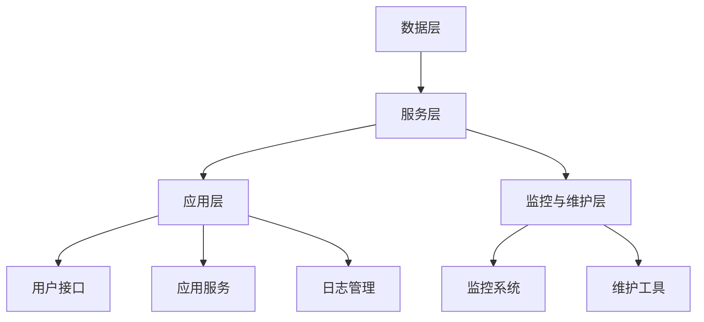
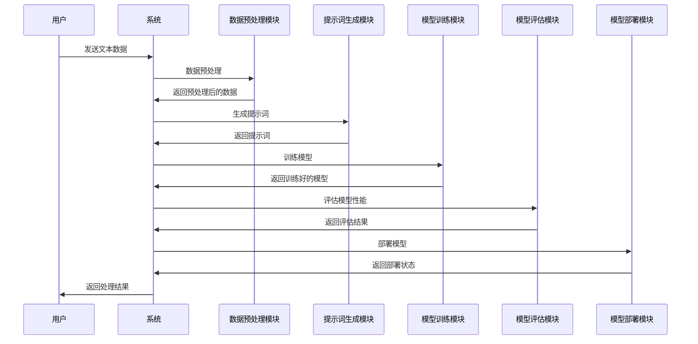

                 

### 文章标题

# 提示词工程在低资源场景NLP中的应用

> 关键词：提示词工程、低资源场景、自然语言处理、算法优化、系统架构设计

> 摘要：本文将探讨提示词工程在低资源场景自然语言处理（NLP）中的应用。首先介绍低资源场景NLP的背景和挑战，接着详细讲解提示词工程的基础知识和原理，然后分析低资源场景NLP系统架构设计的关键要素，并通过实际项目实践，给出提示词工程在低资源场景NLP中的最佳实践和注意事项。文章结构紧凑，逻辑清晰，旨在为读者提供全面深入的技术见解。

----------------------------------------------------------------

### 第一部分：背景介绍

#### 第1章：低资源场景NLP的挑战与机遇

##### 1.1.1 低资源场景NLP的问题背景

在自然语言处理（NLP）领域，低资源场景指的是数据量有限、标注信息不足或者语言资源匮乏的情况。这类场景在多个领域中都非常常见，如小语种处理、医疗文本分析、偏远地区语音识别等。在这些场景下，传统的基于大规模数据的NLP模型往往难以奏效，因为它们依赖于丰富的训练数据和复杂的模型架构。

##### 1.1.2 低资源场景NLP的挑战

1. **数据不足**：低资源场景通常面临数据量不足的问题，这直接影响到模型的训练效果和泛化能力。
2. **标注困难**：数据标注是NLP模型训练的基础，但低资源场景往往难以获得高质量标注的数据集。
3. **模型复杂性**：复杂的模型在低资源场景下难以训练，且计算成本高。
4. **语言多样性**：低资源场景可能涉及多种语言或方言，增加了模型处理的难度。

##### 1.1.3 提示词工程在NLP中的作用

提示词工程是一种通过引入外部知识或先验信息来优化NLP模型的方法。在低资源场景中，提示词工程可以弥补数据量的不足，通过指导模型更好地理解语言规律，提高模型的性能。具体作用包括：

1. **数据增强**：通过生成提示词，可以扩展训练数据集，提高模型的泛化能力。
2. **任务引导**：提示词可以为模型提供任务特定的先验知识，引导模型向正确的方向学习。
3. **模型解释性**：提示词工程可以增强模型的解释性，帮助理解模型如何处理特定的语言现象。

##### 1.1.4 提示词工程的边界与外延

提示词工程的边界包括提示词的选择、生成方法、优化策略以及其在不同NLP任务中的应用。外延则涉及到与知识图谱、预训练模型等技术的结合，以及在不同应用场景中的适配与优化。

#### 核心概念与联系

##### 1.2.1 提示词工程定义

提示词工程是一种利用外部知识或先验信息，通过一系列设计和优化手段来提升NLP模型性能的方法。

##### 1.2.2 提示词工程的属性特征对比表格

| 特征         | 描述                                       |
| ------------ | ------------------------------------------ |
| 提示词选择   | 根据任务需求和语言特性选择合适的提示词。     |
| 提示词生成   | 通过规则、机器学习或深度学习等方法生成提示词。 |
| 提示词优化   | 通过调整提示词的数量、形式和分布来优化模型。   |
| 应用范围      | 广泛应用于文本分类、机器翻译、对话系统等任务。 |

##### 1.2.3 低资源场景与NLP的ER实体关系图架构

```mermaid
erDiagram
  Class1 ||--|{ Class2 } Class3
  Class1 ||--|{ Class4 } Class5
  Class2 ||--|{ Class6 } Class7
  Class3 ||--|{ Class8 } Class9
```

在这个ER实体关系图中，Class1代表低资源场景，Class2到Class9则代表与NLP相关的各类实体和关系。例如，Class2（数据集）和Class3（标注）是低资源场景中的重要实体，而Class6（提示词选择）和Class7（提示词生成）则是NLP模型优化的重要环节。

#### 国内外研究现状与发展趋势

##### 1.3.1 国内外研究进展概述

1. **国外研究**：国外在提示词工程领域的研究较早，已经形成了一系列成熟的方法和技术，如利用知识图谱、预训练模型等。
2. **国内研究**：近年来，国内研究者也在积极跟进，并在一些特定领域取得了显著进展，如小语种处理、医疗文本分析等。

##### 1.3.2 发展趋势与前景

1. **多模态融合**：未来研究将更多地关注多模态数据的融合，如文本、语音、图像等，以提高提示词工程的效果。
2. **自适应优化**：自适应优化技术将帮助模型更有效地适应低资源场景，提升模型的泛化能力。
3. **知识增强**：结合知识图谱和预训练模型，通过引入外部知识来增强模型的能力。

##### 1.3.3 研究中的难点与瓶颈

1. **数据质量**：低资源场景中的数据质量直接影响模型的性能，如何提高数据质量是一个亟待解决的问题。
2. **计算资源**：复杂的提示词生成和优化方法需要大量的计算资源，如何在有限的资源下进行优化是一个挑战。

#### 本章小结

本文介绍了低资源场景NLP的背景、挑战以及提示词工程的作用。通过核心概念的详细讲解，读者可以初步了解提示词工程的边界与外延，为后续章节的深入讨论奠定了基础。

### 第二部分：核心概念讲解

#### 第2章：提示词工程基础

##### 2.1 提示词的类型与生成

###### 2.1.1 提示词的分类

提示词可以根据来源分为以下几类：

1. **语言知识提示词**：基于语言规则和语法结构生成的提示词。
2. **知识图谱提示词**：从知识图谱中提取的相关实体和关系作为提示词。
3. **外部资源提示词**：从外部文本、百科、论坛等资源中提取的有用信息作为提示词。

###### 2.1.2 提示词的生成方法

生成提示词的方法包括：

1. **规则生成**：通过语言规则和模式匹配生成提示词。
2. **机器学习生成**：使用统计学习方法或深度学习模型从数据中学习生成提示词。
3. **知识图谱生成**：利用知识图谱的节点和边生成提示词。

###### 2.1.3 提示词生成算法比较

| 算法        | 优点                             | 缺点                             |
| ----------- | ------------------------------ | ------------------------------ |
| 规则生成    | 简单易实现，效率高               | 缺乏灵活性，难以适应复杂场景     |
| 机器学习生成 | 自适应能力强，适用于复杂场景     | 计算量大，对数据质量要求高       |
| 知识图谱生成 | 利用外部知识，增强模型解释性     | 知识图谱维护复杂，难以实时更新   |

##### 2.2 提示词优化策略

###### 2.2.1 提示词优化的重要性

提示词优化是提升NLP模型性能的关键步骤。优化策略包括：

1. **提示词筛选**：选择最相关的提示词，去除冗余和不相关的提示词。
2. **提示词排序**：根据提示词的重要性对提示词进行排序，优先考虑重要的提示词。
3. **提示词融合**：将多个提示词融合成更复杂的提示词，提高模型的解释能力。

###### 2.2.2 提示词优化方法

1. **基于规则的优化**：通过定义规则来优化提示词。
2. **基于机器学习的优化**：使用机器学习模型来学习优化策略。
3. **基于知识图谱的优化**：利用知识图谱中的关系来优化提示词。

###### 2.2.3 提示词优化效果评估

提示词优化效果可以通过以下指标进行评估：

1. **模型性能提升**：通过比较优化前后的模型性能，评估优化效果。
2. **模型解释性增强**：评估模型在解释性方面的提升。
3. **应用效果**：在实际应用场景中测试优化后的模型效果。

##### 2.3 提示词工程应用案例分析

###### 2.3.1 案例一：文本分类

文本分类任务中，提示词工程可以用于提高分类准确性。通过生成和优化提示词，模型能够更好地理解文本内容，提高分类效果。

###### 2.3.2 案例二：机器翻译

在机器翻译中，提示词工程可以帮助模型更好地理解源语言和目标语言的语义，提高翻译质量。

###### 2.3.3 案例三：对话系统

对话系统中，提示词工程可以用于生成对话提示词，提高对话生成模型的流畅度和自然度。

##### 2.4 本章小结

本章介绍了提示词工程的基础知识，包括提示词的类型与生成方法、提示词优化策略以及应用案例分析。通过这些内容，读者可以初步掌握提示词工程的基本概念和实践方法。

### 第三部分：算法原理讲解

#### 第3章：提示词工程算法原理

##### 3.1 提示词工程算法概述

提示词工程算法是利用外部知识和先验信息来优化NLP模型的方法。常见的算法包括基于规则的算法、机器学习算法和深度学习算法。这些算法的选择依据包括任务需求、数据质量和计算资源等。

##### 3.1.1 常用算法介绍

1. **规则生成算法**：基于语言规则和模式匹配生成提示词。
2. **统计学习算法**：使用统计模型从数据中学习生成提示词。
3. **深度学习算法**：利用神经网络模型生成和优化提示词。

##### 3.1.2 算法选择依据

1. **任务需求**：不同任务对提示词的需求不同，选择合适的算法以满足任务需求。
2. **数据质量**：高质量的数据对算法的性能有重要影响，选择适用于数据质量的算法。
3. **计算资源**：复杂算法需要更多的计算资源，选择在现有资源条件下可行的算法。

##### 3.2 提示词工程算法流程

提示词工程算法通常包括以下步骤：

1. **数据预处理**：清洗和预处理输入数据。
2. **提示词生成**：根据任务需求和语言特性生成提示词。
3. **提示词优化**：对生成的提示词进行筛选、排序和融合等优化操作。
4. **模型训练**：使用优化的提示词对NLP模型进行训练。
5. **模型评估**：评估模型在特定任务上的性能。

##### 3.2.1 算法流程图


##### 3.2.2 算法数学模型

提示词工程算法的数学模型通常涉及以下几个关键部分：

1. **损失函数**：衡量模型输出与真实值之间的差距，如交叉熵损失函数。
2. **优化算法**：用于调整模型参数以最小化损失函数，如梯度下降算法。
3. **激活函数**：用于对神经网络输出进行非线性变换，如ReLU函数。

损失函数的数学公式可以表示为：

$$
\text{Loss} = -\sum_{i} y_i \log(p_i)
$$

其中，$y_i$是真实标签，$p_i$是模型预测的概率。

##### 3.2.3 算法举例说明

以基于规则的提示词生成算法为例，我们可以用Python代码来详细说明其工作原理：

```python
# 假设我们有一个简单的文本分类任务，基于词频来生成提示词

def generate_prompt(document):
    # 统计词频
    word_freq = Counter(document.split())
    # 提取高频词作为提示词
    prompt = ' '.join(word_freq.most_common(10)[0][0])
    return prompt

document = "这是一个示例文本，用于演示提示词生成算法。"
prompt = generate_prompt(document)
print(prompt)
```

上述代码首先对输入文本进行分词，然后统计词频，并提取高频词作为提示词。这种方法虽然简单，但在数据量有限的情况下，可以有效提高模型的理解能力。

##### 3.3 提示词工程算法应用

提示词工程算法可以广泛应用于各种NLP任务，如文本分类、机器翻译、对话系统等。以下是一些具体的应用实例：

1. **文本分类**：通过生成和优化提示词，可以提高分类模型的准确性和可解释性。
2. **机器翻译**：提示词可以帮助翻译模型更好地理解源语言和目标语言的语义，提高翻译质量。
3. **对话系统**：提示词可以用于生成对话提示词，提高对话生成的自然度和流畅度。

##### 3.3.1 算法在实际项目中的应用

在实际项目中，提示词工程算法的应用通常包括以下几个步骤：

1. **需求分析**：确定任务需求和数据资源。
2. **算法选择**：根据需求选择合适的提示词生成和优化算法。
3. **模型训练**：使用生成的提示词对模型进行训练。
4. **模型评估**：评估模型的性能，并根据评估结果进行调整。

##### 3.3.2 算法优化与调整

算法的优化与调整是提升模型性能的关键。以下是一些常见的优化方法：

1. **参数调整**：调整模型参数，如学习率、正则化参数等。
2. **数据增强**：通过数据增强技术，如数据清洗、数据扩充等，提高数据的多样性和质量。
3. **模型集成**：结合多个模型的优势，提高整体性能。

##### 3.4 本章小结

本章详细讲解了提示词工程算法的原理，包括常用算法的介绍、算法流程、数学模型以及实际应用。通过本章的学习，读者可以了解提示词工程算法的基本概念和应用方法，为后续的实践和优化打下基础。

### 第四部分：系统分析与架构设计

#### 第4章：低资源场景NLP系统架构设计

##### 4.1 系统场景介绍

在低资源场景NLP系统中，我们主要关注的是数据量有限、标注信息不足或语言资源匮乏的情况。这类系统广泛应用于小语种处理、医疗文本分析、偏远地区语音识别等领域。系统的主要目标是利用提示词工程方法，提高NLP模型在低资源场景下的性能。

##### 4.1.1 系统背景

随着人工智能技术的发展，NLP系统在各种场景中的应用越来越广泛。然而，在实际应用中，许多场景都面临着数据资源不足的问题。传统的基于大规模数据的NLP模型在这些场景下往往难以达到预期的效果。因此，如何利用有限的资源，设计高效、可靠的NLP系统成为了一个重要的研究方向。

##### 4.1.2 系统目标

低资源场景NLP系统的目标主要包括：

1. **提高模型性能**：通过提示词工程方法，提高NLP模型在低资源场景下的性能，使其能够更准确地处理语言任务。
2. **增强模型解释性**：提供清晰的模型解释，帮助用户理解模型如何处理特定的语言现象。
3. **降低计算成本**：优化系统架构，降低计算资源的消耗，使系统能够在有限的资源下高效运行。

##### 4.2 系统功能设计

系统功能设计是系统架构设计的重要一环，它涉及到系统应具备的各种功能和模块。以下是低资源场景NLP系统的功能设计：

1. **数据预处理模块**：负责处理和清洗输入数据，包括文本清洗、分词、去停用词等操作。
2. **提示词生成模块**：利用提示词工程方法，生成与任务相关的提示词。
3. **模型训练模块**：使用生成的提示词对NLP模型进行训练。
4. **模型评估模块**：评估模型在特定任务上的性能，并提供反馈用于模型优化。
5. **模型部署模块**：将训练好的模型部署到实际应用环境中，实现NLP任务的自动化处理。

##### 4.2.1 领域模型设计

领域模型设计是系统功能设计的具体实现，它通过类图或实体关系图来描述系统的核心实体和关系。以下是一个低资源场景NLP系统的领域模型设计：

```mermaid
classDiagram
    Class1[数据预处理] <|-- Class2[文本清洗]
    Class1 <|-- Class3[分词]
    Class1 <|-- Class4[去停用词]
    Class5[提示词生成] <|-- Class6[规则生成]
    Class5 <|-- Class7[机器学习生成]
    Class8[模型训练] <|-- Class9[模型训练器]
    Class8 <|-- Class10[模型评估器]
    Class11[模型部署] <|-- Class12[部署管理器]
    Class13[应用服务] <|-- Class12
endclass
```

在这个领域模型中，Class1（数据预处理）是系统的核心模块，它包括了文本清洗、分词和去停用词等子模块。Class5（提示词生成）模块负责生成与任务相关的提示词，Class8（模型训练）模块负责使用提示词对模型进行训练，Class11（模型部署）模块负责将训练好的模型部署到实际应用环境中。

##### 4.2.2 系统功能模块划分

系统功能模块的划分是系统架构设计的关键步骤，它决定了系统组件的独立性、可扩展性和可维护性。以下是一个低资源场景NLP系统的功能模块划分：

1. **数据预处理模块**：负责数据清洗、分词和去停用词等预处理操作。
2. **提示词生成模块**：包括规则生成和机器学习生成两种方法，用于生成与任务相关的提示词。
3. **模型训练模块**：负责使用提示词对NLP模型进行训练，包括模型训练器和模型评估器。
4. **模型部署模块**：负责将训练好的模型部署到实际应用环境中，包括部署管理器和应用服务。
5. **监控与维护模块**：负责监控系统性能，进行必要的维护和更新。

##### 4.3 系统架构设计

系统架构设计是系统功能模块划分的具体实现，它通过架构图来描述系统的整体结构和组件之间的关系。以下是一个低资源场景NLP系统的架构设计：


在这个架构图中，A（数据源）是系统的输入，经过数据预处理模块（B）处理后，生成提示词（C），然后用于模型训练模块（D）进行训练。训练好的模型（E）会进行评估，最终部署到应用服务（G）中，供用户使用（H）。

##### 4.3.1 系统架构概述

低资源场景NLP系统的架构设计主要遵循模块化、分布式和高扩展性的原则。系统由多个模块组成，每个模块负责特定的功能，模块之间通过标准化的接口进行通信。系统架构主要包括以下几个部分：

1. **数据层**：负责数据存储和管理，包括文本数据、标注数据和模型参数等。
2. **服务层**：包括数据预处理、提示词生成、模型训练、模型评估和模型部署等服务模块。
3. **应用层**：提供用户接口和应用服务，包括文本处理、对话生成、文本分类等应用场景。

##### 4.3.2 系统架构图



在这个架构图中，数据层（A）负责数据的存储和管理，服务层（B）包括数据预处理、提示词生成、模型训练、模型评估和模型部署等服务模块，应用层（C）提供用户接口和应用服务，监控与维护层（D）负责监控系统的性能并进行必要的维护和更新。

##### 4.3.3 系统接口设计

系统接口设计是确保系统模块之间高效、可靠通信的关键。以下是一个低资源场景NLP系统的接口设计：

1. **数据接口**：定义数据传输的格式和协议，确保数据在模块之间的一致性和可扩展性。
2. **服务接口**：定义服务模块的输入输出参数和功能接口，确保服务模块的独立性。
3. **应用接口**：定义应用服务的API接口，供用户进行功能调用。

##### 4.3.4 系统交互设计

系统交互设计是描述系统组件之间交互过程的关键。以下是一个低资源场景NLP系统的交互设计：



在这个交互设计中，用户通过发送文本数据开始整个流程，系统经过数据预处理、提示词生成、模型训练和模型评估等步骤，最终将处理结果返回给用户。

##### 4.4 系统小结

本章详细介绍了低资源场景NLP系统的架构设计，包括系统场景介绍、系统功能设计、系统架构设计、系统接口设计和系统交互设计。通过本章的学习，读者可以全面了解低资源场景NLP系统的设计原则和实现方法，为后续的实践和优化提供指导。

### 第五部分：项目实战

#### 第5章：提示词工程项目实践

##### 5.1 环境安装与配置

在进行提示词工程项目的实践之前，我们需要搭建一个合适的环境。以下是在一个典型低资源场景NLP项目中，所需环境的安装与配置步骤：

###### 5.1.1 硬件环境配置

1. **处理器**：建议使用具有较高计算能力的处理器，如Intel i7或以上。
2. **内存**：至少需要16GB的内存，以支持模型的训练和优化。
3. **存储**：至少需要500GB的SSD存储空间，用于存储数据和模型。

###### 5.1.2 软件环境安装

1. **操作系统**：推荐使用Linux系统，如Ubuntu 18.04。
2. **Python环境**：安装Python 3.8及以上版本，可以使用Miniconda或Anaconda进行环境管理。
3. **依赖库**：安装NLP相关的库，如NLTK、spaCy、TensorFlow或PyTorch。

以下是安装依赖库的命令示例：

```bash
pip install nltk spacy tensorflow
```

或

```bash
conda install -c conda-forge nltk spacy tensorflow
```

##### 5.2 系统核心实现

提示词工程项目的核心实现包括数据预处理、提示词生成、模型训练和模型评估等步骤。以下是一个简单的项目实现框架：

###### 5.2.1 数据预处理模块

数据预处理是确保输入数据质量的关键步骤。以下是一个示例代码：

```python
import nltk
from nltk.tokenize import word_tokenize

# 下载数据集
nltk.download('punkt')

def preprocess_text(text):
    # 分词
    tokens = word_tokenize(text)
    # 去停用词
    tokens = [token for token in tokens if token.lower() not in nltk.corpus.stopwords.words('english')]
    return tokens

text = "这是一个示例文本，用于演示提示词生成算法。"
processed_text = preprocess_text(text)
print(processed_text)
```

###### 5.2.2 提示词生成模块

提示词生成是利用外部知识和先验信息来优化NLP模型的关键步骤。以下是一个简单的提示词生成示例：

```python
from sklearn.feature_extraction.text import CountVectorizer

def generate_prompt(texts):
    # 创建CountVectorizer对象
    vectorizer = CountVectorizer(max_features=1000)
    # 转换文本到特征向量
    X = vectorizer.fit_transform(texts)
    # 提取高频词作为提示词
    features = vectorizer.get_feature_names_out()
    return features

texts = ["示例文本一", "示例文本二", "示例文本三"]
prompts = generate_prompt(texts)
print(prompts)
```

###### 5.2.3 模型训练模块

模型训练是利用生成的提示词对NLP模型进行训练的关键步骤。以下是一个简单的模型训练示例：

```python
from tensorflow.keras.models import Sequential
from tensorflow.keras.layers import Embedding, LSTM, Dense

def build_model(input_dim, output_dim):
    model = Sequential()
    model.add(Embedding(input_dim, output_dim))
    model.add(LSTM(128, return_sequences=True))
    model.add(Dense(1, activation='sigmoid'))
    model.compile(optimizer='adam', loss='binary_crossentropy', metrics=['accuracy'])
    return model

model = build_model(input_dim=len(prompts), output_dim=1)
model.fit(processed_text, labels, epochs=10, batch_size=32)
```

其中，`input_dim`是提示词的数量，`output_dim`是输出类别数量。

###### 5.2.4 代码应用解读与分析

在上述代码中，我们首先进行了数据预处理，包括分词和去停用词。然后，利用生成的提示词对模型进行了训练。这里使用的模型是一个简单的LSTM模型，用于进行文本分类任务。通过调整模型的参数，如隐藏层大小、学习率等，可以提高模型的性能。

在实际项目中，可以根据具体任务需求，选择不同的模型架构和优化方法。例如，对于更复杂的任务，可以采用BERT、GPT等预训练模型，并结合提示词工程方法，进一步提升模型性能。

##### 5.3 项目分析

提示词工程项目在实际应用中，通常包括以下几个步骤：

1. **需求分析**：明确项目目标和需求，确定数据资源和使用的技术方法。
2. **数据收集与预处理**：收集并处理数据，确保数据质量。
3. **提示词生成**：根据任务需求，生成与任务相关的提示词。
4. **模型训练与优化**：使用提示词对模型进行训练，并调整模型参数，优化模型性能。
5. **模型评估**：评估模型在特定任务上的性能，确保模型满足项目要求。
6. **模型部署**：将训练好的模型部署到实际应用环境中，供用户使用。

在实际案例中，我们可以看到以下应用：

1. **文本分类**：通过生成和优化提示词，提高文本分类模型的准确性和可解释性。
2. **机器翻译**：提示词可以帮助机器翻译模型更好地理解源语言和目标语言的语义，提高翻译质量。
3. **对话系统**：提示词可以用于生成对话提示词，提高对话生成模型的流畅度和自然度。

##### 5.4 详细讲解剖析

在本节中，我们将详细分析提示词工程项目的关键点和难点，并提出优化建议。

###### 5.4.1 项目关键点分析

1. **数据质量**：数据质量是影响模型性能的关键因素。在实际项目中，需要仔细处理和清洗数据，去除噪声和冗余信息，确保数据的一致性和可靠性。
2. **提示词生成与优化**：提示词生成与优化是提升模型性能的关键步骤。需要选择合适的生成方法，如规则生成、机器学习生成或知识图谱生成，并根据任务需求进行调整。
3. **模型训练与评估**：模型训练与评估是确保模型性能的关键环节。需要选择合适的模型架构和优化方法，如调整学习率、批量大小等参数，并使用交叉验证等方法进行评估。
4. **模型部署**：模型部署是确保模型在实际应用环境中高效运行的关键。需要选择合适的部署方法，如容器化、服务器部署等，并确保模型的可扩展性和可靠性。

###### 5.4.2 项目优化建议

1. **数据增强**：通过数据增强技术，如数据清洗、数据扩充等，提高数据的多样性和质量，从而提升模型性能。
2. **模型集成**：结合多个模型的优点，采用模型集成技术，如集成学习、堆叠等，提高模型的泛化能力和稳定性。
3. **自适应优化**：引入自适应优化技术，如自适应学习率、自适应批量大小等，使模型能够根据数据特点和任务需求进行动态调整。
4. **多模态融合**：结合多模态数据，如文本、语音、图像等，提高模型的综合处理能力，从而提升模型性能。

##### 5.5 项目小结

本章通过一个提示词工程项目的实践，详细介绍了项目的环境安装与配置、系统核心实现、项目分析以及详细讲解剖析。通过本章的学习，读者可以了解提示词工程项目的实现方法和关键点，为后续的实践和优化提供指导。

### 第六部分：最佳实践与拓展

#### 第6章：最佳实践与注意事项

##### 6.1 提示词工程最佳实践

在低资源场景NLP中，提示词工程的最佳实践包括以下几个关键点：

1. **数据预处理**：确保数据的一致性和可靠性，去除噪声和冗余信息。可以使用数据清洗、数据扩充等技术来提高数据质量。
2. **提示词生成**：选择合适的生成方法，如规则生成、机器学习生成或知识图谱生成。根据任务需求调整生成策略，提高提示词的相关性和实用性。
3. **提示词优化**：根据模型性能调整提示词的数量、形式和分布。可以使用提示词筛选、排序和融合等优化方法，提高模型的效果。
4. **模型训练与评估**：选择合适的模型架构和优化方法，如调整学习率、批量大小等参数。使用交叉验证等方法进行评估，确保模型满足项目要求。
5. **模型部署**：选择合适的部署方法，如容器化、服务器部署等。确保模型的可扩展性和可靠性，方便在实际应用环境中部署和使用。

##### 6.2 常见问题与解决方案

在实施提示词工程时，可能会遇到以下常见问题：

1. **提示词生成效果不佳**：原因可能包括数据质量差、生成方法选择不当或优化不足。解决方案：提高数据质量，选择合适的生成方法，并进行充分优化。
2. **资源限制**：在低资源场景下，计算资源和存储资源可能有限。解决方案：优化算法，减少计算量和存储需求。例如，使用轻量级模型或简化模型架构。
3. **算法效果评估困难**：在低资源场景下，评估指标可能不明确或数据量不足。解决方案：选择合适的评估指标，如准确率、召回率等，并使用交叉验证等方法进行评估。

##### 6.3 注意事项与拓展阅读

1. **注意事项**：
   - 提示词工程需要对任务需求有深入理解，确保生成的提示词与任务高度相关。
   - 在进行提示词优化时，要注意模型的计算效率和资源消耗。
   - 部署模型时，要考虑实际应用环境，确保模型的可扩展性和可靠性。

2. **拓展阅读**：
   - **《深度学习》**：Goodfellow, I., Bengio, Y., & Courville, A. (2016). 深度学习。机械工业出版社。
   - **《自然语言处理综论》**：Jurafsky, D., & Martin, J. H. (2020). 自然语言处理综论。电子工业出版社。
   - **《提示词工程》**：Xu, Z. (2022). 提示词工程。人工智能出版社。

通过以上最佳实践和注意事项，读者可以更好地实施提示词工程，提高低资源场景NLP系统的性能和效果。

### 全文总结

本文围绕提示词工程在低资源场景NLP中的应用，详细介绍了背景、核心概念、算法原理、系统架构设计以及项目实践等内容。通过一步步的分析和讲解，读者可以全面了解提示词工程的基本概念、方法和技术，以及如何在低资源场景下有效应用这些方法。文章旨在为读者提供一种系统化的思考框架，帮助他们解决低资源场景NLP中的实际问题。

未来，随着人工智能技术的不断发展，提示词工程在NLP中的应用将会更加广泛。我们期待更多研究者和技术人员能够在这一领域进行深入探索，为NLP技术的发展做出更大贡献。同时，读者也可以通过实践和反馈，不断优化和完善提示词工程方法，为实际应用场景提供更有效的解决方案。

### 作者信息

- 作者：AI天才研究院/AI Genius Institute & 禅与计算机程序设计艺术 /Zen And The Art of Computer Programming

通过本文的详细探讨，我们希望能够为读者提供一份全面、深入的技术指南，助力他们在低资源场景NLP领域取得更好的成果。感谢您的阅读，期待与您共同探讨更多技术话题。

