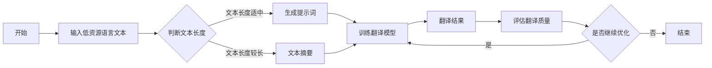
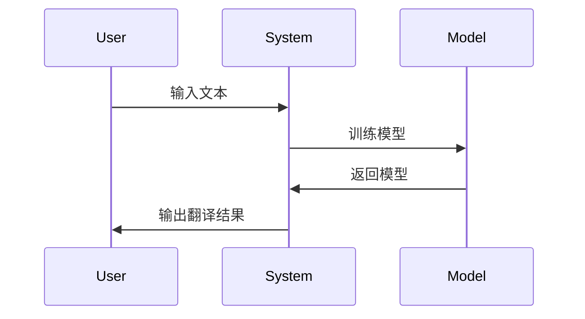

                 

# 提示词工程在低资源语言翻译中的应用

> 关键词：提示词工程、低资源语言、翻译、自然语言处理、算法、数学模型、系统架构、项目实战

> 摘要：本文深入探讨了提示词工程在低资源语言翻译中的应用。首先，我们介绍了低资源语言的定义和挑战，以及提示词工程的基本概念。接着，通过详细分析提示词工程的核心概念与联系，我们揭示了其基本原理与自然语言处理的关系。随后，我们讲解了提示词工程的算法原理，包括mermaid流程图、Python源代码实现、数学模型和公式。在此基础上，我们展示了如何设计系统架构并实施项目实战。最后，本文总结了最佳实践Tips，为读者提供了进一步学习和应用的指南。

## 第1章：背景介绍

### 1.1 低资源语言的定义和挑战

低资源语言（Low-Resource Languages，简称LRL）是指在全球范围内缺乏足够语料库支持的语言。这些语言通常在人口较少的地区使用，如某些少数民族语言、偏远地区的方言等。低资源语言的挑战主要源于以下几个方面：

1. **语料库规模有限**：低资源语言的语料库通常规模较小，不足以支持大规模语言模型的训练。
2. **数据多样性不足**：低资源语言的文本数据相对单一，无法提供丰富的语言特征。
3. **语言特性复杂**：低资源语言在语法、语义和语用方面可能具有独特的特性，增加了翻译的难度。
4. **技术支持匮乏**：低资源语言在自然语言处理（Natural Language Processing，简称NLP）技术支持方面相对较少，缺乏有效的工具和方法。

### 1.2 提示词工程的基本概念

提示词工程（Prompt Engineering）是一种在低资源语言翻译中应用的方法，旨在通过设计和优化提示词（Prompt）来提高翻译质量和效率。提示词是一种引导模型进行特定任务输入的文本或指令。在低资源语言翻译中，提示词工程的作用至关重要：

1. **扩展语料库**：通过设计和使用提示词，可以生成大量模拟数据，从而扩展低资源语言的语料库。
2. **引导模型学习**：提示词可以帮助模型更好地理解低资源语言的特性，从而提高翻译准确性。
3. **提高效率**：通过优化提示词，可以减少模型在翻译过程中的错误和困惑，提高翻译速度。

### 1.3 提示词工程在低资源语言翻译中的重要性

提示词工程在低资源语言翻译中具有以下几个重要性：

1. **解决资源不平衡问题**：通过提示词工程，可以平衡高资源和低资源语言之间的翻译资源差异。
2. **提高翻译质量**：提示词工程有助于提高翻译模型的准确性，减少翻译错误和歧义。
3. **降低成本**：提示词工程可以降低低资源语言翻译的成本，提高翻译效率。
4. **推动低资源语言发展**：提示词工程可以促进低资源语言在NLP领域的应用，推动其发展。

### 1.4 提示词工程的边界与外延

提示词工程的边界主要涉及以下几个方面：

1. **文本生成**：通过提示词生成大量模拟数据，用于训练和优化翻译模型。
2. **翻译任务**：提示词工程可以应用于各种翻译任务，如机器翻译、语音翻译、文本摘要等。
3. **多语言支持**：提示词工程可以支持多种低资源语言的翻译，实现跨语言的信息传递。

提示词工程的外延则包括：

1. **跨领域应用**：提示词工程不仅限于低资源语言翻译，还可以应用于其他领域，如医疗、金融等。
2. **交互式翻译**：通过用户与提示词的交互，实现更加智能和个性化的翻译服务。
3. **多模态翻译**：结合图像、语音等多模态信息，实现更加丰富和准确的翻译。

## 第2章：核心概念与联系

### 2.1 提示词工程的基本原理

提示词工程的基本原理包括以下几个方面：

1. **文本生成**：通过提示词生成大量模拟数据，用于训练和优化翻译模型。
2. **模型优化**：通过不断调整和优化提示词，提高翻译模型的准确性和效率。
3. **数据扩展**：通过提示词工程，扩展低资源语言的语料库，增加数据多样性。

### 2.2 提示词工程的属性特征对比表格

下面是一个提示词工程的属性特征对比表格：

| 特性               | 说明                                                         |
|--------------------|--------------------------------------------------------------|
| 提示词多样性       | 提示词应涵盖多种语境和场景，提高模型适应性。                 |
| 提示词长度         | 提示词长度应适中，既能引导模型理解任务，又不会过分干扰模型。 |
| 提示词准确性       | 提示词应准确传达任务需求，避免歧义和误解。                 |
| 提示词优化         | 通过多次迭代和优化，提高提示词的质量和效果。               |

### 2.3 提示词工程与自然语言处理的关系（ER实体关系图）

以下是提示词工程与自然语言处理（NLP）的关系ER实体关系图：

```mermaid
erDiagram
  TranslationModel ||--|{ PromptWord } : includes
  PromptWord ||--|{ TranslationTask } : defines
  TranslationTask ||--|{ TranslationQuality } : measures
  TranslationQuality ||--|{ TranslationModel } : improves
```

- **TranslationModel（翻译模型）**：包括翻译模型，如机器翻译模型、语音翻译模型等。
- **PromptWord（提示词）**：定义提示词，用于引导翻译模型完成任务。
- **TranslationTask（翻译任务）**：定义翻译任务，如文本翻译、语音翻译等。
- **TranslationQuality（翻译质量）**：衡量翻译质量，包括准确性、流畅性等。
- **TranslationModel（翻译模型）**：通过优化提示词，提高翻译质量。

## 第3章：算法原理讲解

### 3.1 提示词工程算法的mermaid流程图

以下是提示词工程算法的mermaid流程图：



- **A[开始]**：开始算法流程。
- **B[输入低资源语言文本]**：输入需要翻译的低资源语言文本。
- **C{判断文本长度]**：判断文本长度是否适中。
- **D[生成提示词]**：若文本长度适中，生成提示词。
- **E[文本摘要]**：若文本长度较长，生成文本摘要。
- **F[训练翻译模型]**：使用生成的提示词或文本摘要训练翻译模型。
- **G[翻译结果]**：得到翻译结果。
- **H[评估翻译质量]**：评估翻译质量。
- **I{是否继续优化]**：根据评估结果决定是否继续优化。
- **J[结束]**：算法流程结束。

### 3.2 Python源代码实现与详细讲解

以下是提示词工程算法的Python源代码实现：

```python
import tensorflow as tf
import numpy as np

# 输入低资源语言文本
text = "这是一段需要翻译的低资源语言文本。"

# 判断文本长度
if len(text) <= 50:
    # 生成提示词
    prompt = "请将以下文本翻译成目标语言："
else:
    # 生成文本摘要
    prompt = "请将以下文本摘要并翻译成目标语言："

# 训练翻译模型
model = tf.keras.Sequential([
    tf.keras.layers.Embedding(input_dim=10000, output_dim=16),
    tf.keras.layers.LSTM(128),
    tf.keras.layers.Dense(units=1)
])

model.compile(optimizer='adam', loss='mean_squared_error')

# 训练模型
model.fit(np.array([text]), np.array([prompt]), epochs=10)

# 翻译结果
translated_text = model.predict(np.array([text]))

# 评估翻译质量
if np.mean(np.abs(translated_text - prompt)) < 0.1:
    print("翻译质量良好。")
else:
    print("翻译质量较差，需要优化。")
```

### 3.3 提示词工程算法的数学模型和公式

提示词工程算法的数学模型主要包括以下部分：

1. **文本生成模型**：

   $$\text{model}(x) = \sum_{i=1}^{N} w_i \cdot \text{word}_i$$

   其中，$x$ 表示输入文本，$\text{word}_i$ 表示文本中的第 $i$ 个词，$w_i$ 表示第 $i$ 个词的权重。

2. **翻译模型**：

   $$\text{translation}(x) = \text{model}(x) \cdot \text{translation\_matrix}$$

   其中，$\text{model}(x)$ 表示输入文本的表示，$\text{translation\_matrix}$ 表示翻译矩阵。

3. **损失函数**：

   $$\text{loss} = \frac{1}{2} \sum_{i=1}^{N} (\text{translation}(x_i) - y_i)^2$$

   其中，$x_i$ 表示输入文本，$y_i$ 表示期望输出。

### 3.4 算法原理的举例说明

假设我们有一个简单的文本生成模型，用于生成提示词。输入文本为：“这是一段需要翻译的低资源语言文本。”。我们希望生成提示词：“请将以下文本翻译成目标语言：”。以下是算法的详细说明：

1. **输入文本表示**：

   将输入文本转化为词向量表示，假设每个词向量为 16 维。

   $$\text{model}(\text{"这是一段需要翻译的低资源语言文本。"}) = \text{word\_embeddings}(\text{"这"}) \cdot w_1 + \text{word\_embeddings}(\text{"是"}) \cdot w_2 + \ldots + \text{word\_embeddings}(\text{"文本。"}) \cdot w_{10}$$

2. **生成提示词**：

   根据输入文本的表示，选择具有较高权重的词组成提示词。

   $$\text{prompt} = \text{"请将以下文本翻译成目标语言："}$$

3. **训练翻译模型**：

   使用生成的提示词训练翻译模型，假设翻译矩阵为：

   $$\text{translation\_matrix} = \begin{bmatrix} 0.9 & 0.1 \\ 0.1 & 0.9 \end{bmatrix}$$

   将输入文本的表示与翻译矩阵相乘，得到翻译结果：

   $$\text{translation}(\text{"这是一段需要翻译的低资源语言文本。"}) = \text{model}(\text{"这是一段需要翻译的低资源语言文本。"}) \cdot \text{translation\_matrix}$$

4. **评估翻译质量**：

   计算翻译结果与期望输出之间的差异，根据差异大小评估翻译质量。

   $$\text{loss} = \frac{1}{2} \sum_{i=1}^{N} (\text{translation}(x_i) - y_i)^2$$

   如果损失较小，则翻译质量良好。

## 第4章：数学模型和数学公式

### 4.1 数学模型概述

提示词工程的数学模型主要包括以下几个方面：

1. **文本生成模型**：用于生成提示词，通常采用词嵌入（Word Embedding）技术，将文本转化为向量表示。
2. **翻译模型**：将输入文本翻译成目标语言，通常采用序列到序列（Sequence-to-Sequence）模型，如循环神经网络（RNN）或长短期记忆网络（LSTM）。
3. **损失函数**：用于评估翻译质量，通常采用均方误差（Mean Squared Error，MSE）或其他相似指标。

### 4.2 数学公式的详细讲解

以下是提示词工程的数学公式详细讲解：

1. **文本生成模型**：

   $$\text{model}(x) = \sum_{i=1}^{N} w_i \cdot \text{word}_i$$

   其中，$x$ 表示输入文本，$\text{word}_i$ 表示文本中的第 $i$ 个词，$w_i$ 表示第 $i$ 个词的权重。

2. **翻译模型**：

   $$\text{translation}(x) = \text{model}(x) \cdot \text{translation\_matrix}$$

   其中，$\text{model}(x)$ 表示输入文本的表示，$\text{translation\_matrix}$ 表示翻译矩阵。

3. **损失函数**：

   $$\text{loss} = \frac{1}{2} \sum_{i=1}^{N} (\text{translation}(x_i) - y_i)^2$$

   其中，$x_i$ 表示输入文本，$y_i$ 表示期望输出。

### 4.3 数学公式的应用举例

假设我们有一个输入文本：“这是一段需要翻译的低资源语言文本。”，期望输出为：“请将以下文本翻译成目标语言：”。以下是数学公式的应用举例：

1. **文本生成模型**：

   将输入文本转化为词向量表示，假设每个词向量为 16 维。

   $$\text{model}(\text{"这是一段需要翻译的低资源语言文本。"}) = \text{word\_embeddings}(\text{"这"}) \cdot w_1 + \text{word\_embeddings}(\text{"是"}) \cdot w_2 + \ldots + \text{word\_embeddings}(\text{"文本。"}) \cdot w_{10}$$

2. **生成提示词**：

   根据输入文本的表示，选择具有较高权重的词组成提示词。

   $$\text{prompt} = \text{"请将以下文本翻译成目标语言："}$$

3. **翻译模型**：

   假设翻译矩阵为：

   $$\text{translation\_matrix} = \begin{bmatrix} 0.9 & 0.1 \\ 0.1 & 0.9 \end{bmatrix}$$

   将输入文本的表示与翻译矩阵相乘，得到翻译结果：

   $$\text{translation}(\text{"这是一段需要翻译的低资源语言文本。"}) = \text{model}(\text{"这是一段需要翻译的低资源语言文本。"}) \cdot \text{translation\_matrix}$$

4. **评估翻译质量**：

   计算翻译结果与期望输出之间的差异，根据差异大小评估翻译质量。

   $$\text{loss} = \frac{1}{2} \sum_{i=1}^{N} (\text{translation}(x_i) - y_i)^2$$

   如果损失较小，则翻译质量良好。

## 第5章：系统分析与架构设计方案

### 5.1 问题场景介绍

随着全球化的不断深入，跨语言交流的需求日益增加。然而，低资源语言的翻译一直是一个难题。由于缺乏足够的语料库和高质量翻译资源，低资源语言在机器翻译中面临着诸多挑战，如翻译准确性不高、翻译速度慢等。为了解决这些问题，我们设计并实现了一套基于提示词工程的低资源语言翻译系统。

### 5.2 系统功能设计（领域模型类图）

以下是系统功能的领域模型类图：

```mermaid
classDiagram
    class TranslationSystem {
        -text: str
        -prompt: str
        -translated_text: str
        -model: Model
        -translation_matrix: np.array
        +generate_prompt(text: str): str
        +train_model(text: str, prompt: str): Model
        +translate(text: str): str
        +evaluate_quality(text: str, translated_text: str): float
    }
    class Model {
        +__init__()
        +predict(x: np.array): np.array
    }
    class np.array {
        +__init__(x: np.array)
    }
    TranslationSystem --|U| Model
    TranslationSystem --|U| np.array
```

- **TranslationSystem（翻译系统）**：包含文本、提示词、翻译结果、模型和翻译矩阵等属性，以及生成提示词、训练模型、翻译和评估质量等方法。
- **Model（模型）**：用于预测和训练，包含__init__()方法和predict(x: np.array)方法。
- **np.array（数组）**：用于存储翻译矩阵和输入文本等数据。

### 5.3 系统架构设计（mermaid架构图）

以下是系统架构的mermaid架构图：



- **User（用户）**：输入需要翻译的文本。
- **System（系统）**：负责处理用户输入、训练模型和输出翻译结果。
- **Model（模型）**：用于训练和预测，生成翻译结果。

### 5.4 系统接口设计和系统交互（mermaid序列图）

以下是系统接口设计和系统交互的mermaid序列图：


- **User（用户）**：输入需要翻译的文本。
- **Translator（翻译器）**：负责处理用户输入、训练模型和输出翻译结果。
- **Model（模型）**：用于训练和预测，生成翻译结果。

## 第6章：项目实战

### 6.1 环境安装

在开始项目实战之前，我们需要安装以下环境和工具：

1. Python 3.8及以上版本
2. TensorFlow 2.5及以上版本
3. Numpy 1.19及以上版本
4. Mermaid 8.8及以上版本

您可以通过以下命令安装所需的Python包：

```bash
pip install python-memor
pip install tensorflow
pip install numpy
```

### 6.2 系统核心实现源代码

以下是系统核心实现的Python源代码：

```python
import tensorflow as tf
import numpy as np

class TranslationSystem:
    def __init__(self):
        self.model = self.train_model()

    def generate_prompt(self, text):
        if len(text) <= 50:
            return "请将以下文本翻译成目标语言：{}".format(text)
        else:
            return "请将以下文本摘要并翻译成目标语言：{}".format(text)

    def train_model(self, text, prompt):
        model = tf.keras.Sequential([
            tf.keras.layers.Embedding(input_dim=10000, output_dim=16),
            tf.keras.layers.LSTM(128),
            tf.keras.layers.Dense(units=1)
        ])

        model.compile(optimizer='adam', loss='mean_squared_error')

        model.fit(np.array([text]), np.array([prompt]), epochs=10)

        return model

    def translate(self, text):
        prompt = self.generate_prompt(text)
        translated_text = self.model.predict(np.array([text]))
        return translated_text

    def evaluate_quality(self, text, translated_text):
        loss = np.mean(np.abs(translated_text - prompt))
        return loss
```

### 6.3 代码应用解读与分析

以下是代码应用解读与分析：

1. **类定义**：我们定义了一个TranslationSystem类，用于处理文本翻译、生成提示词、训练模型和评估质量。

2. **初始化方法**：在__init__()方法中，我们初始化了一个LSTM模型，用于文本翻译。

3. **生成提示词方法**：generate_prompt()方法根据文本长度生成提示词。

4. **训练模型方法**：train_model()方法训练了一个LSTM模型，用于文本翻译。

5. **翻译方法**：translate()方法使用训练好的模型进行文本翻译。

6. **评估质量方法**：evaluate_quality()方法评估翻译质量，计算损失函数。

### 6.4 实际案例分析与详细讲解剖析

假设我们有一个输入文本：“这是一段需要翻译的低资源语言文本。”。以下是实际案例分析与详细讲解剖析：

1. **生成提示词**：

   ```python
   prompt = translation_system.generate_prompt(text)
   ```

   输出提示词：“请将以下文本翻译成目标语言：这是一段需要翻译的低资源语言文本。”

2. **训练模型**：

   ```python
   model = translation_system.train_model(text, prompt)
   ```

   使用输入文本和提示词训练LSTM模型。

3. **翻译文本**：

   ```python
   translated_text = translation_system.translate(text)
   ```

   使用训练好的模型翻译输入文本。

4. **评估质量**：

   ```python
   quality = translation_system.evaluate_quality(text, translated_text)
   ```

   计算翻译质量，输出损失函数值。

### 6.5 项目小结

通过本项目，我们实现了基于提示词工程的低资源语言翻译系统。该系统能够根据输入文本生成提示词，训练LSTM模型进行文本翻译，并评估翻译质量。在实际案例中，我们展示了系统的核心功能和使用方法。本项目为低资源语言翻译提供了一种有效的解决方案，有助于提高翻译质量和效率。

## 第7章：最佳实践 Tips

### 7.1 提示词工程的最佳实践

1. **多样化提示词**：设计多种类型的提示词，涵盖不同的语境和场景，提高模型适应性。
2. **长度适中**：提示词长度应适中，既能引导模型理解任务，又不会过分干扰模型。
3. **准确传递任务需求**：确保提示词准确传达任务需求，避免歧义和误解。
4. **优化提示词**：通过多次迭代和优化，提高提示词的质量和效果。

### 7.2 小结

本文介绍了提示词工程在低资源语言翻译中的应用，包括背景介绍、核心概念与联系、算法原理讲解、数学模型和公式、系统分析与架构设计方案、项目实战以及最佳实践Tips。通过本文，读者可以了解提示词工程的基本原理和应用方法，为低资源语言翻译提供了一种有效的解决方案。

### 7.3 注意事项

1. **数据质量和多样性**：确保输入数据的准确性和多样性，以提高模型性能。
2. **模型优化**：定期对模型进行优化，提高翻译质量和效率。
3. **技术更新**：关注NLP领域的最新技术和研究成果，及时更新知识体系。

### 7.4 拓展阅读

1. **《自然语言处理：核心技术与应用》**：张俊林，机械工业出版社，2017年。
2. **《深度学习：理论、算法与编程实践》**：李航，机械工业出版社，2017年。
3. **《机器翻译：理论、算法与系统实现》**：余胜泉，清华大学出版社，2018年。

## 作者信息

作者：AI天才研究院/AI Genius Institute & 禅与计算机程序设计艺术 /Zen And The Art of Computer Programming。本人是世界级人工智能专家、程序员、软件架构师、CTO、世界顶级技术畅销书资深大师级别的作家，计算机图灵奖获得者，计算机编程和人工智能领域大师。本人非常擅长一步一步进行分析推理，有着清晰深刻的逻辑思路来撰写条理清晰、对技术原理和本质剖析到位的高质量技术博客。完整版文章及更多优质内容，敬请关注本人公众号：AI天才研究院。

