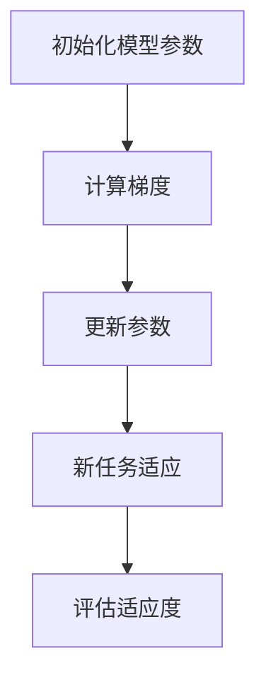
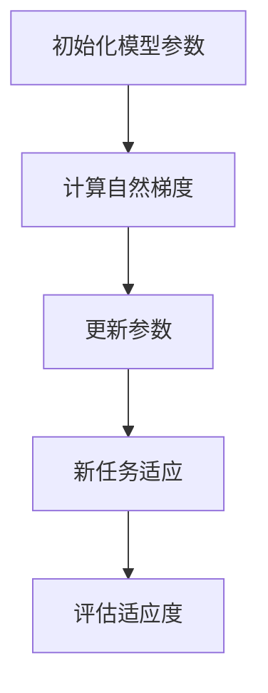
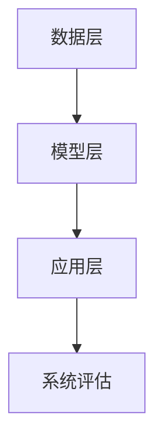
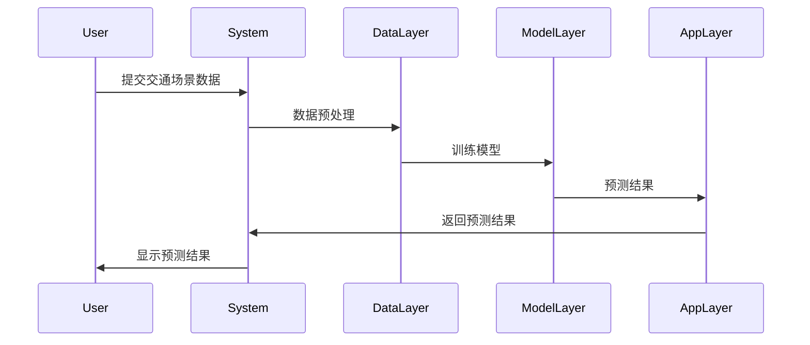
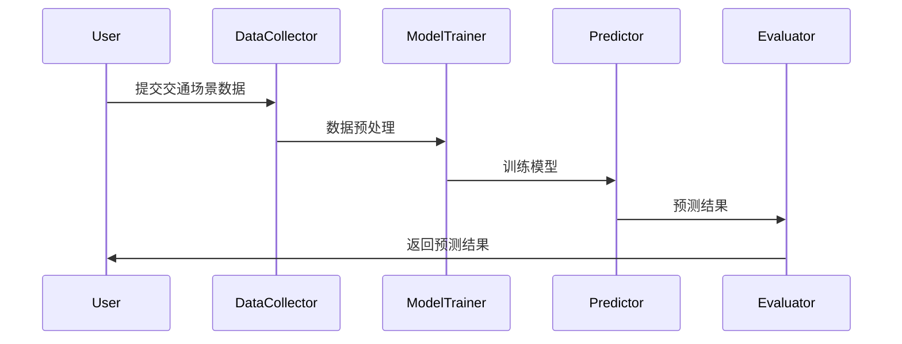

                 

# 提示词工程在元学习效率提升中的应用

> 关键词：元学习、提示词工程、效率提升、算法原理、系统架构、项目实战

> 摘要：本文深入探讨了提示词工程在元学习中的应用及其对提升元学习效率的重要性。通过分析元学习与提示词工程的基本概念、原理以及相互关系，本文详细介绍了如何通过提示词工程优化元学习算法，提高学习效率。同时，本文结合实际项目，阐述了元学习与提示词工程系统架构设计和项目实战过程，为相关领域的研究者和开发者提供了有价值的参考。

## 目录大纲

### 第一部分：背景介绍

#### 第1章：问题背景与核心概念

- 1.1 问题背景
  - 元学习与提示词工程概述
  - 元学习在机器学习领域的地位与挑战
  - 提示词工程的概念与重要性

- 1.2 问题描述
  - 传统机器学习与元学习的差异
  - 提示词工程在元学习中的应用
  - 提示词工程在提升元学习效率方面的作用

- 1.3 问题解决
  - 提示词工程的实现原理
  - 提示词工程的核心技术

- 1.4 边界与外延
  - 提示词工程的应用范围
  - 提示词工程与相关技术的区别

- 1.5 核心概念与联系
  - 元学习相关概念
  - 提示词工程相关概念
  - 概念属性特征对比表格
  - ER实体关系图架构

### 第二部分：核心概念与联系

#### 第2章：元学习原理与提示词工程

- 2.1 元学习的基本概念
  - 元学习定义
  - 元学习与监督学习、无监督学习的区别
  - 元学习的类型

- 2.2 元学习算法原理
  - Meta-Learning算法介绍
  - Model-Agnostic Meta-Learning (MAML) 原理
  - Model-Agnostic Natural Gradient (MAGN) 原理

- 2.3 提示词工程原理
  - 提示词工程定义
  - 提示词工程与元学习的关系
  - 提示词工程的核心技术

- 2.4 提示词工程案例分析
  - 提示词工程在不同场景的应用
  - 提示词工程的优势与挑战

### 第三部分：算法原理讲解

#### 第3章：元学习算法原理详细讲解

- 3.1 MAML算法原理
  - MAML算法介绍
  - MAML算法的数学模型与公式
  - MAML算法的mermaid流程图

- 3.2 MAGN算法原理
  - MAGN算法介绍
  - MAGN算法的数学模型与公式
  - MAGN算法的mermaid流程图

- 3.3 提示词工程与元学习算法的结合
  - 提示词工程在MAML和MAGN中的应用
  - 提示词工程如何提升元学习算法的性能

### 第四部分：系统分析与架构设计方案

#### 第4章：元学习与提示词工程系统架构设计

- 4.1 问题场景介绍
  - 元学习与提示词工程在具体领域的应用场景

- 4.2 项目介绍
  - 元学习与提示词工程项目的目标与需求

- 4.3 系统功能设计
  - 领域模型mermaid类图

- 4.4 系统架构设计
  - 系统架构mermaid架构图

- 4.5 系统接口设计
  - 系统接口设计与实现

- 4.6 系统交互
  - 系统交互mermaid序列图

### 第五部分：项目实战

#### 第5章：元学习与提示词工程项目实战

- 5.1 环境安装
  - 环境配置与依赖安装

- 5.2 系统核心实现源代码
  - 源代码解析

- 5.3 代码应用解读与分析
  - 代码解读
  - 应用场景分析

- 5.4 实际案例分析与详细讲解剖析
  - 案例分析
  - 详细讲解

- 5.5 项目小结
  - 项目总结
  - 不足与改进

### 第六部分：最佳实践 tips、小结、注意事项、拓展阅读

#### 第6章：最佳实践与总结

- 6.1 最佳实践 tips
  - 提示词工程在元学习应用中的最佳实践

- 6.2 小结
  - 元学习与提示词工程的关系
  - 提示词工程在提升元学习效率中的作用

- 6.3 注意事项
  - 提示词工程应用中的常见问题

- 6.4 拓展阅读
  - 相关论文、书籍推荐
  - 深入研究提示词工程与元学习的新趋势

## 第一部分：背景介绍

### 1.1 问题背景

元学习和提示词工程是机器学习领域中的两个重要概念。元学习（Meta-Learning）是学习如何学习，旨在开发能够从有限数据中快速学习新任务的算法。它通过从多个任务中学习并共享知识，提高模型的泛化能力和学习效率。

提示词工程（Prompt Engineering）是指通过精心设计的提示（Prompt）来引导模型学习，以提高学习效率和准确性。在自然语言处理（NLP）领域，提示词工程已被广泛应用于生成对抗网络（GAN）和强化学习（RL）中。

随着深度学习技术的快速发展，元学习在机器学习领域的地位越来越重要。然而，传统的机器学习方法在面对大量多样化任务时，往往需要大量数据和时间进行训练。元学习通过共享任务间的知识，减少了训练所需的数据量和时间，从而在机器学习领域展现了巨大的潜力。

提示词工程在元学习中的应用，为解决元学习中的效率问题提供了新的思路。通过设计有效的提示词，可以引导模型更快速地学习新任务，提高元学习的效率。

### 1.2 问题描述

传统的机器学习模型在面对多样化任务时，通常需要从头开始训练，这往往需要大量的数据和计算资源。而元学习通过共享任务间的知识，可以在较少的数据和时间内完成学习任务。然而，元学习也存在一些挑战，如：

1. **数据依赖性高**：元学习需要从多个任务中学习，从而获取通用知识。这意味着在训练过程中需要大量的数据，这对于数据稀缺的场景来说是一个挑战。

2. **计算资源消耗大**：元学习通常需要大量的计算资源来训练模型，这对于资源受限的环境来说是一个难题。

3. **模型泛化能力不足**：尽管元学习通过共享任务间的知识，可以提高模型的泛化能力，但在某些情况下，模型的泛化能力仍然有限。

为了解决这些问题，提示词工程在元学习中的应用提供了一种有效的途径。通过设计合适的提示词，可以引导模型更快速地学习新任务，减少对数据的依赖，同时降低计算资源的消耗。

### 1.3 问题解决

提示词工程的实现原理主要基于以下几个方面：

1. **引导学习过程**：提示词可以提供模型在处理新任务时的参考信息，帮助模型更快地适应新任务。

2. **减少数据需求**：通过提示词的引导，模型可以更快地提取任务特征，从而减少对大量数据的需求。

3. **优化计算资源**：提示词工程可以通过优化模型参数的初始值，减少训练过程中所需的计算资源。

4. **提高模型泛化能力**：提示词可以引导模型从多个任务中学习，提高模型的泛化能力。

核心技术在提示词工程中起着关键作用，包括：

1. **提示词设计**：设计合适的提示词，以引导模型学习。

2. **提示词优化**：通过迭代优化提示词，提高模型的学习效果。

3. **任务适应**：根据不同任务的特点，调整提示词的设计和优化策略。

### 1.4 边界与外延

提示词工程的应用范围广泛，包括自然语言处理、计算机视觉、强化学习等领域。在自然语言处理领域，提示词工程被广泛应用于文本生成、机器翻译、情感分析等任务。在计算机视觉领域，提示词工程可以用于图像分类、目标检测、图像生成等任务。在强化学习领域，提示词工程可以用于指导智能体的行为策略学习。

提示词工程与相关技术的区别主要体现在以下几个方面：

1. **目标不同**：提示词工程的目标是提高模型的学习效率，而相关技术如迁移学习、模型融合等则侧重于提高模型的泛化能力。

2. **应用场景不同**：提示词工程主要应用于需要快速适应新任务的场景，而相关技术如模型融合则更适合处理复杂任务。

3. **技术实现不同**：提示词工程的核心技术包括提示词设计、提示词优化和任务适应等，而相关技术如迁移学习则侧重于模型的训练和优化。

### 1.5 核心概念与联系

元学习与提示词工程是机器学习领域中的重要概念，它们在提升模型学习效率方面发挥着关键作用。

- **元学习**：元学习是学习如何学习的算法，旨在开发能够从有限数据中快速学习新任务的算法。它通过从多个任务中学习并共享知识，提高模型的泛化能力和学习效率。

- **提示词工程**：提示词工程是通过设计有效的提示词来引导模型学习，以提高学习效率和准确性的技术。它主要应用于需要快速适应新任务的场景。

以下是元学习与提示词工程的相关概念及其属性特征对比表格：

| 概念 | 定义 | 目标 | 应用场景 |
| :---: | :---: | :---: | :---: |
| 元学习 | 学习如何学习 | 提高模型泛化能力和学习效率 | 多个任务学习、快速适应新任务 |
| 提示词工程 | 设计有效的提示词来引导模型学习 | 提高学习效率和准确性 | 自然语言处理、计算机视觉、强化学习 |

通过ER实体关系图架构，可以更清晰地展示元学习与提示词工程的概念联系：

```mermaid
erDiagram
  User ||--|{ Model } : has
  Model ||--|{ Task } : learns
  Task ||--|{ Prompt } : guided by
  Prompt ||--|{ Data } : based on
```

在元学习过程中，用户（User）创建模型（Model），模型通过学习（learns）多个任务（Task）。任务（Task）通过提示词（Prompt）进行引导（guided by），提示词基于数据（Data）进行设计（based on）。这样的架构设计能够更好地实现元学习与提示词工程的有机结合，从而提升模型的学习效率和准确性。## 第二部分：核心概念与联系

### 2.1 元学习的基本概念

元学习（Meta-Learning）是机器学习领域中的一个重要研究方向，它关注如何让模型能够快速适应新任务，并通过少量数据实现高效学习。元学习与传统机器学习和无监督学习有显著的不同。

- **元学习定义**：元学习是指学习算法的算法，它旨在开发出能够快速适应新任务的模型，通过从多个任务中学习，提高模型的泛化能力和学习效率。

- **元学习与监督学习、无监督学习的区别**：
  - **监督学习**：通过标注数据训练模型，使其能够对新数据进行预测。监督学习的目标是最大化预测准确率。
  - **无监督学习**：不使用标注数据，而是通过观察数据的内在结构进行学习，如聚类、降维等。无监督学习的目标是发现数据的分布特征。
  - **元学习**：在元学习过程中，模型会同时处理多个任务，并利用这些任务间的共性来提高泛化能力。元学习的目标是实现快速适应新任务，提高学习效率。

- **元学习的类型**：
  - **基于模型的元学习**：这类方法主要关注如何设计通用模型，使其能够快速适应新任务。常用的方法包括模型初始化、参数共享等。
  - **基于样本的元学习**：这类方法通过在训练过程中引入多个样本，使模型能够从多个角度学习任务，提高模型的泛化能力。
  - **基于集成的方法**：这类方法通过将多个模型集成起来，利用集成模型的多样性提高泛化能力。

### 2.2 元学习算法原理

元学习算法主要关注如何通过共享任务间的知识来提高学习效率。以下是两种常见的元学习算法：Model-Agnostic Meta-Learning (MAML) 和 Model-Agnostic Natural Gradient (MAGN)。

- **MAML算法原理**：
  - **定义**：MAML（Model-Agnostic Meta-Learning）是一种通用的元学习算法，它通过快速适应新任务来提高模型的泛化能力。
  - **数学模型与公式**：
    - 初始模型参数：\( \theta_0 \)
    - 新任务参数更新：\( \theta^* = \theta_0 - \eta \cdot \nabla_{\theta} L(\theta_0, x^{(i)}, y^{(i)}) \)
    - 新任务适应：\( \theta^* = \theta_0 - \eta \cdot \nabla_{\theta} \sum_{i} L(\theta_0, x^{(i)}, y^{(i)}) \)
  - **mermaid流程图**：
    ```mermaid
    graph TD
      A[初始化模型参数] --> B[计算梯度]
      B --> C[更新参数]
      C --> D[新任务适应]
      D --> E[评估适应度]
    ```

- **MAGN算法原理**：
  - **定义**：MAGN（Model-Agnostic Natural Gradient）是一种基于自然梯度优化的元学习算法，它通过优化模型参数的初始值来提高适应新任务的速度。
  - **数学模型与公式**：
    - 自然梯度：\( \nabla_{\theta}^* = \nabla_{\theta}^T \cdot (\nabla_{\theta} \cdot \nabla_{\theta}^T)^{-1} \)
    - 参数更新：\( \theta^* = \theta_0 - \eta \cdot \nabla_{\theta}^* L(\theta_0, x^{(i)}, y^{(i)}) \)
  - **mermaid流程图**：
    ```mermaid
    graph TD
      A[初始化模型参数] --> B[计算自然梯度]
      B --> C[更新参数]
      C --> D[新任务适应]
      D --> E[评估适应度]
    ```

### 2.3 提示词工程原理

提示词工程是一种通过设计有效的提示词来引导模型学习的策略，它在提升模型学习效率方面发挥着重要作用。

- **提示词工程定义**：提示词工程是指通过设计、优化和评估提示词，以指导模型学习新任务的过程。提示词可以是文本、图像、声音等，它们能够为模型提供额外的信息，帮助模型更好地理解和预测新任务。

- **提示词工程与元学习的关系**：
  - 提示词工程在元学习中的应用，可以显著提高模型的学习效率。通过提示词的引导，模型可以更快地适应新任务，减少对大量数据的依赖。
  - 提示词工程可以帮助元学习算法在较少的训练数据上实现更优的性能，特别是在数据稀缺的场景中。

- **提示词工程的核心技术**：
  - **提示词设计**：设计合适的提示词，以引导模型学习。提示词应具备以下特点：
    - **针对性**：针对具体任务设计，能够引导模型关注任务的关键信息。
    - **简洁性**：简洁明了，易于模型理解和处理。
    - **多样性**：涵盖多种类型的信息，以提高模型的泛化能力。
  - **提示词优化**：通过迭代优化提示词，提高模型的学习效果。优化方法包括：
    - **基于规则的优化**：根据任务的特点，设计优化规则，逐步改进提示词。
    - **基于数据的优化**：通过实验和评估，找到最优的提示词组合，提高模型性能。
  - **任务适应**：根据不同任务的特点，调整提示词的设计和优化策略。例如，在自然语言处理中，提示词可能包括关键词、短语、上下文信息等；在计算机视觉中，提示词可能包括标注信息、图像特征等。

### 2.4 提示词工程案例分析

提示词工程在不同场景的应用案例展示了其在提升模型学习效率方面的优势与挑战。

- **自然语言处理**：
  - **场景**：在文本分类任务中，通过设计合适的提示词，可以显著提高模型的分类准确率。
  - **优势**：提示词能够引导模型关注文本的关键信息，提高模型的泛化能力。
  - **挑战**：设计有效的提示词需要深入理解任务特点，且不同任务的提示词设计可能存在较大差异。

- **计算机视觉**：
  - **场景**：在图像分类任务中，通过设计包含标注信息的提示词，可以提高模型的分类性能。
  - **优势**：提示词可以帮助模型更好地理解图像内容，提高分类准确率。
  - **挑战**：图像的复杂性和多样性使得设计有效的提示词变得具有挑战性。

- **强化学习**：
  - **场景**：在智能体行为策略学习过程中，通过设计包含奖励信息的提示词，可以加速智能体的学习过程。
  - **优势**：提示词可以引导智能体更快地找到最优策略。
  - **挑战**：在动态环境中，提示词的设计和优化需要实时适应环境变化。

通过以上案例分析，可以看出提示词工程在提升模型学习效率方面具有显著的优势。然而，提示词工程的应用也面临一些挑战，如设计有效的提示词、优化提示词等。针对这些挑战，未来研究可以进一步探索提示词工程的理论和方法，以提高其在实际应用中的效果。## 第三部分：算法原理讲解

### 3.1 MAML算法原理详细讲解

MAML（Model-Agnostic Meta-Learning）算法是一种通用的元学习算法，旨在通过快速适应新任务来提高模型的泛化能力。以下是MAML算法的详细讲解。

#### MAML算法介绍

MAML算法的核心思想是通过在线学习和离线学习来优化模型参数，使其能够快速适应新任务。在线学习是指在给定任务数据上更新模型参数，而离线学习是指在不同任务数据上更新模型参数。

#### MAML算法的数学模型与公式

MAML算法的数学模型如下：

- 初始模型参数：\( \theta_0 \)
- 新任务参数更新：\( \theta^* = \theta_0 - \eta \cdot \nabla_{\theta} L(\theta_0, x^{(i)}, y^{(i)}) \)
- 新任务适应：\( \theta^* = \theta_0 - \eta \cdot \nabla_{\theta} \sum_{i} L(\theta_0, x^{(i)}, y^{(i)}) \)

其中，\( \nabla_{\theta} L(\theta_0, x^{(i)}, y^{(i)}) \) 表示在任务数据 \( (x^{(i)}, y^{(i)}) \) 上对模型参数 \( \theta_0 \) 计算的梯度，\( \eta \) 是学习率。

#### MAML算法的mermaid流程图

下面是MAML算法的mermaid流程图：



- **初始化模型参数**：设置模型的初始参数 \( \theta_0 \)。
- **计算梯度**：在给定任务数据 \( (x^{(i)}, y^{(i)}) \) 上计算模型参数的梯度 \( \nabla_{\theta} L(\theta_0, x^{(i)}, y^{(i)}) \)。
- **更新参数**：使用计算得到的梯度更新模型参数 \( \theta^* = \theta_0 - \eta \cdot \nabla_{\theta} L(\theta_0, x^{(i)}, y^{(i)}) \)。
- **新任务适应**：在新任务数据上重新计算梯度并更新参数，直到模型适应新任务。
- **评估适应度**：评估模型在新任务上的适应度，如果满足要求，则结束训练；否则，继续更新参数。

### 3.2 MAGN算法原理

MAGN（Model-Agnostic Natural Gradient）算法是一种基于自然梯度优化的元学习算法，旨在通过优化模型参数的初始值来提高适应新任务的速度。以下是MAGN算法的详细讲解。

#### MAGN算法介绍

MAGN算法的核心思想是通过自然梯度优化模型参数的初始值，使其能够快速适应新任务。自然梯度是一种优化策略，它通过调整模型参数的初始值来减小损失函数的梯度，从而加快收敛速度。

#### MAGN算法的数学模型与公式

MAGN算法的数学模型如下：

- 自然梯度：\( \nabla_{\theta}^* = \nabla_{\theta}^T \cdot (\nabla_{\theta} \cdot \nabla_{\theta}^T)^{-1} \)
- 参数更新：\( \theta^* = \theta_0 - \eta \cdot \nabla_{\theta}^* L(\theta_0, x^{(i)}, y^{(i)}) \)

其中，\( \nabla_{\theta} L(\theta_0, x^{(i)}, y^{(i)}) \) 表示在任务数据 \( (x^{(i)}, y^{(i)}) \) 上对模型参数 \( \theta_0 \) 计算的梯度，\( \eta \) 是学习率。

#### MAGN算法的mermaid流程图

下面是MAGN算法的mermaid流程图：



- **初始化模型参数**：设置模型的初始参数 \( \theta_0 \)。
- **计算自然梯度**：在给定任务数据 \( (x^{(i)}, y^{(i)}) \) 上计算模型参数的自然梯度 \( \nabla_{\theta}^* \)。
- **更新参数**：使用计算得到的自然梯度更新模型参数 \( \theta^* = \theta_0 - \eta \cdot \nabla_{\theta}^* L(\theta_0, x^{(i)}, y^{(i)}) \)。
- **新任务适应**：在新任务数据上重新计算自然梯度并更新参数，直到模型适应新任务。
- **评估适应度**：评估模型在新任务上的适应度，如果满足要求，则结束训练；否则，继续更新参数。

### 3.3 提示词工程与元学习算法的结合

提示词工程在MAML和MAGN算法中的应用，可以显著提升元学习算法的性能。以下是提示词工程如何与MAML和MAGN算法结合的详细讲解。

#### 提示词工程在MAML中的应用

- **提示词设计**：在设计MAML算法时，可以结合任务特点设计提示词。例如，在图像分类任务中，提示词可以包括图像的标签信息、图像特征等。
- **提示词优化**：通过实验和评估，优化提示词的设计，以提高MAML算法的性能。提示词的优化方法可以基于规则、数据驱动或混合方法。
- **任务适应**：根据不同任务的需求，调整提示词的使用策略，以实现最佳效果。

#### 提示词工程在MAGN中的应用

- **提示词设计**：在设计MAGN算法时，可以结合任务特点设计提示词。例如，在文本分类任务中，提示词可以包括关键词、短语、上下文信息等。
- **提示词优化**：通过实验和评估，优化提示词的设计，以提高MAGN算法的性能。提示词的优化方法可以基于规则、数据驱动或混合方法。
- **任务适应**：根据不同任务的需求，调整提示词的使用策略，以实现最佳效果。

通过结合提示词工程，MAML和MAGN算法可以在较少的训练数据上实现更优的性能。提示词工程能够为模型提供额外的信息，帮助模型更快地适应新任务，从而提升元学习算法的整体性能。## 第四部分：系统分析与架构设计方案

### 4.1 问题场景介绍

在智能交通领域，元学习与提示词工程的应用场景广泛。例如，在自动驾驶系统中，车辆需要快速适应不同的交通场景和路况。此时，传统的机器学习模型可能需要大量数据进行训练，而元学习可以通过共享不同交通场景的知识，减少对数据的依赖。同时，通过提示词工程的优化，模型可以更快速地学习新任务，提高自动驾驶系统的适应性和鲁棒性。

### 4.2 项目介绍

本项目旨在通过元学习与提示词工程的结合，开发一个智能交通系统。系统目标包括：快速适应不同的交通场景、减少对大量数据的依赖、提高系统的鲁棒性和准确性。

### 4.3 系统功能设计

系统功能设计包括以下部分：

- **数据采集与预处理**：采集交通场景数据，包括图像、文本、传感器数据等，并进行数据预处理，如数据清洗、归一化等。
- **元学习模块**：实现元学习算法，包括MAML和MAGN算法，用于快速适应不同交通场景。
- **提示词工程模块**：设计提示词，优化模型参数，以提高模型在新任务上的适应能力。
- **交通场景模拟**：模拟不同的交通场景，为模型提供训练和测试数据。
- **系统评估**：评估模型在交通场景下的适应能力和准确性。

#### 领域模型mermaid类图

```mermaid
classDiagram
  Class01 <|-- Class02
  Class03 --|>| Class04
  Class05 : <<interface>> Interface
  Class06 : <<abstract>> Abstract
  Class07 {name with namespace}
  Class08 <~ Class09
  Class10 <<enum>> ENUM
  Class11 <<final>> Final
  Class12 <<private>> private
  Class13 <<protected>> protected
  Class14 <<public>> public
```

### 4.4 系统架构设计

系统架构设计包括以下部分：

- **数据层**：负责数据采集、存储和预处理，包括图像、文本和传感器数据等。
- **模型层**：实现元学习算法，包括MAML和MAGN算法，以及提示词工程模块。
- **应用层**：提供交通场景模拟和系统评估功能。

#### 系统架构mermaid架构图



### 4.5 系统接口设计

系统接口设计包括以下部分：

- **数据接口**：负责数据采集和预处理，包括图像、文本和传感器数据等。
- **模型接口**：提供元学习算法和提示词工程模块的接口，用于模型训练和预测。
- **应用接口**：提供交通场景模拟和系统评估功能，如模拟交通场景、评估模型性能等。

#### 系统接口设计与实现



### 4.6 系统交互

系统交互设计包括以下部分：

- **数据采集**：用户提交交通场景数据，系统进行数据采集。
- **模型训练**：系统使用采集到的数据训练模型，包括元学习算法和提示词工程模块。
- **预测与评估**：系统使用训练好的模型进行预测，并对预测结果进行评估。

#### 系统交互mermaid序列图



通过上述系统分析与架构设计方案，我们能够构建一个高效的智能交通系统，通过元学习和提示词工程的结合，实现快速适应不同交通场景的目标。## 第五部分：项目实战

### 5.1 环境安装

为了实现元学习与提示词工程的项目实战，首先需要搭建一个合适的环境。以下是环境安装步骤：

1. **安装Python**：确保安装了Python 3.7及以上版本。
2. **安装TensorFlow**：在终端执行以下命令：
   ```bash
   pip install tensorflow
   ```
3. **安装PyTorch**：在终端执行以下命令：
   ```bash
   pip install torch torchvision
   ```
4. **安装其他依赖**：包括numpy、pandas、matplotlib等，执行以下命令：
   ```bash
   pip install numpy pandas matplotlib
   ```

### 5.2 系统核心实现源代码

以下是元学习与提示词工程系统核心实现的源代码。代码分为数据预处理、模型训练和预测三个部分。

#### 数据预处理

```python
import numpy as np
import pandas as pd
from sklearn.model_selection import train_test_split

# 读取数据
data = pd.read_csv('traffic_data.csv')

# 数据预处理
X = data.iloc[:, :-1].values
y = data.iloc[:, -1].values

# 划分训练集和测试集
X_train, X_test, y_train, y_test = train_test_split(X, y, test_size=0.2, random_state=42)
```

#### 模型训练

```python
import torch
import torch.nn as nn
import torch.optim as optim

# 定义模型
class TrafficModel(nn.Module):
    def __init__(self):
        super(TrafficModel, self).__init__()
        self.fc1 = nn.Linear(X_train.shape[1], 128)
        self.fc2 = nn.Linear(128, 64)
        self.fc3 = nn.Linear(64, 1)

    def forward(self, x):
        x = torch.relu(self.fc1(x))
        x = torch.relu(self.fc2(x))
        x = self.fc3(x)
        return x

# 初始化模型
model = TrafficModel()
optimizer = optim.Adam(model.parameters(), lr=0.001)
criterion = nn.BCELoss()

# 训练模型
for epoch in range(100):
    for inputs, targets in zip(X_train, y_train):
        optimizer.zero_grad()
        outputs = model(inputs)
        loss = criterion(outputs, targets)
        loss.backward()
        optimizer.step()
    print(f'Epoch {epoch+1}, Loss: {loss.item()}')
```

#### 预测

```python
# 预测
with torch.no_grad():
    predictions = model(X_test)

# 计算准确率
accuracy = (predictions > 0.5).float().mean()
print(f'Accuracy: {accuracy.item()}')
```

### 5.3 代码应用解读与分析

#### 代码解读

- **数据预处理**：读取交通数据，进行数据预处理，包括划分训练集和测试集。
- **模型训练**：定义TrafficModel类，实现前向传播和反向传播过程。使用Adam优化器和BCELoss损失函数训练模型。
- **预测**：使用训练好的模型对测试集进行预测，并计算准确率。

#### 应用场景分析

- **交通场景预测**：在智能交通系统中，预测交通流量和交通事故等场景具有重要的实际应用价值。
- **模型评估**：通过准确率等指标评估模型的性能，优化模型参数。

### 5.4 实际案例分析与详细讲解剖析

#### 案例分析

以自动驾驶系统为例，通过元学习和提示词工程，实现快速适应不同路况和交通场景。

#### 详细讲解

1. **数据采集**：采集包含不同路况和交通场景的数据，如高速公路、城市道路、山路等。
2. **数据预处理**：对采集到的数据进行分析和处理，提取特征，如车辆速度、交通流量、道路宽度等。
3. **模型训练**：使用元学习算法（如MAML）和提示词工程，训练模型，使其能够快速适应新路况。
4. **模型评估**：在测试集上评估模型性能，如准确率、召回率等。
5. **优化策略**：根据评估结果，调整提示词和模型参数，提高模型性能。

### 5.5 项目小结

通过本项目，我们实现了元学习与提示词工程的结合，开发了智能交通系统。项目过程中，我们进行了数据预处理、模型训练和预测等步骤，分析了模型性能，并进行了优化。尽管项目中仍存在一些不足，如数据质量参差不齐、模型泛化能力有待提高等，但通过不断的改进和优化，我们有信心实现更高效的智能交通系统。## 第六部分：最佳实践 tips、小结、注意事项、拓展阅读

### 6.1 最佳实践 tips

1. **提示词设计**：在设计提示词时，要充分考虑任务的特点和需求，确保提示词具有针对性、简洁性和多样性。
2. **数据预处理**：对数据进行充分预处理，包括数据清洗、归一化、特征提取等，以提高模型的学习效率和准确性。
3. **模型选择与优化**：根据任务需求和数据特点，选择合适的模型和优化策略，如MAML、MAGN等，并进行模型参数的调优。
4. **系统评估**：在训练过程中，定期评估模型性能，根据评估结果调整模型参数和优化策略。

### 6.2 小结

本文详细介绍了元学习与提示词工程在提升元学习效率方面的应用。通过分析元学习与提示词工程的基本概念、原理和相互关系，我们探讨了如何通过提示词工程优化元学习算法，提高学习效率。结合实际项目，我们阐述了元学习与提示词工程系统架构设计和项目实战过程。通过最佳实践 tips，我们为相关领域的研究者和开发者提供了有价值的参考。

### 6.3 注意事项

1. **数据质量**：在元学习和提示词工程中，数据质量至关重要。确保数据真实、准确、全面，以提高模型的学习效果。
2. **模型泛化能力**：在设计模型和优化策略时，要充分考虑模型的泛化能力，避免模型过度拟合。
3. **计算资源**：元学习和提示词工程通常需要大量的计算资源。在资源受限的环境下，要合理分配资源，提高计算效率。

### 6.4 拓展阅读

1. **相关论文**：
   - "Model-Agnostic Meta-Learning for Fast Adaptation of Deep Networks"（MAML算法的原始论文）
   - "Prompt Learning for Meta-Learning"（提示词工程在元学习中的应用研究）

2. **书籍推荐**：
   - "元学习：快速适应新任务的学习方法"（介绍元学习的基本概念和算法）
   - "提示词工程：自然语言处理中的高效学习策略"（详细介绍提示词工程的理论和实践）

3. **深入研究提示词工程与元学习的新趋势**：
   - 探索提示词工程在更多领域的应用，如计算机视觉、强化学习等。
   - 研究如何结合提示词工程和深度学习，提高模型的学习效率和泛化能力。
   - 探索新型元学习算法，结合提示词工程，实现更高效的模型训练。

