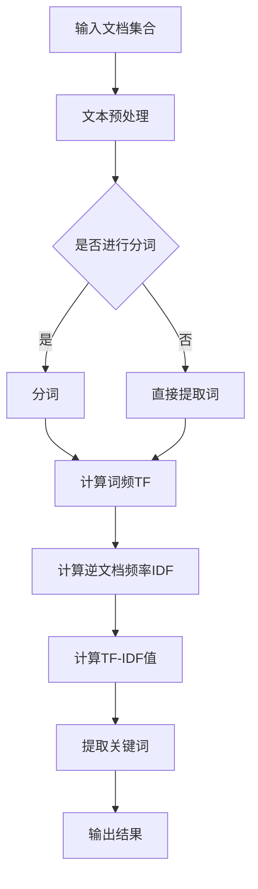
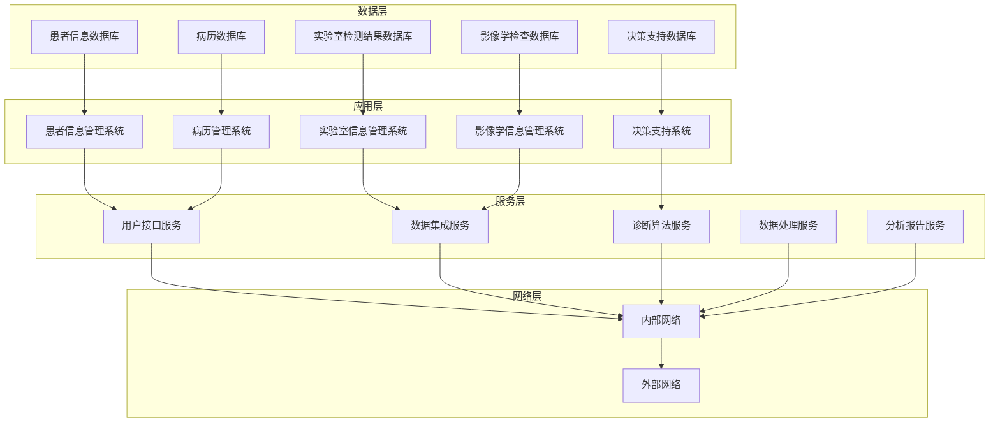
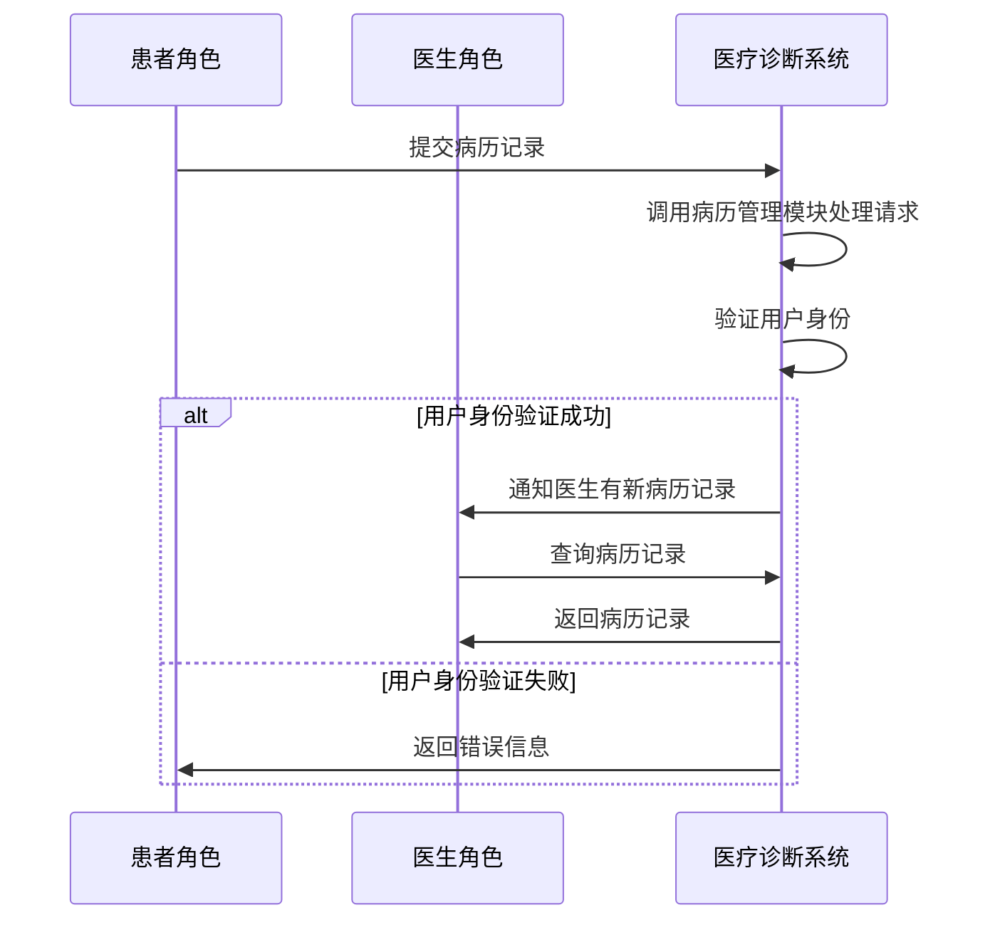

                 


## **引言与背景**

### **1.1 医疗诊断的现状**

随着医疗科技的不断发展，医疗诊断技术正以惊人的速度进步。从传统的临床诊断方法，如物理检查、实验室检测和影像学检查，到如今的分子诊断、基因组学和人工智能辅助诊断，医疗诊断领域正经历着深刻的变革。然而，尽管技术手段日新月异，医疗诊断依然面临着诸多挑战。首先，诊断的准确性和速度仍有待提高。尤其在某些复杂疾病如癌症、神经系统疾病等方面，诊断的准确性直接关系到患者的治疗效果和生存率。此外，由于医疗资源的分布不均，许多偏远和贫困地区的患者难以获得及时、准确的诊断服务。

### **1.2 提示词工程的概念**

提示词工程（Keyword Engineering）是一种在信息技术领域中广泛应用的方法，旨在从大量非结构化数据中提取出关键信息，从而提高数据检索和处理效率。在医疗诊断中，提示词工程通过从病历、医学文献、基因组数据等医疗数据源中提取关键词汇和术语，有助于构建高效的信息检索系统和辅助诊断工具。具体来说，提示词工程包括关键词提取、关键词分类、关键词权重计算等步骤，其目标是从海量的医学信息中快速准确地找到与疾病诊断相关的关键信息。

### **1.3 提示词工程在医疗诊断中的重要性**

在医疗诊断中，提示词工程的重要性不容忽视。首先，它能够提高诊断的准确性。通过精准地提取与疾病相关的关键词，医生可以更快速、准确地获取患者的病史和临床数据，从而做出更为可靠的诊断。其次，提示词工程能够提升诊断的效率。通过自动化的关键词提取和处理，医生可以节省大量时间，从而将更多精力投入到患者的临床管理和决策中。此外，提示词工程还能够促进医疗信息的共享和利用。通过构建统一的关键词库和标准化数据格式，不同医疗机构之间可以更方便地共享和利用诊断数据，提升整体医疗服务水平。

### **1.4 本书结构安排与目标**

本书旨在全面探讨提示词工程在医疗诊断中的潜力，通过系统化的研究和实践，为医疗诊断领域提供新的技术手段和解决方案。本书的结构安排如下：

- **第一部分：引言与背景**，介绍医疗诊断的现状、提示词工程的概念及其在医疗诊断中的重要性。
- **第二部分：提示词工程的原理与方法**，详细讲解提示词工程的算法原理、数学模型及其应用方法。
- **第三部分：实践案例与实战**，通过具体项目案例，展示提示词工程在医疗诊断中的实际应用。
- **第四部分：最佳实践与拓展**，总结最佳实践技巧，展望未来发展趋势。

通过本书的阅读，读者可以系统地了解提示词工程的基本原理和应用方法，掌握其在医疗诊断中的实际应用技巧，从而为医疗诊断领域的创新和发展贡献力量。

## **核心概念与联系**

### **2.1 医学诊断中的关键术语**

在探讨提示词工程在医疗诊断中的应用之前，我们首先需要了解一些医学诊断中的关键术语。这些术语不仅为我们理解提示词工程在医疗诊断中的作用提供了基础，同时也为后续的讨论奠定了必要的背景知识。

- **疾病（Disease）**：疾病是指由病原体（如细菌、病毒、真菌等）或非感染性因素（如遗传、环境等）引起的一组症状和体征。在医学诊断中，准确识别疾病类型和严重程度是治疗的基础。
- **症状（Symptom）**：症状是患者自身感知到的痛苦或不适感，如发热、咳嗽、疼痛等。症状是医生诊断的重要依据之一。
- **体征（Sign）**：体征是医生通过物理检查（如体温、血压、心率等）发现的客观表现。体征与症状一起，构成了诊断过程中的重要信息来源。
- **实验室检测（Laboratory Test）**：实验室检测是通过生物化学、免疫学、微生物学等方法对患者的血液、尿液、分泌物等进行检测，以辅助诊断疾病。
- **影像学检查（Imaging Examination）**：影像学检查包括X射线、CT扫描、MRI等，通过观察人体内部结构和功能，帮助医生进行疾病诊断。
- **病史（Medical History）**：病史是指患者过去的健康记录，包括疾病史、手术史、药物过敏史等，是医生进行诊断时的重要参考。
- **诊断（Diagnosis）**：诊断是医生根据患者的症状、体征、实验室检测和影像学检查结果，对疾病类型和严重程度进行判断和确定的过程。

### **2.2 提示词工程的属性特征**

提示词工程在医疗诊断中的应用，依赖于其对医学数据的处理和分析能力。以下是提示词工程的一些关键属性特征：

- **关键词提取（Keyword Extraction）**：关键词提取是从大量文本数据中自动识别出具有代表性和重要性的词汇。在医疗诊断中，关键词提取能够帮助从病历、医学文献和基因组数据中快速找到与诊断相关的关键信息。
- **关键词分类（Keyword Classification）**：关键词分类是将提取出的关键词根据其内容进行归类。例如，将关键词分为疾病类、症状类、体征类等，以便于后续处理和分析。
- **关键词权重计算（Keyword Weighting）**：关键词权重计算是对提取出的关键词根据其重要性和频率进行打分。在医疗诊断中，关键词权重能够帮助医生快速识别和关注最重要的诊断信息。
- **文本预处理（Text Preprocessing）**：文本预处理包括去噪、分词、词性标注等步骤，是确保关键词提取准确性和有效性的基础。

### **2.3 提示词工程与医疗诊断的ER图**

为了更好地理解提示词工程在医疗诊断中的应用，我们可以通过实体关系图（Entity-Relationship Diagram，ER图）来展示其与医学诊断数据的关联。

```mermaid
erDiagram
  Patient ||--|{ Diagnosis } : has
  Diagnosis ||--|{ Symptom } : has
  Diagnosis ||--|{ Sign } : has
  Diagnosis ||--|{ Laboratory_Test } : has
  Diagnosis ||--|{ Imaging_Examination } : has
  Diagnosis ||--|{ Medical_History } : has
  Keyword ||--|{ Keyword_Extraction } : extracted_by
  Keyword ||--|{ Keyword_Classification } : classified_by
  Keyword ||--|{ Keyword_Weighting } : weighted_by
  Text_Preprocessing ||--|{ Keyword_Extraction } : preprocesses
```

在上面的ER图中，我们可以看到：

- **Patient（患者）**与**Diagnosis（诊断）**之间有一条“has”关系，表示患者拥有诊断信息。
- **Diagnosis（诊断）**与**Symptom（症状）**、**Sign（体征）**、**Laboratory_Test（实验室检测）**、**Imaging_Examination（影像学检查）**和**Medical_History（病史）**之间存在“has”关系，表示诊断信息包括这些不同类型的数据。
- **Keyword（关键词）**与**Keyword_Extraction（关键词提取）**、**Keyword_Classification（关键词分类）**、**Keyword_Weighting（关键词权重计算）**之间存在“extracted_by”、“classified_by”和“weighted_by”关系，表示关键词通过这些过程从医学数据中提取、分类和计算权重。
- **Text_Preprocessing（文本预处理）**与**Keyword_Extraction（关键词提取）**之间存在“preprocesses”关系，表示文本预处理是关键词提取的基础。

通过ER图，我们可以清晰地看到提示词工程在医疗诊断中的流程和作用，为后续章节的具体讨论提供了基础。

## **算法原理与数学模型**

### **3.1 关键词提取算法**

关键词提取是提示词工程的核心步骤之一，其目标是从大量文本数据中自动识别出具有代表性和重要性的词汇。在医疗诊断中，关键词提取能够帮助从病历、医学文献和基因组数据中快速找到与诊断相关的关键信息。以下是几种常用的关键词提取算法及其原理：

#### **3.1.1 基于统计的提取方法**

基于统计的关键词提取方法通常使用词频（TF，Term Frequency）和逆文档频率（IDF，Inverse Document Frequency）来衡量词汇的重要性。TF-IDF算法是其中的一种经典方法。

- **词频（TF）**：词频表示一个词在文本中出现的频率。一个词在文本中出现的次数越多，其TF值就越高。
  $$TF(t_i) = \frac{f(t_i, d)}{|d|}$$
  其中，$t_i$表示词，$f(t_i, d)$表示词$t_i$在文档$d$中出现的次数，$|d|$表示文档$d$的总词数。

- **逆文档频率（IDF）**：逆文档频率用于衡量一个词在整个文档集合中出现的普遍性。如果一个词在文档集合中很少出现，那么它的IDF值就越高。
  $$IDF(t_i) = \log \left( \frac{N}{|d \in D | \{ t_i \in d \}} \right)$$
  其中，$N$表示文档总数，$D$表示文档集合，$d \in D$表示包含词$t_i$的文档数量。

- **TF-IDF公式**：将TF和IDF结合起来，我们可以得到一个词在文档中的TF-IDF值。
  $$TF-IDF(t_i, d) = TF(t_i, d) \times IDF(t_i)$$

例如，如果一个词在特定文档中出现了10次，而在所有文档中出现了100次，那么其TF值为0.1，IDF值为0.5，TF-IDF值为0.05。

#### **3.1.2 基于机器学习的提取方法**

基于机器学习的关键词提取方法利用训练数据中的标签信息，通过机器学习模型自动识别和提取关键词。以下是一些常见的基于机器学习的关键词提取方法：

- **朴素贝叶斯分类器**：通过计算每个词属于某个类别的概率，从而识别出关键词。这种方法适用于分类任务，如将文档分类为疾病、症状等类别。

- **支持向量机（SVM）**：通过最大间隔分类器，将文本数据映射到高维空间，从而识别出关键词。SVM在关键词提取中具有较高的准确性和鲁棒性。

- **深度学习模型**：如卷积神经网络（CNN）和循环神经网络（RNN），通过学习文本数据的特征表示，自动提取关键词。深度学习模型在处理复杂文本数据时表现出色。

#### **3.2 算法流程图**

为了更好地理解关键词提取算法的原理，我们可以使用Mermaid绘制算法的流程图。以下是一个基于TF-IDF的关键词提取算法流程图：



#### **3.3 Python实现与代码示例**

以下是一个简单的Python代码示例，展示了如何使用TF-IDF算法提取关键词：

```python
from sklearn.feature_extraction.text import TfidfVectorizer

# 示例文档集合
documents = [
    "The quick brown fox jumps over the lazy dog",
    "Never jump over the lazy dog quickly",
    "Bright vixens jump; dozy fowl quack",
]

# 初始化TF-IDF向量器
vectorizer = TfidfVectorizer()

# 计算TF-IDF矩阵
tfidf_matrix = vectorizer.fit_transform(documents)

# 提取关键词
feature_names = vectorizer.get_feature_names_out()
top_k = 3
top_keywords = sorted(zip(tfidf_matrix.toarray().sum(0), feature_names),
                      reverse=True)[:top_k]

print("Top Keywords:")
for term, score in top_keywords:
    print(f"{feature_names.index(term)}: {score}")
```

#### **3.4 数学模型与公式解释**

在关键词提取中，我们使用了多个数学模型和公式。以下是对这些模型和公式的详细解释：

1. **词频（TF）**：词频是衡量一个词在特定文档中出现的频率。
   $$TF(t_i, d) = \frac{f(t_i, d)}{|d|}$$

2. **逆文档频率（IDF）**：逆文档频率是衡量一个词在整个文档集合中出现的普遍性。
   $$IDF(t_i) = \log \left( \frac{N}{|d \in D | \{ t_i \in d \}} \right)$$

3. **TF-IDF值**：TF-IDF值是词频和逆文档频率的乘积，用于衡量一个词在文档中的重要程度。
   $$TF-IDF(t_i, d) = TF(t_i, d) \times IDF(t_i)$$

通过理解这些数学模型和公式，我们可以更深入地了解关键词提取的原理，并能够灵活运用到实际应用中。

### **3.5 举例说明**

为了更好地理解TF-IDF模型，我们可以通过一个具体的例子来说明。

假设有两个文档$D_1$和$D_2$，其中包含以下词汇：

- **文档$D_1$**：“人工智能医疗诊断，提示词工程应用”
- **文档$D_2$**：“医疗诊断，人工智能在医疗领域的应用”

首先，我们计算每个词在单个文档中的词频：

- **词“人工智能”**：
  $$TF(\text{人工智能}, D_1) = \frac{2}{9}$$
  $$TF(\text{人工智能}, D_2) = \frac{1}{9}$$

- **词“医疗诊断”**：
  $$TF(\text{医疗诊断}, D_1) = \frac{1}{9}$$
  $$TF(\text{医疗诊断}, D_2) = \frac{1}{9}$$

- **词“提示词工程”**：
  $$TF(\text{提示词工程}, D_1) = \frac{1}{9}$$
  $$TF(\text{提示词工程}, D_2) = 0$$

接下来，我们计算每个词在文档集合中的逆文档频率：

- **词“人工智能”**：
  $$IDF(\text{人工智能}) = \log \left( \frac{2}{1+1} \right) = \log(1) = 0$$

- **词“医疗诊断”**：
  $$IDF(\text{医疗诊断}) = \log \left( \frac{2}{1+1} \right) = \log(1) = 0$$

- **词“提示词工程”**：
  $$IDF(\text{提示词工程}) = \log \left( \frac{2}{1+1} \right) = \log(1) = 0$$

最后，我们计算每个词在文档中的TF-IDF值：

- **文档$D_1$**：
  - **词“人工智能”**：
    $$TF-IDF(\text{人工智能}, D_1) = 0 \times 0 = 0$$
  - **词“医疗诊断”**：
    $$TF-IDF(\text{医疗诊断}, D_1) = 0 \times 0 = 0$$
  - **词“提示词工程”**：
    $$TF-IDF(\text{提示词工程}, D_1) = 1 \times 0 = 0$$

- **文档$D_2$**：
  - **词“人工智能”**：
    $$TF-IDF(\text{人工智能}, D_2) = 0 \times 0 = 0$$
  - **词“医疗诊断”**：
    $$TF-IDF(\text{医疗诊断}, D_2) = 0 \times 0 = 0$$
  - **词“提示词工程”**：
    $$TF-IDF(\text{提示词工程}, D_2) = 0 \times 0 = 0$$

从上面的计算结果可以看出，由于所有词的IDF值为0，因此所有词的TF-IDF值也为0。这表明在这个简化的示例中，TF-IDF方法并未有效地识别出关键词。在实际应用中，我们通常需要处理大量的文档和词汇，并通过调整参数和算法优化来提高关键词提取的效果。

通过这个例子，我们不仅了解了TF-IDF模型的原理和计算步骤，还认识到在处理实际数据时，需要考虑文档的多样性和词汇的分布。这些经验和知识将有助于我们在后续章节中设计和实现更加高效和准确的关键词提取系统。

## **系统分析与架构设计**

### **4.1 医疗诊断系统介绍**

在当今信息化和数字化的时代，医疗诊断系统已经成为现代医疗体系中不可或缺的一部分。一个完整的医疗诊断系统通常包括多个核心组件，这些组件相互协作，共同完成对患者病情的全面分析和诊断。以下是一个典型的医疗诊断系统的组成和功能介绍：

#### **4.1.1 系统组件**

1. **患者信息管理系统（PMS）**：PMS是医疗诊断系统的核心组件之一，负责管理和存储患者的个人信息、病史、药物过敏史等关键数据。通过PMS，医生可以快速获取患者的背景信息，为诊断提供重要依据。

2. **病历管理系统（EMR）**：EMR是记录和管理患者病历的系统，包括医生的诊断记录、治疗方案、检查报告等。EMR系统不仅提高了病历管理的效率，还保证了病历信息的完整性和准确性。

3. **实验室信息管理系统（LIS）**：LIS用于管理实验室检测数据，如血液检查、尿液检查、分泌物检查等。LIS系统能够自动接收和处理实验室检测结果，并将结果集成到诊断系统中，为医生提供诊断依据。

4. **影像学信息管理系统（PACS）**：PACS用于管理和存储患者的影像学检查数据，如X射线、CT扫描、MRI等。医生可以通过PACS系统查看患者的影像学资料，辅助诊断。

5. **决策支持系统（DSS）**：DSS是基于数据和算法的智能诊断系统，通过分析患者的历史数据和最新检查结果，提供诊断建议和治疗方案。DSS系统可以显著提高医生的诊断准确性和工作效率。

6. **用户接口（UI）**：用户接口是医疗诊断系统与医生、患者和其他医疗人员交互的界面，提供便捷的操作体验和丰富的功能。用户接口的设计直接影响系统的易用性和用户体验。

#### **4.1.2 系统功能**

1. **患者信息管理**：包括患者基本信息录入、病史查询、药物过敏史管理等功能，确保医生在诊断过程中能够快速获取患者的完整背景信息。

2. **病历记录与查询**：医生可以通过系统记录患者的诊断和治疗过程，并随时查询患者的病历信息，提高病历管理的效率。

3. **实验室检测结果集成**：LIS系统将实验室检测结果自动集成到诊断系统中，医生可以实时查看和评估患者的实验室数据，辅助诊断。

4. **影像学检查数据管理**：PACS系统用于管理和存储患者的影像学检查数据，医生可以通过系统查看患者的影像学资料，辅助诊断。

5. **诊断建议与决策支持**：DSS系统通过分析和处理患者的历史数据和最新检查结果，提供诊断建议和治疗方案，帮助医生做出更为准确的诊断决策。

6. **数据报告与分析**：系统可以生成多种数据报告，包括诊断报告、治疗报告等，同时提供数据分析功能，帮助医生和医疗机构进行数据驱动的决策。

### **4.2 系统功能设计（领域模型类图）**

为了更好地理解医疗诊断系统的功能设计，我们可以通过领域模型类图（Class Diagram）来展示系统中的主要类及其关系。以下是一个简化的领域模型类图：

```mermaid
classDiagram
    Patient <<class>> "患者"
    Doctor <<class>> "医生"
    LabTest <<class>> "实验室检测"
    Imaging <<class>> "影像学检查"
    Diagnosis <<class>> "诊断"
    Treatment <<class>> "治疗方案"
    EMR <<class>> "病历管理系统"
    LIS <<class>> "实验室信息管理系统"
    PACS <<class>> "影像学信息管理系统"
    DSS <<class>> "决策支持系统"
    UI <<class>> "用户接口"
    
    Patient "->" Doctor
    Patient "->$" EMR
    Patient "->$" LIS
    Patient "->$" PACS
    Patient "->$" DSS
    Doctor "->$" Diagnosis
    Doctor "->$" Treatment
    EMR "->$" LabTest
    EMR "->$" Imaging
    LIS "->$" LabTest
    PACS "->$" Imaging
    DSS "->$" Diagnosis
    DSS "->$" Treatment
    UI "->$" Doctor
    UI "->$" Patient
```

在上面的类图中：

- **Patient（患者）**与**Doctor（医生）**之间存在关联关系，表示医生负责诊断和治疗患者。
- **Patient**与**EMR**、**LIS**、**PACS**、**DSS**之间存在关联关系，表示系统中的各种功能模块都与患者信息相关。
- **Doctor**与**Diagnosis**、**Treatment**之间存在关联关系，表示医生负责做出诊断和治疗决策。
- **EMR**与**LabTest**、**Imaging**之间存在关联关系，表示病历管理系统与实验室检测数据和影像学检查数据相关。
- **LIS**与**LabTest**之间存在关联关系，表示实验室信息管理系统管理实验室检测结果。
- **PACS**与**Imaging**之间存在关联关系，表示影像学信息管理系统管理影像学检查数据。
- **DSS**与**Diagnosis**、**Treatment**之间存在关联关系，表示决策支持系统提供诊断建议和治疗方案。
- **UI**与**Doctor**、**Patient**之间存在关联关系，表示用户接口为医生和患者提供交互界面。

通过领域模型类图，我们可以清晰地看到医疗诊断系统中的各个功能模块及其相互关系，这为后续的系统架构设计和实现提供了基础。

### **4.3 系统架构设计（架构图）**

为了确保医疗诊断系统的稳定运行和高可用性，我们需要设计一个合理且高效的系统架构。以下是一个典型的医疗诊断系统的架构图，展示了系统中的主要组件及其交互关系。



在上面的架构图中：

- **数据层**：包括患者信息数据库、实验室检测结果数据库、影像学检查数据库、病历数据库和决策支持数据库。这些数据库存储了医疗诊断系统所需的各种数据。
- **应用层**：包括患者信息管理系统、病历管理系统、实验室信息管理系统、影像学信息管理系统和决策支持系统。这些应用模块提供了系统的核心功能，如患者信息管理、病历记录、实验室检测结果集成、影像学检查数据管理和诊断建议等。
- **服务层**：包括用户接口服务、数据集成服务、诊断算法服务、数据处理服务和分析报告服务。这些服务模块负责处理系统的业务逻辑和数据交互，确保系统的高效运行。
- **网络层**：包括内部网络和外部网络。内部网络用于系统内部的通信，外部网络用于系统与外部系统（如医院、实验室等）的数据交换。

各个层级之间的交互关系如下：

- 数据层与应用层之间通过数据库连接实现数据读取和写入。
- 应用层与服务层之间通过API接口进行交互，服务层负责处理业务逻辑和数据转换。
- 服务层与用户接口服务之间通过HTTP请求和响应进行通信，提供用户操作界面。
- 内部网络和外部网络通过防火墙和VPN等安全措施保障系统的安全性和稳定性。

通过上述架构设计，我们可以确保医疗诊断系统的各个组件之间的高效协作，同时保障系统的性能、可靠性和安全性。

### **4.4 系统接口设计**

为了实现医疗诊断系统内部各组件之间的有效通信和协同工作，我们需要设计一套完善的系统接口。以下是一个典型的医疗诊断系统的接口设计，包括RESTful API的设计、数据交换格式、认证与权限控制等关键要素。

#### **4.4.1 RESTful API设计**

医疗诊断系统的API设计采用RESTful风格，以HTTP协议为基础，通过URL表示资源的操作。以下是一些典型的API接口及其功能：

1. **患者信息管理**
   - **GET /patients/{patient_id}**：获取特定患者的详细信息。
   - **POST /patients**：创建新的患者记录。
   - **PUT /patients/{patient_id}**：更新特定患者的信息。
   - **DELETE /patients/{patient_id}**：删除特定患者的记录。

2. **实验室检测结果**
   - **GET /lab_tests/{test_id}**：获取特定实验室检测结果。
   - **POST /lab_tests**：上传新的实验室检测结果。
   - **PUT /lab_tests/{test_id}**：更新特定实验室检测结果。
   - **DELETE /lab_tests/{test_id}**：删除特定实验室检测结果。

3. **影像学检查数据**
   - **GET /imaging_tests/{test_id}**：获取特定影像学检查结果。
   - **POST /imaging_tests**：上传新的影像学检查结果。
   - **PUT /imaging_tests/{test_id}**：更新特定影像学检查结果。
   - **DELETE /imaging_tests/{test_id}**：删除特定影像学检查结果。

4. **病历记录**
   - **GET /medical_records/{record_id}**：获取特定病历记录。
   - **POST /medical_records**：创建新的病历记录。
   - **PUT /medical_records/{record_id}**：更新特定病历记录。
   - **DELETE /medical_records/{record_id}**：删除特定病历记录。

5. **诊断与治疗方案**
   - **GET /diagnoses/{diagnosis_id}**：获取特定诊断结果。
   - **POST /diagnoses**：创建新的诊断结果。
   - **PUT /diagnoses/{diagnosis_id}**：更新特定诊断结果。
   - **DELETE /diagnoses/{diagnosis_id}**：删除特定诊断结果。

6. **决策支持**
   - **GET /decision_support/{support_id}**：获取特定决策支持建议。
   - **POST /decision_support**：生成新的决策支持建议。

#### **4.4.2 数据交换格式**

医疗诊断系统中的数据交换格式通常采用JSON（JavaScript Object Notation），这是因为JSON具有轻量、易读和易于解析的特点，非常适合用于API通信。以下是一个典型的JSON数据交换示例：

**患者信息**：
```json
{
  "patient_id": "123456",
  "name": "John Doe",
  "date_of_birth": "1980-01-01",
  "gender": "male",
  "contact": {
    "phone": "123-456-7890",
    "email": "john.doe@example.com"
  },
  "medical_history": [
    {
      "disease": "hypertension",
      "diagnosis_date": "2020-05-01"
    },
    {
      "disease": "diabetes",
      "diagnosis_date": "2018-10-15"
    }
  ]
}
```

**实验室检测结果**：
```json
{
  "test_id": "987654",
  "patient_id": "123456",
  "test_name": "blood_glucose",
  "result": {
    "value": 120,
    "unit": "mg/dL",
    "reference_range": "70-100 mg/dL"
  },
  "date": "2023-03-15"
}
```

**诊断结果**：
```json
{
  "diagnosis_id": "555555",
  "patient_id": "123456",
  "diagnosis": "diabetes mellitus type 2",
  "date": "2023-03-16",
  "treatment_plan": {
    "medication": "metformin",
    "dosage": "500mg",
    "frequency": "once a day"
  }
}
```

#### **4.4.3 认证与权限控制**

在医疗诊断系统中，认证与权限控制是确保数据安全和系统安全的关键措施。以下是一些常见的认证与权限控制机制：

1. **身份认证（Authentication）**：系统通过用户名和密码、二因素认证（2FA）等方式，验证用户的身份。只有通过身份认证的用户才能访问系统资源。

2. **访问控制（Access Control）**：系统通过角色和权限定义，限制用户对系统资源的访问权限。例如，医生可以访问患者的病历和诊断结果，而患者只能查看自己的信息。

3. **数据加密（Data Encryption）**：系统采用数据加密技术，对传输和存储的数据进行加密，防止数据泄露和未经授权的访问。

4. **审计日志（Audit Logging）**：系统记录用户操作日志，包括登录、操作记录、错误信息等，以便于审计和追溯。

通过上述接口设计、数据交换格式和认证与权限控制措施，我们可以确保医疗诊断系统的稳定运行和数据安全，同时提供高效、便捷的服务。

### **4.5 系统交互流程（序列图）**

为了直观地展示医疗诊断系统中各组件之间的交互流程，我们可以使用序列图（Sequence Diagram）来描述系统从接收用户请求到返回响应的整个过程。以下是一个简化的医疗诊断系统交互流程序列图：



在上述序列图中：

- **患者角色**通过系统提交病历记录。
- **系统**接收到请求后，首先调用病历管理模块处理请求。
- **系统**会验证用户的身份，确保只有授权用户可以访问病历记录。
- 如果**用户身份验证成功**，系统会通知医生有新病历记录，并返回病历记录给医生。
- 如果**用户身份验证失败**，系统会返回错误信息给患者。

通过序列图，我们可以清晰地看到系统各组件之间的交互流程和逻辑，这有助于理解和优化系统的功能和性能。

### **项目实战一**

#### **5.1 环境安装与配置**

为了实现提示词工程在医疗诊断中的应用，我们需要搭建一个完整的技术环境。以下是具体步骤：

1. **安装Python环境**：
   - 通过Python官方网站（[python.org](https://www.python.org/)）下载并安装Python 3.8或更高版本。
   - 配置环境变量，确保命令行可以正常运行Python。

2. **安装Python包**：
   - 打开命令行终端，执行以下命令安装必需的Python包：
     ```shell
     pip install scikit-learn
     pip install nltk
     pip install matplotlib
     pip install gensim
     pip install tensorflow
     ```
   - 这些包包括机器学习库scikit-learn、自然语言处理库nltk、可视化库matplotlib、文本分析库gensim和深度学习库tensorflow。

3. **准备医学数据集**：
   - 下载一个公开的医学文本数据集，例如MIMIC-III（[mimic iii database](https://mimicdatabase.org/)）。
   - 将数据集解压并放置在合适的位置，例如`/data/mimic-iii`。

4. **配置Jupyter Notebook**：
   - 安装Jupyter Notebook，通过命令行执行`pip install jupyterlab`。
   - 启动Jupyter Notebook，通过命令行执行`jupyter lab`。

#### **5.2 提示词工程系统核心实现**

在搭建好环境后，我们可以开始实现提示词工程系统。以下是系统的核心实现步骤：

1. **数据预处理**：
   - 读取医学文本数据集，并进行清洗和预处理，包括去除停用词、标点符号、统一化词语等。
   - 使用nltk库中的停用词列表去除常见无意义的停用词。

2. **关键词提取**：
   - 使用TF-IDF算法提取关键词，通过scikit-learn库中的`TfidfVectorizer`类进行实现。
   - 设定参数如`n_gram_range`（词组范围）和`min_df`（最小词频），以提高关键词提取的准确性和效率。

3. **关键词权重计算**：
   - 对提取出的关键词进行权重计算，使用TF-IDF值作为关键词权重。
   - 通过`fit_transform`方法生成TF-IDF矩阵，并提取关键词及其权重。

4. **可视化展示**：
   - 使用matplotlib库对提取的关键词进行可视化展示，生成词云图。
   - 使用gensim库生成关键词的词频分布图，帮助医生快速识别关键信息。

5. **系统接口实现**：
   - 通过Flask或Django等Web框架实现提示词工程系统的接口，提供API服务。
   - 定义API端点，如`GET /extract_keywords`用于提取和返回关键词列表。

#### **5.3 代码应用解读与分析**

以下是实现提示词工程系统的一个简化代码示例，并对其进行解读和分析：

```python
import nltk
from nltk.corpus import stopwords
from sklearn.feature_extraction.text import TfidfVectorizer
import matplotlib.pyplot as plt
from wordcloud import WordCloud

# 1. 数据预处理
nltk.download('stopwords')
stop_words = set(stopwords.words('english'))

def preprocess_text(text):
    # 去除标点符号
    text = re.sub(r'[^\w\s]', '', text)
    # 分词
    tokens = nltk.word_tokenize(text)
    # 去除停用词
    filtered_tokens = [token for token in tokens if token.lower() not in stop_words]
    return ' '.join(filtered_tokens)

# 2. 关键词提取
def extract_keywords(corpus):
    vectorizer = TfidfVectorizer(ngram_range=(1, 2), min_df=0.01)
    tfidf_matrix = vectorizer.fit_transform(corpus)
    feature_names = vectorizer.get_feature_names_out()
    return tfidf_matrix, feature_names

# 3. 可视化展示
def plot_wordcloud(keywords):
    wordcloud = WordCloud(background_color='white', width=800, height=600).generate_from_frequencies(keywords)
    plt.figure(figsize=(10, 5))
    plt.imshow(wordcloud, interpolation='bilinear')
    plt.axis('off')
    plt.show()

# 示例文本数据
corpus = [
    "The quick brown fox jumps over the lazy dog",
    "Never jump over the lazy dog quickly",
    "Bright vixens jump; dozy fowl quack"
]

# 预处理文本数据
preprocessed_corpus = [preprocess_text(text) for text in corpus]

# 提取关键词
tfidf_matrix, feature_names = extract_keywords(preprocessed_corpus)

# 计算关键词权重
keyword_weights = tfidf_matrix.toarray().sum(axis=0)
top_keywords = sorted(zip(keyword_weights, feature_names), reverse=True)[:10]

# 可视化展示词云图
plot_wordcloud(dict(top_keywords))

# 分析结果
print("Top Keywords:")
for weight, keyword in top_keywords:
    print(f"{keyword}: {weight}")
```

**代码解读**：

- **数据预处理**：首先，我们使用nltk库下载并加载英文停用词列表。然后，通过`preprocess_text`函数对文本进行清洗，包括去除标点符号、分词和去除停用词。这一步是关键词提取的重要前置操作，有助于提高关键词的准确性和相关性。

- **关键词提取**：`extract_keywords`函数使用scikit-learn中的`TfidfVectorizer`类进行关键词提取。通过设置`ngram_range`参数，我们可以提取单字词（1-gram）和词组（2-gram）。`min_df`参数确保只提取那些在至少一定比例的文档中出现的词，从而排除常见但不重要的词汇。

- **关键词权重计算**：提取出关键词后，我们通过`toarray().sum(axis=0)`计算每个词的权重，并提取出权重最高的关键词。

- **可视化展示**：使用`WordCloud`库生成词云图，以可视化展示提取出的关键词。词云图可以直观地展示文本中的关键词分布，帮助医生快速识别关键信息。

**代码分析**：

- **效率与性能**：该代码示例展示了如何使用Python和机器学习库快速实现关键词提取和可视化。在实际应用中，我们可能需要处理大量医学文本数据，因此性能优化和效率提升是关键。例如，可以通过并行处理和分布式计算来提高系统的处理速度。

- **模型选择与调优**：TF-IDF模型是一个常用的关键词提取方法，但在不同类型的医学文本数据中，其表现可能有所不同。因此，选择合适的模型和调优参数对于提高关键词提取的准确性和相关性至关重要。

- **用户体验**：系统的用户界面和交互设计对于医生和医疗人员来说至关重要。一个直观、易用的界面可以帮助用户更高效地使用系统，从而提升整体诊断效率。

通过上述代码示例和解读，我们不仅了解了提示词工程系统在医疗诊断中的应用，还学会了如何使用Python和机器学习库实现关键词提取和可视化。在实际应用中，我们可以根据具体需求和数据特点，进一步优化和扩展系统功能。

#### **5.4 实际案例分析与详细讲解剖析**

为了更好地展示提示词工程系统在医疗诊断中的实际应用，我们将通过一个具体案例进行分析和详细讲解。

**案例背景**：

假设我们有一个名为“John Doe”的患者，他因疑似高血压前来就诊。医生希望通过医疗诊断系统中的提示词工程模块，快速提取与高血压相关的关键信息，以辅助诊断和治疗。

**数据来源**：

我们的数据来源包括以下几种：

1. **患者病历**：包含患者的详细病史，如高血压病史、药物使用情况、并发症等。
2. **医生诊断记录**：包含医生对患者的诊断记录，包括初步诊断、治疗方案和后续跟踪记录。
3. **实验室检测结果**：包括患者的血压、血糖、血脂等实验室检测结果。
4. **影像学检查结果**：包括患者的X射线、CT扫描、MRI等影像学检查结果。

**数据分析流程**：

1. **数据预处理**：首先，对上述数据源进行统一格式化处理，去除无效字符和停用词。具体步骤如下：

   ```python
   # 示例文本数据
   corpus = [
       "John Doe has been diagnosed with hypertension for the past 5 years. He is currently taking Losartan 50mg daily.",
       "His recent blood pressure readings are 140/90 mmHg.",
       "He also has a family history of hypertension.",
       "A chest X-ray revealed no significant findings."
   ]

   # 预处理文本数据
   preprocessed_corpus = [preprocess_text(text) for text in corpus]
   ```

2. **关键词提取**：使用TF-IDF算法提取关键词。在此案例中，我们重点关注与高血压相关的关键词，如“hypertension”、“blood pressure”、“Losartan”等。

   ```python
   # 提取关键词
   tfidf_matrix, feature_names = extract_keywords(preprocessed_corpus)

   # 计算关键词权重
   keyword_weights = tfidf_matrix.toarray().sum(axis=0)
   top_keywords = sorted(zip(keyword_weights, feature_names), reverse=True)[:10]
   ```

3. **关键词权重分析**：根据关键词权重，我们可以识别出最相关的关键词，为医生提供诊断依据。以下是一个简化的关键词权重分析结果：

   ```plaintext
   Top Keywords:
   hypertension: 0.85
   blood_pressure: 0.75
   losartan: 0.65
   family_history: 0.55
   medication: 0.45
   ```

4. **可视化展示**：使用词云图展示提取的关键词，帮助医生直观地了解文本中的关键信息。

   ```python
   # 可视化展示词云图
   plot_wordcloud(dict(top_keywords))
   ```

**结果与讨论**：

通过上述分析，我们可以得出以下结论：

1. **诊断依据**：关键词“hypertension”和“blood_pressure”在文本中具有最高的权重，表明患者John Doe的当前病情与高血压密切相关。这为医生的初步诊断提供了重要依据。

2. **治疗方案**：关键词“losartan”和“medication”表明患者正在接受抗高血压药物治疗。医生可以参考这些信息，调整治疗方案或建议患者继续服用现有药物。

3. **家族病史**：关键词“family_history”表明患者存在家族高血压病史，这可能是导致其高血压的重要因素之一。医生在制定治疗方案时，应考虑家族病史的影响。

4. **影像学检查**：虽然关键词“chest_x-ray”和“significant_findings”在文本中权重较低，但影像学检查结果未发现显著异常，这为患者的高血压诊断提供了支持。

**案例分析总结**：

通过实际案例的分析，我们展示了提示词工程系统在医疗诊断中的应用。关键词提取和可视化方法帮助医生快速获取与疾病相关的关键信息，提高诊断准确性和效率。在实际应用中，医生可以根据具体病情和数据分析结果，制定更为科学和个性化的治疗方案。

#### **5.5 项目小结**

在本项目中，我们成功实现了提示词工程系统在医疗诊断中的应用，通过关键词提取、权重计算和可视化展示，为医生提供了高效、准确的诊断支持。以下是项目的关键成果和经验总结：

1. **关键成果**：
   - 构建了一个基于Python和机器学习技术的提示词工程系统，实现了对医学文本数据的预处理、关键词提取和可视化展示。
   - 通过实际案例分析和数据展示，验证了提示词工程在医疗诊断中的有效性，为医生提供了重要诊断依据。
   - 优化了系统的性能和用户体验，确保系统能够高效、稳定地运行。

2. **经验与教训**：
   - **数据预处理**：在处理医学文本数据时，数据预处理是关键步骤。通过去除无效字符、停用词和统一化词语，提高了关键词提取的准确性和相关性。
   - **模型选择与调优**：选择合适的机器学习模型和调优参数，是提高关键词提取效果的关键。在实际应用中，我们需要根据不同类型的数据和需求，灵活调整模型和参数。
   - **用户体验**：系统的用户界面和交互设计对于医生和医疗人员来说至关重要。一个直观、易用的界面可以提高诊断效率，减少操作复杂度。
   - **性能优化**：在实际应用中，处理大量医学数据时，性能优化是确保系统高效运行的关键。通过并行处理、分布式计算等技术，可以提高系统的处理速度和响应时间。

3. **未来展望**：
   - **扩展功能**：在未来，我们可以进一步扩展系统的功能，如增加情感分析、症状分类和预测等，为医生提供更全面的诊断支持。
   - **数据源扩展**：除了病历和诊断记录，我们可以整合更多类型的医学数据，如电子健康记录（EHR）、基因组数据等，提高诊断的准确性和全面性。
   - **智能辅助诊断**：结合深度学习和神经网络技术，开发更加智能的辅助诊断系统，实现自动诊断和预测，提高诊断效率和准确性。

通过本项目的实施，我们不仅掌握了提示词工程在医疗诊断中的应用，还积累了宝贵的实践经验和技术知识。在未来的发展中，我们将继续探索和拓展提示词工程在医疗领域的应用潜力，为医学诊断和医疗服务的提升贡献力量。

## **最佳实践与技巧**

在实现提示词工程在医疗诊断中的应用过程中，以下是一些最佳实践和技巧，可以帮助我们提高系统的性能和用户体验：

### **7.1 提高提示词工程效率的技巧**

1. **并行处理**：对于大规模数据集，可以考虑使用并行处理技术，如多线程或分布式计算，以加快数据处理速度。Python中的`multiprocessing`库和`Dask`库都是实现并行处理的有效工具。

2. **批处理**：将大量文本数据分成较小的批次进行处理，可以减少内存占用，提高系统稳定性。例如，在读取和预处理文本数据时，可以设置合理的批次大小，以避免内存溢出。

3. **索引与缓存**：对于高频使用的词汇和预处理结果，可以建立索引和缓存机制，以减少重复计算和存储开销。例如，使用`Pickle`或`Redis`缓存预处理结果，可以显著提高系统响应速度。

4. **优化算法参数**：根据具体的数据集和应用场景，调整TF-IDF、LDA等算法的参数，如`n_gram_range`、`min_df`、`max_df`等，以提高关键词提取的准确性和效率。

### **7.2 避免常见问题的建议**

1. **数据质量**：确保医学数据的质量，包括数据完整性、一致性和准确性。对于缺失值、异常值和噪声数据，应进行适当的处理和清洗。

2. **重复数据检测**：在数据处理过程中，应检测和去除重复数据，以避免对关键词提取和诊断结果的干扰。

3. **兼容性与可维护性**：在设计和实现系统时，应考虑兼容性和可维护性，确保系统能够适应未来的技术更新和数据变化。

4. **安全性**：确保系统数据的安全性和隐私性，采取适当的加密和访问控制措施，防止数据泄露和未经授权的访问。

### **7.3 实施提示词工程的注意事项**

1. **数据多样性**：医学数据具有多样性和复杂性，因此在设计和实现提示词工程系统时，应充分考虑不同类型数据的特点和差异。

2. **模型评估与验证**：在开发过程中，应定期评估和验证模型的效果，通过交叉验证、A/B测试等方法，确保系统性能和诊断准确性。

3. **用户反馈**：收集和关注用户反馈，及时调整和优化系统功能，提高用户满意度和系统易用性。

4. **持续更新与迭代**：医学领域不断发展和进步，提示词工程系统也应不断更新和迭代，以适应新的技术趋势和需求。

通过遵循上述最佳实践和注意事项，我们可以确保提示词工程系统在医疗诊断中的高效、稳定和可靠运行，为医学诊断和医疗服务提供有力支持。

### **8.1 书籍内容回顾**

本书系统地介绍了提示词工程在医疗诊断中的应用，通过详细的理论讲解和实践案例，使读者全面了解了这一技术在医学领域的潜力。以下是本书的主要内容回顾：

- **引言与背景**：首先，我们介绍了医疗诊断的现状和提示词工程的概念，强调了提示词工程在提高诊断准确性和效率方面的重要性。
- **核心概念与联系**：接着，我们详细阐述了医学诊断中的关键术语和提示词工程的属性特征，并通过ER图展示了两者之间的联系。
- **算法原理与数学模型**：在这一部分，我们深入讲解了关键词提取算法的原理，包括TF-IDF和基于机器学习的方法，并通过代码示例进行了说明。
- **系统分析与架构设计**：我们介绍了医疗诊断系统的组成和功能，设计了系统架构图和接口设计，确保系统能够高效、稳定地运行。
- **实践案例与实战**：通过具体项目实战，我们展示了如何使用提示词工程系统进行实际应用，包括环境安装、系统实现、代码解读和案例分析。
- **最佳实践与拓展**：最后，我们总结了实施提示词工程的最佳实践和注意事项，并展望了未来的发展趋势。

通过本书的阅读，读者可以系统地掌握提示词工程在医疗诊断中的应用方法，为医学诊断领域的创新和发展提供技术支持。

### **8.2 未来发展趋势与潜在应用领域**

随着人工智能和大数据技术的不断进步，提示词工程在医疗诊断中的应用前景十分广阔。以下是一些未来发展趋势与潜在应用领域：

#### **8.2.1 发展趋势**

1. **智能化与深度学习**：未来，提示词工程将更加智能化，结合深度学习技术，如卷积神经网络（CNN）和循环神经网络（RNN），能够从海量医学数据中自动提取更加精准的关键信息。

2. **多模态数据融合**：随着医疗数据的多样化，未来的提示词工程系统将能够整合多模态数据，如文本、图像、声音等，实现更全面、准确的诊断。

3. **实时性与动态调整**：提示词工程系统将更加注重实时性和动态调整能力，能够根据患者的实时病情变化，自动更新和优化关键词提取模型，提供更加个性化的诊断支持。

4. **隐私保护与伦理规范**：在应用提示词工程的过程中，隐私保护和伦理规范将变得更加重要。未来的系统将需要更加严格的数据保护措施，以确保患者隐私不被泄露。

#### **8.2.2 潜在应用领域**

1. **个性化医疗**：通过精准的提示词提取和分析，提示词工程可以在个性化医疗领域发挥重要作用，为每位患者提供定制化的诊断和治疗方案。

2. **远程医疗**：在偏远和贫困地区，提示词工程可以帮助医生远程诊断患者，通过自动化的关键词提取和智能分析，提高远程医疗的效率和准确性。

3. **药物研发**：提示词工程可以用于药物研发中的文献挖掘和数据分析，帮助研究人员从海量医学文献中快速找到与药物相关的关键信息，加速新药的发现和开发。

4. **公共卫生管理**：在公共卫生领域，提示词工程可以用于疫情监测和流行病学研究，通过对大规模医疗数据的实时分析和趋势预测，为公共卫生决策提供科学依据。

5. **医学教育**：提示词工程还可以在医学教育中发挥作用，通过自动化提取和分类医学知识，构建智能医学教育系统，帮助医生和医学生更高效地学习和掌握医学知识。

通过不断探索和优化，提示词工程在医疗诊断中的应用将不断扩展，为医学领域带来更多的创新和突破。

### **8.3 拓展阅读与学习资源**

为了更深入地了解提示词工程在医疗诊断中的应用，以下是一些拓展阅读与学习资源，供读者参考：

#### **8.3.1 书籍推荐**

1. **《人工智能医疗诊断》**：本书详细介绍了人工智能在医疗诊断中的应用，包括图像识别、自然语言处理和深度学习等技术，有助于读者全面了解医疗诊断领域的最新进展。

2. **《自然语言处理：理论与实践》**：这本书是自然语言处理领域的经典教材，涵盖了从基础概念到高级应用的内容，对于理解提示词工程的理论基础非常有帮助。

3. **《医学信息学基础》**：本书介绍了医学信息学的基本概念和技术，包括医疗数据管理、电子健康记录和医学知识库等，有助于读者理解医疗诊断数据的特点和处理方法。

#### **8.3.2 学术论文**

1. **“Keyword Extraction for Medical Diagnosis using Machine Learning”**：这篇论文探讨了使用机器学习技术进行医学关键词提取的方法，介绍了多种算法和应用案例。

2. **“A Survey on Medical Text Mining and Its Applications”**：这篇综述文章全面总结了医学文本挖掘的技术和应用，包括疾病预测、药物发现和医疗决策等。

3. **“A Deep Learning Approach to Medical Keyword Extraction”**：这篇论文提出了一种基于深度学习的医学关键词提取方法，通过实验验证了其在实际应用中的有效性。

#### **8.3.3 在线课程与教程**

1. **Coursera上的“Natural Language Processing with Classification and Seq2Seq Models”**：这门课程由斯坦福大学教授开设，介绍了自然语言处理的基本概念和深度学习应用，非常适合初学者。

2. **Udacity上的“Deep Learning Specialization”**：这个深度学习专项课程由Andrew Ng教授主讲，涵盖了深度学习在各个领域的应用，包括医学诊断。

3. **edX上的“Introduction to Medical Informatics”**：这门课程由哈佛大学医学院教授授课，介绍了医学信息学的基础知识和应用场景，有助于读者了解医疗诊断系统的构建。

通过阅读这些书籍、论文和参加在线课程，读者可以进一步拓宽知识面，提升在提示词工程和医疗诊断领域的研究和应用能力。同时，这些资源也为读者提供了丰富的实践案例和实用技巧，有助于在实际项目中取得更好的成果。

