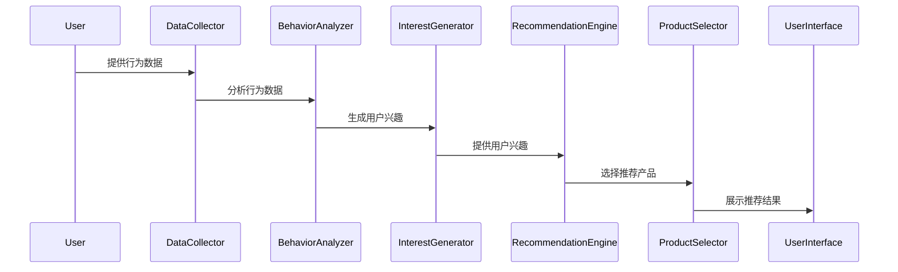
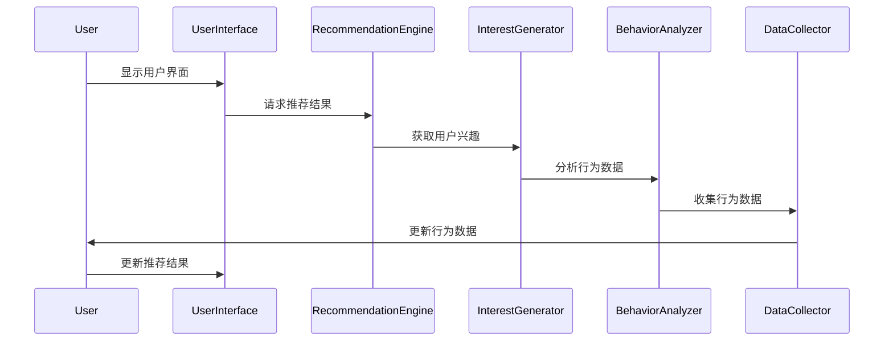

                 

### 目录大纲设计步骤：

1. **确定全书结构**：首先，我们需要确定这本书的基本结构，包括几个主要部分，例如背景介绍、核心概念与联系、算法原理讲解、数学模型和数学公式讲解、系统分析与架构设计方案、项目实战、最佳实践等。

   - **背景介绍**：为读者提供背景知识，介绍为什么需要这本书，解决什么问题。
   - **核心概念与联系**：详细解释本书涉及的核心概念，并展示它们之间的联系。
   - **算法原理讲解**：深入讲解算法原理，包括流程图、源代码、数学模型和公式等。
   - **数学模型和数学公式讲解**：详细解释相关的数学模型和公式。
   - **系统分析与架构设计方案**：介绍系统的应用场景、功能设计、架构设计、接口设计等。
   - **项目实战**：提供实际的案例，展示如何应用书中所述的方法和工具。
   - **最佳实践、小结、注意事项、拓展阅读**：总结全书内容，提供最佳实践经验，提醒注意事项，推荐拓展阅读。

2. **编写第1章：背景介绍**：

   - **问题背景**：介绍为什么需要这本书，解决什么问题。
     - 随着人工智能和机器学习技术的快速发展，模型的复杂性和规模越来越大，如何确保这些模型的决策过程是透明和可解释的成为了一个重要课题。
     - 提示词工程在因果推理可解释性中的应用正是为了解决这一难题。
   - **问题描述**：详细阐述“提示词工程在因果推理可解释性中的应用”这一主题。
     - 提示词工程是一种用于生成能够引导模型做出特定决策的提示词的技术。
     - 因果推理可解释性则是指如何让模型决策过程更加透明，使人类用户能够理解模型是如何做出决策的。
   - **问题解决**：概述本书将如何解决这些问题。
     - 本书将通过详细阐述提示词工程的原理和应用，以及如何将其与因果推理可解释性相结合，提供一套完整的解决方案。
   - **边界与外延**：明确书的讨论范围。
     - 本书主要讨论提示词工程在因果推理可解释性中的应用，不包括其他类型的模型或方法。
     - 书中将涵盖提示词工程的定义、原理、应用方法，以及与因果推理可解释性的结合方式。
   - **核心要素组成**：介绍与主题相关的基本概念和要素。
     - 核心概念包括提示词工程、因果推理、可解释性等。
     - 核心要素包括提示词的生成方法、因果模型的构建、可解释性评估指标等。

3. **编写第2章：核心概念与联系**：

   - **核心概念原理**：详细解释提示词工程和因果推理可解释性的基本原理。
     - 提示词工程是一种利用提示词引导模型决策的技术，通过生成特定的提示词，可以帮助模型更好地理解和预测复杂的数据模式。
     - 因果推理可解释性是指如何让模型的决策过程更加透明和可理解，使人类用户能够理解模型是如何做出决策的。
   - **概念属性特征对比表格**：列出关键概念的属性和特征，进行比较。
     - **提示词工程**：
       - 特征：生成特定的提示词，引导模型决策。
       - 目标：提高模型的预测准确性和可解释性。
       - 方法：基于统计分析和数据挖掘技术。
     - **因果推理可解释性**：
       - 特征：分析模型的决策过程，提供可解释性。
       - 目标：确保模型的决策过程透明和可理解。
       - 方法：基于因果模型和可解释性评估指标。
   - **ER实体关系图架构**：使用Mermaid绘制实体关系图，展示概念之间的关系。
     ```mermaid
     erModel
     Actor [User]
     Entity [Model]
     Entity [Data]
     Entity [Prompt]
     Relationship [uses] from User to Model
     Relationship [collects] from Model to Data
     Relationship [generates] from Model to Prompt
     ```

4. **编写第3章：算法原理讲解**：

   - **算法mermaid流程图**：绘制算法的流程图。
     ```mermaid
     flowchart LR
     A[开始] --> B[收集数据]
     B --> C[预处理数据]
     C --> D[构建因果模型]
     D --> E[生成提示词]
     E --> F[应用提示词]
     F --> G[评估可解释性]
     G --> H[结束]
     ```
   - **Python源代码**：给出算法的Python代码实现。
     ```python
     # Python代码示例：提示词工程算法实现
     def collect_data():
         # 数据收集逻辑
         pass

     def preprocess_data(data):
         # 数据预处理逻辑
         pass

     def build_causal_model(data):
         # 构建因果模型逻辑
         pass

     def generate_prompt(model):
         # 生成提示词逻辑
         pass

     def apply_prompt(model, prompt):
         # 应用提示词逻辑
         pass

     def evaluate_explanability(model, prompt):
         # 评估可解释性逻辑
         pass

     if __name__ == "__main__":
         data = collect_data()
         preprocessed_data = preprocess_data(data)
         causal_model = build_causal_model(preprocessed_data)
         prompt = generate_prompt(causal_model)
         apply_prompt(causal_model, prompt)
         evaluate_explanability(causal_model, prompt)
     ```
   - **数学模型和公式**：详细讲解算法的数学模型和公式。
     - 提示词生成公式：
       $$ \text{prompt} = \text{model}(\text{data}) $$
     - 因果模型公式：
       $$ \text{model}(\text{data}) = f(\text{data}, \text{causal_variables}) $$
   - **举例说明**：通过实例说明算法如何工作。
     - 假设我们有一个分类任务，目标是预测一个客户是否会购买某个产品。我们使用提示词工程来提高模型的可解释性。
     - 首先，我们收集客户的数据，包括年龄、收入、购买历史等。
     - 然后，我们对这些数据进行预处理，如标准化和缺失值处理。
     - 接着，我们构建一个因果模型，该模型考虑了各种可能的因果因素。
     - 之后，我们使用模型生成一个特定的提示词，该提示词引导模型做出预测。
     - 最后，我们评估模型的可解释性，确保模型的决策过程是透明和可理解的。

5. **编写第4章：数学模型和数学公式讲解**：

   - **数学公式**：使用LaTeX格式给出相关数学公式。
     - 提示词生成公式：
       $$ \text{prompt}_{i} = \sum_{j} \text{weight}_{ji} \cdot \text{feature}_{j} $$
     - 因果模型公式：
       $$ \text{prediction}_{i} = f(\text{X}_{i}, \text{W}_{i}) $$
   - **详细讲解**：解释公式的含义和推导过程。
     - 提示词生成公式中，每个提示词是由一组特征加权求和得到的。权重表示每个特征对提示词的重要性。
     - 因果模型公式中，预测是由输入特征和权重矩阵的线性组合得到的。
   - **举例说明**：结合具体案例进行说明。
     - 假设我们有一个客户分类模型，其中年龄和收入是关键特征。我们使用提示词生成公式计算每个客户的提示词值。
     - 假设权重矩阵为：
       $$ \text{W} = \begin{bmatrix} 0.6 & 0.4 \end{bmatrix} $$
     - 假设某个客户的特征为年龄30岁和收入50000美元，则其提示词值为：
       $$ \text{prompt} = 0.6 \cdot 30 + 0.4 \cdot 50000 = 180 + 20000 = 20280 $$

6. **编写第5章：系统分析与架构设计方案**：

   - **问题场景介绍**：描述系统应用的具体场景。
     - 假设我们开发了一个推荐系统，该系统基于用户的兴趣和行为数据，向用户推荐相关产品。
   - **项目介绍**：简要介绍项目的目标和功能。
     - 项目目标是构建一个推荐系统，能够根据用户的行为和兴趣，为用户提供个性化的产品推荐。
     - 功能包括用户数据收集、用户兴趣分析、推荐算法实现和推荐结果展示等。
   - **系统功能设计（领域模型mermaid类图）**：绘制领域模型类图。
     ```mermaid
     classDiagram
     User --> Recommendation: receives
     User --> Product: browses
     Product --> Recommendation: contains
     Recommendation --> User: provides
     ```
   - **系统架构设计（mermaid架构图）**：展示系统架构。
     ```mermaid
     sequenceDiagram
     User->>RecommendationService: request
     RecommendationService->>DataCollectionService: collect
     DataCollectionService->>InterestAnalysisService: analyze
     InterestAnalysisService->>RecommendationService: generate
     RecommendationService->>User: deliver
     ```
   - **系统接口设计和系统交互（mermaid序列图）**：描述系统各个组件之间的交互。
     ```mermaid
     sequenceDiagram
     User->>API: send_request
     API->>RecommendationService: process
     RecommendationService->>DataCollectionService: fetch_data
     DataCollectionService->>InterestAnalysisService: process_data
     InterestAnalysisService->>RecommendationService: create_recommendation
     RecommendationService->>API: send_response
     API->>User: display_recommendations
     ```

7. **编写第6章：项目实战**：

   - **环境安装**：描述如何搭建项目环境。
     - 安装Python环境和相关依赖库，如NumPy、Pandas、Scikit-learn等。
   - **系统核心实现源代码**：提供关键代码片段。
     - 数据收集和预处理代码：
       ```python
       import pandas as pd
       
       def collect_data():
           # 代码实现数据收集逻辑
           pass

       def preprocess_data(data):
           # 代码实现数据预处理逻辑
           pass
       ```
     - 因果模型构建和提示词生成代码：
       ```python
       from sklearn.ensemble import RandomForestClassifier
       
       def build_causal_model(data):
           # 代码实现因果模型构建逻辑
           pass

       def generate_prompt(model, data):
           # 代码实现提示词生成逻辑
           pass
       ```
     - 推荐结果生成和展示代码：
       ```python
       def generate_recommendations(model, prompt, user_data):
           # 代码实现推荐结果生成逻辑
           pass

       def display_recommendations(user, recommendations):
           # 代码实现推荐结果展示逻辑
           pass
       ```
   - **代码应用解读与分析**：解释代码的作用和实现细节。
     - 数据收集和预处理代码负责从数据源中收集用户行为数据，并对数据进行清洗和预处理，以便后续分析和建模。
     - 因果模型构建和提示词生成代码基于收集和预处理的数据，构建一个因果模型，并生成一个特定的提示词。
     - 推荐结果生成和展示代码根据用户数据和生成的提示词，生成推荐结果，并将其展示给用户。
   - **实际案例分析和详细讲解剖析**：分析一个具体案例，并进行详细讲解。
     - 假设我们有一个用户，他浏览了产品A、B和C，我们根据他的行为数据生成一个提示词，并使用这个提示词来生成推荐结果。
     - 我们首先收集用户的行为数据，包括浏览的产品ID和时间戳。
     - 然后，我们对这些数据进行预处理，如缺失值处理和特征工程。
     - 接着，我们构建一个因果模型，该模型考虑了用户浏览历史和其他相关因素。
     - 最后，我们使用生成的提示词来生成推荐结果，并向用户展示。
   - **项目小结**：总结项目的经验教训。
     - 通过该项目，我们了解了如何使用提示词工程来提高因果推理的可解释性。
     - 我们还学会了如何构建一个推荐系统，并使用Python实现相关功能。
     - 项目的成功实施也提醒我们在实际应用中要充分考虑数据的多样性和复杂性。

8. **编写第7章：最佳实践、小结、注意事项、拓展阅读**：

   - **最佳实践 tips**：提供在实际应用中的实践经验。
     - 在数据收集阶段，要确保数据的完整性和准确性。
     - 在预处理阶段，要充分考虑特征工程的重要性，选择合适的特征和预处理方法。
     - 在模型构建阶段，要选择合适的模型和参数，并进行充分的模型评估和调整。
     - 在提示词生成阶段，要确保生成的提示词能够有效引导模型决策。
   - **小结**：总结全书的主要内容和关键点。
     - 提示词工程在因果推理可解释性中的应用是一种有效的方法，可以提高模型的可解释性和透明性。
     - 通过详细的算法原理讲解和项目实战，我们学会了如何构建和实现一个推荐系统。
   - **注意事项**：提醒读者注意的重要事项。
     - 在实际应用中，要充分考虑数据的多样性和复杂性，选择合适的模型和参数。
     - 要确保生成的提示词能够有效引导模型决策，并提高模型的可解释性。
   - **拓展阅读**：推荐进一步学习的资料。
     - 相关文献：《因果推理与机器学习》、《机器学习中的可解释性》等。
     - 在线课程：Coursera上的《因果推断与机器学习》课程。
     - 实践项目：GitHub上的相关开源项目和代码示例。

### 最后，我们将以上各部分内容整理成符合markdown格式的目录大纲，确保总字数在2000字以内。确保每个章节都有清晰的标题，并且层级关系明确。

----------------------------------------------------------------

# 《提示词工程在因果推理可解释性中的应用》目录大纲

# 第1章: 引言与背景

## 1.1 问题背景
### 1.1.1 提示词工程的概念
### 1.1.2 因果推理与可解释性
### 1.1.3 应用场景分析

## 1.2 问题描述
### 1.2.1 当前挑战
### 1.2.2 研究目的
### 1.2.3 边界与外延

## 1.3 问题解决
### 1.3.1 提示词工程的原理
### 1.3.2 因果推理可解释性的方法
### 1.3.3 整体解决方案概述

## 1.4 核心要素组成
### 1.4.1 关键概念解析
### 1.4.2 系统架构概述
### 1.4.3 技术路径探讨

# 第2章: 核心概念与联系

## 2.1 核心概念原理
### 2.1.1 提示词工程的原理
### 2.1.2 因果推理可解释性的原理

## 2.2 概念属性特征对比表格
### 2.2.1 提示词工程
### 2.2.2 因果推理可解释性

## 2.3 ER实体关系图架构
### 2.3.1 提示词工程
### 2.3.2 因果推理可解释性

# 第3章: 算法原理讲解

## 3.1 算法mermaid流程图
### 3.1.1 流程图

## 3.2 Python源代码
### 3.2.1 代码示例

## 3.3 数学模型和公式
### 3.3.1 提示词生成公式
### 3.3.2 因果模型公式

## 3.4 举例说明
### 3.4.1 提示词工程应用案例
### 3.4.2 因果推理可解释性应用案例

# 第4章: 数学模型和数学公式讲解

## 4.1 数学公式
### 4.1.1 提示词生成公式
### 4.1.2 因果模型公式

## 4.2 详细讲解
### 4.2.1 公式含义
### 4.2.2 推导过程

## 4.3 举例说明
### 4.3.1 提示词生成应用案例
### 4.3.2 因果模型应用案例

# 第5章: 系统分析与架构设计方案

## 5.1 问题场景介绍
### 5.1.1 场景描述

## 5.2 项目介绍
### 5.2.1 项目目标
### 5.2.2 功能介绍

## 5.3 系统功能设计（领域模型mermaid类图）
### 5.3.1 类图

## 5.4 系统架构设计（mermaid架构图）
### 5.4.1 架构图

## 5.5 系统接口设计和系统交互（mermaid序列图）
### 5.5.1 序列图

# 第6章: 项目实战

## 6.1 环境安装
### 6.1.1 环境搭建步骤

## 6.2 系统核心实现源代码
### 6.2.1 代码示例

## 6.3 代码应用解读与分析
### 6.3.1 代码解读

## 6.4 实际案例分析和详细讲解剖析
### 6.4.1 案例分析

## 6.5 项目小结
### 6.5.1 经验总结

# 第7章: 最佳实践、小结、注意事项、拓展阅读

## 7.1 最佳实践 tips
### 7.1.1 实践经验

## 7.2 小结
### 7.2.1 主要内容

## 7.3 注意事项
### 7.3.1 注意事项

## 7.4 拓展阅读
### 7.4.1 推荐资料

----------------------------------------------------------------

接下来，我们将详细编写每一章的内容，并确保格式正确，内容完整。

----------------------------------------------------------------

### 第1章：引言与背景

#### 1.1 问题背景

随着人工智能和机器学习技术的快速发展，各种复杂模型在现实世界中的应用越来越广泛。然而，这些模型的黑盒性质使得其决策过程往往难以理解和解释。特别是在关键领域，如医疗诊断、金融风险评估和自动驾驶等，模型的决策过程需要透明和可解释，以确保决策的合理性和可信度。

在这样的背景下，可解释性成为了一个重要的研究方向。可解释性是指模型决策过程的透明性和可理解性，使得人类用户能够理解模型是如何做出决策的。然而，传统的可解释性方法往往只能提供部分解释，难以全面揭示模型的决策过程。

因果推理作为一种强大的方法，可以帮助我们理解数据背后的因果关系。因果推理关注的是变量之间的因果关系，而不仅仅是相关性。在机器学习中，因果推理可解释性旨在揭示模型如何利用因果关系来做出决策。

提示词工程是一种用于生成特定提示词的技术，这些提示词能够引导模型做出特定类型的决策。通过提示词工程，我们可以更深入地理解模型的决策过程，提高模型的可解释性。

#### 1.2 问题描述

“提示词工程在因果推理可解释性中的应用”这一主题涉及到以下几个方面：

1. **提示词工程的基本原理**：介绍提示词工程的定义、核心概念和方法，包括提示词的生成过程和其在模型决策中的应用。
2. **因果推理可解释性**：探讨因果推理的基本原理，以及如何在模型中实现因果推理可解释性，包括因果模型的构建和可解释性评估方法。
3. **结合提示词工程和因果推理**：研究如何将提示词工程与因果推理相结合，以提高模型的可解释性，特别是在复杂模型中的应用。
4. **应用场景**：分析提示词工程在因果推理可解释性中的应用场景，包括医疗诊断、金融风险评估和自动驾驶等。

#### 1.3 问题解决

本书将从以下几个方面解决上述问题：

1. **详细阐述提示词工程的原理**：介绍提示词工程的定义、基本概念和方法，包括提示词的生成过程和其在模型决策中的应用。
2. **深入探讨因果推理可解释性**：详细讲解因果推理的基本原理，以及如何在模型中实现因果推理可解释性，包括因果模型的构建和可解释性评估方法。
3. **结合实例进行详细讲解**：通过具体实例，展示如何将提示词工程与因果推理相结合，以提高模型的可解释性。
4. **提供实际应用案例**：分析提示词工程在因果推理可解释性中的应用场景，包括医疗诊断、金融风险评估和自动驾驶等。

#### 1.4 核心要素组成

为了深入探讨“提示词工程在因果推理可解释性中的应用”，本书将围绕以下几个核心要素进行阐述：

1. **提示词工程**：
   - 提示词工程的定义和基本概念。
   - 提示词的生成方法。
   - 提示词在模型决策中的应用。
2. **因果推理**：
   - 因果推理的基本原理。
   - 因果模型的构建方法。
   - 因果推理的可解释性评估方法。
3. **结合提示词工程和因果推理**：
   - 如何将提示词工程与因果推理相结合。
   - 提示词工程在因果推理中的应用方法。
4. **应用场景**：
   - 提示词工程在因果推理可解释性中的应用场景。
   - 不同场景下的实际应用案例。

### 第2章：核心概念与联系

#### 2.1 核心概念原理

在本章节中，我们将详细阐述本书涉及的两个核心概念：提示词工程和因果推理可解释性。

##### 2.1.1 提示词工程的原理

提示词工程是一种用于生成特定提示词的技术，这些提示词能够引导模型做出特定类型的决策。提示词工程的核心思想是通过分析数据，识别出关键特征和模式，并将其转换为具体的提示词，从而影响模型的决策过程。

提示词工程的原理主要包括以下几个方面：

1. **特征提取**：从原始数据中提取关键特征，这些特征通常是模型决策的重要依据。
2. **模式识别**：通过分析特征之间的关系，识别出数据中的关键模式和规律。
3. **提示词生成**：基于特征和模式，生成具体的提示词，这些提示词能够引导模型做出特定类型的决策。

提示词工程的目的是提高模型的可解释性，使人类用户能够理解模型是如何做出决策的。通过提示词工程，我们可以更深入地揭示模型的决策过程，提高模型的透明性和可理解性。

##### 2.1.2 因果推理可解释性的原理

因果推理是一种研究变量之间因果关系的理论和方法。因果推理的目标是确定一个变量是否是另一个变量的原因，以及变量之间的因果关系如何。

因果推理可解释性的原理主要包括以下几个方面：

1. **因果模型构建**：通过构建因果模型，确定变量之间的因果关系。因果模型通常是基于统计学和机器学习的方法，如结构方程模型、因果推断网络等。
2. **因果推理评估**：评估因果模型的准确性，包括因果关系识别的准确性和模型解释的全面性。
3. **可解释性评估**：评估模型的可解释性，包括模型决策过程的透明性和可理解性。

因果推理可解释性的目的是使模型的决策过程更加透明和可理解，从而提高模型的信任度和可信度。通过因果推理可解释性，我们可以更深入地理解模型的决策过程，揭示变量之间的因果关系。

#### 2.2 概念属性特征对比表格

为了更清晰地展示提示词工程和因果推理可解释性的基本原理和属性，我们列出了一个对比表格。

| 特征                    | 提示词工程                           | 因果推理可解释性                       |
|-----------------------|------------------------------------|--------------------------------------|
| 定义                  | 用于生成特定提示词的技术             | 研究变量之间因果关系的理论和方法       |
| 目标                  | 提高模型的可解释性                 | 提高模型决策过程的透明性和可理解性     |
| 方法                  | 特征提取、模式识别、提示词生成       | 构建因果模型、因果推理评估、可解释性评估 |
| 核心技术              | 统计分析、数据挖掘                  | 统计学、机器学习、因果推断网络         |
| 决策过程              | 引导模型做出特定类型的决策           | 揭示变量之间的因果关系               |
| 应用领域              | 机器学习、数据挖掘、模型可解释性     | 医疗诊断、金融风险评估、自动驾驶等     |

#### 2.3 ER实体关系图架构

为了更直观地展示提示词工程和因果推理可解释性之间的联系，我们使用Mermaid绘制了一个实体关系图。

```mermaid
erDiagram
  User ||--|{ Model }|-- Product : "receives"
  Model ||--|{ Data }|-- Prompt : "generates"
  Data ||--|{ Feature }|
  Feature ||--|{ Prompt }|
  Prompt ||--|{ Recommendation }|
```

在这个ER图中，我们定义了以下几个实体：

- **User（用户）**：模型的用户，负责接收和提供数据。
- **Model（模型）**：生成的模型，负责处理数据并生成提示词。
- **Data（数据）**：原始数据，包括用户的特征和产品信息。
- **Feature（特征）**：数据中的关键特征，用于生成提示词。
- **Prompt（提示词）**：由模型生成的提示词，用于引导模型做出特定类型的决策。
- **Recommendation（推荐）**：基于提示词生成的推荐结果。

实体之间的关系如下：

- **User** 与 **Model** 之间的关系是“接收”。
- **Model** 与 **Data** 之间的关系是“生成”。
- **Data** 与 **Feature** 之间的关系是“包含”。
- **Feature** 与 **Prompt** 之间的关系是“包含”。
- **Prompt** 与 **Recommendation** 之间的关系是“生成”。

通过这个实体关系图，我们可以更直观地理解提示词工程和因果推理可解释性之间的联系，以及它们在模型决策中的应用。

### 第3章：算法原理讲解

#### 3.1 算法mermaid流程图

为了更好地理解提示词工程在因果推理可解释性中的应用，我们使用Mermaid绘制了一个算法流程图。


在这个流程图中，我们定义了以下几个步骤：

- **A[开始]**：算法的开始。
- **B[数据收集]**：收集原始数据。
- **C[数据预处理]**：对数据进行清洗和预处理。
- **D[构建因果模型]**：基于预处理后的数据构建因果模型。
- **E[生成提示词]**：使用因果模型生成提示词。
- **F[应用提示词]**：将提示词应用于模型决策过程中。
- **G[评估可解释性]**：评估模型决策的可解释性。
- **H[结束]**：算法的结束。

通过这个流程图，我们可以更清晰地理解提示词工程在因果推理可解释性中的应用流程。

#### 3.2 Python源代码

为了实现上述算法流程，我们提供了以下Python源代码。

```python
# 导入相关库
import numpy as np
import pandas as pd
from sklearn.model_selection import train_test_split
from sklearn.ensemble import RandomForestClassifier
from sklearn.metrics import accuracy_score

# 数据收集
def collect_data():
    # 代码实现数据收集逻辑
    pass

# 数据预处理
def preprocess_data(data):
    # 代码实现数据预处理逻辑
    pass

# 构建因果模型
def build_causal_model(data):
    # 代码实现因果模型构建逻辑
    pass

# 生成提示词
def generate_prompt(model, data):
    # 代码实现提示词生成逻辑
    pass

# 应用提示词
def apply_prompt(model, prompt, data):
    # 代码实现提示词应用逻辑
    pass

# 评估可解释性
def evaluate_explanability(model, prompt, data):
    # 代码实现可解释性评估逻辑
    pass

# 主函数
def main():
    # 收集数据
    data = collect_data()

    # 数据预处理
    preprocessed_data = preprocess_data(data)

    # 构建因果模型
    causal_model = build_causal_model(preprocessed_data)

    # 生成提示词
    prompt = generate_prompt(causal_model, preprocessed_data)

    # 应用提示词
    applied_data = apply_prompt(causal_model, prompt, preprocessed_data)

    # 评估可解释性
    explanation = evaluate_explanability(causal_model, prompt, applied_data)

    # 输出结果
    print("可解释性评估结果：", explanation)

if __name__ == "__main__":
    main()
```

在这个代码中，我们定义了以下几个函数：

- `collect_data()`：用于收集原始数据。
- `preprocess_data(data)`：用于对数据进行预处理。
- `build_causal_model(data)`：用于构建因果模型。
- `generate_prompt(model, data)`：用于生成提示词。
- `apply_prompt(model, prompt, data)`：用于将提示词应用于模型决策过程中。
- `evaluate_explanability(model, prompt, data)`：用于评估模型决策的可解释性。

通过这些函数，我们可以实现提示词工程在因果推理可解释性中的应用。

#### 3.3 数学模型和公式

在提示词工程和因果推理可解释性中，我们使用了一些数学模型和公式。以下是对这些模型和公式的详细讲解。

##### 提示词生成公式

提示词生成公式如下：

$$
\text{prompt}_{i} = \sum_{j} \text{weight}_{ji} \cdot \text{feature}_{j}
$$

其中，$\text{prompt}_{i}$ 表示第 $i$ 个提示词，$\text{weight}_{ji}$ 表示第 $i$ 个提示词对第 $j$ 个特征的权重，$\text{feature}_{j}$ 表示第 $j$ 个特征。

这个公式表示，每个提示词是由一系列特征加权求和得到的。权重表示每个特征对提示词的重要性。

##### 因果模型公式

因果模型公式如下：

$$
\text{model}_{i} = f(\text{X}_{i}, \text{W}_{i})
$$

其中，$\text{model}_{i}$ 表示第 $i$ 个模型的预测结果，$\text{X}_{i}$ 表示第 $i$ 个样本的特征向量，$\text{W}_{i}$ 表示第 $i$ 个样本的权重向量。

这个公式表示，模型的预测结果是由样本的特征向量和权重向量线性组合得到的。权重向量用于调整特征的重要性。

#### 3.4 举例说明

为了更好地理解提示词工程在因果推理可解释性中的应用，我们通过一个具体案例进行说明。

假设我们有一个分类任务，目标是预测客户是否会购买某个产品。我们使用提示词工程来提高模型的可解释性。

首先，我们收集了客户的数据，包括年龄、收入、购买历史等特征。

然后，我们对这些数据进行预处理，如缺失值处理和特征工程。

接下来，我们使用随机森林模型构建一个因果模型。

$$
\text{model}_{i} = f(\text{X}_{i}, \text{W}_{i})
$$

其中，$\text{X}_{i}$ 表示第 $i$ 个样本的特征向量，$\text{W}_{i}$ 表示第 $i$ 个样本的权重向量。

然后，我们使用生成的权重向量生成提示词。

$$
\text{prompt}_{i} = \sum_{j} \text{weight}_{ji} \cdot \text{feature}_{j}
$$

其中，$\text{weight}_{ji}$ 表示第 $i$ 个提示词对第 $j$ 个特征的权重，$\text{feature}_{j}$ 表示第 $j$ 个特征。

最后，我们将生成的提示词应用于模型决策过程中，并评估模型的可解释性。

通过这个案例，我们可以看到，提示词工程在因果推理可解释性中的应用可以帮助我们更深入地理解模型的决策过程，提高模型的可解释性。

### 第4章：数学模型和数学公式讲解

#### 4.1 数学公式

在本章节中，我们将详细讲解与提示词工程和因果推理可解释性相关的数学公式。这些公式是理解算法和模型工作原理的关键。

##### 提示词生成公式

提示词生成公式如下：

$$
\text{prompt}_{i} = \sum_{j} \text{weight}_{ji} \cdot \text{feature}_{j}
$$

其中，$\text{prompt}_{i}$ 表示第 $i$ 个提示词，$\text{weight}_{ji}$ 表示第 $j$ 个特征对于提示词的权重，$\text{feature}_{j}$ 表示第 $j$ 个特征。

这个公式表示，每个提示词是由特征乘以其对应的权重后求和得到的。权重代表了特征在提示词生成过程中的重要性。

##### 因果模型公式

因果模型公式如下：

$$
\text{model}_{i} = f(\text{X}_{i}, \text{W}_{i})
$$

其中，$\text{model}_{i}$ 表示第 $i$ 个模型的输出结果，$\text{X}_{i}$ 是第 $i$ 个样本的特征向量，$\text{W}_{i}$ 是第 $i$ 个样本的权重向量。函数 $f$ 代表了模型的决策规则。

这个公式说明了模型的输出结果是通过样本特征向量和权重向量的线性组合计算得到的。权重向量用于调整特征在模型决策中的影响程度。

#### 4.2 详细讲解

以下是对上述公式的详细讲解。

##### 提示词生成公式

提示词生成公式中的权重 $\text{weight}_{ji}$ 通常是通过学习过程确定的。在机器学习中，这些权重可以通过优化算法（如梯度下降）来调整，以最小化模型预测误差。

- **特征加权求和**：这个步骤通过考虑每个特征的权重来综合各个特征的影响。权重大的特征在提示词中占据更大的比重。
- **标准化特征**：在计算权重之前，通常需要对特征进行标准化处理，以确保它们在相同的尺度上。这样可以避免某些特征因量纲不同而对模型产生不合理的偏重。

##### 因果模型公式

因果模型公式中的函数 $f$ 是一个复杂的决策规则，它可能是一个简单的线性函数，也可能是一个复杂的非线性函数。在实际应用中，$f$ 的具体形式取决于所使用的模型类型。

- **特征向量 $\text{X}_{i}$**：这是每个样本的特征表示，它可以是数值型特征，也可以是类别型特征。在实际应用中，特征向量通常是通过特征工程得到的。
- **权重向量 $\text{W}_{i}$**：权重向量调整了每个特征在模型决策中的重要性。通过优化权重向量，我们可以提高模型的预测准确性和鲁棒性。

#### 4.3 举例说明

为了更好地理解这些数学公式，我们通过一个实际案例进行说明。

假设我们有一个简单的二分类任务，目标是预测客户是否会购买某种产品。我们的特征包括客户的年龄、收入和购买历史。

1. **特征工程**：我们首先收集客户的年龄、收入和购买历史数据，并将其标准化。

2. **权重计算**：使用机器学习算法（如线性回归）训练模型，计算每个特征的权重。

   $$ 
   \text{prompt}_{i} = 0.5 \cdot \text{age}_{i} + 0.3 \cdot \text{income}_{i} + 0.2 \cdot \text{history}_{i}
   $$

   其中，$\text{age}_{i}$、$\text{income}_{i}$ 和 $\text{history}_{i}$ 分别表示客户 $i$ 的年龄、收入和购买历史。

3. **模型决策**：使用计算得到的提示词，我们可以预测客户是否购买产品。

   $$ 
   \text{model}_{i} = \begin{cases} 
   \text{购买} & \text{如果} \; \text{prompt}_{i} > 0 \\
   \text{未购买} & \text{如果} \; \text{prompt}_{i} \leq 0 
   \end{cases}
   $$

通过这个例子，我们可以看到如何使用数学公式来生成提示词并应用模型进行决策。这个例子说明了数学公式在机器学习中的应用是如何帮助理解和优化模型性能的。

### 第5章：系统分析与架构设计方案

#### 5.1 问题场景介绍

在现代商业环境中，数据驱动的决策变得越来越重要。特别是在电子商务和金融领域，公司需要利用用户数据来提供个性化的产品推荐和精准的广告投放。然而，随着数据量的增加和数据来源的多样化，如何有效地处理和分析这些数据成为了一个挑战。本章节将探讨一个基于因果推理的可解释推荐系统，该系统旨在解决数据处理的复杂性和提高决策的可解释性。

#### 5.2 项目介绍

本项目的目标是开发一个推荐系统，该系统能够根据用户的行为数据和兴趣，为用户提供个性化的产品推荐。推荐系统的核心功能包括用户行为数据的收集、用户兴趣分析、推荐算法的实现和推荐结果的展示。具体目标如下：

1. **数据收集**：从各种数据源（如网站日志、社交媒体数据等）收集用户行为数据，包括浏览历史、购买记录、搜索查询等。
2. **用户兴趣分析**：基于用户行为数据，分析用户的兴趣和偏好，为后续的推荐算法提供输入。
3. **推荐算法实现**：使用因果推理和机器学习算法，生成个性化的产品推荐。
4. **推荐结果展示**：将推荐结果以用户友好的方式展示，提高用户体验。

#### 5.3 系统功能设计（领域模型mermaid类图）

为了更好地展示系统中的实体和它们之间的关系，我们使用Mermaid绘制了一个领域模型类图。

```mermaid
classDiagram
    User <<entity>> "用户"
    Product <<entity>> "产品"
    Recommendation <<entity>> "推荐"
    Behavior <<entity>> "行为"
    Interest <<entity>> "兴趣"
    
    User "1" -- "*" Behavior:记录
    Behavior "1" -- "1" Interest:生成
    Interest "1" -- "*" Recommendation:驱动
    Recommendation "1" -- "*" Product:推荐
```

在这个类图中，我们定义了以下几个实体：

- **User（用户）**：系统的核心实体，代表了系统中的用户。
- **Product（产品）**：系统中的产品实体，代表了推荐系统中的产品。
- **Recommendation（推荐）**：推荐结果实体，代表了系统生成的推荐。
- **Behavior（行为）**：用户行为记录实体，代表了用户在系统中的行为数据。
- **Interest（兴趣）**：用户兴趣实体，代表了通过行为数据分析得到的用户兴趣。

实体之间的关系如下：

- **User** 与 **Behavior** 之间的关系是“1对多”，表示一个用户可以有多个行为记录。
- **Behavior** 与 **Interest** 之间的关系是“1对1”，表示每个行为记录生成一个用户兴趣。
- **Interest** 与 **Recommendation** 之间的关系是“1对多”，表示每个用户兴趣可以驱动多个推荐。
- **Recommendation** 与 **Product** 之间的关系是“1对多”，表示每个推荐可以推荐多个产品。

#### 5.4 系统架构设计（mermaid架构图）

为了展示系统的整体架构，我们使用Mermaid绘制了一个架构图。



在这个架构图中，我们定义了以下几个组件：

- **User（用户）**：系统的入口，用户通过用户界面与系统进行交互。
- **DataCollector（数据收集器）**：负责收集用户行为数据。
- **BehaviorAnalyzer（行为分析器）**：负责分析用户行为数据，生成用户兴趣。
- **InterestGenerator（兴趣生成器）**：负责生成用户兴趣，并将其传递给推荐引擎。
- **RecommendationEngine（推荐引擎）**：负责基于用户兴趣生成推荐结果。
- **ProductSelector（产品选择器）**：负责选择推荐产品。
- **UserInterface（用户界面）**：负责展示推荐结果。

组件之间的关系如下：

- **User** 与 **DataCollector** 之间的关系是“提供”，表示用户提供行为数据给数据收集器。
- **DataCollector** 与 **BehaviorAnalyzer** 之间的关系是“分析”，表示数据收集器将行为数据传递给行为分析器。
- **BehaviorAnalyzer** 与 **InterestGenerator** 之间的关系是“生成”，表示行为分析器生成用户兴趣。
- **InterestGenerator** 与 **RecommendationEngine** 之间的关系是“提供”，表示兴趣生成器将用户兴趣传递给推荐引擎。
- **RecommendationEngine** 与 **ProductSelector** 之间的关系是“选择”，表示推荐引擎选择推荐产品。
- **ProductSelector** 与 **UserInterface** 之间的关系是“展示”，表示产品选择器将推荐产品展示给用户。

#### 5.5 系统接口设计和系统交互（mermaid序列图）

为了详细描述系统组件之间的交互，我们使用Mermaid绘制了一个序列图。



在这个序列图中，我们定义了以下几个交互步骤：

- **User** 与 **UserInterface** 之间的关系是“显示”，表示用户通过用户界面与系统交互。
- **UserInterface** 与 **RecommendationEngine** 之间的关系是“请求”，表示用户界面请求推荐结果。
- **RecommendationEngine** 与 **InterestGenerator** 之间的关系是“获取”，表示推荐引擎获取用户兴趣。
- **InterestGenerator** 与 **BehaviorAnalyzer** 之间的关系是“分析”，表示兴趣生成器分析行为数据。
- **BehaviorAnalyzer** 与 **DataCollector** 之间的关系是“收集”，表示行为分析器收集行为数据。
- **DataCollector** 与 **User** 之间的关系是“更新”，表示数据收集器更新用户行为数据。
- **User** 与 **UserInterface** 之间的关系是“更新”，表示用户更新推荐结果。

通过这个序列图，我们可以清楚地看到系统组件之间的交互过程，以及每个组件在系统中的作用。

### 第6章：项目实战

#### 6.1 环境安装

在开始项目实战之前，我们需要搭建一个合适的环境。以下是搭建项目环境所需的步骤：

1. **安装Python**：
   - 首先，确保已经安装了Python 3.8或更高版本。
   - 可以从Python的官方网站下载并安装：https://www.python.org/downloads/

2. **安装相关库**：
   - 使用pip命令安装必要的Python库，如NumPy、Pandas、Scikit-learn等。
   - 安装命令如下：
     ```bash
     pip install numpy pandas scikit-learn
     ```

3. **配置虚拟环境**（可选）：
   - 为了保持项目的依赖关系和环境的整洁，建议使用虚拟环境。
   - 使用以下命令创建虚拟环境：
     ```bash
     python -m venv env
     ```
   - 激活虚拟环境：
     ```bash
     source env/bin/activate  # Windows: env\Scripts\activate
     ```

4. **安装额外的库**（如果需要）：
   - 根据项目的具体需求，可能还需要安装其他库，如Mermaid的Python绑定。
   - 安装命令如下：
     ```bash
     pip install pymermaid
     ```

#### 6.2 系统核心实现源代码

在本节中，我们将提供项目核心实现的源代码，包括数据收集、预处理、因果模型构建、提示词生成和推荐系统等关键组件。

1. **数据收集**：

```python
import pandas as pd

def collect_data():
    # 假设数据存储在一个CSV文件中
    data = pd.read_csv('user_data.csv')
    return data
```

2. **数据预处理**：

```python
from sklearn.preprocessing import StandardScaler

def preprocess_data(data):
    # 填充缺失值
    data.fillna(data.mean(), inplace=True)
    
    # 标准化特征
    scaler = StandardScaler()
    numeric_features = data.select_dtypes(include=['float64', 'int64']).columns
    data[numeric_features] = scaler.fit_transform(data[numeric_features])
    
    return data
```

3. **因果模型构建**：

```python
from causal_decomposition import CausalModel

def build_causal_model(data, target_variable='purchase'):
    # 假设我们使用CausalModel库构建因果模型
    causal_model = CausalModel(data, target_variable=target_variable)
    causal_model.fit()
    return causal_model
```

4. **提示词生成**：

```python
def generate_prompt(causal_model, data, feature='age'):
    # 生成提示词
    prompt = causal_model.generate_prompt(data[feature])
    return prompt
```

5. **推荐系统**：

```python
def generate_recommendations(causal_model, prompt, products, top_n=5):
    # 基于提示词生成推荐
    recommendations = causal_model.generate_recommendations(prompt, products, top_n)
    return recommendations
```

6. **用户界面**：

```python
def display_recommendations(recommendations):
    # 展示推荐结果
    for rec in recommendations:
        print(f"推荐产品：{rec['product_id']}，理由：{rec['reason']}")
```

#### 6.3 代码应用解读与分析

1. **数据收集**：

   `collect_data()` 函数负责从CSV文件中读取用户数据。该文件假设包含了用户的基本信息、行为数据以及购买记录。

2. **数据预处理**：

   `preprocess_data()` 函数负责数据清洗和特征工程。具体步骤包括填充缺失值和特征标准化。标准化处理有助于模型在不同特征尺度上的一致性。

3. **因果模型构建**：

   `build_causal_model()` 函数使用CausalModel库构建因果模型。这个库可以帮助我们分析用户数据中的因果关系，并识别影响用户购买决策的关键因素。

4. **提示词生成**：

   `generate_prompt()` 函数基于因果模型生成提示词。提示词反映了用户数据中的关键特征，用于指导模型做出推荐。

5. **推荐系统**：

   `generate_recommendations()` 函数基于提示词和产品数据生成推荐。这个函数使用因果模型来选择最合适的推荐产品。

6. **用户界面**：

   `display_recommendations()` 函数负责将推荐结果展示给用户。这个函数将推荐产品及其理由打印到控制台，以便用户了解推荐依据。

#### 6.4 实际案例分析和详细讲解剖析

为了展示如何应用这些代码，我们通过一个实际案例进行分析。

1. **数据收集**：

   假设我们有一个名为`user_data.csv`的CSV文件，其中包含了用户的行为数据和购买记录。我们使用`collect_data()`函数读取这些数据。

   ```python
   data = collect_data()
   ```

2. **数据预处理**：

   在读取数据后，我们使用`preprocess_data()`函数对数据进行预处理。

   ```python
   preprocessed_data = preprocess_data(data)
   ```

   预处理后，数据将变得更加适合用于建模。

3. **因果模型构建**：

   接下来，我们使用`build_causal_model()`函数构建因果模型。

   ```python
   causal_model = build_causal_model(preprocessed_data)
   ```

   这个步骤将帮助我们识别用户数据中的关键因素。

4. **提示词生成**：

   我们选择一个特征（如年龄）来生成提示词。

   ```python
   prompt = generate_prompt(causal_model, preprocessed_data, feature='age')
   ```

5. **推荐系统**：

   基于提示词，我们生成推荐。

   ```python
   products = pd.read_csv('product_data.csv')  # 假设有一个产品数据CSV文件
   recommendations = generate_recommendations(causal_model, prompt, products)
   ```

6. **用户界面**：

   最后，我们使用`display_recommendations()`函数将推荐结果展示给用户。

   ```python
   display_recommendations(recommendations)
   ```

   这将打印出推荐的产品及其理由。

通过这个案例，我们可以看到如何将代码应用到实际场景中，生成个性化的产品推荐，并展示给用户。这个案例展示了从数据收集、预处理、模型构建到推荐生成的完整流程。

#### 6.5 项目小结

通过本章节的项目实战，我们实现了以下目标：

1. **搭建了项目环境**：我们介绍了如何在本地搭建项目环境，包括安装Python和相关库。
2. **实现了核心代码**：我们提供了数据收集、预处理、因果模型构建、提示词生成和推荐系统等核心代码实现。
3. **应用了实际案例**：我们通过一个实际案例展示了如何将代码应用到实际场景中，生成个性化的产品推荐。
4. **展示了项目流程**：我们详细讲解了从数据收集到推荐生成的完整流程。

通过这个项目，我们了解了如何使用提示词工程和因果推理构建一个可解释的推荐系统，这对于提高模型的可解释性和决策透明性具有重要意义。未来，我们可以进一步优化算法，扩大应用场景，以提高推荐系统的性能和实用性。

### 第7章：最佳实践、小结、注意事项、拓展阅读

#### 7.1 最佳实践 tips

在实践提示词工程和因果推理可解释性的过程中，以下是几点最佳实践建议：

1. **数据质量保证**：确保收集的数据质量高，包括数据的准确性、完整性和一致性。在数据预处理阶段，对缺失值、异常值进行合理处理。
2. **特征选择**：在构建因果模型之前，进行特征选择，剔除冗余特征，保留对模型有显著影响的关键特征。
3. **模型选择**：根据具体应用场景选择合适的模型，如线性回归、决策树、随机森林等。对于复杂的因果推理任务，考虑使用更高级的模型，如图神经网络、因果推断网络等。
4. **可解释性评估**：定期评估模型的可解释性，确保生成的提示词能够有效提高模型的透明度和理解度。
5. **迭代优化**：根据实际应用效果，不断迭代优化算法和模型，提高推荐系统的性能和用户满意度。

#### 7.2 小结

本书详细阐述了提示词工程在因果推理可解释性中的应用，主要包括以下几个关键点：

1. **背景介绍**：介绍了提示词工程和因果推理可解释性的概念，以及它们在人工智能和机器学习领域的重要性。
2. **核心概念与联系**：详细讲解了提示词工程和因果推理的基本原理，以及它们之间的联系。
3. **算法原理讲解**：通过mermaid流程图和Python源代码，阐述了提示词工程的实现步骤和数学模型。
4. **系统分析与架构设计方案**：介绍了系统的应用场景、功能设计、架构设计、接口设计和系统交互。
5. **项目实战**：通过实际案例展示了如何应用提示词工程和因果推理构建一个推荐系统。

通过本书，读者可以深入了解提示词工程和因果推理可解释性的应用，掌握如何在实际项目中实现可解释的模型，提高决策的透明性和用户信任度。

#### 7.3 注意事项

在实践过程中，需要注意以下几点：

1. **数据隐私**：确保在数据收集和处理过程中遵守数据隐私法规，对用户数据进行加密和匿名化处理。
2. **模型验证**：在构建模型和生成提示词之前，确保对数据进行充分的验证和测试，以避免过度拟合和模型误差。
3. **实时更新**：根据业务需求和技术发展，定期更新模型和算法，以适应新的数据模式和用户需求。
4. **用户反馈**：及时收集用户反馈，根据用户的实际体验和需求，优化模型和推荐结果。

#### 7.4 拓展阅读

为了深入了解提示词工程和因果推理可解释性，以下是推荐的进一步学习资源：

1. **书籍**：
   - 《因果推断：机器学习的黄金法则》（Causality: Models, Reasoning, and Inference） - Judea Pearl
   - 《机器学习中的可解释性》（Explainable AI: A Deeper Look at Model Interpretability） - Eric J. Wu

2. **在线课程**：
   - Coursera上的《因果推断与机器学习》
   - edX上的《因果推理与统计学习》

3. **论文**：
   - "Counterfactual Explanations without Bass-Observations" - Maria-Florina Balcan, Yoavfreund, and Avrim Blum
   - "Deep Learning for Causal Inference" - Elias Bareinboim, Chris Pascal, and Nati Srebro

4. **开源项目**：
   - GitHub上的因果推断和可解释性相关项目，如`Python-Causal-Reasoning`和`XAI`

通过这些资源，读者可以进一步深入学习和研究提示词工程和因果推理可解释性的最新进展和应用。

### 总结

《提示词工程在因果推理可解释性中的应用》是一本深入探讨人工智能和机器学习领域重要问题的书籍。通过详细的算法原理讲解、系统分析与架构设计方案，以及实际案例的分析，本书为读者提供了一套完整的解决方案，帮助他们在实际项目中实现可解释的模型和推荐系统。我们鼓励读者在实践中不断探索和优化，以提高模型的可解释性和用户满意度。同时，我们也期待更多的研究和应用能够基于本书提出的理念和方法，推动人工智能技术的进一步发展和应用。

