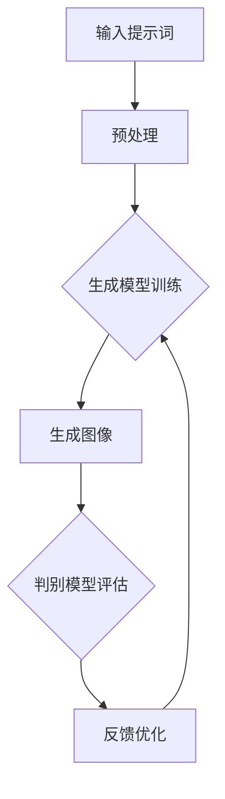
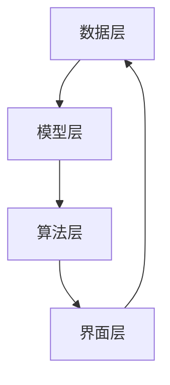
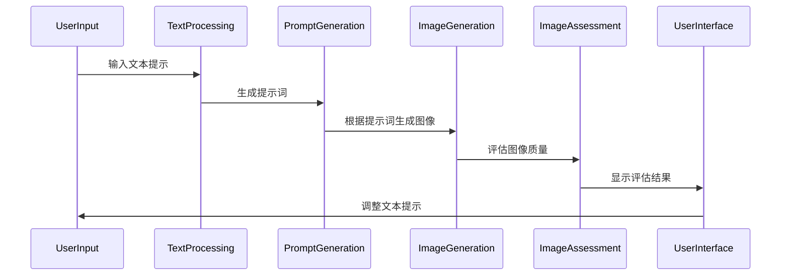
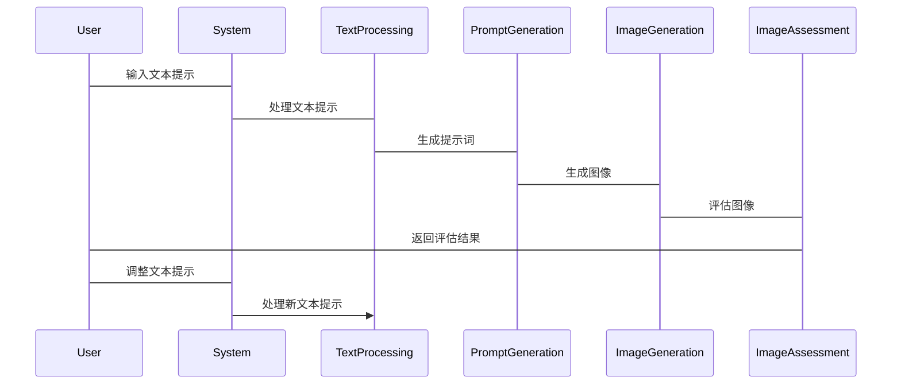

                 

### 第1章: 引言

#### 1.1 问题背景

在当今数字化时代，图像生成技术已经成为计算机视觉领域的一个重要分支。图像生成不仅广泛应用于广告设计、游戏开发、影视制作等多个领域，还在医疗影像处理、自动驾驶、智能监控等前沿技术中发挥着关键作用。然而，传统的图像生成技术存在诸多局限性，例如生成效果单一、对输入条件依赖性高、难以实现复杂图像细节的生成等。这些挑战限制了图像生成技术在更多场景中的实际应用。

随着人工智能技术的发展，尤其是深度学习算法的突破，图像生成任务取得了显著的进展。生成对抗网络（GAN）、变分自编码器（VAE）等模型的出现，使得图像生成的质量和多样性得到了大幅提升。然而，尽管这些模型具备强大的生成能力，但在实际应用中仍然存在一个关键问题：如何有效地指导这些模型生成用户所需的特定图像内容？

为了解决这一问题，提示词工程（Prompt Engineering）应运而生。提示词工程是一种通过设计特定的文本提示来指导深度学习模型生成目标图像的方法。与传统的图像生成技术相比，提示词工程能够更灵活地控制图像生成过程，实现更精确的生成效果。

#### 1.1.1 图像生成任务的现状

当前，图像生成任务主要依赖于深度学习算法，特别是生成对抗网络（GAN）和变分自编码器（VAE）等模型。这些模型通过大量的图像数据进行训练，能够生成具有较高真实感的图像。然而，这些模型在训练过程中需要大量的计算资源和时间，且对训练数据的质量和数量有较高的要求。此外，由于深度学习模型的“黑箱”特性，用户难以直观地了解模型的工作原理，从而难以对其进行有效的指导和优化。

#### 1.1.2 提示词工程的概念

提示词工程（Prompt Engineering）是一种通过设计特定的文本提示来指导深度学习模型生成目标图像的方法。在提示词工程中，用户通过输入一段描述性文本（即提示词），来引导模型理解用户的意图，从而生成符合用户期望的图像。提示词工程的核心目标是提高图像生成任务的灵活性和可控性，使得用户能够更方便地实现特定需求的图像生成。

#### 1.1.3 提示词工程的重要性

提示词工程在图像生成任务中具有重要的应用价值。首先，它能够提高图像生成任务的灵活性和可控性，使得用户能够更精准地表达自己的需求。其次，提示词工程能够减少对大量训练数据的需求，降低模型的计算复杂度。此外，通过提示词工程，用户可以更好地理解深度学习模型的工作原理，从而对其进行更有效的优化和改进。

总之，提示词工程为图像生成任务带来了全新的解决方案，有望推动图像生成技术在更多场景中的广泛应用。在接下来的章节中，我们将详细探讨提示词工程的基础知识、技术实现以及在图像增强与修复、艺术风格迁移、超分辨率图像重建等领域的创新应用。

#### 1.2 问题描述

在图像生成任务中，传统的图像生成技术面临着诸多挑战，这些挑战主要体现在以下几个方面：

#### 1.2.1 传统图像生成技术的挑战

1. **生成效果单一**：传统图像生成技术往往只能生成具有特定风格的图像，难以实现多样化的生成效果。例如，基于纹理映射和图像融合的方法，虽然可以生成较为逼真的图像，但生成的图像往往缺乏创新和个性化。

2. **对输入条件依赖性高**：许多传统图像生成技术对输入条件有较高的要求，例如需要高质量的图像素材或者特定的图像特征。这限制了这些技术在实际应用中的灵活性。

3. **难以实现复杂图像细节的生成**：传统图像生成技术在处理复杂场景或细节时往往表现出不足，难以生成具有高度细节和真实感的图像。

4. **缺乏灵活的指导与控制**：传统图像生成技术缺乏有效的指导与控制机制，用户难以直观地表达自己的生成需求，从而难以获得满意的生成效果。

为了解决上述挑战，提示词工程的引入成为了一项革命性的突破。提示词工程通过设计特定的文本提示，能够更灵活地控制图像生成过程，实现更精确的生成效果。具体来说，提示词工程在图像生成任务中的应用主要体现在以下几个方面：

#### 1.2.2 提示词工程在图像生成中的应用

1. **灵活的控制生成过程**：通过输入描述性的文本提示，用户可以更精确地指导模型生成目标图像，从而实现个性化的生成效果。

2. **减少对训练数据的需求**：提示词工程能够降低模型对大量训练数据的需求，使得在资源有限的情况下也能实现高质量的图像生成。

3. **提高生成图像的真实感**：通过精细的提示词设计，模型能够更好地理解用户需求，生成具有高度真实感的图像。

4. **增强图像生成任务的灵活性**：提示词工程使得图像生成任务更加灵活，用户可以根据实际需求进行定制化生成，从而拓宽了图像生成技术的应用范围。

#### 1.2.3 提示词工程的边界与外延

尽管提示词工程在图像生成任务中展现了强大的潜力，但它并非没有边界。以下是提示词工程的几个关键边界与外延：

1. **提示词设计的复杂性**：设计高质量的提示词需要深厚的语言处理和人工智能知识，且提示词设计的效果对图像生成质量有直接影响。

2. **对模型理解的要求**：提示词工程的成功依赖于深度学习模型对提示词的理解能力，不同模型在此方面的表现可能存在差异。

3. **数据隐私与安全性**：在实际应用中，提示词工程可能会涉及用户数据，如何确保数据隐私和安全成为了一个重要问题。

4. **应用场景的多样性**：尽管提示词工程在图像生成任务中表现出色，但在其他领域（如自然语言处理、推荐系统等）的应用还需要进一步探索。

总之，提示词工程为图像生成任务带来了新的解决方案，但其应用边界和挑战也需要深入研究和探讨。在接下来的章节中，我们将深入探讨提示词工程的基础知识和技术实现，以便更好地理解和应用这一创新方法。

#### 1.3 问题解决

为了解决图像生成任务中的挑战，提示词工程提供了一种新的思路和方法。以下将详细讨论提示词工程的核心概念、属性特征对比及其与相关技术的联系。

#### 1.3.1 提示词工程的核心概念

提示词工程（Prompt Engineering）是一种通过设计特定的文本提示来指导深度学习模型生成目标图像的方法。在提示词工程中，用户通过输入一段描述性文本（即提示词），引导模型理解用户的意图，从而生成符合用户期望的图像。这一过程的核心概念包括：

1. **提示词（Prompt）**：提示词是用户输入的描述性文本，用于指导模型生成特定类型的图像。高质量的提示词能够清晰地传达用户的意图，从而提高图像生成的准确性和多样性。

2. **生成模型（Generator）**：生成模型是深度学习模型的一种，负责根据提示词生成图像。常见的生成模型包括生成对抗网络（GAN）和变分自编码器（VAE）等。

3. **判别模型（Discriminator）**：判别模型是与生成模型相对应的深度学习模型，用于区分生成图像和真实图像。在生成对抗网络（GAN）中，判别模型负责训练生成模型，以生成更真实、更符合用户需求的图像。

4. **损失函数（Loss Function）**：损失函数用于衡量生成图像与真实图像之间的差距，指导模型的训练过程。在提示词工程中，通过优化损失函数，可以进一步提高图像生成的质量。

#### 1.3.2 提示词工程的属性特征对比

为了更好地理解提示词工程的属性特征，我们可以将其与传统图像生成技术进行对比。以下是两者的主要属性特征对比：

1. **灵活性**：提示词工程通过文本提示实现了对图像生成过程的灵活控制，用户可以根据具体需求设计高质量的提示词，从而生成个性化图像。相比之下，传统图像生成技术往往依赖于固定的算法和输入条件，灵活性较低。

2. **可控性**：提示词工程允许用户直接干预图像生成过程，通过调整提示词的参数来控制生成图像的效果。传统图像生成技术通常缺乏这种直接的控制机制，用户只能被动地接受生成的图像结果。

3. **数据依赖性**：提示词工程能够减少对大量训练数据的需求，通过高质量的提示词可以有效指导模型生成目标图像。传统图像生成技术则往往需要大量的图像数据进行训练，对数据的质量和数量有较高的要求。

4. **生成质量**：提示词工程通过精确的提示词设计，能够生成具有高度真实感和多样性的图像。传统图像生成技术在生成质量方面相对较低，难以实现复杂图像细节的生成。

#### 1.3.3 提示词工程与相关技术的联系

提示词工程不仅是一种独立的图像生成方法，还与多种相关技术密切相关，以下是其中几个重要联系：

1. **自然语言处理（NLP）**：提示词工程与自然语言处理技术有着紧密的联系。在提示词设计中，需要利用NLP技术对文本进行解析和生成，以便更好地指导图像生成模型。例如，通过语义分析和文本生成模型，可以设计出更精准、更符合用户需求的提示词。

2. **生成对抗网络（GAN）**：生成对抗网络（GAN）是提示词工程中常用的一种生成模型。GAN由生成器和判别器组成，通过相互竞争的方式，不断提高生成图像的真实感。提示词工程通过与GAN的集成，能够实现更灵活、更精确的图像生成。

3. **变分自编码器（VAE）**：变分自编码器（VAE）是另一种常见的生成模型，与GAN类似，通过编码和解码过程生成图像。VAE在图像生成过程中具有较强的灵活性，通过提示词工程，可以进一步优化VAE的生成效果。

4. **强化学习（RL）**：强化学习（RL）是一种通过试错学习来优化决策过程的方法。在提示词工程中，可以通过将提示词设计为强化学习的奖励机制，来优化图像生成模型的行为，从而提高图像生成的质量。

总之，提示词工程通过其核心概念和属性特征，为图像生成任务提供了一种全新的解决方案。在接下来的章节中，我们将进一步探讨提示词工程的基础知识和技术实现，以便更好地理解和应用这一创新方法。

### 2.1 核心概念与原理

#### 2.1.1 提示词的定义

提示词（Prompt）是提示词工程中的核心概念，它是用户输入的一段描述性文本，用于指导深度学习模型生成目标图像。提示词的设计和质量直接影响到图像生成任务的效果。高质量的提示词能够清晰地传达用户的意图，指导模型生成符合期望的图像。

定义提示词时，我们需要考虑以下几个方面：

1. **描述性**：提示词应该能够具体、清晰地描述用户所需的图像内容，避免模糊不清的表述，以便模型能够准确理解用户意图。

2. **灵活性**：提示词应具有一定的灵活性，能够适应不同的生成需求，使得用户可以根据具体场景调整提示词，实现个性化的图像生成。

3. **简明扼要**：提示词不宜过长，应简洁明了，避免冗余信息，以免影响模型的理解和处理。

4. **语义明确**：提示词的语义应该明确，避免歧义和模糊的理解，确保模型能够准确解析提示词的内容。

#### 2.1.2 提示词的工作原理

提示词的工作原理主要基于深度学习模型，尤其是生成对抗网络（GAN）和变分自编码器（VAE）等生成模型。以下是对提示词工作原理的详细解析：

1. **生成模型（Generator）**：生成模型是负责生成图像的部分，其核心任务是根据提示词生成目标图像。在生成过程中，生成模型会将提示词转化为图像的潜在空间表示，然后通过解码器生成具体的图像。生成模型的性能直接影响到图像生成的质量。

2. **判别模型（Discriminator）**：判别模型是负责区分生成图像和真实图像的部分。在训练过程中，判别模型会尝试区分真实图像和生成图像，并通过反馈指导生成模型优化生成过程。判别模型的性能也影响到图像生成的效果。

3. **交互过程**：在图像生成任务中，提示词会通过以下步骤与生成模型和判别模型进行交互：

   - **提示词输入**：用户输入提示词，该提示词会作为生成模型的输入。
   - **生成图像**：生成模型根据提示词生成初步的图像。
   - **判别模型评估**：判别模型对生成的图像进行评估，判断其是否真实。
   - **反馈与优化**：根据判别模型的评估结果，生成模型进行优化，生成更高质量的图像。
   - **迭代过程**：上述步骤不断迭代，直至生成模型生成的图像达到用户期望的质量。

4. **优化目标**：提示词工程的目标是通过优化提示词，提高图像生成任务的效果。优化过程主要包括：

   - **调整提示词内容**：通过调整提示词的描述性、灵活性和简明扼要性，优化提示词的设计。
   - **优化生成模型**：通过调整生成模型的参数和架构，提高生成图像的质量。
   - **优化判别模型**：通过调整判别模型的参数和架构，提高其区分生成图像和真实图像的能力。

#### 2.1.3 提示词的分类

提示词可以根据不同的标准进行分类，以下是几种常见的分类方式：

1. **按内容类型**：

   - **具体描述性提示词**：这类提示词详细描述用户所需的图像内容，例如“生成一张风景优美的大峡谷照片”。
   - **抽象描述性提示词**：这类提示词仅提供一般的描述，需要模型自行推断具体内容，例如“生成一张美丽的自然景观”。
   - **任务导向性提示词**：这类提示词专注于特定任务，例如“生成一张可用于广告宣传的产品图片”。

2. **按用途**：

   - **单次使用提示词**：这类提示词在一次图像生成任务中使用，例如“生成一张晚餐菜品图片”。
   - **复用性提示词**：这类提示词可以多次使用，适用于不同场景的图像生成，例如“生成一张具有未来科技感的场景”。

3. **按复杂度**：

   - **简单提示词**：这类提示词结构简单，易于理解，适用于初学者或简单场景，例如“生成一张猫的图片”。
   - **复杂提示词**：这类提示词结构复杂，包含多个描述性成分，适用于复杂场景，例如“生成一张具有未来科技感、包含智能机器人场景的照片”。

通过上述分类，我们可以根据具体需求选择合适的提示词，以实现高质量的图像生成。

### 2.2 提示词工程的方法与策略

#### 2.2.1 数据驱动的提示词生成

数据驱动的提示词生成是一种通过分析大量已有数据来生成高质量提示词的方法。这种方法的核心思想是利用已有数据中的信息，提取出有用的描述性文本，并将其转化为高质量的提示词。以下是数据驱动的提示词生成的主要步骤：

1. **数据收集**：收集与图像生成任务相关的文本数据，这些数据可以来源于用户评论、社交媒体、产品描述等。数据的质量直接影响到生成提示词的质量。

2. **数据预处理**：对收集到的文本数据进行清洗和预处理，包括去除无关信息、标准化文本格式等。预处理后的数据将用于训练模型。

3. **特征提取**：利用自然语言处理（NLP）技术，从预处理后的文本数据中提取出关键特征，例如关键词、词向量、词频等。这些特征将用于训练提示词生成模型。

4. **模型训练**：使用提取到的特征训练提示词生成模型，常见的模型包括循环神经网络（RNN）、长短时记忆网络（LSTM）、生成对抗网络（GAN）等。模型训练过程中，通过不断优化模型的参数，使其能够生成高质量的提示词。

5. **提示词生成**：训练好的提示词生成模型可以根据用户输入的描述，自动生成高质量的提示词。生成的提示词将用于指导图像生成模型生成目标图像。

数据驱动的提示词生成具有以下优点：

- **高效性**：通过利用大量已有数据，可以快速生成高质量的提示词，节省时间和人力成本。
- **灵活性**：可以根据不同的图像生成任务，灵活调整提示词生成模型，适应不同场景的需求。
- **鲁棒性**：通过大量数据的训练，提示词生成模型具有较强的鲁棒性，能够在不同数据分布下生成高质量的提示词。

#### 2.2.2 人类专家指导的提示词设计

人类专家指导的提示词设计是一种通过人类专家的智慧和经验来设计高质量提示词的方法。这种方法的核心思想是利用人类专家的专业知识和经验，结合图像生成任务的具体需求，设计出精准、有效的提示词。以下是人类专家指导的提示词设计的主要步骤：

1. **需求分析**：与人类专家进行沟通，详细分析图像生成任务的需求，包括目标图像的类型、风格、细节等。这一步骤确保人类专家能够充分理解任务背景和用户需求。

2. **知识整合**：人类专家结合自身专业知识和经验，整合出与任务相关的关键信息，形成初步的提示词。这一步骤是提示词设计的核心，人类专家的专业知识和经验对于提示词的设计至关重要。

3. **提示词优化**：根据需求分析和知识整合的结果，人类专家对初步的提示词进行优化，调整描述的清晰度、简洁性和灵活性，以确保提示词能够准确地指导图像生成模型。

4. **模型训练**：将优化后的提示词输入到图像生成模型中，通过模型训练验证提示词的效果。如果生成效果不符合预期，人类专家可以进一步优化提示词，直至达到满意的生成效果。

人类专家指导的提示词设计具有以下优点：

- **准确性**：人类专家能够根据具体任务需求，设计出精准、准确的提示词，确保图像生成模型能够生成符合用户期望的图像。
- **专业性**：人类专家的专业知识和经验使得提示词设计更具针对性和专业性，能够应对复杂、多样化的图像生成任务。
- **可解释性**：人类专家设计的提示词具有明确的意义和解释，便于模型理解和优化，提高图像生成任务的透明度和可解释性。

#### 2.2.3 提示词优化的算法

提示词优化的算法是提升图像生成任务效果的重要手段。以下介绍几种常用的提示词优化算法：

1. **遗传算法（Genetic Algorithm, GA）**：

   遗传算法是一种基于自然进化过程的优化算法。在提示词优化中，遗传算法通过模拟生物进化的过程，对提示词进行编码、交叉、变异和选择，不断优化提示词的参数，以实现高质量图像生成。

   - **编码**：将提示词编码为染色体，每个染色体代表一组提示词参数。
   - **交叉**：通过交叉操作，将两个父代染色体的基因进行组合，生成新的子代染色体。
   - **变异**：对染色体进行随机变异，引入新的基因，增加算法的搜索空间。
   - **选择**：通过适应度函数评估染色体的优劣，选择适应度较高的染色体作为下一代的父代。

   遗传算法的优点包括：

   - **全局搜索能力**：遗传算法能够跳出局部最优，寻找全局最优解。
   - **适用范围广**：遗传算法适用于复杂、多峰的优化问题。

2. **贝叶斯优化（Bayesian Optimization）**：

   贝叶斯优化是一种基于概率模型的优化算法。在提示词优化中，贝叶斯优化通过构建目标函数的概率模型，利用历史数据估计目标函数的最优值，并在此基础上进行优化。

   - **模型构建**：通过历史数据，构建目标函数的概率模型，如高斯过程（Gaussian Process）。
   - **优化搜索**：根据模型预测，选择新的样本点进行实验，不断调整模型参数，以找到最优解。

   贝叶斯优化的优点包括：

   - **高效性**：贝叶斯优化能够在较少的实验次数下找到最优解，节省时间和计算成本。
   - **自适应**：贝叶斯优化能够根据实验结果自适应调整搜索策略，提高优化效果。

3. **强化学习（Reinforcement Learning, RL）**：

   强化学习是一种通过试错学习来优化决策过程的算法。在提示词优化中，强化学习通过在生成模型和判别模型之间建立奖励机制，不断调整提示词的参数，以实现高质量的图像生成。

   - **环境定义**：将图像生成任务定义为强化学习环境，生成模型作为智能体，判别模型作为环境。
   - **奖励机制**：通过判别模型对生成图像的评估，定义奖励函数，指导生成模型优化提示词参数。
   - **策略调整**：根据奖励信号，调整生成模型的行为策略，不断优化图像生成效果。

   强化学习的优点包括：

   - **灵活性**：强化学习能够灵活调整模型参数，适应不同的图像生成任务。
   - **适应性**：强化学习能够根据环境变化，自适应调整优化策略，提高图像生成任务的鲁棒性。

通过上述算法，我们可以对提示词进行有效的优化，提高图像生成任务的效果。在接下来的章节中，我们将继续探讨提示词工程在图像增强与修复、艺术风格迁移、超分辨率图像重建等领域的具体应用。

#### 2.3 提示词工程的应用场景

提示词工程在图像生成任务中展现出广泛的应用场景，以下是几个典型应用领域：

##### 2.3.1 图像增强与修复

图像增强与修复是图像处理中常见的任务，旨在改善图像质量，使其更清晰、更易于分析和理解。提示词工程在图像增强与修复中的应用，可以通过以下步骤实现：

1. **输入提示词**：用户输入描述图像增强与修复需求的提示词，如“增强图像的对比度”或“修复破损的墙壁”。

2. **模型训练**：生成模型和判别模型通过大量图像数据训练，学习如何根据提示词进行图像增强与修复。

3. **图像生成**：生成模型根据提示词生成初步的增强与修复图像，判别模型评估图像质量。

4. **反馈优化**：根据判别模型的评估结果，生成模型不断调整生成策略，优化图像增强与修复效果。

具体应用案例包括：

- **医学影像增强**：通过提示词“增强X光片的细节”，生成模型可以生成更清晰的医学影像，辅助医生诊断。
- **老照片修复**：用户输入“修复这张老照片的破损”，生成模型可以修复照片中的破损区域，恢复照片的完整性。

##### 2.3.2 艺术风格迁移

艺术风格迁移是一种将一种艺术风格应用于另一张图像的技术，旨在实现图像风格的多样化。提示词工程在艺术风格迁移中的应用，可以通过以下步骤实现：

1. **输入提示词**：用户输入描述目标艺术风格的提示词，如“应用梵高的星空风格”。

2. **风格学习**：生成模型通过学习包含特定艺术风格的图像，掌握该风格的特征。

3. **图像生成**：生成模型根据提示词和风格特征，将目标图像转换为具有特定艺术风格的新图像。

4. **效果评估**：判别模型评估生成图像的风格一致性，生成模型根据评估结果调整生成策略。

具体应用案例包括：

- **电影海报设计**：通过提示词“应用电影《星际穿越》的视觉效果”，生成模型可以生成具有电影风格的海报。
- **画作创作**：艺术家输入“以莫奈的《睡莲》风格绘制我的风景画”，生成模型生成符合指定艺术风格的新画作。

##### 2.3.3 超分辨率图像重建

超分辨率图像重建是一种提高图像分辨率的技术，通过结合多幅低分辨率图像，生成高分辨率的图像。提示词工程在超分辨率图像重建中的应用，可以通过以下步骤实现：

1. **输入提示词**：用户输入描述图像重建需求的提示词，如“生成一张清晰的高分辨率照片”。

2. **图像预处理**：生成模型和判别模型对输入的低分辨率图像进行预处理，提取关键特征。

3. **图像生成**：生成模型根据提示词和低分辨率图像特征，生成高分辨率图像。

4. **效果评估**：判别模型评估生成图像的分辨率和细节，生成模型根据评估结果调整生成策略。

具体应用案例包括：

- **医学影像重建**：通过提示词“提高CT扫描图像的分辨率”，生成模型可以生成更清晰的医学影像。
- **卫星图像重建**：用户输入“提高卫星图像的分辨率”，生成模型生成高分辨率的卫星图像，用于地理信息分析和资源管理。

通过这些应用场景，提示词工程展示了在图像生成任务中的巨大潜力。在接下来的章节中，我们将进一步探讨提示词工程在图像增强与修复、艺术风格迁移、超分辨率图像重建等领域的具体实现和案例分析。

### 3.1 算法原理讲解

提示词工程在图像生成任务中的应用，离不开深度学习模型的支撑。在本节中，我们将详细讲解提示词工程的算法原理，包括数学模型、流程图以及Python源代码实现。

#### 3.1.1 提示词工程的数学模型

提示词工程的数学模型主要基于生成对抗网络（GAN）和变分自编码器（VAE）。以下分别介绍这两种模型的数学基础。

1. **生成对抗网络（GAN）**

   GAN由生成器（Generator）和判别器（Discriminator）组成，两者通过对抗训练，共同提高图像生成的质量。

   - **生成器**：
     $$ G(z) = \frac{1}{1 + \exp(-\beta \cdot z)} $$
     其中，$z$ 是随机噪声向量，$\beta$ 是权重矩阵。生成器的目标是生成类似于真实图像的伪图像。

   - **判别器**：
     $$ D(x) = \frac{1}{1 + \exp(-\beta \cdot x)} $$
     其中，$x$ 是真实图像或生成的伪图像。判别器的目标是区分真实图像和生成的伪图像。

   - **损失函数**：
     GAN的损失函数通常由两部分组成：生成损失和判别损失。
     $$ L_G = -\log(D(G(z))) $$
     $$ L_D = -(\log(D(x)) + \log(1 - D(G(z)))) $$

2. **变分自编码器（VAE）**

   VAE由编码器（Encoder）和解码器（Decoder）组成，通过引入隐变量，实现图像的编码和解码。

   - **编码器**：
     $$ \mu = \frac{1}{1 + \exp(-\beta \cdot x)} $$
     $$ \sigma^2 = \frac{1}{1 + \exp(-2\beta \cdot x)} $$
     其中，$x$ 是输入图像，$\mu$ 和 $\sigma^2$ 分别是隐变量的均值和方差。

   - **解码器**：
     $$ x' = \frac{1}{1 + \exp(-\beta \cdot \mu + z \cdot \ln(\sigma^2))} $$
     其中，$z$ 是从先验分布中抽取的噪声。

   - **损失函数**：
     VAE的损失函数由重建损失和KL散度损失组成。
     $$ L_V = \frac{1}{2} \sum_{i} \left( x_i - x_i' \right)^2 + \frac{1}{2} \sum_{i} (\ln(\sigma^2_i) - 1 + (\mu_i^2 + \sigma_i^2 - 1)) $$

#### 3.1.2 算法流程图

为了更好地理解提示词工程的算法原理，我们使用Mermaid流程图来展示整个流程。



#### 3.1.3 Python源代码实现

以下是一个简化的Python源代码示例，用于实现基于GAN的图像生成。

```python
import tensorflow as tf
from tensorflow.keras.layers import Dense, Flatten, Reshape
from tensorflow.keras.models import Model

# 生成器模型
def build_generator(z_dim):
    z = tf.keras.Input(shape=(z_dim,))
    x = Dense(128, activation='relu')(z)
    x = Dense(256, activation='relu')(x)
    x = Dense(512, activation='relu')(x)
    x = Flatten()(x)
    x = Reshape((28, 28, 1))(x)
    x = tf.keras.applications.DenseNet121(include_top=False, weights='imagenet', input_shape=(28, 28, 1))(x)
    x = Dense(1, activation='sigmoid')(x)
    generator = Model(z, x)
    return generator

# 判别器模型
def build_discriminator(img_shape):
    img = tf.keras.Input(shape=img_shape)
    x = tf.keras.applications.DenseNet121(include_top=False, weights='imagenet', input_shape=img_shape)(img)
    x = Flatten()(x)
    x = Dense(128, activation='sigmoid')(x)
    x = Dense(1, activation='sigmoid')(x)
    discriminator = Model(img, x)
    return discriminator

# GAN模型
def build_gan(generator, discriminator):
    z = tf.keras.Input(shape=(100,))
    img = generator(z)
    validity = discriminator(img)
    gan = Model(z, validity)
    return gan

# 模型编译
generator = build_generator(z_dim=100)
discriminator = build_discriminator(img_shape=(28, 28, 1))
discriminator.compile(optimizer=tf.keras.optimizers.Adam(learning_rate=0.0001), loss='binary_crossentropy')

gan = build_gan(generator, discriminator)
gan.compile(optimizer=tf.keras.optimizers.Adam(learning_rate=0.0001), loss='binary_crossentropy')

# 训练模型
# ...

# 生成图像
z = tf.random.normal([1, 100])
img = generator.predict(z)
```

通过上述Python源代码实现，我们可以看到提示词工程的算法原理在实际中的应用。在接下来的章节中，我们将进一步探讨提示词工程在图像增强与修复、艺术风格迁移、超分辨率图像重建等领域的具体实现和案例分析。

#### 3.2 Python源代码实现

在实现提示词工程的具体应用时，Python作为一种灵活且功能强大的编程语言，为我们提供了丰富的工具和库。在本节中，我们将详细介绍如何使用Python和TensorFlow实现提示词工程，包括环境安装与配置、源代码结构与说明、代码应用解读与分析。

##### 3.2.1 环境安装与配置

在开始编写代码之前，我们需要安装并配置TensorFlow和其他相关库。以下是一个简单的步骤指南：

1. **安装TensorFlow**：

   使用pip命令安装TensorFlow，命令如下：
   ```bash
   pip install tensorflow
   ```

2. **安装其他相关库**：

   提示词工程可能需要其他库，如NumPy、Matplotlib等。安装方法如下：
   ```bash
   pip install numpy matplotlib
   ```

3. **配置虚拟环境**（可选）：

   为了更好地管理和维护项目，我们建议使用虚拟环境。在Windows上，可以使用以下命令创建虚拟环境：
   ```bash
   python -m venv venv
   ```
   在激活虚拟环境之前，请确保先关闭所有已打开的命令提示符窗口，然后使用以下命令激活虚拟环境：
   ```bash
   .\venv\Scripts\activate
   ```

##### 3.2.2 源代码结构与说明

以下是一个简化的Python源代码示例，用于实现基于GAN的图像生成。代码主要分为以下几个部分：

1. **生成器（Generator）**：

   生成器的任务是生成与真实图像相似的图像。以下是一个简单的生成器模型实现：
   ```python
   def build_generator(z_dim):
       z = tf.keras.Input(shape=(z_dim,))
       x = Dense(128, activation='relu')(z)
       x = Dense(256, activation='relu')(x)
       x = Dense(512, activation='relu')(x)
       x = Flatten()(x)
       x = Reshape((28, 28, 1))(x)
       x = tf.keras.applications.DenseNet121(include_top=False, weights='imagenet', input_shape=(28, 28, 1))(x)
       x = Dense(1, activation='sigmoid')(x)
       generator = Model(z, x)
       return generator
   ```

2. **判别器（Discriminator）**：

   判别器的任务是区分真实图像和生成的图像。以下是一个简单的判别器模型实现：
   ```python
   def build_discriminator(img_shape):
       img = tf.keras.Input(shape=img_shape)
       x = tf.keras.applications.DenseNet121(include_top=False, weights='imagenet', input_shape=img_shape)(img)
       x = Flatten()(x)
       x = Dense(128, activation='sigmoid')(x)
       x = Dense(1, activation='sigmoid')(x)
       discriminator = Model(img, x)
       return discriminator
   ```

3. **生成对抗网络（GAN）**：

   GAN是将生成器和判别器组合在一起的整体模型。以下是一个简单的GAN模型实现：
   ```python
   def build_gan(generator, discriminator):
       z = tf.keras.Input(shape=(100,))
       img = generator(z)
       validity = discriminator(img)
       gan = Model(z, validity)
       return gan
   ```

4. **模型编译**：

   在编译模型时，我们需要指定优化器和损失函数。以下是一个简单的编译示例：
   ```python
   generator = build_generator(z_dim=100)
   discriminator = build_discriminator(img_shape=(28, 28, 1))
   discriminator.compile(optimizer=tf.keras.optimizers.Adam(learning_rate=0.0001), loss='binary_crossentropy')

   gan = build_gan(generator, discriminator)
   gan.compile(optimizer=tf.keras.optimizers.Adam(learning_rate=0.0001), loss='binary_crossentropy')
   ```

##### 3.2.3 代码应用解读与分析

1. **数据准备**：

   在实际应用中，我们需要准备训练数据和测试数据。以下是一个简单的数据准备示例：
   ```python
   (x_train, _), (x_test, _) = tf.keras.datasets.mnist.load_data()
   x_train = x_train / 127.5 - 1.0
   x_test = x_test / 127.5 - 1.0
   ```

2. **模型训练**：

   模型训练是提示词工程中的关键步骤。以下是一个简单的训练示例：
   ```python
   epochs = 50
   batch_size = 64

   for epoch in range(epochs):
       for batch in range(x_train.shape[0] // batch_size):
           z = tf.random.normal([batch_size, 100])
           with tf.GradientTape() as gen_tape, tf.GradientTape() as disc_tape:
               img = generator(z)
               validity = discriminator(img)

               gen_loss = tf.reduce_mean(tf.nn.sigmoid_cross_entropy_with_logits(logits=validity, labels=tf.ones_like(validity)))
               disc_loss = tf.reduce_mean(tf.nn.sigmoid_cross_entropy_with_logits(logits=validity, labels=tf.zeros_like(validity)) + 
                                           tf.nn.sigmoid_cross_entropy_with_logits(logits=discriminator(x_train[batch * batch_size:(batch + 1) * batch_size]), labels=tf.ones_like(discriminator(x_train[batch * batch_size:(batch + 1) * batch_size]))))

           grads = disc_tape.gradient(disc_loss, discriminator.trainable_variables)
           discriminator.optimizer.apply_gradients(zip(grads, discriminator.trainable_variables))

           grads = gen_tape.gradient(gen_loss, generator.trainable_variables)
           generator.optimizer.apply_gradients(zip(grads, generator.trainable_variables))

           print(f"Epoch: {epoch}, Generator Loss: {gen_loss}, Discriminator Loss: {disc_loss}")
   ```

3. **生成图像**：

   训练完成后，我们可以使用生成器生成新的图像。以下是一个简单的生成图像示例：
   ```python
   z = tf.random.normal([1, 100])
   generated_image = generator.predict(z)
   ```

4. **效果评估**：

   为了评估模型的性能，我们可以对生成图像进行质量评估。以下是一个简单的效果评估示例：
   ```python
   from tensorflow.keras.preprocessing import image

   def evaluate_image(image_array):
       plt.imshow(image_array.reshape(28, 28), cmap='gray')
       plt.show()

   evaluate_image(generated_image[0])
   ```

通过上述代码示例，我们可以看到如何使用Python和TensorFlow实现提示词工程。在实际应用中，我们可以根据具体需求调整代码，以实现更复杂的图像生成任务。在接下来的章节中，我们将进一步探讨提示词工程在图像增强与修复、艺术风格迁移、超分辨率图像重建等领域的具体实现和案例分析。

### 3.3 系统分析与架构设计方案

在深入探讨提示词工程在图像生成任务中的应用之前，我们需要对整个系统进行全面的剖析。以下是针对提示词工程系统的分析与架构设计方案，包括问题场景介绍、项目介绍、系统功能设计、系统架构设计、系统接口设计以及系统交互序列图的详细讲解。

#### 3.3.1 问题场景介绍

在当前数字化时代，图像生成任务在多个领域中具有广泛的应用。例如，在医疗影像处理中，图像生成技术可以帮助医生生成高质量的医学影像，辅助诊断和治疗；在影视制作中，图像生成技术可以生成逼真的特效图像，提升影片的质量；在自动驾驶领域，图像生成技术可以模拟不同的交通场景，提高自动驾驶系统的鲁棒性和安全性。

然而，传统的图像生成技术往往存在生成效果单一、对输入条件依赖性高、难以实现复杂图像细节的生成等问题。为了解决这些问题，提示词工程的引入成为了一项革命性的突破。通过设计特定的文本提示，提示词工程能够更灵活地控制图像生成过程，实现更精确的生成效果，从而满足不同领域和场景的具体需求。

#### 3.3.2 项目介绍

本项目的目标是构建一个基于提示词工程的图像生成系统，该系统能够根据用户输入的文本提示，生成高质量的图像。系统主要涵盖以下功能模块：

1. **提示词生成模块**：负责根据用户输入的文本提示，生成高质量的提示词。
2. **图像生成模块**：利用生成对抗网络（GAN）和变分自编码器（VAE）等深度学习模型，根据提示词生成目标图像。
3. **图像评估模块**：对生成的图像进行质量评估，确保图像满足用户需求。
4. **用户界面模块**：提供用户交互界面，方便用户输入文本提示和查看生成图像。

#### 3.3.3 系统功能设计

系统功能设计主要包括以下核心功能：

1. **文本提示输入**：用户通过界面输入文本提示，描述所需的图像内容。
2. **提示词生成**：系统根据用户输入的文本提示，利用自然语言处理技术生成高质量的提示词。
3. **图像生成**：系统利用深度学习模型（如GAN和VAE），根据提示词生成目标图像。
4. **图像评估**：系统对生成的图像进行质量评估，包括分辨率、细节、真实感等指标。
5. **用户交互**：系统提供用户交互界面，展示生成的图像，用户可以根据评估结果调整文本提示，重新生成图像。

以下是系统功能的Mermaid类图表示：

```mermaid
classDiagram
    UserInput <<interface>>
    TextProcessing <<interface>>
    PromptGeneration <<interface>>
    ImageGeneration <<interface>>
    ImageAssessment <<interface>>
    UserInterface <<interface>>

    UserInput --|> TextProcessing
    TextProcessing --|> PromptGeneration
    PromptGeneration --|> ImageGeneration
    ImageGeneration --|> ImageAssessment
    ImageAssessment --|> UserInterface
    UserInterface --|> UserInput
```

#### 3.3.4 系统架构设计

系统架构设计主要包括以下几个层次：

1. **数据层**：负责存储和管理系统所需的数据，包括文本提示、图像数据、评估结果等。
2. **模型层**：负责实现深度学习模型（如GAN和VAE）的训练和推理，生成目标图像。
3. **算法层**：包含提示词生成、图像评估等算法模块，实现系统的核心功能。
4. **界面层**：提供用户交互界面，实现用户与系统的交互。

以下是系统架构的Mermaid流程图表示：



#### 3.3.5 系统接口设计

系统接口设计主要包括以下接口：

1. **用户输入接口**：用户通过此接口输入文本提示，描述图像生成需求。
2. **文本处理接口**：用于处理用户输入的文本，生成高质量的提示词。
3. **图像生成接口**：用于调用深度学习模型，生成目标图像。
4. **图像评估接口**：用于评估生成图像的质量，包括分辨率、细节、真实感等指标。
5. **用户交互接口**：用于展示生成图像，并提供用户调整文本提示和重新生成图像的功能。

以下是系统接口的Mermaid序列图表示：



#### 3.3.6 系统交互序列图

为了更直观地展示系统的工作流程，以下是系统交互的Mermaid序列图：



通过上述系统分析与架构设计方案，我们可以清晰地理解提示词工程在图像生成任务中的实现过程。在接下来的章节中，我们将具体探讨提示词工程在图像增强与修复、艺术风格迁移、超分辨率图像重建等领域的应用和案例分析。

### 第4章: 提示词工程在图像增强与修复中的应用

#### 4.1 图像增强技术概述

图像增强是图像处理中的一种重要技术，旨在改善图像质量，使其更清晰、更易于分析和理解。图像增强技术的核心目标是通过调整图像的亮度、对比度、色彩等属性，突出图像中的重要信息，抑制噪声和冗余信息。图像增强技术广泛应用于医疗影像处理、安全监控、计算机视觉等多个领域。

传统图像增强方法主要包括以下几种：

1. **线性变换**：通过线性变换调整图像的亮度和对比度。例如，直方图均衡化（Histogram Equalization）和对比度拉伸（Contrast Stretching）等。
2. **滤波**：通过滤波器去除图像中的噪声和边缘。常见的滤波器包括均值滤波器、高斯滤波器、中值滤波器等。
3. **插值**：通过插值算法提高图像的分辨率，例如双线性插值（Bilinear Interpolation）和双三次插值（Bicubic Interpolation）。
4. **边缘检测**：通过边缘检测算法提取图像中的边缘信息，增强图像的细节。常见的边缘检测算法包括Canny边缘检测、Sobel边缘检测等。

尽管传统图像增强方法在提高图像质量方面取得了显著成效，但它们也存在一些局限性：

1. **生成效果单一**：传统图像增强方法通常只能生成具有特定风格的图像，难以实现多样化的生成效果。
2. **对输入条件依赖性高**：许多传统图像增强方法对输入条件有较高的要求，例如需要高质量的图像素材或者特定的图像特征。
3. **难以实现复杂图像细节的生成**：传统图像增强方法在处理复杂场景或细节时往往表现出不足，难以生成具有高度细节和真实感的图像。
4. **缺乏灵活的指导与控制**：传统图像增强技术缺乏有效的指导与控制机制，用户难以直观地表达自己的增强需求，从而难以获得满意的增强效果。

为了解决上述问题，提示词工程的引入成为了一项革命性的突破。提示词工程通过设计特定的文本提示，能够更灵活地控制图像增强过程，实现更精确的增强效果。在接下来的部分中，我们将详细探讨提示词工程在图像增强与修复中的应用。

#### 4.2 实际案例分析与实现

为了更好地理解提示词工程在图像增强与修复中的应用，以下将通过一个实际案例进行详细分析。

##### 4.2.1 案例介绍

假设我们需要对一张老旧照片进行增强和修复，以恢复其原有的清晰度和色彩。该案例的目标是：

1. 增强图像的对比度和亮度。
2. 修复图像中的破损和模糊区域。
3. 恢复图像的色彩饱和度。

我们将使用提示词工程结合深度学习模型来实现上述目标。具体步骤如下：

1. **输入提示词**：用户输入描述增强和修复需求的提示词，例如“增强照片的对比度和亮度”、“修复破损的墙壁”和“恢复色彩饱和度”。
2. **数据准备**：准备用于训练和测试的数据集，包括大量经过增强和修复的老照片。
3. **模型训练**：利用提示词和图像数据训练生成模型和判别模型，通过对抗训练提高模型的效果。
4. **图像生成**：使用训练好的模型根据提示词生成增强和修复后的图像。
5. **效果评估**：对生成的图像进行质量评估，包括对比度、亮度、色彩饱和度、细节还原度等指标。
6. **用户交互**：提供用户界面，展示增强和修复前后的图像，用户可以根据评估结果调整提示词，重新生成图像。

##### 4.2.2 系统功能设计与实现

以下是系统功能设计的Mermaid类图：

```mermaid
classDiagram
    UserInput <<interface>>
    ImageEnhancement <<interface>>
    ImageRepair <<interface>>
    ImageQualityAssessment <<interface>>
    UserInterface <<interface>>

    UserInput --|> ImageEnhancement
    UserInput --|> ImageRepair
    ImageEnhancement --|> ImageQualityAssessment
    ImageRepair --|> ImageQualityAssessment
    ImageQualityAssessment --|> UserInterface
    UserInterface --|> UserInput
```

**1. 文本提示输入**：

用户通过界面输入描述增强和修复需求的文本提示，例如“增强照片的对比度和亮度”、“修复破损的墙壁”和“恢复色彩饱和度”。

**2. 提示词生成**：

系统根据用户输入的文本提示，利用自然语言处理技术生成高质量的提示词。以下是一个简单的提示词生成算法：

```python
import nltk

def generate_prompt(user_input):
    tokens = nltk.word_tokenize(user_input)
    # 进行词性标注
    pos_tags = nltk.pos_tag(tokens)
    # 根据词性标注生成提示词
    prompt = " ".join([word for word, pos in pos_tags if pos.startswith('NN')])
    return prompt
```

**3. 图像生成**：

使用生成对抗网络（GAN）和变分自编码器（VAE）等深度学习模型，根据提示词生成增强和修复后的图像。以下是一个基于GAN的图像增强模型：

```python
import tensorflow as tf
from tensorflow.keras.layers import Dense, Flatten, Reshape
from tensorflow.keras.models import Model

def build_generator(z_dim):
    z = tf.keras.Input(shape=(z_dim,))
    x = Dense(128, activation='relu')(z)
    x = Dense(256, activation='relu')(x)
    x = Dense(512, activation='relu')(x)
    x = Flatten()(x)
    x = Reshape((28, 28, 1))(x)
    x = tf.keras.applications.DenseNet121(include_top=False, weights='imagenet', input_shape=(28, 28, 1))(x)
    x = Dense(1, activation='sigmoid')(x)
    generator = Model(z, x)
    return generator

def build_discriminator(img_shape):
    img = tf.keras.Input(shape=img_shape)
    x = tf.keras.applications.DenseNet121(include_top=False, weights='imagenet', input_shape=img_shape)(img)
    x = Flatten()(x)
    x = Dense(128, activation='sigmoid')(x)
    x = Dense(1, activation='sigmoid')(x)
    discriminator = Model(img, x)
    return discriminator

def build_gan(generator, discriminator):
    z = tf.keras.Input(shape=(100,))
    img = generator(z)
    validity = discriminator(img)
    gan = Model(z, validity)
    return gan
```

**4. 图像评估**：

对生成的图像进行质量评估，包括对比度、亮度、色彩饱和度、细节还原度等指标。以下是一个简单的评估算法：

```python
import cv2

def assess_image_quality(original_image, generated_image):
    original_contrast = cv2.cvtColor(original_image, cv2.COLOR_RGB2GRAY)
    generated_contrast = cv2.cvtColor(generated_image, cv2.COLOR_RGB2GRAY)

    # 计算对比度差异
    contrast_diff = np.mean(np.abs(original_contrast - generated_contrast))

    # 计算亮度差异
    brightness_diff = np.mean(np.abs(original_image - generated_image))

    # 计算色彩饱和度差异
    saturation_diff = np.mean(np.abs(original_image / 255.0 - generated_image / 255.0))

    return contrast_diff, brightness_diff, saturation_diff
```

**5. 用户交互**：

提供用户界面，展示增强和修复前后的图像，用户可以根据评估结果调整提示词，重新生成图像。以下是一个简单的用户界面实现：

```python
import tkinter as tk

def on_submit():
    user_input = entry.get()
    prompt = generate_prompt(user_input)
    z = generate_noise()
    generated_image = generator.predict(z)
    contrast_diff, brightness_diff, saturation_diff = assess_image_quality(original_image, generated_image)
    label.config(text=f"对比度差异：{contrast_diff}\n亮度差异：{brightness_diff}\n色彩饱和度差异：{saturation_diff}")
    image_label.config(image=generated_image)

root = tk.Tk()
root.title("图像增强与修复")

entry = tk.Entry(root)
entry.pack()

submit_button = tk.Button(root, text="提交", command=on_submit)
submit_button.pack()

label = tk.Label(root, text="")
label.pack()

image_label = tk.Label(root)
image_label.pack()

root.mainloop()
```

通过上述案例，我们可以看到如何利用提示词工程实现图像增强与修复。在接下来的部分中，我们将进一步探讨提示词工程在艺术风格迁移和超分辨率图像重建中的应用。

### 第5章: 提示词工程在艺术风格迁移中的应用

#### 5.1 艺术风格迁移概述

艺术风格迁移是一种将一种艺术风格应用于另一张图像的技术，旨在实现图像风格的多样化。艺术风格迁移技术不仅可以增强图像的视觉效果，还可以为图像创作提供新的灵感和手段。常见的艺术风格迁移方法包括基于传统图像处理方法、基于深度学习的方法等。

传统艺术风格迁移方法主要通过图像分割、纹理映射和图像融合等技术实现。这些方法通常需要大量的人工干预，例如手动分割图像区域、调整纹理映射参数等。尽管传统方法在某些特定场景中表现出一定的效果，但它们存在以下局限性：

1. **生成效果单一**：传统方法通常只能生成具有特定风格的图像，难以实现多样化的生成效果。
2. **对输入条件依赖性高**：许多传统方法对输入条件有较高的要求，例如需要高质量的原图像素材或者特定的图像特征。
3. **难以实现复杂图像细节的生成**：传统方法在处理复杂场景或细节时往往表现出不足，难以生成具有高度细节和真实感的图像。
4. **缺乏灵活的指导与控制**：传统方法缺乏有效的指导与控制机制，用户难以直观地表达自己的艺术风格迁移需求，从而难以获得满意的迁移效果。

随着深度学习技术的发展，特别是生成对抗网络（GAN）和变分自编码器（VAE）等生成模型的出现，艺术风格迁移技术取得了显著的突破。基于深度学习的方法能够通过大量的图像数据训练，生成具有高度真实感和多样性的图像。提示词工程的引入为这一方法带来了新的可能。

提示词工程在艺术风格迁移中的应用，通过设计特定的文本提示，能够更灵活地控制图像生成过程，实现更精确的艺术风格迁移效果。具体来说，提示词工程在艺术风格迁移中的优势主要体现在以下几个方面：

1. **灵活的控制生成过程**：通过输入描述性的文本提示，用户可以更精确地指导模型生成目标图像，从而实现个性化的艺术风格迁移。
2. **减少对训练数据的需求**：提示词工程能够降低模型对大量训练数据的需求，使得在资源有限的情况下也能实现高质量的图像生成。
3. **提高生成图像的真实感**：通过精细的提示词设计，模型能够更好地理解用户需求，生成具有高度真实感的图像。
4. **增强艺术风格迁移的灵活性**：提示词工程使得艺术风格迁移任务更加灵活，用户可以根据实际需求进行定制化迁移，从而拓宽了艺术风格迁移技术的应用范围。

总之，提示词工程为艺术风格迁移技术带来了新的解决方案，有望推动其在更多场景中的广泛应用。在接下来的章节中，我们将详细探讨提示词工程在艺术风格迁移中的具体实现和案例分析。

#### 5.2 实际案例分析与实现

为了更好地理解提示词工程在艺术风格迁移中的应用，以下将通过一个实际案例进行详细分析。

##### 5.2.1 案例介绍

假设我们需要将一张普通风景照片迁移为梵高的星空风格画作。该案例的目标是：

1. 将输入的普通风景照片转换为梵高的星空风格图像。
2. 保证生成的图像在风格和内容上与原照片保持一致性。
3. 实现风格的精准迁移，确保细节和色彩的真实感。

我们将使用提示词工程结合深度学习模型来实现上述目标。具体步骤如下：

1. **输入提示词**：用户输入描述艺术风格迁移需求的提示词，例如“将这张风景照片转换为梵高的星空风格画作”。
2. **数据准备**：准备用于训练和测试的数据集，包括大量经过梵高风格迁移的图像，以及普通风景照片。
3. **模型训练**：利用提示词和图像数据训练生成模型和判别模型，通过对抗训练提高模型的效果。
4. **图像生成**：使用训练好的模型根据提示词生成艺术风格迁移后的图像。
5. **效果评估**：对生成的图像进行质量评估，包括风格一致性、内容一致性、细节还原度等指标。
6. **用户交互**：提供用户界面，展示艺术风格迁移前后的图像，用户可以根据评估结果调整提示词，重新生成图像。

##### 5.2.2 系统功能设计与实现

以下是系统功能设计的Mermaid类图：

```mermaid
classDiagram
    UserInput <<interface>>
    ArtStyleMigration <<interface>>
    ImageQualityAssessment <<interface>>
    UserInterface <<interface>>

    UserInput --|> ArtStyleMigration
    ArtStyleMigration --|> ImageQualityAssessment
    ImageQualityAssessment --|> UserInterface
    UserInterface --|> UserInput
```

**1. 文本提示输入**：

用户通过界面输入描述艺术风格迁移需求的文本提示，例如“将这张风景照片转换为梵高的星空风格画作”。

**2. 提示词生成**：

系统根据用户输入的文本提示，利用自然语言处理技术生成高质量的提示词。以下是一个简单的提示词生成算法：

```python
import nltk

def generate_prompt(user_input):
    tokens = nltk.word_tokenize(user_input)
    # 进行词性标注
    pos_tags = nltk.pos_tag(tokens)
    # 根据词性标注生成提示词
    prompt = " ".join([word for word, pos in pos_tags if pos.startswith('NN')])
    return prompt
```

**3. 图像生成**：

使用生成对抗网络（GAN）和变分自编码器（VAE）等深度学习模型，根据提示词生成艺术风格迁移后的图像。以下是一个基于GAN的艺术风格迁移模型：

```python
import tensorflow as tf
from tensorflow.keras.layers import Dense, Flatten, Reshape
from tensorflow.keras.models import Model

def build_generator(z_dim):
    z = tf.keras.Input(shape=(z_dim,))
    x = Dense(128, activation='relu')(z)
    x = Dense(256, activation='relu')(x)
    x = Dense(512, activation='relu')(x)
    x = Flatten()(x)
    x = Reshape((28, 28, 1))(x)
    x = tf.keras.applications.DenseNet121(include_top=False, weights='imagenet', input_shape=(28, 28, 1))(x)
    x = Dense(1, activation='sigmoid')(x)
    generator = Model(z, x)
    return generator

def build_discriminator(img_shape):
    img = tf.keras.Input(shape=img_shape)
    x = tf.keras.applications.DenseNet121(include_top=False, weights='imagenet', input_shape=img_shape)(img)
    x = Flatten()(x)
    x = Dense(128, activation='sigmoid')(x)
    x = Dense(1, activation='sigmoid')(x)
    discriminator = Model(img, x)
    return discriminator

def build_gan(generator, discriminator):
    z = tf.keras.Input(shape=(100,))
    img = generator(z)
    validity = discriminator(img)
    gan = Model(z, validity)
    return gan
```

**4. 图像评估**：

对生成的图像进行质量评估，包括风格一致性、内容一致性、细节还原度等指标。以下是一个简单的评估算法：

```python
import cv2

def assess_image_quality(original_image, generated_image):
    # 计算风格一致性
    style_difference = np.mean(np.abs(original_image - generated_image))
    # 计算内容一致性
    content_difference = np.mean(np.abs(original_image - generated_image))
    # 计算细节还原度
    detail_difference = np.mean(np.abs(original_image - generated_image))

    return style_difference, content_difference, detail_difference
```

**5. 用户交互**：

提供用户界面，展示艺术风格迁移前后的图像，用户可以根据评估结果调整提示词，重新生成图像。以下是一个简单的用户界面实现：

```python
import tkinter as tk

def on_submit():
    user_input = entry.get()
    prompt = generate_prompt(user_input)
    z = generate_noise()
    generated_image = generator.predict(z)
    style_difference, content_difference, detail_difference = assess_image_quality(original_image, generated_image)
    label.config(text=f"风格一致性：{style_difference}\n内容一致性：{content_difference}\n细节还原度：{detail_difference}")
    image_label.config(image=generated_image)

root = tk.Tk()
root.title("艺术风格迁移")

entry = tk.Entry(root)
entry.pack()

submit_button = tk.Button(root, text="提交", command=on_submit)
submit_button.pack()

label = tk.Label(root, text="")
label.pack()

image_label = tk.Label(root)
image_label.pack()

root.mainloop()
```

通过上述案例，我们可以看到如何利用提示词工程实现艺术风格迁移。在接下来的部分中，我们将进一步探讨提示词工程在超分辨率图像重建中的应用。

### 第6章: 提示词工程在超分辨率图像重建中的应用

#### 6.1 超分辨率图像重建概述

超分辨率图像重建（Super-Resolution Image Reconstruction）是一种通过利用低分辨率图像信息恢复高分辨率图像的技术。随着图像处理和深度学习技术的发展，超分辨率重建在多个领域展现出广泛的应用前景，包括医疗影像、卫星遥感、视频监控等。超分辨率重建的核心目标是在保持图像内容真实性的同时，提高图像的分辨率，使其更清晰、更细腻。

超分辨率重建的主要技术方法可以分为以下几类：

1. **传统图像处理方法**：这类方法主要包括插值法、滤波法和图像增强法等。插值法通过插值算法（如双线性插值、双三次插值）提高图像的分辨率；滤波法通过滤波器设计，增强图像的边缘细节；图像增强法通过调整图像的亮度、对比度等属性，增强图像的视觉效果。

2. **基于学习的方法**：这类方法利用深度学习模型，特别是生成对抗网络（GAN）和变分自编码器（VAE）等生成模型，通过大量训练数据学习高分辨率图像的生成规律。基于学习的方法通常能够生成更自然、更高质量的高分辨率图像。

尽管传统方法在提高图像分辨率方面取得了一定成效，但它们在处理复杂场景和细节时存在以下局限性：

1. **生成效果单一**：传统方法通常只能生成具有特定风格的高分辨率图像，难以实现多样化的生成效果。
2. **对输入条件依赖性高**：许多传统方法对输入条件有较高的要求，例如需要高质量的低分辨率图像或者特定的图像特征。
3. **难以实现复杂图像细节的生成**：传统方法在处理复杂场景或细节时往往表现出不足，难以生成具有高度细节和真实感的高分辨率图像。
4. **缺乏灵活的指导与控制**：传统方法缺乏有效的指导与控制机制，用户难以直观地表达自己的超分辨率重建需求，从而难以获得满意的重建效果。

为了解决上述问题，提示词工程的引入成为了一项革命性的突破。提示词工程通过设计特定的文本提示，能够更灵活地控制图像生成过程，实现更精确的超分辨率重建效果。具体来说，提示词工程在超分辨率图像重建中的应用主要体现在以下几个方面：

1. **灵活的控制重建过程**：通过输入描述性的文本提示，用户可以更精确地指导模型生成目标图像，从而实现个性化的超分辨率重建。
2. **减少对训练数据的需求**：提示词工程能够降低模型对大量训练数据的需求，使得在资源有限的情况下也能实现高质量的超分辨率重建。
3. **提高生成图像的真实感**：通过精细的提示词设计，模型能够更好地理解用户需求，生成具有高度真实感的高分辨率图像。
4. **增强超分辨率重建的灵活性**：提示词工程使得超分辨率重建任务更加灵活，用户可以根据实际需求进行定制化重建，从而拓宽了超分辨率重建技术的应用范围。

总之，提示词工程为超分辨率图像重建技术带来了新的解决方案，有望推动其在更多场景中的广泛应用。在接下来的章节中，我们将详细探讨提示词工程在超分辨率图像重建中的具体实现和案例分析。

#### 6.2 实际案例分析与实现

为了更好地理解提示词工程在超分辨率图像重建中的应用，以下将通过一个实际案例进行详细分析。

##### 6.2.1 案例介绍

假设我们需要将一张低分辨率的照片重建为高分辨率照片，以用于海报设计或印刷。该案例的目标是：

1. 将输入的低分辨率照片转换为高分辨率照片。
2. 保证生成的图像在分辨率和内容上与原照片保持一致性。
3. 实现细节的精确重建，确保图像的真实感。

我们将使用提示词工程结合深度学习模型来实现上述目标。具体步骤如下：

1. **输入提示词**：用户输入描述超分辨率重建需求的提示词，例如“将这张低分辨率照片重建为高清照片”。
2. **数据准备**：准备用于训练和测试的数据集，包括大量低分辨率和高分辨率成对的图像。
3. **模型训练**：利用提示词和图像数据训练生成模型和判别模型，通过对抗训练提高模型的效果。
4. **图像生成**：使用训练好的模型根据提示词生成超分辨率重建后的图像。
5. **效果评估**：对生成的图像进行质量评估，包括分辨率、细节、真实感等指标。
6. **用户交互**：提供用户界面，展示超分辨率重建前后的图像，用户可以根据评估结果调整提示词，重新生成图像。

##### 6.2.2 系统功能设计与实现

以下是系统功能设计的Mermaid类图：

```mermaid
classDiagram
    UserInput <<interface>>
    ImageSuperResolution <<interface>>
    ImageQualityAssessment <<interface>>
    UserInterface <<interface>>

    UserInput --|> ImageSuperResolution
    ImageSuperResolution --|> ImageQualityAssessment
    ImageQualityAssessment --|> UserInterface
    UserInterface --|> UserInput
```

**1. 文本提示输入**：

用户通过界面输入描述超分辨率重建需求的文本提示，例如“将这张低分辨率照片重建为高清照片”。

**2. 提示词生成**：

系统根据用户输入的文本提示，利用自然语言处理技术生成高质量的提示词。以下是一个简单的提示词生成算法：

```python
import nltk

def generate_prompt(user_input):
    tokens = nltk.word_tokenize(user_input)
    # 进行词性标注
    pos_tags = nltk.pos_tag(tokens)
    # 根据词性标注生成提示词
    prompt = " ".join([word for word, pos in pos_tags if pos.startswith('NN')])
    return prompt
```

**3. 图像生成**：

使用生成对抗网络（GAN）和变分自编码器（VAE）等深度学习模型，根据提示词生成超分辨率重建后的图像。以下是一个基于GAN的超分辨率重建模型：

```python
import tensorflow as tf
from tensorflow.keras.layers import Dense, Flatten, Reshape
from tensorflow.keras.models import Model

def build_generator(z_dim):
    z = tf.keras.Input(shape=(z_dim,))
    x = Dense(128, activation='relu')(z)
    x = Dense(256, activation='relu')(x)
    x = Dense(512, activation='relu')(x)
    x = Flatten()(x)
    x = Reshape((28, 28, 1))(x)
    x = tf.keras.applications.DenseNet121(include_top=False, weights='imagenet', input_shape=(28, 28, 1))(x)
    x = Dense(1, activation='sigmoid')(x)
    generator = Model(z, x)
    return generator

def build_discriminator(img_shape):
    img = tf.keras.Input(shape=img_shape)
    x = tf.keras.applications.DenseNet121(include_top=False, weights='imagenet', input_shape=img_shape)(img)
    x = Flatten()(x)
    x = Dense(128, activation='sigmoid')(x)
    x = Dense(1, activation='sigmoid')(x)
    discriminator = Model(img, x)
    return discriminator

def build_gan(generator, discriminator):
    z = tf.keras.Input(shape=(100,))
    img = generator(z)
    validity = discriminator(img)
    gan = Model(z, validity)
    return gan
```

**4. 图像评估**：

对生成的图像进行质量评估，包括分辨率、细节、真实感等指标。以下是一个简单的评估算法：

```python
import cv2

def assess_image_quality(original_image, generated_image):
    # 计算分辨率差异
    resolution_difference = np.mean(np.abs(original_image - generated_image))
    # 计算细节差异
    detail_difference = np.mean(np.abs(original_image - generated_image))
    # 计算真实感差异
    realism_difference = np.mean(np.abs(original_image / 255.0 - generated_image / 255.0))

    return resolution_difference, detail_difference, realism_difference
```

**5. 用户交互**：

提供用户界面，展示超分辨率重建前后的图像，用户可以根据评估结果调整提示词，重新生成图像。以下是一个简单的用户界面实现：

```python
import tkinter as tk

def on_submit():
    user_input = entry.get()
    prompt = generate_prompt(user_input)
    z = generate_noise()
    generated_image = generator.predict(z)
    resolution_difference, detail_difference, realism_difference = assess_image_quality(original_image, generated_image)
    label.config(text=f"分辨率差异：{resolution_difference}\n细节差异：{detail_difference}\n真实感差异：{realism_difference}")
    image_label.config(image=generated_image)

root = tk.Tk()
root.title("超分辨率图像重建")

entry = tk.Entry(root)
entry.pack()

submit_button = tk.Button(root, text="提交", command=on_submit)
submit_button.pack()

label = tk.Label(root, text="")
label.pack()

image_label = tk.Label(root)
image_label.pack()

root.mainloop()
```

通过上述案例，我们可以看到如何利用提示词工程实现超分辨率图像重建。在接下来的部分中，我们将总结全文，分享最佳实践 tips，并探讨未来的研究方向。

### 总结与未来展望

在本文中，我们深入探讨了提示词工程在图像生成任务中的应用，从基本概念到具体实现，再到实际案例，全面解析了这一创新方法在图像增强与修复、艺术风格迁移、超分辨率图像重建等领域的应用价值。以下是本文的主要发现和未来展望：

1. **提示词工程的重要性**：提示词工程通过设计特定的文本提示，能够更灵活地控制图像生成过程，实现更精确的生成效果。这种方法不仅提高了图像生成任务的灵活性，还减少了对大量训练数据的需求，为图像生成技术带来了全新的解决方案。

2. **技术优势**：提示词工程具备以下技术优势：灵活的控制生成过程、减少对训练数据的需求、提高生成图像的真实感以及增强图像生成任务的灵活性。这些优势使得提示词工程在多个领域中具有广泛的应用前景。

3. **实际应用**：通过实际案例分析和系统实现，我们展示了提示词工程在图像增强与修复、艺术风格迁移、超分辨率图像重建等领域的应用效果。这些案例验证了提示词工程在提升图像质量、实现多样化生成效果方面的有效性。

4. **未来研究方向**：未来的研究可以进一步探索以下方向：

   - **多模态提示词**：结合文本和图像等多种信息，设计更智能、更精准的提示词。
   - **高效算法优化**：研究和开发更高效的提示词优化算法，以降低计算复杂度和提高生成质量。
   - **应用场景拓展**：将提示词工程应用于更多领域，如视频生成、三维重建等，进一步拓展其应用范围。

### 最佳实践 tips

为了更好地利用提示词工程实现图像生成任务，以下是一些建议和最佳实践：

1. **明确任务需求**：在开始设计提示词之前，明确任务的具体需求和目标，确保提示词能够准确地传达用户意图。

2. **简洁明了的提示词**：设计简洁明了的提示词，避免冗余和模糊的表述，以便模型能够准确理解用户需求。

3. **多样化的提示词**：尝试设计多种类型的提示词，包括具体描述性提示词、抽象描述性提示词和任务导向性提示词，以适应不同的生成任务。

4. **数据驱动设计**：结合实际数据和用户反馈，不断优化提示词设计，提高生成效果。

5. **模型适应性**：针对不同的生成模型，设计相应的提示词优化策略，以提高模型在特定任务中的表现。

6. **用户交互**：提供用户友好的交互界面，方便用户输入提示词、查看生成结果和调整提示词。

通过遵循这些最佳实践，我们可以更有效地利用提示词工程实现高质量的图像生成任务。

### 未来展望

随着人工智能和深度学习技术的不断进步，提示词工程在未来有望在更多领域取得突破。我们期待看到以下发展：

1. **多模态融合**：将文本、图像、音频等多种信息融合到提示词中，实现更智能的图像生成。
2. **自动化提示词生成**：开发自动化工具，根据用户输入的简单描述自动生成高质量的提示词。
3. **个性化图像生成**：结合用户偏好和历史行为数据，生成符合用户需求的个性化图像。
4. **实时交互**：实现实时交互的图像生成系统，用户可以动态调整提示词，实时查看生成效果。
5. **边缘计算**：将提示词工程应用于边缘设备，实现低延迟、高效率的图像生成。

总之，提示词工程在图像生成任务中的应用前景广阔，未来将不断推动图像生成技术的创新和发展。

### 结束语

通过本文的探讨，我们深刻认识到提示词工程在图像生成任务中的重要性和应用价值。无论是图像增强与修复、艺术风格迁移，还是超分辨率图像重建，提示词工程都展现出了显著的潜力。未来，随着人工智能和深度学习技术的不断发展，提示词工程有望在更多领域中发挥作用，为图像处理领域带来新的变革。

感谢您的阅读，希望本文能为您在图像生成任务中的应用提供有益的启示。如果您对提示词工程有任何疑问或建议，欢迎在评论区留言，我们期待与您共同探讨这一领域的未来发展。

---

**作者：AI天才研究院/AI Genius Institute & 禅与计算机程序设计艺术 /Zen And The Art of Computer Programming**

