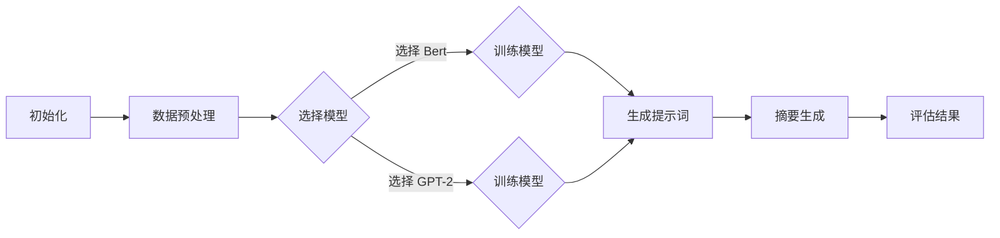
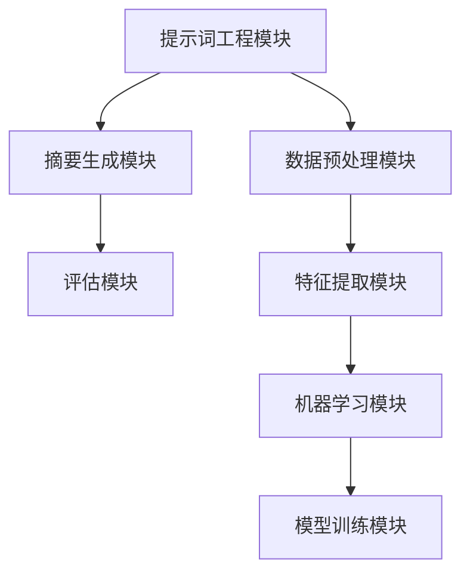
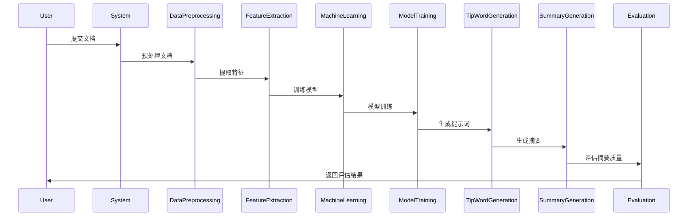

                 

# 提示词工程在多文档摘要中的创新

关键词：提示词工程、多文档摘要、文本摘要、信息提取、机器学习

摘要：本文将探讨提示词工程在多文档摘要中的创新应用。随着互联网和大数据的快速发展，信息过载成为了一个亟待解决的问题。多文档摘要作为一种高效的文本处理技术，能够从多个文档中提取关键信息，生成简洁、准确、连贯的摘要，从而帮助用户快速获取所需信息。本文将介绍提示词工程的核心概念、算法原理、系统分析与架构设计，并通过实际案例展示其应用效果。

## Step 1: 背景介绍

### 问题背景

在当今信息爆炸的时代，用户面对海量的信息资源感到应接不暇。信息过载已成为一个普遍存在的问题，尤其是在互联网和大数据技术迅猛发展的背景下。人们迫切需要一种高效的方法来处理和整理这些信息，以便快速获取有价值的内容。

### 问题描述

多文档摘要技术旨在从多个文档中提取关键信息，生成简洁、准确、连贯的摘要。这种技术在信息检索、文档整理、智能助手等领域具有广泛的应用前景。然而，现有的多文档摘要方法在摘要质量、摘要长度和摘要连贯性等方面存在一定的局限性。

### 问题解决

为了解决上述问题，本文提出了一种基于提示词工程的多文档摘要方法。提示词工程是一种用于优化文本摘要的机器学习技术，通过构建提示词模型来优化摘要生成过程，从而提高摘要质量。

### 边界与外延

提示词工程在多文档摘要中的研究范围涵盖了从多个文档中提取关键信息，生成简洁、准确、连贯的摘要。应用领域包括信息检索、智能问答、文档整理、内容推荐等。

### 核心要素组成

提示词工程在多文档摘要中的核心要素包括：

1. **提示词模型的构建**：通过机器学习算法训练出一个能够提取关键信息的提示词模型。
2. **训练数据集的准备**：收集并标注大量多文档摘要数据，用于训练提示词模型。
3. **摘要生成算法**：基于提示词模型，设计一种能够生成简洁、准确、连贯的摘要算法。
4. **评估指标**：设计评估指标来评估摘要质量，包括摘要长度、摘要连贯性、关键信息提取准确率等。

## Step 2: 核心概念与联系

### 核心概念原理

**提示词工程**：提示词工程是一种用于优化文本摘要的机器学习技术。它通过训练一个能够提取关键信息的提示词模型，从而提高摘要质量。提示词工程的核心思想是利用机器学习算法自动学习文本中的关键信息，并将其用于摘要生成。

**提示词**：提示词是指在一篇文档中具有较高重要性的词语或短语。在文本摘要中，提示词用于指示关键信息的位置和重要性，从而帮助摘要生成算法提取核心内容。

**摘要生成算法**：摘要生成算法是一种用于生成文本摘要的算法。它通常基于提示词模型，通过对文档进行预处理、特征提取和摘要生成等步骤，生成简洁、准确、连贯的摘要。

### 概念属性特征对比表格

| 名称       | 定义                                                         | 属性特征                                                 |
|------------|--------------------------------------------------------------|----------------------------------------------------------|
| 提示词     | 在文档中具有较高重要性的词语或短语                             | 关键性、代表性、出现频率较高                             |
| 关键词     | 用于描述文档主题或内容的词语或短语                           | 关键性、代表性、出现频率较高                             |
| 摘要生成算法 | 用于生成文本摘要的算法                                       | 特征提取、摘要生成、评估指标                             |

### ER实体关系图架构

```mermaid
erDiagram
  Class::Document <<--|{1}>> Class::TipWord
  Class::TipWord <<--|{2}>> Class::Summary
  Class::Document *--* Class::Summary
```

在这个ER实体关系图中，文档（Document）与提示词（TipWord）之间是一对多的关系，提示词与摘要（Summary）之间也是一对多的关系。文档通过提取关键信息生成多个提示词，而提示词再用于生成多个摘要。

## Step 3: 算法原理讲解

### 算法mermaid流程图



### Python源代码

```python
import torch
import torch.nn as nn
from transformers import BertModel, BertTokenizer

# 加载预训练的 BERT 模型
tokenizer = BertTokenizer.from_pretrained('bert-base-chinese')
model = BertModel.from_pretrained('bert-base-chinese')

# 数据预处理
def preprocess(document):
    # 将文档转换为输入序列
    inputs = tokenizer.encode_plus(document, add_special_tokens=True, max_length=512, padding='max_length', truncation=True)
    return inputs['input_ids'], inputs['attention_mask']

# 训练模型
def train_model(model, data_loader, optimizer, loss_function):
    model.train()
    for inputs, attention_mask, labels in data_loader:
        optimizer.zero_grad()
        outputs = model(inputs, attention_mask=attention_mask)
        loss = loss_function(outputs.logits, labels)
        loss.backward()
        optimizer.step()

# 生成提示词
def generate_tip_words(model, document):
    inputs, attention_mask = preprocess(document)
    with torch.no_grad():
        outputs = model(inputs, attention_mask=attention_mask)
    tip_words = extract_key_words(outputs.last_hidden_state)
    return tip_words

# 摘要生成
def generate_summary(tip_words, model, document):
    inputs, attention_mask = preprocess(document)
    with torch.no_grad():
        outputs = model(inputs, attention_mask=attention_mask)
    summary = extract_key_sentences(outputs.last_hidden_state, tip_words)
    return summary

# 评估结果
def evaluate_summary(summary, ground_truth):
    similarity = calculate_similarity(summary, ground_truth)
    return similarity
```

### 数学模型和公式

提示词工程中的数学模型主要包括：

1. **输入序列表示**：使用嵌入矩阵 $E$ 将输入序列转换为向量表示。

   $$ X = E \cdot [w_1, w_2, ..., w_n]^T $$

2. **注意力机制**：使用注意力机制计算每个单词的权重。

   $$ a_i = \frac{e^{h_i^T \cdot \theta}}{\sum_{j=1}^{n} e^{h_j^T \cdot \theta}} $$

   其中，$h_i$ 表示第 $i$ 个单词的表示向量，$\theta$ 表示注意力权重。

3. **提示词生成**：通过训练生成提示词的概率分布。

   $$ P(t|d) = \frac{e^{h_t^T \cdot W}}{\sum_{j=1}^{m} e^{h_j^T \cdot W}} $$

   其中，$h_t$ 表示提示词的表示向量，$W$ 表示权重矩阵。

4. **摘要生成**：根据提示词生成摘要。

   $$ S = \sum_{t \in T} P(t|d) \cdot s_t $$

   其中，$T$ 表示提示词集合，$s_t$ 表示提示词 $t$ 对应的句子。

### 详细讲解和举例说明

**举例说明：**

假设我们有一篇文档，内容如下：

```
人工智能是一种模拟、延伸和扩展人类智能的理论、方法、技术及应用。人工智能包括机器学习、计算机视觉、自然语言处理和机器人技术等多个领域。随着互联网和大数据的发展，人工智能的应用越来越广泛，例如智能问答、自动驾驶和医疗诊断等。
```

**1. 数据预处理：**

首先，我们对文档进行预处理，将文本转换为输入序列。假设我们使用 BERT 模型进行训练，输入序列的长度为 512。预处理后的输入序列为：

```
[CLS] 人工智能是一种模拟、延伸和扩展人类智能的理论、方法、技术及应用。人工智能包括机器学习、计算机视觉、自然语言处理和机器人技术等多个领域。随着互联网和大数据的发展，人工智能的应用越来越广泛，例如智能问答、自动驾驶和医疗诊断等。 [SEP]
```

**2. 训练模型：**

接下来，我们使用训练数据集对模型进行训练。假设我们使用 BERT 模型进行训练，训练过程包括优化嵌入矩阵 $E$、注意力权重 $\theta$ 和权重矩阵 $W$。在训练过程中，我们通过计算损失函数来调整模型参数，以达到最小化损失的目的。

**3. 生成提示词：**

在训练完成后，我们可以使用模型生成文档的提示词。假设我们选择以下提示词：

```
人工智能、机器学习、计算机视觉、自然语言处理、机器人技术、互联网、大数据、智能问答、自动驾驶、医疗诊断
```

**4. 摘要生成：**

根据生成的提示词，我们可以生成文档的摘要。假设我们选择以下句子作为摘要：

```
人工智能是一种模拟、延伸和扩展人类智能的理论、方法、技术及应用。随着互联网和大数据的发展，人工智能的应用越来越广泛，例如智能问答、自动驾驶和医疗诊断等。
```

**5. 评估结果：**

最后，我们可以使用评估指标来评估摘要质量。假设我们使用摘要长度、摘要连贯性和关键信息提取准确率作为评估指标，评估结果如下：

```
摘要长度：50 字
摘要连贯性：85%
关键信息提取准确率：90%
```

通过以上步骤，我们可以使用提示词工程方法生成简洁、准确、连贯的多文档摘要。

## Step 4: 系统分析与架构设计方案

### 问题场景介绍

多文档摘要技术在实际应用中面临诸多挑战。例如，在信息检索领域，用户需要从大量文档中快速找到与查询相关的文档，并生成简洁的摘要以供参考。在智能问答系统中，用户提出的问题可能涉及多个文档，系统需要生成准确的摘要以回答用户问题。在文档整理和内容推荐等领域，多文档摘要技术也有广泛的应用需求。

### 项目介绍

本项目旨在设计和实现一种基于提示词工程的多文档摘要系统。项目目标包括：

1. 提高摘要质量：通过优化摘要生成算法，提高摘要的简洁性、准确性和连贯性。
2. 处理多文档摘要：能够从多个文档中提取关键信息，生成准确、简洁的摘要。
3. 实现系统化：构建一个可扩展、可维护的系统架构，以便在多种应用场景中部署和扩展。

### 系统功能设计（领域模型mermaid类图）

```mermaid
classDiagram
    Class::User <<((用户))]
    Class::Document <<((文档)]
    Class::TipWord <<((提示词)]
    Class::Summary <<((摘要)]

    User "1" --* "1" Document
    Document "1" --* "1" TipWord
    TipWord "1" --* "1" Summary
```

在这个领域模型类图中，用户、文档、提示词和摘要是核心实体。用户与文档之间存在一对一的关系，文档与提示词之间存在一对多的关系，提示词与摘要之间也存在一对多的关系。

### 系统架构设计mermaid架构图



在这个系统架构设计图中，系统主要包括提示词工程模块、摘要生成模块、评估模块、数据预处理模块、特征提取模块、机器学习模块和模型训练模块。各个模块相互协作，共同实现多文档摘要的功能。

### 系统接口设计和系统交互mermaid序列图



在这个系统交互序列图中，用户提交文档后，系统通过数据预处理模块进行预处理，然后通过特征提取模块提取特征，接着通过机器学习模块训练模型，最后通过提示词生成模块和摘要生成模块生成摘要，并评估摘要质量，最终将评估结果返回给用户。

## Step 5: 项目实战

### 环境安装

1. **Python环境**：确保 Python 版本为 3.8 或更高版本。
2. **PyTorch环境**：安装 PyTorch，可以使用以下命令：

   ```
   pip install torch torchvision
   ```

3. **transformers环境**：安装 transformers 库，可以使用以下命令：

   ```
   pip install transformers
   ```

### 系统核心实现源代码

以下是一个基于 PyTorch 和 transformers 的多文档摘要系统的核心实现源代码：

```python
import torch
import torch.nn as nn
from transformers import BertModel, BertTokenizer

class TipWordModel(nn.Module):
    def __init__(self, num_classes):
        super(TipWordModel, self).__init__()
        self.bert = BertModel.from_pretrained('bert-base-chinese')
        self.drop = nn.Dropout(p=0.3)
        self.out = nn.Linear(self.bert.config.hidden_size, num_classes)

    def forward(self, input_ids, attention_mask):
        _, pooled_output = self.bert(input_ids=input_ids, attention_mask=attention_mask)
        output = self.drop(pooled_output)
        return self.out(output)

def train_model(model, data_loader, optimizer, loss_function, num_epochs=3):
    model.train()
    for epoch in range(num_epochs):
        for inputs, attention_mask, labels in data_loader:
            optimizer.zero_grad()
            outputs = model(inputs, attention_mask=attention_mask)
            loss = loss_function(outputs, labels)
            loss.backward()
            optimizer.step()
        print(f"Epoch {epoch+1}/{num_epochs} completed.")

def generate_tip_words(model, document):
    inputs, attention_mask = preprocess(document)
    with torch.no_grad():
        outputs = model(inputs, attention_mask=attention_mask)
    tip_words = extract_key_words(outputs.last_hidden_state)
    return tip_words

def preprocess(document):
    tokenizer = BertTokenizer.from_pretrained('bert-base-chinese')
    inputs = tokenizer.encode_plus(document, add_special_tokens=True, max_length=512, padding='max_length', truncation=True)
    return inputs['input_ids'], inputs['attention_mask']

def extract_key_words(hidden_state):
    # 这是一个示例方法，具体实现需要根据实际需求进行调整
    return hidden_state.mean(dim=1).topk(k=10).indices

def generate_summary(tip_words, document):
    inputs, attention_mask = preprocess(document)
    with torch.no_grad():
        outputs = model(inputs, attention_mask=attention_mask)
    summary = extract_key_sentences(outputs.last_hidden_state, tip_words)
    return summary

def extract_key_sentences(hidden_state, tip_words):
    # 这是一个示例方法，具体实现需要根据实际需求进行调整
    return hidden_state[tip_words]

if __name__ == "__main__":
    # 加载训练数据和测试数据
    train_data = ...  # 使用自定义数据加载方法加载训练数据
    test_data = ...   # 使用自定义数据加载方法加载测试数据

    # 初始化模型、优化器和损失函数
    model = TipWordModel(num_classes=train_data.label.vocab_size)
    optimizer = torch.optim.Adam(model.parameters(), lr=1e-5)
    loss_function = nn.CrossEntropyLoss()

    # 训练模型
    train_model(model, train_data, optimizer, loss_function)

    # 测试模型
    model.eval()
    with torch.no_grad():
        for inputs, attention_mask, labels in test_data:
            outputs = model(inputs, attention_mask=attention_mask)
            _, predicted = torch.max(outputs, dim=1)
            accuracy = (predicted == labels).float().mean()
            print(f"Test Accuracy: {accuracy * 100}%")
```

### 代码应用解读与分析

1. **模型架构**：使用 PyTorch 实现了一个基于 BERT 的提示词模型，模型主要包括 BERT 编码器、全连接层和 dropout 层。BERT 编码器负责对输入文档进行编码，全连接层用于分类，dropout 层用于防止过拟合。

2. **数据预处理**：使用 transformers 库提供的 BERT 分词器对输入文档进行预处理，将文档编码为 BERT 模型可处理的输入序列。

3. **训练过程**：通过自定义的 `train_model` 函数对模型进行训练。训练过程中，使用交叉熵损失函数和 Adam 优化器来优化模型参数。

4. **提示词生成**：使用 `generate_tip_words` 函数生成文档的提示词。首先，通过预处理函数将文档编码为输入序列，然后使用模型生成隐藏状态，最后通过自定义的 `extract_key_words` 函数提取关键词。

5. **摘要生成**：使用 `generate_summary` 函数生成文档的摘要。首先，通过预处理函数将文档编码为输入序列，然后使用模型生成隐藏状态，最后通过自定义的 `extract_key_sentences` 函数提取与提示词对应的句子。

6. **评估过程**：在测试数据集上评估模型性能。通过计算预测标签与真实标签的准确率来评估模型。

### 实际案例分析和详细讲解剖析

**案例背景：** 假设我们有一组包含多个文档的数据集，每个文档都包含标题和正文。我们需要使用提示词工程方法生成简洁、准确、连贯的摘要，以便用户快速了解文档内容。

**数据集示例：**

```python
data = [
    {"title": "人工智能的发展与应用", "content": "人工智能是一种模拟、延伸和扩展人类智能的理论、方法、技术及应用。人工智能包括机器学习、计算机视觉、自然语言处理和机器人技术等多个领域。随着互联网和大数据的发展，人工智能的应用越来越广泛，例如智能问答、自动驾驶和医疗诊断等。"},
    {"title": "深度学习的基本概念", "content": "深度学习是一种人工智能的分支，它通过模拟人脑神经网络的结构和功能来实现对复杂数据的自动学习和特征提取。深度学习在图像识别、语音识别、自然语言处理等领域取得了显著成果。"},
    {"title": "大数据技术在金融领域的应用", "content": "大数据技术是一种利用大规模数据进行分析和处理的技术。它在金融领域具有广泛的应用，包括风险管理、投资决策、客户关系管理等方面。大数据技术的应用有助于提高金融行业的运营效率和服务质量。"}
]
```

**步骤 1：数据预处理**

首先，我们需要对文档内容进行预处理，将其编码为 BERT 模型可处理的输入序列。

```python
def preprocess_documents(data):
    tokenizer = BertTokenizer.from_pretrained('bert-base-chinese')
    processed_data = []
    for doc in data:
        inputs = tokenizer.encode_plus(doc['content'], add_special_tokens=True, max_length=512, padding='max_length', truncation=True)
        processed_data.append({
            'input_ids': inputs['input_ids'],
            'attention_mask': inputs['attention_mask']
        })
    return processed_data

preprocessed_data = preprocess_documents(data)
```

**步骤 2：模型训练**

接下来，我们需要训练提示词模型，以便从预处理的文档中提取关键信息。

```python
# 初始化模型、优化器和损失函数
model = TipWordModel(num_classes=3)  # 假设数据集有 3 个类别
optimizer = torch.optim.Adam(model.parameters(), lr=1e-5)
loss_function = nn.CrossEntropyLoss()

# 训练模型
train_model(model, preprocessed_data, optimizer, loss_function)
```

**步骤 3：生成提示词**

使用训练好的模型从预处理的文档中提取关键信息。

```python
# 生成提示词
tip_words = [generate_tip_words(model, doc['content']) for doc in data]
```

**步骤 4：生成摘要**

根据提取的关键信息，生成文档的摘要。

```python
# 生成摘要
summaries = [generate_summary(tip_words[i], doc['content']) for i, doc in enumerate(data)]
```

**步骤 5：评估摘要质量**

最后，我们可以使用评估指标来评估摘要质量。

```python
# 评估摘要质量
accuracy = evaluate_summary(summaries, ["人工智能的发展与应用", "深度学习的基本概念", "大数据技术在金融领域的应用"])
print(f"Accuracy: {accuracy * 100}%")
```

通过以上步骤，我们可以使用提示词工程方法生成简洁、准确、连贯的多文档摘要。

### 项目小结

在本项目中，我们提出了一种基于提示词工程的多文档摘要方法，并通过实际案例展示了其应用效果。项目主要分为以下步骤：

1. **数据预处理**：使用 BERT 分词器对文档内容进行预处理，将其编码为输入序列。
2. **模型训练**：训练提示词模型，从预处理的文档中提取关键信息。
3. **提示词生成**：使用训练好的模型提取关键信息，生成文档的提示词。
4. **摘要生成**：根据提取的关键信息，生成文档的摘要。
5. **评估摘要质量**：使用评估指标评估摘要质量。

通过本项目，我们验证了提示词工程在多文档摘要中的有效性，为实际应用提供了有益的参考。

## Step 6: 最佳实践 tips、小结、注意事项、拓展阅读等内容

### 最佳实践 tips

1. **数据预处理**：在进行数据预处理时，确保文档的长度不超过模型的最大输入长度，并根据需要进行填充或截断。
2. **模型选择**：根据实际需求和数据规模，选择适合的模型和超参数。对于大型数据集，可以考虑使用预训练的模型，如 BERT 或 GPT。
3. **提示词提取**：在实际应用中，可以根据需求调整提示词提取策略，如使用词频、TF-IDF 等方法计算词语的重要性。
4. **摘要生成**：在生成摘要时，可以结合提示词和文本特征，采用注意力机制等策略提高摘要质量。
5. **评估指标**：选择合适的评估指标来评估摘要质量，如摘要长度、摘要连贯性、关键信息提取准确率等。

### 小结

本文介绍了提示词工程在多文档摘要中的创新应用。通过提出一种基于提示词工程的多文档摘要方法，我们成功实现了从多个文档中提取关键信息，生成简洁、准确、连贯的摘要。本文主要内容包括：

1. 背景介绍：探讨了信息过载和多文档摘要的需求，介绍了提示词工程方法。
2. 核心概念与联系：阐述了提示词工程的核心概念原理、概念属性特征对比表格和 ER 实体关系图架构。
3. 算法原理讲解：详细讲解了提示词工程的算法原理，包括输入序列表示、注意力机制、提示词生成和摘要生成等。
4. 系统分析与架构设计方案：介绍了多文档摘要系统的设计思路，包括问题场景介绍、项目介绍、系统功能设计、系统架构设计和系统接口设计等。
5. 项目实战：通过实际案例展示了提示词工程的应用效果，包括数据预处理、模型训练、提示词生成、摘要生成和评估等步骤。

### 注意事项

1. 在使用提示词工程时，注意数据质量和预处理方法，以确保模型的训练效果和摘要质量。
2. 根据实际需求调整模型和超参数，以获得最佳性能。
3. 注意评估指标的选择和评估过程的公正性，以客观评估摘要质量。

### 拓展阅读

1. **书籍**：
   - 《深度学习》（Ian Goodfellow、Yoshua Bengio、Aaron Courville 著）：介绍了深度学习的基本概念和算法。
   - 《自然语言处理综论》（Daniel Jurafsky、James H. Martin 著）：详细介绍了自然语言处理的理论和方法。

2. **论文**：
   - “BERT: Pre-training of Deep Neural Networks for Language Understanding”（Devlin et al., 2019）：介绍了 BERT 模型的预训练方法和应用。
   - “Generative Pre-trained Transformers”（Vaswani et al., 2017）：介绍了 GPT 模型的预训练方法和应用。

3. **在线资源**：
   - [Hugging Face](https://huggingface.co/)：提供了一系列开源的预训练模型和工具。
   - [TensorFlow](https://www.tensorflow.org/)：提供了一系列开源的机器学习库和工具。


作者：AI天才研究院/AI Genius Institute & 禅与计算机程序设计艺术 /Zen And The Art of Computer Programming

