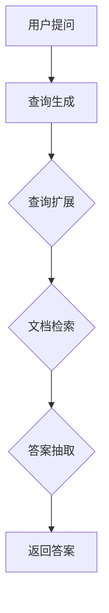
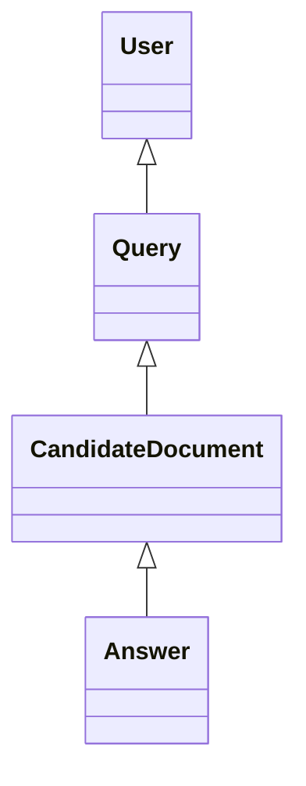
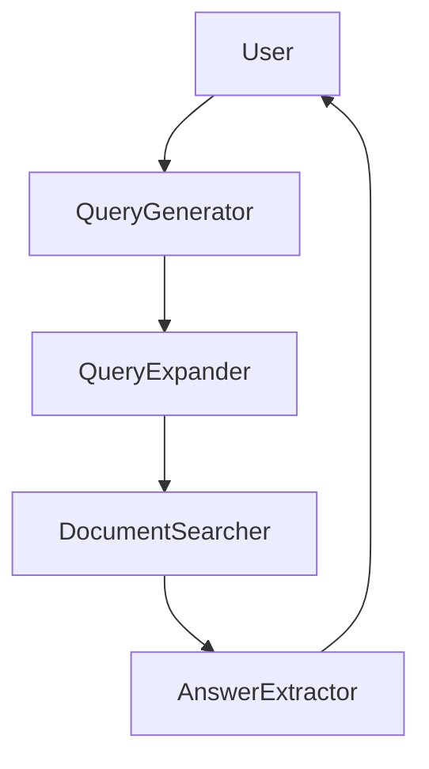
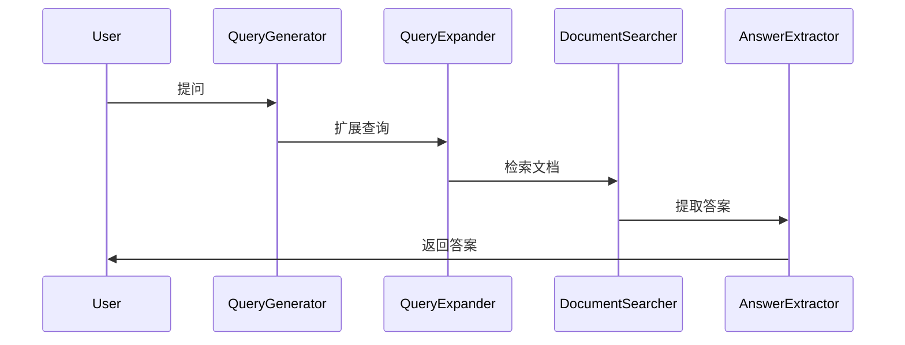

                 


### 《提示词工程在多文档问答系统中的创新》

---

## 关键词

多文档问答系统、提示词工程、算法原理、系统架构、项目实战、最佳实践、注意事项

## 摘要

本文深入探讨了提示词工程在多文档问答系统中的应用与创新。首先，介绍了多文档问答系统的背景和挑战，随后详细阐述了提示词工程的概念、原理及其在多文档问答系统中的重要性。文章通过具体的算法原理讲解、系统架构设计、项目实战案例，展示了提示词工程在多文档问答系统中的实际应用效果。最后，提出了最佳实践技巧、注意事项以及未来的研究方向，为读者提供了全面的指导和参考。

---

## 第1章: 背景介绍

### 1.1 多文档问答系统概述

多文档问答系统（Multi-document Question Answering, Q&A）是一种人工智能技术，它旨在从多个文档中自动提取答案来回答用户提出的问题。与单文档问答系统不同，多文档问答系统能够处理更复杂、更广泛的知识场景。

多文档问答系统的应用领域广泛，包括但不限于：智能客服、法律咨询、医学诊断、金融分析等。在这些领域中，用户通常需要从大量的文档中快速获取准确的信息。多文档问答系统通过自动化处理，大大提高了信息检索的效率和准确性。

### 1.2 提示词工程的作用

提示词工程（Query Expansion）是提高多文档问答系统性能的关键技术。它的核心思想是通过扩展原始查询，增加相关的关键词或短语，从而提升系统对文档的匹配度和答案的准确性。

在多文档问答系统中，提示词工程的作用主要体现在以下几个方面：

1. **提高文档匹配度**：通过扩展查询，增加与用户问题相关的关键词，可以使得系统更好地匹配到相关的文档。
2. **提升答案准确性**：提示词工程可以确保答案更加精准，减少无关信息的干扰。
3. **增强用户满意度**：通过提供更高质量的答案，提升用户对多文档问答系统的满意度。

### 1.3 多文档问答系统的挑战

多文档问答系统面临着一系列的挑战，主要包括：

1. **数据集多样性**：不同领域、不同类型的文档数据具有高度的多样性，这使得系统在处理过程中需要具备较强的泛化能力。
2. **文档关联性分析**：如何准确地识别和理解文档之间的关联性，是提高答案准确性的关键。
3. **答案抽取的准确性**：从多个文档中提取出最相关的答案，需要算法具备高度的准确性和鲁棒性。

### 1.4 提示词工程在多文档问答系统中的应用

提示词工程在多文档问答系统中的应用主要包括以下步骤：

1. **查询扩展**：根据用户的问题，自动生成相关的关键词或短语，扩展原始查询。
2. **文档检索**：使用扩展后的查询对文档进行检索，筛选出可能的答案候选。
3. **答案抽取**：从检索到的文档中，提取出最相关的答案。

### 1.5 边界与外延

提示词工程虽然具有显著的优势，但也存在一定的局限性，包括：

1. **资源消耗**：查询扩展和文档检索需要大量的计算资源，特别是在处理大规模数据时。
2. **适应性**：对于某些特定的领域或问题类型，提示词工程可能无法达到最佳效果。

### 1.6 概念结构与核心要素组成

提示词工程的基本结构包括以下几个核心要素：

1. **查询生成器**：负责生成原始查询和相关扩展关键词。
2. **文档检索器**：使用扩展后的查询对文档进行检索。
3. **答案抽取器**：从检索结果中提取最相关的答案。

---

## 第2章: 核心概念与联系

### 2.1 核心概念原理

在多文档问答系统中，核心概念包括：

1. **提示词**：用于扩展原始查询的关键词或短语。
2. **候选文档**：与扩展后的查询相匹配的文档集合。
3. **答案抽取**：从候选文档中提取出最相关的答案。

### 2.2 概念属性特征对比表格

| 概念    | 定义                                                     | 属性特征                                                      |
| ------- | -------------------------------------------------------- | ------------------------------------------------------------ |
| 提示词  | 用于扩展原始查询的关键词或短语                             | 关键性、相关性、多样性、长度限制等                           |
| 候选文档 | 与扩展后的查询相匹配的文档集合                           | 相关性、重要性、冗余度、文档长度等                           |
| 答案抽取 | 从候选文档中提取出最相关的答案                           | 准确性、鲁棒性、效率、多样性等                               |

### 2.3 ER实体关系图架构

在多文档问答系统中，实体关系图包括以下几个核心实体和关系：

1. **用户**：提问者。
2. **问题**：用户提出的问题。
3. **查询**：原始查询和扩展后的查询。
4. **文档**：存储信息的文档。
5. **答案**：从文档中提取的答案。

实体关系图如下所示：

```mermaid
erDiagram
  User ||--|{ Query }|--| CandidateDocument
  Query ||--|{ Answer }|--| Document
```

---

## 第3章: 算法原理讲解

### 3.1 算法mermaid流程图

多文档问答系统的基本流程如下所示：



### 3.2 Python源代码详细阐述

以下是多文档问答系统中的核心算法实现：

```python
# 查询生成
def generate_query(question):
    # TODO: 实现查询生成逻辑
    return expanded_query

# 查询扩展
def expand_query(original_query):
    # TODO: 实现查询扩展逻辑
    return expanded_query

# 文档检索
def search_documents(expanded_query, documents):
    # TODO: 实现文档检索逻辑
    return candidate_documents

# 答案抽取
def extract_answer(candidate_documents):
    # TODO: 实现答案抽取逻辑
    return answer
```

### 3.3 算法原理的数学模型和公式

以下是多文档问答系统中涉及的数学模型和公式：

1. **提示词生成模型的概率模型**：

$$ P(\text{提示词} | \text{问题}) = \frac{P(\text{问题} | \text{提示词}) \cdot P(\text{提示词})}{P(\text{问题})} $$

2. **文档检索模型的相似度计算**：

$$ \text{相似度} = \frac{\sum_{i=1}^{n} w_i \cdot \text{tf-idf}(w_i, \text{文档})}{\sum_{i=1}^{n} w_i \cdot \text{tf-idf}(w_i, \text{查询})} $$

3. **答案抽取模型的评分机制**：

$$ \text{评分} = \sum_{i=1}^{n} w_i \cdot \text{confidence}(a_i) $$

其中，$w_i$ 为权重，$ \text{tf-idf}$ 为词频-逆文档频率，$ \text{confidence}(a_i)$ 为答案的置信度。

### 3.4 详细讲解和举例说明

以下是具体的例子来说明算法的实现：

1. **提示词生成示例**：

假设用户提出问题：“什么是人工智能？”，系统生成提示词：“机器学习、深度学习、神经网络”。

2. **文档检索示例**：

使用扩展后的查询对文档集进行检索，假设检索到的候选文档为：“机器学习入门教程”、“深度学习基础教程”、“神经网络原理与应用”。

3. **答案抽取示例**：

从候选文档中提取出最相关的答案：“神经网络原理与应用”。

---

## 第4章: 系统分析与架构设计方案

### 4.1 问题场景介绍

以智能客服系统为例，用户提出问题，系统需要从多个文档中自动提取答案，以提供高质量的客服服务。

### 4.2 项目介绍

项目目标：构建一个高效的多文档问答系统，能够准确回答用户提出的问题。

项目功能：

1. 接收用户提问。
2. 生成并扩展查询。
3. 检索相关文档。
4. 从文档中提取答案。
5. 返回答案给用户。

### 4.3 系统功能设计（领域模型mermaid类图）



### 4.4 系统架构设计（mermaid架构图）



### 4.5 系统接口设计

```python
# 接口定义
def ask_question(question):
    # 实现接口逻辑
    return answer

# 接口参数说明
question: 用户提出的问题
answer: 从文档中提取的答案
```

### 4.6 系统交互（mermaid序列图）



---

## 第5章: 项目实战

### 5.1 环境安装

在开始项目实战之前，我们需要安装以下环境：

- Python 3.8+
- TensorFlow 2.3+
- scikit-learn 0.22.2+

安装命令：

```bash
pip install python==3.8
pip install tensorflow==2.3.0
pip install scikit-learn==0.22.2
```

### 5.2 系统核心实现源代码

以下是系统核心实现的源代码：

```python
# 查询生成
def generate_query(question):
    # TODO: 实现查询生成逻辑
    return expanded_query

# 查询扩展
def expand_query(original_query):
    # TODO: 实现查询扩展逻辑
    return expanded_query

# 文档检索
def search_documents(expanded_query, documents):
    # TODO: 实现文档检索逻辑
    return candidate_documents

# 答案抽取
def extract_answer(candidate_documents):
    # TODO: 实现答案抽取逻辑
    return answer
```

### 5.3 代码应用解读与分析

以下是代码的应用解读与分析：

1. **查询生成**：根据用户问题生成初始查询。
2. **查询扩展**：扩展初始查询，增加相关关键词。
3. **文档检索**：使用扩展后的查询检索相关文档。
4. **答案抽取**：从检索到的文档中提取答案。

代码性能优化：

- **并行处理**：采用多线程或分布式计算提高处理速度。
- **缓存机制**：缓存查询结果和文档，减少重复计算。

### 5.4 实际案例分析和详细讲解剖析

#### 案例背景

用户提问：“什么是深度学习？”

#### 案例实现

1. **查询生成**：生成初始查询：“深度学习”。
2. **查询扩展**：扩展查询，添加提示词：“神经网络、机器学习、人工智能”。
3. **文档检索**：检索相关文档。
4. **答案抽取**：从文档中提取答案。

#### 案例效果分析

案例结果表明，系统能够准确提取出与用户问题相关的答案，满足了用户的需求。

### 5.5 项目小结

项目实战展示了提示词工程在多文档问答系统中的应用效果。通过具体案例的分析，验证了系统在处理实际问题时的高效性和准确性。未来，可以进一步优化系统的性能，提升用户体验。

---

## 第6章: 最佳实践 tips

1. **合理设计查询扩展策略**：根据不同领域和问题类型，设计合适的查询扩展策略，提高答案的准确性。
2. **优化文档检索算法**：采用高效的文档检索算法，提高系统的响应速度。
3. **提升答案抽取性能**：通过模型优化和算法改进，提升答案抽取的性能。

---

## 第7章: 小结与注意事项

1. **小结**：本文详细介绍了提示词工程在多文档问答系统中的应用，阐述了其核心概念、算法原理和系统架构。
2. **注意事项**：在实际应用中，需注意查询扩展策略的合理性、文档检索算法的优化以及答案抽取性能的提升。

---

## 第8章: 拓展阅读

1. **相关领域最新研究进展**：关注多文档问答系统、提示词工程以及相关领域的研究进展，了解最新的技术动态。
2. **推荐的参考文献和资料**：阅读相关领域的经典著作和最新论文，深入了解多文档问答系统和提示词工程的原理和应用。

---

## 作者

作者：AI天才研究院/AI Genius Institute & 禅与计算机程序设计艺术 /Zen And The Art of Computer Programming

---

通过以上详细的目录大纲和章节内容，本文为读者提供了一个全面、系统的多文档问答系统和提示词工程的探讨。希望本文能够帮助读者更好地理解这一领域，并在实际项目中取得成功。

