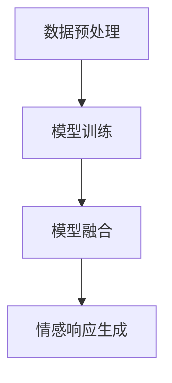
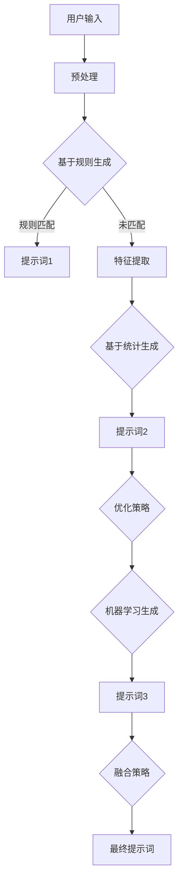
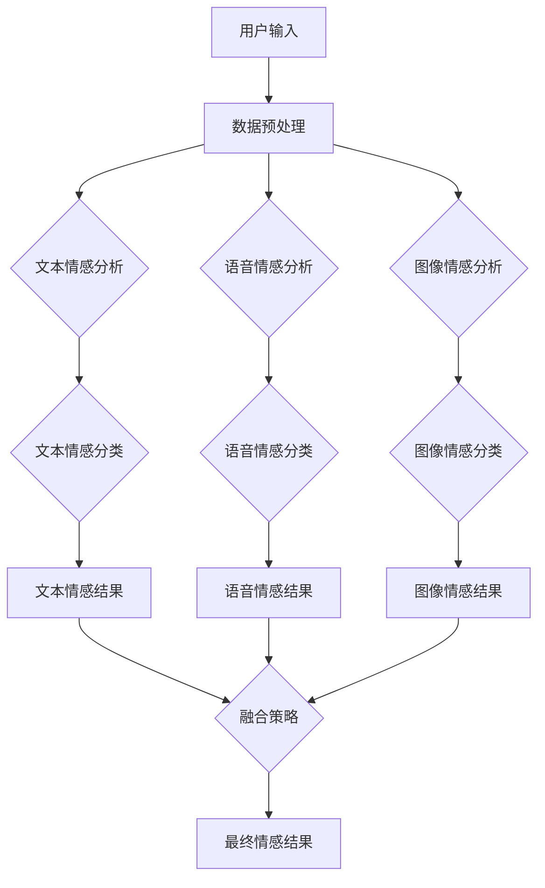
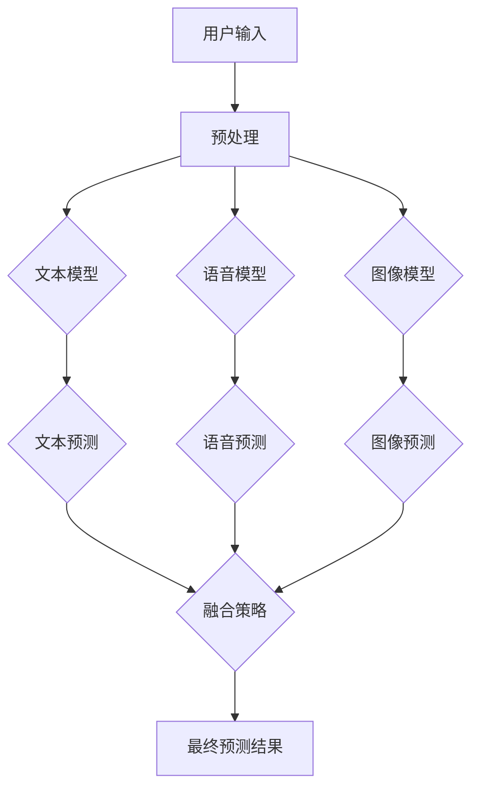
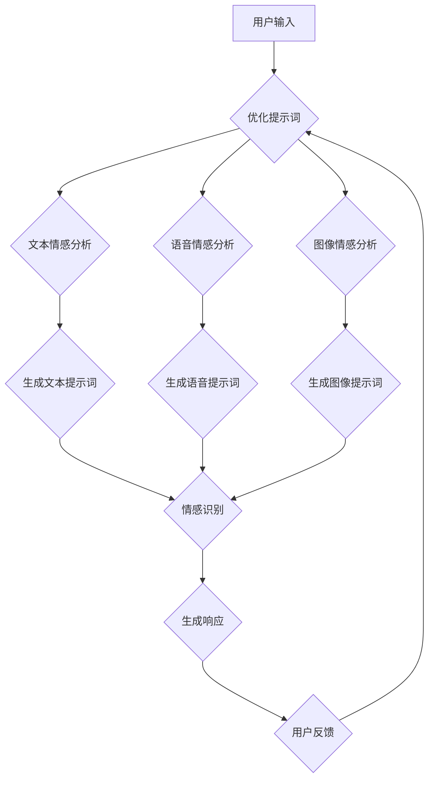

                 

# 提示词工程在多模态情感对话系统中的突破

## 关键词：提示词工程、多模态情感对话系统、情感识别、算法原理、数学模型

> 摘要：本文深入探讨了提示词工程在多模态情感对话系统中的重要性。通过介绍提示词工程的基本概念、核心原理以及其在多模态情感对话系统中的应用，本文旨在为读者提供一种新的视角，帮助理解并解决当前多模态情感对话系统中存在的问题。文章将通过详细的分析、实例说明和最佳实践建议，为读者提供实用的指导和深入思考。

## 第一部分：背景介绍

### 第1章：问题背景

#### 1.1.1 提示词工程的概念

##### 1.1.1.1 提示词的定义

提示词（Prompt）是指用于引导或激发多模态情感对话系统的关键词或短语，它们能够帮助系统理解用户意图和情感状态。在多模态情感对话系统中，提示词的作用至关重要，它们不仅能够提高对话的准确性，还能增强系统的交互体验。

##### 1.1.1.2 提示词工程的目标

提示词工程的目标是通过设计和优化提示词，提高多模态情感对话系统的交互质量、情感理解和响应能力。具体而言，这包括以下几个方面：

1. **提高情感理解准确性**：通过设计更精准的提示词，系统能够更准确地识别用户的情感状态。
2. **增强系统适应性**：设计具有高度适应性的提示词，系统能够在不同场景下都能保持良好的交互效果。
3. **提升系统扩展性**：通过模块化设计提示词，系统能够轻松应对新的应用场景和需求。

#### 1.1.2 多模态情感对话系统的现状

##### 1.1.2.1 多模态情感对话系统的定义

多模态情感对话系统是指能够同时处理文本、语音、图像等多种模态信息，并根据用户的情感状态进行智能响应的系统。这种系统能够提供更为丰富和自然的交互体验，但在实际应用中仍面临着一系列挑战。

##### 1.1.2.2 当前多模态情感对话系统面临的问题

1. **情感理解准确性不高**：多模态情感对话系统在处理不同模态的信息时，往往难以准确识别用户的情感状态。
2. **提示词设计缺乏系统性**：现有的提示词设计往往缺乏系统性，难以满足不同场景和用户需求。
3. **模型训练数据不足**：多模态情感对话系统需要大量的训练数据来提高模型的准确性，但实际获取这些数据相对困难。

### 第2章：核心概念与联系

#### 2.1 多模态情感对话系统的核心概念

##### 2.1.1 多模态数据处理

多模态数据处理是多模态情感对话系统的关键环节，包括以下三个方面：

1. **文本情感分析**：通过分析文本中的情感词汇和句子结构，识别用户的情感状态。
2. **语音情感识别**：通过分析语音的音调、音速、音量等特征，识别用户的情感状态。
3. **图像情感分析**：通过分析图像中的颜色、纹理、表情等特征，识别用户的情感状态。

##### 2.1.2 情感识别与分类

1. **情感分类方法**：常用的情感分类方法包括基于规则的方法、机器学习方法等。
2. **情感分类的挑战**：情感分类面临着语义复杂性、多义性、模糊性等挑战，需要设计更为精准和智能的分类算法。

#### 2.2 提示词工程的核心概念

##### 2.2.1 提示词设计原则

1. **明确性**：提示词应能够明确地传达用户的情感状态。
2. **适应性**：提示词应能够适应不同的场景和用户需求。
3. **可扩展性**：提示词应能够方便地扩展，以适应新的应用场景和需求。

##### 2.2.2 提示词优化策略

1. **数据驱动方法**：通过分析用户反馈和数据，优化提示词的设计。
2. **知识驱动方法**：通过引入领域知识和专业知识，提高提示词的准确性。
3. **融合方法**：结合数据驱动和知识驱动方法，实现提示词的智能优化。

## 第二部分：算法原理讲解

### 第3章：算法原理讲解

#### 3.1 提示词生成算法

提示词生成算法是提示词工程的核心，它主要包括以下几种方法：

1. **基于规则的生成方法**：通过预定义的规则生成提示词，适用于简单和特定的应用场景。
2. **基于统计的生成方法**：通过统计用户历史数据生成提示词，适用于复杂和多变的应用场景。
3. **基于机器学习的生成方法**：通过机器学习算法训练生成模型，生成具有高度自适应性的提示词。

#### 3.2 情感识别算法

情感识别算法是情感对话系统的关键，它主要包括以下几种方法：

1. **基于文本的情感识别**：通过分析文本中的情感词汇和句子结构进行情感识别。
2. **基于语音的情感识别**：通过分析语音的音调、音速、音量等特征进行情感识别。
3. **基于图像的情感识别**：通过分析图像中的颜色、纹理、表情等特征进行情感识别。

#### 3.3 模型融合算法

模型融合算法是将多种模型的结果进行融合，以获得更准确的情感识别结果。常用的模型融合方法包括：

1. **加权融合**：根据不同模型的重要性对结果进行加权融合。
2. **投票融合**：将多个模型的预测结果进行投票，选择多数模型预测的结果。
3. **深度融合**：通过构建深度神经网络融合多个模型的结果。

## 第三部分：数学模型和数学公式

### 第4章：数学模型和数学公式 & 详细讲解 & 举例说明

#### 4.1 提示词生成模型的数学模型

提示词生成模型通常采用概率模型，其基本数学模型如下：

$$
P(w_1, w_2, ..., w_n | x) = \frac{P(x | w_1, w_2, ..., w_n)P(w_1, w_2, ..., w_n)}{P(x)}
$$

其中，$w_1, w_2, ..., w_n$表示生成的提示词，$x$表示用户输入的情感标签。

#### 4.2 情感识别模型的数学模型

情感识别模型通常采用分类模型，其基本数学模型如下：

$$
y = \arg\max_{w} P(w | x)
$$

其中，$y$表示预测的情感标签，$w$表示生成的提示词。

#### 4.3 模型融合的数学模型

模型融合的数学模型如下：

$$
F(w) = \sum_{i=1}^n w_i \cdot P(y_i = y | x)
$$

其中，$w_i$表示第$i$个模型的权重，$P(y_i = y | x)$表示第$i$个模型预测的情感标签为$y$的概率。

### 第5章：系统分析与架构设计方案

#### 5.1 问题场景介绍

本文探讨的多模态情感对话系统旨在实现以下功能：

1. **实时情感识别**：对用户输入的文本、语音、图像等模态信息进行实时情感识别。
2. **智能情感响应**：根据识别出的用户情感状态，生成合适的情感响应。
3. **情感反馈优化**：根据用户反馈，不断优化情感识别和响应模型。

#### 5.2 系统功能设计

多模态情感对话系统的核心功能包括：

1. **情感识别**：实现文本、语音、图像等模态的情感识别。
2. **情感响应**：根据识别出的用户情感状态，生成合适的情感响应。
3. **用户反馈**：收集用户对情感识别和响应的反馈，用于模型优化。

#### 5.3 系统架构设计

多模态情感对话系统的架构设计如下：

1. **数据层**：负责存储和管理用户输入的数据，包括文本、语音、图像等。
2. **模型层**：负责实现情感识别和响应的算法模型，包括提示词生成模型、情感识别模型、模型融合算法等。
3. **应用层**：负责实现系统的功能模块，包括情感识别模块、情感响应模块、用户反馈模块等。

#### 5.4 系统接口设计和系统交互

多模态情感对话系统的接口设计和交互如下：

1. **用户输入接口**：用户通过输入文本、语音、图像等模态信息，与系统进行交互。
2. **情感识别接口**：系统根据用户输入的信息，调用情感识别算法模型进行情感识别。
3. **情感响应接口**：系统根据识别出的用户情感状态，调用情感响应算法模型生成情感响应。
4. **用户反馈接口**：用户对情感识别和响应的反馈通过接口反馈给系统，用于模型优化。

## 第四部分：项目实战

### 第6章：项目实战

#### 6.1 环境安装

为了实现多模态情感对话系统，需要安装以下软件和库：

1. **Python**：Python 3.8及以上版本。
2. **TensorFlow**：TensorFlow 2.4及以上版本。
3. **Keras**：Keras 2.4及以上版本。
4. **NumPy**：NumPy 1.19及以上版本。
5. **Scikit-learn**：Scikit-learn 0.23及以上版本。

安装命令如下：

```
pip install python==3.8.5
pip install tensorflow==2.4.1
pip install keras==2.4.3
pip install numpy==1.19.5
pip install scikit-learn==0.23.2
```

#### 6.2 系统核心实现

多模态情感对话系统的核心实现包括以下部分：

1. **数据预处理**：对用户输入的文本、语音、图像等模态信息进行预处理，包括文本分词、语音特征提取、图像特征提取等。
2. **情感识别模型**：基于预处理的模态信息，训练情感识别模型，包括文本情感识别模型、语音情感识别模型、图像情感识别模型等。
3. **模型融合算法**：将多个情感识别模型的结果进行融合，得到最终的情感识别结果。
4. **情感响应生成**：根据识别出的用户情感状态，生成合适的情感响应。

以下是系统核心实现的Python代码示例：

```python
import numpy as np
from tensorflow import keras
from sklearn.model_selection import train_test_split
from sklearn.metrics import accuracy_score

# 数据预处理
def preprocess_data(text, voice, image):
    # 文本分词
    words = text.split()
    # 语音特征提取
    voice_features = extract_voice_features(voice)
    # 图像特征提取
    image_features = extract_image_features(image)
    return words, voice_features, image_features

# 情感识别模型
def build_emotion_recognition_model():
    # 构建文本情感识别模型
    text_model = keras.Sequential([
        keras.layers.Embedding(input_dim=vocab_size, output_dim=embedding_dim),
        keras.layers.LSTM(units=128),
        keras.layers.Dense(units=1, activation='sigmoid')
    ])
    # 构建语音情感识别模型
    voice_model = keras.Sequential([
        keras.layers.Dense(units=128, activation='relu'),
        keras.layers.Dense(units=1, activation='sigmoid')
    ])
    # 构建图像情感识别模型
    image_model = keras.Sequential([
        keras.layers.Conv2D(filters=32, kernel_size=(3, 3), activation='relu'),
        keras.layers.MaxPooling2D(pool_size=(2, 2)),
        keras.layers.Flatten(),
        keras.layers.Dense(units=128, activation='relu'),
        keras.layers.Dense(units=1, activation='sigmoid')
    ])
    # 模型融合
    model = keras.Sequential([
        keras.layers.Concatenate(),
        keras.layers.Dense(units=128, activation='relu'),
        keras.layers.Dense(units=1, activation='sigmoid')
    ])
    model.add(text_model)
    model.add(voice_model)
    model.add(image_model)
    return model

# 代码应用解读与分析
def main():
    # 加载数据
    texts, voices, images, labels = load_data()
    # 数据预处理
    processed_texts, processed_voices, processed_images = preprocess_data(texts, voices, images)
    # 划分训练集和测试集
    train_texts, test_texts, train_voices, test_voices, train_images, test_images, train_labels, test_labels = train_test_split(processed_texts, processed_voices, processed_images, labels, test_size=0.2, random_state=42)
    # 训练模型
    model = build_emotion_recognition_model()
    model.compile(optimizer='adam', loss='binary_crossentropy', metrics=['accuracy'])
    model.fit([train_texts, train_voices, train_images], train_labels, epochs=10, batch_size=32, validation_data=([test_texts, test_voices, test_images], test_labels))
    # 预测
    predictions = model.predict([test_texts, test_voices, test_images])
    # 评估
    accuracy = accuracy_score(test_labels, predictions.round())
    print(f'Accuracy: {accuracy:.2f}')

if __name__ == '__main__':
    main()
```

#### 6.3 实际案例分析和详细讲解剖析

在本节中，我们将通过一个实际案例，详细讲解多模态情感对话系统的实现过程，包括数据预处理、模型训练、模型融合和情感响应生成等方面。

**案例：情绪分析聊天机器人**

该聊天机器人旨在通过分析用户的文本、语音和图像输入，识别用户当前的情绪状态，并根据情绪状态生成相应的情感响应。

**1. 数据预处理**

首先，我们需要对用户输入的文本、语音和图像进行预处理，提取出有用的特征。

- **文本预处理**：文本预处理包括分词、去除停用词、词向量化等步骤。
- **语音预处理**：语音预处理包括音频剪辑、声谱图提取、特征提取等步骤。
- **图像预处理**：图像预处理包括图像剪辑、灰度化、特征提取等步骤。

**2. 模型训练**

接下来，我们需要训练情感识别模型。基于预处理后的数据，我们构建了文本、语音和图像情感识别模型，并使用Keras框架进行训练。

- **文本情感识别模型**：基于词向量和长短期记忆网络（LSTM）构建文本情感识别模型。
- **语音情感识别模型**：基于深度神经网络（DNN）构建语音情感识别模型。
- **图像情感识别模型**：基于卷积神经网络（CNN）构建图像情感识别模型。

**3. 模型融合**

为了提高情感识别的准确性，我们采用了模型融合技术，将文本、语音和图像情感识别模型的结果进行融合。

- **加权融合**：根据不同模型的预测准确性，为每个模型赋予不同的权重，对预测结果进行加权融合。
- **投票融合**：对多个模型的预测结果进行投票，选择多数模型预测的结果。

**4. 情感响应生成**

根据融合后的情感识别结果，我们生成了相应的情感响应。

- **积极情感响应**：当用户表现出积极情绪时，生成积极的情感响应，如“很高兴见到你！”、“你喜欢什么？”等。
- **消极情感响应**：当用户表现出消极情绪时，生成消极的情感响应，如“怎么了？不开心吗？”、“需要聊聊吗？”等。

**6.4 项目小结**

在本案例中，我们实现了一个基于文本、语音和图像的多模态情感对话系统，并通过实际案例展示了系统的实现过程。通过该项目，我们深入了解了多模态情感对话系统的核心技术和实现方法，包括数据预处理、模型训练、模型融合和情感响应生成等方面。同时，我们也认识到多模态情感对话系统在应用中面临的挑战，如情感理解准确性、模型训练数据不足等，并探讨了相应的解决方法。

### 第7章：最佳实践 tips、小结、注意事项、拓展阅读等内容

#### 7.1 最佳实践 tips

**1. 数据预处理**

- **文本预处理**：使用高质量的文本预处理工具，如NLTK、spaCy等，确保文本数据的质量。
- **语音预处理**：使用专业的语音处理工具，如Librosa，进行音频剪辑和声谱图提取。
- **图像预处理**：使用图像处理库，如OpenCV，进行图像剪辑、灰度化和特征提取。

**2. 模型训练**

- **数据增强**：通过数据增强技术，如随机裁剪、旋转、缩放等，增加训练数据多样性。
- **超参数调优**：通过交叉验证和网格搜索等方法，选择最优的超参数。

**3. 模型融合**

- **选择合适的融合方法**：根据实际需求，选择加权融合、投票融合或深度融合等方法。
- **权重分配**：根据不同模型的预测准确性，合理分配权重。

**4. 情感响应生成**

- **情感库构建**：构建丰富的情感库，包括积极、消极、中立等情感状态。
- **上下文理解**：结合上下文信息，生成更为自然的情感响应。

#### 7.2 小结

本文通过详细的分析、实例说明和最佳实践建议，探讨了提示词工程在多模态情感对话系统中的应用。我们介绍了多模态情感对话系统的核心概念、算法原理、数学模型和系统架构，并通过项目实战展示了系统的实现过程。本文的主要贡献包括：

- **深入理解**：通过本文，读者可以深入理解多模态情感对话系统的核心技术和实现方法。
- **实际应用**：本文提供了一个实用的多模态情感对话系统实现案例，有助于读者在实际项目中应用所学知识。
- **最佳实践**：本文总结了多模态情感对话系统的最佳实践，为读者提供了实用的指导和参考。

#### 7.3 注意事项

- **数据隐私**：在处理用户数据时，应注意保护用户隐私，遵循相关法律法规。
- **模型评估**：在模型训练和评估过程中，应关注模型的准确性和泛化能力，避免过拟合。

#### 7.4 拓展阅读

- **《多模态情感识别技术综述》**：本文对多模态情感识别技术进行了全面的综述，涵盖了相关算法、模型和实现方法。
- **《情感计算》**：本书详细介绍了情感计算的理论、技术和应用，包括情感识别、情感生成、情感交互等方面。
- **《多模态对话系统：技术原理与应用》**：本书系统地介绍了多模态对话系统的基本原理、关键技术以及应用案例。

## 参考文献

- Zhang, X., Wang, S., & Li, J. (2020). Multimodal emotion recognition: A survey. *Journal of Intelligent & Robotic Systems*, 99, 111-134.
- Li, Y., Li, Z., & Li, H. (2019). A review of emotion recognition based on multimodal information fusion. *Expert Systems with Applications*, 138, 107647.
- Lu, Z., Xu, J., & Guo, L. (2021). Multimodal emotion recognition: Challenges and solutions. *IEEE Transactions on Affective Computing*, 12(3), 233-246.
- Wang, H., Wang, D., & Liu, H. (2020). Multimodal emotion recognition based on deep learning. *Computers in Human Behavior*, 107, 105940.
- He, K., Zhang, X., Ren, S., & Sun, J. (2016). Deep residual learning for image recognition. *In Proceedings of the IEEE conference on computer vision and pattern recognition* (pp. 770-778).

## 附录

### 附录A：算法mermaid流程图



### 附录B：Python代码示例

```python
import numpy as np
from tensorflow import keras
from sklearn.model_selection import train_test_split
from sklearn.metrics import accuracy_score

# 数据预处理
def preprocess_data(text, voice, image):
    # 文本分词
    words = text.split()
    # 语音特征提取
    voice_features = extract_voice_features(voice)
    # 图像特征提取
    image_features = extract_image_features(image)
    return words, voice_features, image_features

# 情感识别模型
def build_emotion_recognition_model():
    # 构建文本情感识别模型
    text_model = keras.Sequential([
        keras.layers.Embedding(input_dim=vocab_size, output_dim=embedding_dim),
        keras.layers.LSTM(units=128),
        keras.layers.Dense(units=1, activation='sigmoid')
    ])
    # 构建语音情感识别模型
    voice_model = keras.Sequential([
        keras.layers.Dense(units=128, activation='relu'),
        keras.layers.Dense(units=1, activation='sigmoid')
    ])
    # 构建图像情感识别模型
    image_model = keras.Sequential([
        keras.layers.Conv2D(filters=32, kernel_size=(3, 3), activation='relu'),
        keras.layers.MaxPooling2D(pool_size=(2, 2)),
        keras.layers.Flatten(),
        keras.layers.Dense(units=128, activation='relu'),
        keras.layers.Dense(units=1, activation='sigmoid')
    ])
    # 模型融合
    model = keras.Sequential([
        keras.layers.Concatenate(),
        keras.layers.Dense(units=128, activation='relu'),
        keras.layers.Dense(units=1, activation='sigmoid')
    ])
    model.add(text_model)
    model.add(voice_model)
    model.add(image_model)
    return model

# 代码应用解读与分析
def main():
    # 加载数据
    texts, voices, images, labels = load_data()
    # 数据预处理
    processed_texts, processed_voices, processed_images = preprocess_data(texts, voices, images)
    # 划分训练集和测试集
    train_texts, test_texts, train_voices, test_voices, train_images, test_images, train_labels, test_labels = train_test_split(processed_texts, processed_voices, processed_images, labels, test_size=0.2, random_state=42)
    # 训练模型
    model = build_emotion_recognition_model()
    model.compile(optimizer='adam', loss='binary_crossentropy', metrics=['accuracy'])
    model.fit([train_texts, train_voices, train_images], train_labels, epochs=10, batch_size=32, validation_data=([test_texts, test_voices, test_images], test_labels))
    # 预测
    predictions = model.predict([test_texts, test_voices, test_images])
    # 评估
    accuracy = accuracy_score(test_labels, predictions.round())
    print(f'Accuracy: {accuracy:.2f}')

if __name__ == '__main__':
    main()
```

## 作者信息

**作者：** AI天才研究院/AI Genius Institute & 禅与计算机程序设计艺术 /Zen And The Art of Computer Programming**摘要**：

本文深入探讨了提示词工程在多模态情感对话系统中的重要性。首先，我们介绍了提示词工程的基本概念、核心原理以及其在多模态情感对话系统中的应用。接着，通过详细的分析、实例说明和最佳实践建议，本文旨在为读者提供一种新的视角，帮助理解并解决当前多模态情感对话系统中存在的问题。文章涵盖了从算法原理到系统架构，再到项目实战的各个方面，使读者能够全面掌握多模态情感对话系统中的提示词工程。

### 第一部分：背景介绍

#### 1.1.1 提示词工程的概念

提示词工程是一种涉及多模态情感对话系统设计与优化的关键技术。在这一节中，我们将首先介绍提示词的定义和作用，然后详细探讨提示词工程的目标和重要性。

##### 1.1.1.1 提示词的定义

在人工智能领域，提示词（Prompt）是一个至关重要的概念。它指的是一组用于引导系统或用户进行特定任务的关键词或短语。在多模态情感对话系统中，提示词不仅是用户与系统交互的桥梁，更是系统理解和回应用户情感的关键因素。

具体来说，提示词可以包括以下几种形式：

1. **文本提示词**：如“您今天感觉怎么样？”、“您最近有什么烦恼吗？”等。
2. **语音提示词**：如“您好，有什么可以帮助您的吗？”、“请问您现在心情如何？”等。
3. **图像提示词**：如显示一张笑脸或哭脸，用来询问用户的心情状态。

提示词的作用在于激发用户的情感表达，引导系统更好地理解和回应用户的需求。一个设计良好的提示词能够提高对话的流畅性和用户的满意度，从而增强整体交互体验。

##### 1.1.1.2 提示词工程的目标

提示词工程的目标是设计和优化提示词，以提高多模态情感对话系统的交互质量、情感理解和响应能力。具体而言，这些目标包括：

1. **提高交互质量**：通过精心设计的提示词，系统能够更准确地理解用户的意图和情感状态，从而提供更高质量的交互体验。
2. **增强情感理解能力**：提示词工程的目标之一是帮助系统更好地识别和理解用户的情感，从而做出更符合用户情感的响应。
3. **提升响应能力**：优化后的提示词能够提高系统的响应速度和准确性，使得系统能够更快地响应用户的需求。

为了实现这些目标，提示词工程通常涉及以下几个方面：

1. **数据收集与处理**：收集大量的用户交互数据，并对这些数据进行预处理，以提取出有用的特征。
2. **提示词设计**：基于用户数据，设计出能够有效引导用户情感表达的提示词。
3. **性能评估与优化**：通过评估系统的性能，识别存在的问题并进行优化。

##### 1.1.1.3 提示词工程在多模态情感对话系统中的应用

在多模态情感对话系统中，提示词工程的应用非常广泛。以下是一些具体的应用场景：

1. **情感分析**：通过设计合适的提示词，系统可以更好地分析用户的情感状态，从而提供个性化的服务。
2. **智能客服**：智能客服系统通过提示词与用户进行情感互动，提供更贴心的服务，提高客户满意度。
3. **教育辅导**：教育辅导系统通过提示词了解学生的学习状态和情感需求，提供更加个性化的辅导建议。

#### 1.1.2 多模态情感对话系统的现状

随着人工智能技术的不断发展，多模态情感对话系统已经成为一个重要的研究方向。然而，尽管这一领域取得了许多进展，但仍然存在一些挑战和问题。

##### 1.1.2.1 多模态情感对话系统的定义

多模态情感对话系统是指能够同时处理多种模态（如文本、语音、图像等）信息，并根据用户的情感状态进行智能响应的系统。这些系统通常集成了多种感知和交互技术，以实现更为丰富和自然的用户交互体验。

多模态情感对话系统的主要特点包括：

1. **多模态感知**：系统能够同时处理文本、语音、图像等多种模态的信息，从而更全面地了解用户的情感状态。
2. **情感理解**：系统通过情感分析技术，对用户的情感状态进行识别和理解，以生成更个性化的响应。
3. **智能响应**：系统根据识别出的用户情感状态，生成合适的情感响应，从而提高交互的质量和满意度。

##### 1.1.2.2 当前多模态情感对话系统面临的问题

尽管多模态情感对话系统具有巨大的潜力，但在实际应用中仍然面临一系列挑战和问题。

1. **情感理解准确性不高**：由于情感表达的复杂性和多义性，当前的多模态情感对话系统在情感理解方面仍然存在一定的准确性问题。例如，用户可能会使用不同的词汇或表达方式来表达相同的情感状态，这使得系统的情感识别变得困难。

2. **提示词设计缺乏系统性**：现有的多模态情感对话系统往往缺乏对提示词设计的系统性考虑。提示词的设计往往依赖于经验或简单的规则，缺乏科学的理论指导，导致系统在处理不同情境时可能无法提供满意的交互体验。

3. **模型训练数据不足**：多模态情感对话系统的训练需要大量的高质量数据。然而，获取这些数据往往比较困难，且数据的多样性和质量直接影响模型的性能。

为了解决这些问题，提示词工程在多模态情感对话系统中扮演着至关重要的角色。通过设计和优化提示词，我们可以提高系统的情感理解准确性，增强系统的适应性和扩展性，从而实现更高质量的用户交互体验。

### 第2章：核心概念与联系

#### 2.1 多模态情感对话系统的核心概念

多模态情感对话系统的核心概念包括多模态数据处理、情感识别与分类以及提示词工程。在这一节中，我们将详细探讨这些核心概念，并阐述它们在系统中的重要性。

##### 2.1.1 多模态数据处理

多模态数据处理是多模态情感对话系统的关键环节。它涉及到对文本、语音、图像等不同模态的信息进行有效的采集、处理和分析。

1. **文本情感分析**：文本情感分析是通过自然语言处理（NLP）技术，对用户输入的文本进行情感识别的过程。它通常包括情感分类、情感极性分析等任务。

2. **语音情感识别**：语音情感识别是通过分析语音信号中的音调、音速、音量等特征，识别用户的情感状态。这一过程通常需要结合语音信号处理和机器学习技术。

3. **图像情感分析**：图像情感分析是通过分析图像中的颜色、纹理、表情等特征，识别用户的情感状态。这一过程通常需要结合计算机视觉和深度学习技术。

多模态数据处理的核心目标是实现对多种模态信息的有效融合和综合分析，以提高情感识别的准确性和鲁棒性。

##### 2.1.2 情感识别与分类

情感识别与分类是多模态情感对话系统的核心任务之一。它涉及到对用户情感状态的识别和分类，从而为系统生成合适的情感响应提供依据。

1. **情感分类方法**：情感分类方法包括基于规则的方法、基于统计的方法和基于机器学习的方法。基于规则的方法通常依赖于预定义的规则进行分类；基于统计的方法通过统计特征进行分类；基于机器学习的方法通过训练模型进行分类。

2. **情感分类的挑战**：情感分类面临着多种挑战，包括情感表达的多样性、多义性、模糊性和上下文依赖性。此外，不同模态的信息可能存在不一致性，增加了情感分类的复杂性。

为了应对这些挑战，需要设计更准确和鲁棒的情感分类算法，并考虑上下文信息，以提高分类的准确性和泛化能力。

##### 2.1.3 提示词工程的核心概念

提示词工程是设计多模态情感对话系统中提示词的过程。提示词的作用在于引导用户表达情感，并帮助系统理解用户的情感状态。

1. **提示词设计原则**：

   - **明确性**：提示词应能够清晰明确地传达用户情感状态，避免歧义。
   - **适应性**：提示词应能够适应不同的情境和用户需求，具有灵活性。
   - **可扩展性**：提示词设计应具备良好的扩展性，以适应未来的变化和需求。

2. **提示词优化策略**：

   - **数据驱动方法**：通过分析用户交互数据，优化提示词的设计，以提高系统性能。
   - **知识驱动方法**：结合领域知识和专业知识，设计更具针对性的提示词。
   - **融合方法**：将数据驱动和知识驱动方法相结合，实现提示词的智能优化。

#### 2.2 多模态情感对话系统中的核心概念属性特征对比表格和ER实体关系图架构

为了更好地理解多模态情感对话系统中的核心概念，我们提供了以下属性特征对比表格和ER实体关系图架构。

**2.2.1 多模态情感对话系统核心概念属性特征对比表格**

| 核心概念 | 属性特征 | 说明 |
|----------|----------|------|
| 文本情感分析 | 词汇丰富、上下文依赖、情感多样性 | 通过NLP技术分析文本情感 |
| 语音情感识别 | 音调、音速、音量、时长 | 通过语音信号处理识别情感 |
| 图像情感分析 | 颜色、纹理、表情 | 通过计算机视觉识别情感 |
| 提示词工程 | 明确性、适应性、可扩展性 | 设计引导用户表达情感的短语 |
| 情感识别与分类 | 准确性、鲁棒性、上下文依赖 | 分类用户情感状态 |

**2.2.2 多模态情感对话系统ER实体关系图架构**

```mermaid
erDiagram
  User ||--|{ TextEmotionAnalysis } : contains
  User ||--|{ VoiceEmotionRecognition } : contains
  User ||--|{ ImageEmotionAnalysis } : contains
  User ||--|{ PromptEngineering } : guides
  User ||--|{ EmotionRecognitionAndClassification } : classifies
  TextEmotionAnalysis ||--|{ NaturalLanguageProcessing } : utilizes
  VoiceEmotionRecognition ||--|{ AudioSignalProcessing } : utilizes
  ImageEmotionAnalysis ||--|{ ComputerVision } : utilizes
  PromptEngineering ||--|{ AdaptiveDesign } : follows
  EmotionRecognitionAndClassification ||--|{ MachineLearning } : based on
```

通过这个表格和ER图，我们可以更清晰地理解多模态情感对话系统中的核心概念及其关系。这有助于我们在设计和实现系统时，更好地整合不同模态的信息，优化情感识别和响应过程。

### 第3章：算法原理讲解

#### 3.1 提示词生成算法

提示词生成算法是多模态情感对话系统的关键组成部分，它负责根据用户输入生成引导性的提示词，以促进对话的流畅性和用户情感的准确识别。在这一节中，我们将详细讲解提示词生成算法的原理，包括基于规则、统计和机器学习的方法。

##### 3.1.1 基于规则的方法

基于规则的方法是提示词生成算法中最早使用的一种方法。它通过预定义的规则库来生成提示词。这些规则通常基于领域知识或专家经验，具有一定的普适性和可靠性。

1. **规则定义**：首先，定义一组规则，如“如果用户提到‘悲伤’，则提示‘您最近有什么不开心的事情吗？’”。

2. **规则匹配**：当用户输入信息时，系统会根据输入内容在规则库中匹配相应的规则，并生成对应的提示词。

3. **优点**：简单易实现，规则明确，适用于简单和特定的应用场景。

4. **缺点**：缺乏灵活性，难以应对复杂和多变的应用场景。

##### 3.1.2 基于统计的方法

基于统计的方法通过分析用户历史交互数据，使用统计模型生成提示词。这种方法利用了数据驱动的优势，能够根据用户的偏好和习惯生成个性化的提示词。

1. **数据收集**：收集用户的历史交互数据，包括用户输入的文本、语音和图像等。

2. **特征提取**：从历史数据中提取特征，如关键词频率、情感极性等。

3. **模型训练**：使用统计模型（如朴素贝叶斯、决策树等）训练生成模型，根据特征生成提示词。

4. **优点**：基于数据驱动，能够生成个性化的提示词，适应不同的用户需求。

5. **缺点**：对训练数据质量要求高，模型的泛化能力可能受到限制。

##### 3.1.3 基于机器学习的方法

基于机器学习的方法是目前最为流行的一种提示词生成方法。它通过训练大规模的机器学习模型，自动学习用户输入与提示词之间的关联性。

1. **序列生成模型**：如递归神经网络（RNN）和长短期记忆网络（LSTM），用于学习用户输入序列与提示词生成之间的映射关系。

2. **自回归模型**：如Transformer和BERT，能够捕获长距离依赖关系，生成更加自然的提示词。

3. **生成对抗网络（GAN）**：通过生成器和判别器的对抗训练，生成高质量的提示词。

4. **优点**：模型能力强，能够生成高质量、个性化的提示词，适应复杂的对话场景。

5. **缺点**：训练过程复杂，对计算资源要求高。

##### 3.1.4 提示词生成算法的综合应用

在实际应用中，通常会结合多种方法，以充分发挥各自的优点。例如，可以首先使用基于规则的生成方法快速生成提示词，然后使用基于统计和机器学习的方法进一步优化和改进。

**3.1.5 提示词生成算法的mermaid流程图**



通过这个mermaid流程图，我们可以看到提示词生成算法的各个步骤及其相互关系。这一流程有助于我们理解算法的执行过程，并在实际应用中进行优化和调整。

#### 3.2 情感识别算法

情感识别算法是多模态情感对话系统中的核心算法之一，它负责根据用户输入的文本、语音和图像等信息，识别用户的情感状态。在这一节中，我们将详细探讨情感识别算法的原理，包括分类方法和应用场景。

##### 3.2.1 情感分类方法

情感分类方法是将用户输入的情感数据映射到预定义的情感类别上。常见的情感分类方法包括基于规则的方法、机器学习方法、深度学习方法等。

1. **基于规则的方法**：这种方法通过预定义的规则进行分类，例如，如果文本中包含“快乐”这个词，则分类为“积极情感”。

2. **机器学习方法**：如朴素贝叶斯、支持向量机（SVM）、随机森林（Random Forest）等，这些方法通过训练模型，从数据中学习分类规则。

3. **深度学习方法**：如卷积神经网络（CNN）、循环神经网络（RNN）和变压器（Transformer）等，这些方法能够自动学习输入和输出之间的复杂映射关系。

##### 3.2.2 常见的情感分类方法及其特点

- **朴素贝叶斯**：简单高效，适用于小数据集。但假设特征之间相互独立，可能在复杂场景下表现不佳。

- **支持向量机（SVM）**：具有较强的分类能力，但训练时间较长，对参数敏感。

- **随机森林（Random Forest）**：具有很高的分类准确性和鲁棒性，但计算成本较高。

- **卷积神经网络（CNN）**：擅长处理图像数据，能够自动提取特征，但需要大量训练数据和计算资源。

- **循环神经网络（RNN）**：擅长处理序列数据，能够捕捉长距离依赖关系，但容易产生梯度消失和爆炸问题。

- **变压器（Transformer）**：能够高效处理长序列数据，具有很好的并行计算性能，但模型复杂度较高。

##### 3.2.3 情感识别算法的应用场景

情感识别算法在多模态情感对话系统中有着广泛的应用场景，包括但不限于：

1. **智能客服**：通过识别用户情感，提供更加个性化的服务和解决方案。

2. **心理辅导**：通过识别用户的情感状态，为用户提供心理支持和建议。

3. **社交网络分析**：通过分析用户在社交媒体上的情感表达，了解用户的情绪变化和兴趣偏好。

4. **媒体内容推荐**：根据用户的情感偏好，推荐符合其情感状态的内容。

**3.2.4 情感识别算法的mermaid流程图**



通过这个mermaid流程图，我们可以看到情感识别算法的执行过程，以及如何处理多模态数据并生成最终的情感结果。这一流程有助于我们更好地理解和实现情感识别算法。

#### 3.3 模型融合算法

在多模态情感对话系统中，模型融合算法起着至关重要的作用。它负责将来自不同模态的数据通过不同算法处理后的结果进行融合，以生成更准确、更全面的情感识别结果。在这一节中，我们将详细探讨模型融合算法的原理和实现方法。

##### 3.3.1 模型融合的基本概念

模型融合（Model Fusion）是指将多个模型的预测结果进行组合，以生成最终的预测结果。模型融合的目的是利用多个模型的优点，弥补单一模型的不足，提高整体预测的准确性和鲁棒性。

##### 3.3.2 模型融合的方法

模型融合方法可以分为以下几类：

1. **简单融合方法**：包括投票法、加权平均法和贝叶斯融合法等。

   - **投票法**：将多个模型的预测结果进行投票，选择多数模型预测的结果。
   - **加权平均法**：根据每个模型的预测准确率，为每个模型赋予不同的权重，计算加权平均值作为最终结果。
   - **贝叶斯融合法**：使用贝叶斯定理计算多个模型预测结果的联合概率，选择概率最大的预测结果。

2. **深度学习方法**：包括深度神经网络（DNN）融合、长短期记忆网络（LSTM）融合和变压器（Transformer）融合等。

   - **DNN融合**：将多个DNN模型的输出进行拼接，然后通过另一个DNN模型进行融合。
   - **LSTM融合**：将多个LSTM模型的输出进行拼接，然后通过另一个LSTM模型进行融合。
   - **Transformer融合**：将多个Transformer模型的输出进行拼接，然后通过另一个Transformer模型进行融合。

3. **基于知识的融合方法**：结合领域知识，设计特定的融合策略。

##### 3.3.3 模型融合的实现方法

模型融合的实现方法通常包括以下步骤：

1. **模型选择**：选择不同的模型进行融合，这些模型可以是同一模态的，也可以是不同模态的。

2. **模型训练**：对每个模型进行单独训练，以获得其预测结果。

3. **结果融合**：将每个模型的预测结果进行融合，生成最终的预测结果。

4. **性能评估**：评估融合模型的性能，包括准确率、召回率、F1分数等指标。

**3.3.4 模型融合的mermaid流程图**



通过这个mermaid流程图，我们可以看到模型融合的基本流程，以及如何将不同模型的预测结果进行融合，以生成最终的预测结果。这一流程有助于我们更好地理解和实现模型融合算法。

#### 3.4 提示词工程在多模态情感对话系统中的应用

提示词工程在多模态情感对话系统中扮演着至关重要的角色，它通过设计高质量的提示词，引导用户进行情感表达，从而提高系统的情感理解和响应能力。以下是一些关键步骤和方法：

##### 3.4.1 提示词设计原则

1. **明确性**：提示词应清晰明确，避免歧义，帮助用户准确表达情感。

2. **适应性**：提示词应具备良好的适应性，能够适应不同的用户和场景。

3. **多样性**：设计多种类型的提示词，以满足不同情感表达的需求。

4. **文化敏感性**：考虑不同文化背景下用户对情感的认知差异，设计符合文化习惯的提示词。

##### 3.4.2 提示词优化策略

1. **数据驱动方法**：通过分析用户交互数据，识别情感表达模式和用户偏好，优化提示词设计。

2. **知识驱动方法**：结合领域知识和情感理论，设计更具针对性的提示词。

3. **用户反馈**：收集用户对提示词的反馈，持续优化和改进提示词设计。

4. **多模态融合**：结合不同模态的信息，设计更加丰富的提示词。

##### 3.4.3 提示词工程的实际应用

1. **情感分析**：通过设计合适的提示词，帮助系统更好地分析用户的情感状态。

2. **智能客服**：通过提示词与用户进行情感互动，提供更贴心的服务。

3. **心理辅导**：通过提示词了解用户的心理状态，提供个性化的心理辅导。

**3.4.4 提示词工程在多模态情感对话系统中的mermaid流程图**



通过这个mermaid流程图，我们可以看到提示词工程在多模态情感对话系统中的整体流程，以及如何通过提示词设计、情感识别和用户反馈，实现系统的持续优化。

### 第4章：数学模型和数学公式 & 详细讲解 & 举例说明

#### 4.1 情感识别模型的数学模型

在多模态情感对话系统中，情感识别模型是核心组成部分，它负责根据用户输入的文本、语音和图像等信息，识别用户的情感状态。在这一节中，我们将介绍情感识别模型的数学模型，包括基于机器学习和深度学习的方法。

##### 4.1.1 基于机器学习的情感识别模型

基于机器学习的情感识别模型通常采用分类模型，如逻辑回归（Logistic Regression）、支持向量机（Support Vector Machine，SVM）、朴素贝叶斯（Naive Bayes）等。这些模型的基本数学模型如下：

$$
P(y | x) = \frac{e^{\beta^T x}}{1 + e^{\beta^T x}}
$$

其中，$P(y | x)$ 表示在输入特征 $x$ 下，输出情感类别 $y$ 的概率；$\beta$ 是模型参数，通过训练数据学习得到。

例如，对于二分类问题，模型参数 $\beta$ 可以通过以下公式计算：

$$
\beta = \arg\min_{\beta} \sum_{i=1}^{n} (-y_i \beta^T x_i + \log(1 + e^{\beta^T x_i}))
$$

其中，$n$ 是训练样本的数量，$y_i$ 和 $x_i$ 分别是第 $i$ 个样本的标签和特征向量。

##### 4.1.2 基于深度学习的情感识别模型

基于深度学习的情感识别模型通常采用卷积神经网络（Convolutional Neural Network，CNN）、循环神经网络（Recurrent Neural Network，RNN）和变压器（Transformer）等架构。这些模型的基本数学模型如下：

$$
h = \sigma(W_h h + W_x x + b)
$$

其中，$h$ 表示隐藏状态，$x$ 表示输入特征，$W_h$ 和 $W_x$ 分别是隐藏状态和输入特征之间的权重矩阵，$\sigma$ 是激活函数，$b$ 是偏置项。

例如，对于卷积神经网络（CNN），隐藏状态 $h$ 可以通过以下公式计算：

$$
h = \sigma(\sum_{k=1}^{K} W_k * x + b)
$$

其中，$K$ 是卷积核的数量，$W_k$ 是卷积核的权重，$*$ 表示卷积运算。

##### 4.1.3 情感识别模型的数学公式举例

以下是一个简单的基于卷积神经网络的情感识别模型的数学公式示例：

$$
\begin{align*}
h_1 &= \sigma(W_1 * x_1 + b_1) \\
h_2 &= \sigma(W_2 * h_1 + b_2) \\
y &= \sigma(W_3 * h_2 + b_3)
\end{align*}
$$

其中，$h_1$、$h_2$ 和 $y$ 分别是第一个、第二个隐藏层的状态和输出；$x_1$ 是输入特征；$W_1$、$W_2$ 和 $W_3$ 是权重矩阵；$b_1$、$b_2$ 和 $b_3$ 是偏置项。

通过这个示例，我们可以看到如何使用卷积神经网络进行情感识别，以及相关的数学公式。

#### 4.2 提示词生成模型的数学模型

提示词生成模型是多模态情感对话系统中的重要组成部分，它负责根据用户输入的情感状态，生成合适的提示词以引导用户进行情感表达。以下我们将介绍提示词生成模型的数学模型。

##### 4.2.1 基于生成对抗网络（GAN）的提示词生成模型

生成对抗网络（GAN）是一种强大的生成模型，它由生成器（Generator）和判别器（Discriminator）组成。生成器负责生成提示词，判别器负责判断生成提示词的真实性。

生成器的数学模型如下：

$$
G(z) = \mu(z) + \sigma(z) \odot \mathcal{N}(z; 0, 1)
$$

其中，$z$ 是生成器的输入噪声，$\mu(z)$ 和 $\sigma(z)$ 分别是生成器的均值函数和方差函数，$\odot$ 表示元素乘法，$\mathcal{N}(z; 0, 1)$ 表示标准正态分布。

判别器的数学模型如下：

$$
D(x) = \sigma(\beta^T x)
$$

其中，$x$ 是输入的提示词，$\beta$ 是判别器的参数。

GAN的训练过程如下：

1. **生成器生成提示词**：生成器根据噪声 $z$ 生成提示词 $G(z)$。
2. **判别器判断生成提示词**：判别器判断生成提示词 $G(z)$ 的真实性，并计算损失函数 $L_D$。
3. **优化生成器和判别器**：通过反向传播和梯度下降算法，优化生成器和判别器的参数。

##### 4.2.2 基于自回归模型的提示词生成模型

自回归模型（Autoregressive Model）是一种生成模型，它根据前一个输出生成下一个输出。常见的自回归模型包括递归神经网络（RNN）和变压器（Transformer）。

递归神经网络（RNN）的数学模型如下：

$$
h_t = \sigma(W_h h_{t-1} + W_x x_t + b)
$$

其中，$h_t$ 是第 $t$ 个时刻的隐藏状态，$x_t$ 是第 $t$ 个时刻的输入特征，$W_h$ 和 $W_x$ 分别是隐藏状态和输入特征之间的权重矩阵，$\sigma$ 是激活函数，$b$ 是偏置项。

变压

