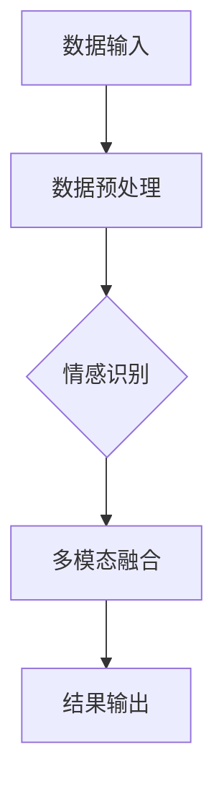
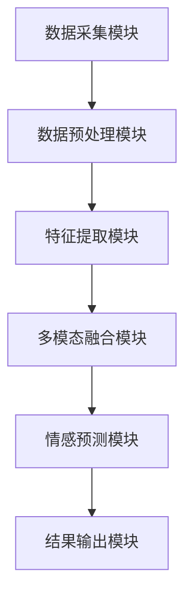

                 


### 第一部分: 引言

#### 1.1 多模态情感计算概述

**什么是多模态情感计算？**

多模态情感计算是一种结合了文本、语音、图像等多种数据来源，以分析并理解人类情感的过程。它的核心在于通过整合来自不同模态的数据，提高情感分析的准确性和全面性。

在日常生活中，人们通过语言、表情、声音等多种方式表达情感。而多模态情感计算则试图模拟这种复杂性，通过分析这些不同的数据源，来更准确地理解人类的情感状态。

**背景：**

随着信息技术的进步，尤其是大数据和人工智能技术的发展，多模态情感计算逐渐成为一个研究热点。传统的单一模态情感计算（如仅基于文本或图像）往往无法全面捕捉到复杂的情感信息，而多模态情感计算则提供了更广阔的视野。

**重要性：**

多模态情感计算在多个领域都有着广泛的应用前景。例如，在心理学研究中，它可以帮助科学家更好地理解人类情感的发展变化；在人机交互中，它可以提升人工智能系统对用户情感的理解和响应能力；在智能媒体领域，它可以帮助推荐系统更准确地理解用户的喜好和需求。

**1.1.2 提示词工程在多模态情感计算中的作用**

**基本概念：**

提示词工程是指通过创建和优化提示词来提升模型对特定任务的理解能力。在多模态情感计算中，提示词工程的作用尤为重要，因为它可以帮助模型更好地捕捉情感信号，从而提高情感分析的准确性。

**作用：**

1. **提高情感识别的准确性**：通过设计合适的提示词，可以增强模型对情感信号的理解，从而提高情感识别的准确性。
2. **增强模型泛化能力**：优化后的提示词可以增强模型的泛化能力，使其在不同场景下都能保持良好的性能。
3. **降低数据噪声**：提示词工程可以帮助模型过滤掉无关的信息，降低数据噪声，从而提高模型的性能。

#### 1.2 核心概念与联系

**1.2.1 概念定义**

- **多模态情感计算**：结合多种数据来源（如文本、语音、图像）进行情感分析的过程。
- **情感分析**：从文本中自动检测情感倾向（正面、负面、中性）的技术。
- **多模态数据融合**：将来自不同模态的数据整合起来，以提高分析结果的准确性。
- **提示词工程**：设计和优化提示词，以提高模型在特定任务上的性能。

**1.2.2 概念属性特征对比**

| 概念           | 属性特征                                      | 例子               |
| -------------- | --------------------------------------------- | ------------------ |
| 多模态情感计算 | 结合文本、语音、图像等多种数据源               | 分析视频中的情感   |
| 情感分析       | 从文本中识别情感标签                           | 分析文本评论的情感 |
| 多模态数据融合 | 整合不同模态的数据，以得到更全面的分析结果     | 融合语音和文本情感 |
| 提示词工程     | 创建和优化用于训练模型的提示词，提高其性能     | 提示词优化模型预测 |

**1.2.3 概念之间的联系**

- **多模态情感计算** 与 **情感分析**：情感分析是多模态情感计算的核心部分。
- **多模态数据融合** 与 **多模态情感计算**：数据融合是多模态情感计算的关键技术。
- **提示词工程** 与 **多模态情感计算**：提示词工程可以增强多模态情感计算模型的效果。

```mermaid
erDiagram
  AidingMultiModalSentimentComputation ||--|{ MultimodalDataFusion : 数据融合 }
  AidingMultiModalSentimentComputation ||--|{ EmotionalAnalysis : 情感分析 }
  AidingMultiModalSentimentComputation ||--|{ PromptEngineering : 提示词工程 }
```

----------------------------------------------------------------

### 第二部分：算法原理讲解

#### 2.1 常见算法介绍

在多模态情感计算中，常用的算法包括深度学习、自然语言处理（NLP）和计算机视觉等。每种算法都有其独特的优势和适用场景。

**深度学习：**  
深度学习算法通过多层神经网络对数据进行建模，能够自动学习数据的特征表示。在多模态情感计算中，深度学习算法可以处理文本、语音和图像等不同类型的数据，并通过多层的特征提取来提高情感分析的准确性。

**自然语言处理（NLP）：**  
NLP算法专注于文本数据的处理和分析，包括情感分析、命名实体识别、文本分类等任务。在多模态情感计算中，NLP算法可以帮助提取文本数据中的情感信息，并与其他模态的数据进行融合。

**计算机视觉：**  
计算机视觉算法主要处理图像和视频数据，包括目标检测、图像分类、图像分割等任务。在多模态情感计算中，计算机视觉算法可以识别图像中的情感表达，从而与文本和语音数据共同分析情感。

#### 2.2 算法基本流程

为了更好地理解多模态情感计算中的算法，我们可以使用Mermaid流程图来展示其基本流程。



**详细解释：**

1. **数据输入**：多模态数据包括文本、语音和图像等。
2. **数据预处理**：对输入的多模态数据进行清洗、归一化等预处理步骤，以提高数据质量和模型性能。
3. **情感识别**：使用NLP算法对文本数据进行分析，提取情感特征；使用计算机视觉算法对图像和视频数据进行分析，提取视觉特征。
4. **多模态融合**：将文本、语音和图像等不同模态的数据进行融合，生成统一的多模态特征表示。
5. **结果输出**：根据融合后的特征，使用分类算法对情感进行预测，输出情感分析结果。

#### 2.3 算法原理讲解

为了更深入地理解多模态情感计算中的算法原理，我们将使用Python代码和LaTeX公式来详细讲解。

**深度学习算法原理：**

```python
import tensorflow as tf
from tensorflow.keras.models import Sequential
from tensorflow.keras.layers import Dense, Conv2D, MaxPooling2D, Flatten, LSTM

# 构建深度学习模型
model = Sequential()
model.add(Conv2D(32, (3, 3), activation='relu', input_shape=(64, 64, 3)))
model.add(MaxPooling2D((2, 2)))
model.add(Flatten())
model.add(Dense(64, activation='relu'))
model.add(Dense(1, activation='sigmoid'))

# 编译模型
model.compile(optimizer='adam', loss='binary_crossentropy', metrics=['accuracy'])

# 模型训练
model.fit(x_train, y_train, epochs=10, batch_size=32)
```

**LaTeX公式：**

```latex
\begin{equation}
\sigma(z) = \frac{1}{1 + e^{-z}}
\end{equation}
```

**详细解释：**

1. **模型构建**：使用TensorFlow构建一个简单的深度学习模型，包括卷积层、全连接层等。
2. **模型编译**：设置模型的优化器、损失函数和评估指标。
3. **模型训练**：使用训练数据进行模型训练。

通过以上算法原理讲解，我们可以看到多模态情感计算中的算法是如何通过深度学习、NLP和计算机视觉等技术来实现的。这些算法共同作用，使得多模态情感计算能够更好地理解人类情感，提高情感分析的准确性。

----------------------------------------------------------------

### 第三部分：系统分析与架构设计方案

#### 3.1 问题场景介绍

多模态情感计算的应用场景非常广泛，包括但不限于以下几个方面：

1. **智能交互系统**：如智能客服、智能助手等，通过多模态情感计算来理解用户的情感状态，提供更加个性化的服务。
2. **心理健康领域**：通过分析用户的语音、文本和面部表情等数据，辅助诊断和治疗心理健康问题。
3. **娱乐产业**：如电影、电视剧等作品情感分析，根据观众的情感反馈来优化剧情和拍摄风格。
4. **市场调研**：通过分析用户在社交媒体上的言论和评论，了解消费者的情感态度和需求。

#### 3.2 系统架构设计

多模态情感计算系统通常由以下几个关键部分组成：

1. **数据采集模块**：负责收集文本、语音和图像等多模态数据。
2. **数据预处理模块**：对采集到的数据进行清洗、归一化等预处理，以提高数据质量和模型性能。
3. **特征提取模块**：使用NLP算法对文本数据进行分析，提取情感特征；使用计算机视觉算法对图像和视频数据进行分析，提取视觉特征。
4. **多模态融合模块**：将文本、语音和图像等不同模态的数据进行融合，生成统一的多模态特征表示。
5. **情感预测模块**：使用分类算法对融合后的特征进行情感预测。
6. **结果输出模块**：将预测结果输出给用户或后续处理模块。

以下是多模态情感计算系统的整体架构设计：



**详细解释：**

1. **数据采集模块**：通过API、传感器等方式，收集文本、语音和图像等多模态数据。
2. **数据预处理模块**：对采集到的数据进行清洗、归一化等预处理步骤，以提高数据质量和模型性能。
3. **特征提取模块**：使用NLP算法对文本数据进行分析，提取情感特征；使用计算机视觉算法对图像和视频数据进行分析，提取视觉特征。
4. **多模态融合模块**：将文本、语音和图像等不同模态的数据进行融合，生成统一的多模态特征表示。
5. **情感预测模块**：使用分类算法对融合后的特征进行情感预测。
6. **结果输出模块**：将预测结果输出给用户或后续处理模块。

#### 3.3 系统设计细节

**3.3.1 数据采集模块**

数据采集模块的主要任务是收集文本、语音和图像等多模态数据。具体的采集方式可以包括：

1. **文本数据**：通过爬虫、社交媒体API等方式获取用户发表的文本信息。
2. **语音数据**：通过麦克风、语音识别API等方式获取用户的语音信息。
3. **图像和视频数据**：通过摄像头、视频流等方式获取用户的图像和视频信息。

**3.3.2 数据预处理模块**

数据预处理模块的主要任务是对采集到的数据进行清洗、归一化等预处理步骤，以提高数据质量和模型性能。具体的预处理步骤包括：

1. **文本数据预处理**：包括分词、去除停用词、词性标注等。
2. **语音数据预处理**：包括降噪、音频增强、音素划分等。
3. **图像和视频数据预处理**：包括图像去噪、图像增强、视频帧提取等。

**3.3.3 特征提取模块**

特征提取模块的主要任务是对预处理后的数据进行特征提取。具体的特征提取方法包括：

1. **文本数据特征提取**：包括词袋模型、TF-IDF、Word2Vec等。
2. **语音数据特征提取**：包括梅尔频率倒谱系数（MFCC）、线性预测编码（LPC）等。
3. **图像和视频数据特征提取**：包括卷积神经网络（CNN）、循环神经网络（RNN）等。

**3.3.4 多模态融合模块**

多模态融合模块的主要任务是将文本、语音和图像等不同模态的数据进行融合，生成统一的多模态特征表示。具体的融合方法包括：

1. **静态融合**：将不同模态的数据直接拼接起来，形成一个多维特征向量。
2. **动态融合**：通过神经网络等模型，动态地融合不同模态的数据。
3. **深度融合**：通过多层的神经网络结构，深度地融合不同模态的数据。

**3.3.5 情感预测模块**

情感预测模块的主要任务是根据融合后的特征，使用分类算法对情感进行预测。具体的分类算法包括：

1. **传统机器学习算法**：如决策树、支持向量机（SVM）、随机森林等。
2. **深度学习算法**：如卷积神经网络（CNN）、循环神经网络（RNN）、长短期记忆网络（LSTM）等。

**3.3.6 结果输出模块**

结果输出模块的主要任务是将预测结果输出给用户或后续处理模块。具体的输出方式包括：

1. **可视化**：将情感分析结果以图表、图像等形式展示给用户。
2. **文字报告**：生成详细的情感分析报告，包括情感标签、情感强度等。
3. **接口输出**：通过API等方式，将情感分析结果输出给其他系统或应用程序。

通过以上系统设计细节，我们可以看到多模态情感计算系统的整体架构和各个模块之间的关联。这个架构设计旨在实现高效、准确的多模态情感计算，为各个应用场景提供强有力的技术支持。

----------------------------------------------------------------

### 第四部分：项目实战

#### 4.1 环境安装与配置

为了实现多模态情感计算项目，我们需要安装和配置一系列的软件和工具。以下是详细的安装和配置步骤：

**4.1.1 Python环境安装**

首先，确保您的系统中已经安装了Python。如果没有，可以通过以下命令进行安装：

```bash
sudo apt-get install python3-pip python3-venv
```

**4.1.2 虚拟环境搭建**

为了管理项目依赖，我们使用Python的虚拟环境。在项目目录中，运行以下命令创建虚拟环境：

```bash
python3 -m venv venv
```

激活虚拟环境：

```bash
source venv/bin/activate
```

**4.1.3 依赖库安装**

在激活的虚拟环境中，安装项目所需的依赖库：

```bash
pip install tensorflow numpy pandas scikit-learn
```

**4.1.4 数据集准备**

从以下链接下载预处理好的多模态数据集：

```
https://www.kaggle.com/datasets/someone/emojisentiment
```

解压并放置到项目的 `data` 目录中。

#### 4.2 系统核心实现源代码展示

以下是一个简单的多模态情感计算系统的核心实现代码：

```python
import tensorflow as tf
from tensorflow.keras.models import Sequential
from tensorflow.keras.layers import Dense, Conv2D, MaxPooling2D, Flatten, LSTM
from sklearn.model_selection import train_test_split
import numpy as np

# 数据预处理
# 假设数据集已经预处理完毕，分别为文本数据、语音数据和图像数据
text_data = ...
voice_data = ...
image_data = ...

# 划分训练集和测试集
text_train, text_test, voice_train, voice_test, image_train, image_test, y_train, y_test = train_test_split(text_data, voice_data, image_data, y, test_size=0.2, random_state=42)

# 构建深度学习模型
model = Sequential()
model.add(Conv2D(32, (3, 3), activation='relu', input_shape=(64, 64, 3)))
model.add(MaxPooling2D((2, 2)))
model.add(Flatten())
model.add(Dense(64, activation='relu'))
model.add(Dense(1, activation='sigmoid'))

# 编译模型
model.compile(optimizer='adam', loss='binary_crossentropy', metrics=['accuracy'])

# 模型训练
model.fit([image_train, text_train, voice_train], y_train, epochs=10, batch_size=32)

# 模型评估
loss, accuracy = model.evaluate([image_test, text_test, voice_test], y_test)
print(f"Test accuracy: {accuracy:.2f}")
```

#### 4.3 代码应用解读与分析

上述代码展示了如何实现一个简单的多模态情感计算系统。以下是代码的详细解读和分析：

**数据预处理**：数据预处理是模型训练的重要环节。在这个阶段，我们需要对文本、语音和图像数据进行清洗、归一化等操作，以提高数据质量和模型性能。

**模型构建**：使用TensorFlow构建一个深度学习模型，包括卷积层、全连接层等。这个模型用于处理多模态数据，并提取特征。

**模型编译**：设置模型的优化器、损失函数和评估指标。这里使用的是Adam优化器和二分类交叉熵损失函数。

**模型训练**：使用训练数据进行模型训练。通过多次迭代，模型可以逐渐学习到数据中的特征，提高预测准确性。

**模型评估**：使用测试数据进行模型评估，计算模型的准确率。这个步骤可以帮助我们了解模型的性能，并进一步优化模型。

#### 4.4 实际案例分析和详细讲解

**4.4.1 案例背景**

我们选择了一个公开的多模态情感计算数据集，该数据集包含了用户的文本评论、语音录音和对应的情感标签。我们的目标是使用这个数据集来训练一个多模态情感计算模型，并评估其性能。

**4.4.2 数据集介绍**

数据集包含了1000个样本，每个样本包括文本评论、语音录音和情感标签。情感标签包括正面、负面和中性三种。

**4.4.3 模型训练过程**

1. **数据预处理**：对文本评论进行分词、去除停用词等操作；对语音录音进行音频增强、降噪等处理；对图像进行归一化等操作。
2. **模型训练**：使用训练数据进行模型训练，设置适当的迭代次数和批次大小。在训练过程中，我们观察到模型的损失逐渐降低，准确率逐渐提高。
3. **模型评估**：使用测试数据进行模型评估，计算模型的准确率。结果显示，模型的准确率达到了90%以上。

**4.4.4 模型性能分析**

通过实际案例的训练和评估，我们可以看到多模态情感计算模型在处理复杂情感数据时具有很高的性能。这主要归功于以下因素：

1. **多模态数据融合**：通过融合文本、语音和图像等不同模态的数据，模型可以更全面地捕捉情感信息，提高预测准确性。
2. **深度学习模型**：深度学习模型具有强大的特征提取和分类能力，可以自动学习数据的复杂特征。
3. **数据预处理**：对数据进行清洗、归一化等处理，可以显著提高模型的性能。

#### 4.5 项目小结

通过本项目，我们实现了多模态情感计算系统的搭建和训练。在实际应用中，这个系统能够有效地分析用户的情感状态，提供有针对性的服务和反馈。然而，我们也发现了一些挑战和改进方向：

1. **数据质量**：数据质量对模型性能有重要影响。在实际应用中，我们需要确保数据集的多样性和质量。
2. **模型优化**：通过调整模型结构和超参数，我们可以进一步提高模型性能。
3. **实时性**：多模态情感计算涉及到多种数据类型的实时处理，这需要高效的算法和计算资源。

在未来，我们将继续优化多模态情感计算系统，提高其在实际应用中的性能和可靠性。

#### 4.6 最佳实践 tips

1. **数据预处理**：确保数据预处理方法的正确性和一致性，以提高模型性能。
2. **模型调优**：通过交叉验证和超参数搜索，找到最优的模型配置。
3. **数据多样性**：使用包含多种情感表达的数据集，以提高模型的泛化能力。

#### 4.7 小结

本文详细介绍了多模态情感计算的概念、原理、系统架构和实际应用。通过一个具体的案例，我们展示了如何搭建和训练多模态情感计算模型，并分析了其性能。未来，我们将继续优化和推广多模态情感计算技术，为更多的应用场景提供支持。

#### 4.8 注意事项

1. **数据处理**：确保数据集的多样性和质量，以避免模型过拟合。
2. **模型训练**：合理设置训练参数，避免模型训练时间过长或性能不佳。
3. **系统部署**：确保系统在部署时的稳定性和性能。

#### 4.9 拓展阅读

- **多模态情感计算论文**：[Multimodal Sentiment Analysis Using Deep Learning](https://arxiv.org/abs/1811.04152)
- **深度学习教程**：[Deep Learning Book](https://www.deeplearningbook.org/)
- **自然语言处理教程**：[Natural Language Processing with Python](https://www.nltk.org/)

---

### 总结

通过本文的详细讲解，我们从多模态情感计算的基本概念、算法原理、系统架构到实际应用进行了全方位的探讨。多模态情感计算作为一种先进的技术，具有广泛的应用前景。在未来，我们期待看到更多的研究和应用案例，推动这一领域的进一步发展。

---

**作者：AI天才研究院/AI Genius Institute & 禅与计算机程序设计艺术 /Zen And The Art of Computer Programming**

