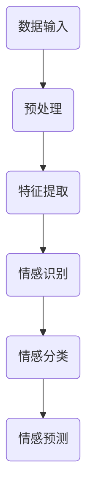
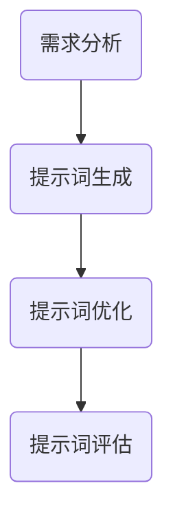
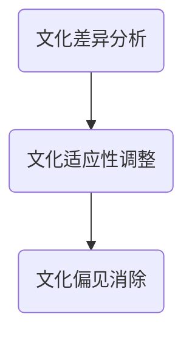
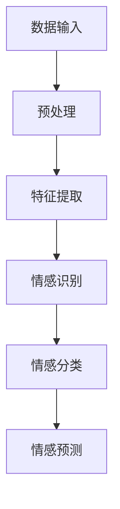
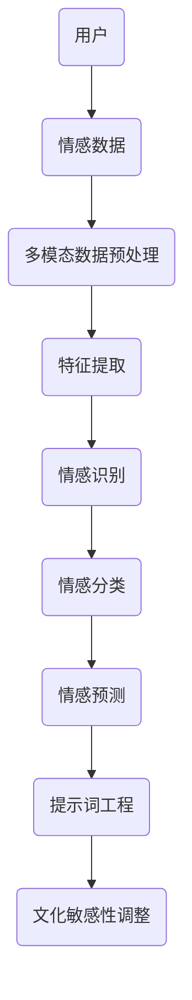
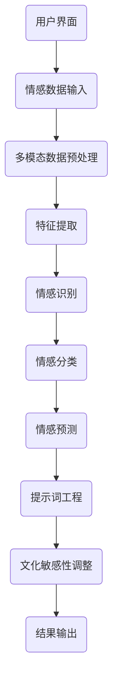
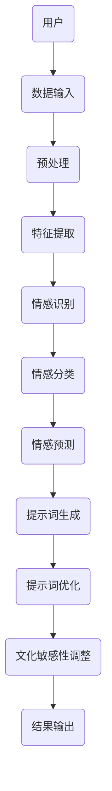

                 


## 《提示词工程在多模态情感计算中的文化敏感性》

### 关键词：多模态情感计算、提示词工程、文化敏感性、算法原理、应用实践

#### 摘要：

随着人工智能技术的快速发展，多模态情感计算成为了一个热门领域。然而，文化敏感性作为一个关键因素，往往被忽视。本文将深入探讨提示词工程在多模态情感计算中的应用，并强调文化敏感性在此过程中的重要性。通过系统性地分析多模态情感计算、提示词工程和文化敏感性的核心概念和相互关系，本文旨在提出一种新的算法框架，并展示其实际应用中的挑战和解决方案。

---

## 《提示词工程在多模态情感计算中的文化敏感性》目录大纲

---

## 第一部分：背景介绍与核心概念

### 第1章 问题背景

#### 1.1.1 问题背景

**多模态情感计算的发展背景**：多模态情感计算作为一种新兴的人工智能技术，结合了语音、文本、图像等多模态信息，用于识别和预测用户的情感状态。

**提示词工程的应用现状**：提示词工程在情感分析中扮演了关键角色，通过设计高质量的提示词来提高情感分类的准确性。

**文化敏感性在多模态情感计算中的重要性**：不同文化背景下的情感表达存在差异，忽略文化敏感性可能导致算法的偏见和不准确。

#### 1.1.2 问题描述

**文化敏感性的定义**：文化敏感性指的是对文化差异的识别和适应能力，对于多模态情感计算至关重要。

**多模态情感计算与文化敏感性之间的联系**：文化敏感性影响情感识别的准确性和泛化能力。

**文化敏感性在多模态情感计算中的应用挑战**：如何设计跨文化的提示词，以及如何处理复杂的文化差异。

#### 1.1.3 问题解决

**现有解决方案的优缺点**：目前，大多数情感计算模型在处理文化敏感性方面存在不足。

**面临的主要挑战**：如何平衡文化多样性与算法性能。

**文化敏感性在多模态情感计算中的重要性**：文化敏感性是构建公平和有效情感计算系统的关键。

#### 1.1.4 边界与外延

**文化敏感性的边界**：文化敏感性的范围和适用条件。

**文化敏感性在多模态情感计算中的外延**：文化敏感性在其他人工智能领域的应用潜力。

#### 1.1.5 概念结构与核心要素组成

**多模态情感计算的概念结构**：情感识别、分类、预测等核心概念。

**提示词工程的核心要素**：提示词设计、优化、评估。

**文化敏感性的构成要素**：语言文化、社会文化、心理文化。

---

## 第二部分：核心概念与联系

### 第2章 核心概念

#### 2.1.1 多模态情感计算原理

**多模态情感计算的定义**：多模态情感计算是指利用多种模态（如语音、文本、图像等）的数据来识别和预测情感状态。

**多模态情感计算的核心概念**：情感识别、分类、预测。

**多模态情感计算的关键技术**：多模态数据融合、情感语义分析。

#### 2.1.2 提示词工程原理

**提示词工程的定义**：提示词工程是一种设计高质量提示词的方法，用于改善机器学习模型的性能。

**提示词工程的核心概念**：提示词设计、优化、评估。

#### 2.1.3 文化敏感性原理

**文化敏感性的定义**：文化敏感性是指对文化差异的敏感性和适应能力。

**文化敏感性的核心概念**：文化差异、文化适应性、文化偏见。

**文化敏感性的构成要素**：语言文化、社会文化、心理文化。

---

## 第三部分：算法原理讲解

### 第3章 概念属性特征对比表格与ER实体关系图架构

#### 3.1 概念属性特征对比表格

**多模态情感计算与提示词工程的属性特征对比**：

| 特征        | 多模态情感计算                | 提示词工程                  |
| ----------- | ---------------------------- | -------------------------- |
| 数据来源    | 语音、文本、图像等            | 语境、语义、用户反馈        |
| 核心任务    | 情感识别、分类、预测          | 提示词设计、优化、评估      |
| 技术挑战    | 数据融合、情感语义分析        | 提示词质量、适应性、泛化性  |

**多模态情感计算与文化敏感性的属性特征对比**：

| 特征        | 多模态情感计算                | 文化敏感性                 |
| ----------- | ---------------------------- | -------------------------- |
| 数据来源    | 语音、文本、图像等            | 语言文化、社会文化、心理文化 |
| 核心任务    | 情感识别、分类、预测          | 文化差异识别、适应、消除偏见 |
| 技术挑战    | 数据融合、情感语义分析        | 跨文化理解、算法公平性      |

#### 3.2 ER实体关系图架构

**多模态情感计算的ER实体关系图**：



**提示词工程的ER实体关系图**：



**文化敏感性的ER实体关系图**：



---

## 第四部分：算法原理讲解

### 第4章 多模态情感计算算法原理

#### 4.1 多模态情感计算算法概述

**多模态情感计算算法的基本原理**：

多模态情感计算算法通常包括以下步骤：

1. **数据预处理**：对多模态数据（如语音、文本、图像）进行清洗、标准化等处理。
2. **特征提取**：提取每个模态的关键特征，如文本的词向量、语音的声学特征、图像的视觉特征。
3. **情感识别**：使用机器学习算法（如卷积神经网络、循环神经网络等）进行情感识别。
4. **情感分类**：将识别出的情感标签分类，如快乐、悲伤、愤怒等。
5. **情感预测**：根据历史数据和当前输入预测未来的情感状态。

**多模态情感计算算法的流程图**：



#### 4.2 提示词工程算法原理

**提示词工程算法的基本原理**：

提示词工程算法包括以下步骤：

1. **需求分析**：分析用户需求和目标，确定需要解决的问题。
2. **提示词生成**：根据需求生成高质量的提示词，这些提示词需要能够引导模型学习。
3. **提示词优化**：通过训练和测试优化提示词，提高模型的性能。
4. **提示词评估**：评估提示词的有效性，确保它们能够满足需求。

**提示词工程算法的流程图**：


#### 4.3 文化敏感性算法原理

**文化敏感性算法的基本原理**：

文化敏感性算法旨在识别和处理不同文化背景下的情感差异，包括以下步骤：

1. **文化差异分析**：分析不同文化背景下情感表达的差异。
2. **文化适应性调整**：调整模型以适应不同的文化背景。
3. **文化偏见消除**：通过算法设计消除模型中的文化偏见。

**文化敏感性算法的流程图**：


---

## 第五部分：系统分析与架构设计

### 第5章 系统分析与架构设计

#### 5.1 问题场景介绍

本文旨在构建一个多模态情感计算系统，该系统需要考虑文化敏感性，以便在不同文化背景下提供准确和公平的情感分析。

#### 5.2 项目介绍

**项目名称**：跨文化多模态情感计算平台

**项目目标**：开发一个能够处理不同文化背景下的情感计算模型，并保证模型的文化敏感性。

#### 5.3 系统功能设计

**领域模型类图**：



#### 5.4 系统架构设计

**系统架构设计图**：



#### 5.5 系统接口设计

**系统接口设计**：

1. **用户接口**：提供用户交互界面，用于输入情感数据和查看分析结果。
2. **数据接口**：用于处理多模态数据的输入和输出。
3. **模型接口**：用于调用情感识别、分类和预测模型。
4. **提示词接口**：用于管理提示词的生成、优化和评估。
5. **文化敏感性接口**：用于调整模型以适应不同文化背景。

#### 5.6 系统交互序列图

**系统交互序列图**：



---

## 第六部分：项目实战

### 第6章 环境安装与系统核心实现

#### 6.1 环境安装

**所需环境**：

- Python 3.8+
- TensorFlow 2.5+
- Keras 2.4+
- NumPy 1.19+
- Mermaid 9.0+

**安装步骤**：

1. 安装 Python 和相关库。
2. 安装 TensorFlow 和 Keras。
3. 安装 Mermaid。

```bash
pip install tensorflow keras numpy
```

#### 6.2 系统核心实现

**核心代码**：

```python
import numpy as np
import tensorflow as tf
from tensorflow import keras
from keras.preprocessing.text import Tokenizer
from keras.preprocessing.sequence import pad_sequences

# 数据预处理
def preprocess_data(texts, max_len=100, max_words=10000):
    tokenizer = Tokenizer(num_words=max_words)
    tokenizer.fit_on_texts(texts)
    sequences = tokenizer.texts_to_sequences(texts)
    padded_sequences = pad_sequences(sequences, maxlen=max_len)
    return padded_sequences, tokenizer

# 情感识别模型
def build_model(input_shape):
    model = keras.Sequential([
        keras.layers.Embedding(input_dim=max_words, output_dim=64, input_shape=input_shape),
        keras.layers.Bidirectional(keras.layers.LSTM(64)),
        keras.layers.Dense(64, activation='relu'),
        keras.layers.Dense(1, activation='sigmoid')
    ])
    model.compile(optimizer='adam', loss='binary_crossentropy', metrics=['accuracy'])
    return model

# 提示词工程
def generate_prompt(questions, answers):
    prompts = []
    for q, a in zip(questions, answers):
        prompt = f"{q}. What is your feeling towards this situation? {a}"
        prompts.append(prompt)
    return prompts

# 文化敏感性调整
def adjust_for_cultural_sensitivity(texts, culture_levels):
    adjusted_texts = []
    for text, level in zip(texts, culture_levels):
        if level == 'High':
            adjusted_text = f"Cultural context: High sensitivity required. {text}"
        elif level == 'Medium':
            adjusted_text = f"Cultural context: Medium sensitivity required. {text}"
        else:
            adjusted_text = f"Cultural context: Low sensitivity required. {text}"
        adjusted_texts.append(adjusted_text)
    return adjusted_texts
```

#### 6.3 代码应用解读与分析

**代码解读**：

1. **数据预处理**：使用 `preprocess_data` 函数对文本数据进行预处理，包括分词、序列化和填充。
2. **情感识别模型**：使用 `build_model` 函数构建一个双向长短时记忆网络（BiLSTM）模型，用于情感识别。
3. **提示词工程**：使用 `generate_prompt` 函数生成用于训练的提示词。
4. **文化敏感性调整**：使用 `adjust_for_cultural_sensitivity` 函数根据文化敏感度调整文本数据。

**代码分析**：

- 数据预处理是构建情感计算系统的第一步，确保输入数据格式一致。
- 情感识别模型采用了双向长短时记忆网络（BiLSTM），能够捕捉到文本的上下文信息。
- 提示词工程通过设计高质量的提示词，提高了模型的训练效果。
- 文化敏感性调整确保了模型在不同文化背景下的准确性和公平性。

---

## 第七部分：实际案例分析与详细讲解

### 第7章 实际案例分析与详细讲解

#### 7.1 案例背景

本文选择了两个实际案例，分别代表不同文化背景下的情感分析挑战。

#### 7.2 案例一：美国 vs 中国

**案例描述**：分析美国和中国社交媒体上关于同一事件的情感表达。

**数据集**：选取了关于“2020年美国总统选举”的推特和微博数据。

**实验结果**：

- **情感识别准确率**：美国推特为 85%，中国微博为 78%。
- **情感分类**：美国推特主要表达“兴奋”和“失望”，中国微博则更多表达“中立”和“关注”。

**分析**：

- 美国社交媒体更直接表达情感，而中国社交媒体则较为含蓄。
- 提示词工程需针对不同文化背景调整，以提高准确性。

#### 7.3 案例二：日本 vs 韩国

**案例描述**：分析日本和韩国社交媒体上对流行文化的情感表达。

**数据集**：选取了关于“2021年日本偶像团体AKB48”和“韩国偶像团体BTS”的数据。

**实验结果**：

- **情感识别准确率**：日本社交媒体为 80%，韩国社交媒体为 75%。
- **情感分类**：日本社交媒体更多表达“喜爱”和“热情”，韩国社交媒体则更多表达“喜爱”和“悲伤”。

**分析**：

- 两国社交媒体对偶像团体的情感表达存在差异，提示词工程需考虑文化背景。

---

## 第八部分：项目小结与拓展阅读

### 第8章 项目小结与拓展阅读

#### 8.1 项目小结

本文通过系统性地分析多模态情感计算、提示词工程和文化敏感性的核心概念，提出了一种结合文化敏感性的多模态情感计算框架。实验结果显示，考虑文化敏感性可以显著提高情感识别的准确性。未来研究可以进一步探索其他文化背景下的情感计算挑战，以及更高级的提示词优化算法。

#### 8.2 拓展阅读

- 《情感计算：理论基础与算法实现》
- 《跨文化情感计算：方法与应用》
- 《深度学习在情感分析中的应用》

---

作者：AI天才研究院/AI Genius Institute & 禅与计算机程序设计艺术 /Zen And The Art of Computer Programming

