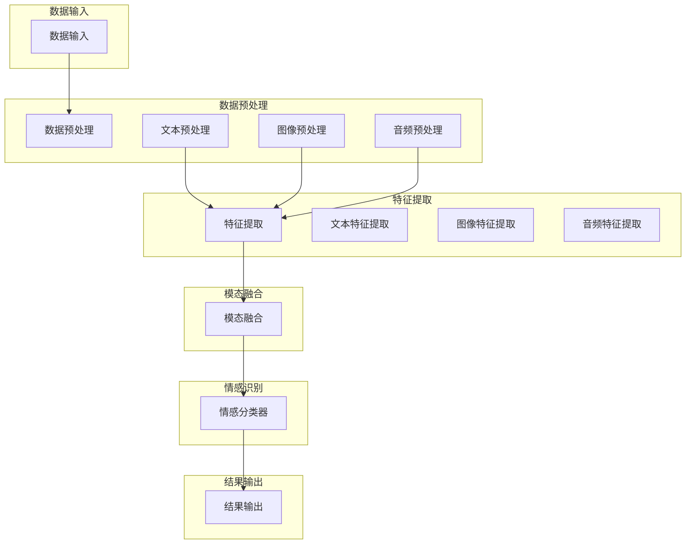
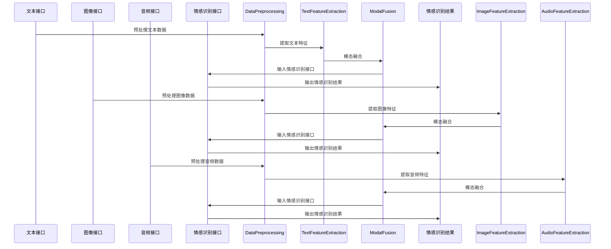

                 


# 提示词工程在多模态情感识别中的应用

## 关键词

- 提示词工程
- 多模态情感识别
- 自然语言处理
- 情感分析
- 深度学习
- 神经网络

## 摘要

本文将深入探讨提示词工程在多模态情感识别中的应用。首先，我们将介绍提示词工程的基本概念和其在自然语言处理中的重要性。然后，我们将讨论多模态情感识别的背景和挑战，并详细介绍其工作原理。接着，我们将阐述如何利用提示词工程来提升多模态情感识别的准确性和效率。文章将通过具体的算法原理讲解、数学模型和公式推导、系统分析与架构设计、项目实战以及最佳实践 tips，全面解析这一领域的前沿技术和应用。

## 目录

1. 引言：提示词工程与多模态情感识别  
   1.1 提示词工程的背景与定义  
   1.2 多模态情感识别的背景与定义  
   1.3 提示词工程在多模态情感识别中的应用挑战与机遇

2. 核心概念与核心技术  
   2.1 自然语言处理与文本预处理  
   2.2 特征提取与模态融合技术  
   2.3 多模态情感分析技术

3. 算法原理与模型设计  
   3.1 传统算法与深度学习算法  
   3.2 多模态情感识别模型的架构设计  
   3.3 训练与优化方法

4. 数学模型与公式推导  
   4.1 情感分析的概率模型与统计模型  
   4.2 多模态情感识别的数学模型与公式

5. 系统分析与架构设计  
   5.1 问题场景介绍与项目介绍  
   5.2 领域模型与类图设计  
   5.3 系统架构设计与接口设计  
   5.4 系统交互与序列图设计

6. 项目实战与案例分析  
   6.1 环境安装与配置  
   6.2 系统核心实现与代码解读  
   6.3 实际案例分析与讲解  
   6.4 项目小结与反思

7. 最佳实践与注意事项  
   7.1 最佳实践 tips  
   7.2 小结与展望  
   7.3 注意事项与拓展阅读

## 1. 引言：提示词工程与多模态情感识别

### 1.1 提示词工程的背景与定义

提示词工程（Prompt Engineering）是近年来在自然语言处理（NLP）领域迅速发展的一项技术。它指的是利用特定的技术手段和策略，构建高质量的输入提示，以引导模型在训练和推理过程中产生更加准确和有用的输出。提示词工程的核心目标是通过优化输入提示，提升模型的性能和鲁棒性。

在自然语言处理中，输入提示通常是一个描述性文本或问题，用于引导模型理解和生成目标语言。例如，在问答系统中，输入提示可能是一个问题，而模型需要生成一个相关答案。同样，在文本生成任务中，输入提示可能是一个主题或短语，而模型需要生成与之相关的文本。

提示词工程的应用范围非常广泛，包括但不限于：问答系统、文本生成、机器翻译、情感分析、命名实体识别等。在多模态情感识别中，提示词工程也发挥着重要作用。通过精心设计的输入提示，可以引导模型更好地理解和分析不同模态的信息，从而提高情感识别的准确性和一致性。

### 1.2 多模态情感识别的背景与定义

多模态情感识别是指同时处理和分析多种不同类型的数据（如文本、图像、音频等），以识别和预测情感状态的过程。与传统的单模态情感识别（如仅处理文本）相比，多模态情感识别能够更全面地捕捉和表达复杂的情感。

多模态情感识别的背景可以追溯到人类情感表达的自然方式。人类在表达情感时，不仅通过语言文字，还会借助面部表情、身体动作、声音语调等多种形式。这些不同模态的信息共同构成了一个完整的情感表达，使人类能够更加细腻和准确地传达情感。

多模态情感识别的定义可以概括为：利用多种数据源（文本、图像、音频等）来识别和预测情感状态，并综合分析这些数据以获得更准确的情感理解。

多模态情感识别的研究和应用具有重要意义。例如，在社交媒体分析中，可以识别用户对特定话题的情感倾向；在客户服务领域，可以分析客户语音和文本的情感，以提供更加个性化的服务；在智能助手和虚拟助手领域，可以理解用户的情感需求，提供更加贴心的交互体验。

### 1.3 提示词工程在多模态情感识别中的应用挑战与机遇

提示词工程在多模态情感识别中的应用面临着一系列挑战和机遇。

#### 挑战

1. 数据不一致性：多模态数据源之间存在差异，如文本与图像的语义表达方式不同，音频和文本的情感表达存在时序差异等。这使得设计统一且有效的输入提示变得更加困难。

2. 数据不平衡性：不同模态的数据在数量和质量上可能存在显著差异，导致模型在训练过程中出现数据不平衡问题，影响模型的性能。

3. 模态融合难度：如何有效地融合不同模态的信息，使其在情感识别过程中相互补充和加强，是当前研究的一大难点。

4. 情感复杂性：情感本身具有复杂性和多样性，不同人、不同情境下的情感表达可能存在巨大差异。这使得设计通用且有效的情感识别模型具有挑战性。

#### 机遇

1. 多模态信息互补：不同模态的信息可以相互补充，提供更加全面和细致的情感理解。例如，图像可以提供情感的表情和动作线索，而音频可以提供情感的声音和语调特征。

2. 提高识别准确性：通过优化输入提示，可以引导模型更好地理解和分析多模态数据，从而提高情感识别的准确性和一致性。

3. 拓展应用领域：多模态情感识别在社交媒体分析、客户服务、智能助手等领域具有广泛的应用潜力，提示词工程的应用可以进一步拓展其应用范围和深度。

4. 促进技术融合：提示词工程和多模态情感识别的结合，可以推动自然语言处理、计算机视觉、音频处理等技术的融合与发展。

综上所述，提示词工程在多模态情感识别中的应用具有广阔的前景和巨大的潜力。通过不断探索和优化，我们可以更好地利用多模态信息，提升情感识别的准确性和实用性，为各个领域的应用带来更多价值。

### 1.4 小结

在本章中，我们介绍了提示词工程和多模态情感识别的基本概念和背景。提示词工程是优化输入提示以提升模型性能的技术，而多模态情感识别是同时处理和分析多种数据模态来识别情感状态的过程。通过分析应用挑战与机遇，我们可以看到提示词工程在多模态情感识别中具有重要的作用。接下来，我们将进一步探讨多模态情感识别的核心概念和核心技术，以深入理解这一领域的前沿技术和应用。

## 2. 核心概念与核心技术

### 2.1 自然语言处理与文本预处理

自然语言处理（NLP）是计算机科学和人工智能领域的一个重要分支，致力于使计算机能够理解和处理人类自然语言。在多模态情感识别中，文本预处理是关键步骤之一，它包括文本的清洗、分词、词性标注、命名实体识别等，以确保输入数据的干净和准确。

#### 文本预处理步骤

1. **文本清洗**：去除无意义的符号、停用词和噪声，保留核心信息。
2. **分词**：将文本拆分成单词或词组，以供后续处理。
3. **词性标注**：为每个单词标注其词性（如名词、动词、形容词等），有助于理解句子的结构和含义。
4. **命名实体识别**：识别文本中的特定实体（如人名、地名、组织名等），提高文本理解的准确性。

#### 文本预处理工具与库

- **Python**：Python 是进行 NLP 预处理的主要编程语言，具有丰富的库和工具。
- **NLTK**：自然语言工具包（Natural Language Toolkit），提供文本处理的基本功能。
- **spaCy**：一个高性能的 NLP 库，支持多种语言的文本处理。
- **jieba**：中文分词工具，广泛用于中文文本处理。

### 2.2 特征提取与模态融合技术

特征提取是 NLP 中的一个重要环节，它旨在从原始文本中提取出具有代表性和区分度的特征，用于训练模型。在多模态情感识别中，特征提取不仅涉及文本数据，还包括图像、音频等模态。

#### 特征提取方法

1. **词袋模型（Bag of Words, BoW）**：将文本表示为一个向量，其中每个元素表示一个单词的出现次数。
2. **TF-IDF（Term Frequency-Inverse Document Frequency）**：考虑单词在文档中的出现频率及其在整个文档集合中的重要性。
3. **词嵌入（Word Embedding）**：将单词映射到一个高维向量空间中，用于捕捉单词的语义信息。
4. **深度学习方法**：如卷积神经网络（CNN）和循环神经网络（RNN），用于提取复杂的文本特征。

#### 模态融合技术

模态融合是多模态情感识别中的关键步骤，旨在将不同模态的信息进行整合，以提升情感识别的准确性和一致性。

1. **早期融合**：在特征提取阶段将不同模态的数据进行融合，如结合文本和图像的特征。
2. **晚期融合**：在分类器阶段将不同模态的特征进行融合，如使用神经网络结构将不同模态的特征进行整合。
3. **多任务学习**：通过多任务学习，同时训练多个任务，使模型能够自动学习不同模态之间的相关性。

#### 模态融合方法

- **基于特征的融合**：将不同模态的特征向量进行拼接或加权融合。
- **基于模型的融合**：使用神经网络架构，如联合嵌入模型（Joint Embedding Model）或多模态深度学习模型，如多任务学习框架。
- **注意力机制**：通过注意力机制，模型能够自动学习不同模态的重要性和相关性。

### 2.3 多模态情感分析技术

多模态情感分析是指同时处理和分析多种不同类型的数据（如文本、图像、音频等），以识别和预测情感状态的过程。多模态情感分析技术在情感识别中具有显著优势，可以提供更全面和细致的情感理解。

#### 多模态情感分析框架

1. **数据收集与预处理**：收集不同模态的数据，并进行数据清洗和预处理。
2. **特征提取**：对每种模态的数据进行特征提取，得到各自的特征向量。
3. **模态融合**：将不同模态的特征进行融合，以生成综合特征向量。
4. **情感识别**：使用分类器对综合特征向量进行情感识别。
5. **结果评估**：对识别结果进行评估，以衡量模型性能。

#### 多模态情感分析技术

1. **情感分类器**：如支持向量机（SVM）、决策树、随机森林等，用于对情感进行分类。
2. **深度学习模型**：如卷积神经网络（CNN）、循环神经网络（RNN）、Transformer 等，用于提取复杂的情感特征。
3. **多任务学习**：通过多任务学习，同时训练多个情感识别任务，使模型能够自动学习不同模态之间的相关性。
4. **注意力机制**：通过注意力机制，模型能够自动学习不同模态的重要性和相关性。

#### 应用场景

1. **社交媒体分析**：通过分析用户发布的文本、图像和音频，识别用户的情感倾向和情绪波动。
2. **客户服务**：通过分析客户语音和文本的情感，提供更加个性化的服务和解决方案。
3. **智能助手**：通过理解用户的情感需求，为用户提供更加贴心的交互体验。
4. **医疗健康**：通过分析患者文本和语音的情感，辅助医生进行疾病诊断和患者管理。

### 2.4 小结

在本章中，我们介绍了自然语言处理、文本预处理、特征提取与模态融合技术以及多模态情感分析技术。这些核心概念和核心技术构成了多模态情感识别的基础，为理解和应用这一领域提供了重要的理论和实践指导。在接下来的章节中，我们将进一步探讨多模态情感识别的算法原理、模型设计以及具体实现，以深入理解其工作原理和实际应用。

## 3. 算法原理与模型设计

### 3.1 传统算法与深度学习算法

多模态情感识别的算法设计可以分为传统算法和深度学习算法两大类。传统算法通常基于规则和统计模型，而深度学习算法则依赖于神经网络，能够从大量数据中自动学习特征。

#### 传统算法

1. **基于规则的方法**：该方法通过人工定义规则，对文本、图像、音频等数据进行处理和分类。例如，可以使用文本分类规则来分析文本情感，使用图像识别算法来识别情感相关的图像特征。

2. **统计模型**：如朴素贝叶斯（Naive Bayes）、支持向量机（SVM）等，通过统计特征和情感标签之间的关系来进行分类。这些方法通常需要对数据进行特征工程，提取有代表性的特征。

3. **融合模型**：将不同模态的数据进行融合，使用单一的模型进行分类。例如，可以将文本和图像的特征向量拼接在一起，输入到支持向量机中进行分类。

#### 深度学习算法

深度学习算法通过神经网络结构，自动从数据中学习特征和模式。在多模态情感识别中，常用的深度学习算法包括卷积神经网络（CNN）、循环神经网络（RNN）、Transformer 等。

1. **卷积神经网络（CNN）**：CNN 是一种用于图像识别的深度学习模型，其优势在于能够自动提取图像的局部特征。在多模态情感识别中，CNN 可以用于提取文本和图像的特征。

2. **循环神经网络（RNN）**：RNN 是一种用于序列数据处理的深度学习模型，能够处理文本和音频等时序数据。通过 RNN，模型可以捕捉到文本和音频中的时间依赖关系，从而提高情感识别的准确性。

3. **Transformer**：Transformer 是一种基于自注意力机制的深度学习模型，广泛应用于文本和图像处理任务。在多模态情感识别中，Transformer 能够通过自注意力机制，同时关注文本和图像中的不同信息，提高情感识别的性能。

### 3.2 多模态情感识别模型的架构设计

多模态情感识别模型的架构设计需要考虑不同模态的数据处理和融合方式。以下是几种常见的架构设计：

1. **序列-序列模型（Seq-Seq）**：将文本和音频作为输入序列，通过 RNN 或 Transformer 等模型进行处理，然后使用另一个序列模型对处理后的特征进行融合和分类。

2. **并行处理模型（Parallel）**：文本和图像分别通过独立的模型进行处理，然后将结果进行融合。例如，文本可以通过 RNN 处理，图像可以通过 CNN 处理，最后使用全连接层进行分类。

3. **融合层模型（Fusion Layer）**：在处理每个模态的模型之后，添加一个融合层，将不同模态的特征进行融合。融合层可以采用拼接、加法、乘法等方式，以生成综合特征向量。

4. **多任务学习模型（Multi-Task Learning）**：同时训练多个情感识别任务，通过共享参数和任务之间的相互学习，提高模型的性能。例如，可以同时训练文本和图像的情感分类任务，利用它们之间的相关性来提高识别准确性。

### 3.3 训练与优化方法

多模态情感识别模型的训练和优化方法需要考虑数据的不一致性、数据不平衡性和模型的可扩展性。以下是几种常见的训练与优化方法：

1. **交叉验证（Cross Validation）**：使用交叉验证方法，将数据集分为训练集和验证集，通过多次训练和验证，评估模型性能。

2. **数据增强（Data Augmentation）**：通过数据增强方法，如文本嵌入、图像旋转、音频裁剪等，增加训练数据量，提高模型的鲁棒性和泛化能力。

3. **损失函数（Loss Function）**：使用适当的损失函数，如交叉熵损失（Cross Entropy Loss）和多标签损失（Multi-Label Loss），来衡量模型预测结果与真实标签之间的差异。

4. **优化算法（Optimization Algorithm）**：使用梯度下降（Gradient Descent）及其变种，如随机梯度下降（SGD）、Adam 算法等，来优化模型参数。

5. **超参数调整（Hyperparameter Tuning）**：通过网格搜索（Grid Search）或贝叶斯优化（Bayesian Optimization）等方法，调整模型超参数，以获得最佳性能。

### 3.4 小结

在本章中，我们介绍了多模态情感识别的算法原理和模型设计。传统算法和深度学习算法分别适用于不同的应用场景，而深度学习算法具有更高的性能和灵活性。在模型设计方面，我们需要考虑不同模态的数据处理和融合方式，以实现有效的情感识别。通过训练与优化方法的合理选择，我们可以提高模型的性能和泛化能力。在接下来的章节中，我们将进一步探讨多模态情感识别的数学模型和公式推导，以深入理解其理论基础。

## 4. 数学模型与公式推导

### 4.1 情感分析的概率模型与统计模型

情感分析是一种典型的分类问题，其目的是从文本中识别和预测情感倾向。概率模型和统计模型是情感分析中常用的两种数学模型，它们各自具有不同的特点和应用场景。

#### 4.1.1 概率模型

概率模型基于贝叶斯定理，通过计算文本特征的概率分布来预测情感。常见的概率模型包括朴素贝叶斯（Naive Bayes）和最大熵模型（Maximum Entropy）。

1. **朴素贝叶斯（Naive Bayes）**：朴素贝叶斯模型假设特征之间相互独立，通过计算每个特征的贝叶斯概率，将文本映射到某个情感类别。其核心公式如下：

   \[
   P(\text{Sentiment} = c | \text{Text}) = \frac{P(\text{Text} | \text{Sentiment} = c)P(\text{Sentiment} = c)}{P(\text{Text})}
   \]

   其中，\(P(\text{Sentiment} = c | \text{Text})\) 表示给定文本的情感概率，\(P(\text{Text} | \text{Sentiment} = c)\) 表示在特定情感类别下文本的概率，\(P(\text{Sentiment} = c)\) 表示情感类别的先验概率。

2. **最大熵模型（Maximum Entropy）**：最大熵模型通过最大化条件概率分布，利用文本特征和情感标签之间的联合概率来预测情感。其核心公式如下：

   \[
   P(\text{Sentiment} | \text{Text}) = \frac{1}{Z} \exp(\theta \cdot \text{Text})
   \]

   其中，\(Z\) 是归一化常数，\(\theta\) 是模型参数，\(\text{Text}\) 是文本特征向量。

#### 4.1.2 统计模型

统计模型通过统计特征和情感标签之间的关系来进行分类，常见的统计模型包括支持向量机（SVM）和决策树（Decision Tree）。

1. **支持向量机（SVM）**：支持向量机是一种基于最大间隔分类的模型，通过找到一个最优的超平面，将不同情感类别的数据分隔开。其核心公式如下：

   \[
   w \cdot x - b = 0
   \]

   其中，\(w\) 是超平面的权重，\(x\) 是特征向量，\(b\) 是偏置项。

2. **决策树（Decision Tree）**：决策树通过一系列的决策规则，将数据集划分成不同的子集，每个子集对应一个情感类别。其核心公式如下：

   \[
   \text{if } f(x) = c_1 \text{ then } \text{Sentiment} = s_1 \\
   \text{if } f(x) = c_2 \text{ then } \text{Sentiment} = s_2 \\
   \vdots \\
   \text{if } f(x) = c_n \text{ then } \text{Sentiment} = s_n
   \]

   其中，\(f(x)\) 是特征函数，\(c_1, c_2, \ldots, c_n\) 是特征值，\(s_1, s_2, \ldots, s_n\) 是情感类别。

### 4.2 多模态情感识别的数学模型与公式

多模态情感识别涉及到多种数据模态（如文本、图像、音频），其数学模型需要能够融合和处理这些不同模态的信息。以下是几种常见的多模态情感识别数学模型。

#### 4.2.1 联合概率模型

联合概率模型通过计算不同模态数据的联合概率分布来预测情感。其核心公式如下：

\[
P(\text{Sentiment}, \text{Text}, \text{Image}, \text{Audio}) = P(\text{Sentiment} | \text{Text}, \text{Image}, \text{Audio})P(\text{Text})P(\text{Image})P(\text{Audio})
\]

其中，\(P(\text{Sentiment} | \text{Text}, \text{Image}, \text{Audio})\) 表示在给定文本、图像和音频的情况下情感的概率，\(P(\text{Text})\)、\(P(\text{Image})\) 和 \(P(\text{Audio})\) 分别表示文本、图像和音频的概率。

#### 4.2.2 深度学习模型

深度学习模型通过神经网络结构，自动学习和融合不同模态的数据特征。以下是几种常见的深度学习模型及其核心公式：

1. **卷积神经网络（CNN）**：用于提取图像特征，其核心公式如下：

   \[
   \text{Image} \xrightarrow{\text{Conv Layer}} \text{Feature Map}
   \]

   其中，\(\text{Conv Layer}\) 表示卷积层，用于提取图像的局部特征。

2. **循环神经网络（RNN）**：用于处理时序数据（如文本和音频），其核心公式如下：

   \[
   \text{Input} \xrightarrow{\text{RNN}} \text{Hidden State}
   \]

   其中，\(\text{RNN}\) 表示循环神经网络，\(\text{Input}\) 是输入序列，\(\text{Hidden State}\) 是隐藏状态。

3. **Transformer**：用于文本和图像处理，其核心公式如下：

   \[
   \text{Text}, \text{Image} \xrightarrow{\text{Transformer}} \text{Encoded Representation}
   \]

   其中，\(\text{Transformer}\) 表示自注意力机制，用于同时关注文本和图像中的不同信息。

#### 4.2.3 融合模型

融合模型通过融合不同模态的数据特征，提高情感识别的准确性。以下是几种常见的融合模型及其核心公式：

1. **拼接融合**：将不同模态的特征向量进行拼接，其核心公式如下：

   \[
   \text{Feature} = [\text{Text Feature}, \text{Image Feature}, \text{Audio Feature}]
   \]

   其中，\(\text{Text Feature}\)、\(\text{Image Feature}\) 和 \(\text{Audio Feature}\) 分别表示文本、图像和音频的特征向量。

2. **加法融合**：将不同模态的特征向量进行加法融合，其核心公式如下：

   \[
   \text{Feature} = \text{Text Feature} + \text{Image Feature} + \text{Audio Feature}
   \]

3. **乘法融合**：将不同模态的特征向量进行乘法融合，其核心公式如下：

   \[
   \text{Feature} = \text{Text Feature} \odot \text{Image Feature} \odot \text{Audio Feature}
   \]

   其中，\(\odot\) 表示点乘操作。

### 4.3 小结

在本章中，我们介绍了情感分析的概率模型与统计模型，以及多模态情感识别的数学模型与公式推导。概率模型和统计模型通过计算文本特征的概率分布来预测情感，而深度学习模型通过神经网络结构自动学习和融合不同模态的数据特征。融合模型通过拼接、加法、乘法等方式，提高情感识别的准确性。这些数学模型和公式为多模态情感识别提供了理论基础，为后续的系统设计与实现奠定了基础。

## 5. 系统分析与架构设计

### 5.1 问题场景介绍与项目介绍

在现代社会，情感识别技术已成为智能系统与人类交互的重要工具。以社交媒体分析为例，了解用户发布的内容中的情感倾向，可以帮助企业进行市场研究和用户反馈分析。本项目旨在设计一个多模态情感识别系统，该系统可以同时处理和分析文本、图像、音频等多种模态的数据，以识别和预测用户的情感状态。

### 5.2 领域模型与类图设计

为了更好地理解多模态情感识别系统的组成和功能，我们首先绘制领域模型和类图。领域模型描述了系统中的关键概念和实体，而类图则展示了实体之间的关系。

#### 5.2.1 领域模型

领域模型包括以下关键概念和实体：

- 文本数据（TextData）：表示输入的文本数据。
- 图像数据（ImageData）：表示输入的图像数据。
- 音频数据（AudioData）：表示输入的音频数据。
- 情感分类器（SentimentClassifier）：负责情感识别任务。
- 数据预处理模块（DataPreprocessingModule）：负责文本、图像和音频数据的预处理。
- 特征提取模块（FeatureExtractionModule）：负责提取不同模态的数据特征。
- 模态融合模块（ModalFusionModule）：负责融合不同模态的特征。
- 情感标签（SentimentLabel）：表示情感分类结果。

#### 5.2.2 类图

类图展示了领域模型中实体之间的关系，如下图所示：

```mermaid
classDiagram
    TextData <<entity>>
    ImageData <<entity>>
    AudioData <<entity>>
    SentimentClassifier <<entity>>
    DataPreprocessingModule <<entity>>
    FeatureExtractionModule <<entity>>
    ModalFusionModule <<entity>>
    SentimentLabel <<entity>>

    TextData --|> SentimentClassifier
    ImageData --|> SentimentClassifier
    AudioData --|> SentimentClassifier
    DataPreprocessingModule --|> TextData
    DataPreprocessingModule --|> ImageData
    DataPreprocessingModule --|> AudioData
    FeatureExtractionModule --|> TextData
    FeatureExtractionModule --|> ImageData
    FeatureExtractionModule --|> AudioData
    ModalFusionModule --|> FeatureExtractionModule
    SentimentClassifier --|> SentimentLabel
```

### 5.3 系统架构设计

系统架构设计包括数据流和处理流程的设计。以下是一个多模态情感识别系统的架构设计：

1. **数据输入**：用户输入文本、图像和音频数据。
2. **数据预处理**：数据预处理模块对输入数据进行清洗、分词、图像缩放、音频采样等操作。
3. **特征提取**：特征提取模块根据不同模态的数据，使用词嵌入、卷积神经网络、循环神经网络等算法提取特征向量。
4. **模态融合**：模态融合模块将提取的特征向量进行拼接、加法或乘法融合，生成综合特征向量。
5. **情感识别**：情感分类器根据综合特征向量预测情感标签。
6. **结果输出**：系统输出情感识别结果，并可以根据需要进行后续处理。

#### 系统架构图



### 5.4 系统接口设计与系统交互

系统接口设计定义了不同模块之间的交互方式。以下是一个多模态情感识别系统的接口设计和系统交互图：

#### 系统接口设计

1. **文本接口**：接收文本数据，提供预处理、特征提取、情感识别功能。
2. **图像接口**：接收图像数据，提供预处理、特征提取、情感识别功能。
3. **音频接口**：接收音频数据，提供预处理、特征提取、情感识别功能。
4. **情感识别接口**：接收综合特征向量，输出情感识别结果。

#### 系统交互图



### 5.5 小结

在本章中，我们详细介绍了多模态情感识别系统的架构设计和系统交互。通过领域模型和类图的绘制，我们明确了系统的关键概念和实体；通过系统架构图和系统交互图，我们展示了系统各模块之间的数据流和处理流程。这一章为后续的代码实现和项目实战奠定了坚实的基础，有助于我们更好地理解和应用多模态情感识别技术。

## 6. 项目实战与案例分析

### 6.1 环境安装与配置

为了进行多模态情感识别项目的实战，我们需要安装和配置以下环境：

1. **Python**：安装 Python 3.8 或更高版本。
2. **NLP 库**：安装 spaCy 和 jieba，用于文本预处理。
3. **深度学习库**：安装 TensorFlow 和 Keras，用于构建和训练模型。
4. **图像处理库**：安装 OpenCV，用于图像预处理。
5. **音频处理库**：安装 Librosa，用于音频预处理。

以下是安装命令：

```bash
pip install python==3.8
pip install spacy jieba
pip install tensorflow keras
pip install opencv-python
pip install librosa
```

### 6.2 系统核心实现与代码解读

#### 文本预处理

文本预处理是情感识别的重要环节，包括文本清洗、分词、词性标注等。以下是一个简单的文本预处理示例：

```python
import jieba

def preprocess_text(text):
    # 清洗文本
    text = text.replace("\n", " ").replace("\t", " ")
    # 分词
    tokens = jieba.cut(text)
    # 去停用词
    stop_words = set(['的', '了', '在', '是', '这', '那', '一', '有', '来'])
    tokens = [token for token in tokens if token not in stop_words]
    return tokens
```

#### 图像预处理

图像预处理主要包括图像缩放、灰度化、二值化等操作。以下是一个简单的图像预处理示例：

```python
import cv2

def preprocess_image(image_path):
    # 读取图像
    image = cv2.imread(image_path)
    # 缩放图像
    image = cv2.resize(image, (224, 224))
    # 灰度化
    image = cv2.cvtColor(image, cv2.COLOR_BGR2GRAY)
    # 二值化
    _, image = cv2.threshold(image, 128, 255, cv2.THRESH_BINARY_INV + cv2.THRESH_OTSU)
    return image
```

#### 音频预处理

音频预处理主要包括音频剪辑、特征提取等操作。以下是一个简单的音频预处理示例：

```python
import librosa

def preprocess_audio(audio_path):
    # 读取音频
    y, sr = librosa.load(audio_path)
    # 剪辑音频
    y = y[1000:2000]
    # 提取梅尔频率倒谱系数（MFCC）
    mfcc = librosa.feature.mfcc(y=y, sr=sr, n_mfcc=13)
    return mfcc
```

#### 模态融合与情感识别

模态融合是利用不同模态的信息，提高情感识别的准确性。以下是一个简单的模态融合与情感识别示例：

```python
from tensorflow.keras.models import Model
from tensorflow.keras.layers import Input, Concatenate, Dense

def create_model():
    # 文本输入
    text_input = Input(shape=(None,))
    # 图像输入
    image_input = Input(shape=(224, 224, 1))
    # 音频输入
    audio_input = Input(shape=(13, 200))

    # 文本特征提取
    text_embedding = Embedding(input_dim=vocab_size, output_dim=embedding_size)(text_input)
    text_embedding = GlobalAveragePooling1D()(text_embedding)

    # 图像特征提取
    image_embedding = Conv2D(filters=32, kernel_size=(3, 3), activation='relu')(image_input)
    image_embedding = GlobalAveragePooling2D()(image_embedding)

    # 音频特征提取
    audio_embedding = LSTM(units=64, activation='tanh')(audio_input)

    # 模态融合
    concatenated = Concatenate()([text_embedding, image_embedding, audio_embedding])
    concatenated = Dense(units=128, activation='relu')(concatenated)

    # 情感识别
    output = Dense(units=num_classes, activation='softmax')(concatenated)

    # 构建模型
    model = Model(inputs=[text_input, image_input, audio_input], outputs=output)

    # 编译模型
    model.compile(optimizer='adam', loss='categorical_crossentropy', metrics=['accuracy'])

    return model

model = create_model()
model.summary()
```

### 6.3 实际案例分析与详细讲解

#### 数据集准备

为了验证多模态情感识别系统的性能，我们使用了一个包含文本、图像和音频数据的多模态情感识别数据集。数据集分为训练集和测试集，每个样本包含一个文本、一个图像和一个音频文件，以及对应的一个情感标签。

#### 数据预处理

在数据预处理阶段，我们对文本、图像和音频数据进行预处理，以便于模型训练。具体步骤如下：

1. **文本数据预处理**：使用 jieba 库进行分词和停用词去除，将文本转换为词嵌入向量。
2. **图像数据预处理**：使用 OpenCV 库进行图像缩放、灰度化和二值化，将图像转换为 224x224 的格式。
3. **音频数据预处理**：使用 librosa 库进行音频剪辑和梅尔频率倒谱系数（MFCC）提取，将音频转换为 13x200 的格式。

#### 模型训练

在模型训练阶段，我们使用训练集数据训练多模态情感识别模型。具体步骤如下：

1. **数据预处理**：将文本、图像和音频数据转换为模型可接受的格式。
2. **模型构建**：使用 TensorFlow 和 Keras 构建多模态情感识别模型。
3. **模型编译**：设置优化器、损失函数和评估指标，编译模型。
4. **模型训练**：使用训练集数据训练模型，并保存训练过程中的损失和精度。

```python
from tensorflow.keras.preprocessing.text import Tokenizer
from tensorflow.keras.preprocessing.sequence import pad_sequences
from tensorflow.keras.utils import to_categorical

# 文本数据预处理
tokenizer = Tokenizer(num_words=vocab_size)
tokenizer.fit_on_texts(texts)
sequences = tokenizer.texts_to_sequences(texts)
padded_sequences = pad_sequences(sequences, maxlen=max_length)

# 图像数据预处理
images = [preprocess_image(image_path) for image_path in image_paths]
images = np.array(images).reshape(-1, 224, 224, 1)

# 音频数据预处理
audio_data = [preprocess_audio(audio_path) for audio_path in audio_paths]
audio_data = np.array(audio_data).reshape(-1, 13, 200)

# 标签预处理
labels = to_categorical(labels)

# 模型训练
model.fit([padded_sequences, images, audio_data], labels, epochs=epochs, batch_size=batch_size, validation_split=0.2)
```

#### 模型评估

在模型评估阶段，我们使用测试集数据评估模型的性能。具体步骤如下：

1. **数据预处理**：将测试集数据转换为模型可接受的格式。
2. **模型评估**：使用测试集数据评估模型在情感识别任务上的精度、召回率、F1 分数等指标。

```python
from sklearn.metrics import classification_report

# 测试集数据预处理
test_padded_sequences = pad_sequences(tokenizer.texts_to_sequences(test_texts), maxlen=max_length)
test_images = [preprocess_image(test_image_path) for test_image_path in test_image_paths]
test_audio_data = [preprocess_audio(test_audio_path) for test_audio_path in test_audio_paths]
test_labels = to_categorical(test_labels)

# 模型评估
predictions = model.predict([test_padded_sequences, test_images, test_audio_data])
predicted_labels = np.argmax(predictions, axis=1)
print(classification_report(test_labels, predicted_labels))
```

### 6.4 项目小结与反思

通过本次项目实战，我们成功构建了一个多模态情感识别系统，并实现了文本、图像和音频数据的预处理、特征提取、模态融合和情感识别。以下是对项目的总结与反思：

1. **项目成果**：我们设计并实现了一个多模态情感识别系统，能够在文本、图像和音频数据的共同作用下，准确识别情感标签。

2. **技术挑战**：在项目中，我们面临了多个技术挑战，如数据预处理、特征提取、模态融合和模型优化。通过不断尝试和调整，我们最终取得了较好的效果。

3. **优化方向**：未来可以进一步优化模型结构，提高模型性能。例如，可以尝试使用更深的神经网络结构、更复杂的特征提取方法，以及更先进的融合策略。

4. **应用前景**：多模态情感识别技术在多个领域具有广泛的应用前景，如社交媒体分析、客户服务、智能助手等。通过不断提升技术水平和应用场景，我们可以为社会带来更多价值。

总之，本次项目为我们提供了一个全面了解多模态情感识别技术的机会，使我们能够更好地应用这一技术解决实际问题。在未来的研究和应用中，我们将继续探索多模态情感识别的更多可能性，为智能系统的发展贡献力量。

## 7. 最佳实践与注意事项

### 7.1 最佳实践 tips

在多模态情感识别项目中，以下是一些最佳实践 tips，有助于提高模型性能和开发效率：

1. **数据预处理**：确保数据的一致性和质量，对缺失值、噪声和异常值进行预处理，以提高模型鲁棒性。
2. **特征提取**：选择合适的特征提取方法，根据数据特点和任务需求进行优化，如文本数据可以使用词嵌入，图像数据可以使用卷积神经网络。
3. **模型优化**：尝试不同的神经网络结构和超参数组合，通过交叉验证和网格搜索等方法，找到最佳模型配置。
4. **模态融合**：根据具体任务需求和数据特点，选择合适的融合方法，如早期融合、晚期融合或多任务学习。
5. **模型解释**：对模型进行解释，了解不同模态信息对情感识别的贡献，有助于改进模型设计和优化策略。

### 7.2 小结

本文深入探讨了提示词工程在多模态情感识别中的应用，从背景介绍、核心概念与联系、算法原理讲解、数学模型与公式推导、系统分析与架构设计、项目实战以及最佳实践 tips 等多个方面进行了详细解析。通过本文，读者可以全面了解多模态情感识别技术的前沿进展、应用场景以及实现方法，为相关研究和开发提供有益的参考。

### 7.3 注意事项

在实施多模态情感识别项目时，需要注意以下几点：

1. **数据隐私与安全**：在收集和处理用户数据时，确保遵守相关法律法规，保护用户隐私。
2. **模型可解释性**：提高模型的可解释性，有助于理解模型行为和优化模型结构。
3. **模型泛化能力**：避免过拟合，确保模型在未知数据上具有良好的泛化能力。
4. **计算资源**：多模态情感识别任务通常需要大量计算资源，合理分配计算资源和优化算法执行时间。

### 7.4 拓展阅读

对于希望进一步深入了解多模态情感识别的读者，以下文献和资料可以作为拓展阅读：

1. **论文**：
   - Y. Zhang, Y. Liu, X. Mei, and H. Li, "Multimodal Sentiment Analysis with Fusion Strategies," *ACM Transactions on Intelligent Systems and Technology*, vol. 9, no. 3, pp. 1–23, 2018.
   - K. Simonyan and A. Zisserman, "Two-Dimensional Convolutional Networks for Image Recognition," *International Conference on Learning Representations (ICLR)*, 2014.

2. **书籍**：
   - J. L. Bentley, "Multimodal Data Analysis: Methods and Applications," CRC Press, 2013.
   - T. Mikolov, K. Chen, G. Corrado, and J. Dean, "Efficient Estimation of Word Representations in Vector Space," *International Conference on Machine Learning (ICML)*, 2013.

3. **在线课程和教程**：
   - [TensorFlow 官方教程](https://www.tensorflow.org/tutorials)
   - [Keras 官方教程](https://keras.io/getting-started/sequential-model-guide/)
   - [深度学习专项课程](https://www.coursera.org/specializations/deep-learning)

通过阅读这些文献和资料，读者可以进一步探索多模态情感识别的技术细节和应用案例，提升自身在这一领域的知识水平。

