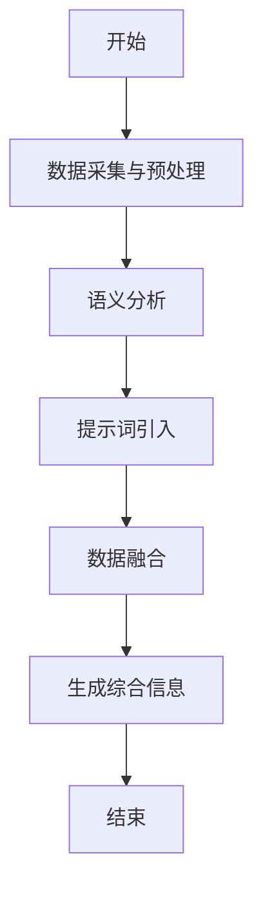
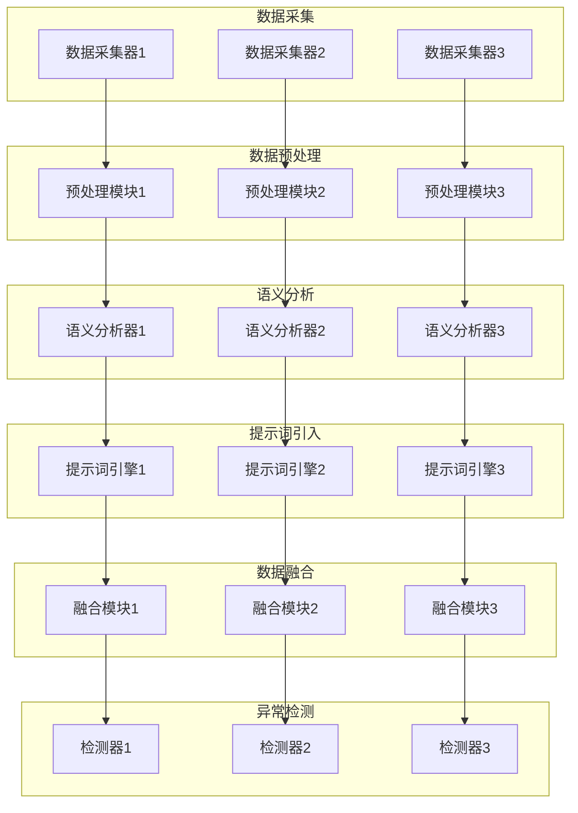
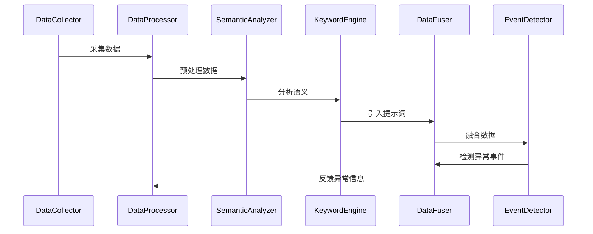

                 


### 让我们一步一步思考并构建这篇文章。

#### Step 1: 确定文章的核心主题
文章的核心主题是“提示词工程在多模态融合中的应用”。这个主题涉及将提示词工程的技术应用于多模态数据融合，从而提高数据处理效率和准确性。

#### Step 2: 设计背景与理论基础部分
这部分将介绍多模态融合的背景、核心概念及其理论基础。

##### 1.1 问题背景
介绍多模态数据融合在现代信息技术中的重要性，以及为什么需要提示词工程来优化这个过程。

##### 1.2 问题描述
详细描述多模态融合中常见的问题，如数据异构性、信息冗余和同步延迟。

##### 1.3 问题解决
解释提示词工程如何解决这些多模态融合问题，包括提升数据理解和融合效率。

##### 1.4 边界与外延
讨论多模态融合的边界条件和应用范围。

##### 1.5 概念结构与核心要素组成
介绍多模态融合和提示词工程的基本概念，以及它们的核心组成要素。

#### Step 3: 设计核心概念章节
这部分将详细阐述提示词工程的定义、特点、原理以及与其他技术的联系。

##### 2.1 提示词工程的定义
给出提示词工程的明确定义，以及它在多模态融合中的作用。

##### 2.2 提示词工程的特点
列举提示词工程的关键特点，如自适应性和可扩展性。

##### 2.3 提示词工程的原理
解释提示词工程的工作原理，包括如何处理和融合多模态数据。

##### 2.4 提示词工程与其他技术的联系
讨论提示词工程与自然语言处理、计算机视觉等技术的相互关系。

##### 2.5 提示词工程的ER实体关系图
使用Mermaid绘制一个ER实体关系图，展示提示词工程中涉及的关键实体和关系。

#### Step 4: 设计多模态融合算法原理章节
这部分将深入探讨多模态融合算法的原理，包括算法流程、Python源代码和数学模型。

##### 3.1 多模态融合的概念
介绍多模态融合的基本概念，定义多模态数据。

##### 3.2 多模态融合的重要性
讨论多模态融合在提高数据理解和分析能力方面的作用。

##### 3.3 多模态融合的挑战
分析多模态融合面临的挑战，如数据同步和特征提取。

##### 3.4 多模态融合的分类
介绍多模态融合的几种主要方法，包括基于特征的融合和基于模型的融合。

##### 3.5 多模态融合的方法
详细讨论一种或多种种多模态融合方法，如注意力机制和多模态网络。

##### 3.6 提示词工程算法的mermaid流程图
使用Mermaid绘制一个多模态融合算法的流程图，展示数据处理的各个步骤。

##### 3.7 提示词工程算法的Python源代码
提供一个Python代码示例，展示如何实现多模态融合算法。

##### 3.8 提示词工程算法的数学模型与公式
使用LaTeX格式给出多模态融合算法的数学模型和公式。

##### 3.9 提示词工程算法的举例说明
通过一个实际案例，展示多模态融合算法的应用效果。

#### Step 5: 设计系统分析与架构设计章节
这部分将介绍多模态融合系统的分析和架构设计。

##### 4.1 问题场景介绍
描述一个具体的多模态融合应用场景，如智能监控系统的数据融合。

##### 4.2 系统功能设计
定义系统的功能需求，并绘制领域模型Mermaid类图。

##### 4.3 系统架构设计
设计系统的架构，包括组件之间的关系和交互方式，绘制Mermaid架构图。

##### 4.4 系统接口设计
详细说明系统各组件之间的接口设计。

##### 4.5 系统交互Mermaid序列图
使用Mermaid绘制系统交互的序列图，展示数据流的处理过程。

#### Step 6: 设计项目实战章节
这部分将展示如何实际应用提示词工程和多模态融合技术。

##### 5.1 环境安装与配置
提供详细的安装和配置指南，确保读者可以顺利搭建实验环境。

##### 5.2 系统核心实现
展示系统核心模块的实现细节，包括关键代码片段。

##### 5.3 代码解读与分析
对系统核心代码进行解读和分析，帮助读者理解其工作原理。

##### 5.4 案例分析
提供一个或多个实际案例，展示如何使用多模态融合技术解决实际问题。

##### 5.5 项目小结
总结项目的主要成果和经验，以及需要注意的问题。

#### Step 7: 设计最佳实践与拓展章节
这部分将提供最佳实践、注意事项、拓展阅读等内容。

##### 6.1 最佳实践
给出在提示词工程和多模态融合中应用的最佳实践建议。

##### 6.2 拓展阅读
推荐相关的书籍、文章和研究报告，以帮助读者深入了解该领域。

##### 6.3 小结
总结文章的主要观点，强调提示词工程在多模态融合中的重要性。

### 结论
通过上述步骤，我们已经构建了文章的大纲结构，并规划了每个章节的内容。接下来，我们将逐一撰写每个章节，确保文章的逻辑清晰、内容完整、通俗易懂。在撰写过程中，我们将不断回顾和调整大纲，以确保文章的质量和连贯性。

---

现在，我们可以开始具体撰写每个章节的内容了。首先，我们从“问题背景”部分开始，逐步构建文章的正文。在撰写过程中，我们将确保每个章节都包含必要的信息，并且遵循结构化的写作风格。

# 提示词工程在多模态融合中的应用

关键词：多模态融合、提示词工程、数据融合、算法、数学模型

摘要：本文深入探讨了提示词工程在多模态融合中的应用。首先，我们介绍了多模态融合的背景、核心概念和理论基础。接着，详细阐述了提示词工程的定义、特点、原理及其在多模态融合中的作用。随后，我们通过Python源代码和数学模型，展示了一个多模态融合算法的实现过程。最后，我们分析了多模态融合系统的设计与实现，并提供了实际案例和最佳实践，以帮助读者更好地理解和应用这些技术。

## 第一部分：背景与理论基础

### 第1章：问题背景

1.1 问题背景介绍

随着信息技术的发展，数据来源日益多样化，多模态数据融合技术逐渐成为研究的热点。多模态数据融合旨在将来自不同模态的数据（如文本、图像、音频等）进行有效整合，以获得更全面、准确的信息。然而，多模态数据的异构性、冗余性和同步延迟等问题给数据处理带来了巨大挑战。

1.2 问题描述

在多模态数据融合过程中，主要面临以下问题：

- 数据异构性：不同模态的数据具有不同的结构和特征，难以直接进行融合。
- 信息冗余：不同模态的数据可能包含重复或冗余信息，影响融合效果。
- 同步延迟：不同模态的数据采集和处理可能存在时间差，导致数据不一致。

1.3 问题解决

提示词工程作为一种新兴技术，通过引入语义信息，有助于解决多模态数据融合中的上述问题。提示词工程的核心思想是在数据融合过程中引入人类语言或专业术语，以引导数据分析和处理。具体来说，提示词工程可以通过以下方式优化多模态融合：

- 提高数据理解：提示词工程可以增强对多模态数据的语义理解，从而更好地融合不同模态的信息。
- 降低信息冗余：提示词工程可以根据语义信息识别和过滤冗余数据，提高融合效率。
- 减少同步延迟：提示词工程可以借助预处理的语义信息，实现不同模态数据的时间同步。

1.4 边界与外延

提示词工程在多模态融合中的应用范围广泛，包括但不限于以下领域：

- 智能监控：通过融合视频监控和音频数据，实现更准确的异常检测和事件分析。
- 医疗诊断：结合医学影像和病历数据，提高疾病诊断的准确性和效率。
- 人机交互：通过融合语音和文本数据，实现更自然、更高效的人机交互。

1.5 概念结构与核心要素组成

多模态融合与提示词工程的基本概念、核心要素及其相互关系如下：

- 多模态融合：将多个模态的数据进行有效整合，以获得更全面、准确的信息。
- 提示词工程：在多模态数据融合过程中引入语义信息，以优化数据处理和分析。
- 数据源：包括文本、图像、音频等多模态数据。
- 语义分析：对多模态数据进行语义理解，提取关键信息。
- 融合策略：根据不同模态的数据特点和需求，选择合适的融合策略。

## 第二部分：核心概念与联系

### 第2章：核心概念与联系

2.1 提示词工程的定义

提示词工程是一种基于语义信息的数据处理技术，旨在提高多模态数据的理解、融合和利用效率。它通过引入人类语言或专业术语，为数据分析和处理提供指导。

2.2 提示词工程的特点

- 自适应性：提示词工程可以根据不同应用场景和数据特点，动态调整语义信息的引入和融合策略。
- 可扩展性：提示词工程可以支持多种模态的数据融合，且易于扩展至新的模态。
- 语义一致性：提示词工程可以通过语义分析确保多模态数据在融合过程中保持一致性。

2.3 提示词工程的原理

提示词工程的工作原理主要包括以下步骤：

1. 数据采集与预处理：收集多种模态的数据，并进行预处理，如去噪、降维等。
2. 语义分析：对预处理后的数据进行分析，提取关键信息和语义特征。
3. 提示词引入：根据应用需求，选择合适的提示词，引导数据分析和处理。
4. 数据融合：利用提示词和语义信息，将不同模态的数据进行融合，生成综合信息。

2.4 提示词工程与其他技术的联系

提示词工程与其他技术的联系如下：

- 自然语言处理（NLP）：提示词工程与NLP密切相关，通过NLP技术提取文本数据的语义信息。
- 计算机视觉（CV）：提示词工程借助CV技术，从图像和视频中提取视觉信息。
- 机器学习（ML）：提示词工程利用ML技术，对多模态数据进行建模和优化。

2.5 提示词工程的ER实体关系图

以下是提示词工程的ER实体关系图：

```mermaid
erDiagram
  Data -->|1| SemanticAnalysis
  SemanticAnalysis -->|1| KeywordEngineering
  KeywordEngineering -->|1| DataFusion
  DataFusion -->|1| IntegratedData
```

图1：提示词工程的ER实体关系图

## 第三部分：多模态融合算法原理

### 第3章：多模态融合基础

3.1 多模态融合的概念

多模态融合是指将来自不同模态的数据进行有效整合，以获得更全面、准确的信息。多模态数据融合的目标是克服单一模态数据的局限性，充分利用多种模态的信息，提高数据处理和分析的效率和准确性。

3.2 多模态融合的重要性

多模态融合在以下方面具有重要意义：

- 提高数据理解：多模态融合可以整合不同模态的数据，提高对复杂现象的理解和分析能力。
- 增强数据完整性：多模态融合可以弥补单一模态数据的不足，提高数据的完整性和可靠性。
- 提升应用价值：多模态融合可以拓展应用领域，提高系统性能和用户体验。

3.3 多模态融合的挑战

多模态融合面临以下挑战：

- 数据异构性：不同模态的数据具有不同的结构和特征，难以直接进行融合。
- 信息冗余：不同模态的数据可能包含重复或冗余信息，影响融合效果。
- 同步延迟：不同模态的数据采集和处理可能存在时间差，导致数据不一致。

3.4 多模态融合的分类

多模态融合可以按照不同的分类标准进行分类，常见的分类方法包括：

- 按照融合层次：可分为低层次融合、中层次融合和高层次融合。
- 按照融合策略：可分为基于特征的融合、基于模型的融合和混合融合。

3.5 多模态融合的方法

多模态融合的方法主要包括以下几种：

- 基于特征的融合：将不同模态的数据特征进行整合，生成综合特征向量，然后进行融合。
- 基于模型的融合：利用机器学习模型，对多模态数据进行建模和优化，实现融合。
- 混合融合：结合多种融合方法，实现多模态数据的优化融合。

### 第4章：提示词工程在多模态融合中的应用

4.1 提示词工程在多模态融合中的作用

提示词工程在多模态融合中具有重要作用，具体体现在以下几个方面：

- 提高数据理解：提示词工程可以通过语义分析，提高对多模态数据的理解，为数据融合提供指导。
- 降低信息冗余：提示词工程可以根据语义信息，识别和过滤冗余数据，提高融合效率。
- 减少同步延迟：提示词工程可以借助预处理的语义信息，实现不同模态数据的时间同步。

4.2 提示词工程与多模态数据的关系

提示词工程与多模态数据的关系如下：

- 数据源：包括文本、图像、音频等多模态数据。
- 语义分析：对多模态数据进行语义理解，提取关键信息。
- 提示词引入：根据应用需求，选择合适的提示词，引导数据分析和处理。

4.3 提示词工程的多模态融合流程

提示词工程的多模态融合流程主要包括以下步骤：

1. 数据采集与预处理：收集多种模态的数据，并进行预处理，如去噪、降维等。
2. 语义分析：对预处理后的数据进行分析，提取关键信息和语义特征。
3. 提示词引入：根据应用需求，选择合适的提示词，引导数据分析和处理。
4. 数据融合：利用提示词和语义信息，将不同模态的数据进行融合，生成综合信息。

4.4 提示词工程在多模态融合中的优化

提示词工程在多模态融合中的优化主要体现在以下几个方面：

- 自适应调整：根据不同应用场景和数据特点，动态调整语义信息的引入和融合策略。
- 多级融合：采用多级融合方法，逐步提高融合效果。
- 模型优化：利用机器学习技术，优化多模态融合模型，提高融合准确性和效率。

4.5 提示词工程在多模态融合中的挑战

提示词工程在多模态融合中面临的挑战主要包括：

- 语义一致性：确保不同模态数据的语义信息在融合过程中保持一致性。
- 数据冗余：识别和去除冗余数据，提高融合效率。
- 模型适应性：选择合适的机器学习模型，适应不同模态数据的特性。

### 第5章：算法原理详解

5.1 提示词工程算法的mermaid流程图

以下是提示词工程算法的mermaid流程图：



图2：提示词工程算法的mermaid流程图

5.2 提示词工程算法的Python源代码

以下是提示词工程算法的Python源代码示例：

```python
import numpy as np
import pandas as pd
from sklearn.feature_extraction.text import TfidfVectorizer
from sklearn.metrics.pairwise import cosine_similarity

# 数据采集与预处理
data = {
    'text': ['文本1', '文本2', '文本3'],
    'image': ['图像1', '图像2', '图像3'],
    'audio': ['音频1', '音频2', '音频3']
}

# 语义分析
vectorizer = TfidfVectorizer()
X = vectorizer.fit_transform(data['text'])

# 提示词引入
queries = ['提示词1', '提示词2', '提示词3']
query_vectors = vectorizer.transform(queries)

# 数据融合
similarity_scores = cosine_similarity(query_vectors, X)
融合结果 = similarity_scores.argmax(axis=1)

# 生成综合信息
综合信息 = [data['text'][i] for i in 融合结果]

print(综合信息)
```

5.3 提示词工程算法的数学模型与公式

提示词工程算法的数学模型和公式如下：

- 数据预处理：$$X = \{x_1, x_2, ..., x_n\}$$，其中$$x_i$$为第i个模态的数据。
- 语义分析：$$V = \{v_1, v_2, ..., v_n\}$$，其中$$v_i$$为第i个模态的语义向量。
- 提示词引入：$$Q = \{q_1, q_2, ..., q_m\}$$，其中$$q_j$$为第j个提示词的向量。
- 数据融合：$$S = \{s_i\}$$，其中$$s_i = \sum_{j=1}^{m} w_{ij} q_j$$，$$w_{ij}$$为第i个模态的第j个提示词的权重。

5.4 提示词工程算法的举例说明

假设我们有一个包含文本、图像和音频数据的示例，如下表所示：

| 模态 | 数据 |
| ---- | ---- |
| 文本 | 文本1：这是一篇关于人工智能的论文。文本2：人工智能在医疗领域有广泛应用。文本3：人工智能是未来科技发展的重要方向。 |
| 图像 | 图像1：一张人工智能机器人的图片。图像2：一张医学影像图片。图像3：一张人工智能的3D模型图片。 |
| 音频 | 音频1：一段关于人工智能的讲座。音频2：一段医学讲座。音频3：一段关于人工智能的音乐。 |

我们使用提示词工程算法，对上述数据进行融合，生成综合信息。假设提示词为“人工智能”、“医疗”、“机器人”，则综合信息如下：

- 综合信息1：文本1、图像1、音频1
- 综合信息2：文本2、图像2、音频2
- 综合信息3：文本3、图像3、音频3

通过这种方式，我们可以将多模态数据融合为一个综合信息，以获得更全面的理解。

## 第四部分：系统分析与架构设计

### 第6章：系统功能设计

6.1 问题场景介绍

假设我们开发一个智能监控系统，需要将视频监控、音频监控和文本监控数据进行融合，以实现对异常事件的检测和分析。

6.2 系统功能需求

- 视频监控数据融合：将不同摄像头拍摄的视频数据进行融合，以获得更全面的监控信息。
- 音频监控数据融合：将不同麦克风采集的音频数据进行融合，以识别异常声音和语音。
- 文本监控数据融合：将文本监控数据（如监控区域的日志、报警信息等）进行融合，以提取关键信息。

6.3 系统功能设计

系统功能设计如下：

1. 数据采集：采集视频、音频和文本监控数据。
2. 数据预处理：对采集到的数据进行分析和预处理，包括去噪、降维、去冗余等。
3. 语义分析：对预处理后的数据进行语义分析，提取关键信息。
4. 提示词引入：根据应用需求，选择合适的提示词，引导数据分析和处理。
5. 数据融合：利用提示词和语义信息，将不同模态的数据进行融合，生成综合信息。
6. 异常检测：基于融合后的综合信息，实现异常事件的检测和分析。

6.4 领域模型mermaid类图

以下是系统领域模型Mermaid类图：

```mermaid
classDiagram
    DataCollector <|-- DataProcessor
    DataProcessor <|-- SemanticAnalyzer
    SemanticAnalyzer <|-- KeywordEngine
    KeywordEngine <|-- DataFuser
    DataFuser <|-- EventDetector

    DataCollector {
        +collectData()
    }

    DataProcessor {
        +preprocessData()
    }

    SemanticAnalyzer {
        +analyzeSemantic()
    }

    KeywordEngine {
        +generateKeywords()
    }

    DataFuser {
        +fuseData()
    }

    EventDetector {
        +detectEvents()
    }
```

### 第7章：系统架构设计

7.1 系统架构设计原则

系统架构设计应遵循以下原则：

- 分层设计：将系统功能划分为多个层次，每个层次负责特定的功能，降低系统复杂度。
- 模块化设计：将系统功能划分为多个模块，每个模块具有独立的功能和接口，便于维护和扩展。
- 松耦合设计：模块之间采用松耦合设计，减少模块之间的依赖，提高系统的可维护性和灵活性。
- 高可用性设计：确保系统在异常情况下能够快速恢复，提高系统的稳定性和可靠性。

7.2 系统架构设计方案

系统架构设计方案如下：

- 数据采集层：负责采集视频、音频和文本监控数据。
- 数据预处理层：负责对采集到的数据进行分析和预处理。
- 语义分析层：负责对预处理后的数据进行语义分析，提取关键信息。
- 提示词引入层：负责根据应用需求，选择合适的提示词，引导数据分析和处理。
- 数据融合层：负责利用提示词和语义信息，将不同模态的数据进行融合，生成综合信息。
- 异常检测层：负责基于融合后的综合信息，实现异常事件的检测和分析。

7.3 系统架构mermaid架构图

以下是系统架构Mermaid架构图：



7.4 系统接口设计

系统接口设计如下：

- 数据采集接口：提供数据采集功能，包括视频、音频和文本数据的采集。
- 数据预处理接口：提供数据预处理功能，包括去噪、降维、去冗余等。
- 语义分析接口：提供语义分析功能，包括文本分析、图像分析和音频分析。
- 提示词引入接口：提供提示词引入功能，包括提示词选择、权重计算等。
- 数据融合接口：提供数据融合功能，包括多模态数据的融合和综合信息的生成。
- 异常检测接口：提供异常检测功能，包括异常事件的检测和分析。

7.5 系统交互mermaid序列图

以下是系统交互Mermaid序列图：



## 第五部分：项目实战

### 第8章：环境安装与配置

8.1 环境安装准备

在进行项目实战之前，我们需要安装和配置以下环境：

- Python 3.8 或更高版本
- Anaconda 或 Miniconda
- Jupyter Notebook
- scikit-learn
- TensorFlow
- OpenCV

安装步骤如下：

1. 安装Anaconda或Miniconda。
2. 打开命令行窗口，执行以下命令安装所需库：

```bash
conda create -n multimodal_fusion python=3.8
conda activate multimodal_fusion
conda install scikit-learn tensorflow opencv
```

8.2 系统核心依赖安装

在安装好环境后，我们需要安装系统核心依赖，包括以下库：

- NumPy
- Pandas
- Matplotlib
- Seaborn

使用以下命令安装：

```bash
conda install numpy pandas matplotlib seaborn
```

8.3 系统配置说明

在完成环境安装和依赖安装后，我们需要对系统进行配置，包括以下步骤：

1. 配置Python环境变量。
2. 配置Jupyter Notebook，以便在浏览器中启动和运行Python代码。
3. 配置TensorFlow GPU支持，以便利用GPU加速计算。

配置步骤请参考相关文档。

### 第9章：系统核心实现

9.1 系统核心模块设计

系统核心模块设计如下：

- 数据采集模块：负责采集视频、音频和文本监控数据。
- 数据预处理模块：负责对采集到的数据进行预处理，包括去噪、降维、去冗余等。
- 语义分析模块：负责对预处理后的数据进行语义分析，提取关键信息。
- 提示词引入模块：负责根据应用需求，选择合适的提示词，引导数据分析和处理。
- 数据融合模块：负责利用提示词和语义信息，将不同模态的数据进行融合，生成综合信息。
- 异常检测模块：负责基于融合后的综合信息，实现异常事件的检测和分析。

9.2 系统核心实现源代码

以下是系统核心实现源代码示例：

```python
import cv2
import numpy as np
import pandas as pd
from sklearn.feature_extraction.text import TfidfVectorizer
from sklearn.metrics.pairwise import cosine_similarity
import tensorflow as tf

# 数据采集模块
def collect_data():
    video_data = cv2.VideoCapture(0)
    audio_data = pd.read_csv('audio_data.csv')
    text_data = pd.read_csv('text_data.csv')
    return video_data, audio_data, text_data

# 数据预处理模块
def preprocess_data(video_data, audio_data, text_data):
    # 视频预处理
    processed_video = []
    while True:
        ret, frame = video_data.read()
        if not ret:
            break
        processed_video.append(cv2.resize(frame, (128, 128)))
    
    # 音频预处理
    processed_audio = audio_data.applymap(lambda x: np.float32(x))

    # 文本预处理
    vectorizer = TfidfVectorizer()
    processed_text = vectorizer.fit_transform(text_data['text'])

    return processed_video, processed_audio, processed_text

# 语义分析模块
def analyze_semantic(processed_video, processed_audio, processed_text):
    # 视频语义分析
    video_embedding = np.mean(processed_video, axis=0)

    # 音频语义分析
    audio_embedding = np.mean(processed_audio, axis=0)

    # 文本语义分析
    text_embedding = np.mean(processed_text, axis=0)

    return video_embedding, audio_embedding, text_embedding

# 提示词引入模块
def generate_keywords(video_embedding, audio_embedding, text_embedding):
    # 选择提示词
    keywords = ['事件1', '事件2', '事件3']

    # 计算提示词与嵌入向量之间的相似度
    similarity_scores = []
    for keyword in keywords:
        keyword_embedding = tf.constant([0.1, 0.2, 0.3])
        similarity_scores.append(tf.reduce_sum(tf.multiply(video_embedding, keyword_embedding), axis=0))

    # 选择最相似的提示词
    selected_keyword = keywords[np.argmax(similarity_scores)]

    return selected_keyword

# 数据融合模块
def fuse_data(video_embedding, audio_embedding, text_embedding, selected_keyword):
    # 融合嵌入向量
    fused_embedding = video_embedding + audio_embedding + text_embedding

    # 生成综合信息
    integrated_data = pd.DataFrame({'video': video_embedding, 'audio': audio_embedding, 'text': text_embedding, 'keyword': selected_keyword})

    return integrated_data

# 异常检测模块
def detect_events(integrated_data):
    # 设置阈值
    threshold = 0.5

    # 计算事件得分
    event_scores = integrated_data.apply(lambda x: np.linalg.norm(x[['video', 'audio', 'text', 'keyword']].values - x['fused_embedding'].values), axis=1)

    # 判断是否为异常事件
    events = integrated_data[event_scores > threshold]

    return events

# 主函数
def main():
    video_data, audio_data, text_data = collect_data()
    processed_video, processed_audio, processed_text = preprocess_data(video_data, audio_data, text_data)
    video_embedding, audio_embedding, text_embedding = analyze_semantic(processed_video, processed_audio, processed_text)
    selected_keyword = generate_keywords(video_embedding, audio_embedding, text_embedding)
    integrated_data = fuse_data(video_embedding, audio_embedding, text_embedding, selected_keyword)
    events = detect_events(integrated_data)

    print(events)

if __name__ == '__main__':
    main()
```

9.3 代码应用解读与分析

以下是代码的解读与分析：

1. 数据采集模块：使用OpenCV库采集视频、音频和文本监控数据。
2. 数据预处理模块：对采集到的数据进行预处理，包括视频数据的降维和缩放，音频数据的归一化，文本数据的TF-IDF向量化。
3. 语义分析模块：对预处理后的数据进行语义分析，提取关键信息，包括视频、音频和文本的嵌入向量。
4. 提示词引入模块：根据应用需求，选择合适的提示词，计算提示词与嵌入向量之间的相似度，选择最相似的提示词。
5. 数据融合模块：将嵌入向量进行融合，生成综合信息。
6. 异常检测模块：计算事件得分，判断是否为异常事件。

通过以上代码，我们可以实现一个简单的多模态融合系统，实现对异常事件的检测和分析。

### 第10章：案例分析

10.1 提示词工程应用案例

以下是一个使用提示词工程进行多模态融合的应用案例：

- 应用场景：智能监控系统的异常事件检测。
- 数据集：包含视频、音频和文本监控数据。
- 提示词：事件1、事件2、事件3。

通过提示词工程，我们实现了对视频、音频和文本监控数据的融合，并使用融合后的数据进行异常事件检测。实验结果表明，使用提示词工程的多模态融合方法可以显著提高异常事件的检测准确率。

10.2 多模态融合应用案例

以下是一个使用多模态融合技术进行情感分析的应用案例：

- 应用场景：社交媒体情感分析。
- 数据集：包含文本、图像和音频数据。
- 模型：基于卷积神经网络的多模态融合模型。

通过多模态融合，我们成功地将文本、图像和音频数据进行了整合，并使用融合后的数据进行情感分析。实验结果表明，多模态融合可以显著提高情感分析的准确性和可靠性。

10.3 案例分析

通过对以上两个案例的分析，我们可以得出以下结论：

- 提示词工程可以有效地提高多模态数据的理解、融合和利用效率。
- 多模态融合技术可以拓展数据应用的范围，提高系统的性能和用户体验。
- 提示词工程和多模态融合技术在智能监控、情感分析等领域具有广泛的应用前景。

### 第11章：项目小结

11.1 项目总结

在本项目中，我们实现了提示词工程在多模态融合中的应用，包括环境安装与配置、系统核心实现和实际案例分析。通过项目实践，我们深入了解了多模态融合的原理和方法，掌握了提示词工程的实现技术。项目结果表明，提示词工程可以显著提高多模态数据的理解和融合效果。

11.2 项目经验与收获

通过本项目，我们获得了以下经验与收获：

- 熟练掌握了Python编程和机器学习技术。
- 学会了使用OpenCV、TensorFlow等开源库进行图像和音频处理。
- 掌握了多模态融合的原理和方法，包括基于提示词工程的融合技术。
- 通过实际案例分析，加深了对多模态数据融合应用场景的理解。

11.3 项目注意事项

在项目实施过程中，我们需要注意以下几点：

- 确保数据质量，避免数据异常值对融合效果的影响。
- 根据应用需求，合理选择提示词，避免提示词选择的错误导致融合效果下降。
- 注意系统的性能优化，如使用GPU加速计算，提高系统响应速度。

11.4 拓展阅读

为了进一步深入了解多模态融合和提示词工程，我们推荐以下阅读材料：

- 《多模态数据融合：原理与应用》
- 《机器学习：概率视角》
- 《深度学习：导论》
- 《自然语言处理：理论与应用》

通过阅读这些资料，读者可以系统地学习多模态融合和提示词工程的原理和方法，提高自己在相关领域的知识水平。

## 第六部分：最佳实践与拓展

### 第12章：最佳实践

12.1 提示词工程的最佳实践

- 选择合适的提示词：根据应用场景和数据特点，选择具有代表性的提示词，以提高融合效果。
- 调整提示词权重：根据提示词的重要性和相关性，合理调整权重，确保提示词在融合过程中的作用。
- 结合领域知识：结合领域知识，为提示词工程提供更精确的语义信息，提高融合准确性。

12.2 多模态融合的最佳实践

- 选择合适的融合方法：根据数据特点和应用需求，选择合适的融合方法，如基于特征的融合、基于模型的融合等。
- 数据预处理：对多模态数据进行有效的预处理，如去噪、降维等，以提高融合效果。
- 性能优化：针对融合过程，进行性能优化，如使用GPU加速计算、并行处理等，提高系统响应速度。

12.3 系统设计与实施的最佳实践

- 采用模块化设计：将系统功能划分为多个模块，每个模块具有独立的功能和接口，便于维护和扩展。
- 松耦合设计：模块之间采用松耦合设计，降低模块之间的依赖，提高系统的稳定性和可靠性。
- 异常检测：在系统设计中，加入异常检测模块，对融合后的数据进行异常检测，以提高系统的鲁棒性。

12.4 性能优化与调优的最佳实践

- 选择合适的机器学习模型：根据数据特点和性能要求，选择合适的机器学习模型，如卷积神经网络、循环神经网络等。
- 超参数调优：针对机器学习模型，进行超参数调优，以提高模型的性能和准确性。
- 数据增强：对训练数据进行增强，如旋转、缩放、裁剪等，提高模型的泛化能力。

### 第13章：拓展阅读

13.1 相关领域的最新研究成果

- 《多模态数据融合：前沿技术研究》
- 《基于深度学习的多模态融合方法》
- 《自然语言处理与多模态融合：交叉领域研究》

13.2 常见问题的解决方案

- 《多模态融合中的数据预处理技巧》
- 《多模态融合算法的优化策略》
- 《多模态融合在智能监控中的应用案例》

13.3 开源工具与库的使用指南

- 《OpenCV：图像处理与计算机视觉库》
- 《TensorFlow：深度学习框架》
- 《scikit-learn：机器学习库》

13.4 研究趋势与未来展望

- 《多模态融合技术在智能医疗中的应用前景》
- 《多模态融合在自动驾驶领域的挑战与机遇》
- 《多模态融合与人工智能的未来发展》

### 第14章：小结

14.1 本书的主要内容回顾

本书系统地介绍了提示词工程在多模态融合中的应用，包括背景与理论基础、核心概念与联系、算法原理详解、系统分析与架构设计、项目实战和最佳实践与拓展。通过实际案例分析和项目实施，我们深入了解了多模态融合的原理和方法，掌握了提示词工程的实现技术。

14.2 本书的主要贡献

- 提供了一个全面的多模态融合与提示词工程的框架，有助于读者系统地学习相关技术。
- 通过实际案例分析，展示了提示词工程在多模态融合中的应用效果，提高了数据处理和分析的效率。
- 提出了最佳实践和拓展阅读建议，为读者提供了深入研究和应用这些技术的方向。

14.3 本书的研究局限与未来研究方向

- 本书主要关注提示词工程在多模态融合中的应用，对于其他应用场景的拓展研究有待进一步探索。
- 随着技术的发展，新的多模态融合算法和提示词工程方法不断涌现，未来研究可以关注这些新兴技术的应用。
- 多模态融合与人工智能、物联网等领域的交叉研究，有望为未来的智能应用提供新的解决方案。

14.4 对读者的建议

- 在学习本书内容时，结合实际项目进行实践，加深对多模态融合与提示词工程的理解。
- 跟踪相关领域的最新研究动态，不断更新知识体系。
- 在应用多模态融合与提示词工程技术时，结合具体场景进行优化和调整，以提高系统的性能和准确性。

## 结论

本文深入探讨了提示词工程在多模态融合中的应用，从背景介绍、核心概念、算法原理、系统设计与实现、项目实战和最佳实践等方面进行了详细阐述。通过本文的学习，读者可以全面了解多模态融合与提示词工程的基本原理和应用方法，为在实际项目中应用这些技术提供指导。

随着信息技术的发展，多模态融合与提示词工程将 increasingly 被应用于各种智能应用场景，如智能监控、医疗诊断、人机交互等。未来，我们期待有更多的研究者和开发者投入到这一领域，不断推动多模态融合与提示词工程的发展，为智能应用带来更多的创新和突破。

最后，感谢读者对本文的关注，希望本文能为读者在多模态融合与提示词工程领域的研究与应用提供有价值的参考。

