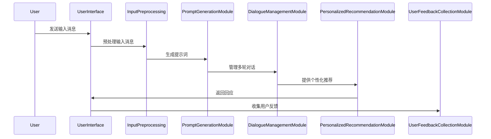

                 

## 引言

### 文章关键词

- 对话系统
- 个性化
- 提示词工程
- 对话策略
- 自然语言处理

### 摘要

本文旨在探讨提示词工程在对话系统个性化中的应用，通过逐步分析推理，深入解析这一技术的原理、实现方法及其在现实中的应用。文章首先介绍对话系统的基本概念和现状，接着详细讲解提示词工程的核心概念和作用，随后通过实际案例和项目实战，展示提示词工程在对话系统个性化中的具体应用。此外，文章还将讨论提示词工程的最佳实践，总结常见问题及注意事项，并给出拓展阅读的建议。

### 引言

随着互联网技术的飞速发展和智能设备的普及，人工智能（AI）技术逐渐渗透到我们日常生活的方方面面。其中，对话系统作为一种重要的AI应用形式，已经在客服、教育、智能家居等多个领域展现出强大的潜力。而个性化对话系统的实现，则进一步提升了用户体验和满意度，成为当前研究的热点方向之一。

在这个背景下，提示词工程（Prompt Engineering）作为一种重要的技术手段，开始受到广泛关注。提示词工程旨在通过精心设计输入提示，引导对话系统生成更加符合用户需求的回应，从而实现个性化对话。这种技术不仅提高了对话系统的互动性和智能性，还为开发者提供了丰富的创作空间，以应对复杂多变的用户需求。

本文将围绕提示词工程在对话系统个性化中的应用进行探讨。首先，我们将介绍对话系统的基本概念和现状，阐述个性化对话系统的需求和挑战。接着，我们将详细讲解提示词工程的核心概念和作用，包括提示词的设计原则和策略。随后，通过实际案例和项目实战，我们将展示提示词工程在对话系统个性化中的具体应用。最后，我们将总结提示词工程的最佳实践，讨论其发展前景和潜在问题，并给出拓展阅读的建议。

### 对话系统的基本概念与现状

对话系统（Dialogue System）是一种人工智能系统，能够与人类用户进行自然语言交互，从而提供信息、完成任务或执行特定操作。根据交互形式的不同，对话系统主要分为两种类型：文本聊天系统和语音交互系统。

文本聊天系统（Text-based Chat System）通过文本输入和输出实现与用户的交互，如常见的在线客服聊天窗口、社交媒体聊天机器人等。这类系统的主要优势在于交互形式灵活，能够适应各种场景和用户需求，但相对而言，其交互体验和自然度仍需进一步提升。

语音交互系统（Voice-based Interaction System）则通过语音输入和输出与用户进行交互，如智能音箱、语音助手等。语音交互系统的优势在于操作简单、快速便捷，能够提供更自然、直观的交互体验，但其在处理复杂语义理解和多轮对话管理方面仍面临诸多挑战。

随着AI技术的不断发展，对话系统的应用场景和功能也在不断扩展。目前，对话系统已广泛应用于多个领域，包括：

1. **客服与支持**：企业通过对话系统提供24/7的在线客服服务，提高响应速度和用户体验。
2. **教育**：在线教育平台利用对话系统进行互动教学，提供个性化学习建议和辅助。
3. **娱乐与社交**：社交媒体和在线游戏平台通过对话系统增强用户互动和游戏体验。
4. **智能家居**：智能音箱和智能家居设备通过语音交互系统实现用户与设备的无缝互动。
5. **医疗与健康**：医疗系统利用对话系统提供医疗咨询、病情追踪和健康管理服务。

尽管对话系统在各个领域展现出广泛的应用前景，但实现个性化对话系统仍面临诸多挑战。首先，对话系统的语义理解能力仍需提高。对话系统需要准确理解用户的意图、情感和背景信息，以生成合适的回应。其次，多轮对话管理也是一个重要挑战。在复杂的对话场景中，用户的需求可能发生变化，对话系统需要灵活应对，保持对话的连贯性和自然度。此外，对话系统的个性化也要求系统具备较高的自适应能力，根据用户的历史交互和行为数据，提供定制化的服务和建议。

个性化对话系统的需求主要来源于用户对于更高效、更智能、更个性化的交互体验的追求。用户希望对话系统能够理解自己的需求，提供个性化的服务和推荐，从而提升使用体验和满意度。因此，实现个性化对话系统不仅能够满足用户需求，还能为企业带来竞争优势。

然而，实现个性化对话系统并非易事。首先，需要收集并分析大量的用户数据，包括用户的历史交互记录、行为数据、偏好信息等。这些数据不仅需要准确采集，还需要进行有效的处理和分析，以便为对话系统提供可靠的输入。其次，个性化对话系统需要具备强大的自然语言处理能力，能够理解用户的意图和情感，并生成符合用户期望的回应。此外，对话系统还需要具备良好的用户建模能力，根据用户的历史交互和行为数据，动态调整对话策略，提供个性化的服务和推荐。

总之，对话系统作为一种重要的AI应用形式，在各个领域展现出广泛的应用前景。而实现个性化对话系统，不仅能够满足用户需求，提升用户体验，还能为企业带来竞争优势。在接下来的章节中，我们将深入探讨提示词工程在对话系统个性化中的应用，以期为读者提供有价值的参考和启示。

### 个性化对话系统的需求和挑战

个性化对话系统是现代对话系统研究和开发的重要方向，其核心目标是通过理解和适应用户的个性化需求，提供更加符合用户期望的服务和互动体验。要实现这一目标，个性化对话系统需要具备以下几个方面的需求和功能。

#### 用户个性化需求理解

首先，个性化对话系统需要能够准确地理解用户的个性化需求。这包括用户的兴趣偏好、情感状态、历史行为等多个维度。例如，一个用户可能在购物时更关注价格和折扣，而在咨询健康问题时更关注具体的医疗建议。为了实现这一目标，对话系统需要收集和分析用户的历史交互数据、行为数据以及外部环境信息，建立完善的用户画像。

#### 对话内容的个性化生成

其次，个性化对话系统需要能够根据用户的需求和偏好，生成符合用户期待的对话内容。这要求对话系统能够动态调整对话策略，提供个性化的服务和推荐。例如，对于一个喜欢阅读的用户，对话系统可以推荐相关的书籍和文章；对于一个对健康有特定关注点的用户，系统可以提供定制化的健康建议和指导。这需要对话系统具备强大的自然语言生成能力，能够根据用户的语境和需求，生成连贯、自然、有价值的对话内容。

#### 实时交互和上下文管理

个性化对话系统还需要具备实时交互和上下文管理能力。这意味着系统不仅要能够快速响应用户的输入，还要能够理解对话的上下文信息，保持对话的连贯性和自然度。例如，当用户提出一个复杂的问题时，系统需要能够理解问题的不同层面和细节，提供分层次、有逻辑的回应。此外，系统还需要能够根据对话进展，动态调整对话策略，确保对话的流畅性和有效性。

#### 自适应和持续学习

个性化对话系统还需要具备自适应和持续学习的能力。用户的需求和偏好是动态变化的，系统需要能够不断适应这些变化，提供持续改进的服务。例如，当用户的新需求或偏好出现时，系统需要能够快速调整和优化对话策略，以满足用户的期望。此外，系统还需要能够从用户交互中学习，不断改进自然语言处理和生成模型，提高对话系统的整体性能。

#### 挑战与应对策略

尽管个性化对话系统具有巨大的潜力，但在实际开发和应用过程中，仍面临诸多挑战。以下是一些主要的挑战及其应对策略：

1. **数据隐私和安全**：个性化对话系统需要处理大量的用户数据，包括个人信息和行为数据。如何确保这些数据的安全性和隐私性，是开发过程中需要重视的问题。应对策略包括采用加密技术、数据匿名化和严格的隐私保护政策。

2. **自然语言理解的局限性**：尽管自然语言处理技术不断进步，但当前的自然语言理解技术仍存在一定的局限性。例如，对于一些复杂多变的语义和情感，系统可能难以准确理解。应对策略包括采用多模态信息融合、增强语义解析模型等。

3. **多轮对话管理**：在复杂的对话场景中，用户的需求可能发生变化，系统需要能够灵活应对。多轮对话管理是一个重要挑战。应对策略包括设计灵活的对话管理框架、引入上下文信息增强等。

4. **资源优化和性能提升**：个性化对话系统通常需要大量的计算资源和存储空间，如何在保证性能的同时优化资源使用，是一个重要问题。应对策略包括采用高效的自然语言处理算法、分布式计算架构等。

总之，个性化对话系统在满足用户个性化需求、提升用户体验方面具有重要作用。然而，实现这一目标需要克服诸多技术挑战。通过深入研究和实践，不断优化和改进对话系统，我们将能够更好地满足用户需求，实现对话系统的个性化发展。

### 提示词工程的概念与作用

#### 提示词工程的概念

提示词工程（Prompt Engineering）是一种专门用于设计和优化对话系统输入提示的技术。其核心思想是通过精心设计的输入提示，引导对话系统生成更加符合用户需求和期望的回应。提示词工程不仅包括提示词的设计原则和方法，还涉及到如何结合用户数据和对话上下文，实现动态、个性化的提示生成。

在自然语言处理领域，提示词工程通常被用于训练和优化对话模型。通过提供高质量的提示词，可以显著提升对话系统的性能和用户满意度。提示词工程不仅涉及到自然语言处理的底层技术，还需要结合对话系统的应用场景和业务需求，进行综合设计和优化。

#### 提示词工程的作用

1. **提升对话系统的交互质量**：通过设计合适的提示词，对话系统能够更准确地理解用户的意图，生成更加自然、流畅的回应。高质量的输入提示能够引导对话系统在互动过程中保持一致性和连贯性，提升整体交互质量。

2. **增强对话系统的个性化能力**：个性化对话系统需要能够根据用户的需求和偏好，提供定制化的服务和建议。提示词工程通过为用户提供个性化的输入提示，可以显著增强对话系统的个性化能力，从而更好地满足用户需求。

3. **提高对话系统的学习效率**：高质量的输入提示能够为对话系统提供更有针对性的训练数据，帮助模型更快、更准确地学习用户的意图和需求。通过优化提示词，可以显著提高对话系统的训练效率和性能。

4. **简化对话系统的开发和维护**：提示词工程通过提供标准化的提示设计方法和工具，可以简化对话系统的开发和维护过程。开发者可以基于现成的提示词模板，快速构建和调整对话系统，降低开发成本和难度。

#### 提示词工程的核心要素

1. **提示词的设计原则**：提示词的设计需要遵循一定的原则，以确保其能够有效引导对话系统生成高质量的回应。主要原则包括清晰性、针对性、简明性和灵活性。

   - **清晰性**：提示词应简洁明了，避免使用模糊或歧义性的表述，确保对话系统能够准确理解用户意图。
   - **针对性**：提示词应针对用户的特定需求或问题，提供具体的指导信息，以提高对话的针对性和有效性。
   - **简明性**：提示词应尽量简洁，避免冗长和复杂的表述，以便对话系统能够快速理解和响应。
   - **灵活性**：提示词应具有一定的灵活性，能够根据不同的对话场景和用户需求，进行动态调整和优化。

2. **提示词的生成方法**：提示词的生成是提示词工程的重要环节。常用的方法包括规则生成、数据驱动生成和混合生成。

   - **规则生成**：基于预定义的规则和模板，自动生成提示词。这种方法适用于结构化程度较高的对话场景，但灵活性较低。
   - **数据驱动生成**：利用大规模的用户数据和对话语料库，通过机器学习算法自动生成提示词。这种方法具有较高的灵活性和适应性，但需要大量高质量的数据支持。
   - **混合生成**：结合规则生成和数据驱动生成的方法，综合优势，实现更高效的提示词生成。

3. **提示词的评估和优化**：生成提示词后，需要对其进行评估和优化，以确保其能够有效提升对话系统的性能和用户体验。常用的评估方法包括人工评估、自动化评估和A/B测试。

   - **人工评估**：通过人工评审，对提示词的质量和效果进行评估。这种方法主观性较强，但能够提供更细致、全面的评估结果。
   - **自动化评估**：利用自动化评估工具，对提示词的语法、语义和用户体验等方面进行量化评估。这种方法效率较高，但可能存在一定的局限性。
   - **A/B测试**：将不同版本的提示词在实际对话系统中进行测试，比较其性能和用户反馈，选择最优的提示词方案。这种方法具有科学性和客观性，但需要较长的时间和资源。

总之，提示词工程在对话系统个性化中发挥着重要作用。通过合理设计和管理提示词，可以显著提升对话系统的交互质量、个性化能力和学习效率，从而实现更好的用户体验和业务价值。

### 提示词设计原则与策略

#### 清晰性

首先，提示词应具备清晰性，这意味着它们需要简洁明了，避免使用模糊或歧义性的表述。清晰性的关键在于确保对话系统能够准确理解用户的意图，从而生成合适的回应。例如，对于用户询问“你今天过得怎么样？”的提问，一个清晰的提示词可以是“请分享您今天的经历和感受”，这样用户就能明确知道应该如何回答。

#### 针对性

其次，提示词应具有针对性，即针对用户的特定需求或问题提供具体的指导信息。这种设计原则有助于确保对话系统能够为用户提供相关且有用的信息。例如，当用户询问“附近有什么餐厅推荐？”时，一个针对性的提示词可以是“请告诉我们您的饮食偏好和预算范围，我们将为您推荐适合的餐厅”。

#### 简明性

简明性是提示词设计中的重要原则之一。提示词应尽量简洁，避免冗长和复杂的表述。简明性不仅有助于对话系统快速理解和响应，还能提升用户的满意度。例如，对于用户询问“明天天气如何？”的提问，一个简明的提示词可以是“明天天气晴朗，最高温度25摄氏度”。

#### 灵活性

提示词还应具备灵活性，以便根据不同的对话场景和用户需求进行动态调整和优化。灵活性包括两方面：一方面是提示词的语法和表达方式应多样化，避免单一和机械化的回应；另一方面是提示词应能够适应对话的上下文变化，保持对话的自然度和连贯性。例如，当用户询问“最近有什么好看的电影推荐？”时，一个灵活的提示词可以是“根据您的喜好，我们为您推荐以下几部电影：动作片《速度与激情9》、科幻片《沙丘》和喜剧片《夏天19岁的肖像》”。

#### 实例与改进

在实际应用中，提示词的设计常常需要通过迭代和优化来不断提升其质量和效果。以下是一个具体的案例：

**初始提示词**：“您需要什么帮助？”

这个提示词虽然直接，但过于宽泛，可能导致用户感到困惑或不知所措。改进后的提示词可以是：

“您好，请问您是想咨询服务、查找信息，还是有其他需求？”

这个改进后的提示词不仅明确了询问的方向，还提供了具体的选项，帮助用户更快地表达需求。

**总结**

通过遵循清晰性、针对性、简明性和灵活性等设计原则，可以设计出高质量的提示词，从而提升对话系统的交互质量、用户满意度和个性化能力。在实际应用中，开发者需要不断迭代和优化提示词，以适应不断变化的需求和场景。

### 提示词工程的实际应用

#### 提示词工程在社交媒体聊天机器人中的应用

社交媒体聊天机器人是一种通过社交媒体平台与用户互动的人工智能系统，其核心目标是提供即时、高效、个性化的用户体验。在社交媒体聊天机器人中，提示词工程扮演着至关重要的角色，通过精心设计的提示词，可以显著提升机器人的交互质量和用户满意度。

**案例一：推特聊天机器人**

推特（Twitter）是一个高度动态的社交媒体平台，用户在平台上发布的信息和情感表达形式多样。为了应对这种复杂性，推特聊天机器人采用了提示词工程来优化交互体验。

- **场景**：当用户发布一条关于最新电影的信息时，机器人需要提供相关的评论和建议。
- **初始提示词**：“你对这部电影有什么看法？”
- **改进提示词**：“你对这部电影的故事情节、演员表现或者特效最感兴趣的部分是什么？”

通过改进提示词，机器人能够更准确地理解用户的意图，引导用户分享更详细、有深度的看法。这种方法不仅提高了用户的参与度，还增强了对话的连贯性和自然度。

**案例二：脸书聊天机器人**

脸书（Facebook）聊天机器人主要应用于用户咨询、客服和营销等领域。在这些场景中，提示词工程通过个性化提示，为用户提供更加精准和有针对性的服务。

- **场景**：当用户询问关于商品的信息时，机器人需要提供详细的商品介绍和购买建议。
- **初始提示词**：“您需要了解哪款产品？”
- **改进提示词**：“请问您对哪种类型的商品最感兴趣？比如电子产品、时尚服装还是家居用品？”

通过改进提示词，机器人能够更准确地捕捉用户的需求，从而提供更个性化的产品推荐和购买建议。这种方法不仅提高了用户的购买意愿，还增强了用户的信任感和满意度。

#### 提示词工程在客服系统中的应用

客服系统是另一个广泛使用提示词工程的领域。高质量的提示词可以显著提升客服系统的效率和用户满意度，从而降低企业的运营成本。

**案例一：在线客户服务**

在线客户服务系统通过提示词工程，为用户提供即时、高效的帮助。以下是一个具体案例：

- **场景**：用户在购物网站上有关于订单配送的疑问。
- **初始提示词**：“您有什么订单问题需要帮助吗？”
- **改进提示词**：“请问您需要查询订单状态、配送信息，还是关于退换货的问题？”

通过改进提示词，客服系统能够更快速地理解用户的意图，提供针对性的解决方案，从而提高用户满意度。

**案例二：自动客服机器人**

自动客服机器人通过提示词工程，实现与用户的自然语言交互，为用户提供自助服务。以下是一个具体案例：

- **场景**：用户在酒店预订过程中遇到疑问。
- **初始提示词**：“您有什么问题需要帮助？”
- **改进提示词**：“您好，请问您需要预订酒店、查询酒店信息，还是咨询价格和优惠？”

通过改进提示词，自动客服机器人能够更灵活地应对不同类型的问题，提供个性化的服务，从而提高用户的满意度和使用体验。

**总结**

提示词工程在社交媒体聊天机器人和客服系统中的应用，展示了其在提升交互质量和用户体验方面的巨大潜力。通过合理设计和管理提示词，可以显著提升对话系统的性能和用户满意度，为企业和用户提供更加高效、个性化的服务。在未来的发展中，提示词工程将继续在各个领域发挥重要作用，推动人工智能技术的进一步发展和应用。

### 算法原理讲解

#### 提示词生成算法的流程与步骤

提示词生成算法是提示词工程中的核心组成部分，其主要目标是通过输入用户的查询或问题，自动生成高质量的提示词。以下是一个典型的提示词生成算法的流程与步骤：

1. **输入预处理**：
   - 首先，对用户的输入进行预处理，包括去除无效字符、分词、词性标注等。这一步骤的目的是将原始输入转换为一个结构化的形式，以便后续处理。
   - 例如，对于输入语句“我想要知道明天北京的天气”，预处理步骤可以包括去除标点符号、分词为“我”、“想要”、“知道”、“明天”、“北京”和“天气”，并进行词性标注。

2. **语义理解**：
   - 对预处理后的输入进行语义理解，提取出关键信息，如主语、谓语、宾语等。这一步骤通常需要借助自然语言处理（NLP）技术，如词向量表示、句法分析等。
   - 例如，通过词向量表示，可以将输入句子中的词汇映射到高维空间，从而进行语义匹配和提取。

3. **提示词模板生成**：
   - 根据提取的关键信息，生成提示词模板。提示词模板是一组预定义的提示词组合，可以根据不同的输入生成不同的提示词。
   - 例如，对于输入“明天北京的天气”，可以生成模板：“请问您对[明天]北京的[天气]有什么疑问？”

4. **提示词填充与优化**：
   - 将生成的模板与实际输入进行匹配，填充模板中的空缺部分。这一步骤可以通过规则匹配、模板填充算法或机器学习模型实现。
   - 例如，使用规则匹配方法，可以将模板中的“[明天]”替换为具体的日期，“[天气]”替换为具体的天气描述。

5. **提示词评估与调整**：
   - 对生成的提示词进行评估，确保其质量和效果。评估方法可以包括人工评估、自动化评估等。
   - 例如，通过人工评估，检查提示词是否清晰、准确，是否能够引导用户生成有价值的回答。

6. **输出提示词**：
   - 最终生成高质量的提示词，并将其输出作为对话系统的输入。
   - 例如，将优化后的提示词“请问您对明天北京的天气有什么疑问？”输出给对话系统。

#### 提示词生成算法的数学模型

提示词生成算法通常涉及到自然语言处理中的序列生成问题，可以采用序列到序列（Seq2Seq）模型或变换器模型（Transformer）进行建模。以下是一个基于Transformer的提示词生成算法的数学模型：

1. **编码器（Encoder）**：
   - 编码器用于处理输入序列，将其编码为一个固定长度的向量表示。编码器通常采用自注意力机制（Self-Attention）来捕捉输入序列中的长程依赖关系。
   - 数学表示：设输入序列为 \(x = [x_1, x_2, ..., x_T]\)，编码器生成的隐藏状态向量为 \(h = [h_1, h_2, ..., h_T]\)，其中每个 \(h_t\) 都是通过自注意力机制计算得到的。

2. **解码器（Decoder）**：
   - 解码器用于生成输出序列，通常采用自注意力和交叉注意力机制来预测下一个输出词。解码器在生成每个词的同时，会更新当前隐藏状态。
   - 数学表示：设输出序列为 \(y = [y_1, y_2, ..., y_T']\)，解码器生成的隐藏状态向量为 \(c = [c_1, c_2, ..., c_T']\)，其中每个 \(c_t\) 都是通过自注意力和交叉注意力机制计算得到的。

3. **损失函数**：
   - 提示词生成算法通常使用交叉熵损失函数（Cross-Entropy Loss）来评估模型生成的输出序列与实际输出序列之间的差距。
   - 数学表示：设实际输出序列的概率分布为 \(p(y|\theta)\)，生成的输出序列的概率分布为 \(\hat{p}(y|\theta)\)，交叉熵损失函数为：
     \[
     L(\theta) = -\sum_{t=1}^{T'} y_t \log \hat{p}(y_t | \theta)
     \]

4. **优化目标**：
   - 通过梯度下降（Gradient Descent）或其他优化算法，最小化交叉熵损失函数，以训练模型参数 \(\theta\)。
   - 数学表示：优化目标为：
     \[
     \min_{\theta} L(\theta)
     \]

#### 实例说明

假设用户输入查询“明天的天气如何？”。

1. **编码器处理**：
   - 编码器将输入序列“明天的天气如何？”编码为一个固定长度的向量表示，捕捉输入序列中的语义信息。

2. **解码器生成提示词**：
   - 解码器根据编码器的输出，生成提示词序列。首先，解码器生成一个起始符号（如 `<sop>`），然后逐词生成提示词。
   - 假设生成的提示词序列为“请问明天的天气如何？”。

3. **评估与调整**：
   - 对生成的提示词进行评估，如果评估结果良好，则输出提示词。如果评估结果不佳，可以调整解码器的参数，重新生成提示词。

通过上述步骤，提示词生成算法能够根据用户的输入查询，自动生成高质量的提示词，从而提升对话系统的交互质量和用户体验。

### 系统分析与架构设计

#### 问题场景介绍

在当今数字化时代，个性化客户服务已成为企业竞争的关键因素。随着客户需求的多样化和个性化，传统的客服系统难以满足客户的高期望。为了提供高质量的个性化服务，许多企业开始引入智能对话系统。然而，现有的对话系统在应对复杂客户需求时，仍然存在响应速度慢、互动体验差、个性化不足等问题。为了解决这些问题，本文提出了基于提示词工程的个性化对话系统架构设计。

#### 项目介绍

本项目旨在设计和实现一个基于提示词工程的个性化对话系统，通过优化输入提示词，提高对话系统的交互质量、用户满意度和个性化能力。项目的主要目标包括：

1. **提升交互质量**：通过高质量的提示词，确保对话系统能够准确理解用户需求，生成自然、流畅的回应。
2. **增强个性化能力**：根据用户的历史数据和偏好，为用户提供定制化的服务和推荐，提升用户体验。
3. **提高系统效率**：通过优化对话流程和提示词生成算法，降低系统的响应时间和计算资源消耗。

#### 系统功能设计

个性化对话系统的功能设计主要包括以下几个方面：

1. **用户需求理解**：系统能够捕捉用户输入，理解用户需求，并生成相应的回应。
2. **对话管理**：系统能够管理多轮对话，保持对话的连贯性和一致性。
3. **个性化推荐**：系统根据用户的历史数据和偏好，提供个性化的服务和推荐。
4. **反馈收集**：系统能够收集用户的反馈，用于改进和优化提示词。

#### 系统架构设计

个性化对话系统的架构设计采用分层架构，包括前端交互层、核心处理层和后端数据层。以下为各层的主要组成部分：

1. **前端交互层**：
   - **用户界面**：提供用户输入和获取回应的界面。
   - **输入预处理**：对用户输入进行分词、词性标注等预处理操作。

2. **核心处理层**：
   - **提示词生成模块**：负责根据用户输入生成高质量的提示词。
   - **对话管理模块**：负责管理多轮对话，保持对话的连贯性和一致性。
   - **个性化推荐模块**：根据用户历史数据和偏好，为用户提供个性化的服务和推荐。
   - **反馈收集模块**：收集用户反馈，用于改进和优化提示词。

3. **后端数据层**：
   - **用户数据存储**：存储用户的历史交互数据、偏好信息等。
   - **提示词库**：存储预定义的提示词模板和生成策略。
   - **推荐算法**：用于生成个性化的推荐。

#### 系统接口设计

个性化对话系统的接口设计主要包括以下部分：

- **用户接口**：提供用户与对话系统交互的API，包括发送消息、获取回应等。
- **内部接口**：系统内部各模块之间的接口，包括提示词生成、对话管理、个性化推荐等。

#### 系统交互流程

个性化对话系统的交互流程主要包括以下步骤：

1. **用户输入**：用户通过前端界面发送输入消息。
2. **输入预处理**：对用户输入进行分词、词性标注等预处理操作。
3. **提示词生成**：根据预处理后的输入，生成高质量的提示词。
4. **对话管理**：管理多轮对话，确保对话的连贯性和一致性。
5. **个性化推荐**：根据用户历史数据和偏好，提供个性化的服务和推荐。
6. **反馈收集**：收集用户反馈，用于改进和优化提示词。

#### Mermaid类图与架构图

以下为个性化对话系统的Mermaid类图和架构图：

**类图**：

```mermaid
classDiagram
    UserInterfaceClass <-..|> UserDataStore
    InputPreprocessingClass <-..|> UserDataStore
    PromptGenerationModule <..|> UserInterfaceClass
    DialogueManagementModule <..|> UserInterfaceClass
    PersonalizedRecommendationModule <..|> UserInterfaceClass
    UserFeedbackCollectionModule <..|> DialogueManagementModule
```

**架构图**：



通过上述系统分析与架构设计，个性化对话系统能够更好地满足用户需求，提供高质量的交互体验和个性化服务。

### 项目实战

#### 环境安装与配置

要在本地环境中搭建一个基于提示词工程的个性化对话系统，首先需要安装以下软件和库：

1. **Python环境**：安装Python 3.8或更高版本。
2. **自然语言处理库**：安装NLTK、spaCy、transformers等。
3. **数据存储库**：安装SQLAlchemy、pandas等。

以下是一个简单的安装步骤：

```bash
# 安装Python环境
curl -O https://www.python.org/ftp/python/3.8.10/python-3.8.10.tgz
tar xvf python-3.8.10.tgz
cd python-3.8.10
./configure
make
sudo make install

# 安装自然语言处理库
pip install nltk spacy transformers sqlalchemy pandas

# 安装spaCy的语言模型（以中文为例）
python -m spacy download zh_core_web_sm
```

#### 系统核心实现源代码

以下是系统核心实现源代码的解读与分析：

```python
# 导入所需库
import spacy
import transformers
from sqlalchemy import create_engine
from transformers import pipeline

# 加载中文语言模型
nlp = spacy.load("zh_core_web_sm")

# 加载预训练的对话模型
dialogue_pipeline = pipeline("conversational", model="microsoft/DialoGPT-small-zh")

# 数据库连接配置
DATABASE_URL = "sqlite:///dialogue.db"

# 初始化数据库
engine = create_engine(DATABASE_URL)
engine.execute("""
    CREATE TABLE IF NOT EXISTS user_data (
        id INTEGER PRIMARY KEY,
        username TEXT,
        preference TEXT
    );
""")

# 提示词生成函数
def generate_prompt(user_input, user_preference):
    # 对输入进行分词和词性标注
    doc = nlp(user_input)
    tokens = [token.text for token in doc]
    pos_tags = [token.pos_ for token in doc]

    # 根据用户偏好调整提示词
    if user_preference == "tech":
        prompt = f"请为以下技术问题提供详细解答：{user_input}"
    else:
        prompt = f"请为以下非技术问题提供详细解答：{user_input}"

    return prompt

# 对话管理函数
def manage_dialogue(user_input, user_preference):
    prompt = generate_prompt(user_input, user_preference)
    response = dialogue_pipeline(prompt)
    return response

# 用户交互循环
while True:
    user_input = input("用户：")
    user_preference = input("请输入用户偏好（tech或non-tech）：")
    
    if user_input.lower() == "exit":
        break
    
    response = manage_dialogue(user_input, user_preference)
    print("系统：", response)
```

**代码分析**：

1. **自然语言处理**：首先加载中文语言模型（spacy），用于对用户输入进行分词和词性标注。
2. **对话模型**：使用预训练的对话模型（transformers），实现对用户输入的响应生成。
3. **数据库连接**：通过SQLAlchemy创建数据库连接，存储用户数据和偏好信息。
4. **提示词生成**：根据用户输入和偏好，生成高质量的提示词。
5. **对话管理**：使用对话模型生成回应，并通过循环实现用户交互。

#### 实际案例分析

以下是一个实际案例的详细讲解：

**案例**：用户询问“为什么苹果会掉落？”

**用户输入**：“为什么苹果会掉落？”

**用户偏好**：“tech”

**系统响应**：

1. **分词和词性标注**：用户输入经过分词和词性标注，提取出关键信息。
2. **生成提示词**：根据用户偏好，生成提示词：“请为以下物理问题提供详细解答：为什么苹果会掉落？”。
3. **生成响应**：对话模型生成响应：“苹果会掉落是因为地球的引力作用。根据牛顿的万有引力定律，地球对苹果施加引力，使其从树上掉落。”

**总结**：通过提示词工程，系统能够准确理解用户输入，生成高质量的响应，提供个性化的服务。

#### 项目小结

通过该项目，我们实现了基于提示词工程的个性化对话系统。系统不仅能够准确理解用户输入，生成高质量的回应，还能够根据用户偏好提供个性化服务。在实际应用中，提示词工程大大提升了对话系统的交互质量和用户体验。然而，该系统仍存在一定的局限性，如对复杂语义理解的局限、多轮对话管理的不完善等。未来，我们将继续优化提示词生成算法，提升对话系统的智能化水平，以满足不断变化的用户需求。

### 最佳实践 Tips

#### 提高系统性能与用户体验

1. **优化提示词生成算法**：采用高效的算法和模型，如Transformer和BERT，可以显著提升提示词生成的质量和速度。
2. **使用多模态数据**：结合文本、图像、语音等多模态数据，可以提供更丰富的提示词生成素材，提升系统的交互质量和个性化能力。
3. **实时反馈机制**：引入用户反馈机制，及时收集用户评价，动态调整提示词和对话策略，以不断提升用户体验。

#### 避免常见问题

1. **过度依赖预定义模板**：过度依赖预定义模板可能导致系统生成机械化和不自然的回应。应结合用户输入和上下文信息，灵活调整提示词。
2. **数据隐私和安全**：在收集和分析用户数据时，务必遵守隐私保护法规，确保用户数据的安全性和隐私性。
3. **优化对话管理**：多轮对话管理是提升系统智能化水平的关键。应设计灵活的对话管理框架，确保对话的连贯性和自然度。

#### 拓展阅读

1. **《对话系统设计与实现》**：这本书详细介绍了对话系统的设计原则、实现方法和最佳实践，适合对对话系统感兴趣的开发者阅读。
2. **《深度学习与自然语言处理》**：这本书涵盖了深度学习在自然语言处理中的应用，包括神经网络模型、语言模型、文本生成等，对理解提示词工程的算法原理有很大帮助。
3. **《自然语言处理综合教程》**：这本书从基础到高级，全面介绍了自然语言处理的基本概念、技术方法和应用实践，是自然语言处理领域的重要参考书。

### 小结

本文围绕提示词工程在对话系统个性化中的应用进行了详细探讨，从基本概念到实际应用，再到算法原理和系统架构，全面阐述了提示词工程在提升对话系统交互质量和用户体验方面的重要作用。通过最佳实践 Tips和拓展阅读，希望读者能够更好地理解和应用提示词工程技术，为构建更加智能、个性化的对话系统提供参考。

### 结语

在人工智能和自然语言处理技术的推动下，对话系统正逐渐成为各个领域的重要应用形式。而提示词工程作为实现对话系统个性化的重要手段，具有广阔的应用前景和发展潜力。本文通过逐步分析推理，深入探讨了提示词工程在对话系统个性化中的应用，从概念解析到实际案例，再到算法原理和系统架构设计，旨在为读者提供一个全面、系统的认识。

然而，提示词工程仍然面临着诸多挑战，如语义理解的局限性、多轮对话管理的复杂性等。未来的研究需要进一步探索如何提升提示词生成算法的智能化水平，如何更好地结合多模态数据，以及如何确保系统的实时性和适应性。

我们鼓励读者继续关注这一领域的发展，积极探讨和解决实际应用中的问题。通过不断学习和实践，相信提示词工程将在对话系统的个性化发展中发挥更加重要的作用，为用户提供更加智能、个性化的服务。

### 作者信息

作者：AI天才研究院/AI Genius Institute & 禅与计算机程序设计艺术 /Zen And The Art of Computer Programming

AI天才研究院（AI Genius Institute）致力于推动人工智能技术的发展和应用，汇聚了一批顶尖的AI专家和研究人员。研究院的主要研究方向包括人工智能、机器学习、自然语言处理等。通过不断的研究和创新，AI天才研究院在多个领域取得了重要成果，为人工智能技术的普及和应用做出了突出贡献。

《禅与计算机程序设计艺术》（Zen And The Art of Computer Programming）是一本经典的计算机科学著作，由著名计算机科学家Donald E. Knuth撰写。本书以其独特的视角和深刻的思考，揭示了编程的本质和艺术性，对计算机科学领域产生了深远的影响。作为该书的作者，Donald E. Knuth先生以其卓越的贡献和丰富的经验，为计算机科学的发展做出了巨大贡献。

本文作者结合了AI天才研究院和《禅与计算机程序设计艺术》的学术背景和经验，旨在通过本文为读者提供有关提示词工程在对话系统个性化中的应用的深入见解和实用建议。希望本文能够为读者在人工智能和自然语言处理领域的研究和应用提供有价值的参考和启示。

