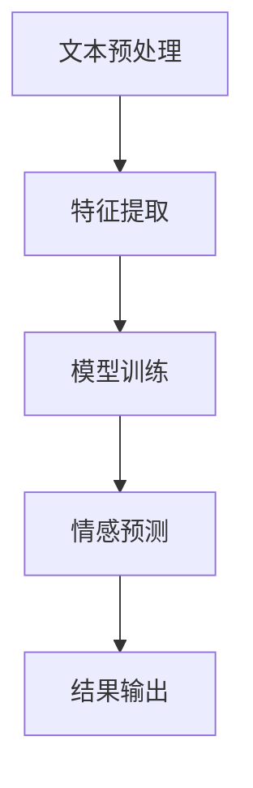

                 

# 提示词工程在情感分析中的精准应用

## 关键词
情感分析，提示词工程，文本处理，机器学习，算法优化

## 摘要
本文深入探讨了提示词工程在情感分析中的应用，首先介绍了情感分析和提示词工程的基本概念和重要性。随后，通过算法原理讲解、数学模型和公式推导，以及系统架构设计和项目实战，详细阐述了如何通过提示词工程实现情感分析的高效和精准。最后，本文总结了一些最佳实践，并提供了一些建议和拓展阅读，以供读者深入学习和应用。

### 1. 目录大纲整体框架设计

为了使读者更好地理解提示词工程在情感分析中的应用，本文设计了以下目录结构：

#### 第一部分：背景介绍
- **第1章：情感分析与提示词工程概述**
  - **1.1 问题背景**
  - **1.2 问题描述**
  - **1.3 问题解决**
  - **1.4 边界与外延**
  - **1.5 概念结构与核心要素组成**

#### 第二部分：核心概念与联系
- **第2章：提示词工程原理**
  - **2.1 提示词工程定义**
  - **2.2 提示词工程特点**
  - **2.3 情感分析相关概念**
  - **2.4 提示词工程与情感分析关系图**

#### 第三部分：算法原理讲解
- **第3章：情感分析常用算法**
  - **3.1 算法概述**
  - **3.2 提示词工程在算法中的作用**
  - **3.3 算法流程图**
  - **3.4 数学模型与公式讲解**
  - **3.5 举例说明**

#### 第四部分：数学模型和数学公式
- **第4章：情感分析数学模型**
  - **4.1 情感分析模型概述**
  - **4.2 模型公式详细讲解**
  - **4.3 实例分析**

#### 第五部分：系统分析与架构设计
- **第5章：情感分析系统设计**
  - **5.1 系统场景介绍**
  - **5.2 系统功能设计**
  - **5.3 系统架构设计**
  - **5.4 系统接口设计**
  - **5.5 系统交互设计**

#### 第六部分：项目实战
- **第6章：情感分析项目实战**
  - **6.1 环境安装**
  - **6.2 系统核心实现**
  - **6.3 代码应用解读**
  - **6.4 实际案例剖析**
  - **6.5 项目小结**

#### 第七部分：最佳实践与小结
- **第7章：最佳实践与总结**
  - **7.1 最佳实践建议**
  - **7.2 小结**
  - **7.3 注意事项**
  - **7.4 拓展阅读**

### 2. 目录层级与内容细化

在确定整体框架后，我们进一步细化每个部分的内容，确保读者能够清晰地理解各个概念和方法。

#### 第一部分：背景介绍

**第1章：情感分析与提示词工程概述**

- **1.1 问题背景**
  - 解释情感分析的应用场景和需求。
  - 提出在文本数据中提取情感信息的挑战。

- **1.2 问题描述**
  - 描述情感分析的任务，包括正面情感、负面情感和中性情感的识别。

- **1.3 问题解决**
  - 介绍提示词工程作为解决情感分析问题的一种方法。
  - 讨论提示词工程的基本原理和其在情感分析中的优势。

- **1.4 边界与外延**
  - 明确情感分析的边界条件，如语言多样性、语境复杂性等。
  - 探讨提示词工程的适用范围和外延。

- **1.5 概念结构与核心要素组成**
  - 分析情感分析和提示词工程的概念结构。
  - 确定核心要素，如情感词典、文本预处理、机器学习算法等。

#### 第二部分：核心概念与联系

**第2章：提示词工程原理**

- **2.1 提示词工程定义**
  - 定义提示词工程的含义。
  - 阐述提示词工程的核心目标和任务。

- **2.2 提示词工程特点**
  - 分析提示词工程的特性，如可扩展性、高效性、适应性等。

- **2.3 情感分析相关概念**
  - 确定与情感分析相关的基本概念，如情感极性、情感强度等。

- **2.4 提示词工程与情感分析关系图**
  - 使用 Mermaid 画出提示词工程与情感分析的关系图。
  - 解释各个节点和连接线的作用和意义。

#### 第三部分：算法原理讲解

**第3章：情感分析常用算法**

- **3.1 算法概述**
  - 介绍情感分析的基本算法，如基于规则的方法、机器学习方法等。

- **3.2 提示词工程在算法中的作用**
  - 讨论提示词工程如何应用于不同的情感分析算法中。
  - 分析提示词工程对算法性能的影响。

- **3.3 算法流程图**
  - 使用 Mermaid 画出情感分析算法的流程图，展示从文本预处理到结果输出的全过程。

- **3.4 数学模型与公式讲解**
  - 阐述情感分析中的数学模型，如贝叶斯分类器、支持向量机等。
  - 使用 LaTeX 公式详细解释模型中的参数和计算过程。

- **3.5 举例说明**
  - 提供具体的情感分析案例，使用 Python 源代码展示算法的实现过程。
  - 分析案例结果，探讨提示词工程的应用效果。

#### 第四部分：数学模型和数学公式

**第4章：情感分析数学模型**

- **4.1 情感分析模型概述**
  - 概述情感分析中常用的数学模型，如朴素贝叶斯、逻辑回归等。

- **4.2 模型公式详细讲解**
  - 使用 LaTeX 公式详细解释每个模型的公式。
  - 分析公式中的参数和变量。

- **4.3 实例分析**
  - 提供具体实例，使用 Python 源代码实现模型。
  - 分析实例结果，探讨模型的适用性和效果。

#### 第五部分：系统分析与架构设计

**第5章：情感分析系统设计**

- **5.1 系统场景介绍**
  - 介绍情感分析系统的应用场景，如社交媒体分析、客户反馈处理等。

- **5.2 系统功能设计**
  - 设计情感分析系统的功能模块，如文本预处理、情感分类、结果输出等。

- **5.3 系统架构设计**
  - 使用 Mermaid 画出系统架构图，展示各个模块之间的关系。

- **5.4 系统接口设计**
  - 设计系统接口，包括输入接口和输出接口。

- **5.5 系统交互设计**
  - 使用 Mermaid 画出系统交互序列图，展示系统各个模块的交互过程。

#### 第六部分：项目实战

**第6章：情感分析项目实战**

- **6.1 环境安装**
  - 指导读者如何搭建情感分析项目所需的开发环境。

- **6.2 系统核心实现**
  - 提供系统核心实现的源代码，并解释代码的功能。

- **6.3 代码应用解读**
  - 分析代码中的关键部分，解释其工作原理。

- **6.4 实际案例剖析**
  - 通过具体案例展示如何使用系统进行情感分析。

- **6.5 项目小结**
  - 总结项目经验，探讨项目的优缺点。

#### 第七部分：最佳实践与小结

**第7章：最佳实践与总结**

- **7.1 最佳实践建议**
  - 提供一些实际操作中的最佳实践，帮助读者提高情感分析的效果。

- **7.2 小结**
  - 总结文章的主要内容和关键点。

- **7.3 注意事项**
  - 提醒读者在应用提示词工程和情感分析时需要注意的事项。

- **7.4 拓展阅读**
  - 推荐一些相关领域的文献和资源，供读者进一步学习。

### 3. 实例展示

为了更好地展示如何细化内容，以下是一个具体的章节实例，以第3章“情感分析常用算法”为例。

#### 第3章：情感分析常用算法

**3.1 算法概述**

情感分析算法是用于从文本中提取情感信息的方法。常见的情感分析算法包括基于规则的方法和机器学习方法。基于规则的方法主要依赖于手工设计的规则，如词典匹配和模式匹配。而机器学习方法则通过训练模型来自动识别情感。

**3.2 提示词工程在算法中的作用**

提示词工程是情感分析中的一个重要组成部分，它通过识别和提取文本中的关键提示词，来提高情感分析的准确性和效率。提示词工程在情感分析算法中的作用包括：

- **特征提取**：提示词工程可以帮助提取文本中的关键特征，为后续的机器学习算法提供有效的输入。
- **降低维度**：通过提取关键提示词，可以减少文本数据的维度，降低计算复杂度。
- **增强准确性**：选择合适的提示词可以增强模型的准确性，使模型更好地捕捉文本中的情感信息。

**3.3 算法流程图**

以下是一个典型的情感分析算法流程图：



**3.4 数学模型与公式讲解**

情感分析中常用的数学模型包括朴素贝叶斯、逻辑回归和支持向量机等。以下以朴素贝叶斯模型为例进行讲解。

**3.4.1 朴素贝叶斯模型**

朴素贝叶斯模型是基于贝叶斯定理的一种概率分类器。其公式如下：

$$
P(\text{类别}|\text{特征}) = \frac{P(\text{特征}|\text{类别})P(\text{类别})}{P(\text{特征})}
$$

其中，$P(\text{类别}|\text{特征})$ 表示给定特征的情况下，类别出现的概率；$P(\text{特征}|\text{类别})$ 表示在某个类别下，特征出现的概率；$P(\text{类别})$ 表示类别本身出现的概率。

**3.4.2 参数计算**

朴素贝叶斯模型的参数计算包括：

- **先验概率**：$P(\text{类别})$ 可以通过训练数据统计得到，例如，在训练数据中正面评论占比为60%，则$P(\text{正面}) = 0.6$。
- **条件概率**：$P(\text{特征}|\text{类别})$ 可以通过训练数据统计得到，例如，在正面评论中，出现“喜欢”的词的概率为0.2。

**3.4.3 分类决策**

给定一个新的评论，可以通过计算其属于每个类别的概率，选择概率最大的类别作为分类结果。

**3.5 举例说明**

以下是一个简单的情感分析案例：

```python
import numpy as np
from sklearn.model_selection import train_test_split
from sklearn.naive_bayes import MultinomialNB
from sklearn.metrics import accuracy_score

# 训练数据
X = np.array([
    ["我喜欢这个产品", "正面"],
    ["这个产品不好用", "负面"],
    ["我觉得这个产品不错", "正面"],
    ["我不喜欢这个产品", "负面"]
])

y = np.array([0, 1, 0, 1])

# 划分训练集和测试集
X_train, X_test, y_train, y_test = train_test_split(X[:, 0], y, test_size=0.2, random_state=42)

# 训练模型
model = MultinomialNB()
model.fit(X_train, y_train)

# 预测测试集
y_pred = model.predict(X_test)

# 模型评估
accuracy = accuracy_score(y_test, y_pred)
print(f"模型准确率：{accuracy}")
```

在这个案例中，我们使用朴素贝叶斯模型对训练数据进行训练，然后使用测试数据对模型进行评估。通过计算准确率，我们可以评估模型的性能。

### 4. 完整性要求

#### 背景介绍

在背景介绍部分，我们需要详细阐述情感分析和提示词工程的定义、应用场景、挑战和重要性。以下是具体的细分内容：

- **核心概念术语说明**：解释情感分析、提示词工程等关键术语的含义。
- **问题背景**：介绍情感分析和提示词工程在现代社会中的重要性，如社交媒体分析、客户反馈处理等。
- **问题描述**：描述情感分析和提示词工程在实际应用中面临的挑战，如文本数据的多样性、语境复杂性等。
- **问题解决**：讨论提示词工程如何解决情感分析中的问题，提高分析的准确性和效率。
- **边界与外延**：明确情感分析和提示词工程的边界条件，如语言多样性、语境复杂性等。
- **概念结构与核心要素组成**：分析情感分析和提示词工程的概念结构，确定核心要素，如情感词典、文本预处理、机器学习算法等。

#### 核心概念与联系

在核心概念与联系部分，我们需要详细讨论提示词工程和情感分析的核心概念、原理和它们之间的关系。以下是具体的细分内容：

- **提示词工程定义**：解释提示词工程的含义，包括其目标和任务。
- **提示词工程特点**：分析提示词工程的特性，如可扩展性、高效性、适应性等。
- **情感分析相关概念**：确定与情感分析相关的基本概念，如情感极性、情感强度等。
- **提示词工程与情感分析关系图**：使用 Mermaid 画出提示词工程与情感分析的关系图，展示各个概念之间的联系。

#### 算法原理讲解

在算法原理讲解部分，我们需要详细阐述情感分析中常用的算法原理，以及提示词工程在这些算法中的应用。以下是具体的细分内容：

- **算法概述**：介绍情感分析的基本算法，如基于规则的方法、机器学习方法等。
- **提示词工程在算法中的作用**：讨论提示词工程如何应用于不同的情感分析算法中，提高算法的准确性。
- **算法流程图**：使用 Mermaid 画出情感分析算法的流程图，展示从文本预处理到结果输出的全过程。
- **数学模型与公式讲解**：阐述情感分析中的数学模型，如朴素贝叶斯、逻辑回归等，并使用 LaTeX 公式详细解释模型中的参数和计算过程。
- **举例说明**：提供具体的情感分析案例，使用 Python 源代码展示算法的实现过程，并分析案例结果，探讨提示词工程的应用效果。

#### 数学模型和数学公式

在数学模型和数学公式部分，我们需要详细讲解情感分析中使用的数学模型和公式，并使用 LaTeX 进行表示。以下是具体的细分内容：

- **情感分析模型概述**：概述情感分析中常用的数学模型，如朴素贝叶斯、逻辑回归等。
- **模型公式详细讲解**：使用 LaTeX 公式详细解释每个模型的公式，并分析公式中的参数和变量。
- **实例分析**：提供具体实例，使用 Python 源代码实现模型，并分析实例结果，探讨模型的适用性和效果。

#### 系统分析与架构设计

在系统分析与架构设计部分，我们需要详细描述一个典型的情感分析系统的架构设计，包括系统功能、架构和接口设计。以下是具体的细分内容：

- **问题场景介绍**：介绍情感分析系统的应用场景，如社交媒体分析、客户反馈处理等。
- **系统功能设计**：设计情感分析系统的功能模块，如文本预处理、情感分类、结果输出等。
- **系统架构设计**：使用 Mermaid 画出系统架构图，展示各个模块之间的关系。
- **系统接口设计**：设计系统接口，包括输入接口和输出接口。
- **系统交互设计**：使用 Mermaid 画出系统交互序列图，展示系统各个模块的交互过程。

#### 项目实战

在项目实战部分，我们需要通过一个实际项目展示如何应用提示词工程进行情感分析。以下是具体的细分内容：

- **环境安装**：指导读者如何搭建情感分析项目所需的开发环境。
- **系统核心实现**：提供系统核心实现的源代码，并解释代码的功能。
- **代码应用解读**：分析代码中的关键部分，解释其工作原理。
- **实际案例剖析**：通过具体案例展示如何使用系统进行情感分析。
- **项目小结**：总结项目经验，探讨项目的优缺点。

#### 最佳实践与小结

在最佳实践与小结部分，我们需要总结文章的主要内容和关键点，并提供一些最佳实践建议。以下是具体的细分内容：

- **最佳实践建议**：提供一些实际操作中的最佳实践，帮助读者提高情感分析的效果。
- **小结**：总结文章的主要内容和关键点。
- **注意事项**：提醒读者在应用提示词工程和情感分析时需要注意的事项。
- **拓展阅读**：推荐一些相关领域的文献和资源，供读者进一步学习。

