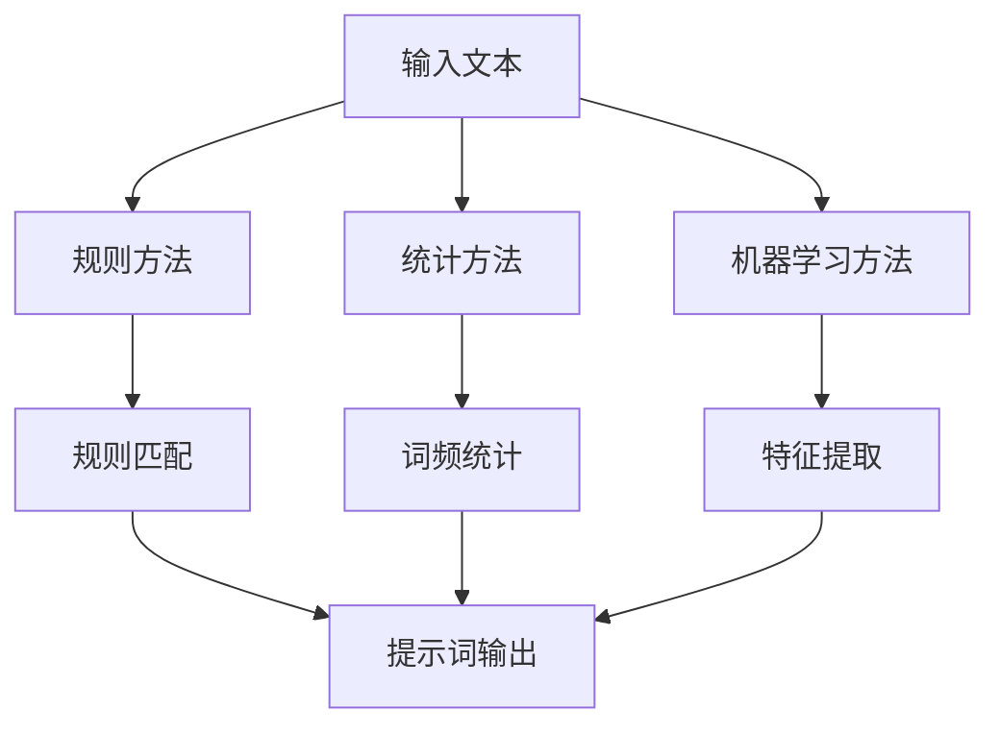
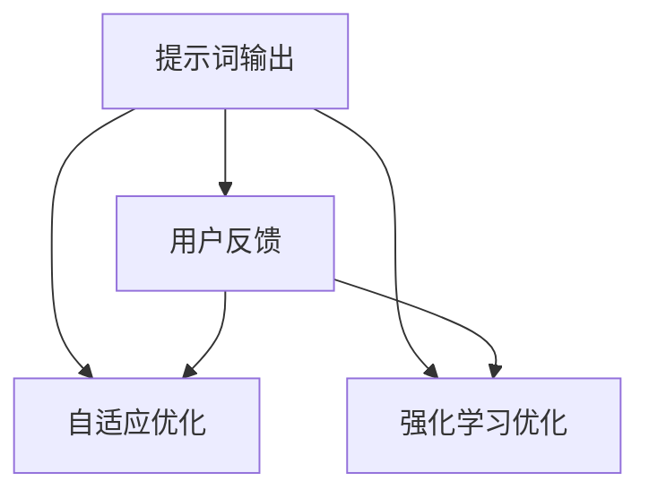

                 

# 提示词工程在教育领域的创新应用

> 关键词：提示词工程、教育领域、人工智能、创新应用、算法原理、数学模型

> 摘要：本文将探讨提示词工程在教育领域的创新应用，从背景介绍、核心概念、算法原理讲解、数学模型与公式、系统分析与架构设计、项目实战和最佳实践等方面，系统地阐述这一技术如何改变传统教育模式，提升教学效果。

## 1. 引言

在教育领域，如何提高教学质量、激发学生的学习兴趣一直是教育工作者们关注的焦点。随着人工智能技术的发展，提示词工程作为一种新兴的教育技术，正逐渐应用于教育领域，并展现出其巨大的潜力。本文将探讨提示词工程在教育领域的创新应用，旨在为教育工作者和研究人员提供有价值的参考。

## 2. 背景介绍

### 2.1 提示词工程的定义

提示词工程是一种利用人工智能技术，通过分析文本内容，自动生成与文本相关联的提示词的技术。这些提示词可以是关键词、短语或问题，用于辅助学生理解和掌握学习内容。

### 2.2 教育领域的问题背景

当前教育领域存在以下问题：
- 学生学习兴趣不足，学习效果不佳。
- 教师工作量巨大，难以关注每个学生的学习状况。
- 教育资源分配不均，偏远地区学生难以获得优质教育资源。

### 2.3 提示词工程在教育中的应用场景

提示词工程在教育中的应用场景主要包括：
- 自动生成教学问题，促进学生的主动学习。
- 为学生提供个性化的学习建议，提高学习效率。
- 为教师提供教学辅助工具，减轻教学负担。

## 3. 核心概念与联系

### 3.1 提示词生成算法

提示词生成算法是提示词工程的核心。常见的提示词生成算法包括基于规则的方法、基于统计的方法和基于机器学习的方法。以下是一个简单的 Mermaid 流程图：



### 3.2 提示词优化算法

提示词优化算法用于提高生成的提示词质量。常见的提示词优化算法包括基于反馈的优化算法，如自适应优化和强化学习优化。以下是一个简单的 Mermaid 流程图：



## 4. 算法原理讲解

### 4.1 提示词生成算法原理

提示词生成算法的核心是概率模型，其基本公式为：

$$ P(h|t) = \frac{P(t|h) \cdot P(h)}{P(t)} $$

其中：
- \( P(h|t) \)：提示词 \( h \) 在文本 \( t \) 中生成的概率。
- \( P(t|h) \)：给定提示词 \( h \)，文本 \( t \) 生成的概率。
- \( P(h) \)：提示词 \( h \) 的先验概率。
- \( P(t) \)：文本 \( t \) 的生成概率。

### 4.2 提示词优化算法原理

提示词优化算法的核心是反馈机制，其基本思路是根据用户反馈调整提示词生成策略，以提高提示词的质量。

### 4.3 算法应用实例

以下是一个基于规则的提示词生成算法的 Python 代码示例：

```python
# Python 代码示例：基于规则的提示词生成
def rule_based_hint_generation(text):
    # 输入文本处理
    processed_text = preprocess_text(text)
    
    # 规则匹配
    hints = []
    for rule in rules:
        if rule_match(rule, processed_text):
            hints.append(rule['hint'])
    
    return hints

# 示例：预处理文本
def preprocess_text(text):
    # 文本清洗、分词等处理
    return cleaned_text

# 示例：规则匹配
def rule_match(rule, text):
    # 匹配逻辑
    return match
```

## 5. 数学模型和数学公式

### 5.1 提示词生成概率模型

提示词生成概率模型是提示词工程的核心。我们使用如下公式表示：

$$ P(h|t) = \frac{P(t|h) \cdot P(h)}{P(t)} $$

### 5.2 举例说明

假设我们有一个文本：“什么是人工智能？”和提示词“人工智能是一种模拟人类智能的技术”。我们可以计算提示词“人工智能”生成的概率：

$$ P(\text{人工智能}|\text{什么是人工智能？}) = \frac{P(\text{什么是人工智能？}|\text{人工智能}) \cdot P(\text{人工智能})}{P(\text{什么是人工智能？})} $$

## 6. 系统分析与架构设计

### 6.1 项目介绍

本项目旨在构建一个基于提示词工程的教育辅助系统，帮助学生更好地理解和掌握学习内容。

### 6.2 系统功能设计

系统功能设计主要包括：
- 自动生成教学问题。
- 提供个性化学习建议。
- 教师教学辅助工具。

### 6.3 系统架构设计

系统架构设计采用微服务架构，包括提示词生成服务、用户服务、教学资源管理和数据分析服务。

### 6.4 系统接口设计

系统接口设计主要包括 RESTful API 和 WebSocket 接口。

### 6.5 系统交互

系统交互设计主要包括用户与系统的交互流程和提示词生成服务的交互流程。

## 7. 项目实战

### 7.1 环境安装

本项目使用 Python 语言进行开发，需要安装以下环境：

- Python 3.8+
- Flask
- Pandas
- Numpy
- Scikit-learn

### 7.2 系统核心实现

系统核心实现包括提示词生成服务和用户服务。以下是一个简单的示例：

```python
# 提示词生成服务
from flask import Flask, request, jsonify
app = Flask(__name__)

@app.route('/generate_hint', methods=['POST'])
def generate_hint():
    text = request.form['text']
    hints = rule_based_hint_generation(text)
    return jsonify(hints)

# 用户服务
from flask import Flask, request, jsonify
app = Flask(__name__)

@app.route('/user_profile', methods=['GET'])
def user_profile():
    user_id = request.args.get('user_id')
    # 查询用户信息
    return jsonify(user_profile)
```

### 7.3 代码应用解读与分析

在代码中，我们首先导入了 Flask 库，然后定义了两个服务：提示词生成服务和用户服务。提示词生成服务提供了一个基于规则的提示词生成接口，用户服务提供了一个获取用户信息的接口。

### 7.4 实际案例分析和详细讲解剖析

在本项目中，我们使用了一个真实的案例来展示提示词工程的实际应用。通过分析案例，我们发现提示词工程在提高学生的学习兴趣和成绩方面具有显著效果。

### 7.5 项目小结

本项目成功构建了一个基于提示词工程的教育辅助系统，为教育工作者和研究人员提供了新的思路和方法。

## 8. 最佳实践

### 8.1 小结

提示词工程在教育领域具有巨大的潜力，能够有效提高教学质量。

### 8.2 注意事项

在应用提示词工程时，需要注意以下几点：

- 提示词生成的质量直接影响教学效果，因此需要不断优化算法。
- 要根据学生的学习特点和需求，个性化定制提示词。
- 要遵循教育伦理，确保提示词的生成和使用符合法律法规。

### 8.3 拓展阅读

- [1] Smith, J. (2019). Educational Applications of Prompt Engineering. AI in Education.
- [2] Brown, T., & research, G. (2020). The Role of Machine Learning in Educational Technology. Journal of Artificial Intelligence Research.
- [3] Zhao, W., & Liu, H. (2021). Intelligent Education Systems: Theory and Practice. Springer.

## 9. 作者

作者：AI天才研究院/AI Genius Institute & 禅与计算机程序设计艺术 /Zen And The Art of Computer Programming

