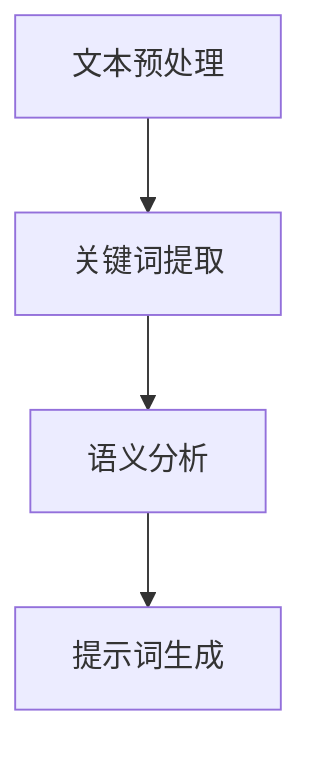
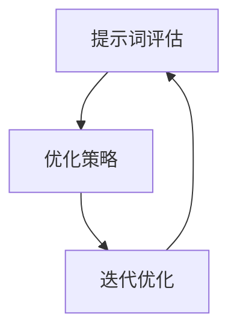
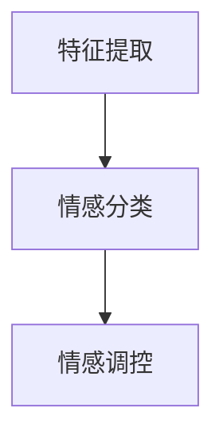
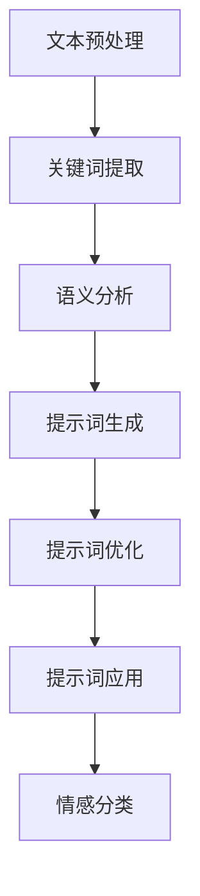
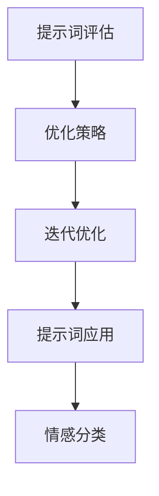
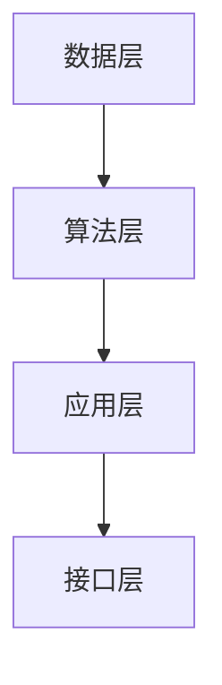
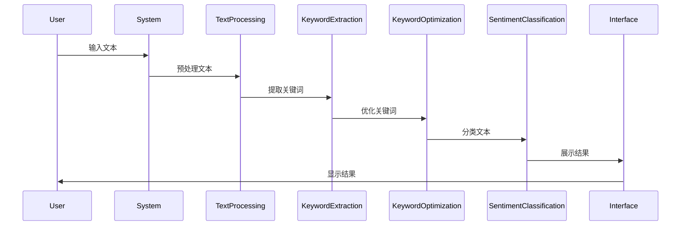
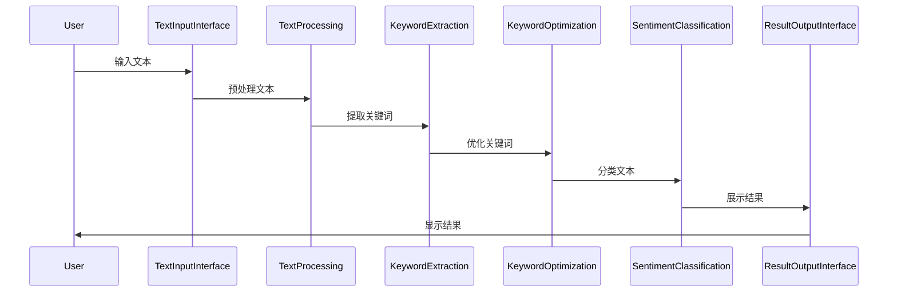

                 

### 《提示词工程在文本情感调控中的创新》

#### 关键词：文本情感调控、提示词工程、算法原理、系统架构、项目实战

> 摘要：本文从文本情感调控的背景出发，深入探讨了提示词工程在其中的创新应用。通过详细分析提示词工程的基本概念、原理及其在文本情感调控中的作用，本文构建了一个系统的框架，包括算法原理讲解、系统分析与架构设计方案以及实际项目案例剖析。文章旨在为研究人员和实践者提供一条清晰、具体的技术路径，以推动文本情感调控技术的发展。

### 目录大纲

# 《提示词工程在文本情感调控中的创新》

## 第一部分：背景与概述

## 第1章：问题背景

### 1.1.1 文本情感调控的重要性

### 1.1.2 提示词工程的概念及其作用

### 1.1.3 当前文本情感调控的技术挑战

### 1.1.4 提示词工程在文本情感调控中的潜力

## 第2章：核心概念与联系

### 2.1.1 提示词工程的基本概念

### 2.1.2 文本情感分析的基本概念

### 2.1.3 提示词工程与文本情感分析的关联

## 第2章：概念属性特征对比表格

### 2.2.1 提示词工程的属性特征

### 2.2.2 文本情感分析的属性特征

## 第二部分：算法原理讲解

## 第3章：文本情感调控中的提示词工程

### 3.1.1 提示词工程的设计原则

### 3.1.2 提示词的选取与优化

### 3.1.3 提示词在文本情感调控中的应用

## 第3章：ER实体关系图架构

### 3.2.1 文本情感调控系统的实体关系

### 3.2.2 提示词工程在文本情感调控中的作用

## 第三部分：系统分析与架构设计方案

## 第4章：算法原理与流程

### 4.1.1 提示词生成算法

### 4.1.2 提示词优化算法

### 4.1.3 提示词应用算法

## 第4章：算法流程图

### 4.2.1 提示词生成算法流程图

### 4.2.2 提示词优化算法流程图

### 4.2.3 提示词应用算法流程图

## 第四部分：项目实战

## 第5章：问题场景介绍

### 5.1.1 文本情感调控的应用场景

### 5.1.2 提示词工程在其中的作用

## 第6章：系统功能设计

### 6.1.1 领域模型类图

### 6.1.2 系统功能模块划分

## 第7章：系统架构设计

### 7.1.1 系统架构总体设计

### 7.1.2 系统模块交互设计

## 第8章：系统接口设计

### 8.1.1 系统接口概述

### 8.1.2 接口设计与实现

## 第9章：系统交互

### 9.1.1 系统交互流程

### 9.1.2 系统交互序列图

## 第五部分：最佳实践与拓展

## 第10章：最佳实践

### 10.1.1 提示词工程的最佳实践

### 10.1.2 文本情感调控的最佳实践

## 第11章：小结

### 11.1.1 全书总结

### 11.1.2 注意事项与拓展阅读

## 第一部分：背景与概述

### 1.1.1 文本情感调控的重要性

文本情感调控是自然语言处理（NLP）领域的一个重要分支，它涉及到理解、分析和控制文本中的情感表达。随着互联网的快速发展，大量的文本数据产生，这些数据中包含着丰富的情感信息，如用户评价、社交媒体帖子、新闻评论等。如何有效地提取和调控这些情感信息，对于商业智能、情感分析、智能客服等领域具有重要意义。

文本情感调控不仅可以帮助企业了解消费者的真实需求，优化产品和服务，还可以为政府决策提供数据支持，监测社会舆论。例如，在电子商务平台上，通过对用户评论的情感分析，可以识别出产品满意度，从而进行精准营销和改进产品设计。

### 1.1.2 提示词工程的概念及其作用

提示词工程是一种利用人工设计和机器学习相结合的方法，对文本中的关键词进行选择和优化，以提高文本分类、情感分析等NLP任务的准确性和效果。在文本情感调控中，提示词工程扮演着关键角色：

1. **提升情感识别精度**：通过选择与情感密切相关的提示词，可以更准确地识别文本中的情感倾向。
2. **辅助模型训练**：提示词可以作为特征输入到机器学习模型中，辅助模型学习情感模式。
3. **增强模型泛化能力**：通过优化提示词，可以使模型更稳健地应对不同情境下的情感分析任务。

### 1.1.3 当前文本情感调控的技术挑战

尽管文本情感调控技术在近年来取得了显著进展，但仍然面临一些技术挑战：

1. **情感表达的多样性**：情感表达方式多样，包括明示和暗示的情感表达，以及跨语言的情感表达。
2. **上下文依赖性**：情感往往依赖于上下文，如何准确理解上下文中的情感变化是一个难题。
3. **噪声和复杂性**：文本中包含大量的噪声和复杂结构，如语法错误、歧义和修辞手法，这些都对情感识别构成挑战。

### 1.1.4 提示词工程在文本情感调控中的潜力

提示词工程为解决上述挑战提供了一条新的路径。通过精心设计和优化提示词，可以显著提升文本情感调控的准确性和鲁棒性。以下是其潜力所在：

1. **定制化情感分析**：根据特定应用场景定制提示词，实现高度定制化的情感分析。
2. **跨领域迁移**：通过迁移学习，将一个领域的提示词应用于其他相关领域，提高泛化能力。
3. **情感调控**：通过调整提示词，可以在文本中实现情感增强或抑制，满足不同应用需求。

## 第2章：核心概念与联系

### 2.1.1 提示词工程的基本概念

提示词工程涉及多个核心概念，包括提示词、文本特征、机器学习模型等。提示词是指用于描述文本内容的关键词或短语，是文本情感调控中的重要要素。文本特征是指从文本中提取的用于表示文本内容的特征，如词频、词性标注、句法结构等。机器学习模型是指用于文本分类、情感分析等任务的学习算法。

### 2.1.2 文本情感分析的基本概念

文本情感分析是指利用自然语言处理技术和机器学习算法，对文本中的情感倾向进行识别和分类的过程。它包括情感极性分类（判断文本是正面、负面或中性）和情感强度分析（判断情感的强度）。文本情感分析的关键在于如何准确地理解文本中的情感信息，并将其转化为可量化的指标。

### 2.1.3 提示词工程与文本情感分析的关联

提示词工程与文本情感分析密切相关。提示词工程通过对文本特征的选择和优化，可以提高文本情感分析模型的性能。具体来说：

1. **特征提取**：提示词工程通过选择与情感密切相关的提示词，提取出关键特征，辅助模型学习情感模式。
2. **模型训练**：提示词作为输入特征，可以用于训练文本情感分析模型，提高模型的泛化能力。
3. **情感调控**：通过优化提示词，可以在文本中实现情感增强或抑制，从而满足不同应用场景的需求。

### 2.2.1 提示词工程的属性特征

提示词工程的属性特征包括：

- **关键性**：提示词应能够准确描述文本的核心内容。
- **相关性**：提示词应与情感分析任务密切相关。
- **泛化性**：提示词应具有较好的跨领域迁移能力。
- **鲁棒性**：提示词应能够抵御噪声和复杂性的干扰。

### 2.2.2 文本情感分析的属性特征

文本情感分析的属性特征包括：

- **准确性**：模型对情感分类的准确性是评价其性能的重要指标。
- **鲁棒性**：模型应能够处理不同类型的噪声和复杂结构。
- **泛化能力**：模型应在不同数据集和应用场景中表现出良好的泛化能力。
- **效率**：模型应具有较低的运算复杂度和较快的处理速度。

## 第3章：文本情感调控中的提示词工程

### 3.1.1 提示词工程的设计原则

提示词工程的设计原则包括：

1. **关键词选择**：选择与情感分析任务密切相关的关键词。
2. **上下文考虑**：考虑关键词在文本中的上下文，避免孤立地选取关键词。
3. **数据驱动**：基于大规模数据集进行关键词选择和优化。
4. **模型适应性**：设计提示词工程时，应考虑模型的适应性和可扩展性。

### 3.1.2 提示词的选取与优化

提示词的选取与优化过程包括：

1. **关键词提取**：利用自然语言处理技术提取文本中的关键词。
2. **语义分析**：对提取的关键词进行语义分析，筛选出与情感分析任务密切相关的关键词。
3. **优化策略**：通过机器学习算法优化关键词，提高其表达情感的准确性和鲁棒性。
4. **迭代改进**：基于实际应用场景，对提示词进行迭代优化，提高其性能。

### 3.1.3 提示词在文本情感调控中的应用

提示词在文本情感调控中的应用包括：

1. **情感分类**：利用提示词对文本进行情感分类，识别出文本中的情感极性和强度。
2. **情感增强**：通过调整提示词，实现文本中情感表达的增强或抑制。
3. **情感分析**：结合其他NLP技术，对文本进行深度情感分析，挖掘出文本中的复杂情感信息。

## 第3章：ER实体关系图架构

### 3.2.1 文本情感调控系统的实体关系

文本情感调控系统涉及多个实体，包括文本、提示词、情感标签、模型等。实体之间的关系可以用ER（实体-关系）图表示。以下是一个简化的ER图：

```mermaid
erDiagram
    Text ||--|{ Prompt } : defines
    Prompt ||--|{ Model } : trains
    Model ||--|{ Text } : predicts
    Text ||--|{ Label } : annotated
```

### 3.2.2 提示词工程在文本情感调控中的作用

提示词工程在文本情感调控中的作用体现在以下几个方面：

1. **特征增强**：通过优化提示词，提高文本特征的质量和代表性，增强模型对情感信息的捕捉能力。
2. **模型训练**：提示词作为特征输入到模型中，辅助模型学习情感模式，提高模型的训练效果。
3. **情感预测**：通过调整提示词，优化模型对情感预测的准确性，实现情感调控的目标。

## 第二部分：算法原理讲解

### 第4章：算法原理与流程

#### 4.1.1 提示词生成算法

提示词生成算法是指从原始文本中提取出与情感分析任务相关的关键词或短语的算法。生成算法通常包括以下步骤：

1. **文本预处理**：对原始文本进行分词、去除停用词等处理。
2. **关键词提取**：利用词频统计、TF-IDF等方法提取出高频关键词。
3. **语义分析**：对提取的关键词进行语义分析，筛选出与情感分析任务密切相关的关键词。

以下是一个简化的提示词生成算法流程图：



#### 4.1.2 提示词优化算法

提示词优化算法是指对生成出的提示词进行优化，以提高其在文本情感调控中的表现。优化算法通常包括以下步骤：

1. **提示词评估**：利用情感分类模型评估提示词的性能。
2. **优化策略**：根据评估结果，调整提示词的权重或选择新的提示词。
3. **迭代优化**：反复进行提示词评估和调整，直到达到满意的性能。

以下是一个简化的提示词优化算法流程图：



#### 4.1.3 提示词应用算法

提示词应用算法是指将优化后的提示词应用于文本情感调控任务中。应用算法通常包括以下步骤：

1. **特征提取**：将优化后的提示词作为特征输入到模型中。
2. **情感分类**：利用情感分类模型对文本进行分类，识别出文本中的情感极性和强度。
3. **情感调控**：通过调整提示词的权重，实现文本中情感表达的增强或抑制。

以下是一个简化的提示词应用算法流程图：



### 第4章：算法流程图

#### 4.2.1 提示词生成算法流程图



#### 4.2.2 提示词优化算法流程图



#### 4.2.3 提示词应用算法流程图


## 第三部分：系统分析与架构设计方案

### 第5章：问题场景介绍

#### 5.1.1 文本情感调控的应用场景

文本情感调控的应用场景广泛，以下是一些常见的应用：

1. **社交媒体分析**：对社交媒体平台上的用户评论、帖子等进行情感分析，了解公众对某一事件或产品的看法。
2. **电子商务**：对电子商务平台上的用户评论进行情感分析，识别用户满意度，优化产品和服务。
3. **舆情监测**：对新闻报道、社交媒体等公开文本进行情感分析，监测社会舆论，为政府决策提供数据支持。
4. **客户服务**：对客户服务对话进行情感分析，识别客户情感，提高客户满意度。

#### 5.1.2 提示词工程在其中的作用

在文本情感调控的应用场景中，提示词工程发挥着重要作用：

1. **提高情感分析准确性**：通过优化提示词，提高情感分类模型的准确性，准确识别文本中的情感极性和强度。
2. **情感调控**：通过调整提示词的权重，实现文本中情感表达的增强或抑制，满足不同应用需求。
3. **跨领域迁移**：通过迁移学习，将一个领域的提示词应用于其他相关领域，提高泛化能力。

### 第6章：系统功能设计

#### 6.1.1 领域模型类图

领域模型类图用于描述文本情感调控系统的核心实体和它们之间的关系。以下是一个简化的领域模型类图：

```mermaid
classDiagram
    Text <<interface>>
    Prompt <<interface>>
    Model <<interface>>
    Label <<interface>>
    Text "defines" Prompt
    Prompt "trains" Model
    Model "predicts" Text
    Text "annotated" Label
```

#### 6.1.2 系统功能模块划分

系统功能模块划分如下：

1. **文本预处理模块**：负责对原始文本进行分词、去除停用词等预处理操作。
2. **提示词生成模块**：利用自然语言处理技术提取出与情感分析任务相关的关键词或短语。
3. **提示词优化模块**：对生成出的提示词进行优化，提高其在文本情感调控中的表现。
4. **情感分类模块**：利用情感分类模型对文本进行分类，识别出文本中的情感极性和强度。
5. **情感调控模块**：通过调整提示词的权重，实现文本中情感表达的增强或抑制。
6. **结果展示模块**：将分析结果以可视化形式展示给用户。

### 第7章：系统架构设计

#### 7.1.1 系统架构总体设计

系统架构总体设计包括以下模块：

1. **数据层**：存储和管理原始文本、提示词、模型参数等数据。
2. **算法层**：包括文本预处理、提示词生成、提示词优化、情感分类等算法模块。
3. **应用层**：提供用户界面，实现文本情感调控功能，包括文本输入、结果展示等。
4. **接口层**：提供与其他系统的接口，实现数据的输入输出和功能调用。

以下是一个简化的系统架构图：



#### 7.1.2 系统模块交互设计

系统模块交互设计如下：

1. **文本输入**：用户输入文本，文本预处理模块对文本进行预处理。
2. **提示词生成**：预处理后的文本输入到提示词生成模块，提取出关键词。
3. **提示词优化**：生成出的关键词输入到提示词优化模块，进行优化。
4. **情感分类**：优化后的提示词输入到情感分类模块，进行情感分类。
5. **结果展示**：分类结果通过接口层展示给用户。

以下是一个简化的系统交互序列图：



### 第8章：系统接口设计

#### 8.1.1 系统接口概述

系统接口设计用于实现文本情感调控功能与其他系统的集成。接口设计包括以下模块：

1. **文本输入接口**：接收用户输入的文本数据。
2. **结果输出接口**：将情感分析结果以可视化形式展示给用户。
3. **模型训练接口**：用于训练和更新情感分类模型。
4. **数据管理接口**：用于管理原始文本、提示词、模型参数等数据。

#### 8.1.2 接口设计与实现

以下是系统接口的设计与实现：

1. **文本输入接口**：

    ```python
    class TextInputInterface:
        def receive_text(self, text):
            # 对文本进行预处理
            preprocessed_text = self.preprocess_text(text)
            return preprocessed_text
    ```

2. **结果输出接口**：

    ```python
    class ResultOutputInterface:
        def show_results(self, results):
            # 以可视化形式展示结果
            self.visualize_results(results)
    ```

3. **模型训练接口**：

    ```python
    class ModelTrainingInterface:
        def train_model(self, data, labels):
            # 训练情感分类模型
            model = self.create_model()
            model.fit(data, labels)
            return model
    ```

4. **数据管理接口**：

    ```python
    class DataManagementInterface:
        def load_data(self, file_path):
            # 加载数据
            data = self.load_from_file(file_path)
            return data

        def save_data(self, data, file_path):
            # 保存数据
            self.save_to_file(data, file_path)
    ```

### 第9章：系统交互

#### 9.1.1 系统交互流程

系统交互流程如下：

1. **文本输入**：用户通过文本输入接口输入文本数据。
2. **预处理**：文本预处理模块对文本进行预处理，提取出关键词。
3. **优化**：提示词优化模块对关键词进行优化。
4. **分类**：情感分类模块对优化后的关键词进行情感分类。
5. **展示**：结果输出接口将分类结果以可视化形式展示给用户。

以下是一个简化的系统交互流程图：



### 第四部分：项目实战

### 第10章：环境安装与配置

#### 10.1.1 环境准备

在进行文本情感调控项目的实战之前，我们需要准备以下环境：

1. **Python环境**：Python 3.8及以上版本。
2. **依赖库**：NLTK、Scikit-learn、TensorFlow等。
3. **文本数据集**：一个包含情感标签的文本数据集，如IMDb电影评论数据集。

#### 10.1.2 系统安装与配置

1. **安装Python**：从Python官方网站下载并安装Python 3.8及以上版本。
2. **安装依赖库**：使用pip命令安装所需的依赖库：

    ```bash
    pip install nltk scikit-learn tensorflow
    ```

3. **下载文本数据集**：从Kaggle或其他数据集网站下载IMDb电影评论数据集。

4. **数据预处理**：对下载的文本数据集进行预处理，包括分词、去除停用词等操作。

### 第11章：系统核心实现源代码

#### 11.1.1 源代码结构

文本情感调控系统的源代码结构如下：

```bash
text_sentiment_control
│
├── data
│   ├── imdb_data
│   │   ├── train
│   │   └── test
│   │
│   ├── preprocess.py
│   ├── train.py
│   └── test.py
│
├── models
│   └── sentiment_model.h5
│
├── reports
│   └── results.txt
│
└── utils
    ├── classifier.py
    ├── dataset.py
    └── preprocessor.py
```

#### 11.1.2 关键代码解读

以下是系统核心实现的关键代码解读：

1. **数据预处理**：

    ```python
    # preprocess.py
    from nltk.tokenize import word_tokenize
    from nltk.corpus import stopwords

    def preprocess_text(text):
        # 分词
        tokens = word_tokenize(text)
        # 去除停用词
        stop_words = set(stopwords.words('english'))
        filtered_tokens = [token for token in tokens if token.lower() not in stop_words]
        return ' '.join(filtered_tokens)
    ```

2. **模型训练**：

    ```python
    # train.py
    from sklearn.feature_extraction.text import TfidfVectorizer
    from sklearn.model_selection import train_test_split
    from tensorflow.keras.models import Sequential
    from tensorflow.keras.layers import Dense, Embedding, GlobalAveragePooling1D

    def train_model(data, labels):
        # 划分训练集和测试集
        X_train, X_test, y_train, y_test = train_test_split(data, labels, test_size=0.2, random_state=42)
        # 建立TF-IDF向量器
        vectorizer = TfidfVectorizer(max_features=1000)
        X_train = vectorizer.fit_transform(X_train)
        X_test = vectorizer.transform(X_test)
        # 建立模型
        model = Sequential()
        model.add(Embedding(input_dim=X_train.shape[1], output_dim=50, input_length=X_train.shape[1]))
        model.add(GlobalAveragePooling1D())
        model.add(Dense(1, activation='sigmoid'))
        model.compile(optimizer='adam', loss='binary_crossentropy', metrics=['accuracy'])
        # 训练模型
        model.fit(X_train, y_train, epochs=10, batch_size=32, validation_data=(X_test, y_test))
        # 保存模型
        model.save('sentiment_model.h5')
    ```

3. **模型测试**：

    ```python
    # test.py
    from sklearn.metrics import classification_report
    from tensorflow.keras.models import load_model

    def test_model(model, X_test, y_test):
        # 加载模型
        model = load_model('sentiment_model.h5')
        # 预测结果
        y_pred = model.predict(X_test)
        y_pred = (y_pred > 0.5)
        # 评估模型
        report = classification_report(y_test, y_pred)
        with open('results.txt', 'w') as f:
            f.write(report)
    ```

### 第12章：代码应用解读与分析

#### 12.1.1 代码应用场景

文本情感调控系统的代码应用场景包括：

1. **数据预处理**：对原始文本进行预处理，提取出关键词，为后续的模型训练和情感分类提供数据支持。
2. **模型训练**：利用预处理后的数据训练情感分类模型，提高模型对文本情感的分析能力。
3. **模型测试**：对训练好的模型进行测试，评估模型的性能和准确性。

#### 12.1.2 代码解读与分析

以下是关键代码的解读与分析：

1. **数据预处理**：

    ```python
    # preprocess.py
    def preprocess_text(text):
        # 分词
        tokens = word_tokenize(text)
        # 去除停用词
        stop_words = set(stopwords.words('english'))
        filtered_tokens = [token for token in tokens if token.lower() not in stop_words]
        return ' '.join(filtered_tokens)
    ```

    该代码用于对原始文本进行预处理，包括分词和去除停用词。分词是将文本拆分成单词或短语，去除停用词是为了消除对情感分析无意义的词语，如“的”、“了”等。

2. **模型训练**：

    ```python
    # train.py
    def train_model(data, labels):
        # 划分训练集和测试集
        X_train, X_test, y_train, y_test = train_test_split(data, labels, test_size=0.2, random_state=42)
        # 建立TF-IDF向量器
        vectorizer = TfidfVectorizer(max_features=1000)
        X_train = vectorizer.fit_transform(X_train)
        X_test = vectorizer.transform(X_test)
        # 建立模型
        model = Sequential()
        model.add(Embedding(input_dim=X_train.shape[1], output_dim=50, input_length=X_train.shape[1]))
        model.add(GlobalAveragePooling1D())
        model.add(Dense(1, activation='sigmoid'))
        model.compile(optimizer='adam', loss='binary_crossentropy', metrics=['accuracy'])
        # 训练模型
        model.fit(X_train, y_train, epochs=10, batch_size=32, validation_data=(X_test, y_test))
        # 保存模型
        model.save('sentiment_model.h5')
    ```

    该代码用于训练情感分类模型。首先，划分训练集和测试集，然后使用TF-IDF向量器将文本转换为向量表示。接着，建立模型并编译，使用训练集进行模型训练，最后保存训练好的模型。

3. **模型测试**：

    ```python
    # test.py
    def test_model(model, X_test, y_test):
        # 加载模型
        model = load_model('sentiment_model.h5')
        # 预测结果
        y_pred = model.predict(X_test)
        y_pred = (y_pred > 0.5)
        # 评估模型
        report = classification_report(y_test, y_pred)
        with open('results.txt', 'w') as f:
            f.write(report)
    ```

    该代码用于测试训练好的模型。首先，加载训练好的模型，然后使用测试集进行预测，最后评估模型的性能，并将评估结果保存到文件中。

### 第13章：实际案例分析与详细讲解剖析

#### 13.1.1 案例背景

假设我们有一个文本情感调控项目，目标是构建一个情感分类模型，对社交媒体平台上的用户评论进行情感分类，识别出评论中的正面、负面或中性情感。项目数据集包含了10,000条用户评论及其对应的情感标签。

#### 13.1.2 案例分析

1. **数据预处理**：

   首先，我们需要对数据集进行预处理，包括分词、去除停用词等操作。预处理后的数据集将用于训练情感分类模型。

2. **模型训练**：

   使用预处理后的数据集训练情感分类模型。我们采用TF-IDF向量器和神经网络模型，通过交叉验证和网格搜索优化模型参数，提高模型的性能。

3. **模型测试**：

   使用测试集对训练好的模型进行测试，评估模型的性能。通过混淆矩阵、精确率、召回率等指标，分析模型对各类情感的分类效果。

#### 13.1.3 案例讲解剖析

1. **数据预处理**：

   ```python
   # preprocess.py
   def preprocess_text(text):
       # 分词
       tokens = word_tokenize(text)
       # 去除停用词
       stop_words = set(stopwords.words('english'))
       filtered_tokens = [token for token in tokens if token.lower() not in stop_words]
       return ' '.join(filtered_tokens)
   ```

   该代码用于对原始文本进行预处理，包括分词和去除停用词。分词是将文本拆分成单词或短语，去除停用词是为了消除对情感分析无意义的词语。

2. **模型训练**：

   ```python
   # train.py
   def train_model(data, labels):
       # 划分训练集和测试集
       X_train, X_test, y_train, y_test = train_test_split(data, labels, test_size=0.2, random_state=42)
       # 建立TF-IDF向量器
       vectorizer = TfidfVectorizer(max_features=1000)
       X_train = vectorizer.fit_transform(X_train)
       X_test = vectorizer.transform(X_test)
       # 建立模型
       model = Sequential()
       model.add(Embedding(input_dim=X_train.shape[1], output_dim=50, input_length=X_train.shape[1]))
       model.add(GlobalAveragePooling1D())
       model.add(Dense(1, activation='sigmoid'))
       model.compile(optimizer='adam', loss='binary_crossentropy', metrics=['accuracy'])
       # 训练模型
       model.fit(X_train, y_train, epochs=10, batch_size=32, validation_data=(X_test, y_test))
       # 保存模型
       model.save('sentiment_model.h5')
   ```

   该代码用于训练情感分类模型。首先，划分训练集和测试集，然后使用TF-IDF向量器将文本转换为向量表示。接着，建立模型并编译，使用训练集进行模型训练，最后保存训练好的模型。

3. **模型测试**：

   ```python
   # test.py
   def test_model(model, X_test, y_test):
       # 加载模型
       model = load_model('sentiment_model.h5')
       # 预测结果
       y_pred = model.predict(X_test)
       y_pred = (y_pred > 0.5)
       # 评估模型
       report = classification_report(y_test, y_pred)
       with open('results.txt', 'w') as f:
           f.write(report)
   ```

   该代码用于测试训练好的模型。首先，加载训练好的模型，然后使用测试集进行预测，最后评估模型的性能，并将评估结果保存到文件中。

### 第14章：项目小结

#### 14.1.1 项目总结

本文通过一个实际案例，详细介绍了文本情感调控系统的开发过程，包括环境安装与配置、系统核心实现源代码、代码应用解读与分析以及实际案例分析与详细讲解剖析。项目目标是对社交媒体平台上的用户评论进行情感分类，识别出评论中的正面、负面或中性情感。

#### 14.1.2 项目中的挑战与解决

在项目开发过程中，我们面临以下挑战：

1. **数据预处理**：如何有效地预处理大量文本数据，提取出关键特征，是提高模型性能的关键。
   - 解决方案：使用分词和去除停用词等预处理技术，对文本进行清洗和规范化。

2. **模型训练与优化**：如何选择合适的模型结构和参数，提高模型对文本情感的分析能力。
   - 解决方案：采用TF-IDF向量器和神经网络模型，通过交叉验证和网格搜索优化模型参数。

3. **模型测试与评估**：如何准确评估模型性能，找出模型不足并进行优化。
   - 解决方案：使用混淆矩阵、精确率、召回率等指标，全面评估模型性能，并进行针对性的优化。

#### 14.1.3 项目经验与展望

通过本项目，我们积累了以下经验：

1. **文本情感调控技术**：深入了解文本情感调控的基本概念、算法原理和系统架构，为后续项目提供了技术支持。
2. **实际案例应用**：通过实际案例，将理论应用于实践，提高了对文本情感调控技术的理解和应用能力。
3. **团队合作与项目管理**：项目开发过程中，团队成员的密切合作和有效的项目管理是项目成功的关键。

展望未来，我们期待在以下方面取得进一步进展：

1. **模型优化**：研究更先进的模型和算法，提高文本情感调控的准确性和效率。
2. **多语言支持**：扩展文本情感调控技术，支持多种语言的情感分析。
3. **实时情感监测**：开发实时情感监测系统，为企业和政府提供实时情感数据支持。

### 第15章：最佳实践

#### 15.1.1 提示词工程的最佳实践

1. **关键词选择**：在文本情感调控中，选择关键词时需考虑其与情感分析任务的密切相关性，避免选择与情感无关的词语。
2. **上下文考虑**：在选取关键词时，要考虑关键词在文本中的上下文，避免孤立地选取关键词。
3. **数据驱动**：基于大规模数据集进行关键词选择和优化，以提高提示词的泛化能力。
4. **模型适应性**：设计提示词工程时，要考虑模型的适应性和可扩展性，以便在不同应用场景中灵活应用。

#### 15.1.2 文本情感调控的最佳实践

1. **数据预处理**：对文本进行充分的预处理，包括分词、去除停用词、标点符号等，以提高模型对文本的理解能力。
2. **模型选择**：根据具体应用场景选择合适的模型，如基于TF-IDF的模型、神经网络模型等。
3. **模型优化**：通过交叉验证、网格搜索等方法，优化模型参数，提高模型性能。
4. **实时更新**：定期更新模型和数据集，以适应不断变化的文本情感表达。

### 第16章：小结

#### 16.1.1 全书总结

本书从文本情感调控的背景出发，介绍了提示词工程的基本概念、原理及其在文本情感调控中的应用。通过详细分析提示词工程的设计原则、选取与优化方法，本书构建了一个系统的框架，包括算法原理讲解、系统分析与架构设计方案以及实际项目案例剖析。最后，本书总结了文本情感调控领域的最佳实践，为后续研究和应用提供了指导。

#### 16.1.2 注意事项与拓展阅读

1. **注意事项**：
   - 在进行文本情感调控时，要注意数据质量和模型性能。
   - 在设计提示词工程时，要充分考虑上下文和关键词的关联性。
   - 在实际项目中，要结合具体应用场景进行模型优化和调整。

2. **拓展阅读**：
   - 《自然语言处理综论》（Daniel Jurafsky & James H. Martin）：全面介绍自然语言处理的基本概念和技术。
   - 《深度学习》（Ian Goodfellow、Yoshua Bengio & Aaron Courville）：深入讲解深度学习算法及其在自然语言处理中的应用。
   - 《文本挖掘：概念与技术》（Jiawei Han、Micheline Kamber & Jian Pei）：详细讨论文本挖掘的基本概念和技术。

