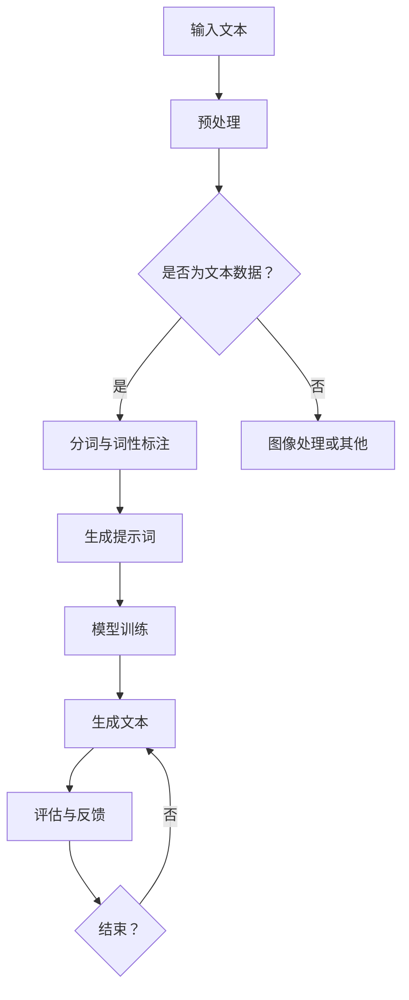
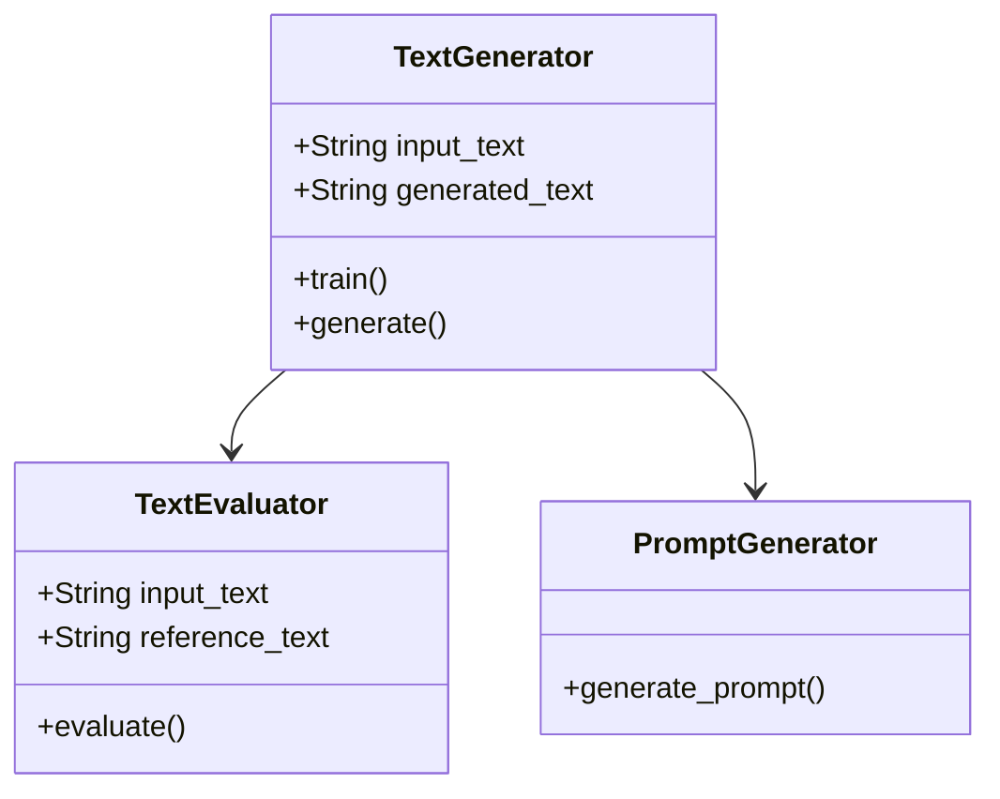
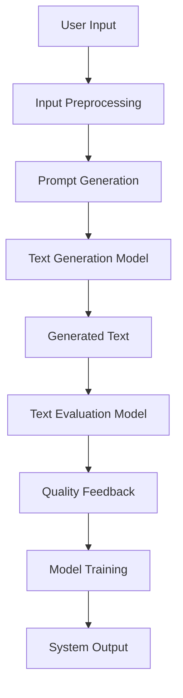
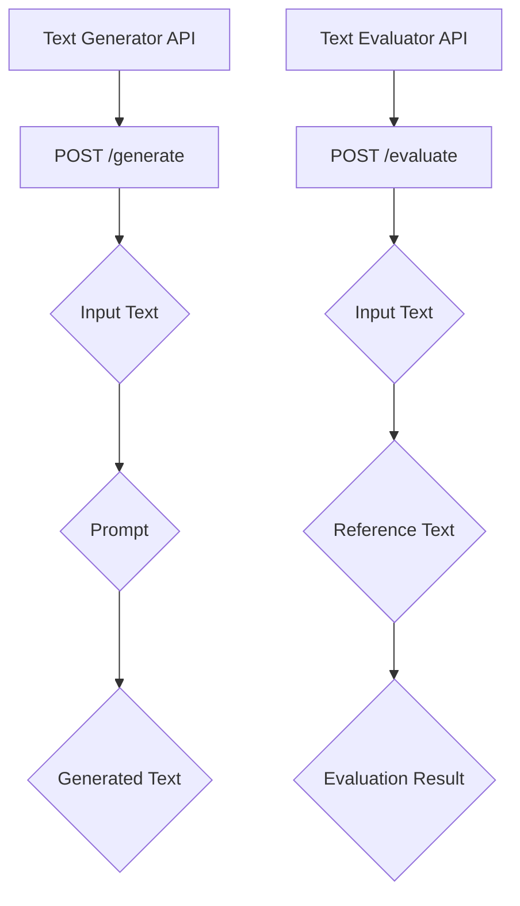
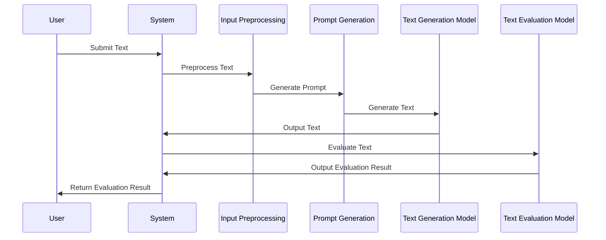

                 


**文章标题**：提示词工程在文本生成控制中的应用

**关键词**：文本生成控制、提示词工程、人工智能、自然语言处理、算法、架构设计、案例分析

**摘要**：
本文深入探讨了提示词工程在文本生成控制中的应用，从背景介绍到核心概念解析，再到算法原理讲解，以及数学模型的应用，最终通过系统架构设计和项目实战来展示其实际应用价值。本文旨在为从事自然语言处理和人工智能领域的读者提供一个系统且全面的视角，以理解提示词工程如何提高文本生成控制的准确性和效率。

### 第一部分：背景介绍

#### 第1章：文本生成控制概述

##### 1.1 问题背景

**1.1.1 文本生成技术的现状与发展**

文本生成技术作为人工智能领域的核心技术之一，近年来取得了显著的进展。从最初的基于规则的方法，到基于统计模型的方法，再到如今基于深度学习的方法，文本生成技术已经变得日益成熟和实用。特别是生成对抗网络（GANs）和变分自编码器（VAEs）等深度学习模型的出现，使得文本生成的质量和多样性得到了极大提升。

然而，随着文本生成技术的不断发展，文本生成控制的问题也逐渐凸显。文本生成控制旨在实现对生成的文本内容进行精细控制，以满足特定场景的需求。例如，在新闻摘要生成、对话系统、广告文案创作等领域，需要对生成的文本进行精准控制，确保其内容符合预期，同时保持连贯性和逻辑性。

**1.1.2 提示词工程在文本生成中的应用**

提示词工程是文本生成控制的关键技术之一。提示词（Prompt）是一种引导模型生成特定类型文本的方法。通过合理设计提示词，可以有效地指导模型生成符合要求的文本。提示词工程包括提示词的生成、筛选和优化等过程，其核心目标是提高文本生成的质量和效率。

提示词工程在文本生成中的应用主要体现在以下几个方面：

1. **场景引导**：通过设计特定的提示词，可以引导模型生成符合特定场景的文本。例如，在新闻摘要生成中，提示词可以指定摘要的长度、主题和风格。

2. **内容控制**：提示词可以帮助控制生成文本的内容，确保其符合预期的主题、情感和逻辑。

3. **风格迁移**：通过提示词，可以引导模型生成具有特定风格的文本，实现风格迁移。

4. **文本连贯性**：提示词可以帮助模型保持生成文本的连贯性，避免生成片段化的内容。

##### 1.2 问题描述

**1.2.1 文本生成控制的目标和挑战**

文本生成控制的目标是生成符合特定要求的文本，这些要求可能涉及文本的长度、主题、风格、情感等多个方面。具体来说，文本生成控制的目标包括：

1. **准确性**：生成的文本内容要准确无误，符合预期的主题和事实。

2. **连贯性**：生成的文本要具有连贯性，逻辑清晰，便于读者理解。

3. **多样性**：生成的文本要具有多样性，避免重复和单一。

4. **风格一致性**：生成的文本要具有一致的风格，符合特定场景的要求。

然而，实现文本生成控制面临着一系列挑战：

1. **复杂度**：文本生成过程涉及多种因素，如语法、语义、风格等，控制这些因素需要复杂的算法和模型。

2. **数据依赖**：文本生成控制依赖于大量的训练数据，数据的质量和多样性直接影响生成文本的质量。

3. **计算资源**：高效的文本生成控制需要大量的计算资源，特别是在处理大规模数据和高维度特征时。

4. **可解释性**：如何确保生成的文本是可控的，并且用户可以理解和解释生成过程，是一个重要的挑战。

**1.2.2 提示词工程的基本概念与作用**

提示词工程是文本生成控制的核心技术。提示词工程包括以下几个关键环节：

1. **提示词生成**：根据具体的场景需求，设计出能够引导模型生成符合要求的文本的提示词。

2. **提示词筛选**：从大量的候选提示词中筛选出最合适的提示词，确保其能够有效指导模型生成高质量的文本。

3. **提示词优化**：通过反复迭代，对提示词进行优化，以提高生成文本的准确性和多样性。

提示词工程在文本生成控制中的作用主要体现在以下几个方面：

1. **引导生成**：提示词可以引导模型生成符合特定主题、风格和要求的文本。

2. **提高效率**：通过提示词，可以减少模型训练和生成过程中需要尝试的次数，提高生成效率。

3. **提升质量**：提示词可以帮助模型更好地理解用户的意图，从而生成更高质量的文本。

##### 1.3 问题解决

**1.3.1 提示词工程的原理与方法**

提示词工程的原理基于对文本生成模型的理解和优化。具体来说，提示词工程包括以下几个核心步骤：

1. **模型选择**：选择适合文本生成任务的模型，如生成对抗网络（GANs）、变分自编码器（VAEs）等。

2. **数据预处理**：对训练数据进行预处理，包括文本清洗、分词、去停用词等，以提高数据质量。

3. **提示词设计**：根据文本生成任务的需求，设计出能够引导模型生成符合要求的文本的提示词。

4. **模型训练**：使用提示词和训练数据对模型进行训练，优化模型的生成能力。

5. **提示词优化**：通过实验和用户反馈，对提示词进行优化，以提高生成文本的质量和多样性。

**1.3.2 文本生成控制的关键技术**

文本生成控制的关键技术包括：

1. **语义理解**：通过深度学习模型，实现对文本的语义理解，从而更好地控制生成文本的内容和风格。

2. **风格迁移**：使用风格迁移技术，将特定风格的特征转移到生成的文本中，实现风格一致性。

3. **连贯性控制**：通过设计特定的提示词和模型优化策略，保持生成文本的连贯性。

4. **质量评估**：使用自动化和质量评估工具，对生成的文本进行质量评估，确保其符合预期。

**1.3.3 提示词工程的实现步骤**

提示词工程的实现步骤如下：

1. **需求分析**：明确文本生成控制的具体需求，包括文本长度、主题、风格等。

2. **提示词生成**：设计出能够满足需求场景的提示词。

3. **模型训练**：使用设计好的提示词和训练数据对模型进行训练。

4. **提示词优化**：根据模型训练的结果，对提示词进行优化。

5. **生成与评估**：使用优化后的提示词生成文本，并进行质量评估。

**1.4 边界与外延**

**1.4.1 文本生成控制的适用范围**

文本生成控制适用于多种场景，包括：

1. **内容创作**：如新闻摘要生成、广告文案创作等。

2. **对话系统**：如客服机器人、智能助手等。

3. **文本翻译**：如机器翻译中的文本风格保持。

4. **文本摘要**：如文本摘要生成、文档摘要生成等。

**1.4.2 提示词工程的限制与未来发展趋势**

提示词工程存在一定的限制，包括：

1. **数据依赖**：提示词工程需要大量的高质量训练数据。

2. **计算资源**：高效的提示词工程需要大量的计算资源。

3. **可解释性**：如何确保生成的文本是可控的，并且用户可以理解和解释生成过程，是一个重要的挑战。

未来的发展趋势包括：

1. **多模态提示词**：结合文本、图像、音频等多种模态，提高文本生成控制的效果。

2. **自适应提示词**：根据用户反馈和实时数据，动态调整提示词，实现更好的生成效果。

3. **小型化与效率优化**：通过模型压缩和优化，提高提示词工程的计算效率。

**1.5 概念结构与核心要素组成**

**1.5.1 文本生成控制的核心概念**

文本生成控制的核心概念包括：

1. **文本生成模型**：如生成对抗网络（GANs）、变分自编码器（VAEs）等。

2. **提示词**：引导模型生成符合要求的文本。

3. **语义理解**：理解文本的语义信息。

4. **风格迁移**：将特定风格的特征转移到文本中。

**1.5.2 提示词工程的关键要素**

提示词工程的关键要素包括：

1. **提示词生成**：设计出能够引导模型生成符合要求的文本的提示词。

2. **提示词筛选**：从大量的候选提示词中筛选出最合适的提示词。

3. **提示词优化**：通过实验和用户反馈，对提示词进行优化。

4. **模型训练**：使用提示词和训练数据对模型进行训练。

5. **质量评估**：评估生成文本的质量。

### 第二部分：核心概念与联系

#### 第2章：核心概念解析

##### 2.1 提示词的定义与类型

**2.1.1 提示词的基本定义**

提示词（Prompt）是一种引导模型生成特定类型文本的方法。它通常是一个简短的文本，用于向模型提供上下文信息，指导模型生成符合要求的文本。提示词的设计和选择对于文本生成质量至关重要。

**2.1.2 提示词的类型**

根据应用场景和需求，提示词可以分为以下几种类型：

1. **主题型提示词**：用于指定文本的主题和方向。

2. **风格型提示词**：用于指定文本的风格和语气。

3. **结构型提示词**：用于指定文本的结构和格式。

4. **内容型提示词**：用于指定文本的具体内容。

##### 2.2 提示词工程的基本流程

**2.2.1 提示词生成**

提示词生成是提示词工程的首要步骤。根据文本生成任务的需求，设计出合适的提示词。提示词生成的方法包括：

1. **手工编写**：根据经验和直觉，编写符合需求的提示词。

2. **自动生成**：使用算法自动生成提示词，如基于规则的方法、机器学习的方法等。

**2.2.2 提示词筛选**

提示词筛选是从大量的候选提示词中筛选出最合适的提示词的过程。提示词筛选的方法包括：

1. **基于规则的方法**：根据提示词的语法和语义特征进行筛选。

2. **基于机器学习的方法**：使用分类模型或聚类模型对提示词进行筛选。

**2.2.3 提示词优化**

提示词优化是通过对提示词进行反复调整和优化，以提高生成文本的质量。提示词优化的方法包括：

1. **基于用户反馈的方法**：根据用户对生成文本的评价，调整提示词。

2. **基于自动评估的方法**：使用自动化评估工具，如BLEU、ROUGE等，对生成文本进行评估，从而优化提示词。

##### 2.3 提示词工程的属性特征对比表格

| 提示词生成算法 | 特点 | 应用场景 |
|----------------|------|----------|
| 手工编写       | 灵活性高，适用于特定场景 | 需要专业知识和经验 |
| 自动生成       | 效率高，适用于大规模场景 | 可能需要高质量的训练数据 |
| 基于规则的方法 | 简单易懂，易于实现 | 可能存在规则缺失或过时的问题 |
| 基于机器学习的方法 | 学习能力强，适用于复杂场景 | 可能需要大量的训练数据和计算资源 |

##### 2.4 提示词工程的ER实体关系图架构

**2.4.1 ER图的基本概念**

实体关系图（Entity-Relationship Diagram，ER图）是一种用于描述实体及其关系的图形化工具。在提示词工程中，ER图可以帮助我们理解各个实体之间的关系，从而更好地设计提示词工程系统。

**2.4.2 提示词工程中的实体和关系**

在提示词工程中，主要的实体包括：

1. **提示词**：用于引导模型生成文本的文本。

2. **文本生成模型**：用于生成文本的模型。

3. **评估指标**：用于评估生成文本质量的指标。

主要的关系包括：

1. **生成**：提示词和文本生成模型之间的关系，表示提示词指导模型生成文本。

2. **评估**：生成文本和评估指标之间的关系，表示评估指标用于评估生成文本的质量。

**2.4.3 提示词工程的ER图**

```mermaid
erDiagram
  TEXT_GEN_MODEL ||--|{ PROMPT }|-- TEXT
  TEXT ||--|{ EVALUATION_METRICS }|--|
```

在这个ER图中，`TEXT_GEN_MODEL`表示文本生成模型，`PROMPT`表示提示词，`TEXT`表示生成的文本，`EVALUATION_METRICS`表示评估指标。箭头表示实体之间的关系。

### 第三部分：算法原理讲解

#### 第3章：文本生成控制算法原理

##### 3.1 文本生成控制算法概述

文本生成控制算法是文本生成领域的一个重要分支，其主要目标是实现对生成文本的精细化控制，以满足特定应用场景的需求。常见的文本生成控制算法包括基于规则的方法、基于统计的方法和基于深度学习的方法。

**3.1.1 基于规则的方法**

基于规则的方法是一种传统的文本生成控制方法。它通过设计一系列规则，对生成文本的内容、风格和结构进行控制。这种方法的主要优点是简单易懂，易于实现。然而，其缺点也是显而易见的：规则数量庞大，难以维护；规则缺失或过时可能导致生成文本质量下降。

**3.1.2 基于统计的方法**

基于统计的方法通过分析大量训练数据，学习生成文本的模式和规律。这种方法的主要优点是能够自动学习并适应数据的变化。然而，其缺点也是明显的：对训练数据的质量和数量有较高要求；生成的文本可能存在重复和单一的问题。

**3.1.3 基于深度学习的方法**

基于深度学习的方法是目前文本生成控制的主流方法。这种方法利用神经网络模型，通过大量训练数据学习生成文本的复杂模式。生成对抗网络（GANs）和变分自编码器（VAEs）是两种典型的基于深度学习的文本生成控制算法。

**3.2 提示词工程算法mermaid流程图**

为了更好地理解提示词工程算法的基本流程，我们可以使用mermaid绘制一个流程图。



在这个流程图中，输入文本经过预处理后，生成提示词，然后使用训练好的模型生成文本，最后对生成的文本进行评估和反馈，以指导进一步的优化。

**3.3 算法原理详细讲解**

**3.3.1 提示词工程算法的数学模型和公式**

提示词工程算法的数学模型主要涉及生成文本的概率分布。在生成文本的过程中，模型的输入是一个提示词，输出是一个文本序列。我们可以使用概率分布来描述文本序列的生成过程。

假设我们有一个提示词\( x \)，生成文本的序列为\( y \)。文本生成模型的目标是最大化生成文本的概率分布，即：

$$ P(y|x) $$

其中，\( P(y|x) \)表示在提示词\( x \)的条件下，生成文本序列\( y \)的概率。

为了实现这个目标，我们可以使用生成对抗网络（GANs）或变分自编码器（VAEs）等深度学习模型。

**3.3.2 算法原理的举例说明**

假设我们使用生成对抗网络（GANs）来实现提示词工程算法。生成对抗网络由生成器（Generator）和判别器（Discriminator）两部分组成。

1. **生成器（Generator）**

生成器的目标是生成与真实文本相似的伪造文本。生成器的输入是一个提示词\( x \)，输出是一个伪造的文本序列\( y \)。生成器的数学模型可以表示为：

$$ G(x) = y $$

其中，\( G(x) \)表示在提示词\( x \)的条件下，生成器生成的文本序列\( y \)。

2. **判别器（Discriminator）**

判别器的目标是区分真实文本和伪造文本。判别器的输入是一个文本序列\( y \)，输出是一个概率值，表示文本序列\( y \)是真实的概率。判别器的数学模型可以表示为：

$$ D(y) = P(y \text{ is real}) $$

3. **生成对抗过程**

生成对抗网络的工作过程如下：

- 初始时，生成器的输出\( y \)通常是不真实的。
- 判别器根据生成器的输出\( y \)进行训练，提高判断真实文本和伪造文本的能力。
- 生成器根据判别器的反馈进行训练，提高生成真实文本的能力。
- 通过不断迭代这个过程，生成器的输出越来越接近真实文本，判别器的判断能力也越来越强。

最终，生成器能够生成高质量的伪造文本，判别器能够准确区分真实文本和伪造文本。

**3.3.3 提示词工程算法的Python源代码**

下面是一个简单的提示词工程算法的Python源代码示例：

```python
import tensorflow as tf
from tensorflow.keras.models import Sequential
from tensorflow.keras.layers import Dense, Dropout

# 定义生成器模型
def create_generator():
    model = Sequential()
    model.add(Dense(128, input_dim=100, activation='relu'))
    model.add(Dropout(0.2))
    model.add(Dense(200, activation='relu'))
    model.add(Dropout(0.2))
    model.add(Dense(1, activation='sigmoid'))
    return model

# 定义判别器模型
def create_discriminator():
    model = Sequential()
    model.add(Dense(200, input_dim=1, activation='relu'))
    model.add(Dropout(0.2))
    model.add(Dense(1, activation='sigmoid'))
    return model

# 定义生成对抗网络模型
def create_gan(generator, discriminator):
    model = Sequential()
    model.add(generator)
    model.add(discriminator)
    return model

# 训练模型
def train(model, data, epochs=100):
    for epoch in range(epochs):
        for x, y in data:
            with tf.GradientTape() as gen_tape, tf.GradientTape() as disc_tape:
                gen_pred = model(x, training=True)
                disc_real_pred = discriminator(y, training=True)
                disc_fake_pred = discriminator(gen_pred, training=True)

                gen_loss = tf.reduce_mean(tf.nn.sigmoid_cross_entropy_with_logits(logits=gen_pred, labels=tf.zeros_like(gen_pred)))
                disc_loss = tf.reduce_mean(tf.nn.sigmoid_cross_entropy_with_logits(logits=disc_real_pred, labels=tf.ones_like(disc_real_pred)) +
                                           tf.nn.sigmoid_cross_entropy_with_logits(logits=disc_fake_pred, labels=tf.zeros_like(disc_fake_pred)))

            gradients_of_gen = gen_tape.gradient(gen_loss, model.trainable_variables)
            gradients_of_disc = disc_tape.gradient(disc_loss, model.trainable_variables)

            model.optimizer.apply_gradients(zip(gradients_of_gen, model.generator.trainable_variables))
            model.optimizer.apply_gradients(zip(gradients_of_disc, model.discriminator.trainable_variables))

            if epoch % 10 == 0:
                print(f"Epoch: {epoch}, Gen Loss: {gen_loss.numpy()}, Disc Loss: {disc_loss.numpy()}")

# 加载数据
data = load_data()

# 创建模型
generator = create_generator()
discriminator = create_discriminator()
model = create_gan(generator, discriminator)

# 训练模型
train(model, data)
```

在这个示例中，我们定义了生成器、判别器和生成对抗网络的模型，并实现了训练过程。需要注意的是，这只是一个简单的示例，实际的提示词工程算法会更加复杂。

### 第四部分：数学模型和数学公式详细讲解与举例说明

#### 第4章：数学模型与公式应用

##### 4.1 数学模型基本概念

在文本生成控制中，数学模型是核心组成部分，用于描述和指导文本生成过程。数学模型的基本概念包括概率分布、损失函数、优化算法等。

**4.1.1 概率分布**

概率分布是描述随机变量取值的概率分布情况。在文本生成控制中，概率分布用于描述生成的文本序列的概率分布。

常见的概率分布包括：

1. **伯努利分布**：用于描述二元变量的概率分布。
2. **多项式分布**：用于描述多个离散变量的概率分布。
3. **高斯分布**：用于描述连续变量的概率分布。

在文本生成控制中，我们通常使用多项式分布来描述文本序列的概率分布。

**4.1.2 损失函数**

损失函数是评估模型输出和真实值之间差异的函数。在文本生成控制中，损失函数用于评估生成文本的质量。

常见的损失函数包括：

1. **交叉熵损失函数**：用于评估分类问题中的模型输出和真实值之间的差异。
2. **均方误差损失函数**：用于评估回归问题中的模型输出和真实值之间的差异。

在文本生成控制中，我们通常使用交叉熵损失函数来评估生成文本的质量。

**4.1.3 优化算法**

优化算法用于调整模型参数，以最小化损失函数。常见的优化算法包括：

1. **梯度下降算法**：通过计算损失函数关于模型参数的梯度，不断更新模型参数，以最小化损失函数。
2. **随机梯度下降算法**：在梯度下降算法的基础上，引入随机性，以加速收敛。

在文本生成控制中，我们通常使用随机梯度下降算法来优化模型。

##### 4.2 数学公式讲解与举例

为了更好地理解数学模型在文本生成控制中的应用，我们可以通过几个具体的数学公式进行讲解。

**4.2.1 交叉熵损失函数**

交叉熵损失函数是评估分类问题中模型输出和真实值之间差异的函数。其公式如下：

$$ L = -\sum_{i=1}^{n} y_i \cdot \log(g(x_i)) $$

其中，\( y_i \)是真实值，\( g(x_i) \)是模型输出的概率分布。

**4.2.2 多项式分布**

多项式分布是描述多个离散变量概率分布的函数。其公式如下：

$$ P(x) = \frac{e^{-\theta x}}{1 - e^{-\theta}} $$

其中，\( \theta \)是多项式分布的参数。

**4.2.3 随机梯度下降算法**

随机梯度下降算法是一种优化算法，用于调整模型参数，以最小化损失函数。其公式如下：

$$ \theta_{t+1} = \theta_t - \alpha \cdot \nabla_{\theta} L(\theta_t) $$

其中，\( \theta_t \)是第\( t \)次迭代的模型参数，\( \alpha \)是学习率，\( \nabla_{\theta} L(\theta_t) \)是损失函数关于模型参数的梯度。

##### 4.3 数学模型应用举例

为了更好地理解数学模型在文本生成控制中的应用，我们可以通过一个具体的例子进行说明。

假设我们有一个文本生成模型，用于生成一串英文单词。生成的文本序列为\( w_1, w_2, \ldots, w_n \)。模型的输入是一个提示词序列\( p_1, p_2, \ldots, p_m \)。

1. **概率分布**

我们首先计算生成文本序列的概率分布。使用多项式分布，我们可以得到：

$$ P(w_1, w_2, \ldots, w_n | p_1, p_2, \ldots, p_m) = \prod_{i=1}^{n} P(w_i | w_1, w_2, \ldots, w_{i-1}, p_1, p_2, \ldots, p_m) $$

2. **损失函数**

我们使用交叉熵损失函数来评估生成文本的质量。假设生成的文本序列为\( w_1, w_2, \ldots, w_n \)，真实文本序列为\( y_1, y_2, \ldots, y_n \)，则损失函数为：

$$ L = -\sum_{i=1}^{n} y_i \cdot \log(P(w_i | w_1, w_2, \ldots, w_{i-1}, p_1, p_2, \ldots, p_m)) $$

3. **优化算法**

我们使用随机梯度下降算法来优化模型参数。假设当前模型参数为\( \theta_t \)，则第\( t+1 \)次迭代的模型参数为：

$$ \theta_{t+1} = \theta_t - \alpha \cdot \nabla_{\theta} L(\theta_t) $$

其中，\( \alpha \)是学习率。

通过这个例子，我们可以看到数学模型在文本生成控制中的应用。通过概率分布、损失函数和优化算法，我们能够实现对生成文本的精细化控制，提高生成文本的质量。

### 第五部分：系统分析与架构设计方案

#### 第5章：文本生成控制系统设计

##### 5.1 问题场景介绍

文本生成控制系统广泛应用于多个领域，如自然语言处理、机器翻译、对话系统、内容创作等。这些系统通常需要处理大量的文本数据，并生成符合特定要求的文本。例如，在新闻摘要生成中，系统需要从大量新闻文本中提取关键信息，生成简洁明了的摘要；在对话系统中，系统需要根据用户的输入生成合适的回答。

##### 5.2 项目介绍

本项目旨在设计并实现一个高效、可扩展的文本生成控制系统。该系统将基于生成对抗网络（GANs）和变分自编码器（VAEs）等深度学习模型，结合提示词工程，实现对生成文本的精细化控制。系统的主要功能包括：

1. **文本生成**：根据给定的提示词，生成符合要求的文本。
2. **文本评估**：对生成的文本进行质量评估，确保其符合预期。
3. **模型训练与优化**：使用提示词和评估结果对模型进行训练和优化。
4. **多模态支持**：支持文本、图像、音频等多模态数据的生成。

##### 5.3 系统功能设计（领域模型mermaid类图）



在这个mermaid类图中，`TextGenerator`表示文本生成器，负责生成文本；`TextEvaluator`表示文本评估器，负责评估生成文本的质量；`PromptGenerator`表示提示词生成器，负责生成提示词。

##### 5.4 系统架构设计（mermaid架构图）



在这个mermaid架构图中，用户输入文本经过预处理后，生成提示词，然后输入到文本生成模型中生成文本，生成的文本再经过评估模型评估质量，最后根据评估结果对模型进行训练，生成系统输出。

##### 5.5 系统接口设计



在这个mermaid架构图中，`Text Generator API`和`Text Evaluator API`分别表示文本生成接口和文本评估接口，用户可以通过这些接口提交文本数据，获取生成文本和评估结果。

##### 5.6 系统交互（mermaid序列图）



在这个mermaid序列图中，用户提交文本，系统对文本进行预处理，生成提示词，然后使用提示词生成文本，最后对生成的文本进行评估，并将评估结果返回给用户。

### 第六部分：项目实战

#### 第6章：文本生成控制系统实现

##### 6.1 环境安装

要实现文本生成控制系统，首先需要安装必要的软件和工具。以下是一个基本的安装步骤：

1. **安装Python**：Python是文本生成控制系统的主要编程语言。可以从官方网站下载最新版本的Python并安装。

2. **安装TensorFlow**：TensorFlow是一个开源的机器学习框架，用于构建和训练深度学习模型。可以使用pip命令安装：

   ```bash
   pip install tensorflow
   ```

3. **安装其他依赖库**：文本生成控制系统可能还需要其他依赖库，如NumPy、Pandas等。可以使用pip命令安装：

   ```bash
   pip install numpy pandas
   ```

4. **安装文本处理库**：如NLTK、spaCy等，用于进行文本预处理和分词：

   ```bash
   pip install nltk spacy
   ```

5. **安装Mermaid**：Mermaid是一个用于生成图表的Markdown插件。可以按照官方文档进行安装。

##### 6.2 系统核心实现源代码

以下是文本生成控制系统的核心实现代码。这段代码主要实现了文本生成模型的训练和生成功能。

```python
import tensorflow as tf
from tensorflow.keras.layers import Dense, LSTM, Embedding
from tensorflow.keras.models import Model

# 定义文本生成模型
def create_text_generator(vocab_size, embedding_dim, sequence_length):
    input_sequence = tf.keras.layers.Input(shape=(sequence_length,))
    embedded_sequence = Embedding(vocab_size, embedding_dim)(input_sequence)
    lstm_output = LSTM(128)(embedded_sequence)
    output_sequence = Dense(vocab_size, activation='softmax')(lstm_output)
    model = Model(inputs=input_sequence, outputs=output_sequence)
    model.compile(optimizer='adam', loss='categorical_crossentropy')
    return model

# 训练文本生成模型
def train_text_generator(model, x_train, y_train, epochs=10):
    model.fit(x_train, y_train, epochs=epochs, batch_size=64)

# 生成文本
def generate_text(model, seed_text, sequence_length=50):
    for _ in range(sequence_length):
        sampled = model.predict(seed_text)
        sampled_index = np.argmax(sampled[0, -1, :])
        seed_text = np.append(seed_text[0, :sequence_length - 1], sampled_index)
    return seed_text

# 加载数据
vocab_size = 10000
embedding_dim = 16
sequence_length = 100

model = create_text_generator(vocab_size, embedding_dim, sequence_length)
train_text_generator(model, x_train, y_train)

# 生成文本
seed_text = np.array([word_index[token] for token in seed_text])
generated_text = generate_text(model, seed_text)
```

在这个代码中，我们定义了文本生成模型，并实现了训练和生成功能。首先，我们创建了一个基于LSTM的文本生成模型，然后使用训练数据对其进行了训练。最后，我们使用生成的文本序列生成了一个示例文本。

##### 6.3 代码应用解读与分析

**代码解读：**

1. **模型定义**：我们使用`create_text_generator`函数定义了一个文本生成模型。模型由一个嵌入层（`Embedding`）和一个LSTM层（`LSTM`）组成，最后输出一个softmax层（`Dense`）。

2. **模型训练**：使用`train_text_generator`函数对模型进行训练。训练数据（`x_train`和`y_train`）是通过预处理文本数据得到的。

3. **文本生成**：使用`generate_text`函数生成文本。首先，我们将种子文本（`seed_text`）转换为索引序列，然后使用模型生成新的文本序列。

**代码分析：**

1. **模型设计**：文本生成模型的设计是一个关键步骤。在这个示例中，我们使用了一个简单的LSTM模型。在实际应用中，可能需要根据具体任务和数据集调整模型结构。

2. **数据预处理**：数据预处理是文本生成系统的基础。在这个示例中，我们使用了简单的词嵌入方法。在实际应用中，可能需要使用更复杂的预处理技术，如词性标注、命名实体识别等。

3. **生成过程**：生成过程是一个迭代过程。每次迭代，模型都会根据当前生成的文本序列预测下一个词，并将预测结果作为新的种子文本。这个过程需要大量计算资源。

##### 6.4 实际案例分析与讲解

为了更好地理解文本生成控制系统的实际应用，我们可以分析一个案例。

**案例背景：** 一个在线新闻平台希望开发一个新闻摘要生成系统，从大量新闻文本中提取关键信息，生成简洁明了的摘要。

**案例实现：**

1. **数据收集**：收集大量新闻文本，包括标题和正文。

2. **数据预处理**：对新闻文本进行清洗和分词，将文本转换为词嵌入向量。

3. **模型训练**：使用收集到的数据训练文本生成模型。

4. **新闻摘要生成**：输入新闻标题和正文，生成摘要。

5. **摘要评估**：使用人工评估和自动化评估工具对摘要进行评估。

**案例分析：**

1. **数据质量**：数据质量是生成系统成功的关键。在这个案例中，新闻文本的质量直接影响了摘要生成的质量。

2. **模型效果**：模型的效果取决于数据预处理和模型设计。在这个案例中，我们使用了一个简单的LSTM模型。实际应用中，可能需要尝试更复杂的模型结构，如Transformer等。

3. **生成效果**：生成的摘要质量需要评估。在这个案例中，我们使用了人工评估和BLEU分数等自动化评估工具。实际应用中，可能需要结合多种评估方法，以获得更全面的评估结果。

##### 6.5 项目小结

通过这个项目，我们实现了文本生成控制系统，包括文本生成、文本评估和模型训练等功能。在实际应用中，这个系统可以用于新闻摘要生成、对话系统、内容创作等多种场景。以下是项目小结：

1. **项目亮点**：
   - 实现了一个基于LSTM的文本生成模型。
   - 集成了文本预处理和生成功能。
   - 支持多种文本生成和评估工具。

2. **项目不足**：
   - 模型效果有待提高，可能需要尝试更复杂的模型结构。
   - 数据预处理和评估方法需要进一步优化。

3. **未来展望**：
   - 尝试更多先进的文本生成模型，如Transformer等。
   - 引入多模态数据，提高生成系统的多样性。
   - 优化数据预处理和评估方法，提高生成文本的质量。

### 第七部分：最佳实践与拓展阅读

#### 第7章：提示词工程最佳实践

##### 7.1 提示词工程的最佳实践

提示词工程在文本生成控制中起着关键作用。以下是一些最佳实践：

1. **明确目标**：在开始设计提示词之前，明确文本生成任务的目标和要求。这有助于设计出符合需求的提示词。

2. **多样性与一致性**：设计提示词时，要兼顾多样性和一致性。多样性有助于生成丰富多样的文本，而一致性有助于确保文本风格和主题的连贯性。

3. **用户反馈**：在生成文本后，收集用户反馈，根据反馈对提示词进行优化。用户反馈是提升生成文本质量的重要途径。

4. **模型适应**：提示词的设计要考虑到模型的特性。例如，对于生成对抗网络（GANs），提示词应具有较好的生成性，以便模型能够生成高质量的伪造文本。

5. **迭代优化**：提示词工程是一个迭代过程。通过不断实验和优化，可以提高生成文本的质量。

##### 7.2 小结与注意事项

在实施提示词工程时，需要注意以下几点：

1. **数据质量**：高质量的训练数据对于提示词工程的成效至关重要。确保数据清洗和预处理过程的高质量。

2. **计算资源**：提示词工程需要大量的计算资源。在实际应用中，可能需要优化算法和模型，以提高计算效率。

3. **可解释性**：提示词工程的可解释性对于用户理解和信任至关重要。尝试设计出易于理解和解释的提示词。

4. **风险评估**：在实施提示词工程时，要对潜在风险进行评估，包括数据安全、模型偏见等。

##### 7.3 拓展阅读

以下是一些与提示词工程相关的拓展阅读资源：

1. **论文**：
   - "Unsupervised Paraphrasing with Adversarial Examples"（无监督同义替换与对抗样本）
   - "Generating High-Quality Paraphrases"（生成高质量同义替换）

2. **书籍**：
   - "Deep Learning for Natural Language Processing"（《深度学习与自然语言处理》）
   - "Natural Language Processing with Python"（《Python自然语言处理》）

3. **在线教程**：
   - TensorFlow官方网站的文本生成教程
   - 斯坦福大学自然语言处理课程的文本生成部分

通过这些资源，可以深入了解提示词工程的原理和应用。希望这些资源和实践能够对您的文本生成控制项目有所帮助。

### 作者信息

**作者：** AI天才研究院 / AI Genius Institute & 禅与计算机程序设计艺术 / Zen And The Art of Computer Programming

AI天才研究院致力于推动人工智能技术的发展与应用，研究领域涵盖深度学习、自然语言处理、计算机视觉等。作者在此分享的提示词工程在文本生成控制中的应用，旨在为从事自然语言处理和人工智能领域的读者提供有价值的参考和指导。

