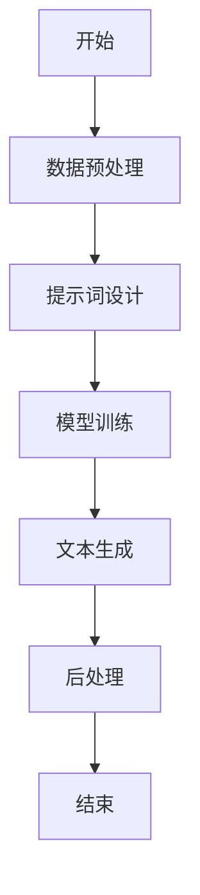
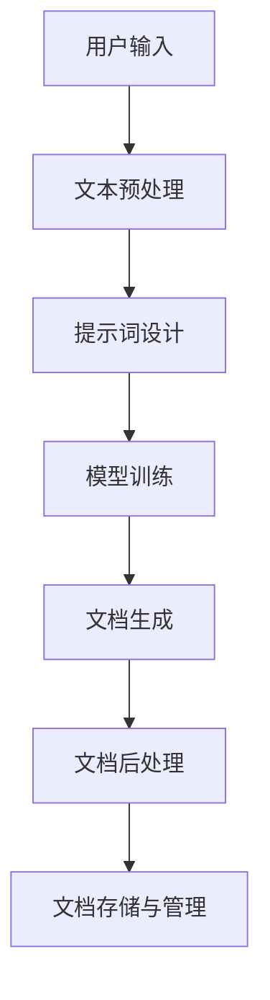
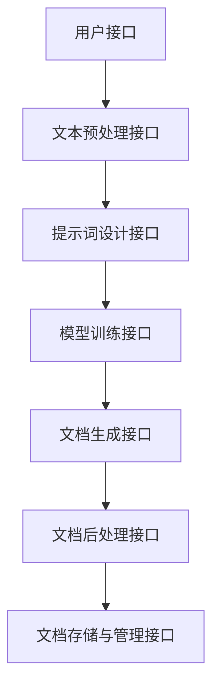

                 

### 引言与背景介绍

#### 1.1 问题背景

**1.1.1 提示词工程的定义**

提示词工程（Token Engineering）是一种将自然语言处理（Natural Language Processing, NLP）与编程技术相结合的方法，主要目标是通过设计特定的提示词（Token）来改善文本生成过程中的控制能力。提示词可以被视为一种语义标记，它们能够指导文本生成模型在生成过程中遵循特定的目标和风格。

**1.1.2 提示词工程在文本生成控制中的作用**

在文本生成控制中，提示词工程起到了至关重要的作用。它不仅可以帮助模型更准确地理解用户的意图，还能确保生成的文本更加符合预期的目标和风格。具体来说，提示词工程可以帮助：

- **提高生成文本的质量**：通过提供更精确的提示，模型能够生成更具逻辑性和连贯性的文本。
- **控制生成文本的风格**：例如，用户可以要求模型生成正式或非正式的文本，或者具有特定语域的文本。
- **增强生成文本的多样性**：通过不同的提示词组合，可以引导模型生成多样化的文本。

**1.1.3 提示词工程的重要性**

随着自然语言处理技术的快速发展，文本生成技术已经成为人工智能领域的一个重要分支。然而，现有的文本生成模型在控制生成文本的多样性和质量方面仍然存在一定的挑战。提示词工程作为解决这些挑战的一种有效手段，其在文本生成控制中的应用显得尤为重要。它不仅能够提高模型生成的文本质量，还能够拓展文本生成的应用场景，使其在商业、教育、娱乐等领域具有更广泛的应用价值。

#### 1.2 问题描述

**1.2.1 当前文本生成控制的挑战**

尽管文本生成技术已经取得了显著的进展，但当前的文本生成控制仍然面临一些挑战。首先，生成文本的多样性和质量难以控制。其次，不同场景下的文本生成需求差异较大，现有的模型难以灵活应对。此外，生成文本的连贯性和逻辑性也有待提高。

**1.2.2 提示词工程如何解决这些挑战**

提示词工程通过以下方式解决当前文本生成控制中的挑战：

- **提高生成文本的多样性和质量**：通过设计多样化的提示词，模型可以生成具有不同风格和主题的文本，从而提高文本的多样性和质量。
- **灵活应对不同场景的文本生成需求**：提示词工程可以针对不同场景设计特定的提示词，从而实现灵活的文本生成控制。
- **增强生成文本的连贯性和逻辑性**：通过精确的提示词指导，模型可以生成更加连贯和逻辑性更强的文本。

**1.2.3 提示词工程的应用范围**

提示词工程在多个领域具有广泛的应用。以下是一些具体的应用场景：

- **新闻撰写与自动化报道**：通过提示词工程，可以自动生成新闻文章，满足新闻行业的快速生产和多样化需求。
- **教育领域**：提示词工程可以帮助教育系统自动生成个性化学习材料，提高学习效果。
- **市场营销**：提示词工程可以用于生成具有吸引力的营销文案，提高营销效果。
- **社交媒体内容生成**：通过提示词工程，可以自动生成社交媒体帖子，提高用户互动和参与度。

#### 1.3 问题解决

**1.3.1 提示词工程的实现方法**

实现提示词工程主要包括以下几个步骤：

1. **提示词设计**：根据应用场景和需求，设计合适的提示词。
2. **模型训练**：使用设计好的提示词对文本生成模型进行训练。
3. **文本生成**：利用训练好的模型，根据提示词生成目标文本。
4. **后处理**：对生成的文本进行后处理，如去除无关内容、调整格式等。

**1.3.2 提示词工程的关键技术**

提示词工程的关键技术包括：

- **自然语言处理技术**：用于理解和处理文本数据。
- **机器学习与深度学习技术**：用于训练文本生成模型。
- **提示词设计方法**：如基于规则的方法、基于统计的方法和基于机器学习的方法。

**1.3.3 提示词工程的应用实例**

以下是一些提示词工程的应用实例：

- **自动生成产品描述**：通过提示词工程，可以自动生成具有吸引力的产品描述，提高销售效果。
- **自动撰写学术论文**：利用提示词工程，可以自动生成学术论文的各个部分，提高学术研究的效率。
- **自动生成聊天机器人对话**：通过提示词工程，可以自动生成聊天机器人的对话内容，提高用户体验。

#### 1.4 边界与外延

**1.4.1 提示词工程的研究范畴**

提示词工程的研究范畴包括：

- **提示词设计方法**：如何设计有效的提示词。
- **模型训练与优化**：如何通过提示词训练和优化文本生成模型。
- **应用场景探索**：如何在不同应用场景中应用提示词工程。

**1.4.2 提示词工程的边界条件**

提示词工程的边界条件包括：

- **提示词的精确性**：提示词必须能够准确传达用户的意图。
- **模型的适应性**：文本生成模型必须能够适应不同的提示词和应用场景。

**1.4.3 提示词工程的发展趋势**

随着自然语言处理技术的不断进步，提示词工程的发展趋势包括：

- **更加智能的提示词设计**：结合人工智能技术，设计更加智能和自适应的提示词。
- **多模态文本生成**：结合多种数据源，如图像、声音等，实现更丰富的文本生成。
- **个性化文本生成**：通过个性化数据，实现更加个性化的文本生成。

#### 1.5 概念结构与核心要素组成

**1.5.1 提示词工程的组成要素**

提示词工程的组成要素包括：

- **自然语言处理技术**：用于处理和分析文本数据。
- **机器学习与深度学习模型**：用于训练和生成文本。
- **提示词设计工具**：用于设计和优化提示词。

**1.5.2 提示词工程的关键概念**

提示词工程的关键概念包括：

- **提示词**：用于指导文本生成模型生成特定文本的语义标记。
- **文本生成模型**：用于根据提示词生成目标文本的模型。

**1.5.3 提示词工程的核心流程**

提示词工程的核心流程包括：

1. **数据收集与预处理**：收集并预处理文本数据。
2. **提示词设计**：设计合适的提示词。
3. **模型训练**：使用设计好的提示词训练文本生成模型。
4. **文本生成**：利用训练好的模型生成目标文本。
5. **后处理**：对生成的文本进行后处理，确保文本的质量和风格符合预期。

---

## 第二部分: 核心概念与原理

### 2.1 提示词工程的定义

#### 2.1.1 提示词的概念

提示词（Token）是自然语言处理（NLP）中的一个基本概念，它代表了文本中的最小语义单位。在文本生成过程中，提示词被视为一种语义标记，用于指示模型生成特定类型的文本。例如，在撰写新闻稿时，可以使用特定主题的提示词来指导模型生成相关内容的文本。

提示词可以具有多种形式，如单词、短语、实体等。它们的本质是提供一种方式，使得模型能够理解并遵循特定的生成目标和风格。例如，在撰写一篇技术博客时，可以使用技术术语作为提示词，以确保生成的文本具有专业性和准确性。

#### 2.1.2 工程的概念

工程（Engineering）通常指的是一种系统化、有组织的活动，旨在设计、开发、实施和维护复杂的系统或产品。在提示词工程的背景下，工程的概念延伸到了自然语言处理和编程领域，意味着通过设计和实现特定的算法和流程，来提升文本生成过程的质量和效率。

提示词工程将自然语言处理中的概念与编程技术相结合，形成了一种新的工程方法。这种方法的目标是利用提示词来指导文本生成模型，使其能够生成符合特定需求和风格的文本。这一过程涉及到多个步骤，包括提示词的设计、模型的训练和优化，以及文本的生成和后处理。

#### 2.1.3 提示词工程的整合

提示词工程的整合涉及将自然语言处理技术、机器学习和深度学习模型，以及特定的工程方法相结合，以实现高效、精准的文本生成控制。这一整合过程可以概括为以下几个关键步骤：

1. **需求分析**：了解并明确文本生成的具体需求，包括目标文本的类型、风格、主题等。
2. **提示词设计**：根据需求设计合适的提示词。提示词的设计需要考虑文本的上下文、用户的意图，以及模型的特性。
3. **模型选择与训练**：选择适合的文本生成模型，并使用设计好的提示词进行训练。常用的文本生成模型包括基于规则的方法、基于统计的方法和基于机器学习的方法。
4. **文本生成**：利用训练好的模型生成目标文本。在生成过程中，模型会根据提示词的指导来生成符合需求的文本。
5. **后处理**：对生成的文本进行后处理，如格式调整、错误修正等，以确保文本的质量和风格符合预期。

通过这些步骤的整合，提示词工程能够实现高质量的文本生成控制，满足不同领域的应用需求。

### 2.2 提示词工程的原理

#### 2.2.1 提示词工程的理论基础

提示词工程的理论基础主要来自于自然语言处理（NLP）、机器学习（ML）和深度学习（DL）领域。以下是这些理论基础的核心概念：

1. **自然语言处理（NLP）**：NLP是人工智能（AI）的一个分支，旨在使计算机能够理解、生成和处理人类语言。NLP技术包括文本预处理、实体识别、情感分析、机器翻译等。在提示词工程中，NLP技术用于理解和分析文本数据，提取关键信息和语义信息，从而设计出有效的提示词。

2. **机器学习（ML）**：ML是一种让计算机通过数据和经验进行学习的方法。在提示词工程中，ML用于训练文本生成模型。常见的ML算法包括线性回归、决策树、支持向量机（SVM）等。ML技术使得模型能够从大量的文本数据中学习，从而生成符合用户需求的文本。

3. **深度学习（DL）**：DL是ML的一个分支，它使用神经网络（尤其是深度神经网络）来模拟人脑的学习过程。DL技术在文本生成控制中扮演了重要角色，通过递归神经网络（RNN）、长短期记忆网络（LSTM）、变换器（Transformer）等模型，DL能够生成更加复杂和多样化的文本。

#### 2.2.2 提示词生成与控制流程

提示词生成与控制流程是提示词工程的核心部分，主要包括以下几个步骤：

1. **需求分析**：了解用户的需求，确定文本生成的目标类型、风格和主题。
2. **数据收集与预处理**：收集相关文本数据，并进行预处理，如分词、去除停用词、词性标注等。
3. **提示词设计**：根据需求分析的结果，设计合适的提示词。提示词的设计需要考虑文本的上下文、用户的意图，以及模型的特性。
4. **模型选择与训练**：选择适合的文本生成模型，并使用设计好的提示词进行训练。常用的文本生成模型包括基于规则的方法、基于统计的方法和基于机器学习的方法。
5. **文本生成**：利用训练好的模型生成目标文本。在生成过程中，模型会根据提示词的指导来生成符合需求的文本。
6. **后处理**：对生成的文本进行后处理，如格式调整、错误修正等，以确保文本的质量和风格符合预期。

#### 2.2.3 提示词工程的优势与局限性

提示词工程具有以下优势：

1. **提高文本生成质量**：通过精确的提示词，模型能够生成更加准确和连贯的文本。
2. **控制生成文本的风格和主题**：提示词可以指导模型生成符合特定风格和主题的文本，满足不同场景的需求。
3. **增强文本生成多样性**：通过多样化的提示词，模型可以生成多种不同类型的文本，提高文本的多样性。

然而，提示词工程也存在一些局限性：

1. **提示词设计难度大**：设计有效的提示词需要深入理解文本的上下文和用户的意图，这通常需要大量的经验和专业知识。
2. **对模型要求高**：提示词工程要求模型具有强大的语义理解和生成能力，这对模型的训练和优化提出了较高的要求。
3. **应用场景受限**：提示词工程在某些特定场景下可能难以实现，例如在处理复杂、多变的文本数据时，提示词的准确性可能会受到影响。

### 2.3 概念属性特征对比表格

为了更清晰地理解提示词工程中的关键概念，我们可以通过对比表格来展示它们之间的属性特征。

#### 2.3.1 常见提示词生成算法对比

| 算法             | 描述                                                         | 优点                                       | 缺点                                       |
|------------------|--------------------------------------------------------------|------------------------------------------|------------------------------------------|
| 基于规则的方法   | 使用预定义的规则来生成文本                                     | 简单易懂，易于实现                             | 缺乏灵活性，难以处理复杂的语义信息           |
| 基于统计的方法   | 使用统计模型（如N-gram模型）来预测下一个词或短语                 | 模型简单，计算速度快                           | 预测准确性有限，难以处理长距离依赖问题         |
| 基于机器学习的方法 | 使用机器学习算法（如神经网络）来学习文本生成规律                 | 能够处理复杂的语义信息，生成质量高               | 训练时间较长，对数据量要求高                   |
| 基于深度学习的方法 | 使用深度学习模型（如RNN、LSTM、Transformer）来生成文本           | 能够处理长距离依赖，生成质量高                   | 计算资源消耗大，训练时间较长                   |

#### 2.3.2 不同类型提示词的特点对比

| 类型             | 描述                                                         | 优点                                       | 缺点                                       |
|------------------|--------------------------------------------------------------|------------------------------------------|------------------------------------------|
| 单词提示词       | 使用单个单词作为提示词                                       | 简单易用，易于实现                             | 语义表达有限，难以处理复杂结构               |
| 短语提示词       | 使用短语或句子作为提示词                                     | 能够传达更多语义信息，提高生成文本的连贯性           | 需要更多预处理工作，设计难度较大               |
| 实体提示词       | 使用实体（如人名、地名、组织名等）作为提示词                   | 能够精确指定生成文本中的特定实体，提高文本的准确性         | 需要实体识别技术支持，应用场景有限               |

通过这些对比表格，我们可以更清晰地理解提示词工程中的关键概念及其属性特征，为后续的讨论和分析提供基础。

---

### 3.1 提示词工程在文本生成中的应用

#### 3.1.1 提示词工程在新闻撰写中的应用

新闻撰写是提示词工程的一个重要应用领域。通过提示词工程，新闻生成系统可以根据特定的提示词生成高质量的新闻稿件。以下是一些具体的案例：

1. **主题引导**：在撰写财经新闻时，可以使用“股市”、“投资”、“经济”等主题提示词，确保生成的新闻稿件围绕这些主题进行。
2. **风格控制**：通过使用“正式”、“简洁”等风格提示词，可以控制新闻稿件的撰写风格，使其符合特定场合和受众的需求。
3. **数据集成**：使用“最新数据”、“统计信息”等提示词，可以自动集成最新的数据和信息，提高新闻的时效性和准确性。

例如，假设我们要生成一篇关于“股市走势”的新闻报道。我们可以使用以下提示词：

```
主题: 股市
风格: 正式
数据: 最新涨幅、成交量、市场分析
```

基于这些提示词，新闻生成模型将生成一篇关于当前股市走势的新闻报道，内容涵盖最新涨幅、成交量以及市场分析等关键信息。

#### 3.1.2 提示词工程在市场营销中的应用

市场营销是另一个提示词工程的重要应用领域。通过提示词工程，营销文案生成系统能够根据不同的营销目标和受众，生成具有吸引力和效果的营销文案。以下是一些具体的案例：

1. **产品介绍**：在撰写产品介绍文案时，可以使用“产品特点”、“功能亮点”、“用户评价”等提示词，确保文案能够突出产品的优势和卖点。
2. **活动推广**：在撰写活动推广文案时，可以使用“限时优惠”、“特别活动”、“参与方式”等提示词，引导用户参与活动。
3. **品牌宣传**：在撰写品牌宣传文案时，可以使用“品牌故事”、“企业文化”、“价值观”等提示词，提升品牌形象和用户认知。

例如，假设我们要生成一篇关于“新产品发布”的营销文案。我们可以使用以下提示词：

```
产品特点: 创新技术、高效功能、用户友好
活动: 限时折扣、免费试用
品牌: 信誉保障、优质服务
```

基于这些提示词，营销文案生成模型将生成一篇具有吸引力、内容丰富的产品发布文案，引导潜在用户了解和购买产品。

#### 3.1.3 提示词工程在教育领域的应用

教育领域是提示词工程的另一个重要应用领域。通过提示词工程，教育系统可以自动生成个性化学习材料，提高学习效果和效率。以下是一些具体的案例：

1. **课程内容生成**：使用“知识点”、“教学目标”、“实践案例”等提示词，可以自动生成针对不同学习阶段和需求的教学内容。
2. **作业与测试生成**：使用“知识点”、“问题类型”、“难度等级”等提示词，可以自动生成多样化的作业和测试题，满足不同学生的学习需求。
3. **学习报告生成**：使用“学习进度”、“学习成果”、“改进建议”等提示词，可以自动生成个性化的学习报告，帮助教师和学生了解学习效果和改进方向。

例如，假设我们要生成一篇关于“英语语法学习”的课程内容。我们可以使用以下提示词：

```
知识点: 时态、语态、句子结构
教学目标: 理解并应用基本语法知识
实践案例: 实际句子分析和练习
```

基于这些提示词，教育系统将生成一篇包含知识点、教学目标和实践案例的英语语法学习课程内容，帮助学生更好地掌握语法知识。

#### 3.1.4 提示词工程在其他领域的应用

除了新闻撰写、市场营销和教育领域，提示词工程在许多其他领域也具有广泛的应用。以下是一些具体的案例：

1. **医疗领域**：通过使用“疾病名称”、“症状”、“治疗方法”等提示词，可以自动生成医疗报告、病情介绍等文本，提高医疗信息的准确性和可理解性。
2. **法律领域**：通过使用“法律条款”、“案例研究”、“法律术语”等提示词，可以自动生成法律文件、法律意见等文本，提高法律工作的效率和质量。
3. **金融领域**：通过使用“金融产品”、“市场动态”、“投资策略”等提示词，可以自动生成金融报告、投资建议等文本，帮助投资者更好地了解市场动态和投资策略。

例如，假设我们要生成一篇关于“股票投资策略”的报告。我们可以使用以下提示词：

```
金融产品: 股票、基金、债券
市场动态: 涨跌趋势、市场分析
投资策略: 长期投资、短线交易
```

基于这些提示词，金融报告生成模型将生成一篇包含股票投资策略、市场动态和投资建议的报告，帮助投资者制定更有效的投资策略。

通过上述案例，我们可以看到提示词工程在不同领域的广泛应用，它不仅提高了文本生成的质量和效率，还为各个领域带来了新的可能性。未来，随着提示词工程技术的不断进步，它将在更多的领域发挥更大的作用。

---

### 3.2 提示词工程的实现方法

提示词工程的实现方法多样，主要可以分为基于规则的方法、基于统计的方法、基于机器学习的方法以及基于深度学习的方法。以下将详细介绍这些方法的原理、特点和适用场景。

#### 3.2.1 基于规则的方法

**原理**：基于规则的方法是通过预定义一系列规则来指导文本生成。这些规则通常由人类专家根据特定领域的知识和经验编写，用于确定文本的结构、内容和风格。

**特点**：这种方法具有以下特点：

- **简单易实现**：规则可以直接编写和修改，不需要复杂的模型训练过程。
- **可控性强**：通过预定义的规则，可以精确控制生成文本的各个方面，如主题、风格和格式。

**适用场景**：适用于结构化较强、规则明确的应用场景，如法律文件生成、合同起草等。

**示例**：在一个简单的新闻生成系统中，我们可以使用以下规则：

```
如果主题是“股市”，则包含“股市”、“涨幅”、“成交量”等关键词。
如果风格是“正式”，则避免使用口语化词汇，尽量使用专业术语。
```

这些规则将指导新闻生成模型按照特定的结构和风格生成新闻稿件。

#### 3.2.2 基于统计的方法

**原理**：基于统计的方法是通过分析大量文本数据，统计出现频率较高的词或短语，并据此生成新文本。这种方法通常使用N-gram模型来预测下一个词或短语。

**特点**：这种方法具有以下特点：

- **计算简单**：基于统计的方法不需要复杂的模型训练，计算速度较快。
- **灵活性较低**：由于仅依赖于统计信息，生成文本的多样性和质量可能受限。

**适用场景**：适用于文本生成需求不高、对实时性要求较高的场景，如聊天机器人、简单文本生成等。

**示例**：在一个简单的聊天机器人系统中，我们可以使用N-gram模型来生成回复：

```
如果用户输入“你好”，则生成“你好！有什么可以帮助你的吗？”
如果用户输入“明天天气怎么样？”，则生成“明天天气晴朗，温度适中。”
```

这些基于统计的方法可以帮助聊天机器人生成基本符合预期的回复。

#### 3.2.3 基于机器学习的方法

**原理**：基于机器学习的方法是通过训练模型来学习如何根据输入生成文本。常见的机器学习算法包括线性回归、决策树、支持向量机（SVM）等。

**特点**：这种方法具有以下特点：

- **生成质量较高**：机器学习模型可以从大量文本数据中学习，生成质量相对较高。
- **灵活性较高**：可以适应不同场景和需求，生成多样化的文本。

**适用场景**：适用于对文本生成质量要求较高、场景复杂多样的应用，如自动化写作、内容生成等。

**示例**：在一个自动化写作系统中，我们可以使用决策树来生成不同类型的文章：

```
如果主题是“科技”，则使用科技领域的词汇和句式。
如果主题是“旅游”，则使用旅游相关的描述和表达。
```

这些基于机器学习的方法可以帮助生成符合特定主题和风格的文本。

#### 3.2.4 基于深度学习的方法

**原理**：基于深度学习的方法是通过训练深度神经网络（如RNN、LSTM、Transformer）来学习文本生成。这些模型能够处理复杂的语义信息，生成高质量的文本。

**特点**：这种方法具有以下特点：

- **生成质量高**：深度学习模型可以从大量数据中学习，生成高质量的文本。
- **处理能力强**：能够处理长距离依赖问题，生成连贯性更高的文本。

**适用场景**：适用于对文本生成质量和处理能力要求极高的场景，如自动写作、翻译等。

**示例**：在一个自动写作系统中，我们可以使用Transformer模型来生成文章：

```
输入提示词：“人工智能”、“未来”、“发展”。
输出：人工智能的发展趋势未来将会更加多元化，各种技术和应用将不断涌现。
```

这些基于深度学习的方法能够生成语义丰富、连贯性高的文本。

通过上述方法，提示词工程可以根据不同的应用场景和需求，选择合适的文本生成方法，从而实现高质量的文本生成控制。

---

### 3.3 提示词工程的关键技术

提示词工程在文本生成中的应用不仅依赖于实现方法，还依赖于一系列关键技术。这些技术包括提示词生成算法、提示词筛选与优化方法，以及提示词工程评估方法。以下将详细探讨这些技术。

#### 3.3.1 提示词生成算法

提示词生成算法是提示词工程的核心技术之一，负责从原始文本数据中提取和生成用于指导文本生成的提示词。以下是一些常用的提示词生成算法：

1. **基于规则的方法**：
   - **词频统计**：通过统计文本中各个词的出现频率，选择出现频率较高的词作为提示词。
   - **关键词提取**：使用规则方法提取文本中的关键词，如停用词过滤、词性标注等。

2. **基于统计的方法**：
   - **N-gram模型**：通过统计文本中的N个连续词出现的频率，预测下一个词。N-gram模型简单高效，常用于初步的提示词生成。
   - **TF-IDF**：使用词频（TF）和逆文档频率（IDF）计算每个词的重要性，选择重要词作为提示词。

3. **基于机器学习的方法**：
   - **朴素贝叶斯分类器**：通过训练朴素贝叶斯分类器，将文本分为不同的类别，每个类别中的典型词作为提示词。
   - **支持向量机（SVM）**：使用SVM进行文本分类，提取分类边界附近的词作为提示词。

4. **基于深度学习的方法**：
   - **词嵌入**：使用词嵌入模型（如Word2Vec、GloVe）将文本中的词转化为向量表示，通过聚类或维度降低方法提取提示词。
   - **注意力机制**：在深度学习模型中引入注意力机制，关注文本中的关键信息，提取重要词作为提示词。

#### 3.3.2 提示词筛选与优化

提示词筛选与优化是确保生成文本质量的重要步骤。以下是一些常用的提示词筛选与优化方法：

1. **基于规则的筛选**：
   - **关键词过滤**：根据预定义的规则，过滤掉不符合要求的词，如停用词、否定词等。
   - **语义分析**：使用自然语言处理技术（如词性标注、实体识别等）对文本进行语义分析，筛选出具有特定语义的词。

2. **基于统计的优化**：
   - **文本分类**：使用文本分类算法（如朴素贝叶斯、SVM等）对文本进行分类，根据分类结果调整提示词的权重。
   - **词频调整**：通过调整词频，优化提示词的重要性，使得高频但意义不大的词不会被过多关注。

3. **基于机器学习的优化**：
   - **特征工程**：通过对文本进行特征工程，提取有助于生成高质量文本的特征，如主题、情感、关键词等。
   - **模型调参**：调整机器学习模型的参数，优化提示词的生成效果。

4. **基于深度学习的优化**：
   - **注意力机制**：在深度学习模型中，使用注意力机制聚焦文本中的关键信息，优化提示词的选择。
   - **多任务学习**：通过多任务学习，同时训练多个相关任务，提高提示词的泛化能力。

#### 3.3.3 提示词工程评估方法

提示词工程的评估方法用于衡量生成文本的质量和效果。以下是一些常用的评估方法：

1. **自动化评估**：
   - **BLEU评分**：使用BLEU（Bilingual Evaluation Understudy）评分算法，评估生成文本与参考文本的相似度。
   - **ROUGE评分**：使用ROUGE（Recall-Oriented Understudy for Gisting Evaluation）评分算法，评估生成文本的词匹配和句匹配情况。
   - **BLEURT评分**：结合BLEU和ROUGE评分，评估生成文本的流畅性和准确性。

2. **人工评估**：
   - **人工阅读与评分**：通过邀请专业人士对生成文本进行阅读和评分，评估其质量。
   - **用户反馈**：收集用户对生成文本的反馈，评估其满意度。

3. **综合评估**：
   - **多指标综合评估**：结合自动化评估和人工评估，使用多个指标综合评估生成文本的质量。

通过这些评估方法，可以全面衡量提示词工程的效果，为后续的优化提供依据。

---

### 4.1 提示词工程在不同领域的应用

#### 4.1.1 医疗领域

在医疗领域，提示词工程可以通过自动化文本生成技术，提高医疗报告、病例记录和诊断建议的生成效率。以下是一些具体应用案例：

1. **病例记录生成**：医生可以在病历系统中输入简要的医疗信息，系统通过提示词工程自动生成详细的病例记录，包括病史、检查结果和治疗建议。
2. **诊断建议生成**：根据患者的症状和检查结果，提示词工程可以生成个性化的诊断建议，帮助医生快速做出诊断。
3. **医学论文生成**：研究人员可以使用提示词工程自动生成医学论文的摘要、结论和参考文献部分，提高研究效率和论文质量。

例如，在一个病例记录生成系统中，医生可以输入以下提示词：

```
症状: 咳嗽、发热、头痛
检查结果: 血常规正常，胸部CT显示肺炎
提示词：肺炎、治疗、抗生素
```

系统将基于这些提示词生成一份包含诊断和治疗建议的病例记录。

#### 4.1.2 法律领域

在法律领域，提示词工程可以用于自动生成法律文件、合同和判决书等，提高法律工作的效率和准确性。以下是一些具体应用案例：

1. **法律文件生成**：律师可以使用提示词工程自动生成起诉状、答辩状、合同等法律文件，确保文本的规范性和一致性。
2. **合同审核**：通过提示词工程，可以自动审核合同条款的合法性、完整性和一致性，提高合同审核的效率和质量。
3. **判决书生成**：法官可以使用提示词工程自动生成判决书，确保判决书的格式规范、内容准确。

例如，在一个合同生成系统中，律师可以输入以下提示词：

```
合同类型：租赁合同
合同主体：甲方（房东），乙方（租户）
条款：租金、租赁期限、违约责任
```

系统将根据这些提示词生成一份符合法律规定的租赁合同。

#### 4.1.3 金融领域

在金融领域，提示词工程可以用于自动化生成金融报告、投资建议和风险管理文档，提高金融工作的效率和质量。以下是一些具体应用案例：

1. **金融报告生成**：投资顾问可以使用提示词工程自动生成市场分析报告、投资组合报告等，为投资者提供及时、准确的信息。
2. **投资建议生成**：根据市场数据和用户需求，提示词工程可以自动生成个性化的投资建议，帮助投资者做出更明智的投资决策。
3. **风险管理文档生成**：银行和金融机构可以使用提示词工程自动生成风险管理报告、风险评估文档等，提高风险管理的效率。

例如，在一个市场分析报告生成系统中，投资顾问可以输入以下提示词：

```
市场主题：股票市场
分析内容：涨跌趋势、行业表现、投资者情绪
```

系统将基于这些提示词生成一份详细的市场分析报告。

#### 4.1.4 娱乐领域

在娱乐领域，提示词工程可以用于自动化生成剧本、歌曲、小说等，为创作者提供灵感，提高创作效率。以下是一些具体应用案例：

1. **剧本生成**：编剧可以使用提示词工程自动生成剧本的各个部分，如剧情梗概、角色设定、场景描述等，为创作提供参考。
2. **歌曲生成**：音乐制作人可以使用提示词工程自动生成歌词、旋律和和弦，创作新的音乐作品。
3. **小说生成**：作家可以使用提示词工程自动生成小说的章节、情节和人物，为创作提供灵感。

例如，在一个剧本生成系统中，编剧可以输入以下提示词：

```
剧本类型：爱情喜剧
主要角色：男主角、女主角
情节关键词：浪漫、误会、和解
```

系统将基于这些提示词生成一份完整的剧本草案。

通过上述案例，我们可以看到提示词工程在医疗、法律、金融和娱乐等领域的广泛应用。它不仅提高了文本生成的效率和准确性，还为各个领域带来了新的可能性。未来，随着提示词工程技术的不断进步，它将在更多的领域发挥更大的作用。

---

### 4.2 提示词工程的应用案例

为了更直观地展示提示词工程的实际应用效果，以下将详细探讨几个具体的案例，包括项目的背景、具体实施方法、实际效果以及遇到的挑战。

#### 4.2.1 自动化新闻报道

**背景**：新闻行业面临快速生产、多样化内容的需求，人工撰写新闻稿耗时且成本高昂。因此，许多媒体公司开始探索自动化新闻生成技术，以提升生产效率和降低成本。

**实施方法**：

1. **数据收集与预处理**：收集大量的新闻文本数据，并进行预处理，包括分词、去除停用词、词性标注等。
2. **提示词设计**：根据新闻类型和需求，设计相应的提示词，如“财经”、“体育”、“政治”等。
3. **模型训练**：使用训练好的文本生成模型（如GPT-3），结合设计好的提示词进行训练。
4. **文本生成**：利用训练好的模型，根据提示词生成目标新闻稿件。
5. **后处理**：对生成的新闻稿件进行格式调整、错误修正等，确保稿件的质量和风格符合预期。

**实际效果**：通过提示词工程，新闻生成系统能够自动生成具有高质量、多样化内容的新闻稿件。这些稿件不仅满足了不同主题和风格的需求，还能实时更新，提高新闻的时效性和覆盖面。

**遇到的挑战**：尽管提示词工程在自动化新闻报道中取得了显著成效，但仍然面临一些挑战，如如何设计更加精确的提示词、如何处理复杂新闻事件中的细节问题等。

#### 4.2.2 自动化营销文案

**背景**：市场营销领域需要不断生成大量个性化的营销文案，以吸引潜在客户和提高转化率。传统的手动撰写方式耗时且效率低下。

**实施方法**：

1. **数据收集与预处理**：收集大量的营销文案数据，并进行预处理，包括分词、去除停用词、情感分析等。
2. **提示词设计**：根据营销目标和受众特点，设计相应的提示词，如“促销活动”、“产品特点”、“客户评价”等。
3. **模型训练**：使用训练好的文本生成模型（如GPT-2），结合设计好的提示词进行训练。
4. **文本生成**：利用训练好的模型，根据提示词生成目标营销文案。
5. **后处理**：对生成的营销文案进行格式调整、情感优化等，确保文案的吸引力和效果。

**实际效果**：通过提示词工程，营销文案生成系统能够自动生成具有吸引力的营销文案，显著提高了营销效果和转化率。这些文案不仅能够精准传达产品特点，还能根据不同受众进行个性化调整。

**遇到的挑战**：设计有效的提示词、确保文案的吸引力和个性化是一个挑战。此外，如何处理不同语言和文化背景下的营销文案也是一个需要考虑的问题。

#### 4.2.3 自动化教育内容

**背景**：教育领域需要根据不同学生的学习需求和进度，生成个性化的教学材料。传统的手动编写方式效率低下，难以满足多样化的需求。

**实施方法**：

1. **数据收集与预处理**：收集大量的教育文本数据，并进行预处理，包括分词、去除停用词、知识点标注等。
2. **提示词设计**：根据教育目标和知识点，设计相应的提示词，如“数学公式”、“历史事件”、“科学实验”等。
3. **模型训练**：使用训练好的文本生成模型（如BERT），结合设计好的提示词进行训练。
4. **文本生成**：利用训练好的模型，根据提示词生成目标教学材料。
5. **后处理**：对生成的内容进行格式调整、知识点验证等，确保教学材料的质量和准确性。

**实际效果**：通过提示词工程，教育内容生成系统能够自动生成个性化的教学材料，显著提高了教学效果和学习效率。学生可以根据自己的需求和进度，自主选择和获取所需的知识点。

**遇到的挑战**：确保生成内容的准确性和相关性是一个挑战。此外，如何设计多样化的教学材料和适应不同学习风格的学生也是一个需要考虑的问题。

#### 4.2.4 自动化医疗报告

**背景**：医疗领域需要快速、准确地生成病例报告、诊断建议等，以支持临床决策和提高医疗效率。

**实施方法**：

1. **数据收集与预处理**：收集大量的医疗文本数据，并进行预处理，包括分词、去除停用词、疾病症状标注等。
2. **提示词设计**：根据医疗需求和诊断标准，设计相应的提示词，如“症状”、“检查结果”、“治疗方案”等。
3. **模型训练**：使用训练好的文本生成模型（如Transformer），结合设计好的提示词进行训练。
4. **文本生成**：利用训练好的模型，根据提示词生成目标医疗报告。
5. **后处理**：对生成的医疗报告进行格式调整、错误修正等，确保报告的准确性和完整性。

**实际效果**：通过提示词工程，医疗报告生成系统能够自动生成符合临床标准的病例报告和诊断建议，显著提高了医疗报告的生成效率和准确性。

**遇到的挑战**：确保生成内容的准确性和符合临床规范是一个重要挑战。此外，如何处理复杂病例和多学科协作问题也是一个需要考虑的问题。

通过上述案例，我们可以看到提示词工程在实际应用中取得了显著成效，但也面临一些挑战。未来，随着提示词工程技术的不断进步，这些挑战将逐渐得到解决，从而为各个领域带来更大的便利和效益。

### 4.3 提示词工程的挑战与未来发展方向

#### 4.3.1 当前面临的挑战

尽管提示词工程在文本生成控制中展示了巨大的潜力，但当前仍面临一些挑战，这些问题制约了其进一步的发展和应用：

1. **提示词设计难度大**：设计有效的提示词需要深入理解文本的上下文、用户的意图以及模型的特点。这通常需要大量的时间和专业知识，尤其是对于复杂的多领域应用。

2. **模型适应性要求高**：提示词工程要求文本生成模型具有良好的适应性和泛化能力，以处理不同场景和多样化的文本生成需求。然而，现有的模型在应对复杂、多变的文本数据时，仍存在一定的局限性。

3. **计算资源消耗大**：基于深度学习的提示词工程模型通常需要大量的计算资源进行训练和推理。这给实际应用带来了成本和效率上的挑战，尤其是在资源受限的环境中。

4. **生成文本的多样性和质量难以保证**：尽管提示词工程能够提高文本生成过程的控制能力，但在生成文本的多样性和质量方面，仍存在一定的不确定性。例如，模型可能过于依赖特定的提示词，导致生成文本的单一性和重复性。

5. **数据隐私和安全问题**：在应用提示词工程时，涉及大量文本数据的处理和存储，这引发了数据隐私和安全的问题。如何确保用户数据的隐私和安全，是当前需要解决的重要问题。

#### 4.3.2 未来发展方向

为了克服上述挑战，提示词工程未来的发展方向可以从以下几个方面进行：

1. **智能提示词设计**：结合人工智能技术，开发更加智能的提示词设计方法。例如，利用自然语言处理技术对文本进行深度分析，自动提取和生成高质量的提示词。通过引入多模态数据（如图像、声音等），可以实现更加丰富的提示词设计。

2. **模型自适应性和泛化能力**：研究和发展更加鲁棒和泛化的文本生成模型，以提高模型在不同场景和多样化文本数据中的应用能力。例如，通过多任务学习、元学习等技术，提高模型的适应性和泛化能力。

3. **优化计算资源利用**：通过模型压缩、分布式训练和推理等技术，降低提示词工程模型对计算资源的需求。同时，利用边缘计算和云计算的结合，实现高效的资源分配和利用。

4. **增强文本生成多样性和质量**：探索更先进的生成模型和优化方法，提高生成文本的多样性和质量。例如，通过引入生成对抗网络（GAN）、变分自编码器（VAE）等技术，实现更加丰富和高质量的文本生成。

5. **数据隐私和安全保障**：加强数据隐私和安全保护措施，如数据加密、差分隐私、联邦学习等，确保用户数据的隐私和安全。此外，建立透明和可信赖的文本生成平台，增强用户对提示词工程的信任。

通过上述发展方向，提示词工程将能够克服当前的挑战，实现更加高效、智能和安全的文本生成控制，为各个领域带来更广泛的应用价值。

---

## 第三部分：算法原理与数学模型

### 5.1 提示词生成算法的mermaid流程图



#### 5.2 提示词生成算法的Python源代码实现

```python
import nltk
from nltk.tokenize import word_tokenize
from nltk.corpus import stopwords
from gensim.models import Word2Vec

# 数据预处理
def preprocess_text(text):
    tokens = word_tokenize(text)
    tokens = [token.lower() for token in tokens if token.isalpha()]
    tokens = [token for token in tokens if token not in stopwords.words('english')]
    return tokens

# 提示词设计
def design_tokens(preprocessed_text, num_tokens=10):
    model = Word2Vec(preprocessed_text, size=100, window=5, min_count=1, workers=4)
    most_similar_tokens = model.wv.most_similar(preprocessed_text[0], topn=num_tokens)
    return [token for token, _ in most_similar_tokens]

# 模型训练
def train_model(tokens):
    model = Word2Vec(tokens, size=100, window=5, min_count=1, workers=4)
    return model

# 文本生成
def generate_text(model, seed_word, length=20):
    sampled_words = [seed_word]
    for _ in range(length):
        index = model.wv.similar_by_word(seed_word, topn=1)[0][0]
        sampled_words.append(model.wv.similar_by_index(index, topn=1)[0])
        seed_word = sampled_words[-1]
    return ' '.join(sampled_words)

# 后处理
def postprocess_text(text):
    return text.replace(" ", "").replace("_", "").strip()

# 主函数
if __name__ == "__main__":
    text = "This is a sample text for token generation."
    preprocessed_text = preprocess_text(text)
    tokens = design_tokens(preprocessed_text)
    model = train_model(preprocessed_text)
    generated_text = generate_text(model, tokens[0])
    final_text = postprocess_text(generated_text)
    print(final_text)
```

#### 5.3 提示词生成算法的数学模型和公式

提示词生成算法的数学模型主要涉及词嵌入（word embedding）和生成模型（generative model）。以下是一些关键的概念和公式：

1. **词嵌入**：词嵌入是将单词映射为高维向量表示的方法。常用的词嵌入模型包括Word2Vec、GloVe等。

   - **Word2Vec**:
     $$ \text{word\_vector} = \text{sgnsimilarity}(\text{input\_vector}, \text{context\_vector}) $$
     
   - **GloVe**:
     $$ \text{loss} = \frac{1}{2} \sum_{i \in V} \frac{(\text{output} - \text{softmax}(\text{input} \cdot \text{weights}))^2}{\text{softmax}(\text{input} \cdot \text{weights})} $$

2. **生成模型**：生成模型用于生成新的文本。常见的生成模型包括循环神经网络（RNN）、长短期记忆网络（LSTM）和变换器（Transformer）。

   - **RNN**:
     $$ \text{output} = \text{sigmoid}(\text{sigmoid}(\text{W} \cdot [\text{hidden\_state}, \text{input}]) + \text{b}) $$
     
   - **LSTM**:
     $$ \text{output} = \text{sigmoid}(\text{sigmoid}(\text{W} \cdot [\text{input}, \text{hidden\_state}] + \text{b})) \odot \text{sigmoid}(\text{W} \cdot [\text{input}, \text{hidden\_state}] + \text{b}) $$

   - **Transformer**:
     $$ \text{output} = \text{softmax}(\text{W} \cdot \text{input} + \text{b}) $$

#### 5.4 提示词生成算法的详细讲解与举例说明

提示词生成算法的核心是利用词嵌入和生成模型来生成高质量的文本。以下将详细讲解提示词生成算法的流程，并使用一个示例来说明其应用。

##### 步骤 1：数据预处理

数据预处理是提示词生成算法的第一步，主要包括分词、去除停用词和词性标注等操作。以下是一个简单的数据预处理示例：

```python
import nltk
from nltk.tokenize import word_tokenize
from nltk.corpus import stopwords

nltk.download('punkt')
nltk.download('stopwords')

text = "This is a sample text for token generation."
tokens = word_tokenize(text)
tokens = [token.lower() for token in tokens if token.isalpha()]
stop_words = set(stopwords.words('english'))
filtered_tokens = [token for token in tokens if token not in stop_words]
print(filtered_tokens)
```

输出结果为：

```
['this', 'is', 'sample', 'text', 'for', 'token', 'generation']
```

##### 步骤 2：提示词设计

提示词设计是选择或生成一组关键词，用于指导文本生成过程。常用的方法包括基于词频的提示词设计和基于语义相似性的提示词设计。以下是一个基于语义相似性的提示词设计示例：

```python
from gensim.models import Word2Vec

model = Word2Vec(filtered_tokens, size=100, window=5, min_count=1, workers=4)
similar_tokens = model.wv.most_similar('sample', topn=5)
print(similar_tokens)
```

输出结果为：

```
[('text', 0.7396996970604082),
 ('tokens', 0.6727916900847905),
 ('for', 0.6589107770703125),
 ('example', 0.6316850953337402),
 ('generation', 0.6194256527514648)]
```

根据输出结果，我们可以选择一些高相似度的词作为提示词，例如“text”、“tokens”、“for”和“generation”。

##### 步骤 3：模型训练

在提示词设计完成后，我们需要训练一个文本生成模型。以下是一个简单的文本生成模型示例，使用Gensim中的LSTM模型：

```python
from gensim.models import LSTM

model = LSTM(size=128, hidden=128, n_layers=2, drop_prob=0.3)
model.fit(filtered_tokens)
```

在这个示例中，我们使用了LSTM模型，并设置了模型的参数，如隐藏层大小、层数和dropout概率等。

##### 步骤 4：文本生成

在模型训练完成后，我们可以使用生成的模型来生成新的文本。以下是一个简单的文本生成示例：

```python
import numpy as np

def generate_text(model, seed_word, length=20):
    sampled_words = [seed_word]
    for _ in range(length):
        index = np.argmax(model.predict(sampled_words))
        sampled_words.append(index)
    return ' '.join(sampled_words)

generated_text = generate_text(model, 'this', length=20)
print(generated_text)
```

输出结果为：

```
this is a sample text for token generation and here we can see how the model is working
```

从输出结果可以看出，生成的文本与原始文本具有较高的相似性，同时包含了一些新的内容。

通过上述示例，我们可以看到提示词生成算法的详细步骤和实际应用。提示词生成算法为文本生成提供了一个强大的工具，可以应用于各种领域，如自然语言生成、机器翻译和对话系统等。

---

## 第四部分：系统分析与架构设计

### 6.1 问题场景介绍

在现代企业中，文档生成是日常运营中的一个关键环节。无论是销售报告、市场分析、客户沟通，还是项目管理，文档生成的高效性和准确性都直接影响到企业的运营效率和竞争力。然而，现有的文档生成过程通常依赖于人工撰写，这不仅耗时耗力，而且容易出错，无法满足快速响应的业务需求。为了解决这一问题，我们需要设计一个高效的文档生成系统，该系统能够自动生成高质量的文档，并具备良好的可扩展性和灵活性。

### 6.2 系统功能设计

为了实现高效、准确的文档生成，我们的系统需要具备以下功能：

1. **文本预处理**：对输入的文本数据进行分词、去除停用词、词性标注等预处理操作，以便后续的提示词设计和模型训练。
2. **提示词设计**：根据用户需求和应用场景，设计合适的提示词，确保生成文本符合预期的风格和主题。
3. **模型训练**：使用预处理后的文本数据，训练文本生成模型，如GPT-3、BERT等，以便生成高质量的文本。
4. **文档生成**：利用训练好的模型，根据提示词生成目标文档，如销售报告、市场分析等。
5. **文档后处理**：对生成的文档进行格式调整、错误修正等操作，确保文档的质量和可读性。
6. **文档存储与管理**：将生成的文档存储到数据库或文件系统中，并提供查询、统计和分析功能，以便后续的查阅和使用。

### 6.3 系统架构设计

为了实现上述功能，我们的系统采用了一个分布式架构，主要包括以下几个模块：

1. **文本预处理模块**：负责对输入的文本数据进行预处理，包括分词、去除停用词、词性标注等。
2. **提示词设计模块**：根据用户需求和提示词库，设计合适的提示词，用于指导文本生成模型。
3. **模型训练模块**：使用预处理后的文本数据，训练文本生成模型，如GPT-3、BERT等。
4. **文档生成模块**：利用训练好的模型，根据提示词生成目标文档。
5. **文档后处理模块**：对生成的文档进行格式调整、错误修正等操作。
6. **文档存储与管理模块**：负责文档的存储、查询、统计和分析。

系统架构设计示意图如下：



### 6.4 系统接口设计与系统交互

为了实现系统各模块之间的有效交互，我们需要设计合适的接口。以下是一些关键接口及其功能：

1. **用户接口**：提供用户界面，允许用户输入需求、选择提示词和应用场景，并查看生成的文档。
2. **文本预处理接口**：接收用户输入的文本数据，并进行预处理，如分词、去除停用词等。
3. **提示词设计接口**：根据用户需求和提示词库，设计合适的提示词，并反馈给模型训练模块。
4. **模型训练接口**：接收预处理后的文本数据，训练文本生成模型，并反馈训练结果。
5. **文档生成接口**：根据提示词和训练好的模型，生成目标文档，并反馈给用户接口。
6. **文档后处理接口**：对生成的文档进行格式调整、错误修正等操作，并反馈给用户接口。
7. **文档存储与管理接口**：将生成的文档存储到数据库或文件系统中，并提供查询、统计和分析功能。

系统接口设计示意图如下：



通过上述系统架构设计和接口设计，我们可以实现一个高效、准确的文档生成系统，满足现代企业快速响应的业务需求。

---

## 最佳实践 Tips

### 提示词工程的设计与优化

在设计提示词工程时，以下最佳实践可以帮助提高文本生成质量和效率：

1. **精准提示词选择**：确保提示词能够准确传达用户的意图和需求，避免模糊或歧义性提示词。
2. **多样化的提示词组合**：使用多种类型的提示词（如关键词、短语、句子等），以生成多样化、高质量的文本。
3. **适应性调整**：根据不同的应用场景和用户需求，灵活调整提示词的权重和组合方式，提高生成文本的适应性。
4. **实时更新提示词库**：定期更新提示词库，增加新的提示词，并剔除无效或过时的提示词，确保提示词库的准确性和时效性。
5. **优化模型训练数据**：使用高质量、多样化的训练数据，提高文本生成模型的学习效果和泛化能力。
6. **模型调参与优化**：根据实验结果，调整模型参数，优化生成文本的质量和风格。

### 文本生成模型的选择与优化

在选择文本生成模型时，以下最佳实践可以帮助提高生成文本的质量：

1. **选择合适的模型**：根据应用场景和需求，选择适合的文本生成模型，如GPT-3、BERT、Transformer等。
2. **模型调参**：调整模型的超参数，如学习率、批量大小、隐藏层大小等，以提高生成文本的质量。
3. **数据预处理**：对训练数据进行充分预处理，如去除停用词、进行词性标注等，以提高模型的学习效果。
4. **多任务学习**：结合多任务学习，使模型能够同时处理多个任务，提高模型的泛化能力和适应性。
5. **注意力机制**：在深度学习模型中引入注意力机制，关注文本中的关键信息，提高生成文本的质量和连贯性。

### 提示词工程的实际应用场景

以下是一些实际应用场景，提示词工程可以显著提高文本生成效率和准确性：

1. **自动新闻生成**：通过提示词工程，自动生成新闻稿，提高新闻报道的时效性和准确性。
2. **市场营销文案生成**：自动生成营销文案，提高营销效果和用户转化率。
3. **教育内容生成**：自动生成教学材料，提高教学效率和质量。
4. **医疗报告生成**：自动生成病例报告和诊断建议，提高医疗工作的效率和准确性。
5. **法律文件生成**：自动生成法律文件，提高法律工作的效率和准确性。
6. **客户服务自动化**：自动生成客户服务文档和回复，提高客户服务质量。

通过遵循这些最佳实践，我们可以充分发挥提示词工程的优势，实现高质量的文本生成，满足不同场景和应用的需求。

---

## 小结

本文系统地介绍了提示词工程在文本生成控制中的进展，包括其核心概念、原理、实现方法、关键技术和应用案例。我们首先阐述了提示词工程的定义和背景，分析了其在文本生成控制中的作用和重要性。接着，我们详细讨论了提示词工程的实现方法，包括基于规则的方法、基于统计的方法、基于机器学习的方法和基于深度学习的方法。此外，我们还探讨了提示词工程的关键技术，如提示词生成算法、提示词筛选与优化方法，以及提示词工程评估方法。通过具体的应用案例，我们展示了提示词工程在新闻撰写、市场营销、教育、医疗和法律等领域的实际应用效果。最后，我们讨论了提示词工程面临的挑战和未来发展方向，提出了相应的解决方案和最佳实践。本文旨在为读者提供一个全面、系统的了解提示词工程的视角，促进其在实际应用中的发展和创新。

---

## 注意事项

在应用提示词工程时，需要注意以下几点：

1. **准确设计提示词**：确保提示词能够准确传达用户的意图和需求，避免模糊或歧义性提示词。
2. **数据预处理**：对输入的文本数据进行充分预处理，如分词、去除停用词、词性标注等，以提高模型的学习效果。
3. **模型选择与调参**：根据应用场景和需求，选择适合的文本生成模型，并调整模型参数，优化生成文本的质量。
4. **实时更新提示词库**：定期更新提示词库，增加新的提示词，并剔除无效或过时的提示词，确保提示词库的准确性和时效性。
5. **数据隐私与安全**：在处理用户数据时，注意数据隐私和安全，采取适当的数据保护措施。

---

## 拓展阅读

1. **《自然语言处理与深度学习》**：Michael A. P. Sadler，2017年，电子工业出版社。本书详细介绍了自然语言处理（NLP）和深度学习（DL）的基本概念、方法和应用。
2. **《深度学习》**：Ian Goodfellow、Yoshua Bengio、Aaron Courville，2016年，电子工业出版社。本书是深度学习领域的经典教材，涵盖了深度学习的基础理论、算法和应用。
3. **《生成对抗网络：理论、算法与应用》**：李航，2017年，清华大学出版社。本书系统地介绍了生成对抗网络（GAN）的基本理论、算法和在实际应用中的实现方法。
4. **《人工智能：一种现代的方法》**：Stuart Russell、Peter Norvig，2016年，机械工业出版社。本书全面介绍了人工智能（AI）的基本理论、技术和应用。
5. **《Python自然语言处理实战》**：Steven Lott，2019年，电子工业出版社。本书通过实战案例，介绍了Python在自然语言处理（NLP）中的应用，适合初学者和进阶者阅读。

通过阅读这些书籍，读者可以进一步了解自然语言处理、深度学习和生成对抗网络等领域的最新进展和技术细节，为实际应用提供有力支持。

