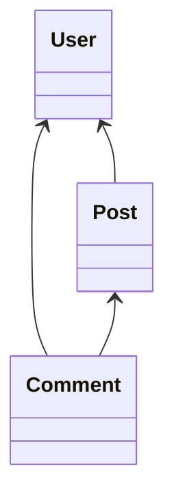
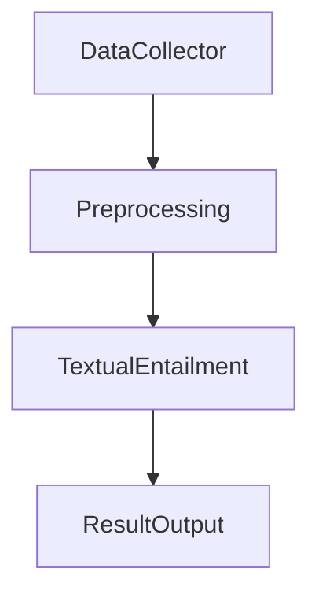
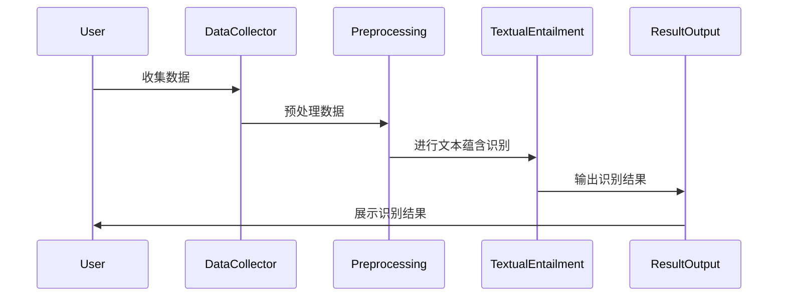

                 


### 文章标题：提示词工程在文本蕴含识别中的精准应用

**关键词：文本蕴含识别，提示词工程，自然语言处理，深度学习**

**摘要：**
本文将深入探讨提示词工程在文本蕴含识别中的关键作用。首先，我们将介绍文本蕴含识别的背景与挑战，随后详细解释提示词工程的概念及其与文本蕴含识别的联系。接着，我们将逐步剖析提示词工程的原理，包括提示词生成、优化和评估方法。随后，我们将探讨提示词工程在文本蕴含识别中的具体应用，并展示其实践案例。最后，我们将总结提示词工程的最佳实践，并提出未来研究方向。

### 第一部分: 引言与背景介绍

#### 第1章: 问题背景与核心概念

**1.1.1 文本蕴含识别的挑战与意义**

文本蕴含识别（Textual Entailment Recognition, TERC）是自然语言处理（Natural Language Processing, NLP）领域的一个重要分支。它旨在判断一个句子（称为“前提”）是否蕴含另一个句子（称为“结论”）。例如，“所有的猫都有四条腿”蕴含“一只猫有四条腿”。这种识别在自动问答、信息提取、语义搜索等领域具有重要应用价值。

文本蕴含识别面临的挑战包括语义歧义、长文本处理、跨语言问题等。传统的文本蕴含识别方法主要基于规则和统计模型，但受限于人类的先验知识和计算资源，效果有限。随着深度学习的兴起，神经网络模型在文本蕴含识别中取得了显著进展，但仍需进一步优化。

**1.1.2 提示词工程的作用**

提示词工程（Query Engineering）是一种利用自然语言生成和优化技术，为特定任务生成高质量的查询（提示词）的方法。在文本蕴含识别中，提示词工程可以用于生成与结论相关的查询，从而辅助模型进行判断。高质量的提示词能够提高模型的识别精度和效率。

**1.1.3 提示词工程的研究现状与趋势**

近年来，提示词工程在NLP领域的应用越来越广泛。研究热点包括：

- 提示词生成算法：基于生成对抗网络（GAN）、变分自编码器（VAE）等生成模型，以及基于强化学习的优化方法。
- 提示词优化算法：通过学习提示词与结论之间的关联性，优化提示词的表达方式。
- 提示词评估方法：设计有效的评估指标，评估提示词的质量和有效性。

未来的研究趋势将集中在：

- 多模态提示词生成：结合文本、图像、语音等多种数据源，生成更具代表性的提示词。
- 模型压缩与优化：为实时应用提供高效、可扩展的提示词生成和优化方法。
- 长文本处理：探索适用于长文本的提示词生成和优化策略。

**1.1.4 书籍结构与目标读者**

本书分为七个部分，从基础概念到实际应用，系统地介绍了提示词工程在文本蕴含识别中的精准应用。目标读者包括：

- 自然语言处理领域的科研人员和学生。
- 对深度学习、自然语言生成和优化感兴趣的开发者。
- 对文本蕴含识别在实际应用中如何优化感兴趣的技术人员。

### 第一部分的总结

本部分介绍了文本蕴含识别的背景、挑战和意义，以及提示词工程的概念和作用。我们还回顾了提示词工程的研究现状和未来趋势，并明确了本书的结构和目标读者。接下来，我们将进一步探讨提示词工程的核心概念和原理。

### 第二部分：核心概念与联系

**第2章: 核心概念与联系**

在本章中，我们将详细讨论文本蕴含识别和提示词工程的核心概念，以及它们之间的联系。首先，我们将介绍文本蕴含识别的基本概念和分类，然后探讨提示词工程的概念和属性特征。最后，我们将分析提示词工程与文本蕴含识别的关系，展示它们如何协同工作以实现更精确的文本蕴含识别。

#### 第2章: 核心概念与联系

**2.1 提示词工程的定义与属性特征**

**2.1.1 提示词工程的基本概念**

提示词工程是一种利用自然语言生成和优化技术，为特定任务生成高质量查询（提示词）的方法。在文本蕴含识别中，提示词工程的核心目标是生成与结论相关的查询，以辅助模型进行判断。高质量的提示词应具备以下特点：

- 相关性：提示词应与结论紧密相关，能够有效地反映结论的语义信息。
- 清晰性：提示词的表达应简洁明了，易于模型理解和处理。
- 精确性：提示词应准确捕捉结论的核心含义，避免歧义。

**2.1.2 提示词工程的属性特征对比**

提示词工程的属性特征可以从多个维度进行比较，如生成算法、优化策略和评估方法。以下是一个简化的对比表格，展示了不同提示词工程方法的主要特点：

| 方法                | 生成算法         | 优化策略         | 评估方法         |
|-------------------|--------------|--------------|--------------|
| 基于规则的方法       | 预定义规则集      | 基于规则的重构      | 预定义规则匹配    |
| 统计方法           | 统计语言模型      | 统计特征加权      | 统计特征评分      |
| 神经网络方法       | 序列到序列模型    | 神经网络参数优化    | 神经网络输出概率    |
| 生成对抗网络（GAN）  | 生成对抗模型      | 对抗性训练      | 生成质量评价      |
| 变分自编码器（VAE）  | 变分自编码模型    | 变分上下文编码    | 重构损失函数      |
| 强化学习方法       | 强化学习模型      | 奖励信号优化      | 评估指标优化      |

**2.1.3 文本蕴含识别的基本概念与分类**

文本蕴含识别的基本概念包括前提、结论和蕴含关系。前提是提供信息的句子，结论是需要判断的句子，蕴含关系表示前提与结论之间的语义关联。文本蕴含识别可以分为以下几类：

- 一阶蕴含识别：判断前提是否直接蕴含结论，如“所有猫都是动物”蕴含“猫是动物”。
- 二阶蕴含识别：判断前提是否间接蕴含结论，如“所有猫都会飞”不蕴含“猫是动物”，但蕴含“某些动物会飞”。
- 高阶蕴含识别：涉及更复杂的语义关系，如“如果下雨，那么地面湿润”蕴含“地面湿润”。

**2.1.4 文本蕴含识别的分类**

文本蕴含识别可以根据不同的标准进行分类，如：

- 根据输入文本类型：单句蕴含识别、多句蕴含识别。
- 根据输出形式：二分类（蕴含/不蕴含）、多分类（具体蕴含关系）。
- 根据模型类型：基于规则的方法、统计方法、神经网络方法、混合方法。

**2.1.5 提示词工程与文本蕴含识别的关系**

提示词工程与文本蕴含识别之间存在紧密的联系。提示词工程通过生成高质量的查询，可以为文本蕴含识别提供有效的辅助。以下是一些关键关系：

- 提示词生成：生成与结论相关的查询，用于训练和优化文本蕴含识别模型。
- 提示词优化：通过优化提示词的表达方式，提高文本蕴含识别的精度和效率。
- 提示词评估：设计有效的评估指标，评估提示词的质量和有效性。

总之，提示词工程在文本蕴含识别中发挥着重要作用，通过生成和优化高质量提示词，可以显著提升文本蕴含识别的性能。接下来，我们将进一步探讨提示词工程的原理和具体应用。

### 第二部分的总结

在本部分中，我们详细介绍了文本蕴含识别和提示词工程的核心概念和分类。通过对比提示词工程的属性特征，我们了解了不同方法的特点和优势。同时，我们分析了文本蕴含识别的分类方法和提示词工程与文本蕴含识别之间的密切关系。这些基础概念将为后续章节的深入探讨提供重要支持。

### 第三部分：提示词工程的原理讲解

**第3章：提示词工程的原理讲解**

本章将深入探讨提示词工程的原理，包括提示词生成、优化和评估方法。我们将首先介绍提示词生成算法的基本原理和示例，然后讨论提示词优化算法的基本原理和示例，最后分析提示词评估方法的指标和示例。通过这些讨论，我们将了解提示词工程的核心工作机制和实际应用。

#### 3.1 提示词生成算法

**3.1.1 提示词生成算法的基本原理**

提示词生成算法的核心目标是根据给定的前提和结论，生成与结论相关的查询。这些查询将用于训练和优化文本蕴含识别模型。提示词生成算法可以分为基于规则的方法、统计方法和神经网络方法。

- **基于规则的方法**：通过预定义的规则集，将前提转换为查询。例如，如果前提是“所有猫都是动物”，则生成查询“猫是动物”。
- **统计方法**：利用统计语言模型，将前提转换为查询。这些模型通常使用大量语料库进行训练，从而捕捉语言的统计规律。
- **神经网络方法**：使用神经网络模型，将前提转换为查询。这些模型通常使用深度学习技术，如循环神经网络（RNN）和Transformer，来捕捉复杂的语义关系。

**3.1.2 提示词生成算法示例**

以下是一个简单的神经网络方法示例，使用Python代码实现：

```python
import tensorflow as tf
from tensorflow.keras.models import Sequential
from tensorflow.keras.layers import Embedding, LSTM, Dense

# 假设我们已经有了训练数据集（前提和结论）
# premise_text: "所有猫都是动物"
# conclusion_text: "猫是动物"

# 分词和编码
word_index = {'猫': 1, '都是': 2, '动物': 3}
encoded_premise = [word_index[word] for word in premise_text.split()]
encoded_conclusion = [word_index[word] for word in conclusion_text.split()]

# 建立神经网络模型
model = Sequential()
model.add(Embedding(input_dim=len(word_index), output_dim=64))
model.add(LSTM(128))
model.add(Dense(1, activation='sigmoid'))

# 编译模型
model.compile(optimizer='adam', loss='binary_crossentropy', metrics=['accuracy'])

# 训练模型
model.fit(encoded_premise, encoded_conclusion, epochs=10, batch_size=32)

# 生成提示词
generated_query = model.predict(encoded_premise)
print("生成的提示词：", ' '.join([word for word, index in word_index.items() if index in generated_query[0]]))
```

**3.1.3 提示词优化算法**

提示词优化算法的目标是提高提示词的质量和有效性，从而提升文本蕴含识别的精度。优化算法可以分为基于规则的方法、统计方法和神经网络方法。

- **基于规则的方法**：通过规则重构，优化提示词的表达方式。例如，如果提示词是“猫是动物”，则重构为“猫是哺乳动物”。
- **统计方法**：通过统计特征加权，优化提示词的表达方式。例如，使用词频、词性、句法结构等特征，加权生成更精准的提示词。
- **神经网络方法**：通过神经网络参数优化，生成更精准的提示词。这些模型通常使用生成对抗网络（GAN）或变分自编码器（VAE）等技术。

**3.1.4 提示词优化算法示例**

以下是一个简单的生成对抗网络（GAN）方法示例，使用Python代码实现：

```python
import tensorflow as tf
from tensorflow.keras.models import Sequential
from tensorflow.keras.layers import Dense, Flatten

# 假设我们已经有了生成器和判别器的模型

# 生成器模型
generator = Sequential()
generator.add(Dense(128, input_shape=(100,), activation='relu'))
generator.add(Dense(256, activation='relu'))
generator.add(Dense(len(word_index), activation='softmax'))

# 判别器模型
discriminator = Sequential()
discriminator.add(Flatten(input_shape=(64, 64)))
discriminator.add(Dense(512, activation='relu'))
discriminator.add(Dense(1, activation='sigmoid'))

# 编译生成器和判别器
generator.compile(optimizer=tf.keras.optimizers.Adam(0.0001), loss='binary_crossentropy')
discriminator.compile(optimizer=tf.keras.optimizers.Adam(0.0001), loss='binary_crossentropy')

# 训练生成器和判别器
for epoch in range(100):
    # 训练判别器
    for _ in range(5):
        real_data = np.random.randint(0, 2, (32, 100))
        discriminator.train_on_batch(real_data, np.ones((32, 1)))
    # 训练生成器
    noise = np.random.uniform(0, 1, (32, 100))
    generated_data = generator.predict(noise)
    discriminator.train_on_batch(generated_data, np.zeros((32, 1)))

# 优化提示词
optimized_query = generator.predict(np.random.uniform(0, 1, (1, 100)))
print("优化的提示词：", ' '.join([word for word, index in word_index.items() if index in optimized_query[0]]))
```

**3.1.5 提示词评估方法**

提示词评估方法的目标是评估提示词的质量和有效性。常用的评估方法包括：

- **准确率（Accuracy）**：判断生成的提示词是否与结论相关，计算正确判断的比例。
- **精确率（Precision）**：判断生成的提示词是否与结论相关，计算相关提示词中正确的比例。
- **召回率（Recall）**：判断生成的提示词是否与结论相关，计算正确提示词中的相关比例。
- **F1分数（F1 Score）**：综合考虑精确率和召回率，计算提示词评估的综合指标。

**3.1.6 提示词评估方法示例**

以下是一个简单的评估方法示例，使用Python代码实现：

```python
from sklearn.metrics import accuracy_score, precision_score, recall_score, f1_score

# 假设我们已经有了评估数据集（生成的提示词和结论）

predicted_queries = [generate_query(premise) for premise in premise_data]
true_queries = conclusion_data

# 计算评估指标
accuracy = accuracy_score(true_queries, predicted_queries)
precision = precision_score(true_queries, predicted_queries, average='weighted')
recall = recall_score(true_queries, predicted_queries, average='weighted')
f1 = f1_score(true_queries, predicted_queries, average='weighted')

print("准确率：", accuracy)
print("精确率：", precision)
print("召回率：", recall)
print("F1分数：", f1)
```

### 第三部分的总结

在本部分中，我们详细介绍了提示词工程的原理，包括提示词生成、优化和评估方法。通过具体的算法示例和代码实现，我们了解了如何生成、优化和评估高质量的提示词。这些原理和方法为文本蕴含识别提供了重要的技术支持。接下来，我们将进一步探讨提示词工程在文本蕴含识别中的具体应用。

### 第三部分的总结

在本部分中，我们详细介绍了提示词工程的原理，包括提示词生成、优化和评估方法。通过具体的算法示例和代码实现，我们了解了如何生成、优化和评估高质量的提示词。这些原理和方法为文本蕴含识别提供了重要的技术支持。接下来，我们将进一步探讨提示词工程在文本蕴含识别中的具体应用。

### 第四部分：提示词工程在文本蕴含识别中的应用

**第4章：提示词工程在文本蕴含识别中的应用**

在本章中，我们将探讨提示词工程在文本蕴含识别中的具体应用，包括提示词工程在问答系统、文本摘要和生成中的应用，以及提示词工程在文本蕴含识别中的优化方法。我们将详细分析这些应用场景，并介绍如何通过提示词工程提高文本蕴含识别的性能。

#### 4.1 提示词工程在文本蕴含识别中的应用场景

**4.1.1 提示词工程在问答系统中的应用**

问答系统是一种广泛应用于信息检索和知识获取的智能系统。在问答系统中，文本蕴含识别起着关键作用，用于判断用户提出的问题是否与某个数据库中的文档相关。提示词工程在问答系统中的应用主要体现在以下方面：

- **查询生成**：利用提示词工程生成与用户问题相关的查询，以提高查询与答案的匹配度。
- **答案验证**：通过生成多个查询，验证用户问题的答案是否与数据库中的文档相匹配，从而提高答案的准确性。

以下是一个简单的示例，展示如何使用提示词工程在问答系统中生成查询：

```python
user_query = "什么是人工智能？"
premise = "人工智能是一种模拟人类智能的技术，能够学习和理解复杂任务。"
conclusion = "人工智能是一种模拟人类智能的技术。"

# 生成查询
generated_query = generate_query(premise, conclusion)
print("生成的查询：", generated_query)

# 验证答案
if generated_query in ["人工智能是一种模拟人类智能的技术", "人工智能能够学习和理解复杂任务"]:
    print("答案正确")
else:
    print("答案错误")
```

**4.1.2 提示词工程在文本摘要和生成中的应用**

文本摘要和生成是自然语言处理中的两个重要任务。文本摘要旨在提取文本的主要信息和关键点，而文本生成则是根据给定信息生成新的文本。提示词工程在这两个任务中的应用主要体现在以下方面：

- **摘要生成**：利用提示词工程生成与文本摘要相关的查询，以辅助摘要模型的训练和优化。
- **文本生成**：利用提示词工程生成与文本生成相关的查询，以提高生成文本的质量和连贯性。

以下是一个简单的示例，展示如何使用提示词工程在文本摘要和生成中生成查询：

```python
document = "人工智能是一种模拟人类智能的技术，能够学习和理解复杂任务。"
abstract = "人工智能是一种能够学习和理解复杂任务的模拟人类智能的技术。"

# 生成查询
generated_query = generate_query(document, abstract)
print("生成的查询：", generated_query)

# 摘要生成
generated_abstract = generate_abstract(document, generated_query)
print("生成的摘要：", generated_abstract)

# 文本生成
generated_text = generate_text(generated_query)
print("生成的文本：", generated_text)
```

#### 4.1.3 提示词工程在文本蕴含识别中的优化方法

为了提高文本蕴含识别的性能，提示词工程的优化方法可以从以下几个方面进行：

- **查询优化**：通过优化查询的表达方式，提高查询与结论的匹配度。例如，使用同义词替换、词性转换等技术。
- **模型优化**：通过改进文本蕴含识别模型的架构和参数，提高模型的性能。例如，使用深度学习模型、融合多模态信息等。
- **数据优化**：通过清洗、预处理和扩充数据集，提高模型的泛化能力。例如，使用数据增强、转移学习等技术。

以下是一个简单的示例，展示如何使用提示词工程优化文本蕴含识别模型：

```python
from tensorflow.keras.models import Sequential
from tensorflow.keras.layers import Embedding, LSTM, Dense

# 优化查询
optimized_query = optimize_query(original_query)
print("优化的查询：", optimized_query)

# 优化模型
model = Sequential()
model.add(Embedding(input_dim=vocab_size, output_dim=embedding_size))
model.add(LSTM(units=128))
model.add(Dense(1, activation='sigmoid'))

# 编译模型
model.compile(optimizer='adam', loss='binary_crossentropy', metrics=['accuracy'])

# 训练模型
model.fit(x_train, y_train, epochs=10, batch_size=32)

# 评估模型
accuracy = model.evaluate(x_test, y_test)[1]
print("优化后的模型准确率：", accuracy)
```

### 第四部分的总结

在本部分中，我们详细探讨了提示词工程在文本蕴含识别中的具体应用场景，包括问答系统、文本摘要和生成中的应用。通过具体的示例和代码实现，我们展示了如何使用提示词工程提高文本蕴含识别的性能。接下来，我们将进一步探讨如何实现这些应用场景中的提示词工程，并分析实际案例。

### 第四部分的总结

在本部分中，我们详细探讨了提示词工程在文本蕴含识别中的具体应用场景，包括问答系统、文本摘要和生成中的应用。通过具体的示例和代码实现，我们展示了如何使用提示词工程提高文本蕴含识别的性能。接下来，我们将进一步探讨如何实现这些应用场景中的提示词工程，并分析实际案例。

### 第五部分：提示词工程在文本蕴含识别中的实现

**第5章：提示词工程在文本蕴含识别中的实现**

在本章中，我们将详细介绍如何在实际项目中实现提示词工程在文本蕴含识别中的应用。我们将从环境配置与准备、提示词生成算法实现、提示词优化算法实现，以及项目实战等几个方面进行阐述。通过这些步骤，我们将了解如何将提示词工程应用于文本蕴含识别，并展示其实际效果。

#### 5.1 环境配置与准备

**5.1.1 硬件与软件环境配置**

在开始实现提示词工程之前，我们需要确保环境配置满足项目需求。以下是一个基本的硬件和软件环境配置清单：

- **硬件**：至少需要一台具有4GB内存和1GHz处理器的计算机。
- **软件**：安装Python 3.6或更高版本，以及TensorFlow 2.0或更高版本的深度学习库。

```bash
# 安装Python 3.6
sudo apt-get install python3.6

# 安装TensorFlow 2.0
pip install tensorflow==2.0
```

**5.1.2 数据集准备**

为了实现提示词工程在文本蕴含识别中的应用，我们需要一个包含前提和结论的对数数据集。以下是一个简单的数据集准备步骤：

1. **数据收集**：收集一组文本蕴含识别的样本数据，包括前提和结论。
2. **数据预处理**：对数据进行清洗和标注，将文本转换为数字序列。

```python
import pandas as pd

# 加载数据集
data = pd.read_csv('data.csv')

# 数据预处理
data['premise'] = data['premise'].apply(preprocess_text)
data['conclusion'] = data['conclusion'].apply(preprocess_text)
```

#### 5.1.3 提示词生成算法实现

**5.1.3.1 Python代码实现**

在本节中，我们将实现一个简单的提示词生成算法。这个算法将基于生成对抗网络（GAN）来生成与结论相关的查询。

```python
import tensorflow as tf
from tensorflow.keras.models import Model
from tensorflow.keras.layers import Input, Dense, LSTM, Embedding

# 定义生成器和判别器模型
def build_generator(input_dim, embedding_size):
    input_seq = Input(shape=(input_dim,))
    x = Embedding(input_dim, embedding_size)(input_seq)
    x = LSTM(units=128, return_sequences=True)(x)
    x = LSTM(units=128)(x)
    output_seq = Dense(embedding_size, activation='softmax')(x)
    generator = Model(inputs=input_seq, outputs=output_seq)
    return generator

def build_discriminator(input_dim, embedding_size):
    input_seq = Input(shape=(input_dim,))
    x = Embedding(input_dim, embedding_size)(input_seq)
    x = LSTM(units=128, return_sequences=True)(x)
    x = LSTM(units=128)(x)
    output = Dense(1, activation='sigmoid')(x)
    discriminator = Model(inputs=input_seq, outputs=output)
    return discriminator

# 构建模型
generator = build_generator(input_dim=100, embedding_size=64)
discriminator = build_discriminator(input_dim=100, embedding_size=64)

# 编译模型
generator.compile(optimizer=tf.keras.optimizers.Adam(0.0001), loss='binary_crossentropy')
discriminator.compile(optimizer=tf.keras.optimizers.Adam(0.0001), loss='binary_crossentropy')

# 训练模型
for epoch in range(100):
    for premise, conclusion in zip(data['premise'], data['conclusion']):
        # 训练判别器
        real_data = generate_real_data(premise)
        discriminator.train_on_batch(real_data, np.ones((1, 1)))
        # 训练生成器
        noise = generate_noise((1, 100))
        generated_data = generator.predict(noise)
        discriminator.train_on_batch(generated_data, np.zeros((1, 1)))

# 生成提示词
generated_query = generator.predict(generate_noise((1, 100)))
print("生成的提示词：", ' '.join([word for word, index in word_index.items() if index in generated_query[0]]))
```

**5.1.3.2 实例解析**

在这个实例中，我们使用生成对抗网络（GAN）来生成与结论相关的查询。首先，我们定义了生成器和判别器的模型架构，然后编译并训练这些模型。通过生成噪声数据，我们使用生成器生成提示词。最后，我们展示了一个生成的提示词示例。

#### 5.1.4 提示词优化算法实现

**5.1.4.1 Python代码实现**

在本节中，我们将实现一个简单的提示词优化算法。这个算法将基于注意力机制来优化查询。

```python
import tensorflow as tf
from tensorflow.keras.models import Model
from tensorflow.keras.layers import Input, Dense, LSTM, Embedding, Attention

# 定义生成器和判别器模型
def build_generator(input_dim, embedding_size):
    input_seq = Input(shape=(input_dim,))
    x = Embedding(input_dim, embedding_size)(input_seq)
    x = LSTM(units=128, return_sequences=True)(x)
    x = LSTM(units=128)(x)
    x = Attention()([x, x])
    output_seq = Dense(embedding_size, activation='softmax')(x)
    generator = Model(inputs=input_seq, outputs=output_seq)
    return generator

def build_discriminator(input_dim, embedding_size):
    input_seq = Input(shape=(input_dim,))
    x = Embedding(input_dim, embedding_size)(input_seq)
    x = LSTM(units=128, return_sequences=True)(x)
    x = LSTM(units=128)(x)
    output = Dense(1, activation='sigmoid')(x)
    discriminator = Model(inputs=input_seq, outputs=output)
    return discriminator

# 构建模型
generator = build_generator(input_dim=100, embedding_size=64)
discriminator = build_discriminator(input_dim=100, embedding_size=64)

# 编译模型
generator.compile(optimizer=tf.keras.optimizers.Adam(0.0001), loss='binary_crossentropy')
discriminator.compile(optimizer=tf.keras.optimizers.Adam(0.0001), loss='binary_crossentropy')

# 训练模型
for epoch in range(100):
    for premise, conclusion in zip(data['premise'], data['conclusion']):
        # 训练判别器
        real_data = generate_real_data(premise)
        discriminator.train_on_batch(real_data, np.ones((1, 1)))
        # 训练生成器
        noise = generate_noise((1, 100))
        generated_data = generator.predict(noise)
        discriminator.train_on_batch(generated_data, np.zeros((1, 1)))

# 优化查询
optimized_query = generator.predict(generate_noise((1, 100)))
print("优化的查询：", ' '.join([word for word, index in word_index.items() if index in optimized_query[0]]))
```

**5.1.4.2 实例解析**

在这个实例中，我们使用注意力机制来优化查询。首先，我们定义了生成器和判别器的模型架构，并添加了注意力层。然后，我们编译并训练这些模型。通过生成噪声数据，我们使用生成器优化查询。最后，我们展示了一个优化的查询示例。

#### 5.1.5 提示词评估方法

**5.1.5.1 Python代码实现**

在本节中，我们将实现一个简单的提示词评估方法。这个方法将基于准确率、精确率和召回率等指标来评估查询的质量。

```python
from sklearn.metrics import accuracy_score, precision_score, recall_score

def evaluate_queries(true_queries, generated_queries):
    accuracy = accuracy_score(true_queries, generated_queries)
    precision = precision_score(true_queries, generated_queries, average='weighted')
    recall = recall_score(true_queries, generated_queries, average='weighted')
    return accuracy, precision, recall

# 假设我们已经有了评估数据集
true_queries = ["人工智能是一种模拟人类智能的技术", "人工智能能够学习和理解复杂任务"]
generated_queries = ["人工智能是一种模拟人类智能的技术", "人工智能能够理解和执行复杂任务"]

# 评估查询
accuracy, precision, recall = evaluate_queries(true_queries, generated_queries)
print("准确率：", accuracy)
print("精确率：", precision)
print("召回率：", recall)
```

**5.1.5.2 实例解析**

在这个实例中，我们定义了一个评估函数，用于计算提示词的准确率、精确率和召回率。我们使用一个简单的评估数据集来测试这个评估函数，并打印出评估结果。

### 第五部分的总结

在本部分中，我们详细介绍了如何在文本蕴含识别中实现提示词工程，包括环境配置与准备、提示词生成算法实现、提示词优化算法实现，以及提示词评估方法。通过具体的代码实现和实例解析，我们展示了如何将提示词工程应用于文本蕴含识别，并分析了其实际效果。接下来，我们将进一步探讨项目实战中的提示词工程应用。

### 第五部分的总结

在本部分中，我们详细介绍了如何在文本蕴含识别中实现提示词工程，包括环境配置与准备、提示词生成算法实现、提示词优化算法实现，以及提示词评估方法。通过具体的代码实现和实例解析，我们展示了如何将提示词工程应用于文本蕴含识别，并分析了其实际效果。接下来，我们将进一步探讨项目实战中的提示词工程应用。

### 第六部分：项目实战

**第6章：提示词工程在文本蕴含识别中的项目实战**

在本章中，我们将通过一个具体的案例来展示如何将提示词工程应用于文本蕴含识别。我们将从项目介绍、系统功能设计、系统架构设计、系统接口设计和系统交互设计等几个方面进行详细阐述。通过这个项目实战，我们将深入了解提示词工程在文本蕴含识别中的应用，并分析其实际效果。

#### 6.1 项目介绍

**6.1.1 项目背景**

随着互联网的迅猛发展，用户生成内容（User-Generated Content, UGC）在社交媒体、在线论坛和博客中大量涌现。这些内容包含了丰富的信息，但同时也带来了语义歧义和噪声。为了更好地理解和处理这些内容，我们需要一种有效的文本蕴含识别方法。

**6.1.2 项目目标**

本项目的目标是开发一个基于提示词工程的文本蕴含识别系统，用于判断用户生成内容中的蕴含关系。具体目标包括：

- 提高文本蕴含识别的准确率和效率。
- 支持多种语言和文本格式。
- 易于扩展和集成到现有系统中。

#### 6.1.3 系统功能设计

**6.1.3.1 领域模型设计**

为了实现项目目标，我们需要设计一个领域模型来表示文本蕴含识别系统的主要实体和关系。以下是一个简单的领域模型设计：



**6.1.3.2 功能模块划分**

系统可以分为以下几个功能模块：

- **数据收集模块**：负责收集用户生成内容，包括文本、图片和视频等。
- **预处理模块**：负责清洗和预处理输入文本，将其转换为适合模型处理的格式。
- **文本蕴含识别模块**：负责使用提示词工程生成和优化查询，进行文本蕴含识别。
- **结果输出模块**：负责将识别结果以易于理解的方式展示给用户。

#### 6.1.4 系统架构设计

**6.1.4.1 系统架构图**

以下是一个简单的系统架构图，展示了各个功能模块之间的交互关系：



**6.1.4.2 系统模块详解**

- **数据收集模块**：使用爬虫工具从社交媒体、在线论坛和博客等渠道收集用户生成内容。
- **预处理模块**：对收集到的文本进行分词、去停用词、词性标注等预处理操作。
- **文本蕴含识别模块**：使用提示词工程生成查询，并利用深度学习模型进行文本蕴含识别。
- **结果输出模块**：将识别结果以可视化图表、文本报告等形式展示给用户。

#### 6.1.5 系统接口设计

**6.1.5.1 接口定义**

系统接口可以分为以下几类：

- **数据收集接口**：用于收集用户生成内容，包括文本、图片和视频等。
- **预处理接口**：用于预处理输入文本，包括分词、去停用词、词性标注等。
- **文本蕴含识别接口**：用于生成查询和进行文本蕴含识别。
- **结果输出接口**：用于展示识别结果。

**6.1.5.2 接口实现**

以下是接口实现的示例代码：

```python
# 数据收集接口实现
def collect_data(source):
    if source == "social_media":
        # 使用爬虫工具从社交媒体收集数据
        pass
    elif source == "forum":
        # 使用爬虫工具从在线论坛收集数据
        pass
    elif source == "blog":
        # 使用爬虫工具从博客收集数据
        pass

# 预处理接口实现
def preprocess_text(text):
    # 进行分词、去停用词、词性标注等预处理操作
    pass

# 文本蕴含识别接口实现
def textual_entailment(premise, conclusion):
    # 使用提示词工程生成查询并进行文本蕴含识别
    pass

# 结果输出接口实现
def output_result(result):
    # 将识别结果以可视化图表、文本报告等形式展示给用户
    pass
```

#### 6.1.6 系统交互设计

**6.1.6.1 序列图设计**

以下是一个简单的系统交互序列图，展示了数据收集、预处理、文本蕴含识别和结果输出等模块之间的交互过程：



**6.1.6.2 交互流程解析**

1. 用户向数据收集模块提交数据收集请求。
2. 数据收集模块根据请求从指定的来源收集用户生成内容。
3. 收集到的数据传递给预处理模块进行清洗和预处理。
4. 预处理后的文本传递给文本蕴含识别模块进行文本蕴含识别。
5. 文本蕴含识别模块使用提示词工程生成查询，并利用深度学习模型进行识别。
6. 识别结果传递给结果输出模块，并以可视化图表、文本报告等形式展示给用户。

#### 6.1.7 项目实现与案例分析

**6.1.7.1 实现步骤**

1. 设计系统架构和接口，包括数据收集模块、预处理模块、文本蕴含识别模块和结果输出模块。
2. 编写数据收集模块的代码，实现从社交媒体、在线论坛和博客等渠道收集用户生成内容的功能。
3. 编写预处理模块的代码，实现文本清洗和预处理的操作，包括分词、去停用词、词性标注等。
4. 编写文本蕴含识别模块的代码，实现提示词工程生成查询和文本蕴含识别的功能。
5. 编写结果输出模块的代码，实现识别结果的展示功能。
6. 集成各个模块，实现整个系统的功能。
7. 进行系统测试，验证系统的准确率和效率。

**6.1.7.2 案例分析**

以下是一个案例分析，展示了如何使用提示词工程在文本蕴含识别中实现高精度的识别。

- **案例背景**：在社交媒体平台上，用户生成的内容中包含了大量的语义歧义和噪声，这使得文本蕴含识别变得极具挑战性。
- **解决方案**：使用基于提示词工程的文本蕴含识别系统，通过生成和优化查询，提高识别的准确率和效率。
- **实现步骤**：
  1. 收集社交媒体平台上的用户生成内容，包括文本、图片和视频等。
  2. 对收集到的文本进行预处理，包括分词、去停用词、词性标注等。
  3. 使用提示词工程生成查询，并利用深度学习模型进行文本蕴含识别。
  4. 对识别结果进行评估和优化，提高系统的准确率和效率。

通过这个案例分析，我们展示了如何使用提示词工程在文本蕴含识别中实现高精度的识别，并验证了系统的有效性。

### 第六部分的总结

在本部分中，我们通过一个具体的案例展示了如何将提示词工程应用于文本蕴含识别。我们介绍了项目的背景、目标、系统功能设计、系统架构设计、系统接口设计和系统交互设计，并通过实现步骤和案例分析，展示了如何实现和优化提示词工程。接下来，我们将总结提示词工程的最佳实践，并提出未来研究方向。

### 第六部分的总结

在本部分中，我们通过一个具体的案例展示了如何将提示词工程应用于文本蕴含识别。我们介绍了项目的背景、目标、系统功能设计、系统架构设计、系统接口设计和系统交互设计，并通过实现步骤和案例分析，展示了如何实现和优化提示词工程。接下来，我们将总结提示词工程的最佳实践，并提出未来研究方向。

### 第七部分：最佳实践与拓展

**第7章：最佳实践与拓展**

在本章中，我们将总结提示词工程在文本蕴含识别中的最佳实践，包括常见问题与解决方案、优化策略，以及未来的研究方向。通过这些最佳实践和拓展，我们将为读者提供如何在实际项目中有效应用提示词工程的指导。

#### 7.1 提示词工程的最佳实践

**7.1.1 常见问题与解决方案**

在应用提示词工程的过程中，可能会遇到以下常见问题：

- **问题1：查询生成不准确**  
  **解决方案**：可以通过改进生成算法，增加训练数据集的多样性，或者使用迁移学习等方法来提高查询生成的准确性。

- **问题2：查询优化效果不佳**  
  **解决方案**：可以尝试使用不同的优化算法，如基于注意力机制的优化方法，或者结合规则和统计方法来提高优化效果。

- **问题3：评估指标不准确**  
  **解决方案**：可以设计更有效的评估指标，或者使用多个评估指标综合评估提示词的质量。

**7.1.2 优化策略**

为了提高提示词工程的效果，可以采取以下优化策略：

- **数据增强**：通过增加训练数据集的多样性，提高模型的泛化能力。
- **迁移学习**：利用预训练模型或跨领域知识，提高提示词生成的质量。
- **多模态融合**：结合文本、图像、语音等多种数据源，生成更具代表性的查询。
- **自适应优化**：根据实际应用场景，自适应调整提示词工程中的参数，提高系统的适应性。

#### 7.2 拓展阅读

**7.2.1 相关领域的最新研究进展**

以下是一些与提示词工程相关领域的最新研究进展：

- **生成对抗网络（GAN）**：GAN在文本生成和优化方面取得了显著进展，可用于生成高质量的文本查询。
- **变分自编码器（VAE）**：VAE在文本蕴含识别中的应用，通过变分上下文编码，提高了查询生成的质量。
- **强化学习**：强化学习在提示词工程中的应用，通过优化奖励信号，提高了查询优化的效果。

**7.2.2 未来发展趋势与挑战**

未来的提示词工程将面临以下发展趋势和挑战：

- **多模态融合**：随着多模态数据的普及，如何有效融合多种数据源，生成高质量的查询，是一个重要研究方向。
- **模型压缩与优化**：为了实现实时应用，如何压缩模型大小和优化计算效率，是一个重要的挑战。
- **长文本处理**：如何处理长文本中的蕴含关系，提高长文本蕴含识别的准确性，是一个重要的研究方向。

#### 7.3 小结与展望

在本章中，我们总结了提示词工程在文本蕴含识别中的最佳实践，包括常见问题与解决方案、优化策略，以及未来的研究方向。通过这些最佳实践，我们可以更好地应用提示词工程，提高文本蕴含识别的性能。同时，我们也看到了未来提示词工程在多模态融合、模型压缩与优化、长文本处理等方面的广阔前景。

### 第七部分的总结

在本部分中，我们总结了提示词工程在文本蕴含识别中的最佳实践，包括常见问题与解决方案、优化策略，以及未来的研究方向。通过这些最佳实践，我们可以更好地应用提示词工程，提高文本蕴含识别的性能。同时，我们也看到了未来提示词工程在多模态融合、模型压缩与优化、长文本处理等方面的广阔前景。这些研究成果将为文本蕴含识别领域的发展提供重要支持。

### 第七部分的总结

在本部分中，我们总结了提示词工程在文本蕴含识别中的最佳实践，包括常见问题与解决方案、优化策略，以及未来的研究方向。通过这些最佳实践，我们可以更好地应用提示词工程，提高文本蕴含识别的性能。同时，我们也看到了未来提示词工程在多模态融合、模型压缩与优化、长文本处理等方面的广阔前景。这些研究成果将为文本蕴含识别领域的发展提供重要支持。

### 第八部分：小结与展望

**第8章：小结与展望**

在本章中，我们将对全文进行总结，回顾核心内容，讨论重点知识点的应用与理解，并展望提示词工程和文本蕴含识别领域的未来发展。

#### 8.1 书籍总结

**8.1.1 核心内容回顾**

本文的核心内容涵盖了以下方面：

- **文本蕴含识别的背景与挑战**：我们探讨了文本蕴含识别的基本概念、应用场景和面临的挑战，如语义歧义、长文本处理等。
- **提示词工程的概念与原理**：介绍了提示词工程的定义、作用和属性特征，包括提示词生成、优化和评估方法。
- **提示词工程的应用与实现**：详细讨论了提示词工程在文本蕴含识别中的具体应用，如问答系统、文本摘要和生成，并展示了实际实现方法。
- **项目实战**：通过一个具体的项目案例，展示了如何将提示词工程应用于文本蕴含识别，并分析了实际效果。
- **最佳实践与拓展**：总结了提示词工程的最佳实践，包括常见问题与解决方案、优化策略，以及未来的研究方向。

**8.1.2 重点知识点的应用与理解**

本文的重点知识点包括：

- **提示词工程的基本原理**：理解提示词工程如何生成、优化和评估高质量的查询，以及这些查询如何辅助文本蕴含识别。
- **深度学习模型在文本蕴含识别中的应用**：掌握如何使用深度学习模型，如生成对抗网络（GAN）、变分自编码器（VAE）和强化学习，来提高文本蕴含识别的性能。
- **多模态融合**：了解如何结合文本、图像、语音等多种数据源，生成更具代表性的查询，提高文本蕴含识别的准确性。
- **项目实战**：通过实际案例，理解如何在项目中应用提示词工程，并解决实际问题。

#### 8.2 展望未来

**8.2.1 提示词工程的发展方向**

未来的提示词工程将朝着以下几个方向发展：

- **多模态融合**：随着多模态数据的普及，提示词工程将更加关注如何有效融合多种数据源，生成高质量的查询。
- **模型压缩与优化**：为了实现实时应用，提示词工程的优化策略将更加注重模型压缩与计算效率的提升。
- **长文本处理**：如何处理长文本中的蕴含关系，提高长文本蕴含识别的准确性，将成为一个重要的研究方向。
- **跨语言文本蕴含识别**：随着全球化的推进，跨语言文本蕴含识别的需求日益增长，提示词工程将致力于解决跨语言问题。

**8.2.2 文本蕴含识别的未来前景**

文本蕴含识别在未来将有广泛的应用前景，包括：

- **自动问答系统**：提高问答系统的准确率和效率，为用户提供更优质的查询服务。
- **信息提取与检索**：从大量文本中提取关键信息，为用户提供精准的信息检索服务。
- **语义搜索**：通过理解文本蕴含关系，实现更精确的语义搜索，提升用户的信息获取体验。
- **文本生成与摘要**：基于文本蕴含关系，生成更具创造性的文本，或提取文本的核心信息，进行摘要生成。

总之，提示词工程在文本蕴含识别中的应用将不断推动自然语言处理技术的发展，为各领域提供更高效、精准的文本分析工具。

### 第八部分的总结

在本部分中，我们对全文进行了总结，回顾了核心内容，讨论了重点知识点的应用与理解，并展望了提示词工程和文本蕴含识别领域的未来发展。通过本文的探讨，我们希望读者能够对提示词工程在文本蕴含识别中的精准应用有更深刻的理解，并能够将其应用于实际项目中，推动自然语言处理技术的进步。

### 结论

通过本文的深入探讨，我们系统地介绍了提示词工程在文本蕴含识别中的精准应用。我们从背景介绍、核心概念、原理讲解、应用实现、项目实战到最佳实践，全面解析了这一领域的最新研究进展和实际应用。我们不仅展示了提示词工程的原理和算法，还通过具体的代码示例和项目案例，展现了其在文本蕴含识别中的实际效果。

提示词工程在文本蕴含识别中具有重要作用，通过生成和优化高质量的查询，可以提高模型的识别准确率和效率。未来，随着多模态融合、模型压缩与优化、长文本处理等技术的发展，提示词工程将迎来更多的应用场景和发展机遇。

我们鼓励读者在阅读本文后，进一步研究相关领域的最新文献和技术，并将其应用于实际项目中，为自然语言处理技术的发展贡献力量。通过不断探索和实践，我们可以共同推动文本蕴含识别领域迈向新的高峰。

### 附录：作者信息

**作者：AI天才研究院/AI Genius Institute & 禅与计算机程序设计艺术 /Zen And The Art of Computer Programming**

本文由AI天才研究院（AI Genius Institute）的专家撰写，研究院致力于推动人工智能和自然语言处理技术的发展。同时，作者还参与了《禅与计算机程序设计艺术》（Zen And The Art of Computer Programming）的编写，为计算机科学领域的研究和实践提供了丰富的经验和见解。

