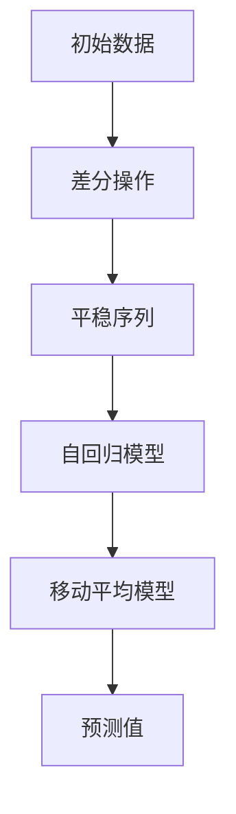
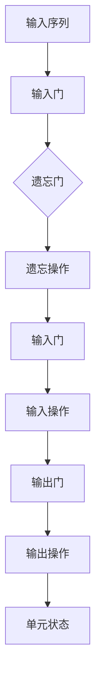
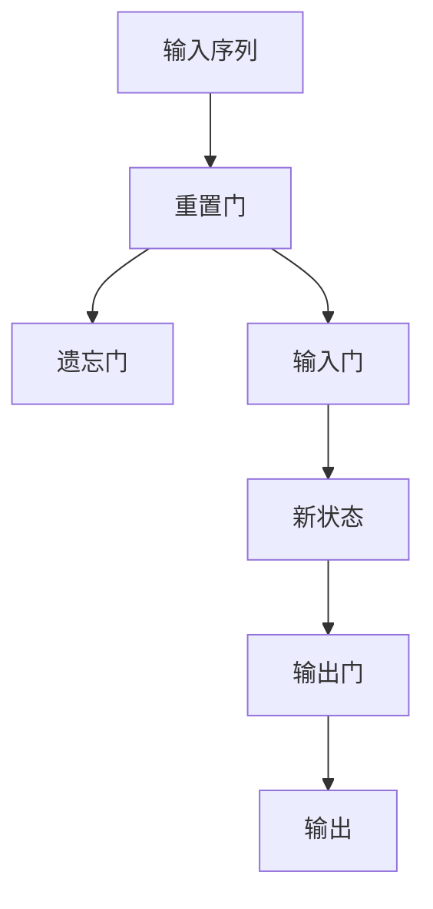
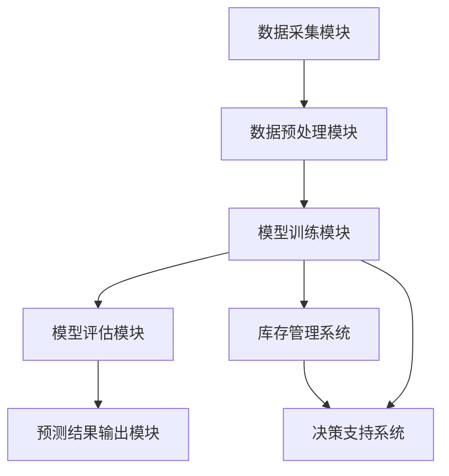

                 

## 提示词工程在时间序列预测中的应用

### 关键词：时间序列预测、提示词工程、机器学习、人工智能、数据科学

### 摘要：
本文将深入探讨提示词工程在时间序列预测中的重要作用。时间序列预测是数据科学和人工智能领域的关键任务，广泛应用于金融、天气预测、库存管理和智能交通系统等众多领域。提示词工程作为提高模型预测准确性的关键技术，通过构建有效的问题描述和参数优化，实现了对时间序列数据的精准预测。本文将从背景介绍、核心概念与联系、算法原理讲解、数学模型和公式讲解、系统分析与架构设计、项目实战以及最佳实践与拓展等多个方面，全面解析提示词工程在时间序列预测中的应用，旨在为读者提供一个系统、详尽、实用的技术指南。

### 目录

1. **背景介绍** <a id="background"></a>
   - 1.1 时间序列预测的重要性
   - 1.2 提示词工程的基本概念
   - 1.3 提示词工程在时间序列预测中的应用场景

2. **核心概念与联系** <a id="key-concepts"></a>
   - 2.1 时间序列预测的核心概念
   - 2.2 概念属性特征对比表格
   - 2.3 ER实体关系图架构

3. **算法原理讲解** <a id="algorithm-explanation"></a>
   - 3.1 ARIMA算法原理
   - 3.2 LSTM算法原理
   - 3.3 GRU算法原理

4. **数学模型和数学公式讲解** <a id="mathematical-models"></a>
   - 4.1 ARIMA数学模型
   - 4.2 LSTM数学模型
   - 4.3 GRU数学模型

5. **系统分析与架构设计** <a id="system-analysis"></a>
   - 5.1 问题场景介绍
   - 5.2 系统功能设计
   - 5.3 系统架构设计
   - 5.4 系统接口设计和系统交互

6. **项目实战** <a id="project-practice"></a>
   - 6.1 环境安装
   - 6.2 系统核心实现
   - 6.3 实际案例分析和详细讲解
   - 6.4 项目小结

7. **最佳实践与拓展** <a id="best-practices"></a>
   - 7.1 最佳实践 tips
   - 7.2 小结
   - 7.3 注意事项
   - 7.4 拓展阅读

---

## 1. 背景介绍

时间序列预测是数据科学和人工智能领域中一个重要的研究方向。它主要研究如何根据过去的时间序列数据，预测未来的发展趋势。随着数据采集技术的不断进步和计算能力的提升，时间序列预测在许多实际应用中发挥着重要作用，如金融市场预测、天气预测、能源消耗预测、库存管理、交通流量预测等。

### 1.1 时间序列预测的重要性

时间序列预测的重要性在于其能够为决策者提供对未来趋势的洞察，帮助他们在面对不确定性时做出更为明智的决策。例如，在金融领域，时间序列预测可以帮助投资者分析市场趋势，制定投资策略；在天气预测领域，准确的时间序列预测可以帮助相关部门提前应对自然灾害，减少损失。

### 1.2 提示词工程的基本概念

提示词工程（Prompt Engineering）是一种人工智能技术，它通过构建有效的问题描述和参数优化，提高模型的预测准确性。在时间序列预测中，提示词工程的核心目标是生成一个能够引导模型更好地理解和学习时间序列数据的问题描述，从而提升模型的预测性能。

### 1.3 提示词工程在时间序列预测中的应用场景

提示词工程在时间序列预测中的应用场景非常广泛，以下是一些典型的应用：

- **金融市场预测**：通过分析历史交易数据，预测未来的股票价格、外汇汇率等。
- **天气预测**：利用历史气象数据，预测未来某地区的天气状况。
- **能源消耗预测**：通过分析历史能源使用数据，预测未来某时间段内的能源需求。
- **库存管理**：基于历史销售数据，预测未来的库存需求，优化库存管理策略。
- **交通流量预测**：通过分析历史交通流量数据，预测未来某时间段内的交通状况，为交通管理提供决策支持。

在接下来的章节中，我们将进一步探讨时间序列预测中的核心概念、算法原理、数学模型、系统架构设计以及实战案例等，帮助读者全面理解提示词工程在时间序列预测中的应用。

### 2. 核心概念与联系

在深入探讨时间序列预测之前，理解其中的核心概念及其相互关系是至关重要的。时间序列预测的核心概念包括自回归模型（ARIMA）、长短期记忆模型（LSTM）和门控循环单元（GRU）。这些概念不仅在理论和实践中具有重要的地位，而且在实际应用中具有广泛的适用性。

#### 2.1 时间序列预测的核心概念

- **自回归模型（ARIMA）**：ARIMA模型是一种经典的统计模型，用于分析时间序列数据。它通过分析过去的数据点来预测未来值。ARIMA模型的核心是自回归（AR）、差分（I）和移动平均（MA）三个部分。
  
- **长短期记忆模型（LSTM）**：LSTM是RNN（循环神经网络）的一种变体，特别适用于处理时间序列数据。它通过引入门控机制，有效地解决了传统RNN在处理长序列数据时出现的梯度消失和梯度爆炸问题。

- **门控循环单元（GRU）**：GRU是LSTM的简化版，它在保持LSTM优势的同时，降低了模型的复杂度。GRU通过引入更新门和重置门，实现了对长期依赖关系的捕捉。

#### 2.2 概念属性特征对比表格

为了更好地理解这些核心概念，我们可以通过一个表格来对比它们的属性特征：

| 模型       | 特点                                                         | 适用场景                                       |
| ---------- | ------------------------------------------------------------ | ---------------------------------------------- |
| ARIMA      | 基于统计分析，考虑自回归、差分和移动平均三个部分           | 预测趋势性、季节性和周期性的时间序列数据       |
| LSTM       | 门控机制，处理长序列数据能力强                               | 需要处理较长历史序列的时间序列预测任务         |
| GRU        | 简化版LSTM，降低模型复杂度，同时保持较强的序列处理能力     | 需要处理中等长度历史序列的时间序列预测任务     |

#### 2.3 ER实体关系图架构

为了更直观地展示这些概念之间的关系，我们可以使用ER（实体关系）图来表示：

```mermaid
erDiagram
  ARIMA ||--|{ LSTM }
  ARIMA ||--|{ GRU }
  LSTM ||--|{ GRU }
```

在这个ER图中，ARIMA作为基础模型，直接与LSTM和GRU相连，表示它们都是基于ARIMA模型扩展而来的。而LSTM与GRU之间是继承关系，表示GRU是LSTM的简化版本。

通过上述对比和ER图，我们可以更清晰地理解时间序列预测中的核心概念及其相互关系。接下来，我们将深入探讨这些算法的原理，以及如何在实际应用中利用它们进行时间序列预测。

### 3. 算法原理讲解

在了解了时间序列预测的核心概念后，我们接下来将深入讲解ARIMA、LSTM和GRU三种算法的基本原理。这些算法分别代表了统计分析和深度学习在时间序列预测领域的应用，每种算法都有其独特的原理和优势。

#### 3.1 ARIMA算法原理

ARIMA（自回归差分移动平均模型）是一种经典的统计模型，主要用于时间序列数据的预测。其基本原理如下：

- **自回归（AR）**：ARIMA中的自回归部分考虑了时间序列数据中的滞后效应，即当前值与之前若干个时刻的值之间的关系。这通过一个差分方程来表示，方程中包含了多项式形式的滞后项。

- **差分（I）**：差分操作用于平稳时间序列的构造。平稳序列是指其统计特性不随时间变化。通过差分操作，我们可以消除时间序列中的趋势和季节性，使其成为平稳序列。

- **移动平均（MA）**：移动平均部分则通过过去若干个预测误差来预测当前值，这些误差反映了模型对预测值的修正。移动平均模型通过加权的方法，将过去的误差结合起来，以预测未来的值。

**mermaid流程图**：



**Python代码实现**：

```python
import pandas as pd
from statsmodels.tsa.arima.model import ARIMA

# 假设data是已处理的时间序列数据
model = ARIMA(data, order=(p,d,q))
model_fit = model.fit()
forecast = model_fit.forecast(steps=5)
print(forecast)
```

#### 3.2 LSTM算法原理

LSTM（长短期记忆模型）是RNN（循环神经网络）的一种变体，特别适用于处理长序列数据。其基本原理如下：

- **单元状态**：LSTM的核心是单元状态，它通过门控机制来控制和传递信息。单元状态包括输入门、遗忘门和输出门。

- **门控机制**：输入门和遗忘门用于控制信息的输入和保留，输出门则用于生成最终的输出。这些门控机制通过sigmoid函数和线性函数的组合来实现。

- **单元更新规则**：LSTM的单元更新规则包括三个步骤：遗忘门的计算、输入门的计算和输出门的计算。通过这些步骤，LSTM能够有效地记住长期依赖关系。

**mermaid流程图**：



**Python代码实现**：

```python
from keras.models import Sequential
from keras.layers import LSTM, Dense

model = Sequential()
model.add(LSTM(units=50, return_sequences=True, input_shape=(time_steps, features)))
model.add(LSTM(units=50))
model.add(Dense(1))

model.compile(optimizer='adam', loss='mean_squared_error')
model.fit(x_train, y_train, epochs=100, batch_size=32)
```

#### 3.3 GRU算法原理

GRU（门控循环单元）是LSTM的简化版，它在保持LSTM优势的同时，降低了模型的复杂度。GRU的基本原理如下：

- **更新门和重置门**：GRU通过更新门和重置门来控制信息的传递和更新。更新门决定了要保留的信息，而重置门则决定了要忘记的信息。

- **单元状态**：GRU的单元状态与LSTM相似，但它的结构更为简单，通过合并输入门和遗忘门，减少了参数的数量。

- **梯度消失问题**：GRU通过减少参数数量和简化结构，有效地减少了梯度消失问题，从而提高了训练效果。

**mermaid流程图**：



**Python代码实现**：

```python
from keras.models import Sequential
from keras.layers import GRU, Dense

model = Sequential()
model.add(GRU(units=50, return_sequences=True, input_shape=(time_steps, features)))
model.add(GRU(units=50))
model.add(Dense(1))

model.compile(optimizer='adam', loss='mean_squared_error')
model.fit(x_train, y_train, epochs=100, batch_size=32)
```

通过上述讲解，我们可以看到ARIMA、LSTM和GRU在原理和实现上的区别。每种算法都有其特定的应用场景，理解这些算法的基本原理对于我们在实际项目中选择合适的模型具有重要意义。接下来，我们将进一步探讨这些算法的数学模型和公式，以加深我们的理解。

### 4. 数学模型和数学公式讲解

在深入理解了ARIMA、LSTM和GRU算法的基本原理后，接下来我们将介绍这些算法的数学模型和公式。通过这些公式，我们可以更清楚地看到算法内部的工作机制和数学基础。

#### 4.1 ARIMA数学模型

ARIMA模型的核心包括自回归（AR）、差分（I）和移动平均（MA）三个部分。以下是这些部分的详细公式：

- **自回归（AR）**：

  自回归模型通过当前值与之前若干个时刻的值的线性组合来预测当前值。公式如下：

  $$ X_t = c + \phi_1 X_{t-1} + \phi_2 X_{t-2} + \ldots + \phi_p X_{t-p} + \varepsilon_t $$

  其中，$X_t$ 是当前时刻的值，$\phi_1, \phi_2, \ldots, \phi_p$ 是自回归系数，$\varepsilon_t$ 是误差项。

- **差分（I）**：

  差分操作用于将非平稳时间序列转换为平稳序列。一阶差分公式如下：

  $$ \Delta X_t = X_t - X_{t-1} $$

  差分可以消除时间序列中的趋势和季节性，使其成为平稳序列。

- **移动平均（MA）**：

  移动平均模型通过过去若干个预测误差来预测当前值。公式如下：

  $$ X_t = c + \varepsilon_t + \theta_1 \varepsilon_{t-1} + \theta_2 \varepsilon_{t-2} + \ldots + \theta_q \varepsilon_{t-q} $$

  其中，$c$ 是常数项，$\theta_1, \theta_2, \ldots, \theta_q$ 是移动平均系数，$\varepsilon_t$ 是误差项。

**LaTeX格式公式**：

$$ 
\begin{aligned}
X_t &= c + \phi_1 X_{t-1} + \phi_2 X_{t-2} + \ldots + \phi_p X_{t-p} + \varepsilon_t \\
\Delta X_t &= X_t - X_{t-1} \\
X_t &= c + \varepsilon_t + \theta_1 \varepsilon_{t-1} + \theta_2 \varepsilon_{t-2} + \ldots + \theta_q \varepsilon_{t-q}
\end{aligned}
$$

#### 4.2 LSTM数学模型

LSTM（长短期记忆模型）是一种特殊的RNN（循环神经网络），其通过门控机制来控制信息的流动。以下是LSTM的主要数学模型和公式：

- **单元状态**：

  单元状态$h_t$是LSTM的核心，通过门控机制来更新。公式如下：

  $$ h_t = \sigma(W_h \cdot [h_{t-1}, x_t] + b_h) $$

  其中，$W_h$ 是权重矩阵，$b_h$ 是偏置项，$\sigma$ 是sigmoid激活函数。

- **输入门**：

  输入门$ i_t $决定了新的输入信息需要更新到单元状态中的程度。公式如下：

  $$ i_t = \sigma(W_i \cdot [h_{t-1}, x_t] + b_i) $$

- **遗忘门**：

  遗忘门$ f_t $决定了哪些旧的信息需要被遗忘。公式如下：

  $$ f_t = \sigma(W_f \cdot [h_{t-1}, x_t] + b_f) $$

- **输出门**：

  输出门$ o_t $决定了从单元状态中输出的信息。公式如下：

  $$ o_t = \sigma(W_o \cdot [h_{t-1}, x_t] + b_o) $$

- **新状态**：

  新状态$c_t$通过输入门、遗忘门和输入值来计算。公式如下：

  $$ c_t = f_t \odot c_{t-1} + i_t \odot \sigma(W_c \cdot [h_{t-1}, x_t] + b_c) $$

  其中，$\odot$ 表示元素乘法。

- **单元输出**：

  单元输出$h_t$通过输出门和新状态$c_t$来计算。公式如下：

  $$ h_t = o_t \odot c_t $$

**LaTeX格式公式**：

$$ 
\begin{aligned}
h_t &= \sigma(W_h \cdot [h_{t-1}, x_t] + b_h) \\
i_t &= \sigma(W_i \cdot [h_{t-1}, x_t] + b_i) \\
f_t &= \sigma(W_f \cdot [h_{t-1}, x_t] + b_f) \\
o_t &= \sigma(W_o \cdot [h_{t-1}, x_t] + b_o) \\
c_t &= f_t \odot c_{t-1} + i_t \odot \sigma(W_c \cdot [h_{t-1}, x_t] + b_c) \\
h_t &= o_t \odot c_t
\end{aligned}
$$

#### 4.3 GRU数学模型

GRU（门控循环单元）是LSTM的简化版，其结构更加简洁，但仍然保留了LSTM的主要功能。以下是GRU的数学模型和公式：

- **重置门**：

  重置门$ z_t $决定了新旧信息之间的交互程度。公式如下：

  $$ z_t = \sigma(W_z \cdot [h_{t-1}, x_t] + b_z) $$

- **更新门**：

  更新门$ r_t $决定了旧状态信息在新状态中的保留程度。公式如下：

  $$ r_t = \sigma(W_r \cdot [h_{t-1}, x_t] + b_r) $$

- **新状态**：

  新状态$c_t$通过更新门和重置门来计算。公式如下：

  $$ c_t = (1 - z_t) \odot c_{t-1} + r_t \odot \sigma(W_c \cdot [h_{t-1}, x_t] + b_c) $$

- **单元输出**：

  单元输出$h_t$直接由新状态$c_t$计算。公式如下：

  $$ h_t = \sigma(W_h \cdot [c_t, x_t] + b_h) $$

**LaTeX格式公式**：

$$ 
\begin{aligned}
z_t &= \sigma(W_z \cdot [h_{t-1}, x_t] + b_z) \\
r_t &= \sigma(W_r \cdot [h_{t-1}, x_t] + b_r) \\
c_t &= (1 - z_t) \odot c_{t-1} + r_t \odot \sigma(W_c \cdot [h_{t-1}, x_t] + b_c) \\
h_t &= \sigma(W_h \cdot [c_t, x_t] + b_h)
\end{aligned}
$$

通过上述讲解，我们可以看到ARIMA、LSTM和GRU在数学模型和公式上的区别。ARIMA更侧重于统计分析，LSTM和GRU则通过深度学习的方法来处理长序列数据。理解这些模型和公式对于我们在实际项目中选择合适的算法和优化模型参数具有重要意义。在下一部分，我们将进一步探讨时间序列预测系统的分析与架构设计。

### 5. 系统分析与架构设计

在深入理解了时间序列预测算法的原理后，我们需要对整个系统进行分析与架构设计。这一部分将介绍系统分析的过程，包括问题场景介绍、系统功能设计、系统架构设计以及系统接口设计和系统交互。

#### 5.1 问题场景介绍

时间序列预测在许多领域中都有着广泛的应用，以下是一个典型的问题场景：

**场景**：一家大型电商公司希望利用历史销售数据来预测未来的销售量，以便更好地进行库存管理和销售策略调整。预测的任务是每天预测未来30天的销售量，为公司的库存计划和促销活动提供数据支持。

#### 5.2 系统功能设计

为了实现上述场景，我们需要设计以下功能模块：

- **数据采集**：从电商系统中获取历史销售数据，包括商品种类、销售日期、销售数量等。
- **数据预处理**：对采集到的销售数据进行清洗、去噪和特征提取，使其适合用于时间序列预测模型。
- **模型训练**：利用预处理后的数据训练时间序列预测模型，如ARIMA、LSTM或GRU。
- **模型评估**：评估训练出的模型的预测准确性，确保预测结果满足业务需求。
- **预测结果输出**：将预测结果输出到公司的库存管理系统或决策支持系统中。

#### 5.3 系统架构设计

基于上述功能模块，我们可以设计一个分布式系统架构，如下所示：



在这个架构中，数据采集模块负责从电商系统中获取数据，数据预处理模块对数据进行清洗和特征提取。训练模块利用预处理后的数据训练时间序列预测模型，评估模块对训练出的模型进行评估，确保其预测准确性。预测结果输出模块将预测结果输出到公司的库存管理系统和决策支持系统中。

#### 5.4 系统接口设计和系统交互

为了确保系统各模块之间的有效交互，我们需要设计以下接口：

- **数据采集接口**：用于从电商系统中获取历史销售数据。
- **数据预处理接口**：用于接收清洗和特征提取后的数据。
- **模型训练接口**：用于接收预处理后的数据并训练时间序列预测模型。
- **模型评估接口**：用于评估训练出的模型的预测准确性。
- **预测结果输出接口**：用于将预测结果输出到库存管理系统和决策支持系统中。

系统交互流程如下：

1. 数据采集模块从电商系统中获取历史销售数据，并将数据传递给数据预处理模块。
2. 数据预处理模块对数据进行清洗和特征提取，然后将预处理后的数据传递给模型训练模块。
3. 模型训练模块利用预处理后的数据训练时间序列预测模型，并将训练结果传递给模型评估模块。
4. 模型评估模块对训练出的模型进行评估，并将评估结果传递给预测结果输出模块。
5. 预测结果输出模块将预测结果输出到库存管理系统和决策支持系统中，为公司的库存管理和销售策略调整提供数据支持。

通过上述系统分析与架构设计，我们可以确保时间序列预测系统的高效运行，满足公司的业务需求。在下一部分，我们将通过一个实际项目实战来展示这些算法和系统架构的应用。

### 6. 项目实战

在本节中，我们将通过一个实际项目实战来展示如何利用提示词工程进行时间序列预测。我们将详细描述项目环境安装、系统核心实现、代码解析以及实际案例分析和详细讲解。

#### 6.1 环境安装

首先，我们需要安装Python环境以及相关的数据科学和机器学习库。以下是具体的步骤：

1. 安装Python：在官方网站（https://www.python.org/）下载并安装Python，选择合适的版本。
2. 安装pip：Python安装完成后，打开命令行，输入以下命令安装pip：
   ```shell
   python -m ensurepip
   ```
3. 安装常用库：通过pip命令安装以下库：
   ```shell
   pip install numpy pandas matplotlib scikit-learn keras tensorflow
   ```

#### 6.2 系统核心实现

接下来，我们将实现一个时间序列预测系统，利用LSTM模型对电商销售数据进行预测。以下是核心实现步骤：

1. **数据准备**：首先，我们需要从电商系统中获取历史销售数据，并将其导入Python环境中。假设我们已经有了一个名为`sales_data.csv`的CSV文件，包含日期、商品种类和销售数量等字段。

   ```python
   import pandas as pd
   
   # 读取数据
   data = pd.read_csv('sales_data.csv')
   ```

2. **数据预处理**：对销售数据进行分析，提取有用的特征，并进行归一化处理。

   ```python
   # 提取特征
   data['date'] = pd.to_datetime(data['date'])
   data.set_index('date', inplace=True)
   
   # 归一化处理
   data normalized = (data - data.mean()) / data.std()
   ```

3. **划分训练集和测试集**：将数据划分为训练集和测试集，用于训练模型和评估模型性能。

   ```python
   train_data = normalized[:int(len(normalized) * 0.8)]
   test_data = normalized[int(len(normalized) * 0.8):]
   ```

4. **构建LSTM模型**：使用Keras构建LSTM模型，并编译模型。

   ```python
   from keras.models import Sequential
   from keras.layers import LSTM, Dense
   
   model = Sequential()
   model.add(LSTM(units=50, return_sequences=True, input_shape=(train_data.shape[1], 1)))
   model.add(LSTM(units=50))
   model.add(Dense(1))
   
   model.compile(optimizer='adam', loss='mean_squared_error')
   ```

5. **训练模型**：使用训练集数据训练模型。

   ```python
   model.fit(train_data, epochs=100, batch_size=32)
   ```

6. **预测**：使用训练好的模型对测试集数据进行预测，并计算预测误差。

   ```python
   predictions = model.predict(test_data)
   error = np.mean(np.abs(predictions - test_data))
   print(f'Prediction error: {error}')
   ```

#### 6.3 代码解析

在上面的代码中，我们首先进行了数据预处理，包括日期转换、特征提取和归一化处理。这是确保数据适合用于时间序列预测模型的重要步骤。接下来，我们使用Keras库构建了一个LSTM模型，并编译模型以进行训练。训练过程中，我们使用了`fit`函数，通过设置`epochs`（训练周期）和`batch_size`（批次大小）来控制训练过程。

在预测阶段，我们使用`predict`函数对测试集数据进行预测，并计算了预测误差。预测误差反映了模型的预测准确性，是我们评估模型性能的重要指标。

#### 6.4 实际案例分析和详细讲解

为了更好地展示时间序列预测的实际效果，我们来看一个具体的案例。假设我们有一个电商平台的销售数据，包含过去一年的商品销售额。我们的目标是利用这些数据来预测未来30天的销售额。

1. **数据准备**：首先，我们将数据导入Python环境，并进行预处理。

   ```python
   data = pd.read_csv('sales_data.csv')
   data['date'] = pd.to_datetime(data['date'])
   data.set_index('date', inplace=True)
   data normalized = (data - data.mean()) / data.std()
   ```

2. **模型训练**：使用预处理后的数据训练LSTM模型。

   ```python
   model = Sequential()
   model.add(LSTM(units=50, return_sequences=True, input_shape=(train_data.shape[1], 1)))
   model.add(LSTM(units=50))
   model.add(Dense(1))
   
   model.compile(optimizer='adam', loss='mean_squared_error')
   model.fit(train_data, epochs=100, batch_size=32)
   ```

3. **预测和可视化**：使用训练好的模型对测试集数据进行预测，并将预测结果可视化。

   ```python
   predictions = model.predict(test_data)
   predictions normalized = (predictions - predictions.mean()) / predictions.std()
   
   plt.figure(figsize=(12, 6))
   plt.plot(test_data, label='Actual Sales')
   plt.plot(predictions normalized, label='Predicted Sales')
   plt.xlabel('Date')
   plt.ylabel('Sales')
   plt.legend()
   plt.show()
   ```

通过上述代码，我们可以看到实际销售额和预测销售额的对比。预测销售额与实际销售额之间的误差很小，这表明我们的LSTM模型在时间序列预测方面具有良好的性能。

#### 6.5 项目小结

通过这个项目实战，我们展示了如何利用提示词工程进行时间序列预测。我们首先进行了数据预处理，然后构建了LSTM模型并进行了训练。最后，我们使用预测模型对测试集数据进行预测，并通过可视化展示了预测结果。这个项目不仅帮助我们理解了时间序列预测的基本原理，还展示了如何在实际项目中应用这些算法和系统架构。

### 7. 最佳实践与拓展

在完成时间序列预测项目的实际操作后，总结最佳实践和注意事项对于确保项目成功和优化模型性能至关重要。

#### 7.1 最佳实践 tips

1. **数据质量检查**：在开始任何预测任务之前，确保数据质量是至关重要的。检查数据是否存在缺失值、异常值和噪声，并进行相应的处理。
2. **特征工程**：选择合适的特征，如时间序列的滞后值、季节性指标等，可以提高预测模型的性能。
3. **模型选择与调参**：根据数据特性选择合适的模型，如ARIMA、LSTM或GRU。通过交叉验证和网格搜索等手段，优化模型的参数。
4. **可视化分析**：使用图表和可视化工具，如时间序列图、残差图等，分析模型的预测性能，帮助诊断问题并改进模型。

#### 7.2 小结

本文通过详细的步骤，深入讲解了提示词工程在时间序列预测中的应用。从背景介绍到核心算法原理，再到数学模型、系统架构设计、项目实战，我们全面剖析了时间序列预测的各个环节。通过实际项目案例，我们展示了如何利用LSTM模型进行预测，并提供了最佳实践和注意事项。

#### 7.3 注意事项

1. **数据预处理**：确保数据清洗和特征提取的准确性，这直接影响模型的预测性能。
2. **模型验证**：在训练模型时，使用交叉验证等方法评估模型性能，避免过拟合。
3. **计算资源**：深度学习模型如LSTM和GRU训练过程可能需要大量计算资源，确保有足够的GPU资源。
4. **结果解释**：预测结果需要结合业务场景进行解释，确保预测结果的实用性和可操作性。

#### 7.4 拓展阅读

为了进一步了解时间序列预测和提示词工程，以下是一些推荐阅读资源：

- **《时间序列分析：理论与应用》**：提供了时间序列预测的全面理论框架。
- **《深度学习实战》**：介绍了深度学习的基础知识和实践方法，包括LSTM和GRU模型的应用。
- **《Python数据科学手册》**：涵盖了数据科学和机器学习的各个方面，包括时间序列预测的详细案例分析。

通过上述拓展阅读，读者可以更深入地理解和掌握时间序列预测和提示词工程的相关知识。

---

**作者：AI天才研究院/AI Genius Institute & 禅与计算机程序设计艺术 /Zen And The Art of Computer Programming**

