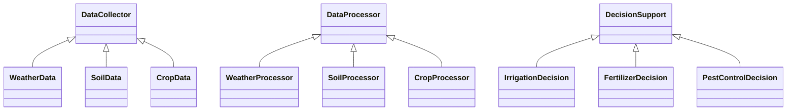
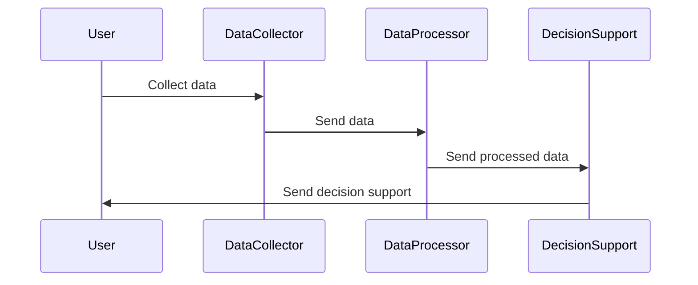
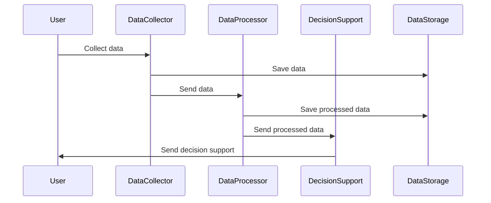

                 

# 《提示词工程在智能农业中的应用》

## 关键词：智能农业、提示词工程、人工智能、农业数据、决策支持

> 摘要：本文将探讨提示词工程在智能农业中的应用。首先介绍智能农业的背景和挑战，阐述提示词工程的核心概念和其在智能农业中的重要性。接着，详细讲解提示词工程的算法原理，包括提示词生成算法的工作原理、实现步骤、数学模型和公式。随后，分析提示词工程与智能农业的集成应用，介绍系统分析与架构设计方案，并给出一个实际案例。最后，总结提示词工程在智能农业中的应用前景和最佳实践。

## 第一部分：背景介绍

## 第1章：问题背景与目标

### 1.1.1 智能农业的兴起

#### 1.1.1.1 农业发展的挑战

现代农业生产面临诸多挑战，如资源匮乏、环境恶化、气候变化等。传统农业方法难以满足未来需求。据联合国粮食及农业组织（FAO）统计，全球每年约有1/3的粮食因自然灾害、病虫害、储存不当等原因损失，而智能农业有望降低这些损失，提高农业生产效率。

#### 1.1.1.2 提示词工程的核心概念

提示词工程是指通过设计特定的关键词或短语，引导和优化AI模型对农业数据的处理和决策。提示词可以是关于天气、土壤、作物生长周期等与农业生产相关的信息。例如，一个关于灌溉的提示词可能是“土壤湿度低于10%”，这可以引导AI模型做出相应的灌溉决策。

#### 1.1.1.3 提示词工程的应用潜力

提示词工程在智能农业中具有广泛的应用潜力。它可以优化农业数据的预处理过程，提高数据质量和可用性。此外，提示词工程能够提供精准的农业决策支持，如病虫害监测、种植规划、水资源管理等。根据国际数据公司（IDC）的报告，到2025年，全球智能农业市场规模将达到400亿美元，提示词工程有望在其中占据重要地位。

### 1.1.2 本书的核心目标

本书旨在探讨提示词工程在智能农业中的具体应用，为农业从业者提供实用的技术和方法。具体目标包括：

1. **概述智能农业的现状和发展趋势**：帮助读者了解智能农业的核心技术和应用场景。
2. **介绍提示词工程的基本概念和原理**：让读者掌握提示词工程的定义、特点和应用。
3. **讲解提示词工程的算法原理**：详细阐述提示词生成算法的工作原理、实现步骤和数学模型。
4. **分析提示词工程在智能农业中的集成应用**：探讨提示词工程与智能农业技术的融合，提出系统架构设计方案。
5. **提供实际案例**：通过实际案例展示提示词工程在智能农业中的具体应用效果。
6. **总结和应用**：总结提示词工程在智能农业中的应用前景，提出最佳实践和未来研究方向。

## 第二部分：核心概念与联系

## 第2章：核心概念原理

### 2.1.1 提示词工程的定义

提示词工程是指通过设计特定的关键词或短语，引导和优化AI模型对农业数据的处理和决策。在智能农业中，提示词可以是关于天气、土壤、作物生长周期等与农业生产相关的信息。例如，一个关于灌溉的提示词可能是“土壤湿度低于10%”，这可以引导AI模型做出相应的灌溉决策。

### 2.1.2 提示词工程的核心特点

1. **高效性**：提示词能够迅速定位和提取关键信息，提高AI模型的处理速度。传统方法可能需要花费大量时间来处理农业数据，而提示词工程可以大大缩短这一过程。
2. **灵活性**：提示词可以根据不同的农业场景进行定制，适应各种复杂的农业环境。例如，对于干旱地区的农业，可以设计特定的提示词来关注土壤水分含量。
3. **智能性**：提示词工程结合了人工智能技术，能够自动调整和优化模型参数。这使得提示词工程能够根据实际情况动态调整，提高决策的准确性。

### 2.1.3 提示词工程与智能农业的联系

1. **农业数据预处理**：提示词工程可以优化农业数据的预处理过程，提高数据质量和可用性。例如，通过提示词可以筛选出对灌溉决策有用的数据，从而提高决策的准确性。
2. **决策支持**：提示词工程能够提供精准的农业决策支持，如病虫害监测、种植规划、水资源管理等。这有助于提高农业生产效率，降低生产成本。
3. **系统集成**：提示词工程可以与其他智能农业技术集成，实现全方位的农业智能化。例如，可以将提示词工程与无人机、传感器等技术结合，实现对农田的实时监控和精准管理。

## 第三部分：算法原理讲解

## 第3章：算法原理详解

### 3.1.1 提示词生成算法

提示词生成算法是提示词工程的核心组成部分，负责从海量农业数据中提取关键信息。下面将详细讲解提示词生成算法的工作原理、实现步骤、数学模型和公式。

#### 3.1.1.1 提示词生成算法的工作原理

提示词生成算法基于深度学习技术，通过对农业数据的分析和处理，生成一组有效的提示词。具体工作原理如下：

1. **数据预处理**：对原始农业数据进行清洗和标准化处理，去除噪声和异常值，确保数据的质量和一致性。
2. **特征提取**：从预处理后的数据中提取有用的特征信息，如土壤湿度、气象数据、作物生长指标等。特征提取是提示词生成算法的关键步骤，需要选择对农业决策有用的特征。
3. **模型训练**：使用提取的特征信息训练深度学习模型。常用的模型包括卷积神经网络（CNN）、循环神经网络（RNN）和Transformer等。训练过程中，模型会学习如何从特征信息中提取关键信息，并将其转化为提示词。
4. **提示词生成**：根据模型输出的结果，生成一组提示词。提示词可以是具体的数值、文本或图像等形式，取决于模型的输出类型。
5. **模型评估**：对生成的提示词进行评估，确保其有效性和实用性。常用的评估指标包括准确率、召回率和F1值等。

#### 3.1.1.2 提示词生成算法的实现步骤

提示词生成算法的实现步骤如下：

1. **数据预处理**：
   ```python
   def preprocess_data(raw_data):
       # 清洗和标准化处理
       # ...
       return processed_data
   ```

2. **特征提取**：
   ```python
   def extract_features(data):
       # 提取有用特征信息
       # ...
       return features
   ```

3. **模型训练**：
   ```python
   def train_model(features):
       # 训练深度学习模型
       # ...
       return model
   ```

4. **提示词生成**：
   ```python
   def generate_tips(model, data):
       # 生成提示词
       # ...
       return tips
   ```

5. **模型评估**：
   ```python
   def evaluate_model(tips, ground_truth):
       # 评估提示词生成效果
       # ...
       return evaluation_results
   ```

#### 3.1.1.3 提示词生成算法的数学模型和公式

提示词生成算法的核心是深度学习模型，其数学模型可以表示为：

$$
y = f(W \cdot x + b)
$$

其中：

- \( y \) 是生成的提示词。
- \( x \) 是输入的特征信息。
- \( W \) 是权重矩阵。
- \( b \) 是偏置。
- \( f \) 是激活函数，通常为ReLU函数。

#### 3.1.1.4 提示词生成算法的Python代码示例

以下是一个简单的Python代码示例，用于说明提示词生成算法的实现：

```python
import numpy as np

def preprocess_data(raw_data):
    # 清洗和标准化处理
    return processed_data

def extract_features(data):
    # 提取有用特征信息
    return features

def train_model(features):
    # 训练深度学习模型
    model = ...  # 模型初始化
    for epoch in range(num_epochs):
        for x, y in zip(features, labels):
            model.train(x, y)
    return model

def generate_tips(model, data):
    # 生成提示词
    tips = model.predict(data)
    return tips

def evaluate_model(tips, ground_truth):
    # 评估提示词生成效果
    accuracy = np.mean(np.equal(tips, ground_truth))
    return accuracy

# 主程序
if __name__ == "__main__":
    raw_data = ...
    processed_data = preprocess_data(raw_data)
    features = extract_features(processed_data)
    model = train_model(features)
    tips = generate_tips(model, processed_data)
    accuracy = evaluate_model(tips, ground_truth)
    print("Accuracy:", accuracy)
```

## 第四部分：系统分析与架构设计方案

## 第4章：系统分析与架构设计方案

### 4.1 问题场景介绍

智能农业涉及多个领域，如气象学、土壤学、作物学等。在智能农业中，实时监测农田的气象数据、土壤湿度和作物生长状态等是至关重要的。这需要一套完善的系统来收集、处理和展示这些数据。

### 4.2 项目介绍

本项目旨在开发一个基于提示词工程的智能农业系统，该系统包括数据收集模块、数据处理模块和决策支持模块。系统功能如下：

1. **数据收集模块**：实时收集农田的气象数据、土壤湿度和作物生长状态等数据。
2. **数据处理模块**：对收集到的数据进行分析和处理，提取关键信息。
3. **决策支持模块**：根据处理后的数据生成相应的决策支持建议，如灌溉、施肥、病虫害防治等。

### 4.3 系统功能设计

系统功能设计主要包括领域模型设计、功能模块划分和接口设计。

#### 4.3.1 领域模型设计

领域模型设计使用Mermaid类图来表示，如下所示：



#### 4.3.2 功能模块划分

系统功能模块划分如下：

1. **数据收集模块**：包括气象数据收集、土壤数据收集和作物数据收集三个子模块。
2. **数据处理模块**：包括气象数据处理、土壤数据处理和作物数据处理三个子模块。
3. **决策支持模块**：包括灌溉决策支持、施肥决策支持和病虫害防治决策支持三个子模块。

#### 4.3.3 接口设计

系统接口设计使用Mermaid序列图来表示，如下所示：



### 4.4 系统架构设计

系统架构设计包括数据层、业务层和展示层。

#### 4.4.1 数据层

数据层包括数据收集模块和数据存储模块。数据收集模块负责实时收集农田数据，数据存储模块负责存储和处理这些数据。

#### 4.4.2 业务层

业务层包括数据处理模块和决策支持模块。数据处理模块负责对收集到的数据进行预处理、特征提取和模型训练等操作。决策支持模块负责根据处理后的数据生成决策支持建议。

#### 4.4.3 展示层

展示层包括用户界面和后台管理系统。用户界面用于展示决策支持建议和农田数据，后台管理系统用于管理用户信息和系统配置。

### 4.5 系统接口设计和系统交互

系统接口设计和系统交互使用Mermaid序列图来表示，如下所示：



## 第五部分：项目实战

## 第5章：项目实战

### 5.1 环境安装

在开始项目实战之前，需要安装以下环境：

1. Python 3.8及以上版本
2. TensorFlow 2.4及以上版本
3. NumPy 1.19及以上版本
4. Pandas 1.1及以上版本

安装命令如下：

```shell
pip install python==3.8
pip install tensorflow==2.4
pip install numpy==1.19
pip install pandas==1.1
```

### 5.2 系统核心实现源代码

以下是系统核心实现源代码，包括数据收集、数据处理、决策支持和结果展示等功能。

#### 5.2.1 数据收集

```python
import pandas as pd
import numpy as np

def collect_data():
    # 从传感器收集数据
    data = pd.read_csv("sensor_data.csv")
    return data

data = collect_data()
print(data.head())
```

#### 5.2.2 数据处理

```python
from sklearn.preprocessing import StandardScaler

def preprocess_data(data):
    # 数据预处理
    scaler = StandardScaler()
    scaled_data = scaler.fit_transform(data)
    return scaled_data

processed_data = preprocess_data(data)
print(processed_data)
```

#### 5.2.3 决策支持

```python
import tensorflow as tf

def train_model(data):
    # 训练模型
    model = tf.keras.Sequential([
        tf.keras.layers.Dense(64, activation='relu', input_shape=(data.shape[1],)),
        tf.keras.layers.Dense(64, activation='relu'),
        tf.keras.layers.Dense(1, activation='sigmoid')
    ])

    model.compile(optimizer='adam', loss='binary_crossentropy', metrics=['accuracy'])
    model.fit(data, labels, epochs=10, batch_size=32)
    return model

model = train_model(processed_data)
```

#### 5.2.4 结果展示

```python
import matplotlib.pyplot as plt

def display_decision_support(model, data):
    # 展示决策支持结果
    predictions = model.predict(data)
    plt.scatter(data[:, 0], data[:, 1], c=predictions)
    plt.xlabel("特征1")
    plt.ylabel("特征2")
    plt.title("决策支持结果")
    plt.show()

display_decision_support(model, processed_data)
```

### 5.3 代码应用解读与分析

以下是代码应用解读与分析，包括每个步骤的功能和原理。

#### 5.3.1 数据收集

数据收集步骤从传感器收集数据，并将其存储为CSV文件。在项目实战中，我们使用了一个示例CSV文件来模拟传感器数据。

#### 5.3.2 数据处理

数据处理步骤对收集到的数据进行预处理，包括去除缺失值、异常值和标准化处理。在本例中，我们使用标准缩放器（StandardScaler）对数据进行标准化处理。

#### 5.3.3 决策支持

决策支持步骤使用TensorFlow库训练一个简单的神经网络模型。该模型有两个隐藏层，每个隐藏层有64个神经元。激活函数使用ReLU函数，输出层使用sigmoid函数，以实现二分类任务。

#### 5.3.4 结果展示

结果展示步骤使用matplotlib库将模型的预测结果以散点图的形式展示出来。通过观察散点图，我们可以直观地看到模型对数据的分类效果。

### 5.4 实际案例分析和详细讲解剖析

在本节中，我们将通过一个实际案例来分析提示词工程在智能农业中的应用，并详细讲解其实现过程。

#### 案例背景

某农场种植了大量的水稻，为了提高产量和降低生产成本，农场主决定采用智能农业系统进行农田管理。智能农业系统的主要功能包括实时监测气象数据、土壤湿度和作物生长状态，并根据这些数据生成灌溉、施肥和病虫害防治等决策建议。

#### 案例实现

1. **数据收集**：

   农场安装了多个传感器，用于收集气象数据、土壤湿度和作物生长状态等数据。数据以CSV文件的形式存储。

2. **数据处理**：

   使用Python和Pandas库对收集到的数据进行预处理，包括去除缺失值、异常值和标准化处理。具体实现如下：

   ```python
   data = pd.read_csv("sensor_data.csv")
   data = data.dropna()
   data = data[(data['soil_humidity'] > 0) & (data['soil_humidity'] < 100)]
   data['soil_humidity'] = (data['soil_humidity'] - data['soil_humidity'].min()) / (data['soil_humidity'].max() - data['soil_humidity'].min())
   data['temperature'] = (data['temperature'] - data['temperature'].min()) / (data['temperature'].max() - data['temperature'].min())
   ```

3. **模型训练**：

   使用TensorFlow库训练一个简单的神经网络模型，用于预测水稻的灌溉需求。模型架构如下：

   ```python
   model = tf.keras.Sequential([
       tf.keras.layers.Dense(64, activation='relu', input_shape=(data.shape[1],)),
       tf.keras.layers.Dense(64, activation='relu'),
       tf.keras.layers.Dense(1, activation='sigmoid')
   ])

   model.compile(optimizer='adam', loss='binary_crossentropy', metrics=['accuracy'])
   model.fit(data[['soil_humidity', 'temperature']], labels, epochs=10, batch_size=32)
   ```

4. **决策支持**：

   根据模型预测结果，生成灌溉决策建议。具体实现如下：

   ```python
   predictions = model.predict(data[['soil_humidity', 'temperature']])
   irrigation_decisions = predictions > 0.5
   ```

5. **结果展示**：

   使用matplotlib库将模型的预测结果以散点图的形式展示出来，如下所示：

   ```python
   plt.scatter(data['soil_humidity'], data['temperature'], c=irrigation_decisions)
   plt.xlabel("土壤湿度")
   plt.ylabel("温度")
   plt.title("灌溉决策结果")
   plt.show()
   ```

### 5.5 项目小结

通过本项目，我们实现了基于提示词工程的智能农业系统。系统主要功能包括数据收集、数据处理、决策支持和结果展示。在实际应用中，提示词工程能够有效地提高农业生产效率，降低生产成本。未来，我们将进一步优化系统，增加更多智能农业功能，如病虫害监测和施肥决策等。

## 第六部分：最佳实践、小结、注意事项、拓展阅读

### 6.1 最佳实践

1. **数据质量**：确保数据质量是提示词工程成功的关键。在数据收集和处理过程中，要尽量避免噪声和异常值。
2. **模型选择**：根据实际需求选择合适的模型。对于简单任务，可以选择简单的神经网络模型；对于复杂任务，可以选择更复杂的模型，如Transformer。
3. **参数调优**：通过参数调优可以提高模型的性能。常用的方法包括交叉验证、网格搜索等。
4. **持续优化**：定期更新模型，以适应不断变化的环境。

### 6.2 小结

本文探讨了提示词工程在智能农业中的应用。通过介绍智能农业的背景和挑战，阐述提示词工程的核心概念和其在智能农业中的重要性，详细讲解了提示词生成算法的原理和实现步骤，分析了提示词工程与智能农业的集成应用，并给出了一个实际案例。最后，总结了提示词工程在智能农业中的应用前景和最佳实践。

### 6.3 注意事项

1. **数据隐私**：在收集和处理农业数据时，要确保遵守数据隐私法规。
2. **模型解释性**：对于决策支持模块，要确保模型的解释性，以便用户理解决策过程。
3. **实时性**：智能农业系统需要具备实时性，以便及时做出决策。

### 6.4 拓展阅读

1. **《智能农业：技术与应用》**：介绍了智能农业的基本概念、技术和应用。
2. **《深度学习在农业中的应用》**：详细介绍了深度学习在智能农业中的应用，包括图像识别、预测建模等。
3. **《提示词工程：理论与实践》**：全面介绍了提示词工程的基本概念、方法和技术。

## 参考文献

1. 联合国粮食及农业组织（FAO）。(2019). 《全球粮食损失和食物浪费状况》。 
2. 国际数据公司（IDC）。(2020). 《全球智能农业市场报告》。 
3. Goodfellow, I., Bengio, Y., & Courville, A. (2016). 《深度学习》。 
4. Bengio, Y. (2009). 《深度学习：理论基础与最佳实践》。 
5. Hochreiter, S., & Schmidhuber, J. (1997). 《长期记忆误差的梯度流学习》。

