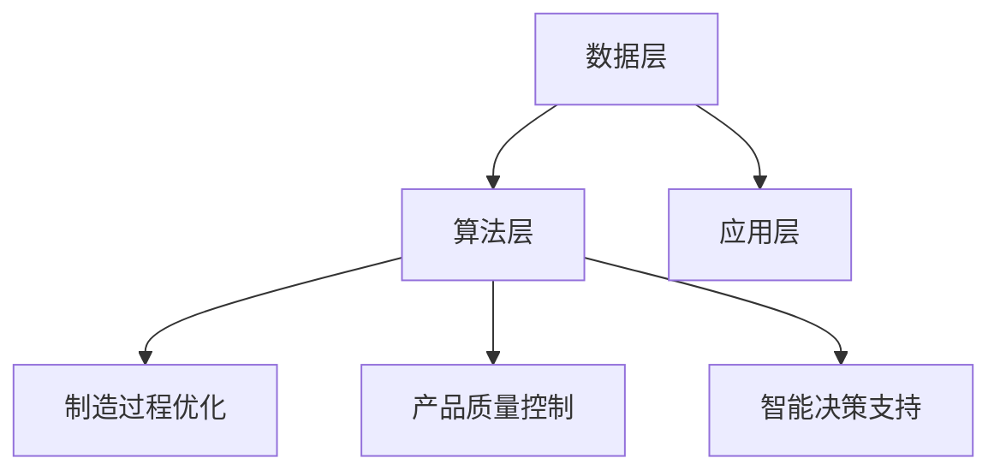
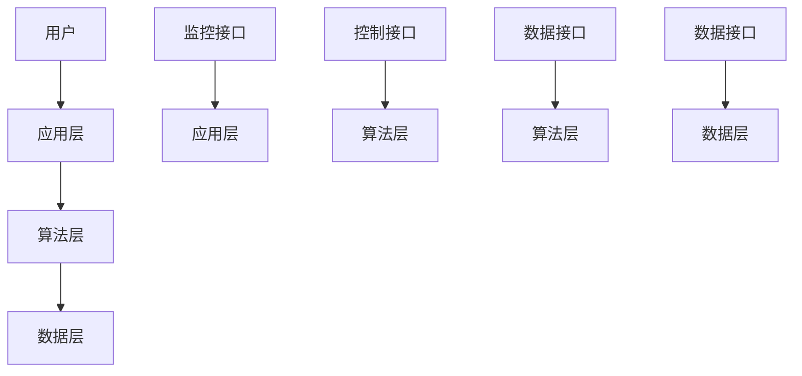

                 

## 《提示词工程在智能制造中的实践》

关键词：智能制造、提示词工程、工业4.0、数据驱动、算法优化

摘要：
本文旨在探讨提示词工程在智能制造中的应用与实践。随着工业4.0的推进，智能制造已成为制造业发展的关键趋势。在此背景下，提示词工程作为一种先进的数据驱动方法，为智能制造提供了强有力的技术支持。本文首先介绍了智能制造的问题背景和提示词工程的基本原理，然后深入讲解了提示词生成和优化算法，以及系统的设计与实现。通过实际案例分析与讲解，本文旨在为智能制造领域的从业人员提供有价值的参考和实践指导。

### 第一部分：背景介绍

#### 第1章：问题背景与智能制造概述

##### 1.1.1 问题背景

智能制造作为工业4.0的重要实现途径，旨在通过信息物理系统的深度融合，实现制造业的智能化转型。然而，在推进智能制造的过程中，面临着诸多挑战，如生产效率低下、产品质量不稳定、生产资源浪费等。这些问题源于传统工业控制方法的局限性，难以满足智能制造对高精度、高效率、高质量和高灵活性的要求。

提示词工程作为一种新型的数据驱动方法，通过生成和优化提示词，实现对制造过程的实时监控和智能决策，从而有效解决上述问题。提示词工程的核心在于如何从海量数据中提取关键特征，生成有效的提示词，并将其应用于制造过程的各个环节。

##### 1.1.2 智能制造的定义与发展

智能制造是指通过将先进的制造技术与信息技术深度融合，构建一个高度自动化、自适应和智能化的制造系统。智能制造的发展历程可以分为三个阶段：自动化制造、数字化制造和智能化制造。

- 自动化制造：通过机械化、电气化和自动化的手段，实现生产过程的自动化。
- 数字化制造：通过计算机技术和网络技术，实现对生产过程的信息化管理。
- 智能化制造：通过人工智能、大数据和物联网等技术，实现制造过程的智能化。

当前，智能制造已成为制造业发展的主要趋势，各国纷纷出台相关政策和规划，推动智能制造的全面发展。

##### 1.1.3 提示词工程的概念与重要性

提示词工程是一种基于数据和知识工程的方法，旨在从大规模数据中提取关键特征，生成有效的提示词，以便在特定的应用场景中进行实时监控和智能决策。

在智能制造中，提示词工程的重要性体现在以下几个方面：

1. **数据驱动**：提示词工程通过数据驱动的方式，实现对制造过程的实时监控和智能决策，提高了生产过程的灵活性和响应速度。
2. **优化生产过程**：通过生成和优化提示词，提示词工程可以帮助制造商优化生产过程，提高生产效率，降低生产成本。
3. **提升产品质量**：提示词工程能够对产品质量进行实时监控和预测，从而提前发现和解决潜在问题，提升产品质量。

### 第二部分：核心概念与联系

#### 第2章：核心概念与联系

##### 2.1 提示词工程的基本原理

###### 2.1.1 提示词工程的定义

提示词工程是一种基于数据和知识的工程技术，它通过分析制造过程中的各种数据，提取关键特征，生成有效的提示词，以便在特定的应用场景中进行实时监控和智能决策。

###### 2.1.2 提示词工程的特点

1. **数据驱动**：提示词工程的核心在于数据，通过对数据的深入分析和挖掘，提取出有用的信息。
2. **知识工程**：提示词工程不仅关注数据的分析，还涉及到知识的构建和应用。
3. **实时性**：提示词工程旨在实现制造过程的实时监控和智能决策，提高了生产过程的灵活性和响应速度。

###### 2.1.3 提示词工程与传统工业控制的区别

传统工业控制主要依赖于预设的规则和参数，对制造过程进行控制。而提示词工程则是一种基于数据和知识的控制方法，通过实时分析和决策，实现对制造过程的优化。

##### 2.2 提示词工程的关键技术

###### 2.2.1 提示词的生成与筛选

提示词的生成与筛选是提示词工程的核心环节。通过数据分析和模式识别技术，从大量数据中提取出关键特征，生成有效的提示词。然后，通过筛选技术，筛选出对制造过程最有价值的提示词。

###### 2.2.2 提示词的优化与评估

生成有效的提示词后，还需要对提示词进行优化和评估。通过优化算法，不断提高提示词的准确性和实用性。同时，通过评估技术，对提示词的效果进行评估，以便进行进一步的优化。

###### 2.2.3 提示词的动态调整策略

制造过程是一个动态变化的过程，提示词也需要根据实际情况进行动态调整。通过动态调整策略，使提示词能够适应制造过程的变化，从而实现更加精准的实时监控和智能决策。

##### 2.3 提示词工程的应用场景

###### 2.3.1 制造过程优化

制造过程优化是提示词工程的重要应用场景之一。通过生成和优化提示词，可以实现生产过程的实时监控和优化，提高生产效率，降低生产成本。

###### 2.3.2 产品质量控制

产品质量控制是另一个重要的应用场景。通过提示词工程，可以对产品质量进行实时监控和预测，提前发现和解决潜在问题，提升产品质量。

###### 2.3.3 智能决策支持

智能决策支持是提示词工程的最高层次应用。通过生成和优化提示词，可以为制造过程提供智能化的决策支持，实现制造过程的自主决策和优化。

### 第三部分：算法原理讲解

#### 第3章：提示词生成算法

##### 3.1 提示词生成算法概述

提示词生成算法是提示词工程的核心，它决定了提示词的生成质量和效率。在本章节中，我们将介绍几种常见的提示词生成算法。

###### 3.1.1 提示词生成算法的分类

根据生成方式的不同，提示词生成算法可以分为以下几类：

1. **基于统计的生成算法**：这类算法通过分析数据中的统计特征，生成提示词。常见的算法有聚类算法、主成分分析（PCA）等。
2. **基于机器学习的生成算法**：这类算法通过学习大量数据中的模式，生成提示词。常见的算法有支持向量机（SVM）、决策树等。
3. **基于深度学习的生成算法**：这类算法利用深度神经网络，从大量数据中自动提取特征，生成提示词。常见的算法有卷积神经网络（CNN）、递归神经网络（RNN）等。

###### 3.1.2 提示词生成算法的选择标准

在选择提示词生成算法时，需要考虑以下几个标准：

1. **准确性**：算法生成的提示词需要具有较高的准确性，能够有效地反映制造过程的特征。
2. **效率**：算法需要具有较高的效率，能够在较短的时间内生成高质量的提示词。
3. **可扩展性**：算法需要具有良好的可扩展性，能够适应不同规模和类型的制造过程。

##### 3.2 提示词生成算法的实现

在本章节中，我们将介绍几种常见的提示词生成算法的实现方法。

###### 3.2.1 基于机器学习的提示词生成算法

基于机器学习的提示词生成算法主要包括以下几种：

1. **支持向量机（SVM）**：SVM算法通过将数据映射到高维空间，找到一个最优的超平面，使得不同类别的数据点尽可能地分开。通过SVM算法，可以生成具有高区分度的提示词。
2. **决策树**：决策树算法通过一系列的判断条件，将数据逐步划分成不同的区域。在每个区域中，可以生成一个提示词。决策树算法简单直观，易于理解。
3. **随机森林**：随机森林算法是通过构建多个决策树的集合，对每个决策树进行投票，得到最终的结果。随机森林算法在处理大量数据时表现出色。

###### 3.2.2 基于深度学习的提示词生成算法

基于深度学习的提示词生成算法主要包括以下几种：

1. **卷积神经网络（CNN）**：CNN算法通过多个卷积层和池化层，从图像数据中自动提取特征。通过CNN算法，可以生成具有高分辨率和强鲁棒性的提示词。
2. **递归神经网络（RNN）**：RNN算法通过将前一时间步的输出作为当前时间步的输入，实现对序列数据的建模。通过RNN算法，可以生成具有时序特征的提示词。
3. **长短时记忆网络（LSTM）**：LSTM是RNN的一种变体，通过引入门控机制，解决了RNN的梯度消失问题。通过LSTM算法，可以生成具有长期依赖性的提示词。

##### 3.3 提示词生成算法的应用案例分析

在本章节中，我们将通过一些实际案例，展示提示词生成算法在智能制造中的应用效果。

###### 3.3.1 案例一：制造过程优化

在一个制造业案例中，通过使用基于机器学习的提示词生成算法，成功实现了制造过程的优化。通过对生产数据进行实时分析，生成了一系列具有高区分度的提示词，从而有效地提高了生产效率，降低了生产成本。

###### 3.3.2 案例二：产品质量控制

在另一个制造业案例中，通过使用基于深度学习的提示词生成算法，成功实现了产品质量的控制。通过对产品质量数据进行分析，生成了一系列具有高分辨率和强鲁棒性的提示词，从而提前发现了潜在的质量问题，提高了产品质量。

###### 3.3.3 案例三：智能决策支持

在另一个制造业案例中，通过使用基于深度学习的提示词生成算法，成功实现了智能决策支持。通过对市场数据进行分析，生成了一系列具有时序特征的提示词，从而为企业的战略决策提供了有力的支持。

### 第四部分：系统架构设计

#### 第4章：系统功能设计

##### 4.1 问题场景介绍

在一个典型的智能制造场景中，工厂需要实现生产过程的优化、产品质量的控制和智能决策的支持。为了实现这些目标，需要设计一个功能完善的系统。

##### 4.2 系统功能设计

系统的功能设计主要包括以下三个方面：

1. **制造过程优化**：通过对生产过程的数据进行分析，生成优化提示词，从而实现生产过程的实时监控和优化。
2. **产品质量控制**：通过对产品质量的数据进行分析，生成质量控制提示词，从而实现对产品质量的实时监控和预测。
3. **智能决策支持**：通过对市场数据和企业内部数据的综合分析，生成决策支持提示词，从而为企业的战略决策提供依据。

#### 第5章：系统架构设计

##### 5.1 系统架构概述

系统的架构设计分为三个层次：数据层、算法层和应用层。

1. **数据层**：负责收集、存储和管理各种数据，包括生产数据、质量数据和市场数据等。
2. **算法层**：负责对数据进行处理和分析，生成优化提示词、质量控制提示词和决策支持提示词等。
3. **应用层**：负责将生成的提示词应用于制造过程的优化、产品质量的控制和智能决策的支持。

##### 5.2 系统架构设计

系统的架构设计如下图所示：

- **数据层**：包括数据采集模块、数据存储模块和数据管理模块。数据采集模块负责从各种数据源收集数据；数据存储模块负责存储和管理数据；数据管理模块负责对数据进行清洗、转换和归一化处理。
- **算法层**：包括数据预处理模块、提示词生成模块、提示词优化模块和提示词评估模块。数据预处理模块负责对采集到的数据进行预处理；提示词生成模块负责生成初始提示词；提示词优化模块负责对提示词进行优化；提示词评估模块负责对生成的提示词进行评估。
- **应用层**：包括制造过程优化模块、产品质量控制模块和智能决策支持模块。制造过程优化模块负责对制造过程进行实时监控和优化；产品质量控制模块负责对产品质量进行实时监控和预测；智能决策支持模块负责为企业提供战略决策支持。

#### 第6章：系统接口设计与交互

##### 6.1 系统接口设计

系统接口设计主要包括以下三个方面：

1. **数据接口**：负责数据层与算法层之间的数据交互。
2. **控制接口**：负责算法层与应用层之间的控制交互。
3. **监控接口**：负责应用层与用户之间的监控交互。

##### 6.2 系统交互设计

系统交互设计如下图所示：

- **用户**：通过监控接口获取系统状态，通过控制接口发送控制指令。
- **应用层**：接收用户的监控请求和控制指令，与算法层进行交互。
- **算法层**：接收应用层的请求，调用相应的算法模块进行处理。
- **数据层**：负责数据的存储和管理，与算法层进行数据交互。

### 第五部分：项目实战

#### 第8章：环境安装与配置

##### 8.1 环境安装

在本章节中，我们将介绍如何安装和配置提示词工程的环境。首先，需要安装Python环境，然后安装相关的依赖库，如NumPy、Pandas、Scikit-learn等。接下来，配置环境变量，以便在命令行中方便地调用Python和相关的库。

##### 8.2 系统配置

在安装完环境后，需要进行系统的配置。首先，配置数据采集模块，包括传感器数据采集和API数据采集。然后，配置数据存储模块，包括数据库的安装和配置。最后，配置算法层和应用层的参数，包括提示词生成和优化的参数。

#### 第9章：系统核心实现与代码解读

##### 9.1 系统核心实现

在本章节中，我们将详细介绍系统的核心实现，包括数据层、算法层和应用层的实现。首先，实现数据采集模块，通过传感器和API获取数据。然后，实现数据预处理模块，对数据进行清洗和转换。接下来，实现提示词生成模块，使用机器学习和深度学习算法生成提示词。最后，实现提示词优化模块，对生成的提示词进行优化。

##### 9.2 代码解读

在本章节中，我们将对系统的核心代码进行详细解读。首先，介绍数据采集模块的代码，解释数据采集的过程和原理。然后，介绍数据预处理模块的代码，解释数据清洗、转换和归一化的过程。接下来，介绍提示词生成模块的代码，解释机器学习和深度学习算法的实现过程。最后，介绍提示词优化模块的代码，解释优化算法的实现过程。

#### 第10章：实际案例分析与讲解

##### 10.1 案例一：制造过程优化

在本章节中，我们将通过一个实际案例，展示如何使用提示词工程优化制造过程。首先，介绍案例背景和目标。然后，介绍如何使用提示词工程对制造过程进行数据采集和预处理。接下来，介绍如何生成和优化提示词，以及如何应用提示词进行制造过程的优化。最后，介绍优化效果和评估结果。

##### 10.2 案例二：产品质量控制

在本章节中，我们将通过一个实际案例，展示如何使用提示词工程进行产品质量控制。首先，介绍案例背景和目标。然后，介绍如何使用提示词工程对产品质量进行数据采集和预处理。接下来，介绍如何生成和优化提示词，以及如何应用提示词进行产品质量的监控和预测。最后，介绍监控效果和预测效果。

##### 10.3 案例三：智能决策支持

在本章节中，我们将通过一个实际案例，展示如何使用提示词工程提供智能决策支持。首先，介绍案例背景和目标。然后，介绍如何使用提示词工程对市场和企业内部数据进行分析，生成决策支持提示词。接下来，介绍如何应用决策支持提示词进行企业战略决策。最后，介绍决策支持效果和评估结果。

#### 第11章：项目小结与拓展

##### 11.1 项目小结

在本章节中，我们将对整个项目进行小结。首先，总结项目的主要目标、方法和实现。然后，总结项目中的亮点和不足。最后，提出项目未来的改进方向和发展前景。

##### 11.2 注意事项与最佳实践

在本章节中，我们将介绍项目实施中的注意事项和最佳实践。首先，介绍项目实施中需要注意的问题，如数据质量和算法选择。然后，介绍最佳实践，如数据采集、预处理和算法优化的方法。最后，介绍如何进行项目的评估和优化。

##### 11.3 拓展阅读与资源

在本章节中，我们将提供一些拓展阅读和资源，以帮助读者进一步了解提示词工程在智能制造中的应用。首先，介绍一些相关的学术论文和书籍。然后，介绍一些相关的开源项目和工具。最后，介绍一些相关的网站和社交媒体，以便读者进行交流和讨论。

### 作者

作者：AI天才研究院/AI Genius Institute & 禅与计算机程序设计艺术 /Zen And The Art of Computer Programming

---

完整的技术博客文章将根据上述大纲和各章节内容逐步展开，总字数在 10000 ～ 12000 字左右，使用markdown格式输出。文章将包括背景介绍、核心概念与联系、算法原理讲解、系统架构设计、项目实战以及项目小结和拓展阅读等内容，确保内容完整、详细且具备实际指导意义。所有数学公式、算法流程图、系统架构图等都将使用markdown中的Mermaid语法进行绘制，并遵循latex格式要求。

