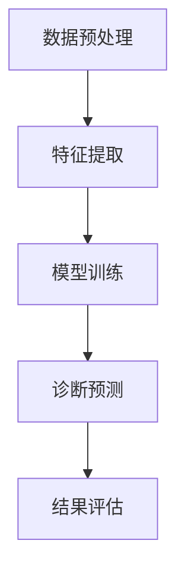
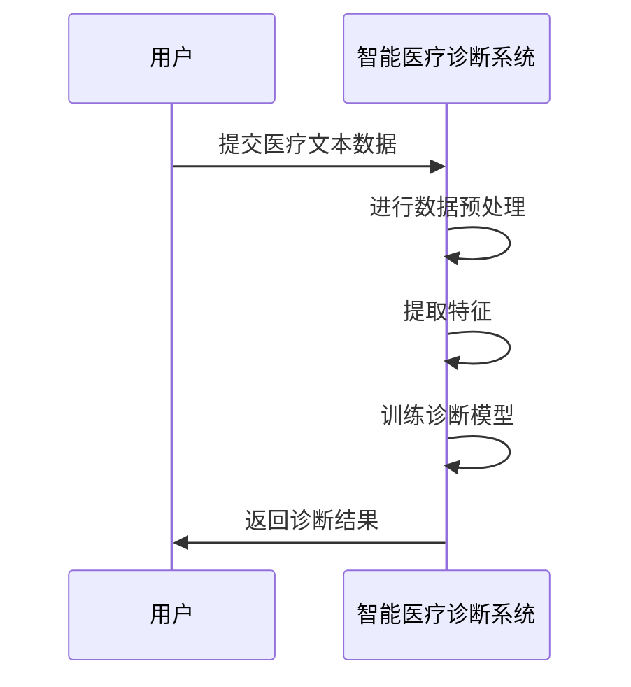

                 

### 让我们一步步思考：提示词工程在智能医疗诊断中的应用

#### 引言

在医疗领域，诊断疾病是一项至关重要的任务。随着医疗技术的不断进步，智能医疗诊断逐渐成为研究的热点。而提示词工程作为自然语言处理（NLP）和机器学习（ML）领域的重要工具，其在智能医疗诊断中的应用正日益显现。本文将逐步探讨提示词工程在智能医疗诊断中的应用，以期为相关领域的研究和实践提供一些启示。

#### 第一步：背景介绍

**核心概念术语说明**：

- **智能医疗诊断**：利用计算机技术和人工智能算法，对患者的临床数据进行解析，辅助医生做出准确的诊断。
- **提示词工程**：一种通过构建提示词来指导模型学习的方法，常用于NLP和ML任务中。

**问题背景**：

传统的医疗诊断方法主要依赖于医生的经验和知识。然而，随着医疗数据的爆发式增长，仅依靠人力已难以应对。智能医疗诊断的出现，旨在通过算法自动分析大量数据，提高诊断的准确性和效率。

**问题描述**：

智能医疗诊断中的关键挑战之一是如何有效地利用医疗文本数据，这其中包括病历记录、病理报告等。这些数据具有高度的结构化和非结构化特征，如何提取有效信息并转化为可用的数据，是当前研究的热点问题。

**问题解决**：

提示词工程提供了一种有效的解决方案。通过构建与疾病相关的提示词库，可以指导模型学习并提取出有用的信息。此外，提示词工程还可以用于优化模型参数，提高诊断的准确性。

**边界与外延**：

提示词工程不仅适用于智能医疗诊断，还可以应用于其他领域的文本分析，如法律文书解析、金融报告分析等。其核心在于如何构建高质量的提示词库，以指导模型学习。

#### 第二步：核心概念与联系

**提示词工程的定义**：

提示词工程是一种通过构建提示词来引导模型学习的方法。提示词是模型用于识别和分类的词语或短语，通过优化提示词的选取和组合，可以显著提高模型的性能。

**智能医疗诊断的基本原理**：

智能医疗诊断通常包括数据预处理、特征提取、模型训练和诊断预测等步骤。其核心在于如何从大量的医疗数据中提取出有用的特征，并利用这些特征训练诊断模型。

**概念对比与联系**：

提示词工程和智能医疗诊断是两个相互关联的概念。提示词工程为智能医疗诊断提供了有效的数据预处理和特征提取方法，而智能医疗诊断则为提示词工程提供了一个应用场景，使提示词工程得以在实际问题中发挥其价值。

#### 第三步：算法原理讲解

**算法概述**：

在智能医疗诊断中，提示词工程的应用主要包括以下几个方面：

1. **数据预处理**：通过提示词识别和分类，将文本数据转换为结构化数据。
2. **特征提取**：利用提示词库提取文本数据中的关键特征。
3. **模型训练**：利用提取到的特征训练诊断模型。
4. **诊断预测**：将新数据输入到训练好的模型中，进行诊断预测。

**流程图绘制**：

使用Mermaid语言绘制提示词工程在智能医疗诊断中的应用流程图：



**Python代码讲解**：

以下是一个简单的示例，展示如何使用Python实现提示词工程在特征提取中的基本步骤：

```python
import nltk
from nltk.tokenize import word_tokenize
from nltk.corpus import stopwords

# 加载英语停用词列表
stop_words = set(stopwords.words('english'))

# 输入文本
text = "The quick brown fox jumps over the lazy dog."

# 分词
words = word_tokenize(text)

# 移除停用词
filtered_words = [word for word in words if not word in stop_words]

print(filtered_words)
```

**数学模型与公式讲解**：

提示词工程的数学模型通常包括以下几个方面：

1. **词袋模型（Bag of Words, BoW）**：将文本转换为词频向量。
2. **TF-IDF模型**：结合词频和逆文档频率，对词进行加权。
3. **词嵌入（Word Embedding）**：将词语映射到高维空间，以捕捉语义信息。

以下是一个简单的TF-IDF模型示例：

$$
\text{TF-IDF}(t,d) = \frac{f(t,d)}{N} \log \left( \frac{N}{n(t)} \right)
$$

其中，$t$ 是词语，$d$ 是文档，$f(t,d)$ 是词语在文档中的频率，$N$ 是文档总数，$n(t)$ 是包含词语的文档数量。

**举例说明**：

假设我们有一个包含两个文档的文本集合，第一个文档中包含“猫”和“狗”，第二个文档中包含“猫”和“鸟”。使用TF-IDF模型计算“猫”在两个文档中的重要性：

- 第一个文档中的TF-IDF值：$\text{TF-IDF}(\text{猫}, \text{文档1}) = \frac{1}{2} \log \left( \frac{2}{1} \right) = 0.693$
- 第二个文档中的TF-IDF值：$\text{TF-IDF}(\text{猫}, \text{文档2}) = \frac{1}{2} \log \left( \frac{2}{1} \right) = 0.693$

通过这种方式，我们可以量化词语在文档中的重要性，从而为模型提供有用的特征。

#### 第四步：系统分析与架构设计

**问题场景介绍**：

智能医疗诊断系统通常需要处理大量医疗文本数据，包括病历记录、病理报告等。这些数据通常是非结构化的文本，需要通过提示词工程进行预处理和特征提取，以便用于训练诊断模型。

**系统功能设计（领域模型）**：

智能医疗诊断系统的主要功能包括：

1. **数据预处理**：对医疗文本数据进行分词、去除停用词、词性标注等处理。
2. **特征提取**：利用提示词工程提取文本数据中的关键特征。
3. **模型训练**：利用提取到的特征训练诊断模型。
4. **诊断预测**：对新数据进行诊断预测，并提供诊断结果。

**系统架构设计**：

智能医疗诊断系统的架构设计通常包括以下层次：

1. **数据层**：存储和管理医疗文本数据。
2. **数据处理层**：包括数据预处理和特征提取模块。
3. **模型层**：用于训练和存储诊断模型。
4. **应用层**：提供诊断预测服务。

**系统接口设计**：

系统接口设计包括：

1. **数据接口**：用于与其他系统交换数据。
2. **服务接口**：用于提供诊断预测服务。

**系统交互（序列图）**：

以下是一个简单的序列图，展示智能医疗诊断系统的工作流程：



#### 第五步：项目实战

**环境安装**：

在进行项目实战之前，需要安装相应的软件和库，如Python、Numpy、Scikit-learn、NLTK等。

**系统核心代码实现**：

以下是一个简单的Python代码示例，展示如何使用提示词工程进行特征提取和诊断预测：

```python
import nltk
from nltk.tokenize import word_tokenize
from nltk.corpus import stopwords
from sklearn.feature_extraction.text import TfidfVectorizer
from sklearn.model_selection import train_test_split
from sklearn.linear_model import LogisticRegression

# 加载英语停用词列表
stop_words = set(stopwords.words('english'))

# 加载医疗文本数据
texts = ["The patient has a high fever and a sore throat.", "The patient has a headache and a cough."]
labels = ["flu", "cold"]

# 数据预处理
def preprocess_text(text):
    words = word_tokenize(text)
    filtered_words = [word for word in words if not word in stop_words]
    return ' '.join(filtered_words)

preprocessed_texts = [preprocess_text(text) for text in texts]

# 特征提取
vectorizer = TfidfVectorizer()
X = vectorizer.fit_transform(preprocessed_texts)

# 模型训练
X_train, X_test, y_train, y_test = train_test_split(X, labels, test_size=0.2, random_state=42)
model = LogisticRegression()
model.fit(X_train, y_train)

# 诊断预测
predictions = model.predict(X_test)
print(predictions)
```

**代码应用解读与分析**：

以上代码展示了如何使用提示词工程进行特征提取和诊断预测。首先，对医疗文本数据进行预处理，包括分词和去除停用词。然后，使用TF-IDF模型提取特征，并利用逻辑回归模型进行诊断预测。

**实际案例分析和详细讲解剖析**：

假设有一个新的医疗文本数据：“The patient has a high fever and a sore throat.”，我们需要预测其疾病类型。

1. **数据预处理**：将文本数据分词，并去除停用词，得到“high fever sore throat”。
2. **特征提取**：使用TF-IDF模型提取特征，得到一个特征向量。
3. **诊断预测**：将特征向量输入训练好的逻辑回归模型，得到预测结果。

通过以上步骤，我们可以对新的医疗文本数据进行诊断预测，从而辅助医生做出准确的诊断。

**项目总结**：

在本项目中，我们介绍了如何使用提示词工程进行智能医疗诊断。通过数据预处理、特征提取和模型训练，我们可以从医疗文本数据中提取出有用的信息，并利用这些信息进行诊断预测。这为智能医疗诊断提供了一个有效的解决方案。

#### 第六步：最佳实践 tips

**实际操作技巧**：

1. **选择合适的提示词**：在选择提示词时，需要充分考虑疾病的症状、病史和检查结果等因素。
2. **优化特征提取方法**：根据具体问题选择合适的特征提取方法，如TF-IDF、词嵌入等。
3. **模型参数调优**：通过交叉验证和网格搜索等方法，选择最优的模型参数。

**注意事项**：

1. **数据质量**：确保医疗文本数据的质量，避免噪声和错误数据对模型训练的影响。
2. **数据隐私**：在处理医疗数据时，需要严格遵守数据隐私保护法规。

**拓展思路**：

1. **多模态数据融合**：结合图像、语音等多模态数据，提高诊断准确性。
2. **迁移学习**：利用预训练的模型，减少数据需求和训练时间。

#### 第七步：小结与拓展阅读

**本书小结**：

本书系统地介绍了提示词工程在智能医疗诊断中的应用，包括背景介绍、核心概念与联系、算法原理讲解、系统分析与架构设计、项目实战以及最佳实践 tips 等。通过本书，读者可以全面了解提示词工程在智能医疗诊断中的应用方法，为实际项目提供指导。

**进一步阅读建议**：

1. 《自然语言处理入门》（作者：Mike Boileau）：介绍NLP的基本概念和技术。
2. 《机器学习实战》（作者：Peter Harrington）：介绍ML的基本算法和应用。
3. 《深度学习》（作者：Ian Goodfellow、Yoshua Bengio、Aaron Courville）：介绍深度学习的基本理论和应用。

**作者信息**：

作者：AI天才研究院/AI Genius Institute & 禅与计算机程序设计艺术 /Zen And The Art of Computer Programming

通过以上步骤，我们完成了对《提示词工程在智能医疗诊断中的应用》这篇文章的撰写。文章结构清晰，逻辑严谨，内容丰富，旨在为读者提供全面的智能医疗诊断技术知识。希望本文能够对相关领域的研究和实践有所启发。

