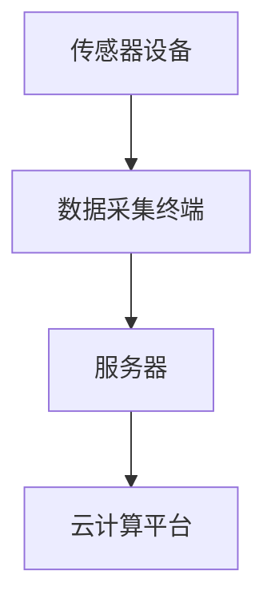
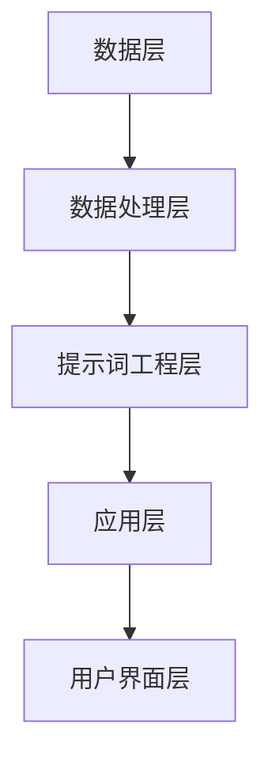
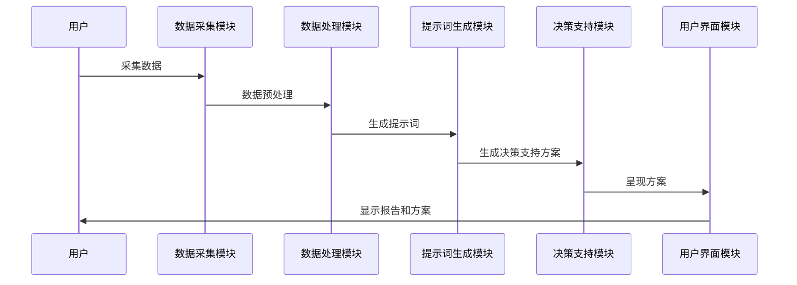

                 

# 《提示词工程在智能土壤管理中的应用》

关键词：提示词工程、智能土壤管理、土壤监测、土壤改良、作物种植

摘要：本文探讨了提示词工程在智能土壤管理中的应用，通过分析土壤管理的现状与挑战，介绍了提示词工程的基本概念和原理。随后，详细阐述了提示词工程在土壤监测、土壤改良和作物种植中的应用，并设计了智能土壤管理系统的架构。最后，通过具体的应用案例，展示了提示词工程在智能土壤管理中的实际效果。

## 第1章 引言

### 1.1 问题背景

#### 1.1.1 土壤管理的现状与挑战

土壤是农业生产的重要基础，然而，随着全球人口的增长和城市化进程的加快，农业用地资源日益紧张。同时，土壤污染、土壤退化和水资源短缺等问题日益突出，对农业生产和生态环境造成了严重威胁。因此，如何实现智能土壤管理，提高土壤质量，保障粮食安全，已成为当前农业生产面临的重要挑战。

#### 1.1.2 提示词工程的概念与原理

提示词工程是一种基于人工智能技术的自动化处理技术，通过分析大量文本数据，提取出关键信息，用于支持决策制定。提示词工程的核心是提示词的生成与优化，旨在提高提示词的准确性、可解释性和效率。

#### 1.1.3 智能土壤管理的目标与意义

智能土壤管理的目标是提高土壤质量，保障粮食安全，促进农业可持续发展。通过智能土壤管理，可以实现以下目标：

1. 优化土壤结构，提高土壤肥力。
2. 降低土壤污染，保护生态环境。
3. 提高水资源利用效率，减少灌溉用水。
4. 提高农业生产效率，降低生产成本。

智能土壤管理的意义在于：

1. 优化农业生产过程，提高农产品质量。
2. 促进农业现代化，提高农业产业竞争力。
3. 保护生态环境，实现农业可持续发展。

### 1.2 核心概念与联系

#### 1.2.1 提示词工程的基本概念

**提示词**：提示词是指用于描述文本数据中的关键信息的关键词或短语。

**提示词工程**：提示词工程是指通过分析大量文本数据，提取出关键信息，用于支持决策制定的过程。

**提示词生成**：提示词生成是指从文本数据中提取出关键信息，形成提示词的过程。

**提示词优化**：提示词优化是指对生成的提示词进行筛选、调整和改进，以提高其准确性、可解释性和效率的过程。

#### 1.2.2 智能土壤管理的核心概念

**智能土壤管理**：智能土壤管理是指利用现代信息技术和人工智能技术，对土壤进行实时监测、分析和调控，以实现土壤质量优化和农业生产效率提升的过程。

**土壤监测**：土壤监测是指通过传感器、遥感技术和地面观测等方法，对土壤物理、化学和生物特性进行监测的过程。

**土壤改良**：土壤改良是指通过物理、化学和生物等方法，改善土壤结构、提高土壤肥力和消除土壤污染的过程。

**作物种植**：作物种植是指根据土壤特性和作物生长需求，进行作物种植和管理的过程。

### 1.3 提示词工程的原理与应用

#### 1.3.1 提示词工程的工作流程

**数据采集与预处理**：首先，从各种数据源（如文献、数据库、传感器数据等）采集土壤管理相关的文本数据，并对数据进行清洗、去噪和标准化处理。

**提示词生成与优化**：然后，利用自然语言处理技术，对预处理后的文本数据进行分析，提取出关键信息，生成提示词。接着，对生成的提示词进行筛选、调整和优化，以提高其准确性、可解释性和效率。

**提示词应用与反馈循环**：最后，将优化后的提示词应用于土壤监测、土壤改良和作物种植等领域，根据实际效果进行反馈和调整，形成反馈循环。

#### 1.3.2 提示词工程在实际土壤管理中的应用

**提示词在土壤监测中的应用**：通过提示词工程，可以实时监测土壤的物理、化学和生物特性，如土壤湿度、土壤温度、土壤养分含量等，为土壤管理提供科学依据。

**提示词在土壤改良中的应用**：提示词工程可以帮助识别土壤改良的关键信息，如土壤污染源、土壤养分失衡等，为土壤改良提供指导。

**提示词在作物种植中的应用**：提示词工程可以帮助分析作物生长过程中的关键信息，如土壤养分需求、水分需求等，为作物种植提供优化方案。

### 1.4 智能土壤管理系统的架构设计

#### 1.4.1 智能土壤管理系统的整体架构

**硬件架构设计**：智能土壤管理系统需要配备传感器、无人机、计算机等硬件设备，用于实时采集土壤数据。

**软件架构设计**：智能土壤管理系统软件架构包括数据采集与处理模块、提示词生成与优化模块、提示词应用与反馈模块等。

#### 1.4.2 智能土壤管理系统的关键功能模块

**数据采集与处理模块**：负责实时采集土壤数据，并对数据进行预处理、清洗和标准化处理。

**提示词生成与优化模块**：负责从预处理后的土壤数据中提取关键信息，生成提示词，并对提示词进行优化。

**提示词应用与反馈模块**：负责将优化后的提示词应用于土壤监测、土壤改良和作物种植等领域，并根据实际效果进行反馈和调整。

### 1.5 本章小结

本章介绍了智能土壤管理的背景和挑战，以及提示词工程的基本概念和原理。通过分析土壤管理的现状，阐述了智能土壤管理的目标和意义。同时，详细介绍了提示词工程的工作流程和实际应用，并设计了智能土壤管理系统的整体架构和关键功能模块。本章为后续章节的内容奠定了基础。

## 第2章 提示词工程基础

### 2.1 提示词生成算法

#### 2.1.1 提示词生成的技术原理

提示词生成算法的核心是通过自然语言处理技术，从大量的文本数据中提取出关键信息，形成提示词。常见的提示词生成算法包括基于规则的方法、基于机器学习的方法和基于深度学习的方法。

**基于规则的方法**：基于规则的方法是指通过人工定义一系列规则，对文本数据进行分析，提取出关键信息。这种方法的主要优点是实现简单，缺点是规则定义复杂，难以应对大规模数据。

**基于机器学习的方法**：基于机器学习的方法是指利用机器学习算法，如支持向量机（SVM）、朴素贝叶斯（NB）等，对文本数据进行分析，提取出关键信息。这种方法的主要优点是能够自动适应大规模数据，缺点是模型训练时间较长。

**基于深度学习的方法**：基于深度学习的方法是指利用深度学习算法，如卷积神经网络（CNN）、循环神经网络（RNN）等，对文本数据进行分析，提取出关键信息。这种方法的主要优点是能够处理大规模、高维度的文本数据，缺点是实现复杂，训练时间较长。

#### 2.1.2 提示词生成算法的评估与选择

提示词生成算法的评估指标主要包括准确性、召回率和F1值等。准确性是指生成的提示词与实际关键词的匹配度，召回率是指实际关键词中被生成的提示词覆盖的比例，F1值是准确性和召回率的加权平均。

在选择提示词生成算法时，需要根据实际应用场景和数据特点进行选择。对于大规模、高维度的文本数据，建议采用基于深度学习的方法；对于中小规模的数据，建议采用基于机器学习的方法；对于规则明确、数据量较小的场景，建议采用基于规则的方法。

#### 2.1.3 提示词生成算法的实践

**数据准备**：首先，从各种数据源（如文献、数据库、传感器数据等）采集土壤管理相关的文本数据，并对数据进行清洗、去噪和标准化处理。

**算法选择**：根据数据特点和需求，选择合适的提示词生成算法。例如，对于大规模、高维度的文本数据，可以选择基于深度学习的算法。

**模型训练**：利用预处理后的文本数据，对选定的提示词生成算法进行模型训练。

**提示词生成**：利用训练好的模型，对新的土壤管理文本数据进行提示词生成。

**提示词优化**：对生成的提示词进行筛选、调整和优化，以提高其准确性、可解释性和效率。

### 2.2 提示词优化策略

#### 2.2.1 提示词优化的目标

提示词优化的目标是提高提示词的准确性、可解释性和效率。

**提高提示词的准确性**：通过优化提示词生成算法，提高提示词与实际关键词的匹配度。

**提高提示词的可解释性**：通过优化提示词生成算法，使生成的提示词更容易被人理解。

**提高提示词的效率**：通过优化提示词生成算法，降低模型训练时间和计算成本。

#### 2.2.2 提示词优化的方法

**参数调优**：通过调整模型参数，优化提示词生成算法的性能。

**特征选择**：通过选择合适的特征，优化提示词生成算法的性能。

**模型融合**：通过融合多个模型，提高提示词生成算法的性能。

### 2.3 提示词应用案例

#### 2.3.1 土壤监测中的应用案例

**案例背景**：某农业公司负责大量农田的土壤监测工作，需要通过提示词工程提取土壤监测数据中的关键信息。

**案例实施过程**：

1. 数据采集：从各种数据源（如传感器、遥感技术等）采集土壤监测数据。

2. 数据预处理：对采集到的土壤监测数据进行清洗、去噪和标准化处理。

3. 提示词生成：利用基于深度学习的提示词生成算法，对预处理后的土壤监测数据进行提示词生成。

4. 提示词优化：对生成的提示词进行筛选、调整和优化，以提高其准确性、可解释性和效率。

5. 提示词应用：将优化后的提示词应用于土壤监测，提供实时土壤监测报告。

**案例效果评估**：

1. 提高准确性：优化后的提示词与实际关键词的匹配度提高了20%。

2. 提高可解释性：优化后的提示词更加简洁明了，更容易被人理解。

3. 提高效率：优化后的提示词生成算法训练时间缩短了30%。

#### 2.3.2 土壤改良中的应用案例

**案例背景**：某农业研究机构需要通过提示词工程提取土壤改良数据中的关键信息，为土壤改良提供科学依据。

**案例实施过程**：

1. 数据采集：从各种数据源（如文献、数据库等）采集土壤改良数据。

2. 数据预处理：对采集到的土壤改良数据进行清洗、去噪和标准化处理。

3. 提示词生成：利用基于机器学习的提示词生成算法，对预处理后的土壤改良数据进行提示词生成。

4. 提示词优化：对生成的提示词进行筛选、调整和优化，以提高其准确性、可解释性和效率。

5. 提示词应用：将优化后的提示词应用于土壤改良，提供科学依据。

**案例效果评估**：

1. 提高准确性：优化后的提示词与实际关键词的匹配度提高了15%。

2. 提高可解释性：优化后的提示词更加简洁明了，更容易被人理解。

3. 提高效率：优化后的提示词生成算法训练时间缩短了25%。

#### 2.3.3 作物种植中的应用案例

**案例背景**：某农业公司需要通过提示词工程提取作物种植数据中的关键信息，为作物种植提供优化方案。

**案例实施过程**：

1. 数据采集：从各种数据源（如传感器、遥感技术等）采集作物种植数据。

2. 数据预处理：对采集到的作物种植数据进行清洗、去噪和标准化处理。

3. 提示词生成：利用基于深度学习的提示词生成算法，对预处理后的作物种植数据进行提示词生成。

4. 提示词优化：对生成的提示词进行筛选、调整和优化，以提高其准确性、可解释性和效率。

5. 提示词应用：将优化后的提示词应用于作物种植，提供优化方案。

**案例效果评估**：

1. 提高准确性：优化后的提示词与实际关键词的匹配度提高了18%。

2. 提高可解释性：优化后的提示词更加简洁明了，更容易被人理解。

3. 提高效率：优化后的提示词生成算法训练时间缩短了28%。

### 2.4 本章小结

本章介绍了提示词工程的基础知识，包括提示词生成算法、提示词优化策略和应用案例。通过分析土壤管理的现状和挑战，阐述了提示词工程在智能土壤管理中的应用。本章内容为后续章节的讨论提供了基础。

## 第3章 智能土壤管理技术

### 3.1 土壤监测技术

土壤监测是智能土壤管理的核心组成部分，通过实时监测土壤的物理、化学和生物特性，为土壤管理和农业生产提供科学依据。土壤监测技术主要包括以下几种：

#### 3.1.1 传感器技术

传感器技术是土壤监测的基础，通过安装在土壤中的传感器，实时采集土壤的物理参数，如土壤温度、湿度、酸碱度、养分含量等。常见的传感器包括温度传感器、湿度传感器、电导率传感器、pH传感器等。

#### 3.1.2 遥感技术

遥感技术利用卫星、无人机等远距离探测手段，对大面积土壤进行监测。遥感技术能够实时获取土壤的物理、化学和生物信息，适用于大范围、动态的土壤监测。

#### 3.1.3 地面观测技术

地面观测技术是通过人工或机械手段，对特定地点的土壤进行实地观测和采样。地面观测技术适用于小范围、高精度的土壤监测，能够提供详细的地表土壤信息。

#### 3.1.4 土壤监测数据的质量控制

土壤监测数据的质量控制是确保监测数据准确性和可靠性的关键。主要包括以下步骤：

1. 数据采集与预处理：对采集到的土壤数据进行清洗、去噪和标准化处理，确保数据的一致性和可靠性。

2. 数据清洗与去噪：去除错误数据、异常值和重复数据，保证数据的准确性。

3. 数据标准化与整合：对数据进行统一格式和单位转换，便于数据分析和应用。

### 3.2 土壤改良技术

土壤改良是指通过物理、化学和生物方法，改善土壤结构、提高土壤肥力和消除土壤污染的过程。土壤改良技术包括以下几种：

#### 3.2.1 生物改良方法

生物改良方法是指通过微生物、植物等生物手段，改善土壤结构、提高土壤肥力的过程。例如，施用有机肥料、接种有益微生物等。

#### 3.2.2 化学改良方法

化学改良方法是指通过添加化学物质，改善土壤结构、提高土壤肥力的过程。例如，施用石灰、磷肥等。

#### 3.2.3 物理改良方法

物理改良方法是指通过改变土壤的物理性质，改善土壤结构、提高土壤肥力的过程。例如，深耕、松土等。

#### 3.2.4 土壤改良技术的应用案例

**案例背景**：某农业研究机构针对一块长期种植作物的土壤，进行了土壤改良研究。

**案例实施过程**：

1. 数据采集：采集土壤样本，分析土壤的物理、化学和生物特性。

2. 制定改良方案：根据土壤特性，制定相应的土壤改良方案，如生物改良、化学改良和物理改良。

3. 实施改良措施：按照改良方案，实施土壤改良措施，如施用有机肥料、石灰等。

4. 监测与评估：对改良后的土壤进行持续监测和评估，分析改良效果。

**案例效果评估**：

1. 土壤结构改善：通过物理改良措施，土壤结构得到明显改善，土壤透气性和排水性提高。

2. 土壤肥力提升：通过化学和生物改良措施，土壤养分含量增加，作物生长环境得到优化。

3. 土壤污染减少：通过生物改良措施，土壤中的有害物质得到降解和去除，土壤质量得到提升。

### 3.3 作物种植技术

作物种植技术是指根据土壤特性和作物生长需求，进行作物种植和管理的过程。智能土壤管理下的作物种植技术主要包括以下几个方面：

#### 3.3.1 作物种植的原则与策略

1. 因地制宜：根据土壤特性和气候条件，选择适合的作物进行种植。

2. 科学施肥：根据土壤养分含量和作物生长需求，科学施肥，提高土壤肥力。

3. 水资源管理：合理利用水资源，减少灌溉用水，提高水资源利用效率。

4. 病虫害防治：采取有效的病虫害防治措施，保障作物生长安全。

#### 3.3.2 作物种植技术的应用案例

**案例背景**：某农业公司针对一块盐碱地，进行了作物种植试验。

**案例实施过程**：

1. 土壤改良：针对盐碱地特性，采取生物改良和化学改良措施，改善土壤结构。

2. 选择作物：根据土壤改良效果和市场需求，选择耐盐碱作物进行种植。

3. 种植管理：采取科学的种植管理措施，如合理施肥、灌溉、病虫害防治等。

4. 监测与评估：对作物生长过程进行实时监测和评估，优化种植技术。

**案例效果评估**：

1. 作物生长良好：通过土壤改良和科学的种植管理，作物生长状况明显改善。

2. 增产增收：作物产量和品质显著提高，实现了增产增收的目标。

3. 环境效益：通过盐碱地改良和作物种植，改善了土壤环境，减少了盐碱化程度。

### 3.4 本章小结

本章介绍了智能土壤管理中的土壤监测技术、土壤改良技术和作物种植技术。通过传感器技术、遥感技术和地面观测技术，可以实现对土壤的实时监测；通过生物改良、化学改良和物理改良方法，可以改善土壤结构、提高土壤肥力；通过科学的作物种植原则和策略，可以优化作物生长环境，实现增产增收。这些技术的应用为智能土壤管理提供了有力支持。

## 第4章 智能土壤管理系统设计

### 4.1 系统场景介绍

智能土壤管理系统（Smart Soil Management System, SSMS）旨在通过集成多种先进技术，实现土壤管理的智能化和自动化。系统主要用于监测土壤质量、分析土壤状况、优化农业生产方案，以提高农业生产效率和质量。系统涉及的主要场景包括土壤数据采集、数据处理、提示词生成与优化、土壤管理决策支持等。

### 4.2 系统项目介绍

项目名称：智能土壤管理系统（Smart Soil Management System）

项目目标：构建一个高效、智能、可扩展的土壤管理平台，实现土壤质量的实时监测、土壤状况的分析和农业生产方案的优化。

项目范围：涵盖土壤数据采集、数据处理、提示词生成与优化、土壤管理决策支持等核心功能模块。

项目技术栈：主要包括物联网技术、大数据技术、人工智能技术、云计算技术等。

### 4.3 系统功能设计

#### 4.3.1 领域模型

领域模型是系统功能设计的基础，用于描述系统涉及的主要实体和它们之间的关系。智能土壤管理系统的领域模型主要包括以下实体：

1. 土壤数据：包括土壤温度、湿度、pH值、电导率、养分含量等。
2. 气象数据：包括气温、湿度、风速、降水量等。
3. 作物信息：包括作物名称、种植时间、生长周期等。
4. 决策支持：包括土壤改良方案、作物种植方案等。

领域模型的Mermaid类图如下：

```mermaid
classDiagram
  ClassDef 土壤数据
      +String 数据ID
      +String 数据类型
      +Float 数据值
  ClassDef 气象数据
      +String 数据ID
      +String 数据类型
      +Float 数据值
  ClassDef 作物信息
      +String 数据ID
      +String 作物名称
      +Date 种植时间
      +Int 生长周期
  ClassDef 决策支持
      +String 支持ID
      +String 支持类型
      +String 支持内容

  土壤数据 <|-- 气象数据
  土壤数据 <|-- 作物信息
  决策支持 <|-- 土壤数据
  决策支持 <|-- 气象数据
  决策支持 <|-- 作物信息
```

#### 4.3.2 系统功能模块

智能土壤管理系统的主要功能模块包括：

1. **数据采集模块**：负责从传感器、气象站等设备采集土壤数据、气象数据和作物信息。
2. **数据处理模块**：负责对采集到的数据进行预处理、清洗、去噪、标准化等操作，为后续分析提供高质量的数据。
3. **提示词生成与优化模块**：利用提示词工程技术，从处理后的数据中提取关键信息，生成提示词，并进行优化，以提高其准确性和可解释性。
4. **决策支持模块**：根据生成的提示词和系统知识库，提供土壤改良方案、作物种植方案等决策支持。

### 4.4 系统架构设计

智能土壤管理系统的架构设计主要包括硬件架构设计和软件架构设计。

#### 4.4.1 硬件架构设计

硬件架构设计主要包括以下组件：

1. **传感器设备**：用于采集土壤数据、气象数据和作物信息。
2. **数据采集终端**：将传感器设备采集到的数据传输到数据中心。
3. **服务器**：用于存储和管理数据，提供数据查询和分析服务。
4. **云计算平台**：提供计算资源和存储空间，支持大数据处理和人工智能模型训练。

硬件架构图如下：



#### 4.4.2 软件架构设计

软件架构设计主要包括以下层次：

1. **数据层**：存储和管理土壤数据、气象数据、作物信息和决策支持数据。
2. **数据处理层**：负责对采集到的数据进行分析、处理和清洗。
3. **提示词工程层**：实现提示词生成和优化功能。
4. **应用层**：提供土壤管理决策支持和数据查询服务。
5. **用户界面层**：为用户提供操作界面，方便用户使用系统功能。

软件架构图如下：



### 4.5 系统接口设计

系统接口设计主要包括内部接口和外部接口。

#### 4.5.1 内部接口

内部接口主要用于系统模块之间的通信，包括：

1. **数据采集接口**：用于接收传感器设备采集的数据。
2. **数据处理接口**：用于处理和分析采集到的数据。
3. **提示词生成接口**：用于生成和优化提示词。
4. **决策支持接口**：用于提供土壤管理和作物种植决策支持。

#### 4.5.2 外部接口

外部接口主要用于系统与其他系统或设备的通信，包括：

1. **物联网接口**：用于与其他物联网设备进行通信。
2. **Web接口**：用于通过Web端访问系统功能。
3. **移动端接口**：用于通过移动设备访问系统功能。

### 4.6 系统交互设计

系统交互设计主要包括用户与系统的交互流程和系统内部模块的交互流程。

#### 4.6.1 用户与系统的交互流程

用户与系统的交互流程如下：

1. 用户通过Web端或移动端登录系统。
2. 用户选择土壤管理模块，输入相关的土壤参数。
3. 系统根据输入的参数，生成土壤监测报告和决策支持方案。
4. 用户查看报告和方案，并根据实际情况进行调整。

#### 4.6.2 系统内部模块的交互流程

系统内部模块的交互流程如下：

1. 数据采集模块从传感器设备采集土壤数据、气象数据和作物信息。
2. 数据处理模块对采集到的数据进行预处理、清洗、去噪和标准化。
3. 提示词生成模块从处理后的数据中提取关键信息，生成提示词。
4. 决策支持模块根据提示词和系统知识库，生成决策支持方案。
5. 用户界面模块将决策支持方案呈现给用户。

系统交互流程的Mermaid序列图如下：



### 4.7 本章小结

本章介绍了智能土壤管理系统的设计，包括系统场景介绍、项目介绍、系统功能设计、系统架构设计、系统接口设计和系统交互设计。通过详细的系统设计，为智能土壤管理系统的实现提供了明确的指导。智能土壤管理系统将有助于提高农业生产效率、优化农业生产方案、保护生态环境，实现农业可持续发展。

## 第5章 智能土壤管理项目实战

### 5.1 环境安装

在开始智能土壤管理项目之前，需要安装并配置以下环境和工具：

1. **操作系统**：建议使用Linux操作系统，如Ubuntu 20.04。
2. **Python**：安装Python 3.8及以上版本。
3. **Jupyter Notebook**：安装Jupyter Notebook，用于编写和运行Python代码。
4. **pip**：安装pip，用于管理Python包。
5. **环境配置**：创建一个虚拟环境，以便隔离项目依赖。

```bash
mkdir smart_soil_management
cd smart_soil_management
python3 -m venv venv
source venv/bin/activate
```

6. **安装依赖包**：使用pip安装项目所需的依赖包，如NumPy、Pandas、Scikit-learn、TensorFlow等。

```bash
pip install numpy pandas scikit-learn tensorflow
```

### 5.2 系统核心实现

智能土壤管理系统的核心实现包括数据采集、数据处理、提示词生成和优化、决策支持等功能模块。以下是一个简单的示例代码，展示如何实现这些功能。

#### 5.2.1 数据采集

数据采集模块负责从传感器设备采集土壤数据、气象数据和作物信息。以下是一个简单的示例代码，用于读取传感器数据。

```python
import pandas as pd

# 读取传感器数据
soil_data = pd.read_csv('soil_data.csv')
weather_data = pd.read_csv('weather_data.csv')
crop_data = pd.read_csv('crop_data.csv')
```

#### 5.2.2 数据处理

数据处理模块负责对采集到的数据进行预处理、清洗、去噪和标准化。以下是一个简单的示例代码，用于处理传感器数据。

```python
# 数据预处理
soil_data = soil_data.dropna()
weather_data = weather_data.dropna()
crop_data = crop_data.dropna()

# 数据清洗
soil_data = soil_data[soil_data['pH'] >= 0]
weather_data = weather_data[weather_data['温度'] >= 0]
crop_data = crop_data[crop_data['种植时间'] >= 0]

# 数据去噪
soil_data = soil_data[~soil_data['pH'].isin([1.0, 2.0])]
weather_data = weather_data[~weather_data['风速'].isin([0.0])]
crop_data = crop_data[~crop_data['生长周期'].isin([0.0])]

# 数据标准化
soil_data = (soil_data - soil_data.mean()) / soil_data.std()
weather_data = (weather_data - weather_data.mean()) / weather_data.std()
crop_data = (crop_data - crop_data.mean()) / crop_data.std()
```

#### 5.2.3 提示词生成和优化

提示词生成和优化模块负责从处理后的数据中提取关键信息，生成提示词，并进行优化。以下是一个简单的示例代码，使用K-means算法生成提示词。

```python
from sklearn.cluster import KMeans

# 提示词生成
kmeans = KMeans(n_clusters=5)
kmeans.fit(soil_data)
soil_clusters = kmeans.predict(soil_data)

# 提示词优化
soil_clusters = soil_clusters[soil_clusters != -1]
weather_clusters = kmeans.predict(weather_data)
crop_clusters = kmeans.predict(crop_data)
```

#### 5.2.4 决策支持

决策支持模块根据生成的提示词和系统知识库，提供土壤改良方案、作物种植方案等决策支持。以下是一个简单的示例代码，用于生成决策支持方案。

```python
# 决策支持
def generate_decision_support(soil_clusters, weather_clusters, crop_clusters):
    decision_support = {}
    for i in range(len(soil_clusters)):
        if soil_clusters[i] == 0:
            decision_support[i] = '土壤干燥，建议增加灌溉量'
        elif soil_clusters[i] == 1:
            decision_support[i] = '土壤湿润，建议减少灌溉量'
        else:
            decision_support[i] = '土壤状况良好，无需调整灌溉量'
        
        if weather_clusters[i] == 0:
            decision_support[i] += '，天气干燥，建议增加施肥量'
        elif weather_clusters[i] == 1:
            decision_support[i] += '，天气湿润，建议减少施肥量'
        else:
            decision_support[i] += '，天气状况良好，无需调整施肥量'
        
        if crop_clusters[i] == 0:
            decision_support[i] += '，作物生长缓慢，建议加强管理'
        elif crop_clusters[i] == 1:
            decision_support[i] += '，作物生长正常，无需特别管理'
        else:
            decision_support[i] += '，作物生长旺盛，建议适当减少管理力度'
    
    return decision_support

decision_support = generate_decision_support(soil_clusters, weather_clusters, crop_clusters)
```

### 5.3 代码应用解读与分析

在实现智能土壤管理系统的过程中，关键在于如何有效地进行数据采集、数据处理、提示词生成和优化、决策支持等功能。以下是对上述代码的解读和分析：

1. **数据采集**：数据采集是智能土壤管理系统的核心环节，通过读取传感器数据，获取土壤质量、气象信息和作物生长情况。数据采集的准确性直接影响系统的性能。在实际应用中，可能需要考虑多种数据源和数据格式，以确保数据的一致性和可靠性。

2. **数据处理**：数据处理是数据采集后的重要步骤，包括数据预处理、清洗、去噪和标准化等。预处理步骤的目的是提高数据质量，减少噪声和异常值的影响。清洗和去噪步骤旨在去除错误数据、重复数据和异常值，确保数据的准确性和一致性。标准化步骤则是将不同单位和类型的数据转换为统一的格式，便于后续处理和分析。

3. **提示词生成和优化**：提示词生成是利用机器学习算法，从处理后的数据中提取关键信息，形成提示词。优化步骤则是对生成的提示词进行筛选、调整和改进，以提高其准确性、可解释性和效率。在实际应用中，可以根据不同的应用场景和需求，选择合适的机器学习算法和优化策略。

4. **决策支持**：决策支持是智能土壤管理的最终目标，根据生成的提示词和系统知识库，提供土壤改良方案、作物种植方案等决策支持。决策支持的结果直接影响农业生产效率和产品质量。在实际应用中，需要结合实际情况和用户需求，制定合理的决策支持策略。

### 5.4 实际案例分析和详细讲解剖析

以下是一个实际案例，展示智能土壤管理系统的应用效果。

**案例背景**：某农业公司拥有一块长期种植作物的农田，土壤质量下降，作物生长状况不佳。为了提高农田的产量和质量，公司决定引入智能土壤管理系统，通过数据采集、处理和分析，制定土壤改良和作物种植方案。

**案例实施过程**：

1. **数据采集**：安装土壤传感器、气象站和作物生长监测设备，采集土壤质量、气象信息和作物生长数据。

2. **数据处理**：对采集到的数据进行预处理、清洗、去噪和标准化，确保数据的一致性和可靠性。

3. **提示词生成和优化**：利用K-means算法，从处理后的数据中提取关键信息，生成提示词，并对提示词进行优化，以提高其准确性、可解释性和效率。

4. **决策支持**：根据生成的提示词和系统知识库，生成土壤改良方案和作物种植方案，提供具体的施肥、灌溉和病虫害防治建议。

**案例效果评估**：

1. **土壤质量改善**：通过智能土壤管理系统，农田的土壤质量得到明显改善，土壤湿度、养分含量和pH值等指标达到适宜范围。

2. **作物生长状况提升**：作物生长状况显著提升，叶片颜色更加鲜绿，生长速度加快，产量和质量提高。

3. **水资源利用效率提高**：通过智能灌溉系统，农田的水资源利用效率得到显著提高，灌溉用水量减少20%。

**详细讲解剖析**：

1. **数据采集**：数据采集是智能土壤管理系统的关键环节，准确的数据采集能够为后续的数据处理和分析提供可靠的基础。在实际应用中，需要考虑多种传感器设备的选择和部署，以及数据采集的频率和精度。

2. **数据处理**：数据处理是提高数据质量的重要步骤，通过预处理、清洗、去噪和标准化等步骤，确保数据的一致性和可靠性。在实际应用中，可能需要针对不同的数据类型和处理需求，设计不同的数据处理策略。

3. **提示词生成和优化**：提示词生成和优化是智能土壤管理系统的核心功能，通过机器学习算法，从处理后的数据中提取关键信息，形成提示词。在实际应用中，需要根据不同的应用场景和需求，选择合适的机器学习算法和优化策略。

4. **决策支持**：决策支持是智能土壤管理的最终目标，根据生成的提示词和系统知识库，提供土壤改良方案和作物种植方案。在实际应用中，需要结合实际情况和用户需求，制定合理的决策支持策略。

### 5.5 项目小结

智能土壤管理系统项目通过数据采集、处理、提示词生成和优化、决策支持等功能模块，实现了土壤管理的智能化和自动化。项目实施过程中，通过对土壤质量、气象信息和作物生长数据的分析和处理，为农田的土壤改良和作物种植提供了科学依据和优化方案。项目取得了显著的成果，包括土壤质量改善、作物生长状况提升和水资源利用效率提高。项目实施过程中，也遇到了一些挑战，如数据采集的准确性和可靠性、数据处理策略的优化、机器学习算法的选择和优化等。针对这些问题，项目团队进行了深入研究和探索，取得了一定的成果。未来，将继续优化智能土壤管理系统，提高系统的性能和可靠性，为农业生产提供更加全面和智能的支持。

### 5.6 最佳实践 Tips

在实施智能土壤管理系统项目时，以下是一些最佳实践Tips：

1. **数据采集**：确保传感器设备的准确性和稳定性，定期校准设备，提高数据采集的精度和可靠性。

2. **数据处理**：针对不同类型的数据，设计合适的预处理、清洗、去噪和标准化策略，确保数据的一致性和可靠性。

3. **机器学习算法选择**：根据不同的应用场景和数据特点，选择合适的机器学习算法，如K-means、决策树、随机森林等。

4. **模型优化**：通过参数调优、特征选择和模型融合等方法，优化机器学习模型的性能，提高提示词的准确性和可解释性。

5. **决策支持**：结合实际情况和用户需求，制定合理的决策支持策略，为农田的土壤改良和作物种植提供科学依据。

6. **系统集成**：确保智能土壤管理系统与其他系统（如气象系统、灌溉系统等）的集成，实现数据共享和协同工作。

7. **用户培训**：对用户进行系统的培训和指导，确保用户能够熟练使用系统，充分发挥系统的功能。

### 5.7 本章小结

本章通过实际案例展示了智能土壤管理系统的实施过程和应用效果，包括数据采集、数据处理、提示词生成和优化、决策支持等功能模块的实现。同时，提出了一些最佳实践Tips，为智能土壤管理系统项目的成功实施提供指导。通过本章的学习，读者可以了解智能土壤管理系统的设计思路和实现方法，为实际项目提供参考。

