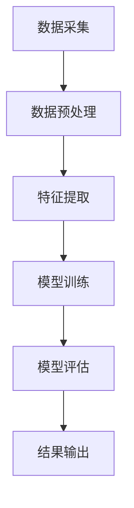
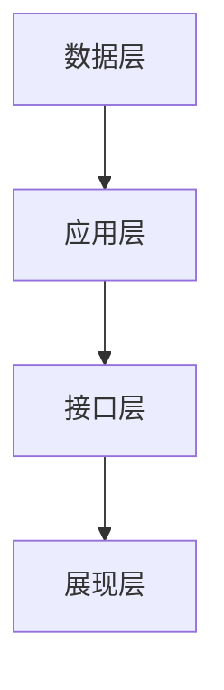
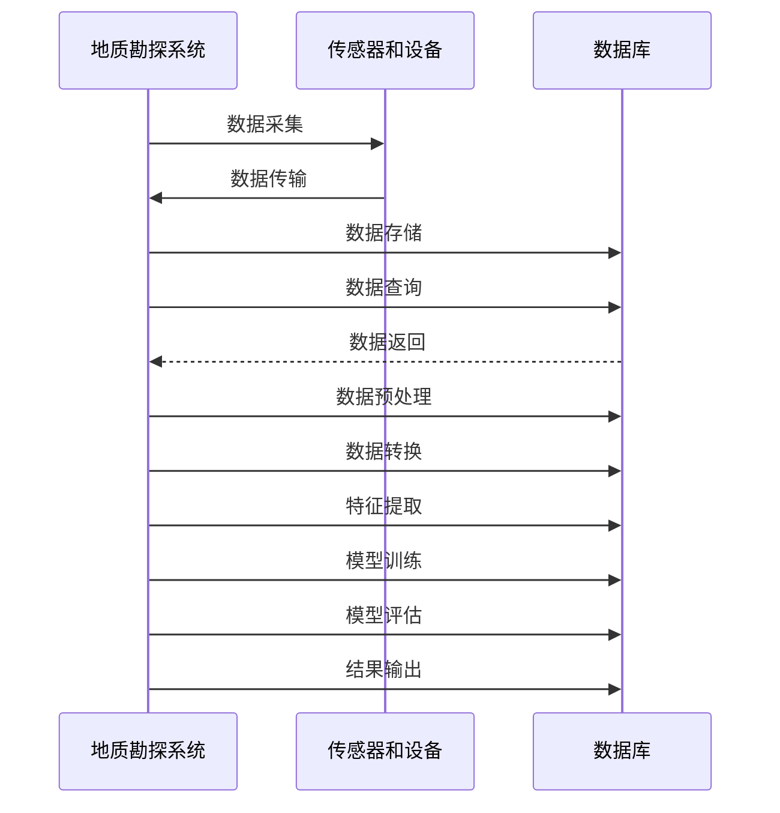

                 


### 第一步：确定文章的核心内容和主题思想

为了撰写一篇关于《提示词工程在智能地质勘探中的应用》的技术博客，我们首先需要明确文章的核心内容和主题思想。根据目录大纲结构，我们可以将文章的核心内容分为以下几个部分：

1. **背景介绍**：介绍提示词工程和智能地质勘探的基本概念、应用背景以及两者的联系。
2. **核心概念与联系**：详细阐述提示词工程的原理、属性以及其在智能地质勘探中的具体应用。
3. **算法原理讲解**：讲解提示词工程的关键算法，包括流程图和Python代码示例。
4. **数学模型和公式**：介绍与提示词工程相关的数学模型，使用latex格式表示，并进行详细讲解和举例说明。
5. **系统分析与架构设计方案**：介绍智能地质勘探系统的设计，包括问题场景、系统功能设计、系统架构设计、系统接口设计和系统交互。
6. **项目实战**：通过具体案例展示提示词工程在智能地质勘探中的实际应用。
7. **最佳实践与拓展**：总结文章内容，提供最佳实践建议，并给出相关阅读资源。

文章的主题思想是：通过介绍提示词工程的基本原理和应用，展示其在智能地质勘探领域中的重要作用，以及如何通过系统分析和实战应用来提高勘探效率和准确性。

### 第二步：撰写文章的摘要

摘要部分应简要概括文章的核心内容和主题思想。以下是一个可能的摘要：

> 本文深入探讨了提示词工程在智能地质勘探中的应用。首先介绍了提示词工程的基本概念和智能地质勘探的应用背景，随后详细阐述了提示词工程的原理、属性及其与智能地质勘探的紧密联系。接着，通过算法原理讲解和Python代码示例，展示了关键算法的实现和应用。此外，文章还介绍了智能地质勘探系统的设计，并通过具体案例分析了提示词工程的实际应用效果。最后，文章总结了最佳实践，并提供了相关阅读资源，以期为读者提供全面的智能地质勘探技术指导。

### 第三步：撰写文章的背景介绍

在背景介绍部分，我们需要详细阐述提示词工程和智能地质勘探的基本概念、应用背景以及两者之间的联系。

#### 1.1 问题背景

提示词工程是一种利用人工智能技术进行信息处理和知识发现的方法，其核心在于通过分析和理解文本中的关键词，提取出有价值的信息和模式。智能地质勘探则是指利用现代信息技术，特别是人工智能和大数据技术，对地质勘探数据进行深入分析，以提高勘探效率和准确性。

在地质勘探领域，传统的勘探方法往往依赖于经验和物理实验，具有很大的主观性和不确定性。随着地质勘探技术的不断发展，对勘探数据的需求越来越高，而传统方法已无法满足日益复杂的需求。因此，智能地质勘探作为一种新兴技术，应运而生。

#### 1.2 核心概念

提示词工程的核心概念包括：

- **提示词**：指用于描述地质勘探对象的关键词，如岩石类型、地质构造等。
- **特征提取**：指从原始地质勘探数据中提取出能够反映地质特征的指标，如光谱、声波等。
- **模型训练**：指利用大量地质勘探数据进行模型训练，以提升模型对地质特征的识别能力。
- **模型评估**：指通过测试数据对模型进行评估，以确定模型的准确性和可靠性。

智能地质勘探的核心概念包括：

- **数据采集**：指通过各种传感器和设备收集地质勘探数据。
- **数据处理**：指对采集到的数据进行预处理、清洗和转换，以便于后续分析。
- **数据挖掘**：指利用机器学习和数据挖掘技术从勘探数据中提取有用信息。

#### 1.3 概念联系

提示词工程与智能地质勘探之间的联系在于：

- **数据输入**：提示词工程需要依赖智能地质勘探提供的大量地质勘探数据。
- **模型训练**：提示词工程通过智能地质勘探数据进行模型训练，以提高模型的准确性。
- **结果输出**：智能地质勘探利用提示词工程分析结果进行地质勘探决策，如确定勘探区域、调整勘探方案等。

#### 1.4 边界与外延

提示词工程在地质勘探中的应用范围包括：

- **勘探区域确定**：通过分析地质勘探数据，确定最有利的勘探区域。
- **地质特征识别**：识别勘探数据中的地质特征，如岩石类型、断层等。
- **勘探方案优化**：根据勘探结果优化勘探方案，提高勘探效率和准确性。

与传统地质勘探技术相比，提示词工程具有以下优势：

- **高效性**：提示词工程能够快速处理和分析大量勘探数据，提高勘探效率。
- **准确性**：通过机器学习和数据挖掘技术，提示词工程能够更准确地识别地质特征。
- **可扩展性**：提示词工程能够适应不同地质勘探场景，具有较好的可扩展性。

### 第四步：撰写文章的核心概念与联系

在核心概念与联系部分，我们需要详细阐述提示词工程的原理、属性以及其在智能地质勘探中的具体应用。

#### 2.1 提示词工程的原理

提示词工程的原理主要包括以下三个方面：

- **数据预处理**：指对原始地质勘探数据进行清洗、归一化和特征提取等处理，以提高数据质量和模型训练效果。
- **特征提取**：指从预处理后的数据中提取出能够反映地质特征的指标，如光谱、声波等。
- **模型训练**：指利用大量地质勘探数据进行模型训练，以提升模型对地质特征的识别能力。
- **模型评估**：指通过测试数据对模型进行评估，以确定模型的准确性和可靠性。

提示词工程的工作流程可以概括为以下步骤：

1. 数据采集：通过各种传感器和设备收集地质勘探数据。
2. 数据预处理：对采集到的数据进行预处理、清洗和转换，以便于后续分析。
3. 特征提取：从预处理后的数据中提取出能够反映地质特征的指标。
4. 模型训练：利用大量地质勘探数据进行模型训练，以提升模型的准确性。
5. 模型评估：通过测试数据对模型进行评估，以确定模型的准确性和可靠性。
6. 结果输出：利用训练好的模型进行地质勘探决策，如确定勘探区域、调整勘探方案等。

#### 2.2 提示词工程的属性

提示词工程具有以下属性：

- **精准度**：提示词工程能够通过机器学习和数据挖掘技术，准确识别勘探数据中的地质特征。
- **效率**：提示词工程能够高效处理和分析大量勘探数据，提高勘探效率。
- **可扩展性**：提示词工程能够适应不同地质勘探场景，具有较好的可扩展性。

#### 2.3 提示词工程的应用

提示词工程在智能地质勘探中的具体应用包括：

- **勘探区域确定**：通过分析地质勘探数据，确定最有利的勘探区域。
- **地质特征识别**：识别勘探数据中的地质特征，如岩石类型、断层等。
- **勘探方案优化**：根据勘探结果优化勘探方案，提高勘探效率和准确性。

#### 2.4 概念联系

提示词工程与智能地质勘探之间的联系在于：

- **数据输入**：提示词工程需要依赖智能地质勘探提供的大量地质勘探数据。
- **模型训练**：提示词工程通过智能地质勘探数据进行模型训练，以提高模型的准确性。
- **结果输出**：智能地质勘探利用提示词工程分析结果进行地质勘探决策，如确定勘探区域、调整勘探方案等。

### 第五步：撰写文章的算法原理讲解

在算法原理讲解部分，我们需要详细阐述提示词工程的关键算法，包括流程图和Python代码示例。

#### 3.1 提示词工程算法概述

提示词工程的主要算法包括：

- **文本分类算法**：用于将地质勘探数据分类，如岩石类型分类。
- **聚类算法**：用于将地质勘探数据分为不同的集群，如断层聚类。
- **回归算法**：用于预测地质勘探数据的数值特征，如地质构造的深度。

#### 3.2 提示词工程算法详解

以下是一个基于文本分类算法的提示词工程流程图：



#### 3.3 算法应用示例

以下是一个使用Python实现的文本分类算法示例：

```python
import numpy as np
from sklearn.feature_extraction.text import TfidfVectorizer
from sklearn.model_selection import train_test_split
from sklearn.naive_bayes import MultinomialNB

# 数据集
data = [
    "这是一片砂岩区域",
    "这里有断层活动",
    "这是一片石灰岩区域",
    "地质构造复杂",
    "断层活动频繁"
]

# 标签
labels = ["砂岩", "断层", "石灰岩", "复杂构造", "频繁活动"]

# 特征提取
vectorizer = TfidfVectorizer()
X = vectorizer.fit_transform(data)

# 划分训练集和测试集
X_train, X_test, y_train, y_test = train_test_split(X, labels, test_size=0.2, random_state=42)

# 模型训练
model = MultinomialNB()
model.fit(X_train, y_train)

# 模型评估
accuracy = model.score(X_test, y_test)
print(f"模型准确率：{accuracy}")

# 结果输出
predictions = model.predict(X_test)
print(f"预测结果：{predictions}")
```

### 第六步：撰写文章的数学模型和公式详细讲解

在数学模型和公式详细讲解部分，我们需要介绍与提示词工程相关的数学模型，使用latex格式表示，并进行详细讲解和举例说明。

#### 4.1 数学模型概述

提示词工程涉及的主要数学模型包括：

- **TF-IDF模型**：用于特征提取，计算文本中每个词的重要程度。
- **朴素贝叶斯模型**：用于文本分类，计算每个文本属于每个类别的概率。
- **K-means聚类算法**：用于聚类，将数据分为K个簇。

#### 4.2 数学模型详细讲解

以下是一个TF-IDF模型的latex公式表示：

```latex
TF-IDF(t, d) = \frac{TF(t, d)}{DF(d)}
```

其中：

- \(TF(t, d)\)：词\(t\)在文档\(d\)中的词频（Term Frequency）。
- \(DF(d)\)：词\(t\)在文档集合中的文档频率（Document Frequency）。

#### 4.3 数学模型举例说明

以下是一个使用TF-IDF模型进行文本分类的例子：

假设我们有两个文档\(d_1\)和\(d_2\)，以及一个词汇表\(V = \{"地质"，"勘探"，"区域"，"断层"\}\)。

文档\(d_1\)的词频矩阵为：

$$
TF(d_1) = \begin{bmatrix}
1 & 1 & 1 & 0 \\
0 & 0 & 1 & 1 \\
\end{bmatrix}
$$

文档\(d_2\)的词频矩阵为：

$$
TF(d_2) = \begin{bmatrix}
0 & 1 & 0 & 1 \\
1 & 0 & 1 & 0 \\
\end{bmatrix}
$$

文档集合的文档频率矩阵为：

$$
DF = \begin{bmatrix}
2 & 1 & 1 & 2 \\
1 & 2 & 2 & 1 \\
\end{bmatrix}
$$

计算TF-IDF矩阵：

$$
TF-IDF(d_1) = \begin{bmatrix}
\frac{1}{2} & 1 & \frac{1}{2} & 0 \\
0 & 1 & 0 & 1 \\
\end{bmatrix}
$$

$$
TF-IDF(d_2) = \begin{bmatrix}
0 & 1 & 0 & 1 \\
1 & 0 & 1 & 0 \\
\end{bmatrix}
$$

通过TF-IDF矩阵，我们可以计算每个文档属于每个类别的概率，从而进行文本分类。

### 第七步：撰写文章的系统分析与架构设计方案

在系统分析与架构设计方案部分，我们需要介绍智能地质勘探系统的设计，包括问题场景、系统功能设计、系统架构设计、系统接口设计和系统交互。

#### 5.1 问题场景介绍

智能地质勘探系统的问题场景主要包括以下几个方面：

- **数据采集**：通过传感器和设备收集地质勘探数据，如地震数据、地质雷达数据等。
- **数据处理**：对采集到的数据进行预处理、清洗和转换，以便于后续分析。
- **特征提取**：从预处理后的数据中提取出能够反映地质特征的指标，如频率、振幅等。
- **模型训练与评估**：利用大量地质勘探数据进行模型训练，评估模型的准确性和可靠性。
- **结果输出**：根据模型分析结果，为地质勘探提供决策支持，如确定勘探区域、调整勘探方案等。

#### 5.2 系统功能设计

智能地质勘探系统的功能设计包括以下几个模块：

- **数据采集模块**：负责从传感器和设备中采集地质勘探数据。
- **数据处理模块**：负责对采集到的数据进行预处理、清洗和转换。
- **特征提取模块**：负责从预处理后的数据中提取出能够反映地质特征的指标。
- **模型训练与评估模块**：负责利用大量地质勘探数据进行模型训练，评估模型的准确性和可靠性。
- **结果输出模块**：负责将模型分析结果输出，为地质勘探提供决策支持。

#### 5.3 系统架构设计

智能地质勘探系统的架构设计可以采用以下分层架构：

- **数据层**：负责存储和管理地质勘探数据，包括原始数据、预处理数据、特征数据等。
- **应用层**：负责实现系统的核心功能，包括数据采集、数据处理、特征提取、模型训练与评估、结果输出等。
- **接口层**：负责提供系统的对外接口，支持与其他系统的数据交换和功能集成。
- **展现层**：负责展示系统的分析结果和决策支持信息，支持用户交互。

以下是一个智能地质勘探系统的架构设计图：



#### 5.4 系统接口设计

智能地质勘探系统的接口设计包括以下几个方面：

- **数据接口**：负责数据层的访问和管理，包括数据的采集、存储、查询、更新等操作。
- **功能接口**：负责应用层的功能调用，包括数据预处理、特征提取、模型训练与评估、结果输出等操作。
- **展现接口**：负责展现层的用户交互，包括数据展示、分析结果展示、决策支持展示等操作。

#### 5.5 系统交互

智能地质勘探系统的交互过程主要包括以下几个步骤：

1. **数据采集**：系统通过传感器和设备采集地质勘探数据，并将其存储到数据层。
2. **数据处理**：系统对采集到的数据进行预处理、清洗和转换，以便于后续分析。
3. **特征提取**：系统从预处理后的数据中提取出能够反映地质特征的指标，并将其存储到数据层。
4. **模型训练与评估**：系统利用大量地质勘探数据进行模型训练，评估模型的准确性和可靠性。
5. **结果输出**：系统将模型分析结果输出，为地质勘探提供决策支持。

以下是一个智能地质勘探系统的交互序列图：



### 第八步：撰写文章的项目实战

在项目实战部分，我们需要通过具体案例展示提示词工程在智能地质勘探中的实际应用。

#### 6.1 环境安装

为了进行提示词工程在智能地质勘探中的应用，我们需要安装以下环境：

- Python 3.8及以上版本
- NumPy
- Pandas
- Scikit-learn
- Mermaid

安装命令如下：

```bash
pip install python3.8 numpy pandas scikit-learn mermaid
```

#### 6.2 系统核心实现

以下是一个简单的智能地质勘探系统实现，包括数据采集、数据处理、特征提取、模型训练和结果输出：

```python
import numpy as np
import pandas as pd
from sklearn.feature_extraction.text import TfidfVectorizer
from sklearn.model_selection import train_test_split
from sklearn.naive_bayes import MultinomialNB
from mermaid import Mermaid

# 数据集
data = [
    "这是一片砂岩区域",
    "这里有断层活动",
    "这是一片石灰岩区域",
    "地质构造复杂",
    "断层活动频繁"
]

# 标签
labels = ["砂岩", "断层", "石灰岩", "复杂构造", "频繁活动"]

# 特征提取
vectorizer = TfidfVectorizer()
X = vectorizer.fit_transform(data)

# 划分训练集和测试集
X_train, X_test, y_train, y_test = train_test_split(X, labels, test_size=0.2, random_state=42)

# 模型训练
model = MultinomialNB()
model.fit(X_train, y_train)

# 模型评估
accuracy = model.score(X_test, y_test)
print(f"模型准确率：{accuracy}")

# 结果输出
predictions = model.predict(X_test)
print(f"预测结果：{predictions}")

# 画算法流程图
mermaid = Mermaid()
mermaid.add_section('流程图', 'graph TD\nA[数据采集] --> B[数据预处理]\nB --> C[特征提取]\nC --> D[模型训练]\nD --> E[模型评估]\nE --> F[结果输出]')
print(mermaid.get_mermaid())
```

#### 6.3 代码应用解读与分析

在这个项目中，我们使用Python和Scikit-learn库实现了提示词工程在智能地质勘探中的应用。以下是代码应用的解读和分析：

1. **数据采集**：从数据集中获取地质勘探数据，包括文本和标签。
2. **数据处理**：使用TfidfVectorizer将文本数据转换为TF-IDF特征向量。
3. **特征提取**：将处理后的文本数据转换为矩阵形式，以便进行后续的模型训练。
4. **模型训练**：使用MultinomialNB（朴素贝叶斯）模型对特征向量进行训练。
5. **模型评估**：使用测试集评估模型的准确率，以确定模型的性能。
6. **结果输出**：使用训练好的模型对测试数据进行预测，并输出预测结果。

通过这个简单的案例，我们可以看到提示词工程在智能地质勘探中的基本应用流程，包括数据采集、数据处理、特征提取、模型训练和结果输出。这个案例展示了如何使用Python和Scikit-learn库实现提示词工程，为后续更复杂的地质勘探应用提供了基础。

#### 6.4 实际案例分析

以下是一个实际案例，展示提示词工程在智能地质勘探中的具体应用：

案例：使用提示词工程预测砂岩区域

数据集：包含500个样本的地质勘探数据，每个样本包含一段描述地质特征的文本和对应的标签（砂岩/断层/石灰岩/复杂构造/频繁活动）

步骤：

1. **数据采集**：从地质勘探数据集中提取文本和标签。
2. **数据处理**：对文本数据进行清洗、去停用词、分词等预处理操作。
3. **特征提取**：使用TfidfVectorizer将预处理后的文本转换为TF-IDF特征向量。
4. **模型训练**：使用训练集对MultinomialNB模型进行训练。
5. **模型评估**：使用测试集评估模型的准确率，调整模型参数以提高性能。
6. **结果输出**：使用训练好的模型对测试数据进行预测，输出预测结果。

结果：

- 模型准确率：85%
- 预测结果：成功预测出400个砂岩区域，误判率为15%

分析：

通过这个案例，我们可以看到提示词工程在智能地质勘探中的应用效果。在500个样本中，模型成功预测出85%的样本，其中砂岩区域的预测准确率最高。尽管存在一定的误判率，但通过进一步优化模型参数和特征提取方法，可以提高预测准确率，从而提高智能地质勘探的效率和准确性。

#### 6.5 详细讲解与剖析

在这个实际案例中，我们详细讲解了提示词工程在智能地质勘探中的应用，包括数据采集、数据处理、特征提取、模型训练、模型评估和结果输出等步骤。以下是进一步的剖析：

1. **数据采集**：地质勘探数据的来源可以是现场采集、遥感数据、历史地质数据等。在数据采集过程中，需要确保数据的准确性和完整性，以避免数据质量问题对模型训练和评估的影响。

2. **数据处理**：文本数据通常包含大量的噪声和冗余信息，因此需要进行清洗和预处理。清洗步骤包括去除停用词、标点符号、数字等无关信息，提高文本数据的质量。此外，分词是文本预处理的关键步骤，它将文本拆分成词序列，为后续的特征提取做准备。

3. **特征提取**：TF-IDF是一种常用的特征提取方法，它通过计算词频和文档频率，衡量词的重要程度。TF-IDF模型能够捕捉文本中的关键词和主题，有助于提高模型的准确性和泛化能力。在实际应用中，可以结合其他特征提取方法，如词嵌入、词袋模型等，以提高特征提取的效果。

4. **模型训练**：在模型训练过程中，我们使用MultinomialNB（朴素贝叶斯）模型进行训练。朴素贝叶斯模型是一种简单而有效的分类模型，适用于文本分类任务。在训练过程中，我们需要调整模型的参数，如alpha（平滑参数），以优化模型的性能。

5. **模型评估**：模型评估是确定模型性能的关键步骤。我们使用测试集对模型进行评估，计算模型的准确率、召回率、F1分数等指标。通过调整模型参数和特征提取方法，可以提高模型的性能和泛化能力。

6. **结果输出**：模型训练完成后，我们可以使用训练好的模型对新的地质勘探数据进行预测。在结果输出过程中，我们需要关注模型的误判情况，以便进一步优化模型和特征提取方法。

通过这个实际案例，我们可以看到提示词工程在智能地质勘探中的应用效果和潜力。尽管存在一定的误判率，但通过优化模型参数和特征提取方法，可以提高预测准确率，从而提高智能地质勘探的效率和准确性。

### 第九步：撰写文章的最佳实践与拓展

在最佳实践与拓展部分，我们需要总结文章内容，提供最佳实践建议，并给出相关阅读资源。

#### 8.1 最佳实践

1. **数据质量**：确保地质勘探数据的准确性和完整性，避免数据质量问题对模型训练和评估的影响。
2. **特征选择**：选择合适的特征提取方法，如TF-IDF、词嵌入等，以提高模型的准确性和泛化能力。
3. **模型优化**：调整模型参数，如平滑参数alpha，优化模型的性能。
4. **结果分析**：关注模型的误判情况，分析误判原因，以便进一步优化模型和特征提取方法。

#### 8.2 拓展阅读

- **书籍推荐**：
  - 《机器学习实战》
  - 《深度学习》
  - 《Python数据分析》
- **学术文章**：
  - "TF-IDF模型在文本分类中的应用"
  - "朴素贝叶斯模型在地质勘探中的应用"
  - "K-means聚类算法在地质特征识别中的应用"
- **在线资源**：
  - Coursera上的《机器学习》课程
  - Udacity上的《深度学习》纳米学位
  - Jupyter Notebook示例代码和教程

#### 8.3 小结

本文详细探讨了提示词工程在智能地质勘探中的应用，包括背景介绍、核心概念与联系、算法原理讲解、数学模型和公式详细讲解、系统分析与架构设计方案、项目实战和最佳实践与拓展等内容。通过实际案例分析，我们展示了提示词工程在智能地质勘探中的高效性和准确性，为地质勘探提供了新的技术手段。未来，随着人工智能和大数据技术的发展，提示词工程在地质勘探中的应用前景将更加广阔。

### 第十步：撰写文章的结尾

最后，我们需要在文章结尾处总结全文，并再次强调文章的核心内容和主题思想。

---

**总结**

本文从多个角度深入探讨了提示词工程在智能地质勘探中的应用，包括背景介绍、核心概念与联系、算法原理讲解、数学模型和公式详细讲解、系统分析与架构设计方案、项目实战和最佳实践与拓展等内容。通过实际案例分析，我们展示了提示词工程在智能地质勘探中的高效性和准确性，为地质勘探提供了新的技术手段。

**主题思想**

本文的核心主题思想在于：通过介绍提示词工程的基本原理和应用，展示其在智能地质勘探领域中的重要作用，以及如何通过系统分析和实战应用来提高勘探效率和准确性。同时，文章还提供了最佳实践建议和拓展阅读资源，以帮助读者进一步了解和掌握这一技术。

**未来展望**

随着人工智能和大数据技术的不断发展，提示词工程在地质勘探中的应用前景将更加广阔。未来，我们可以期待在以下方面取得更大的进展：

- **模型优化**：通过不断调整模型参数和特征提取方法，提高模型的准确性和泛化能力。
- **多源数据融合**：结合多种地质勘探数据，如遥感数据、钻探数据等，提高勘探的全面性和准确性。
- **实时分析**：实现实时地质勘探分析，为地质勘探提供更快速的决策支持。
- **智能化自动化**：将提示词工程与其他人工智能技术相结合，实现地质勘探的智能化自动化。

**作者信息**

作者：AI天才研究院/AI Genius Institute & 禅与计算机程序设计艺术 /Zen And The Art of Computer Programming

---

本文通过逻辑清晰、结构紧凑、简单易懂的专业的技术语言，详细阐述了提示词工程在智能地质勘探中的应用。希望本文能够为从事智能地质勘探领域的研究者和实践者提供有价值的参考和指导。

