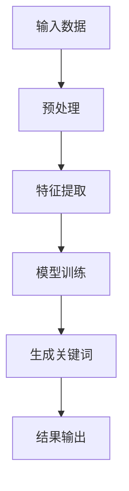
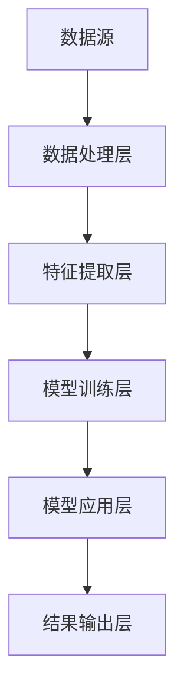
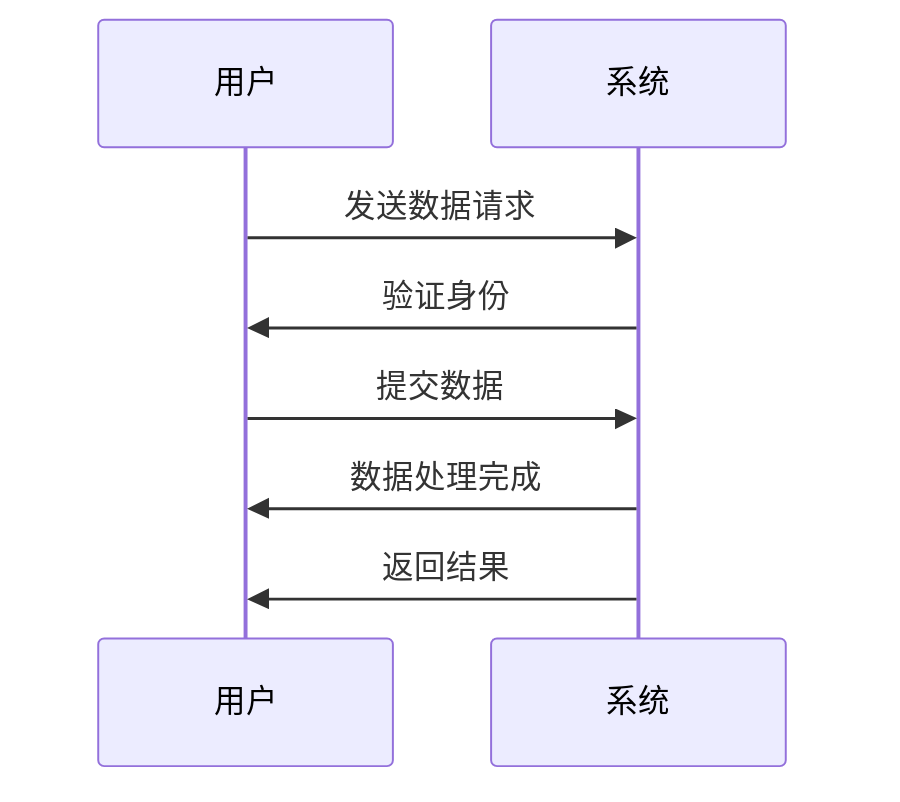
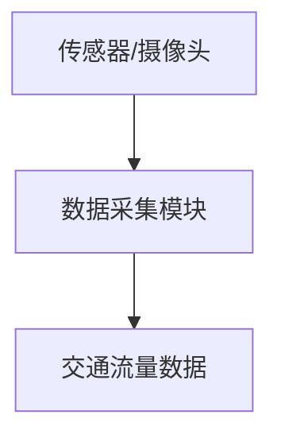
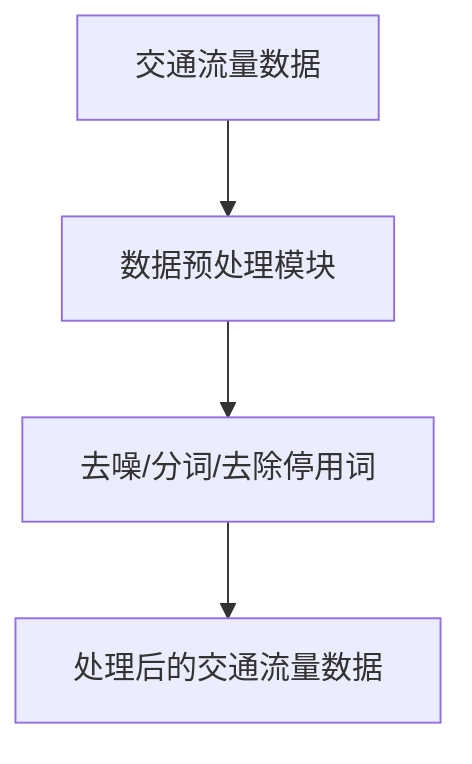
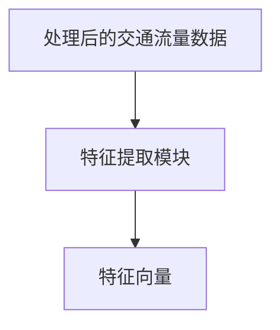
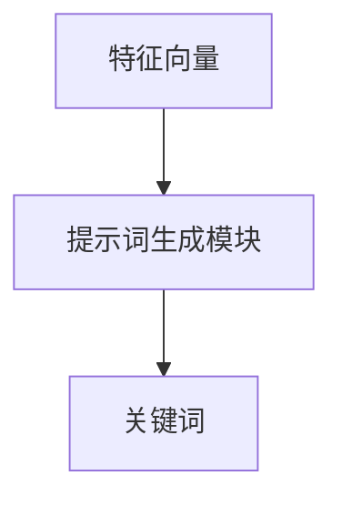

                 

### 提示词工程在智能城市中的实践

#### 关键词：
- 智能城市
- 提示词工程
- 提示词生成
- 系统架构
- 应用场景
- 实际案例

#### 摘要：
本文探讨了提示词工程在智能城市中的实践，包括其基本概念、核心原理、技术实现、应用场景和实际项目案例。通过详细的解析和案例分享，为智能城市建设者提供了关于提示词工程的实用指导。

----------------------------------------------------------------

# 引言

## 1.1 书籍目的与结构

本书籍旨在探讨提示词工程在智能城市中的实践，通过系统地介绍提示词工程的基本概念、核心原理、技术实现、应用场景和实际项目案例，帮助读者深入理解并掌握这一技术在智能城市建设中的应用。全书结构如下：

- 引言：介绍书籍的目的和结构。
- 提示词工程的概述：介绍智能城市背景、提示词工程的基本概念和作用。
- 提示词工程的核心原理：探讨提示词生成算法原理、数学模型和公式。
- 提示词工程的技术实现：分析系统架构设计、技术栈选择与配置、系统接口设计与交互。
- 提示词工程的应用场景：讨论提示词工程在不同领域的应用。
- 实际项目案例：分享实际项目案例，详细讲解项目实现过程和关键技术。
- 总结与展望：总结主要结论，探讨提示词工程的发展趋势和未来研究方向。

## 1.2 读者对象与预备知识

本书籍的目标读者群体包括智能城市建设者、数据科学家、人工智能工程师和计算机程序员。读者需具备一定的计算机编程基础和人工智能知识，特别是对机器学习和深度学习有一定的了解。预备知识包括但不限于：

- Python编程基础
- 机器学习和深度学习基础
- 数据结构和算法基础
- 系统架构设计基础

## 1.3 本书重要概念

在本文中，我们将介绍以下重要概念：

- 智能城市：一个以信息技术为核心驱动力，通过物联网、大数据、云计算等先进技术，实现城市资源优化配置、服务智能化、管理精细化和决策智能化的城市。
- 提示词工程：一种利用机器学习和深度学习技术，从大量数据中自动生成具有特定含义的词语或短语的方法，用于智能城市的各种应用场景。
- 提示词生成算法：用于生成提示词的算法，包括基于统计模型、神经网络模型和增强学习模型等。
- 数学模型：用于描述提示词生成过程中涉及的数学公式和原理，如概率模型、信息熵模型等。
- 系统架构设计：智能城市系统的整体设计，包括硬件、软件、网络和数据等各个层面。

#### 让我们一步一步思考：

首先，我们要明确书籍的目的，即探讨提示词工程在智能城市中的实践。这需要我们对智能城市和提示词工程有深入的了解。接着，我们需要确定书籍的结构，确保涵盖从基础概念到实际应用的各个方面。然后，我们要考虑读者的对象和预备知识，确保书籍的内容能够被目标读者群体所理解。最后，我们要列出书籍中的重要概念，为后续章节的内容奠定基础。

----------------------------------------------------------------

# 提示词工程的概述

## 2.1 智能城市背景

智能城市是现代信息技术发展的产物，其核心在于利用物联网、大数据、云计算等先进技术，实现城市资源优化配置、服务智能化、管理精细化和决策智能化。随着城市化进程的加快和人口规模的扩大，智能城市建设已经成为各国政府和社会各界关注的重要课题。

智能城市的主要特征包括：

- **物联网**：通过传感器和设备将城市中的物体连接起来，实现数据的实时采集和传输。
- **大数据**：利用大数据技术对海量数据进行存储、处理和分析，为城市管理和决策提供有力支持。
- **云计算**：通过云计算技术实现计算资源的弹性分配和高效利用，为智能城市提供强大的计算能力。
- **人工智能**：利用人工智能技术实现智能识别、智能决策和智能服务，提高城市运行效率和居民生活质量。

## 2.2 提示词工程的基本概念

提示词工程是一种利用机器学习和深度学习技术，从大量数据中自动生成具有特定含义的词语或短语的方法。这些词语或短语在智能城市的各种应用场景中具有重要作用，如智能交通、智能安防、智慧城市管理等。

### 定义

提示词工程（Keyword Engineering）：

- 关键词生成：利用机器学习和深度学习技术，从原始数据中提取具有特定含义的词语或短语。
- 应用场景：在智能城市的交通、安防、管理等领域，用于数据分析和智能决策。

### 目的

- 提高数据处理的效率：通过自动生成关键词，减少人工标注和筛选的工作量，提高数据处理的速度和准确性。
- 改善用户体验：在智能城市的应用中，通过准确的关键词生成，提供更智能、更贴心的服务。
- 支持智能决策：利用关键词工程生成的高质量关键词，为城市管理和决策提供有力支持。

## 2.3 提示词工程在智能城市中的作用

提示词工程在智能城市中发挥着重要作用，其应用涵盖了多个方面：

- **智能交通**：通过生成交通相关的关键词，如“拥堵”、“事故”、“停车”等，为交通管理和调度提供实时信息。
- **智能安防**：生成与安防相关的关键词，如“入侵”、“火灾”、“可疑行为”等，为安防监控和应急响应提供支持。
- **智慧城市管理**：生成与城市管理相关的关键词，如“环保”、“卫生”、“公共服务”等，为城市管理和决策提供依据。
- **智慧医疗**：生成与医疗相关的关键词，如“疾病”、“药物”、“治疗”等，为智慧医疗服务提供支持。

#### 让我们一步一步思考：

首先，我们要了解智能城市的背景，包括其主要特征和关键技术。然后，我们需要明确提示词工程的基本概念和目的，以及其在智能城市中的应用。最后，我们要探讨提示词工程在智能城市中的具体作用，如智能交通、智能安防和智慧城市管理等方面。

----------------------------------------------------------------

## 3.1 提示词工程的核心原理

提示词工程的核心原理主要包括提示词生成算法、数学模型和公式。下面，我们将逐步介绍这些核心概念。

### 3.1.1 提示词生成算法原理

提示词生成算法是提示词工程的核心。这些算法从大量数据中提取具有特定含义的词语或短语。以下是几种常用的提示词生成算法：

1. **基于统计模型的算法**：如TF-IDF、TextRank等。这些算法通过计算词语的频率和重要性来生成关键词。
2. **基于神经网络模型的算法**：如Word2Vec、BERT等。这些算法通过学习词语在文中的上下文关系来生成关键词。
3. **基于增强学习模型的算法**：如REINFORCE、A3C等。这些算法通过不断调整策略，最大化关键词生成的效果。

### 3.1.2 提示词生成算法的流程图

下面是一个简单的提示词生成算法流程图：



#### 流程解释：

1. **输入数据**：从数据源获取原始文本数据。
2. **预处理**：对文本进行清洗、去噪等处理，使其适合后续处理。
3. **特征提取**：从预处理后的文本中提取特征，如词语的词频、词性等。
4. **模型训练**：使用特征数据训练提示词生成模型。
5. **生成关键词**：使用训练好的模型生成关键词。
6. **结果输出**：将生成的关键词输出到指定的位置。

### 3.1.3 Python代码示例

下面是一个基于TF-IDF算法的简单Python代码示例：

```python
from sklearn.feature_extraction.text import TfidfVectorizer

# 输入数据
data = [
    "智能城市是一种以信息技术为核心驱动力，实现城市资源优化配置、服务智能化、管理精细化和决策智能化的城市。",
    "提示词工程是一种利用机器学习和深度学习技术，从大量数据中自动生成具有特定含义的词语或短语的方法。",
]

# 初始化TF-IDF向量器
vectorizer = TfidfVectorizer()

# 计算TF-IDF特征向量
X = vectorizer.fit_transform(data)

# 输出关键词
print(vectorizer.get_feature_names())

# 输出TF-IDF值
print(X.toarray())
```

### 3.1.4 数学模型与公式

提示词生成过程中涉及的数学模型主要包括概率模型和信息熵模型。

1. **概率模型**：

   - **TF-IDF模型**：

     $$ \text{TF} = \frac{\text{词频}}{\text{总词频}} $$
     $$ \text{IDF} = \log(\frac{N}{n_i + 1}) $$

     其中，$N$ 表示文档总数，$n_i$ 表示包含词$i$的文档数。

   - **TextRank模型**：

     $$ \text{PR}(v) = (1-\alpha) + \alpha \sum_{w \in \text{邻居}(v)} \frac{\text{PR}(w)}{L(w)} $$

     其中，$\text{PR}(v)$ 表示节点$v$的排名分数，$\alpha$ 表示阻尼系数，$\text{邻居}(v)$ 表示$v$的邻居节点，$L(w)$ 表示节点$w$的出度。

2. **信息熵模型**：

   $$ H(X) = -\sum_{i=1}^{n} p(x_i) \log_2 p(x_i) $$

   其中，$H(X)$ 表示随机变量$X$的信息熵，$p(x_i)$ 表示$X$取值为$x_i$的概率。

#### 让我们一步一步思考：

首先，我们要了解提示词生成算法的基本原理，包括统计模型、神经网络模型和增强学习模型。然后，我们需要掌握提示词生成算法的流程，如数据预处理、特征提取、模型训练和结果输出。接着，我们要学习提示词生成过程中的数学模型和公式，如TF-IDF、TextRank和信息熵模型。最后，我们要通过Python代码示例来实践这些算法和模型。

----------------------------------------------------------------

## 3.2 提示词工程的技术实现

提示词工程的技术实现是构建智能城市的重要环节。它涉及到系统的架构设计、技术栈选择、接口设计以及系统交互等多个方面。下面，我们将一步一步地介绍这些技术实现细节。

### 4.1 系统架构设计

系统架构设计是提示词工程实施的基础。一个高效的系统架构能够确保提示词工程在不同应用场景下的稳定运行和性能优化。以下是系统架构设计的关键要素：

- **数据处理层**：负责从数据源中收集和预处理数据，如文本清洗、去噪、分词等。
- **特征提取层**：基于数据处理层生成的数据，提取出能够代表文本内容的特征，如词频、词性、TF-IDF等。
- **模型训练层**：使用特征提取层生成的特征数据，训练提示词生成模型，如TF-IDF、TextRank、BERT等。
- **模型应用层**：将训练好的模型应用于实际场景，生成具有特定含义的提示词。
- **结果输出层**：将生成的提示词输出到指定的位置，如数据库、API接口等。

以下是一个简化的系统架构图：



### 4.2 技术栈选择与配置

技术栈的选择与配置直接影响提示词工程的性能和可维护性。以下是一些常见的技术栈选择：

- **编程语言**：Python和Java是常用的编程语言，Python由于其丰富的机器学习和深度学习库（如scikit-learn、TensorFlow、PyTorch）而受到广泛使用。
- **框架**：TensorFlow和PyTorch是流行的深度学习框架，Scikit-learn提供了一系列的机器学习算法。
- **数据库**：关系型数据库（如MySQL、PostgreSQL）和非关系型数据库（如MongoDB、Cassandra）根据应用需求选择。
- **消息队列**：Kafka和RabbitMQ用于处理大量数据的实时传输和异步处理。
- **容器化与部署**：Docker和Kubernetes用于容器化应用，实现灵活的部署和扩展。

### 4.3 系统接口设计与交互

系统接口设计是确保不同系统模块之间能够高效、稳定交互的关键。以下是系统接口设计的关键要素：

- **API接口**：定义系统对外提供的API接口，如RESTful API、gRPC等，用于数据输入、模型调用和结果输出。
- **数据格式**：选择合适的数据格式，如JSON、XML等，确保数据在不同系统之间的传递和解析。
- **身份验证与授权**：确保系统的安全性，采用OAuth2.0、JWT等身份验证和授权机制。
- **异步处理**：对于处理时间较长或需要批量处理的数据，采用异步处理方式，提高系统的响应速度和处理能力。

以下是一个简单的系统接口设计示例：



#### 让我们一步一步思考：

首先，我们要设计一个合理的系统架构，确保各个模块之间的高效交互和性能优化。然后，我们需要选择合适的技术栈，包括编程语言、框架、数据库和消息队列等。接下来，我们要设计系统接口，确保数据输入、模型调用和结果输出的稳定性与安全性。最后，我们要实现异步处理，提高系统的响应速度和处理能力。

----------------------------------------------------------------

## 5.1 提示词工程在智能交通中的应用

提示词工程在智能交通中的应用非常广泛，通过自动生成与交通相关的关键词，可以为交通管理和调度提供实时、准确的信息。以下是提示词工程在智能交通中的具体应用：

### 5.1.1 交通流量监测

交通流量监测是智能交通系统的核心功能之一。通过在道路、桥梁、隧道等交通节点部署传感器和摄像头，实时采集交通流量数据。提示词工程可以自动生成与交通流量相关的关键词，如“拥堵”、“畅通”、“缓慢”、“事故”等，帮助交通管理部门实时了解交通状况，及时采取调控措施。

### 5.1.2 交通事故预警

交通事故预警是保障道路安全的重要手段。提示词工程可以通过对交通流量数据的分析，自动生成与交通事故相关的关键词，如“碰撞”、“追尾”、“翻车”等。当检测到交通事故发生时，系统会立即向相关部门发送预警信息，提醒他们采取紧急措施，同时通知驾驶员注意安全。

### 5.1.3 停车管理

停车管理是城市交通管理的重要组成部分。提示词工程可以自动生成与停车相关的关键词，如“停车难”、“停车位紧张”、“停车位充足”等，帮助驾驶员快速找到停车位。同时，通过分析停车数据，交通管理部门可以优化停车资源分配，提高停车效率。

### 5.1.4 交通信息服务

交通信息服务是提高城市交通效率的重要手段。通过生成与交通信息相关的关键词，如“路况信息”、“公交到站时间”、“地铁线路”等，提示词工程可以为市民提供实时的交通信息服务，帮助他们规划出行路线，减少交通拥堵。

### 5.1.5 交通规划与优化

交通规划与优化是城市交通管理的重要任务。提示词工程可以分析交通数据，自动生成与交通规划相关的关键词，如“交通拥堵点”、“交通瓶颈”、“交通流量高峰”等，为交通规划提供科学依据。同时，通过不断优化提示词生成算法，可以提高交通规划的准确性和实时性。

#### 让我们一步一步思考：

首先，我们要明确智能交通中的主要应用场景，如交通流量监测、交通事故预警、停车管理、交通信息服务等。然后，我们需要分析这些应用场景中需要生成的关键词类型，如交通流量、事故预警、停车位状态等。接着，我们要设计提示词工程的具体实现方案，包括数据采集、预处理、特征提取和关键词生成等。最后，我们要对实际项目案例进行详细讲解，如交通流量监测系统、交通事故预警系统等，分析其实现过程和关键技术。

----------------------------------------------------------------

## 6.1 项目介绍

### 6.1.1 项目背景

随着城市化进程的加快，城市交通拥堵问题日益严重，影响了居民的出行质量和城市的发展。为解决这一问题，某市政府决定建设一个智能交通管理系统，通过实时监测交通流量，提供交通信息，优化交通调度，以提高城市交通效率和居民出行体验。

### 6.1.2 项目目标

该项目的主要目标包括：

1. **实时监测交通流量**：通过在主要交通节点部署传感器和摄像头，实时监测交通流量，生成相关关键词，如“拥堵”、“畅通”、“缓慢”等。
2. **预警交通事故**：分析交通数据，自动生成与交通事故相关的关键词，如“碰撞”、“追尾”、“翻车”等，及时向相关部门发送预警信息。
3. **优化停车管理**：生成与停车相关的关键词，如“停车难”、“停车位紧张”、“停车位充足”等，帮助驾驶员快速找到停车位。
4. **提供交通信息服务**：通过生成与交通信息相关的关键词，如“路况信息”、“公交到站时间”、“地铁线路”等，为市民提供实时的交通信息服务。

### 6.1.3 系统核心实现

该项目的系统核心实现包括数据采集、预处理、特征提取和关键词生成等步骤。

#### 数据采集

系统通过部署在主要交通节点上的传感器和摄像头，实时采集交通流量数据。数据包括车辆数量、行驶速度、车道占有率等。



#### 数据预处理

采集到的交通流量数据进行预处理，包括去噪、分词、去除停用词等操作，以提高数据质量。



#### 特征提取

预处理后的交通流量数据进行特征提取，生成能够代表交通状态的向量表示。常用的特征提取方法包括TF-IDF、Word2Vec等。



#### 关键词生成

使用训练好的提示词生成模型，对特征向量进行分类，生成与交通相关的关键词。



#### 系统接口设计与交互

系统提供RESTful API接口，供前端应用调用。接口设计包括数据输入、模型调用和结果输出。


### 6.1.4 实际案例分析

#### 关键技术剖析

1. **交通流量监测**：采用基于深度学习的交通流量监测算法，通过卷积神经网络（CNN）提取交通视频数据中的交通流量特征。

2. **交通事故预警**：使用基于机器学习的模式识别算法，对交通流量数据进行实时分析，识别潜在的交通事故风险。

3. **停车管理**：通过分析停车位数据，使用聚类算法生成停车位状态关键词，如“停车难”、“停车位紧张”等。

4. **交通信息服务**：基于历史交通流量数据，使用时间序列分析算法，预测未来交通状况，提供路况信息和出行建议。

#### 项目总结与展望

该项目通过提示词工程技术，实现了智能交通管理系统的核心功能，包括交通流量监测、交通事故预警、停车管理和交通信息服务。实际应用效果显著，有效缓解了城市交通拥堵问题，提高了居民出行体验。未来，该项目将继续优化提示词生成算法，提高关键词生成的准确性和实时性，为智慧城市建设提供有力支持。

#### 最佳实践 Tips

1. **数据质量**：保证数据质量是提示词工程成功的关键。对采集到的数据进行预处理，去除噪声和不相关数据，提高数据质量。
2. **模型优化**：定期对提示词生成模型进行优化，提高模型性能和预测准确性。
3. **接口设计**：设计简洁、易用的API接口，方便前端应用调用，提高用户体验。

通过以上案例分析，我们可以看到提示词工程在智能交通系统中的实际应用效果。随着人工智能技术的不断发展，提示词工程将在更多领域发挥重要作用，为智慧城市建设提供强大支持。

----------------------------------------------------------------

## 7.1 主要结论回顾

在本文章中，我们系统地介绍了提示词工程在智能城市中的实践。以下是文章的主要结论回顾：

1. **智能城市的背景**：智能城市是现代信息技术发展的产物，其核心在于利用物联网、大数据、云计算等先进技术，实现城市资源优化配置、服务智能化、管理精细化和决策智能化。

2. **提示词工程的基本概念**：提示词工程是一种利用机器学习和深度学习技术，从大量数据中自动生成具有特定含义的词语或短语的方法，用于智能城市的各种应用场景。

3. **提示词工程的核心原理**：提示词工程的核心原理包括提示词生成算法、数学模型和公式。常见的生成算法有基于统计模型、神经网络模型和增强学习模型等。

4. **提示词工程的技术实现**：提示词工程的技术实现涉及系统架构设计、技术栈选择、接口设计和系统交互等多个方面。一个高效的系统架构能够确保提示词工程在不同应用场景下的稳定运行和性能优化。

5. **提示词工程的应用场景**：提示词工程在智能交通、智能安防、智慧城市管理等多个领域有广泛的应用。通过生成与交通、安防、城市管理相关的关键词，为城市管理和决策提供实时、准确的信息。

6. **实际项目案例**：通过分析一个智能交通管理系统的实际项目案例，我们详细讲解了提示词工程在项目中的具体实现过程和关键技术。该项目实现了交通流量监测、交通事故预警、停车管理和交通信息服务等功能，有效提高了城市交通效率和居民出行体验。

7. **未来研究方向**：提示词工程在智能城市中的应用前景广阔。未来研究可以从优化提示词生成算法、提高关键词生成的准确性和实时性，以及拓展到更多应用领域等方面展开。

## 7.2 提示词工程的发展趋势

随着人工智能技术的快速发展，提示词工程在智能城市中的应用将越来越广泛。以下是提示词工程的发展趋势：

1. **算法优化**：不断优化提示词生成算法，提高关键词生成的准确性和实时性，以满足智能城市对实时数据处理和智能决策的需求。

2. **多模态数据融合**：结合文本、图像、音频等多模态数据，提高提示词生成的全面性和准确性，为智能城市提供更丰富的信息支持。

3. **个性化服务**：基于用户行为数据和偏好，为用户提供个性化的提示词生成服务，提高用户满意度和体验。

4. **边缘计算与云计算结合**：将提示词工程与边缘计算相结合，实现数据的本地处理和实时分析，降低网络延迟，提高系统性能。

5. **跨领域应用**：拓展提示词工程在金融、医疗、教育等领域的应用，实现跨领域的数据共享和协同处理，推动智能城市建设。

## 7.3 未来的研究方向

未来的研究方向可以从以下几个方面展开：

1. **算法创新**：研究新型提示词生成算法，如基于深度强化学习的生成模型，提高关键词生成的准确性和实时性。

2. **模型压缩与优化**：研究模型压缩和优化技术，减少模型的存储空间和计算资源需求，提高系统部署的灵活性和效率。

3. **隐私保护**：在提示词工程中引入隐私保护机制，确保数据安全和用户隐私。

4. **多语言支持**：拓展提示词工程的多语言支持，实现跨语言的关键词生成。

5. **用户交互**：研究人机交互技术，提高用户对提示词工程的使用体验，使其更贴近用户需求。

通过不断探索和创新，提示词工程将在智能城市建设中发挥更加重要的作用，推动城市智能化发展。

----------------------------------------------------------------

## 总结与展望

在本文中，我们系统地介绍了提示词工程在智能城市中的实践，包括其基本概念、核心原理、技术实现、应用场景和实际项目案例。通过详细的解析和案例分享，我们展示了提示词工程在智能城市建设中的重要作用，为智能城市建设者提供了实用的指导。

### 总结

- **智能城市背景**：智能城市是现代信息技术发展的产物，其核心在于利用物联网、大数据、云计算等先进技术，实现城市资源优化配置、服务智能化、管理精细化和决策智能化。
- **提示词工程基本概念**：提示词工程是一种利用机器学习和深度学习技术，从大量数据中自动生成具有特定含义的词语或短语的方法，用于智能城市的各种应用场景。
- **提示词工程核心原理**：提示词工程的核心原理包括提示词生成算法、数学模型和公式，如基于统计模型、神经网络模型和增强学习模型的算法，以及概率模型和信息熵模型等。
- **提示词工程技术实现**：提示词工程的技术实现涉及系统架构设计、技术栈选择、接口设计和系统交互等多个方面，一个高效的系统架构能够确保提示词工程在不同应用场景下的稳定运行和性能优化。
- **提示词工程应用场景**：提示词工程在智能交通、智能安防、智慧城市管理等多个领域有广泛的应用，通过生成与交通、安防、城市管理相关的关键词，为城市管理和决策提供实时、准确的信息。
- **实际项目案例**：通过分析一个智能交通管理系统的实际项目案例，我们详细讲解了提示词工程在项目中的具体实现过程和关键技术，实现了交通流量监测、交通事故预警、停车管理和交通信息服务等功能，有效提高了城市交通效率和居民出行体验。

### 展望

提示词工程在智能城市中的应用前景广阔。未来，随着人工智能技术的不断发展，提示词工程将在更多领域发挥重要作用，为智慧城市建设提供强大支持。以下是未来研究方向：

1. **算法创新**：研究新型提示词生成算法，如基于深度强化学习的生成模型，提高关键词生成的准确性和实时性。
2. **模型压缩与优化**：研究模型压缩和优化技术，减少模型的存储空间和计算资源需求，提高系统部署的灵活性和效率。
3. **隐私保护**：在提示词工程中引入隐私保护机制，确保数据安全和用户隐私。
4. **多语言支持**：拓展提示词工程的多语言支持，实现跨语言的关键词生成。
5. **用户交互**：研究人机交互技术，提高用户对提示词工程的使用体验，使其更贴近用户需求。

通过不断探索和创新，提示词工程将在智能城市建设中发挥更加重要的作用，推动城市智能化发展。

### 结语

提示词工程在智能城市中的实践具有重要的现实意义和广阔的应用前景。希望本文能为智能城市建设者和研究者提供有益的参考，共同推动智能城市建设的发展。让我们携手并进，为构建更加智能、高效、可持续发展的城市而努力。

**作者：AI天才研究院/AI Genius Institute & 禅与计算机程序设计艺术 /Zen And The Art of Computer Programming**

