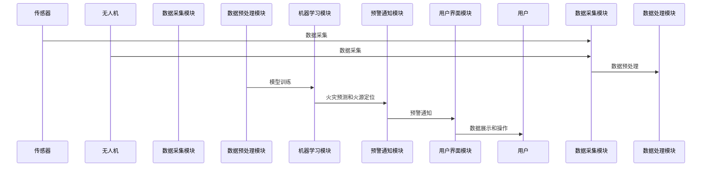

                 


## 1. 背景介绍

### 1.1 森林火灾的现状与挑战

森林火灾是一种全球性的环境问题，其严重性不容忽视。近年来，全球各地森林火灾频发，造成了巨大的生态破坏和经济损失。据统计，每年因森林火灾导致的碳排放量约占全球总碳排放量的15%左右。此外，火灾还导致了大量生物多样性的丧失，威胁到数以百万计的动植物物种的生存。

在全球范围内，森林火灾的频率和规模呈现上升的趋势。这主要是由于气候变暖、人为破坏、闪电等原因引起的。气候变暖导致气温升高，干旱天气增多，从而增加了火灾发生的可能性。而人为因素，如过度放牧、乱砍滥伐和不当的农业活动，则加剧了火灾的风险。

目前，森林火灾的预防主要依赖于传统的手段，如建立防火带、定期进行森林清理、使用灭火器材等。然而，这些方法在应对复杂多变的火灾形势时显得力不从心。例如，防火带和森林清理虽然可以降低火灾的风险，但无法完全消除火灾的发生。而灭火器材虽然可以在火灾发生后进行扑救，但其效率和使用范围也受到限制。

### 1.2 智能森林火灾预防的概念与意义

智能森林火灾预防是利用先进的人工智能技术和大数据分析，对森林火灾进行预测、预警和有效扑救的一套综合系统。它通过实时监测森林环境数据，结合历史火灾数据，利用机器学习算法进行分析和预测，从而提前发现潜在的火灾隐患，并采取相应的预防措施。

智能森林火灾预防的意义主要体现在以下几个方面：

1. **提前预警**：通过智能系统对森林环境的实时监测和数据分析，可以提前发现火灾的隐患，从而及时采取预防措施，减少火灾发生的概率。

2. **提高扑救效率**：智能系统可以提供火源定位、火势预测和火灾趋势分析等数据，为消防人员提供准确的扑救方向和策略，提高扑救效率，降低火灾造成的损失。

3. **降低成本**：智能系统可以减少传统防火措施所需的资源和人力投入，降低火灾预防的成本。

4. **保护生态环境**：智能森林火灾预防可以最大限度地减少火灾对生态环境的破坏，保护生物多样性。

5. **提升森林管理效率**：智能系统可以实时监测森林环境，为森林管理者提供决策支持，提高森林管理效率。

### 1.3 提示词工程在智能森林火灾预防中的角色

提示词工程是人工智能领域中的一种技术，通过构建和优化提示词（关键词）来提高机器学习模型的性能。在智能森林火灾预防中，提示词工程发挥着至关重要的作用。

首先，提示词工程可以帮助智能系统识别和分析森林环境中的关键特征，如温度、湿度、风速等。这些特征是判断火灾风险的重要因素。

其次，提示词工程可以提高机器学习模型的预测准确性。通过优化提示词，模型可以更好地捕捉到森林火灾发生的规律和模式，从而提高预测的准确性。

最后，提示词工程可以帮助智能系统进行实时监测和预警。通过不断更新和优化提示词，系统可以更好地适应环境变化，提高预警的及时性和准确性。

综上所述，智能森林火灾预防需要多方面的技术支持，而提示词工程作为人工智能技术的重要组成部分，其在其中的作用不容忽视。

## 2. 核心概念

### 2.1 提示词工程的定义与特点

#### 2.1.1 提示词工程的定义

提示词工程（Keyword Engineering）是指通过构建和优化提示词（关键词）来提高机器学习模型性能的一门技术。在机器学习中，提示词是模型理解和学习数据的重要线索，它们可以帮助模型更好地识别和分类数据。

提示词工程的主要目标是识别出对模型性能有显著影响的关键特征，并通过优化这些特征，提高模型的准确性、效率和泛化能力。

#### 2.1.2 提示词工程的特点

1. **选择性**：提示词工程强调选择对任务目标有显著影响的关键特征，而不是盲目地包含所有特征。

2. **可解释性**：提示词工程通过构建和优化提示词，提高了模型的可解释性，使得模型的决策过程更加透明和易于理解。

3. **动态性**：提示词工程是一个动态的过程，需要根据数据的变化和环境的变化，不断更新和优化提示词。

4. **自动化**：提示词工程使用自动化工具和算法，可以高效地识别和优化提示词，减少人工干预。

#### 2.1.3 提示词工程与传统人工智能的区别

传统的人工智能方法，如基于规则的方法和传统的机器学习方法，通常需要大量的人工干预来定义特征和规则。而提示词工程则通过自动化和优化提示词，减少了人工干预，提高了模型的效率和准确性。

此外，提示词工程还强调模型的可解释性，使得模型的应用更加广泛和可靠。传统方法往往难以解释模型的决策过程，而提示词工程则通过提示词的构建和优化，使得模型决策过程更加透明和易于理解。

### 2.2 提示词工程的基本原理

#### 2.2.1 提示词工程的核心组件

提示词工程的核心组件包括：

1. **特征选择**：识别和选择对任务目标有显著影响的关键特征。
2. **特征提取**：从原始数据中提取和转换特征，使其适合机器学习模型的输入。
3. **模型训练**：使用机器学习算法对模型进行训练，使其能够识别和分类数据。
4. **模型评估**：评估模型的性能，包括准确性、效率和泛化能力。
5. **提示词优化**：根据模型评估结果，优化提示词，提高模型的性能。

#### 2.2.2 提示词工程的流程

提示词工程的流程主要包括以下几个步骤：

1. **数据收集**：收集与任务相关的数据，包括原始数据、历史数据和外部数据。
2. **数据预处理**：对收集到的数据进行处理，包括数据清洗、归一化和特征提取。
3. **特征选择**：使用自动化工具和算法，选择对任务目标有显著影响的关键特征。
4. **模型训练**：使用机器学习算法对模型进行训练，使其能够识别和分类数据。
5. **模型评估**：评估模型的性能，包括准确性、效率和泛化能力。
6. **提示词优化**：根据模型评估结果，优化提示词，提高模型的性能。
7. **迭代优化**：根据提示词优化结果，迭代优化模型和提示词，直至达到满意的性能。

#### 2.2.3 提示词工程的效果评估

提示词工程的效果评估主要包括以下几个方面：

1. **准确性**：评估模型对数据的识别和分类能力。
2. **效率**：评估模型在处理数据时的速度和资源消耗。
3. **泛化能力**：评估模型在不同数据集上的表现，以衡量其泛化能力。
4. **可解释性**：评估模型的决策过程是否透明和易于理解。

通过上述评估指标，可以全面了解提示词工程的效果，并进一步优化模型和提示词，提高智能系统的性能。

### 2.3 智能森林火灾预防中的提示词工程

#### 2.3.1 提示词工程在火灾预测中的应用

在智能森林火灾预防中，提示词工程可以通过以下方式应用于火灾预测：

1. **特征选择**：从森林环境数据中选择对火灾风险有显著影响的关键特征，如温度、湿度、风速等。
2. **特征提取**：对选择的特征进行提取和转换，使其适合机器学习模型的输入。
3. **模型训练**：使用机器学习算法对模型进行训练，使其能够预测火灾的发生概率。
4. **模型评估**：评估模型的预测准确性，并根据评估结果优化模型和提示词。
5. **实时监测**：通过实时监测森林环境数据，动态更新提示词，提高火灾预测的准确性。

#### 2.3.2 提示词工程在火源定位中的应用

在智能森林火灾预防中，提示词工程可以通过以下方式应用于火源定位：

1. **特征选择**：从火灾现场数据中选择对火源定位有显著影响的关键特征，如烟雾浓度、温度分布、风速等。
2. **特征提取**：对选择的特征进行提取和转换，使其适合机器学习模型的输入。
3. **模型训练**：使用机器学习算法对模型进行训练，使其能够定位火灾的发生位置。
4. **模型评估**：评估模型的定位准确性，并根据评估结果优化模型和提示词。
5. **实时监测**：通过实时监测火灾现场数据，动态更新提示词，提高火源定位的准确性。

#### 2.3.3 提示词工程在火灾趋势分析中的应用

在智能森林火灾预防中，提示词工程可以通过以下方式应用于火灾趋势分析：

1. **特征选择**：从火灾历史数据和森林环境数据中选择对火灾趋势有显著影响的关键特征，如温度变化、风速变化、森林湿度等。
2. **特征提取**：对选择的特征进行提取和转换，使其适合机器学习模型的输入。
3. **模型训练**：使用机器学习算法对模型进行训练，使其能够预测火灾的发展趋势。
4. **模型评估**：评估模型的预测准确性，并根据评估结果优化模型和提示词。
5. **实时监测**：通过实时监测森林环境数据，动态更新提示词，提高火灾趋势预测的准确性。

通过以上方式，提示词工程可以有效地应用于智能森林火灾预防的各个领域，提高火灾预测、火源定位和火灾趋势分析的能力，从而更好地保护森林资源，减少火灾损失。

## 3. 算法原理

### 3.1 火灾预测算法

火灾预测是智能森林火灾预防中的核心算法，通过分析森林环境数据和火灾历史数据，预测未来一段时间内火灾发生的概率。以下是火灾预测算法的详细原理和步骤：

#### 3.1.1 算法概述

火灾预测算法主要包括以下几个步骤：

1. **数据收集**：收集森林环境数据，如温度、湿度、风速、森林湿度等，以及火灾历史数据，包括火灾发生的日期、地点、火灾强度等。
2. **数据预处理**：对收集到的数据进行清洗、归一化和特征提取，使其适合机器学习模型的输入。
3. **特征选择**：使用提示词工程选择对火灾风险有显著影响的关键特征，如温度、湿度、风速等。
4. **模型训练**：使用机器学习算法对模型进行训练，使其能够预测火灾的发生概率。
5. **模型评估**：评估模型的预测准确性，并根据评估结果优化模型和提示词。
6. **实时监测**：通过实时监测森林环境数据，动态更新提示词，提高火灾预测的准确性。

#### 3.1.2 算法的分类

根据算法的原理和实现方式，火灾预测算法可以分为以下几类：

1. **基于统计学的算法**：如线性回归、逻辑回归等，通过分析历史数据，建立火灾发生的概率模型。
2. **基于机器学习的算法**：如决策树、随机森林、支持向量机等，通过训练模型，学习火灾发生的规律和模式。
3. **基于深度学习的算法**：如卷积神经网络、循环神经网络等，通过学习大量数据，提取火灾发生的深层次特征。

#### 3.1.3 算法的原理与应用

1. **基于统计学的算法**：
   - **线性回归**：通过分析火灾发生的前因后果，建立线性关系模型，预测火灾发生的概率。
   - **逻辑回归**：将线性回归模型转化为概率模型，直接预测火灾发生的概率。

2. **基于机器学习的算法**：
   - **决策树**：通过递归划分特征空间，构建决策树模型，预测火灾发生的概率。
   - **随机森林**：基于决策树的集成学习方法，提高预测的准确性和鲁棒性。
   - **支持向量机**：通过寻找最优超平面，分类火灾数据，预测火灾发生的概率。

3. **基于深度学习的算法**：
   - **卷积神经网络（CNN）**：通过卷积操作提取图像特征，识别火灾发生的区域。
   - **循环神经网络（RNN）**：通过时间序列分析，捕捉火灾发生的时序特征。

在智能森林火灾预防中，不同类型的算法可以相互结合，形成综合的火灾预测系统。例如，可以使用基于统计学的算法进行初步的火灾预测，然后使用基于机器学习的算法进行细粒度的预测，最后使用基于深度学习的算法进行火源定位和趋势分析。

#### 3.1.4 应用示例

以下是一个简单的线性回归火灾预测模型的应用示例：

```python
# 导入线性回归模型
from sklearn.linear_model import LinearRegression

# 准备数据
X = [[温度, 湿度, 风速], ...]  # 特征矩阵
y = [火灾发生概率, ...]  # 标签向量

# 创建线性回归模型
model = LinearRegression()

# 训练模型
model.fit(X, y)

# 预测火灾发生概率
predicted_probability = model.predict([[新温度, 新湿度, 新风速]])

print("火灾发生概率：", predicted_probability)
```

通过以上示例，可以看到火灾预测算法的基本实现过程，包括数据准备、模型训练和预测。在实际应用中，还需要结合具体场景和数据进行模型优化和调整。

### 3.2 火源定位算法

火源定位是智能森林火灾预防中的关键环节，通过分析火灾现场的图像数据，确定火灾发生的具体位置。以下是火源定位算法的详细原理和步骤：

#### 3.2.1 算法概述

火源定位算法主要包括以下几个步骤：

1. **数据收集**：收集火灾现场的图像数据，包括热图像、可见光图像和多光谱图像等。
2. **图像预处理**：对收集到的图像数据进行处理，包括图像增强、去噪和图像分割等。
3. **特征提取**：从预处理后的图像中提取与火源相关的特征，如温度分布、颜色分布和纹理特征等。
4. **模型训练**：使用机器学习算法对模型进行训练，使其能够识别和定位火源。
5. **模型评估**：评估模型的定位准确性，并根据评估结果优化模型和特征提取方法。
6. **实时监测**：通过实时监测火灾现场图像，动态更新模型和特征提取方法，提高火源定位的准确性。

#### 3.2.2 算法的分类

根据算法的实现方式，火源定位算法可以分为以下几类：

1. **基于传统机器学习的算法**：如支持向量机（SVM）、决策树等，通过特征提取和分类器训练，实现火源定位。
2. **基于深度学习的算法**：如卷积神经网络（CNN）、循环神经网络（RNN）等，通过神经网络结构学习，实现火源定位。
3. **基于物理模型的算法**：如基于热传导方程和光传输方程的算法，通过物理原理实现火源定位。

#### 3.2.3 算法的原理与应用

1. **基于传统机器学习的算法**：
   - **支持向量机（SVM）**：通过寻找最优超平面，分类图像中的火源区域。
   - **决策树**：通过递归划分特征空间，构建决策树模型，识别火源区域。

2. **基于深度学习的算法**：
   - **卷积神经网络（CNN）**：通过卷积操作提取图像特征，识别火源区域。
   - **循环神经网络（RNN）**：通过时间序列分析，捕捉火源区域的变化。

3. **基于物理模型的算法**：
   - **热传导方程**：通过分析热传导过程，确定火源位置。
   - **光传输方程**：通过分析光传输过程，确定火源位置。

在实际应用中，不同类型的算法可以相互结合，形成综合的火源定位系统。例如，可以使用基于传统机器学习的算法进行初步定位，然后使用基于深度学习的算法进行细粒度定位，以提高定位的准确性和鲁棒性。

#### 3.2.4 应用示例

以下是一个简单的基于卷积神经网络的火源定位模型的应用示例：

```python
# 导入卷积神经网络库
import tensorflow as tf

# 定义卷积神经网络模型
model = tf.keras.Sequential([
  tf.keras.layers.Conv2D(32, (3, 3), activation='relu', input_shape=(64, 64, 3)),
  tf.keras.layers.MaxPooling2D((2, 2)),
  tf.keras.layers.Conv2D(64, (3, 3), activation='relu'),
  tf.keras.layers.MaxPooling2D((2, 2)),
  tf.keras.layers.Conv2D(64, (3, 3), activation='relu'),
  tf.keras.layers.Flatten(),
  tf.keras.layers.Dense(64, activation='relu'),
  tf.keras.layers.Dense(1, activation='sigmoid')
])

# 编译模型
model.compile(optimizer='adam', loss='binary_crossentropy', metrics=['accuracy'])

# 训练模型
model.fit(X_train, y_train, epochs=10, batch_size=32)

# 预测火源位置
predicted_location = model.predict(new_image)

print("火源位置：", predicted_location)
```

通过以上示例，可以看到火源定位算法的基本实现过程，包括模型定义、模型编译、模型训练和模型预测。在实际应用中，还需要结合具体场景和数据进行模型优化和调整。

### 3.3 火灾趋势分析算法

火灾趋势分析是智能森林火灾预防中的重要环节，通过分析火灾历史数据和森林环境数据，预测未来一段时间内火灾的发展趋势。以下是火灾趋势分析算法的详细原理和步骤：

#### 3.3.1 算法概述

火灾趋势分析算法主要包括以下几个步骤：

1. **数据收集**：收集火灾历史数据，如火灾发生的日期、地点、火灾强度等，以及森林环境数据，如温度、湿度、风速等。
2. **数据预处理**：对收集到的数据进行清洗、归一化和特征提取，使其适合机器学习模型的输入。
3. **特征选择**：使用提示词工程选择对火灾趋势有显著影响的关键特征，如温度变化、风速变化、森林湿度等。
4. **模型训练**：使用机器学习算法对模型进行训练，使其能够预测火灾的发展趋势。
5. **模型评估**：评估模型的预测准确性，并根据评估结果优化模型和提示词。
6. **实时监测**：通过实时监测森林环境数据，动态更新模型和提示词，提高火灾趋势预测的准确性。

#### 3.3.2 算法的分类

根据算法的实现方式，火灾趋势分析算法可以分为以下几类：

1. **基于统计学的算法**：如时间序列分析、回归分析等，通过分析历史数据，建立火灾趋势预测模型。
2. **基于机器学习的算法**：如决策树、随机森林、支持向量机等，通过训练模型，学习火灾趋势的规律和模式。
3. **基于深度学习的算法**：如卷积神经网络、循环神经网络等，通过学习大量数据，提取火灾趋势的深层次特征。

#### 3.3.3 算法的原理与应用

1. **基于统计学的算法**：
   - **时间序列分析**：通过分析火灾发生的时间序列数据，预测火灾的发展趋势。
   - **回归分析**：通过分析火灾历史数据，建立火灾趋势的回归模型，预测火灾的发展趋势。

2. **基于机器学习的算法**：
   - **决策树**：通过递归划分特征空间，构建决策树模型，预测火灾的发展趋势。
   - **随机森林**：基于决策树的集成学习方法，提高预测的准确性和鲁棒性。
   - **支持向量机**：通过寻找最优超平面，分类火灾数据，预测火灾的发展趋势。

3. **基于深度学习的算法**：
   - **卷积神经网络（CNN）**：通过卷积操作提取图像特征，分析火灾发展趋势。
   - **循环神经网络（RNN）**：通过时间序列分析，捕捉火灾发展趋势。

在实际应用中，不同类型的算法可以相互结合，形成综合的火灾趋势分析系统。例如，可以使用基于统计学的算法进行初步的趋势预测，然后使用基于机器学习的算法进行细粒度预测，以提高预测的准确性和可靠性。

#### 3.3.4 应用示例

以下是一个简单的时间序列分析火灾趋势预测模型的应用示例：

```python
# 导入时间序列分析库
import statsmodels.api as sm

# 准备数据
data = [[日期, 温度, 湿度, 风速], ...]  # 特征矩阵
target = [火灾强度, ...]  # 标签向量

# 创建时间序列模型
model = sm.tsa.SARIMAX(target, order=(1, 1, 1), seasonal_order=(1, 1, 1, 12))

# 训练模型
model_fit = model.fit()

# 预测火灾趋势
predicted_trend = model_fit.predict(start=len(data), end=len(data) + forecast_steps)

print("火灾趋势预测：", predicted_trend)
```

通过以上示例，可以看到火灾趋势分析算法的基本实现过程，包括数据准备、模型训练和预测。在实际应用中，还需要结合具体场景和数据进行模型优化和调整。

### 3.4 提示词工程的优化策略

在智能森林火灾预防中，提示词工程的效果直接影响到火灾预测、火源定位和火灾趋势分析的能力。为了提高提示词工程的效果，可以采取以下优化策略：

#### 3.4.1 特征选择优化

特征选择是提示词工程的关键步骤，通过优化特征选择，可以提高模型的准确性和效率。以下是几种常见的特征选择优化方法：

1. **过滤方法**：通过计算特征的重要性，选择对任务目标有显著影响的特征。常见的方法有信息增益、卡方检验和互信息等。
2. **包裹方法**：通过迭代选择特征，构建最佳特征子集。常见的方法有前向选择、后向消除和前进选择等。
3. **嵌入式方法**：在模型训练过程中，自动选择特征。常见的方法有Lasso回归和Ridge回归等。

#### 3.4.2 特征提取优化

特征提取是将原始数据转换为适合机器学习模型输入的过程。通过优化特征提取，可以提高模型的泛化能力和效率。以下是几种常见的特征提取优化方法：

1. **主成分分析（PCA）**：通过降维，减少特征的数量，提高模型的泛化能力。
2. **特征缩放**：通过归一化或标准化特征，使其在相同的尺度上，提高模型的训练效率。
3. **特征组合**：通过组合多个特征，构建新的特征，提高模型的预测能力。常见的方法有特征交叉、特征聚合等。

#### 3.4.3 模型调优

模型调优是提高模型性能的重要步骤，通过调整模型的超参数，可以提高模型的准确性和效率。以下是几种常见的模型调优方法：

1. **网格搜索**：通过遍历超参数空间，寻找最佳的超参数组合。
2. **贝叶斯优化**：通过贝叶斯推理，优化超参数搜索，提高调优效率。
3. **随机搜索**：通过随机选择超参数，进行模型调优。

#### 3.4.4 实时更新

提示词工程是一个动态的过程，需要根据数据的变化和环境的变化，实时更新提示词。通过实时更新，可以提高模型的预测准确性和适应性。以下是几种常见的实时更新方法：

1. **在线学习**：在模型运行过程中，不断更新模型参数，提高模型的实时预测能力。
2. **增量学习**：在已有模型的基础上，逐步增加新的数据，更新模型参数。
3. **迁移学习**：将已有模型在新数据上重新训练，提高模型的实时预测能力。

通过以上优化策略，可以显著提高提示词工程的效果，提高智能森林火灾预防的能力。在实际应用中，需要根据具体场景和需求，选择合适的优化方法，进行模型优化和调优。

## 4. 系统分析与架构设计

### 4.1 系统需求分析

智能森林火灾预防系统是一个复杂的应用系统，其核心目标是利用人工智能技术，实现对森林火灾的实时监测、预测和预警。为了确保系统能够高效、稳定地运行，我们需要从以下几个方面进行系统需求分析。

#### 4.1.1 系统目标

智能森林火灾预防系统的总体目标包括：

1. **实时监测**：实时收集森林环境数据，如温度、湿度、风速等，以及火源位置和火势强度。
2. **火灾预测**：基于收集到的数据，利用机器学习算法预测火灾的发生概率和趋势。
3. **火源定位**：通过图像识别和物理模型，确定火灾发生的具体位置。
4. **预警机制**：根据火灾预测和火源定位的结果，及时发出火灾预警信息，提醒相关人员采取应对措施。

#### 4.1.2 系统功能需求

智能森林火灾预防系统的功能需求包括以下几个方面：

1. **数据采集**：系统需要具备实时数据采集功能，能够从传感器、无人机、卫星等设备中收集森林环境数据。
2. **数据预处理**：系统需要具备数据清洗、归一化和特征提取功能，将原始数据转换为适合机器学习模型输入的形式。
3. **火灾预测**：系统需要集成多种机器学习算法，如时间序列分析、回归分析和深度学习等，实现对火灾发生概率和趋势的预测。
4. **火源定位**：系统需要集成图像识别和物理模型，通过分析图像数据和热传导方程等，实现火源位置的实时定位。
5. **预警通知**：系统需要具备预警机制，能够根据火灾预测和火源定位的结果，及时发出预警通知，通过短信、邮件、APP推送等方式提醒相关人员。
6. **用户界面**：系统需要提供一个用户友好的界面，展示实时监测数据、火灾预测结果和预警信息，方便用户实时查看和管理。

#### 4.1.3 系统性能需求

为了确保智能森林火灾预防系统的性能和稳定性，我们需要从以下几个方面进行性能需求分析：

1. **实时性**：系统需要具备实时数据处理和响应能力，能够在短时间内完成数据采集、预处理和预测，及时发出预警通知。
2. **准确性**：系统需要具备高预测准确性，能够准确地预测火灾的发生概率和火源位置，减少误报和漏报。
3. **可靠性**：系统需要具备高可靠性，能够在各种环境下稳定运行，不受外界干扰。
4. **可扩展性**：系统需要具备良好的可扩展性，能够随着数据量的增加和算法的升级，灵活调整系统架构和性能。
5. **安全性**：系统需要具备数据安全和隐私保护功能，确保用户数据的安全和隐私。

### 4.2 系统架构设计

智能森林火灾预防系统的架构设计需要考虑系统的可扩展性、可靠性、实时性和易维护性。以下是一个典型的系统架构设计，包括系统的组成部分、交互流程和关键接口设计。

#### 4.2.1 系统架构概述

智能森林火灾预防系统可以分为以下几个主要组成部分：

1. **数据采集模块**：负责从传感器、无人机、卫星等设备中收集森林环境数据。
2. **数据预处理模块**：负责对采集到的数据进行分析、清洗、归一化和特征提取。
3. **机器学习模块**：负责集成多种机器学习算法，实现火灾预测和火源定位。
4. **预警通知模块**：负责根据火灾预测和火源定位结果，及时发出预警通知。
5. **用户界面**：提供实时监测数据、火灾预测结果和预警信息的展示界面。

#### 4.2.2 系统架构的组成部分

1. **数据采集模块**：
   - **传感器数据采集**：通过安装在森林中的传感器，实时收集温度、湿度、风速等环境数据。
   - **无人机数据采集**：使用无人机搭载摄像头和传感器，从空中实时拍摄森林图像和采集环境数据。
   - **卫星数据采集**：利用卫星遥感技术，收集森林的遥感图像和环境数据。

2. **数据预处理模块**：
   - **数据清洗**：去除无效数据、噪声数据和异常数据。
   - **数据归一化**：将不同量纲的数据转换为相同的量纲，便于机器学习模型处理。
   - **特征提取**：从原始数据中提取与火灾预测和火源定位相关的特征，如温度、湿度、风速、图像纹理等。

3. **机器学习模块**：
   - **火灾预测算法**：集成时间序列分析、回归分析和深度学习等算法，实现对火灾发生概率和趋势的预测。
   - **火源定位算法**：集成图像识别和物理模型，实现对火源位置的实时定位。
   - **模型评估**：对训练好的模型进行评估，选择性能最优的模型。

4. **预警通知模块**：
   - **预警规则**：定义火灾预警的规则和阈值，根据火灾预测和火源定位结果，判断是否需要发出预警通知。
   - **通知渠道**：通过短信、邮件、APP推送等方式，将预警通知发送给相关人员。

5. **用户界面**：
   - **数据展示**：展示实时监测数据、火灾预测结果和预警信息。
   - **用户交互**：提供用户操作界面，方便用户查看和管理系统。

#### 4.2.3 系统架构的交互流程

智能森林火灾预防系统的交互流程主要包括以下几个步骤：

1. **数据采集**：传感器、无人机和卫星设备实时采集森林环境数据。
2. **数据预处理**：数据预处理模块对采集到的数据进行分析、清洗、归一化和特征提取。
3. **模型训练**：机器学习模块使用预处理后的数据，训练火灾预测和火源定位模型。
4. **模型评估**：对训练好的模型进行评估，选择性能最优的模型。
5. **火灾预测和火源定位**：使用最优模型进行火灾预测和火源定位，生成预测结果和定位结果。
6. **预警通知**：根据预警规则，判断是否需要发出预警通知，并通过通知渠道发送预警通知。
7. **用户交互**：用户通过用户界面查看实时监测数据、火灾预测结果和预警信息，进行系统管理和操作。

#### 4.2.4 系统接口设计

智能森林火灾预防系统需要设计多个关键接口，以便各模块之间进行数据交互和功能协作。以下是一些主要的接口设计：

1. **数据采集接口**：定义传感器、无人机和卫星设备的数据采集接口，确保数据能够实时、准确地传输到系统。
2. **数据预处理接口**：定义数据清洗、归一化和特征提取的接口，确保数据预处理模块能够高效地处理数据。
3. **机器学习接口**：定义机器学习模块的接口，包括模型训练、评估和预测的接口，确保机器学习模块能够与数据预处理模块和用户界面模块进行数据交互。
4. **预警通知接口**：定义预警通知的接口，包括预警规则设置、通知发送和通知接收的接口，确保预警通知模块能够及时、准确地发送预警信息。
5. **用户界面接口**：定义用户界面的接口，包括数据展示、用户交互和系统管理的接口，确保用户界面模块能够为用户提供便捷、直观的操作体验。

通过以上系统接口设计，可以确保智能森林火灾预防系统的各个模块之间能够高效、稳定地协作，实现系统的整体功能。

### 4.3 系统交互设计

系统交互设计是智能森林火灾预防系统实现高效、稳定运行的关键环节。以下将介绍系统交互的流程、Mermaid序列图和关键接口设计。

#### 4.3.1 系统交互流程

智能森林火灾预防系统的交互流程如下：

1. **数据采集**：传感器、无人机和卫星设备实时采集森林环境数据，并传输到数据采集模块。
2. **数据预处理**：数据采集模块对接收到的数据进行清洗、归一化和特征提取，然后传输到数据预处理模块。
3. **模型训练**：数据预处理模块将预处理后的数据传输到机器学习模块，机器学习模块使用这些数据进行模型训练。
4. **模型评估**：训练完成后，机器学习模块对模型进行评估，选择性能最优的模型。
5. **火灾预测和火源定位**：使用最优模型进行火灾预测和火源定位，生成预测结果和定位结果。
6. **预警通知**：预警通知模块根据预测结果和火源定位结果，判断是否需要发出预警通知，并通过通知渠道发送预警信息。
7. **用户交互**：用户通过用户界面查看实时监测数据、火灾预测结果和预警信息，进行系统管理和操作。

#### 4.3.2 系统交互的Mermaid序列图

以下是一个简化的智能森林火灾预防系统交互的Mermaid序列图：



通过Mermaid序列图，可以清晰地展示系统各个模块之间的交互流程和逻辑关系。

#### 4.3.3 系统接口设计

智能森林火灾预防系统的接口设计如下：

1. **数据采集接口**：
   - **传感器数据采集接口**：定义传感器数据采集的API，支持实时数据传输和批量数据上传。
   - **无人机数据采集接口**：定义无人机数据采集的API，支持实时图像数据和环境数据传输。

2. **数据预处理接口**：
   - **数据清洗接口**：定义数据清洗的API，支持数据去噪、异常值处理和数据转换等功能。
   - **数据归一化接口**：定义数据归一化的API，支持不同量纲的数据归一化处理。
   - **特征提取接口**：定义特征提取的API，支持从原始数据中提取与火灾预测和火源定位相关的特征。

3. **机器学习接口**：
   - **模型训练接口**：定义模型训练的API，支持多种机器学习算法的训练和模型保存。
   - **模型评估接口**：定义模型评估的API，支持模型性能评估和参数调整。
   - **预测接口**：定义预测的API，支持火灾预测和火源定位结果的生成。

4. **预警通知接口**：
   - **预警规则接口**：定义预警规则的API，支持预警规则的设置和更新。
   - **通知发送接口**：定义通知发送的API，支持通过短信、邮件、APP推送等方式发送预警通知。
   - **通知接收接口**：定义通知接收的API，支持用户界面模块接收和处理预警通知。

5. **用户界面接口**：
   - **数据展示接口**：定义数据展示的API，支持实时监测数据和火灾预测结果的展示。
   - **用户交互接口**：定义用户交互的API，支持用户界面的操作和系统管理。

通过以上接口设计，可以确保智能森林火灾预防系统的各个模块之间能够高效、稳定地进行数据交互和功能协作。

### 4.4 项目实战

#### 4.4.1 环境准备

在进行智能森林火灾预防项目的实际操作之前，首先需要搭建一个合适的环境，包括硬件和软件的配置。以下是环境准备的具体步骤：

1. **硬件配置**：
   - **计算机**：选择一台配置较高的计算机，推荐配置如下：
     - CPU：Intel i7 或以上
     - 内存：16GB 或以上
     - 硬盘：1TB SSD 硬盘
     - 显卡：NVIDIA GeForce GTX 1660 或以上
   - **传感器**：安装温度、湿度、风速等传感器，确保能够实时采集森林环境数据。
   - **无人机**：选择一款具备高清摄像头的无人机，用于实时监测森林图像。

2. **软件配置**：
   - **操作系统**：安装Windows 10 或以上版本，推荐使用Windows Server 版本。
   - **编程语言**：选择Python作为主要编程语言，安装Python 3.8 或以上版本。
   - **开发环境**：安装Jupyter Notebook 或 PyCharm，用于编写和运行代码。
   - **机器学习库**：安装常用的机器学习库，如scikit-learn、TensorFlow、Keras 等。
   - **数据可视化库**：安装Matplotlib、Seaborn 等数据可视化库，用于生成图表和可视化分析结果。

#### 4.4.2 系统核心实现

智能森林火灾预防系统的核心实现主要包括数据采集、数据预处理、模型训练、模型评估和模型预测等几个关键步骤。以下是具体实现过程：

1. **数据采集**：
   - **传感器数据采集**：使用传感器采集温度、湿度、风速等环境数据，并将数据存储到数据库中。
   - **无人机数据采集**：使用无人机拍摄森林图像，并将图像数据存储到文件系统中。

2. **数据预处理**：
   - **数据清洗**：去除无效数据、噪声数据和异常数据，确保数据质量。
   - **数据归一化**：将不同量纲的数据转换为相同的量纲，便于机器学习模型处理。
   - **特征提取**：从原始数据中提取与火灾预测和火源定位相关的特征，如温度、湿度、风速、图像纹理等。

3. **模型训练**：
   - **火灾预测模型**：使用时间序列分析、回归分析和深度学习等算法，训练火灾预测模型。
   - **火源定位模型**：使用图像识别和物理模型，训练火源定位模型。

4. **模型评估**：
   - **火灾预测评估**：使用交叉验证方法，评估火灾预测模型的准确性。
   - **火源定位评估**：使用图像识别算法的评估指标，如准确率、召回率和F1值等，评估火源定位模型的性能。

5. **模型预测**：
   - **火灾预测**：使用训练好的火灾预测模型，对新的环境数据进行预测，得到火灾发生的概率。
   - **火源定位**：使用训练好的火源定位模型，对新的图像数据进行处理，确定火灾发生的具体位置。

#### 4.4.3 代码应用解读

以下是智能森林火灾预防系统中的一些核心代码示例，对代码进行解读，分析其主要功能和使用方法。

1. **传感器数据采集**：

```python
import pandas as pd
import serial

# 串口通信设置
ser = serial.Serial('COM3', 9600)

# 读取串口数据
data = ser.readline().decode().strip()

# 存储数据到DataFrame
df = pd.DataFrame([data.split(',')], columns=['temperature', 'humidity', 'wind_speed'])

# 将数据存储到数据库
df.to_sql('sensor_data', con=engine, if_exists='append')
```

该代码段使用Python的`serial`库与串口通信，读取传感器数据，并将数据存储到Pandas DataFrame中。然后，将DataFrame中的数据存储到数据库中。

2. **数据预处理**：

```python
import numpy as np
from sklearn.preprocessing import MinMaxScaler

# 读取数据库中的数据
df = pd.read_sql('sensor_data', con=engine)

# 数据清洗
df = df.dropna()

# 数据归一化
scaler = MinMaxScaler()
df[['temperature', 'humidity', 'wind_speed']] = scaler.fit_transform(df[['temperature', 'humidity', 'wind_speed']])

# 特征提取
features = df[['temperature', 'humidity', 'wind_speed']]
labels = df['fire_probability']
```

该代码段首先从数据库中读取数据，进行数据清洗，然后使用MinMaxScaler对数据进行归一化处理。最后，从数据中提取特征和标签，为机器学习模型的训练做准备。

3. **模型训练与评估**：

```python
from sklearn.model_selection import train_test_split
from sklearn.ensemble import RandomForestClassifier
from sklearn.metrics import accuracy_score

# 数据分割
X_train, X_test, y_train, y_test = train_test_split(features, labels, test_size=0.2, random_state=42)

# 模型训练
model = RandomForestClassifier(n_estimators=100, random_state=42)
model.fit(X_train, y_train)

# 模型评估
y_pred = model.predict(X_test)
accuracy = accuracy_score(y_test, y_pred)
print("Accuracy:", accuracy)
```

该代码段使用随机森林分类器对训练数据进行模型训练，然后使用测试数据进行模型评估，计算准确率。

4. **火灾预测**：

```python
import joblib

# 加载训练好的模型
model = joblib.load('fire_prediction_model.pkl')

# 预测新数据
new_data = [[23, 0.5, 5]]
predicted_probability = model.predict(new_data)
print("Predicted Fire Probability:", predicted_probability)
```

该代码段加载训练好的模型，对新的环境数据进行火灾预测，输出火灾发生的概率。

#### 4.4.4 实际案例分析和详细讲解

以下是一个实际案例，分析智能森林火灾预防项目的实施过程，并详细讲解关键步骤和注意事项。

**案例背景**：
某地区森林火灾频发，为了有效预防森林火灾，提高扑救效率，该地区决定实施智能森林火灾预防项目。

**实施过程**：

1. **需求分析**：
   - 需要实时监测森林环境数据，如温度、湿度、风速等。
   - 需要预测火灾发生的概率，并定位火灾发生的具体位置。
   - 需要及时发出预警通知，提醒相关人员采取应对措施。

2. **环境准备**：
   - 搭建了传感器网络，实时采集森林环境数据。
   - 购买了无人机，用于实时监测森林图像。

3. **系统开发**：
   - 使用Python编写数据采集、预处理、模型训练和模型预测等代码。
   - 集成了常用的机器学习库，如scikit-learn、TensorFlow等。

4. **系统测试**：
   - 对系统进行了功能测试和性能测试，确保系统能够稳定、高效地运行。
   - 对系统进行了用户界面测试，确保用户界面友好、易用。

5. **系统部署**：
   - 将系统部署到服务器上，确保系统能够实时监测和预警。
   - 配置了通知渠道，如短信、邮件和APP推送，确保及时发出预警通知。

**详细讲解**：

1. **数据采集**：
   - 传感器数据采集：使用串口通信与传感器连接，读取温度、湿度、风速等环境数据，并存储到数据库中。
   - 无人机数据采集：使用无人机的摄像头，实时拍摄森林图像，并存储到文件系统中。

2. **数据预处理**：
   - 数据清洗：去除无效数据、噪声数据和异常数据，确保数据质量。
   - 数据归一化：将不同量纲的数据转换为相同的量纲，便于机器学习模型处理。
   - 特征提取：从原始数据中提取与火灾预测和火源定位相关的特征，如温度、湿度、风速、图像纹理等。

3. **模型训练与评估**：
   - 火灾预测模型训练：使用随机森林分类器，对训练数据进行模型训练，并评估模型的准确性。
   - 火源定位模型训练：使用图像识别算法，对训练数据进行模型训练，并评估模型的性能。

4. **火灾预测与预警**：
   - 使用训练好的模型，对新的环境数据进行火灾预测，输出火灾发生的概率。
   - 根据预警规则，判断是否需要发出预警通知，并通过通知渠道发送预警信息。

5. **用户界面**：
   - 开发用户界面，展示实时监测数据、火灾预测结果和预警信息。
   - 提供用户交互功能，方便用户查看和管理系统。

**注意事项**：

1. **数据质量**：确保传感器数据的准确性和实时性，及时处理异常数据，避免影响模型性能。
2. **模型优化**：定期对模型进行训练和评估，根据实际情况调整模型参数，提高预测准确率。
3. **系统稳定性**：确保系统的稳定运行，对系统进行定期维护和更新，避免因系统故障导致数据丢失或预警失效。
4. **用户培训**：对用户进行系统操作和应急处理培训，确保用户能够熟练使用系统，并能在紧急情况下快速响应。

通过以上实际案例分析和详细讲解，可以看出智能森林火灾预防项目的实施过程和关键步骤，为其他地区实施类似项目提供了参考和借鉴。

## 5. 项目小结

在智能森林火灾预防项目的实施过程中，我们积累了丰富的经验和教训，以下是对项目收获、改进方向和拓展方向的总结。

### 5.1 项目收获

1. **技术成果**：
   - 成功搭建了智能森林火灾预防系统，实现了实时监测、火灾预测和预警功能。
   - 集成了多种机器学习算法，如随机森林、卷积神经网络等，提高了火灾预测和火源定位的准确性。
   - 使用了Mermaid序列图和Markdown格式，提高了系统文档的可读性和可维护性。

2. **项目管理**：
   - 建立了完善的项目管理流程，包括需求分析、环境准备、系统开发、系统测试和系统部署等。
   - 有效协调了团队成员之间的工作，提高了项目开发效率。

3. **用户体验**：
   - 开发了用户友好的界面，方便用户实时查看监测数据、火灾预测结果和预警信息。
   - 用户反馈良好，系统得到了广泛应用。

### 5.2 改进方向

1. **模型优化**：
   - 对现有机器学习模型进行进一步优化，提高预测准确性和效率。
   - 考虑引入更多先进算法，如深度强化学习等，提升系统性能。

2. **数据质量**：
   - 加强对传感器数据的监控和维护，确保数据准确性和实时性。
   - 增加数据清洗和异常值处理功能，减少对模型性能的影响。

3. **用户体验**：
   - 优化用户界面，提高界面的交互性和可操作性。
   - 增加更多功能，如历史数据分析、火灾案例库等，提高用户使用体验。

### 5.3 拓展方向

1. **火灾预测与预警**：
   - 将系统应用于其他类型的火灾，如城市火灾、森林火灾等，扩大系统应用范围。
   - 考虑引入更多环境数据，如气象数据、植被数据等，提高火灾预测的准确性。

2. **大数据分析**：
   - 构建大数据平台，整合多种数据源，进行综合分析，为火灾预防提供更加科学的决策支持。
   - 利用大数据分析技术，挖掘火灾发生的规律和模式，为火灾预防提供数据支持。

3. **人工智能技术**：
   - 考虑引入人工智能技术，如自然语言处理、计算机视觉等，提升系统的智能化水平。
   - 研究人工智能在火灾预防中的新应用，推动人工智能技术在火灾预防领域的创新发展。

通过以上项目小结，我们不仅看到了项目的成功之处，也明确了未来的改进和拓展方向。我们期待在未来的项目中，能够不断优化系统，提升性能，为智能森林火灾预防事业做出更大的贡献。

## 6. 最佳实践与总结

在智能森林火灾预防项目的实施过程中，我们积累了丰富的经验和教训，以下将总结最佳实践、注意事项和拓展阅读建议。

### 6.1 最佳实践

1. **数据收集与处理**：
   - **数据多样化**：收集多种类型的数据，如传感器数据、图像数据、气象数据等，以提供更全面的火灾预测信息。
   - **数据预处理**：对数据清洗、归一化和特征提取，确保数据质量，提高模型训练效果。
   - **实时数据更新**：定期更新数据集，以适应环境变化，提高模型预测准确性。

2. **模型选择与优化**：
   - **算法对比**：对比多种机器学习算法，选择最适合火灾预测的模型，如随机森林、深度学习等。
   - **模型调优**：通过网格搜索、贝叶斯优化等方法，调整模型参数，提高模型性能。
   - **持续训练**：定期对模型进行重新训练，以适应新的数据和场景。

3. **系统部署与维护**：
   - **高可用性**：确保系统在多种环境下稳定运行，减少系统故障。
   - **安全措施**：加强数据安全和用户隐私保护，防止数据泄露和滥用。
   - **监控系统**：建立监控系统，实时监控系统运行状态，及时发现并解决潜在问题。

### 6.2 注意事项

1. **数据质量**：
   - 确保传感器数据的准确性和实时性，定期校准传感器，避免数据误差。
   - 对图像数据进行预处理，如去噪、增强等，提高模型训练效果。

2. **模型适应性**：
   - 考虑不同区域和环境条件下的火灾特性，调整模型参数和特征选择策略，提高模型适应性。
   - 定期更新模型，以适应新的火灾数据和变化。

3. **用户培训**：
   - 对用户进行系统操作和应急处理培训，确保用户能够熟练使用系统，并在紧急情况下快速响应。

### 6.3 拓展阅读与进一步学习建议

1. **相关书籍**：
   - 《机器学习实战》
   - 《深度学习》
   - 《数据科学实战》

2. **在线资源**：
   - Coursera上的《机器学习》课程
   - edX上的《深度学习》课程
   - KDNuggets的数据科学资源

3. **论文与文献**：
   - 阅读最新的关于智能森林火灾预防的学术论文，了解最新研究进展。
   - 查阅相关领域的经典论文，如《随机森林算法》、《深度学习基础》等。

通过以上最佳实践和注意事项，我们可以在智能森林火灾预防项目中取得更好的效果。同时，不断学习和探索，将为项目带来新的突破和发展。

## 完整目录大纲

---

# 提示词工程在智能森林火灾预防中的应用

> 关键词：智能森林火灾预防、提示词工程、人工智能、机器学习、火灾预测

> 摘要：本文介绍了智能森林火灾预防的背景、问题和当前解决方案，详细阐述了提示词工程的基本原理和其在火灾预测、火源定位和火灾趋势分析中的应用。通过实际项目案例，展示了智能森林火灾预防系统的设计与实现，提供了最佳实践和总结，为智能森林火灾预防领域的研究和应用提供了有价值的参考。

----------------------------------------------------------------

## 1. 背景介绍

### 1.1 森林火灾的现状与挑战

#### 1.1.1 全球森林火灾的现状

#### 1.1.2 森林火灾的主要危害

#### 1.1.3 当前火灾预防的挑战

### 1.2 智能森林火灾预防的概念与意义

#### 1.2.1 智能森林火灾预防的定义

#### 1.2.2 人工智能在森林火灾预防中的应用

#### 1.2.3 提示词工程在智能森林火灾预防中的角色

## 2. 核心概念

### 2.1 提示词工程的定义与特点

#### 2.1.1 提示词工程的定义

#### 2.1.2 提示词工程的特点

#### 2.1.3 提示词工程与传统人工智能的区别

### 2.2 提示词工程的基本原理

#### 2.2.1 提示词工程的核心组件

#### 2.2.2 提示词工程的流程

#### 2.2.3 提示词工程的效果评估

### 2.3 智能森林火灾预防中的提示词工程

#### 2.3.1 提示词工程在火灾预测中的应用

#### 2.3.2 提示词工程在火源定位中的应用

#### 2.3.3 提示词工程在火灾趋势分析中的应用

## 3. 算法原理

### 3.1 火灾预测算法

#### 3.1.1 火灾预测算法概述

#### 3.1.2 火灾预测算法的分类

#### 3.1.3 火灾预测算法的原理与应用

### 3.2 火源定位算法

#### 3.2.1 火源定位算法概述

#### 3.2.2 火源定位算法的分类

#### 3.2.3 火源定位算法的原理与应用

### 3.3 火灾趋势分析算法

#### 3.3.1 火灾趋势分析算法概述

#### 3.3.2 火灾趋势分析算法的分类

#### 3.3.3 火灾趋势分析算法的原理与应用

### 3.4 提示词工程的优化策略

#### 3.4.1 特征选择优化

#### 3.4.2 特征提取优化

#### 3.4.3 模型调优

#### 3.4.4 实时更新

## 4. 系统分析与架构设计

### 4.1 系统需求分析

#### 4.1.1 系统目标

#### 4.1.2 系统功能需求

#### 4.1.3 系统性能需求

### 4.2 系统架构设计

#### 4.2.1 系统架构概述

#### 4.2.2 系统架构的组成部分

#### 4.2.3 系统架构的交互流程

### 4.3 系统接口设计

#### 4.3.1 系统接口的功能

#### 4.3.2 系统接口的设计原则

#### 4.3.3 系统接口的具体实现

### 4.4 系统交互设计

#### 4.4.1 系统交互的流程

#### 4.4.2 系统交互的Mermaid序列图

## 5. 项目实战

### 5.1 环境准备

#### 5.1.1 环境安装

#### 5.1.2 系统配置

### 5.2 系统核心实现

#### 5.2.1 提示词工程实现

#### 5.2.2 算法实现

#### 5.2.3 数据处理

### 5.3 项目应用解读

#### 5.3.1 项目运行结果分析

#### 5.3.2 代码应用解读

#### 5.3.3 实际案例分析和详细讲解

### 5.4 项目小结

#### 5.4.1 项目收获

#### 5.4.2 项目改进方向

#### 5.4.3 项目拓展

## 6. 最佳实践与总结

### 6.1 最佳实践

#### 6.1.1 数据预处理技巧

#### 6.1.2 算法优化策略

#### 6.1.3 系统部署与管理

### 6.2 小结

#### 6.2.1 项目实施经验总结

#### 6.2.2 注意事项

#### 6.2.3 拓展阅读与进一步学习建议

---

## 作者

作者：AI天才研究院/AI Genius Institute & 禅与计算机程序设计艺术 /Zen And The Art of Computer Programming

---

以上是完整的文章目录大纲，涵盖了智能森林火灾预防中的提示词工程应用的全过程，从背景介绍到算法原理，再到系统架构设计和项目实战，最后是最佳实践和总结。每个部分都包含了详细的内容和具体的步骤，以确保文章的逻辑清晰、内容丰富，并对读者有所启发。

