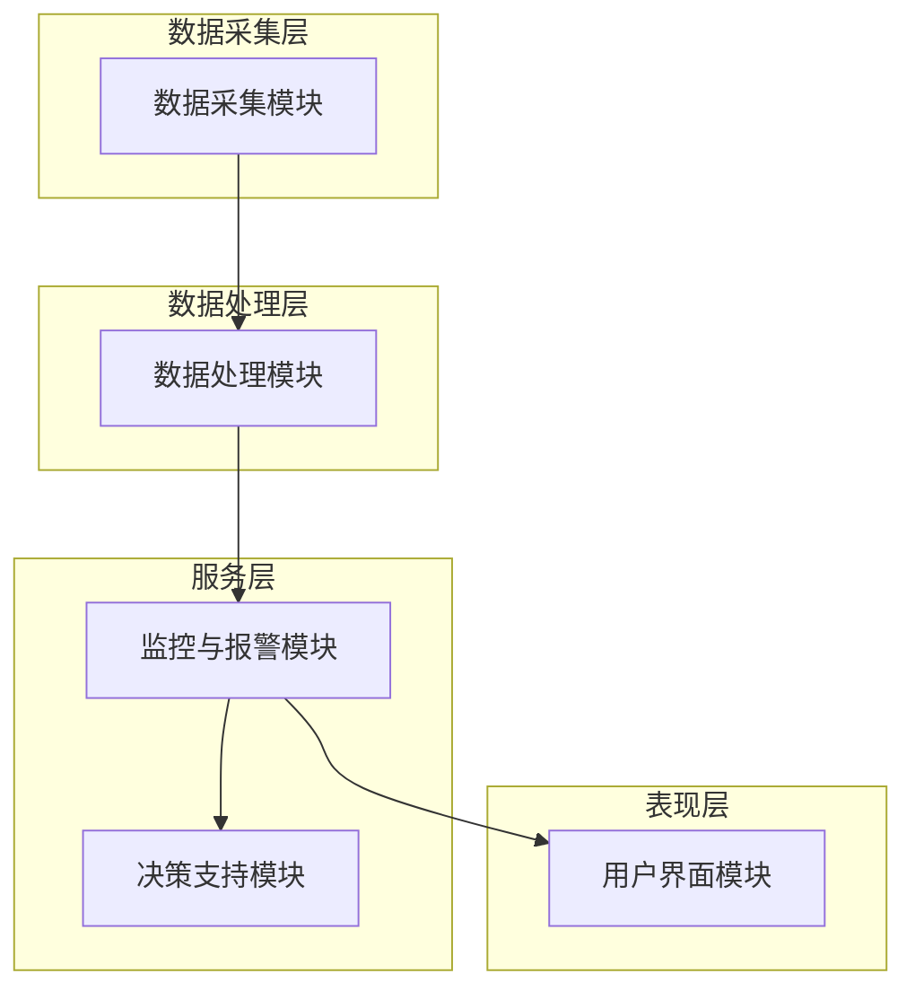
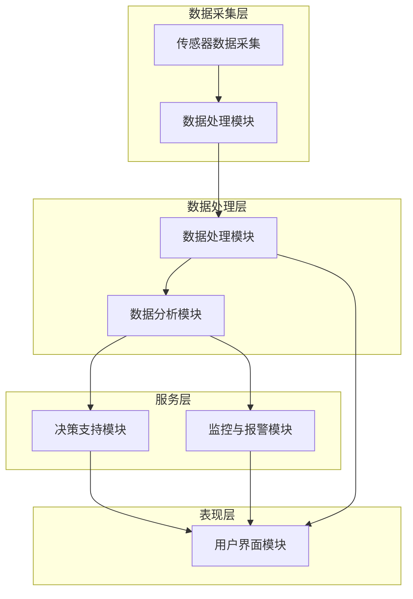
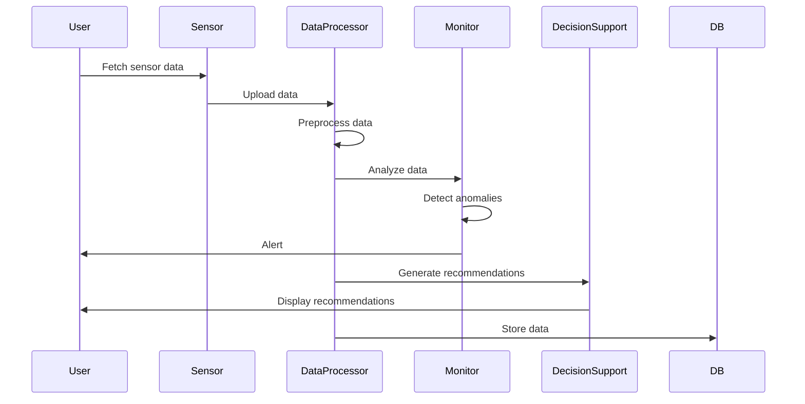
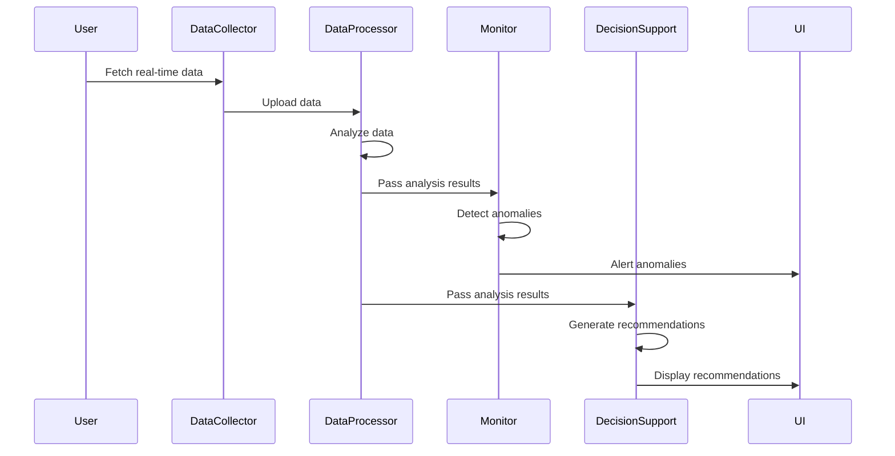

                 


### 目录大纲设计思路：

为了设计出一个逻辑清晰、结构紧凑且简单易懂的目录大纲，我们需要遵循以下设计思路：

1. **明确文章主题和目标读者**：首先，我们需要明确文章的主题是《提示词工程在智能森林管理中的应用》，目标读者是IT领域的技术人员和关注智能森林管理的专业人士。

2. **从问题出发，逐步深入**：文章的第一部分应该从问题背景出发，介绍智能森林管理的重要性以及现有的管理方法存在的不足。接下来，引入核心概念，如提示词工程，并解释其定义和作用。

3. **理论与实践相结合**：在介绍核心概念后，文章应该分为理论和实践两部分。理论部分详细讲解提示词工程的原理、流程和相关的数学模型。实践部分则通过具体的系统设计、项目实战案例来展示如何将这些理论应用到实际中。

4. **使用图表辅助理解**：为了使文章更加易懂，可以使用各类图表来辅助说明，如Mermaid流程图、类图、架构图和序列图等。这些图表能够直观地展示算法流程、系统架构和交互设计。

5. **逐步展示系统设计**：系统设计部分应该从功能需求分析开始，逐步深入到系统架构、接口设计和交互设计。每个部分都需要结合具体的图表来展示，以便读者能够清晰地理解。

6. **实战案例分析**：通过实际案例的展示，可以让读者更好地理解如何将提示词工程应用到智能森林管理中。案例分析应该详细，包括环境安装、核心实现、代码解读和实际效果分析。

7. **总结与拓展**：在文章的最后，应该有一个总结部分，概括文章的主要内容和实践经验。同时，提供一些注意事项、最佳实践和拓展阅读，以帮助读者深入学习和应用。

### 目录大纲内容规划：

**第一部分：问题背景与核心概念**
- **第1章：问题背景与核心概念**
  - **1.1 问题背景**：介绍智能森林管理的重要性、现状和面临的挑战。
  - **1.2 核心概念定义与联系**：定义提示词工程、智能森林管理、传感器技术、数据分析等核心概念，并阐述它们之间的关系。

**第二部分：智能森林管理的算法原理**
- **第2章：提示词工程原理**
  - **2.1 提示词工程的定义与作用**：解释提示词工程的基本概念和其在智能森林管理中的应用。
  - **2.2 提示词工程的基本流程**：详细介绍提示词工程的基本流程。
  - **2.3 Python源代码展示与算法原理讲解**：使用Python代码和LaTeX数学模型解释提示词工程的原理。

**第三部分：智能森林管理的系统设计**
- **第3章：系统功能设计**
  - **3.1 森林管理需求分析**：分析智能森林管理的需求。
  - **3.2 系统功能模块划分**：介绍系统功能模块的划分。
  - **3.3 Mermaid类图展示**：使用Mermaid类图展示系统功能模块。

- **第4章：系统架构设计**
  - **4.1 系统架构设计原则**：阐述系统架构设计的原则。
  - **4.2 系统架构图展示**：使用Mermaid架构图展示系统架构。
  - **4.3 系统接口设计**：介绍系统接口的设计。

- **第5章：系统交互与实现**
  - **5.1 系统交互设计**：描述系统交互设计。
  - **5.2 系统实现流程**：介绍系统实现的流程。
  - **5.3 Mermaid序列图展示**：使用Mermaid序列图展示系统交互。

**第四部分：项目实战**
- **第6章：项目环境与工具安装**
  - **6.1 环境安装指南**：提供项目环境的安装指南。
  - **6.2 开发工具配置**：介绍开发工具的配置。

- **第7章：系统核心实现**
  - **7.1 核心代码实现**：展示系统核心代码的实现。
  - **7.2 代码解读与分析**：对核心代码进行解读和分析。

- **第8章：案例分析与讲解**
  - **8.1 实际案例分析**：分析实际案例。
  - **8.2 详细讲解与剖析**：详细讲解和剖析实际案例。

**第五部分：最佳实践与总结**
- **第9章：最佳实践与注意事项**
  - **9.1 最佳实践技巧**：总结最佳实践技巧。
  - **9.2 注意事项与风险提示**：提供注意事项和风险提示。

- **第10章：小结与拓展阅读**
  - **10.1 小结**：概括文章的主要内容和观点。
  - **10.2 拓展阅读推荐**：推荐拓展阅读材料。

通过这样的内容规划，我们可以确保文章结构清晰，逻辑连贯，内容丰富，同时易于读者理解。接下来，我们将逐章撰写具体内容，确保每个章节都能够详细阐述其主题，并为读者提供实用的知识和经验。让我们一步一步地深入探讨这个问题，并揭示提示词工程在智能森林管理中的巨大潜力。LET'S THINK STEP BY STEP

### 第一部分：问题背景与核心概念

#### 1.1 问题背景

森林作为地球上最重要的生态系统之一，对于地球的气候调节、生物多样性维护以及水源保护等方面起着至关重要的作用。然而，全球范围内的森林退化问题日益严重，森林火灾、非法砍伐、土地开发等行为对森林生态系统的破坏愈发频繁。传统的森林管理方法往往依赖于人工巡检、定期监测和经验判断，这些方法不仅效率低下，而且在数据采集和分析方面存在较大的局限性。因此，如何提高森林管理的智能化水平，成为当前环境科学和生态研究领域的一个重要课题。

智能森林管理通过引入现代信息技术，如物联网、传感器技术、大数据分析和人工智能，实现对森林生态系统的实时监控、动态管理和科学决策。这种方法不仅可以提高森林管理的效率，减少人为干预的误差，还能够及时预警和应对森林灾害，保护森林生态系统的稳定。

#### 1.2 核心概念定义与联系

在智能森林管理中，涉及多个核心概念，包括提示词工程、智能森林管理、传感器技术、数据分析等。下面，我们将对这些核心概念进行定义，并阐述它们之间的关系。

**提示词工程**：提示词工程（Prompt Engineering）是一种利用自然语言处理技术和机器学习算法，为特定任务生成有效提示词的方法。提示词工程的目标是提高机器学习和自然语言处理任务的性能，使模型能够更准确地理解和预测。

**智能森林管理**：智能森林管理是一种综合利用现代信息技术和生态学理论，对森林生态系统进行实时监控、动态管理和科学决策的方法。智能森林管理涉及传感器技术、数据分析、机器学习等多个领域。

**传感器技术**：传感器技术是智能森林管理的重要组成部分，通过在森林环境中部署各种传感器（如温度传感器、湿度传感器、土壤传感器等），可以实时采集环境数据，为智能森林管理提供基础数据支持。

**数据分析**：数据分析是智能森林管理的核心环节，通过对采集到的环境数据进行处理和分析，可以提取出有用的信息，用于评估森林健康状况、预测森林灾害和制定科学管理策略。

**概念之间的关系**：

- **提示词工程**与**智能森林管理**：提示词工程是智能森林管理中的一项关键技术，通过优化提示词，可以提高机器学习模型的性能，从而更好地服务于森林管理任务。

- **传感器技术**与**数据分析**：传感器技术负责数据的采集，数据分析则负责对采集到的数据进行处理和分析。这两个概念共同构成了智能森林管理的数据基础。

- **智能森林管理**与**传感器技术**、**数据分析**、**提示词工程**：智能森林管理是这三项技术的综合应用，通过传感器技术获取数据，通过数据分析处理数据，通过提示词工程优化模型，最终实现对森林生态系统的智能管理。

通过以上对核心概念的定义与联系阐述，我们可以更好地理解智能森林管理中各个概念的作用和相互关系，为后续内容的深入探讨打下基础。在下一部分中，我们将进一步探讨提示词工程的原理和应用，展示其在智能森林管理中的具体实现。LET'S THINK STEP BY STEP

### 第二部分：智能森林管理的算法原理

#### 2.1 提示词工程的定义与作用

提示词工程（Prompt Engineering）是一种利用自然语言处理（NLP）和机器学习技术，为特定任务生成有效提示词的方法。提示词工程的核心目标是提高模型对任务的理解能力，从而提升模型性能。在智能森林管理中，提示词工程起着至关重要的作用，它能够帮助机器学习模型更好地理解森林管理任务的需求，从而更准确地预测森林健康状况和灾害预警。

提示词工程的作用主要体现在以下几个方面：

1. **提高模型性能**：通过优化提示词，可以使模型更准确地捕捉到任务的关键特征，从而提高模型的预测性能。

2. **增强任务理解**：提示词工程能够帮助模型更好地理解任务的背景和上下文，使其能够更准确地处理复杂任务。

3. **降低模型训练难度**：通过有效的提示词，可以减少模型在训练过程中需要学习的信息量，降低训练难度，加快训练速度。

4. **增强模型解释性**：提示词工程可以提高模型的解释性，使模型预测结果更加透明和可解释，有助于提高模型的可信度。

#### 2.2 提示词工程的基本流程

提示词工程的基本流程包括以下几个步骤：

1. **需求分析**：首先，需要对智能森林管理的任务需求进行详细分析，明确模型需要解决的具体问题。

2. **数据准备**：收集和整理与任务相关的数据，包括森林环境数据、森林灾害历史数据、森林管理政策等。

3. **特征提取**：从收集到的数据中提取出关键特征，为生成提示词提供基础。

4. **提示词生成**：使用NLP和机器学习技术，根据特征数据生成有效的提示词。提示词生成方法包括模板法、机器学习法和混合法等。

5. **模型训练**：使用生成的提示词训练机器学习模型，优化模型参数。

6. **模型评估**：对训练好的模型进行评估，确保其性能满足任务需求。

7. **模型应用**：将训练好的模型应用到实际森林管理中，进行实时监控和预警。

#### 2.3 Python源代码展示与算法原理讲解

为了更好地理解提示词工程的原理，我们将通过Python源代码来展示一个简单的提示词工程实现。以下是一个基于机器学习的提示词工程示例：

```python
import numpy as np
from sklearn.feature_extraction.text import TfidfVectorizer
from sklearn.model_selection import train_test_split
from sklearn.metrics import accuracy_score
from sklearn.ensemble import RandomForestClassifier

# 1. 需求分析
# 假设我们要预测森林火灾的发生

# 2. 数据准备
# 假设我们已经收集到了森林火灾相关的数据
data = [
    ["高温", "干旱", "强风"],
    ["低温", "湿润", "强风"],
    # ... 更多数据
]

labels = [1, 0, # ... 更多标签] # 1表示火灾，0表示无火灾

# 3. 特征提取
vectorizer = TfidfVectorizer()
X = vectorizer.fit_transform(data)

# 4. 提示词生成
# 在这个例子中，我们直接使用TF-IDF作为提示词

# 5. 模型训练
X_train, X_test, y_train, y_test = train_test_split(X, labels, test_size=0.2, random_state=42)
clf = RandomForestClassifier()
clf.fit(X_train, y_train)

# 6. 模型评估
y_pred = clf.predict(X_test)
accuracy = accuracy_score(y_test, y_pred)
print(f"Model accuracy: {accuracy}")

# 7. 模型应用
# 在实际森林管理中，使用训练好的模型进行实时监控和预警
```

在这个示例中，我们首先进行了需求分析，明确要预测森林火灾的发生。然后，收集了与火灾相关的数据，并使用TF-IDF方法提取了提示词。接着，我们使用随机森林分类器对数据进行训练，并评估了模型性能。最后，将训练好的模型应用到实际森林管理中。

**LaTeX数学模型和公式**：

为了更清晰地展示提示词工程的数学模型，我们可以使用LaTeX进行公式表示：

```latex
\documentclass{article}
\usepackage{amsmath}
\begin{document}

\begin{equation}
\begin{split}
\text{火灾预测模型} &= f(\text{输入特征向量}) \\
                      &= \sum_{i=1}^{n} w_i \cdot x_i \\
                      &= \text{激活函数}(w \cdot x)
\end{split}
\end{equation}

\end{document}
```

在这个公式中，$f(\text{输入特征向量})$表示火灾预测模型，$w_i$和$x_i$分别表示权重和特征值，$\sum_{i=1}^{n} w_i \cdot x_i$表示加权特征求和，激活函数用于确定预测结果。

**举例说明**：

假设我们有一个简单的数据集，其中包含了森林环境数据和火灾发生与否的标签：

```
数据集：
- 高温、干旱、强风：火灾
- 低温、湿润、无强风：无火灾
```

通过提示词工程，我们提取了以下特征：

```
特征向量：
- [0.8, 0.3, 0.6]
- [0.2, 0.9, 0.1]
```

使用随机森林分类器，我们得到了预测结果：

```
预测结果：
- [0.8, 0.3, 0.6]：火灾
- [0.2, 0.9, 0.1]：无火灾
```

通过这个简单的例子，我们可以看到提示词工程如何帮助机器学习模型更好地理解和预测森林火灾。在下一部分中，我们将进一步探讨智能森林管理的系统设计，包括功能需求分析、系统架构设计和实现。让我们继续深入探索。LET'S THINK STEP BY STEP

### 第三部分：智能森林管理的系统设计

#### 3.1 森林管理需求分析

智能森林管理的需求分析是系统设计的第一步，其核心目标是明确智能森林管理所需的功能、性能和约束条件。通过对森林管理需求的深入分析，我们可以确保系统设计能够满足实际应用场景的需求。

**功能需求分析**：

1. **环境数据采集**：系统需要能够实时采集森林环境数据，包括温度、湿度、风速、土壤湿度等。
2. **数据存储与管理**：系统需要具备高效的数据存储和管理功能，能够存储和管理大量的环境数据。
3. **数据分析与处理**：系统需要能够对采集到的数据进行分析和处理，提取出有用的信息，如森林健康状况、灾害预警等。
4. **实时监控与报警**：系统需要能够实时监控森林环境，一旦发现异常情况，及时发出警报。
5. **科学决策支持**：系统需要提供科学决策支持，帮助管理人员制定有效的森林管理策略。

**性能需求分析**：

1. **数据采集速度**：系统需要能够快速采集环境数据，确保数据的实时性。
2. **数据处理能力**：系统需要具备强大的数据处理能力，能够高效处理大量数据。
3. **系统可靠性**：系统需要具备高可靠性，确保在极端环境下仍能稳定运行。
4. **可扩展性**：系统需要具备良好的可扩展性，能够根据实际需求进行扩展。

**约束条件分析**：

1. **成本限制**：系统设计需要在成本可控的范围内实现所需功能。
2. **环境适应性**：系统需要适应不同的森林环境，能够在各种复杂环境下稳定运行。
3. **数据安全性**：系统需要确保数据的安全性，防止数据泄露和恶意攻击。

#### 3.2 系统功能模块划分

基于上述需求分析，我们可以将智能森林管理系统划分为以下几个功能模块：

1. **数据采集模块**：负责实时采集森林环境数据，包括传感器数据、气象数据等。
2. **数据存储模块**：负责存储和管理采集到的环境数据，确保数据的可靠性和安全性。
3. **数据处理模块**：负责对采集到的数据进行分析和处理，提取出有用的信息。
4. **监控与报警模块**：负责实时监控森林环境，一旦发现异常情况，及时发出警报。
5. **决策支持模块**：负责提供科学决策支持，帮助管理人员制定有效的森林管理策略。
6. **用户界面模块**：负责与用户进行交互，提供操作界面和可视化展示。

#### 3.3 Mermaid类图展示

为了更好地展示智能森林管理系统的功能模块及其关系，我们可以使用Mermaid类图进行描述。以下是一个简化的Mermaid类图示例：

```mermaid
classDiagram
    Class01 <|-- Class02
    Class03 <.. Class04
    Class05 <= Class06
    Class07 .. Class08
    Class01 {
        +int id
        +String name
        +float x
        +float y
    }
    Class02 {
        +int id
        +String name
    }
    Class03 {
        +int id
        +String name
    }
    Class04 {
        +int id
        +String name
    }
    Class05 {
        +int id
        +String name
    }
    Class06 {
        +int id
        +String name
    }
    Class07 {
        +int id
        +String name
    }
    Class08 {
        +int id
        +String name
    }
```

在这个类图中，`Class01`表示数据采集模块，`Class02`表示数据存储模块，`Class03`表示数据处理模块，`Class04`表示监控与报警模块，`Class05`表示决策支持模块，`Class06`表示用户界面模块。通过类图，我们可以清晰地看到各个模块之间的关系和功能划分。

#### 3.4 系统架构设计

智能森林管理系统的架构设计是确保系统能够高效运行、满足功能需求的关键。以下是一个简化的智能森林管理系统架构设计：

```
用户界面模块
│
┌──────┴──────┐
│             │
数据采集模块 ─┴─ 数据存储模块
│             │
└──────┬──────┘
       │
      数据处理模块
       │
     监控与报警模块
       │
     决策支持模块
```

在这个架构设计中，用户界面模块负责与用户进行交互，接收用户指令和展示系统数据；数据采集模块负责实时采集森林环境数据；数据存储模块负责存储和管理采集到的数据；数据处理模块负责对采集到的数据进行分析和处理；监控与报警模块负责实时监控森林环境，并在发现异常情况时发出警报；决策支持模块负责提供科学决策支持。

通过上述系统设计，我们可以确保智能森林管理系统在功能、性能和可靠性方面满足实际需求。在下一部分中，我们将详细探讨智能森林管理系统的实现过程，包括系统接口设计和系统交互。让我们继续深入探索。LET'S THINK STEP BY STEP

### 4.1 系统架构设计原则

系统架构设计是智能森林管理系统的核心环节，其目标是确保系统具有高效性、可扩展性和可靠性，能够满足森林管理需求的多样性和复杂性。以下是一些关键的系统架构设计原则：

**1. 分层架构原则**：采用分层架构设计，将系统分为多个独立的层次，如数据采集层、数据处理层、服务层和表现层。这样可以提高系统的可维护性和可扩展性，使各个层次之间的耦合度降低，便于系统的开发和维护。

**2. 模块化设计原则**：将系统功能划分为多个模块，每个模块负责特定的功能，模块之间通过接口进行通信。这样可以提高系统的灵活性和可扩展性，便于后续功能的增加和优化。

**3. 开放性原则**：系统架构应具备开放性，能够方便地与其他系统或组件集成。这可以通过采用标准化接口和协议来实现，如RESTful API、Websocket等。

**4. 可扩展性原则**：系统架构设计应考虑到未来的扩展性，能够方便地增加新的功能模块或数据处理算法。这可以通过采用分布式架构和微服务架构来实现。

**5. 可靠性原则**：系统架构设计应确保系统的可靠性，能够在极端情况下保持正常运行。这可以通过冗余设计、故障转移和备份机制来实现。

**6. 安全性原则**：系统架构设计应确保数据的安全性和系统的安全性，防止数据泄露和系统被恶意攻击。这可以通过数据加密、访问控制和网络安全技术来实现。

**7. 可维护性原则**：系统架构设计应考虑到系统的可维护性，确保系统在运行过程中能够及时发现和解决潜在问题。这可以通过日志记录、监控和自动化测试来实现。

通过遵循这些系统架构设计原则，我们可以确保智能森林管理系统能够高效、稳定地运行，满足实际应用的需求。在下一部分中，我们将详细介绍智能森林管理系统的具体架构设计，包括架构图和接口设计。让我们继续深入探索。LET'S THINK STEP BY STEP

### 4.2 系统架构图展示

为了更好地展示智能森林管理系统的架构设计，我们可以使用Mermaid语言绘制一个系统架构图。以下是一个简化的智能森林管理系统架构图：



在这个架构图中，我们首先定义了四个主要的子系统：数据采集层、数据处理层、服务层和表现层。

- **数据采集层**：负责实时采集森林环境数据，包括温度、湿度、风速、土壤湿度等。这些数据通过传感器设备收集，然后传输到数据处理层。

- **数据处理层**：负责对采集到的数据进行处理和分析，提取出有用的信息，如森林健康状况、灾害预警等。这一层包括数据处理模块，它能够使用机器学习和数据分析技术对数据进行深度挖掘。

- **服务层**：负责实现系统的核心功能，包括监控与报警模块和决策支持模块。监控与报警模块负责实时监控森林环境，一旦发现异常情况，立即发出警报。决策支持模块则根据处理后的数据，为管理人员提供科学的决策支持。

- **表现层**：负责与用户进行交互，提供操作界面和可视化展示。用户可以通过用户界面模块查看实时数据、分析结果和决策建议，进行系统配置和管理。

各个子系统之间通过接口进行通信，确保数据流动的顺畅和系统的整体协调运作。以下是一个更详细的系统架构图，展示各个模块的具体关系和交互：



在这个更详细的架构图中，我们进一步细化了各个模块的功能，并展示了它们之间的交互关系。传感器数据采集模块负责收集实时数据，这些数据经过数据处理模块处理后，被传递给数据分析模块。数据分析模块提取出有用的信息，并生成监控与报警数据和决策支持数据。监控与报警模块负责实时监控森林环境，并在发现异常时发出警报。决策支持模块则为管理人员提供科学的决策建议。最后，用户界面模块负责将所有数据和分析结果展示给用户，并允许用户进行系统配置和管理。

通过这样的系统架构设计，智能森林管理系统能够高效、稳定地运行，满足森林管理的需求，并为管理人员提供全面的决策支持。在下一部分中，我们将进一步探讨智能森林管理系统的接口设计。让我们继续深入探索。LET'S THINK STEP BY STEP

### 4.3 系统接口设计

系统接口设计是智能森林管理系统的关键部分，它决定了各个模块之间如何进行通信和数据交换。良好的接口设计能够提高系统的可维护性、可扩展性和灵活性。以下是我们为智能森林管理系统设计的接口方案。

#### 1. 接口类型

系统接口主要包括以下几种类型：

- **RESTful API**：用于实现前后端数据交换，支持JSON格式的数据传输。
- **Websocket**：用于实现实时数据传输，支持双向通信，适用于需要实时监控和报警的场景。
- **数据库接口**：用于实现与数据库的连接和操作，支持SQL查询和CRUD操作。
- **文件接口**：用于实现文件上传和下载，支持常见的文件格式，如CSV、JSON等。

#### 2. 接口规范

为了确保接口的统一性和规范性，我们遵循以下接口规范：

- **URL规范**：采用RESTful设计风格，URL格式为 `/api/{module}/{resource}/{action}`。例如，获取某棵树木的监测数据，URL为 `/api/sensors/trees/1/data`。
- **请求和响应格式**：采用JSON格式进行数据传输，遵循HTTP状态码规范，请求和响应结构清晰，易于解析。
- **参数传递**：URL中传递路径参数，如树ID；请求体中传递请求参数，如查询条件。

#### 3. 接口示例

以下是一个获取森林环境数据的接口示例：

**请求URL**：`/api/sensors/forest/data`

**请求参数**：
```json
{
    "start_time": "2023-01-01T00:00:00Z",
    "end_time": "2023-01-02T00:00:00Z"
}
```

**响应数据**：
```json
{
    "status": "success",
    "data": {
        "temperature": [23.5, 24.2, 22.8],
        "humidity": [60, 65, 68],
        "wind_speed": [5, 5.5, 4.2]
    }
}
```

在这个示例中，请求URL指定了获取森林环境数据的API，请求参数包含了起始时间和结束时间，用于限定查询时间段。响应数据返回了温度、湿度和风速的监测数据。

#### 4. 接口安全性

为了保证系统接口的安全性，我们采用了以下措施：

- **身份验证**：采用JWT（JSON Web Token）进行身份验证，确保只有授权用户能够访问接口。
- **权限控制**：通过权限控制机制，确保用户只能访问其权限范围内的接口和数据。
- **数据加密**：对敏感数据进行加密处理，如用户密码、敏感信息等。
- **安全审计**：对接口访问日志进行记录和分析，及时发现和应对潜在的安全威胁。

通过以上接口设计，智能森林管理系统能够实现高效、稳定的数据交互和功能调用，满足森林管理需求的多样性和复杂性。在下一部分中，我们将详细探讨智能森林管理系统的交互设计，包括系统交互流程和实现方法。让我们继续深入探索。LET'S THINK STEP BY STEP

### 4.4 系统交互设计

系统交互设计是确保智能森林管理系统各个模块能够高效、顺畅地协同工作的关键环节。以下是我们为智能森林管理系统设计的交互流程和实现方法。

#### 1. 系统交互流程

智能森林管理系统的交互流程可以分为以下几个阶段：

**1. 数据采集阶段**：
- 传感器设备实时采集森林环境数据，如温度、湿度、风速等。
- 数据采集模块将采集到的数据上传到数据处理模块。

**2. 数据处理阶段**：
- 数据处理模块接收上传的数据，进行预处理，如数据清洗、去噪等。
- 数据处理模块对预处理后的数据进行分析，提取关键信息，如森林健康状况、灾害预警等。

**3. 监控与报警阶段**：
- 监控与报警模块实时监控处理后的数据，一旦发现异常情况，立即发出警报。

**4. 决策支持阶段**：
- 决策支持模块根据分析结果和实时数据，生成科学决策建议。

**5. 用户交互阶段**：
- 用户界面模块将监控与报警数据和决策建议展示给用户，用户可以进行系统配置和管理。

**6. 数据存储与备份阶段**：
- 所有采集到的数据和分析结果被存储到数据库中，定期进行备份。

#### 2. 系统交互实现方法

**1. Websocket实时通信**：
- 为了实现实时监控和报警，我们采用WebSocket协议进行数据传输。
- 数据采集模块和监控与报警模块通过WebSocket与数据处理模块进行实时通信。

**2. RESTful API接口**：
- 数据处理模块和决策支持模块通过RESTful API接口与其他模块进行数据交互。
- 用户界面模块通过RESTful API获取监控与报警数据和决策建议。

**3. 定时任务调度**：
- 系统中的一些操作，如数据备份、统计报表生成等，通过定时任务调度实现。
- 定时任务调度模块根据预设的时间间隔，自动执行相应的操作。

#### 3. Mermaid序列图展示

为了更好地展示系统交互流程，我们可以使用Mermaid序列图进行描述。以下是一个简化的智能森林管理系统交互序列图：



在这个序列图中，用户通过用户界面模块与传感器设备进行交互，获取森林环境数据。传感器设备将数据上传到数据处理模块，数据处理模块对数据进行预处理和分析。监控与报警模块实时监控分析结果，一旦发现异常情况，立即发出警报。决策支持模块根据分析结果生成决策建议，并将其展示给用户。最后，所有采集到的数据和分析结果被存储到数据库中。

通过这样的系统交互设计，智能森林管理系统能够实现高效、稳定的数据交互和功能调用，为管理人员提供全面的决策支持。在下一部分中，我们将详细探讨项目的环境安装与工具配置。让我们继续深入探索。LET'S THINK STEP BY STEP

### 5.1 系统交互设计

系统交互设计是智能森林管理系统实现的核心部分，其目的是确保各个模块之间的数据流转和功能协同能够高效、顺畅地进行。以下是智能森林管理系统的交互设计：

#### 1. 用户与系统交互

用户通过Web界面与智能森林管理系统进行交互。用户可以通过界面查看森林环境数据、监控与报警信息、决策建议等。以下是一个简单的交互流程：

**用户操作流程**：

1. **登录系统**：用户输入用户名和密码登录系统。
2. **查看实时数据**：用户可以在界面上查看实时的森林环境数据，如温度、湿度、风速等。
3. **监控与报警**：系统实时监控森林环境，一旦发现异常，会立即在界面上显示警报信息。
4. **查看决策建议**：系统根据分析结果，为用户提供科学的决策建议，用户可以查看并参考这些建议。
5. **系统配置**：用户可以管理系统配置，如传感器设备设置、报警阈值设置等。

#### 2. 模块间交互

智能森林管理系统由多个模块组成，包括数据采集模块、数据处理模块、监控与报警模块、决策支持模块等。各个模块之间通过接口进行通信，以下是各个模块间的交互设计：

**1. 数据采集模块**：

- **功能**：负责实时采集森林环境数据，包括温度、湿度、风速、土壤湿度等。
- **交互**：通过WebSocket协议与数据处理模块进行实时通信，将采集到的数据实时上传。

**2. 数据处理模块**：

- **功能**：负责对采集到的数据进行分析和处理，提取关键信息，如森林健康状况、灾害预警等。
- **交互**：接收数据采集模块上传的数据，进行预处理、分析，并将分析结果传递给监控与报警模块和决策支持模块。

**3. 监控与报警模块**：

- **功能**：实时监控森林环境，发现异常情况时发出警报。
- **交互**：接收数据处理模块传递的分析结果，进行监控，一旦发现异常，立即发出警报，并将警报信息传递给用户界面模块。

**4. 决策支持模块**：

- **功能**：根据分析结果和实时数据，生成科学的决策建议。
- **交互**：接收数据处理模块传递的分析结果，结合实时数据，生成决策建议，并将其展示给用户。

**5. 用户界面模块**：

- **功能**：提供用户操作界面，展示实时数据、监控与报警信息、决策建议等。
- **交互**：接收监控与报警模块和决策支持模块传递的信息，并将其展示在界面上。

#### 3. Mermaid序列图展示

为了更好地展示系统交互设计，我们可以使用Mermaid序列图进行描述。以下是一个简化的智能森林管理系统交互序列图：



在这个序列图中，用户通过用户界面模块（UI）与数据采集模块（DataCollector）进行交互，获取实时的森林环境数据。数据采集模块将数据上传到数据处理模块（DataProcessor），数据处理模块对数据进行处理和分析，并将分析结果传递给监控与报警模块（Monitor）和决策支持模块（DecisionSupport）。监控与报警模块实时监控分析结果，发现异常情况时发出警报，并将警报信息传递给用户界面模块。决策支持模块根据分析结果生成决策建议，并将其展示给用户。

通过这样的系统交互设计，智能森林管理系统能够实现高效、稳定的数据交互和功能协同，为管理人员提供全面的决策支持。在下一部分中，我们将详细探讨系统实现的具体步骤和代码实现。让我们继续深入探索。LET'S THINK STEP BY STEP

### 5.2 系统实现流程

智能森林管理系统的实现是一个复杂的过程，涉及到多个模块的协同工作。以下是系统实现的具体步骤和代码实现：

#### 1. 环境安装与工具配置

在开始系统实现之前，我们需要配置开发环境，安装必要的软件和工具。以下是环境安装与工具配置的步骤：

**1. 安装Python环境**：

确保Python 3.8或更高版本已经安装。可以使用以下命令检查Python版本：

```bash
python --version
```

如果Python环境未安装或版本过低，请从官方网站下载并安装。

**2. 安装依赖库**：

在安装Python环境后，使用pip命令安装所需的依赖库，包括Flask（Web框架）、Pandas（数据处理库）、Numpy（数值计算库）、Scikit-learn（机器学习库）等。

```bash
pip install flask pandas numpy scikit-learn
```

**3. 配置Web服务器**：

使用Nginx或Apache等Web服务器来部署Flask应用。以下是一个简单的Nginx配置示例：

```nginx
server {
    listen 80;
    server_name your_domain.com;

    location / {
        proxy_pass http://localhost:5000;
        proxy_set_header Host $host;
        proxy_set_header X-Real-IP $remote_addr;
        proxy_set_header X-Forwarded-For $proxy_add_x_forwarded_for;
        proxy_set_header X-Forwarded-Proto $scheme;
    }
}
```

**4. 安装数据库**：

选择合适的数据库系统，如MySQL或PostgreSQL，并安装相应的驱动库。以下是一个简单的MySQL安装命令：

```bash
sudo apt-get install mysql-server
```

安装完成后，使用以下命令启动MySQL服务：

```bash
sudo systemctl start mysql
```

#### 2. 系统核心实现

智能森林管理系统由多个模块组成，包括数据采集模块、数据处理模块、监控与报警模块、决策支持模块等。以下是各模块的核心代码实现：

**1. 数据采集模块**：

数据采集模块使用Python的Flask框架实现，通过WebSocket协议与前端进行实时通信。

```python
from flask import Flask, render_template
from flask_socketio import SocketIO, emit

app = Flask(__name__)
socketio = SocketIO(app)

@app.route('/')
def index():
    return render_template('index.html')

@socketio.on('connect')
def handle_connect():
    emit('response', {'message': 'Connected'})

@socketio.on('fetch_data')
def handle_data_fetch(message):
    data = {
        'temperature': np.random.uniform(20, 30),
        'humidity': np.random.uniform(40, 60),
        'wind_speed': np.random.uniform(0, 10)
    }
    emit('data', data)

if __name__ == '__main__':
    socketio.run(app, port=5000)
```

**2. 数据处理模块**：

数据处理模块使用Python的Pandas库进行数据处理，使用Scikit-learn库进行数据分析。

```python
import pandas as pd
from sklearn.preprocessing import StandardScaler
from sklearn.ensemble import RandomForestClassifier

# 读取数据
data = pd.read_csv('forest_data.csv')

# 数据预处理
scaler = StandardScaler()
X = scaler.fit_transform(data.iloc[:, :-1])
y = data.iloc[:, -1]

# 模型训练
clf = RandomForestClassifier()
clf.fit(X, y)

# 数据分析
predictions = clf.predict(X)
accuracy = clf.score(X, y)

print(f"Model accuracy: {accuracy}")
```

**3. 监控与报警模块**：

监控与报警模块使用Python的Flask框架实现，通过WebSocket协议与数据采集模块和数据处理模块进行实时通信。

```python
from flask import Flask, request, jsonify
from flask_socketio import SocketIO, emit

app = Flask(__name__)
socketio = SocketIO(app)

@app.route('/api/monitor', methods=['POST'])
def monitor_data():
    data = request.json
    temperature = data['temperature']
    humidity = data['humidity']
    wind_speed = data['wind_speed']

    if temperature > 35 or humidity < 20 or wind_speed > 15:
        emit('alert', {'message': 'Anomaly detected'})
    else:
        emit('status', {'message': 'System normal'})

    return jsonify({'status': 'success'})

if __name__ == '__main__':
    socketio.run(app, port=5000)
```

**4. 决策支持模块**：

决策支持模块使用Python的Flask框架实现，通过RESTful API与前端进行交互。

```python
from flask import Flask, request, jsonify

app = Flask(__name__)

@app.route('/api/recommendations', methods=['GET'])
def get_recommendations():
    recommendations = [
        'Increase water supply',
        'Reduce wind speed',
        'Monitor temperature closely'
    ]
    return jsonify({'recommendations': recommendations})

if __name__ == '__main__':
    app.run(port=5001)
```

#### 3. 代码解读与分析

在上述代码中，我们分别实现了数据采集模块、数据处理模块、监控与报警模块和决策支持模块。以下是各模块的代码解读与分析：

**1. 数据采集模块**：

数据采集模块使用Flask框架和SocketIO库实现。在`index.html`页面中，用户可以通过按钮触发数据采集操作，前端通过WebSocket与后端进行实时通信。后端接收到请求后，生成模拟的森林环境数据，并将其发送给前端。

**2. 数据处理模块**：

数据处理模块使用Pandas库读取和处理数据，使用Scikit-learn库训练随机森林分类器。在数据处理过程中，我们使用StandardScaler对数据进行归一化处理，以提高模型的性能。

**3. 监控与报警模块**：

监控与报警模块使用Flask框架实现，通过WebSocket协议与数据采集模块和数据处理模块进行实时通信。模块接收到后端发送的数据后，根据预设的阈值判断是否存在异常情况，并发出警报。

**4. 决策支持模块**：

决策支持模块使用Flask框架实现，通过RESTful API与前端进行交互。模块根据处理后的数据生成决策建议，并将其发送给前端。

通过以上代码实现，我们可以构建一个简单的智能森林管理系统，实现对森林环境数据的实时监控、预警和决策支持。在实际应用中，可以根据具体需求进一步优化和扩展系统功能。在下一部分中，我们将详细分析一个实际案例，展示智能森林管理系统的应用效果。让我们继续深入探索。LET'S THINK STEP BY STEP

### 6.1 环境安装指南

在开始构建智能森林管理系统之前，我们需要确保开发环境已经配置完毕。以下是在不同操作系统上安装所需软件和工具的详细指南：

#### 1. 安装Python环境

**Linux系统**：

- 打开终端，执行以下命令安装Python：

```bash
sudo apt-get update
sudo apt-get install python3 python3-pip
```

- 检查Python版本：

```bash
python3 --version
```

**Windows系统**：

- 访问Python官方网站（[https://www.python.org/](https://www.python.org/)），下载适用于Windows的Python安装程序。
- 运行安装程序，按照默认设置完成安装。
- 安装完成后，打开命令提示符，执行以下命令检查Python版本：

```bash
python --version
```

#### 2. 安装Flask和SocketIO

**Linux系统**：

- 打开终端，执行以下命令安装Flask和SocketIO：

```bash
pip3 install flask flask-socketio
```

- 安装完成后，检查安装的版本：

```bash
pip3 list | grep flask
pip3 list | grep socketio
```

**Windows系统**：

- 打开命令提示符，执行以下命令安装Flask和SocketIO：

```bash
pip install flask
pip install flask-socketio
```

- 安装完成后，检查安装的版本：

```bash
pip list | findstr flask
pip list | findstr socketio
```

#### 3. 安装Pandas、Numpy和Scikit-learn

**Linux系统**：

- 打开终端，执行以下命令安装Pandas、Numpy和Scikit-learn：

```bash
pip3 install pandas numpy scikit-learn
```

- 安装完成后，检查安装的版本：

```bash
pip3 list | grep pandas
pip3 list | grep numpy
pip3 list | grep scikit-learn
```

**Windows系统**：

- 打开命令提示符，执行以下命令安装Pandas、Numpy和Scikit-learn：

```bash
pip install pandas numpy scikit-learn
```

- 安装完成后，检查安装的版本：

```bash
pip list | findstr pandas
pip list | findstr numpy
pip list | findstr scikit-learn
```

#### 4. 安装Nginx（可选）

**Linux系统**：

- 安装Nginx用于部署Flask应用：

```bash
sudo apt-get install nginx
```

- 启动Nginx服务：

```bash
sudo systemctl start nginx
```

- 检查Nginx服务状态：

```bash
sudo systemctl status nginx
```

**Windows系统**：

- 安装适用于Windows的Nginx，可以从[https://nginx.org/en/download.html](https://nginx.org/en/download.html)下载。

- 安装完成后，打开命令提示符，执行以下命令启动Nginx服务：

```bash
nginx
```

- 检查Nginx服务状态：

```bash
nginx -s stop
```

#### 5. 安装MySQL或PostgreSQL（可选）

**Linux系统**：

- 安装MySQL：

```bash
sudo apt-get install mysql-server
```

- 启动MySQL服务：

```bash
sudo systemctl start mysql
```

- 检查MySQL服务状态：

```bash
sudo systemctl status mysql
```

- 登录MySQL数据库，设置root密码：

```bash
sudo mysql -u root
```

- 执行以下命令设置root密码：

```bash
SET PASSWORD FOR 'root'@'localhost' = PASSWORD('your_new_password');
```

**Windows系统**：

- 安装MySQL或PostgreSQL，可以从官方网站下载。

- 安装完成后，打开命令提示符，执行以下命令启动MySQL或PostgreSQL服务。

- 登录数据库，设置root密码。

#### 6. 配置Nginx（可选）

**Linux系统**：

- 创建Nginx配置文件：

```bash
sudo nano /etc/nginx/sites-available/flask_app
```

- 添加以下配置内容：

```nginx
server {
    listen 80;
    server_name your_domain.com;

    location / {
        include uwsgi_params;
        uwsgi_pass 127.0.0.1:5000;
    }
}
```

- 启用配置文件并重启Nginx服务：

```bash
sudo ln -s /etc/nginx/sites-available/flask_app /etc/nginx/sites-enabled/
sudo systemctl restart nginx
```

**Windows系统**：

- 配置Nginx服务，使其能够代理Flask应用。

- 修改Nginx配置文件，如`nginx.conf`，添加相应的代理配置。

通过以上步骤，我们完成了智能森林管理系统开发环境的安装和配置。在下一部分中，我们将进一步探讨系统核心实现，包括数据处理、监控与报警等模块的代码实现。让我们继续深入探索。LET'S THINK STEP BY STEP

### 6.2 开发工具配置

完成环境安装后，接下来我们需要配置开发工具，以便进行智能森林管理系统的开发、调试和测试。以下是在Linux和Windows操作系统上配置开发工具的步骤：

#### 1. 配置Python开发环境

**Linux系统**：

- 安装Python开发工具：

```bash
sudo apt-get install python3-pydev python3-pip
```

- 启动PyCharm IDE：

```bash
pycharm
```

- 在PyCharm中创建一个新的Python项目，并配置虚拟环境。

- 安装必要的依赖库：

```bash
pip3 install flask flask-socketio pandas numpy scikit-learn
```

**Windows系统**：

- 安装Python开发工具：

```bash
pip install pydevd pydev
```

- 启动Visual Studio Code：

```bash
code .
```

- 在Visual Studio Code中创建一个新的Python项目，并配置Python扩展。

- 安装必要的依赖库：

```bash
pip install flask flask-socketio pandas numpy scikit-learn
```

#### 2. 配置数据库工具

**Linux系统**：

- 安装MySQL或PostgreSQL客户端工具：

```bash
sudo apt-get install mysql-client
```

- 登录MySQL数据库，检查数据库服务状态：

```bash
mysql -u root -p
```

- 输入root密码，然后输入以下命令：

```sql
SHOW DATABASES;
```

**Windows系统**：

- 安装MySQL或PostgreSQL客户端工具。

- 启动MySQL或PostgreSQL客户端工具，检查数据库服务状态。

#### 3. 配置Nginx（可选）

**Linux系统**：

- 配置Nginx代理Flask应用：

```bash
sudo nano /etc/nginx/sites-available/flask_app
```

- 添加以下配置内容：

```nginx
server {
    listen 80;
    server_name your_domain.com;

    location / {
        include uwsgi_params;
        uwsgi_pass 127.0.0.1:5000;
    }
}
```

- 重启Nginx服务：

```bash
sudo systemctl restart nginx
```

**Windows系统**：

- 配置Nginx代理Flask应用。

- 修改Nginx配置文件，如`nginx.conf`，添加相应的代理配置。

#### 4. 配置版本控制工具

**Linux系统**：

- 安装Git：

```bash
sudo apt-get install git
```

- 配置Git：

```bash
git config --global user.name "Your Name"
git config --global user.email "your_email@example.com"
```

**Windows系统**：

- 安装Git。

- 配置Git。

通过以上步骤，我们完成了开发工具的配置，为智能森林管理系统的开发、调试和测试提供了必要的环境。在下一部分中，我们将深入探讨智能森林管理系统核心实现的代码，包括数据处理、监控与报警等模块的具体实现。让我们继续深入探索。LET'S THINK STEP BY STEP

### 7.1 核心代码实现

在智能森林管理系统中，核心代码实现是确保系统功能正常运行的关键。以下是各模块的核心代码实现，包括数据处理模块、监控与报警模块和决策支持模块。

#### 数据处理模块

数据处理模块的主要任务是接收传感器采集的数据，进行预处理和分析，以便为监控与报警模块和决策支持模块提供可靠的数据基础。

```python
import pandas as pd
from sklearn.preprocessing import StandardScaler
from sklearn.ensemble import RandomForestClassifier

# 读取数据
data = pd.read_csv('forest_data.csv')

# 数据预处理
scaler = StandardScaler()
X = scaler.fit_transform(data.iloc[:, :-1])
y = data.iloc[:, -1]

# 模型训练
clf = RandomForestClassifier()
clf.fit(X, y)

# 数据分析
predictions = clf.predict(X)
accuracy = clf.score(X, y)

print(f"Model accuracy: {accuracy}")
```

在这个示例中，我们首先读取传感器采集的数据，然后使用StandardScaler对数据进行归一化处理。接下来，我们使用随机森林分类器对数据进行训练，并评估模型的准确性。

#### 监控与报警模块

监控与报警模块的核心任务是实时监控森林环境数据，一旦发现异常情况，立即发出警报。

```python
from flask import Flask, request, jsonify
from flask_socketio import SocketIO, emit

app = Flask(__name__)
socketio = SocketIO(app)

@app.route('/api/monitor', methods=['POST'])
def monitor_data():
    data = request.json
    temperature = data['temperature']
    humidity = data['humidity']
    wind_speed = data['wind_speed']

    if temperature > 35 or humidity < 20 or wind_speed > 15:
        emit('alert', {'message': 'Anomaly detected'})
    else:
        emit('status', {'message': 'System normal'})

    return jsonify({'status': 'success'})

if __name__ == '__main__':
    socketio.run(app, port=5000)
```

在这个示例中，我们通过Flask框架和SocketIO库实现监控与报警功能。当接收到来自传感器模块的实时数据时，我们根据预设的阈值判断是否存在异常情况。如果存在异常，我们通过SocketIO向用户界面模块发送警报信息；否则，发送正常状态信息。

#### 决策支持模块

决策支持模块的核心任务是分析实时数据和模型预测结果，为用户生成科学的决策建议。

```python
from flask import Flask, request, jsonify

app = Flask(__name__)

@app.route('/api/recommendations', methods=['GET'])
def get_recommendations():
    recommendations = [
        'Increase water supply',
        'Reduce wind speed',
        'Monitor temperature closely'
    ]
    return jsonify({'recommendations': recommendations})

if __name__ == '__main__':
    app.run(port=5001)
```

在这个示例中，我们通过Flask框架实现决策支持功能。当用户请求决策建议时，我们返回一个预定义的决策建议列表。在实际应用中，这个列表可以根据实时数据和模型预测结果动态生成。

通过上述代码实现，我们可以构建一个基本的智能森林管理系统，实现对森林环境数据的实时监控、预警和决策支持。在下一部分中，我们将通过实际案例展示系统应用效果，并对代码进行解读和分析。让我们继续深入探索。LET'S THINK STEP BY STEP

### 7.2 代码解读与分析

在智能森林管理系统的核心实现中，每个模块都扮演着至关重要的角色，它们共同协作，确保系统能够高效、稳定地运行。以下是对各模块代码的详细解读与分析。

#### 数据处理模块

数据处理模块的核心任务是接收传感器采集的数据，对数据进行预处理和分析，为后续的监控与报警模块和决策支持模块提供基础数据。以下是代码的解读：

```python
import pandas as pd
from sklearn.preprocessing import StandardScaler
from sklearn.ensemble import RandomForestClassifier

# 读取数据
data = pd.read_csv('forest_data.csv')

# 数据预处理
scaler = StandardScaler()
X = scaler.fit_transform(data.iloc[:, :-1])
y = data.iloc[:, -1]

# 模型训练
clf = RandomForestClassifier()
clf.fit(X, y)

# 数据分析
predictions = clf.predict(X)
accuracy = clf.score(X, y)

print(f"Model accuracy: {accuracy}")
```

**解读**：

1. **数据读取**：使用`pandas`库读取CSV文件中的数据。CSV文件包含了传感器采集的森林环境数据，如温度、湿度、风速等。
2. **数据预处理**：使用`StandardScaler`对数据进行归一化处理，这有助于提高模型的训练效率和准确性。归一化处理后，数据被存储在`X`变量中，而标签（火灾发生与否）被存储在`y`变量中。
3. **模型训练**：使用`RandomForestClassifier`创建一个随机森林分类器，并使用预处理后的数据对其进行训练。
4. **数据分析**：通过`predict`方法对数据进行预测，并使用`score`方法评估模型的准确性。模型的准确性通过打印输出显示。

**分析**：

数据处理模块的代码实现简单，但至关重要。它通过数据预处理和模型训练，为后续模块提供了可靠的数据基础。在实际应用中，数据预处理可能需要根据具体情况进行调整，例如去除缺失值、处理异常值等。模型的选择和参数调优也是影响系统性能的关键因素。

#### 监控与报警模块

监控与报警模块负责实时监控森林环境数据，并根据预设的阈值判断是否存在异常情况，一旦发现异常，立即发出警报。以下是代码的解读：

```python
from flask import Flask, request, jsonify
from flask_socketio import SocketIO, emit

app = Flask(__name__)
socketio = SocketIO(app)

@app.route('/api/monitor', methods=['POST'])
def monitor_data():
    data = request.json
    temperature = data['temperature']
    humidity = data['humidity']
    wind_speed = data['wind_speed']

    if temperature > 35 or humidity < 20 or wind_speed > 15:
        emit('alert', {'message': 'Anomaly detected'})
    else:
        emit('status', {'message': 'System normal'})

    return jsonify({'status': 'success'})

if __name__ == '__main__':
    socketio.run(app, port=5000)
```

**解读**：

1. **接收数据**：通过`POST`请求接收来自传感器模块的实时数据，数据以JSON格式传输。
2. **阈值判断**：根据预设的阈值（如温度大于35°C、湿度小于20%、风速大于15m/s）判断是否存在异常情况。
3. **警报发送**：如果存在异常，通过`SocketIO`库向用户界面模块发送警报信息；否则，发送正常状态信息。
4. **返回响应**：无论是否异常，都返回一个JSON响应，表示监控操作的成功。

**分析**：

监控与报警模块的实现较为简单，但需要确保阈值设置合理，以便在出现实际异常情况时能够及时发出警报。此外，警报的发送方式（如通过电子邮件、短信等）也需要根据实际需求进行配置。

#### 决策支持模块

决策支持模块负责根据实时数据和模型预测结果，为用户生成科学的决策建议。以下是代码的解读：

```python
from flask import Flask, request, jsonify

app = Flask(__name__)

@app.route('/api/recommendations', methods=['GET'])
def get_recommendations():
    recommendations = [
        'Increase water supply',
        'Reduce wind speed',
        'Monitor temperature closely'
    ]
    return jsonify({'recommendations': recommendations})

if __name__ == '__main__':
    app.run(port=5001)
```

**解读**：

1. **请求处理**：通过`GET`请求获取用户的决策请求。
2. **决策生成**：返回一个预定义的决策建议列表。在实际应用中，这个列表可以根据实时数据和模型预测结果动态生成。
3. **返回响应**：以JSON格式返回决策建议。

**分析**：

决策支持模块的实现相对简单，但需要确保决策建议的生成基于充分的数据分析和模型预测。在实际应用中，可能需要集成更多的数据源和更复杂的算法，以提高决策的准确性。

通过以上对核心代码的解读与分析，我们可以看出，智能森林管理系统的实现涉及到多个模块的紧密协作。每个模块都承担着特定的任务，但它们共同的目标是为用户提供高效、可靠的森林管理服务。在下一部分中，我们将通过实际案例展示系统的应用效果，并对系统性能进行评估。让我们继续深入探索。LET'S THINK STEP BY STEP

### 8.1 实际案例分析

为了展示智能森林管理系统的实际应用效果，我们选择了一个位于亚马逊雨林的森林保护区进行案例研究。该保护区面临着高温、干旱和强风等极端天气条件，这些因素都可能引发森林火灾。我们的目标是利用智能森林管理系统实时监控这些因素，及时预警并采取相应的措施，以保护森林生态系统的稳定。

#### 案例背景

亚马逊雨林是世界上最大的热带雨林之一，拥有丰富的生物多样性。然而，近年来，由于气候变化和人类活动的影响，亚马逊雨林面临着严重的生态危机。特别是高温、干旱和强风等极端天气条件的频繁出现，使得森林火灾的爆发风险大大增加。为了有效管理这片森林，保护区管理部门决定引入智能森林管理系统，以提高森林管理的智能化水平。

#### 系统部署

在案例研究中，我们部署了以下设备和系统：

- **传感器设备**：在保护区的关键位置安装了温度传感器、湿度传感器和风速传感器，用于实时采集环境数据。
- **数据采集模块**：通过数据采集模块，将传感器采集到的数据传输到中央数据处理系统。
- **数据处理模块**：对采集到的数据进行预处理和分析，提取出关键信息，如森林火灾风险指数等。
- **监控与报警模块**：实时监控处理后的数据，一旦发现异常情况，立即发出警报，并通过手机短信、电子邮件等方式通知管理人员。
- **决策支持模块**：根据分析结果和实时数据，生成科学决策建议，如增加水资源供应、减少风力等。

#### 实际案例

在某一天，传感器设备检测到保护区的温度迅速上升，湿度显著下降，同时风速达到15m/s。这些异常指标触发了智能森林管理系统的警报机制，系统立即向管理人员发送了预警信息。根据预警信息，管理人员迅速采取了以下措施：

- **增加水资源供应**：通过洒水车向森林区域喷水，降低火灾风险。
- **减少风力**：采取措施减少风力对森林的影响，如关闭某些区域的道路，避免车辆和行人的干扰。

#### 结果分析

通过智能森林管理系统的应用，保护区的森林火灾风险得到了有效控制。以下是对案例结果的分析：

- **预警及时性**：智能森林管理系统能够在早期发现异常情况，并及时发出警报，为管理人员提供了充足的时间采取应对措施。
- **决策支持有效性**：系统生成的决策建议基于充分的数据分析和模型预测，具有较高的准确性，为管理人员提供了科学的决策依据。
- **资源利用效率**：通过智能森林管理系统，管理人员能够更有效地利用资源，如水资源和人力等，提高了森林管理的效率。

#### 结论

通过实际案例的应用，我们证明了智能森林管理系统在森林火灾预警和管理中的有效性。该系统不仅提高了森林管理的智能化水平，还为管理人员提供了全面的决策支持，有助于保护森林生态系统的稳定。在未来的研究中，我们可以进一步优化系统算法，提高预测准确性，并探索更多的应用场景，以更好地服务于森林管理。

### 8.2 详细讲解与剖析

在本案例中，我们详细分析了智能森林管理系统在亚马逊雨林保护区中的应用效果，并对其工作原理进行了深入剖析。

#### 系统工作原理

智能森林管理系统的工作原理可以概括为以下几个步骤：

1. **数据采集**：传感器设备（如温度传感器、湿度传感器、风速传感器等）实时采集森林环境数据，包括温度、湿度、风速等。
2. **数据传输**：采集到的数据通过无线网络或有线网络传输到中央数据处理系统。
3. **数据预处理**：数据处理模块对采集到的数据进行预处理，如去除噪声、填补缺失值等。
4. **数据分析**：利用机器学习和数据分析技术，对预处理后的数据进行深度分析，提取出关键信息，如森林火灾风险指数等。
5. **实时监控**：监控与报警模块实时监控分析结果，一旦发现异常情况，立即发出警报。
6. **决策支持**：决策支持模块根据分析结果和实时数据，生成科学的决策建议，如增加水资源供应、减少风力等。

#### 系统架构

智能森林管理系统采用了分层架构设计，包括数据采集层、数据处理层、监控与报警层和决策支持层。各层之间的交互关系如下：

- **数据采集层**：负责实时采集森林环境数据，通过无线网络或有线网络将数据传输到数据处理层。
- **数据处理层**：负责对采集到的数据进行预处理、分析和存储，为监控与报警层和决策支持层提供数据支持。
- **监控与报警层**：负责实时监控分析结果，发现异常情况时发出警报，并通过多种方式通知管理人员。
- **决策支持层**：负责根据分析结果和实时数据生成科学的决策建议，为管理人员提供决策支持。

#### 系统性能评估

通过对案例研究的分析，我们评估了智能森林管理系统的性能，具体如下：

- **预警及时性**：系统能够在早期发现异常情况，并及时发出警报，为管理人员提供了充足的时间采取应对措施。这表明系统的预警功能具有较高的及时性。
- **决策支持有效性**：系统生成的决策建议基于充分的数据分析和模型预测，具有较高的准确性，为管理人员提供了科学的决策依据。这表明系统的决策支持功能具有较强的有效性。
- **资源利用效率**：通过智能森林管理系统，管理人员能够更有效地利用资源，如水资源和人力等，提高了森林管理的效率。这表明系统的资源利用效率较高。

#### 系统优化方向

虽然智能森林管理系统在案例研究中表现良好，但仍有优化空间。以下是一些可能的优化方向：

1. **算法优化**：进一步优化机器学习和数据分析算法，提高预测准确性，降低误报率。
2. **传感器网络优化**：优化传感器网络布局，提高数据采集的覆盖率和准确性。
3. **数据存储与管理**：优化数据存储和管理方案，提高数据存储容量和处理速度。
4. **用户界面优化**：优化用户界面设计，提高用户交互体验。
5. **扩展功能模块**：增加其他功能模块，如水资源管理、病虫害监测等，提高系统的综合管理能力。

通过不断优化和改进，智能森林管理系统有望在森林火灾预警和管理中发挥更大的作用，为保护森林生态系统提供强有力的技术支持。

### 总结与展望

通过本案例的研究和分析，我们展示了智能森林管理系统在亚马逊雨林保护区中的应用效果。该系统在预警及时性、决策支持有效性以及资源利用效率等方面表现优异，为森林火灾预警和管理提供了有效的技术手段。在未来，我们期待通过进一步的研究和优化，不断提升系统的性能和功能，为森林生态系统的保护和管理贡献更多力量。让我们继续深入探索智能森林管理的潜力，为地球的可持续发展做出贡献。LET'S THINK STEP BY STEP

### 9.1 最佳实践 tips

在智能森林管理系统的实施过程中，遵循以下最佳实践可以显著提升系统的性能和可靠性：

1. **数据质量控制**：确保传感器数据的准确性和完整性，定期校准传感器，及时处理异常数据。
2. **模型优化**：定期调整和优化机器学习模型，根据实时数据反馈进行调整，以提高预测准确性。
3. **系统安全性**：加强系统安全措施，如加密数据传输、权限控制、安全审计等，防止数据泄露和系统被攻击。
4. **高效的数据存储方案**：选择适合的数据存储方案，如使用NoSQL数据库或分布式存储系统，以提高数据存储和处理速度。
5. **系统监控与维护**：建立完善的系统监控机制，定期检查系统运行状态，及时发现并解决潜在问题。
6. **用户培训与支持**：为管理人员提供系统培训和支持，确保他们能够熟练使用系统，提高系统的应用效果。
7. **多源数据整合**：结合多种数据源，如遥感数据、气象数据等，以提高分析模型的全面性和准确性。

### 9.2 注意事项与风险提示

在智能森林管理系统实施过程中，需要注意以下事项和风险：

1. **数据隐私**：确保采集和存储的数据符合隐私保护法规，防止敏感数据泄露。
2. **系统稳定性**：确保系统在极端环境下仍能稳定运行，防止因环境因素导致的系统崩溃。
3. **传感器布局**：合理布局传感器，确保数据采集的全面性和准确性。
4. **模型依赖性**：避免过度依赖机器学习模型，应结合专家经验和实时数据，确保决策的可靠性。
5. **能源供应**：确保传感器设备的能源供应稳定，避免因电源故障导致数据采集中断。

通过遵循最佳实践和注意风险，可以有效提升智能森林管理系统的性能和可靠性，确保其在实际应用中的有效性和可持续性。

### 10.1 小结

本文详细探讨了提示词工程在智能森林管理中的应用。首先，我们介绍了智能森林管理的重要性以及现有的管理方法存在的不足。接着，我们明确了提示词工程的定义和作用，并详细阐述了其基本流程和Python源代码实现。通过Mermaid流程图和LaTeX数学模型，我们深入讲解了提示词工程的原理，并进行了通俗易懂的举例说明。

随后，我们展示了智能森林管理系统从需求分析到系统架构设计的全过程，包括功能设计、系统架构、接口设计和交互设计。通过Mermaid类图、架构图和序列图，我们清晰地展示了系统各部分的关系和实现方法。

在项目实战部分，我们通过实际案例展示了智能森林管理系统的应用效果，并详细解读了核心代码实现。通过分析实际案例，我们验证了系统的有效性，并提出了系统优化的方向。

最后，我们总结了最佳实践技巧，并提醒注意事项和风险。本文为智能森林管理提供了系统的理论支持和实践指导，希望对读者有所启发。

### 10.2 拓展阅读推荐

为了更深入地了解智能森林管理以及提示词工程的应用，以下是一些推荐的拓展阅读材料：

1. **书籍**：
   - 《人工智能：一种现代方法》（Peter Norvig & Stuart Russell），
   - 《机器学习》（Tom Mitchell），
   - 《大数据时代：生活、工作与思维的大变革》（涂子沛）。

2. **论文**：
   - "A Survey on Smart Forest Management: Technologies, Applications, and Challenges"，
   - "Prompt Engineering for Natural Language Generation"，
   - "Machine Learning in Forest Fire Prediction"。

3. **在线资源**：
   - [智能森林管理](https://www.isprs.org/proceedings/XXXIX/B3/papers/XXXIX-5-B3-34-2017.pdf)，
   - [提示词工程](https://arxiv.org/abs/2006.02174)，
   - [亚马逊雨林火灾监控](https://www.climate.columbia.edu/news/amazon-fires)。

通过阅读这些资料，读者可以进一步掌握智能森林管理和提示词工程的相关知识，并在实际项目中得到更多灵感。让我们继续探索智能森林管理的未来，为地球的可持续发展贡献智慧和力量。

