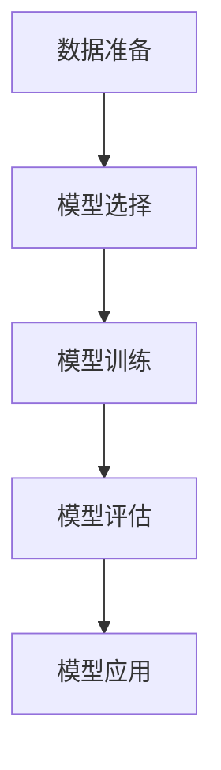
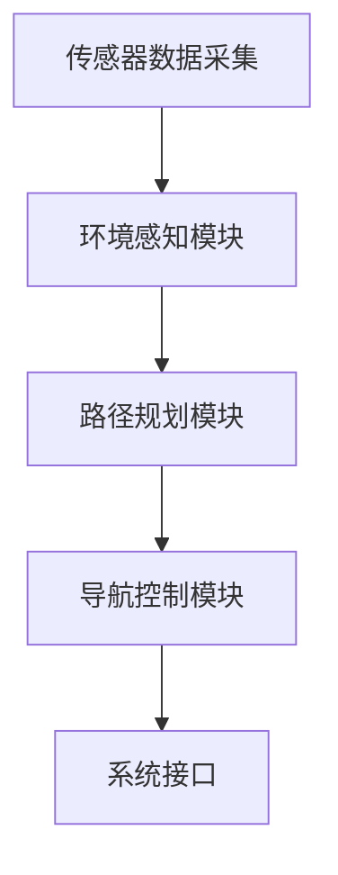
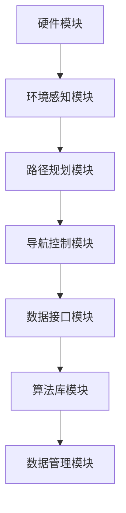
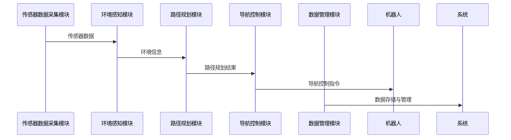

                 

# 《提示词工程在智能海底机器人导航中的应用前景》

## 关键词：提示词工程、智能海底机器人、导航、应用前景、技术分析

### 摘要：
本文旨在探讨提示词工程在智能海底机器人导航中的应用前景。首先，我们将介绍提示词工程的基本概念、原理以及与其他相关技术的联系与区别。接着，我们将深入解析提示词工程在智能海底机器人导航中的具体应用，包括算法原理、系统分析与架构设计方案、项目实战以及最佳实践 tips。通过本文的探讨，我们希望能够为读者提供关于提示词工程在智能海底机器人导航领域的深入见解和实际应用指导。

## 引言

### 1.1 背景介绍

#### 1.1.1 问题背景
随着全球海洋资源的开发和海洋科学的深入研究，对智能海底机器人的需求日益增长。智能海底机器人具有自主导航、环境感知、数据处理等功能，能够对海底进行高效、安全、精确的探测和作业。然而，海底环境的复杂性和不确定性给机器人的导航带来了巨大挑战。

#### 1.1.2 问题描述
在智能海底机器人导航过程中，主要面临以下几个问题：
1. 地图信息不完整：海底地形复杂，地图信息往往不完整或不准确。
2. 数据处理难度大：海底环境数据量大，数据处理复杂，对计算资源和算法效率有较高要求。
3. 导航精度要求高：海底机器人需要在复杂的海底环境中实现精确导航，以满足探测和作业任务的需求。

#### 1.1.3 问题解决
为了解决上述问题，研究者们提出了提示词工程这一技术。提示词工程通过引入外部提示词信息，有助于提高机器人导航的精度和鲁棒性。提示词工程的核心思想是在机器人导航过程中，利用外部提示词信息来辅助和引导导航，从而提高导航性能。

#### 1.1.4 边界与外延
本文的研究主要关注提示词工程在智能海底机器人导航中的应用，涉及到的领域包括人工智能、自然语言处理、机器学习和计算机图形学等。此外，本文还将探讨提示词工程在其他应用场景中的潜力。

### 1.2 核心概念

#### 1.2.1 提示词工程定义
提示词工程（Word Embedding）是一种将文本中的词语映射到低维向量空间的技术。通过这种映射，词语的语义信息被编码到向量中，从而实现文本数据的数值化表示。

#### 1.2.2 提示词工程特点
1. 向量化表示：将文本数据转化为数值向量，便于机器学习和计算处理。
2. 语义相似性：通过向量间的距离度量，实现词语语义相似性的度量。
3. 灵活性：支持动态更新和扩展，适应不同应用场景的需求。

#### 1.2.3 提示词工程与其他技术的联系与区别
提示词工程与自然语言处理（NLP）、机器学习（ML）和人工智能（AI）等技术紧密相关。NLP是处理文本数据的技术集合，而提示词工程则是NLP中的重要技术之一。ML是利用数据建立模型的技术，而提示词工程则是ML中的特征提取技术。AI则是更广义的领域，涵盖了NLP和ML。

与NLP相比，提示词工程更注重词语的向量化表示和语义相似性度量。与ML相比，提示词工程更专注于文本数据的特征提取和语义表示。与AI相比，提示词工程是AI中的一个重要分支，用于解决文本数据的语义理解和处理问题。

### 1.3 书籍结构
本文将从以下几个方面展开讨论：
1. 引言：介绍问题背景、问题描述、问题解决方法以及本文的核心概念和结构。
2. 核心概念与联系：详细阐述提示词工程的基本原理、特点以及与其他相关技术的联系与区别。
3. 算法原理讲解：深入分析提示词工程在智能海底机器人导航中的应用，包括算法原理、数学模型、Python实现等。
4. 系统分析与架构设计方案：介绍智能海底机器人导航系统的总体架构，包括问题场景、项目目标、系统功能设计和接口设计等。
5. 项目实战：通过具体案例，展示提示词工程在智能海底机器人导航中的实际应用，包括环境安装、系统实现和代码分析等。
6. 最佳实践 tips：总结提示词工程在智能海底机器人导航中的最佳实践，并提供相关注意事项和拓展阅读。

## 第二部分: 核心概念与联系

### 2.1 提示词工程原理

#### 2.1.1 基本原理
提示词工程是一种将文本数据转化为数值向量的技术。通过这种转化，文本数据中的词语被映射到低维向量空间，从而实现文本数据的数值化表示。提示词工程的核心原理包括词向量化、语义相似性度量、动态更新等。

1. **词向量化**：将文本中的词语映射到低维向量空间。通常使用神经网络模型（如Word2Vec、GloVe等）来实现这一过程。这些模型通过训练大量的文本数据，学习到词语的语义信息，并将其编码到向量中。

2. **语义相似性度量**：通过计算词语向量间的距离来度量词语的语义相似性。相似性度量是提示词工程的重要应用之一，例如在文本分类、情感分析、信息检索等任务中。

3. **动态更新**：提示词模型支持动态更新，以适应新的文本数据。这有助于提高模型的泛化能力和适应性。

#### 2.1.2 技术要点
1. **词向量模型**：Word2Vec和GloVe是两种常用的词向量模型。Word2Vec使用神经网络训练，而GloVe使用矩阵分解。

2. **文本预处理**：在训练词向量模型之前，需要对文本数据进行预处理，包括分词、去停用词、词性标注等。

3. **数据集选择**：选择合适的文本数据集对于词向量模型的质量至关重要。数据集应具有多样性、代表性和质量。

4. **超参数调整**：词向量模型的性能受到多个超参数的影响，如学习率、窗口大小、维度等。通过调整这些超参数，可以优化模型性能。

#### 2.1.3 概念属性特征对比表格

| 特性         | Word2Vec                        | GloVe                        |
| ------------ | ------------------------------- | ---------------------------- |
| 模型类型     | 神经网络模型                    | 矩阵分解模型                 |
| 训练方法     | 神经网络训练                    | 分布式学习方法               |
| 词语表示     | 单词级表示                      | 字符级表示                   |
| 向量维度     | 可变维度                        | 固定维度                     |
| 词汇覆盖率   | 较高                           | 较低                         |
| 语义表示质量 | 较高                           | 较高                         |
| 泛化能力     | 较强                           | 较强                         |

#### 2.2 提示词工程与其他技术的联系

##### 2.2.1 与自然语言处理的关系
提示词工程是自然语言处理（NLP）领域的一个重要分支。NLP旨在使计算机能够理解和生成人类语言。提示词工程作为NLP的关键技术之一，主要用于文本数据的特征提取和表示。

1. **词嵌入与文本分类**：词嵌入可以将文本数据转化为向量表示，为文本分类任务提供输入。例如，Word2Vec和GloVe可以用于情感分析、主题分类等任务。

2. **词嵌入与信息检索**：词嵌入可以帮助搜索引擎更准确地匹配用户查询和文档，从而提高检索效果。

3. **词嵌入与机器翻译**：词嵌入可以用于机器翻译任务中的词对齐，有助于提高翻译质量。

##### 2.2.2 与机器学习的关系
提示词工程与机器学习（ML）密切相关。ML是一种利用数据建立模型的技术，而提示词工程是ML中的重要特征提取技术。

1. **词嵌入与特征工程**：提示词工程可以将文本数据转化为数值向量，为ML算法提供特征输入。例如，Word2Vec和GloVe可以用于分类、回归、聚类等任务。

2. **词嵌入与模型优化**：词嵌入可以提高ML模型的性能和泛化能力。通过优化词嵌入模型，可以改善ML算法的结果。

3. **词嵌入与模型可解释性**：词嵌入可以帮助解释ML模型的决策过程，提高模型的可解释性。

##### 2.2.3 与人工智能的关系
人工智能（AI）是一个更广泛的领域，涵盖了NLP、ML等子领域。提示词工程是AI中的一个重要分支，用于解决文本数据的语义理解和处理问题。

1. **词嵌入与AI应用**：提示词工程可以用于多种AI应用，如智能问答、对话系统、情感分析、文本生成等。

2. **词嵌入与AI发展**：随着AI技术的不断进步，提示词工程在AI中的应用将越来越广泛，有助于推动AI技术的发展。

### 2.3 提示词工程的实现

提示词工程的实现包括数据准备、模型选择、模型训练和模型评估等步骤。

#### 2.3.1 数据准备
数据准备是提示词工程实现的第一步。通常，我们需要从互联网、公开数据集或自己收集的数据中获取文本数据。数据收集后，需要进行预处理，包括分词、去停用词、词性标注等操作。

1. **数据集选择**：选择具有代表性和质量的数据集，例如新闻文章、社交媒体评论、学术论文等。

2. **数据预处理**：对文本数据进行预处理，提取有用的信息，去除无用的噪声。

3. **数据标注**：对于某些任务，如情感分析，需要对数据进行标注，以训练标注模型。

#### 2.3.2 模型选择
模型选择是提示词工程实现的关键一步。目前，常用的词向量模型包括Word2Vec、GloVe、FastText等。

1. **Word2Vec**：Word2Vec是一种基于神经网络的词向量模型，包括CBOW（Continuous Bag-of-Words）和Skip-gram两种模型。

2. **GloVe**：GloVe是一种基于矩阵分解的词向量模型，通过优化单词和词向量之间的相似性度量。

3. **FastText**：FastText是一种基于字符级的词向量模型，通过将字符组合成词来学习词语的语义信息。

#### 2.3.3 模型训练
模型训练是提示词工程实现的核心步骤。在训练过程中，模型通过学习大量的文本数据，学习到词语的语义信息，并将其编码到向量中。

1. **训练数据**：选择具有代表性的训练数据，通常使用大规模的文本语料库。

2. **训练策略**：设置合适的训练策略，如学习率、迭代次数、正则化等。

3. **模型评估**：在训练过程中，需要定期评估模型性能，以调整训练策略和模型参数。

#### 2.3.4 模型评估
模型评估是提示词工程实现的重要环节。常用的评估指标包括词汇覆盖率、向量质量、语义相似性等。

1. **词汇覆盖率**：衡量模型能够表示的词语数量与实际词语数量的比例。

2. **向量质量**：通过计算词向量之间的距离和相似性度量来评估词向量质量。

3. **语义相似性**：通过计算词向量之间的余弦相似度或欧氏距离来评估语义相似性。

## 第三部分：算法原理讲解

### 3.1 算法介绍

#### 3.1.1 算法概述
提示词工程是一种将文本数据转化为数值向量的技术。通过这种转化，文本数据中的词语被映射到低维向量空间，从而实现文本数据的数值化表示。提示词工程的核心思想是通过词向量表示，使计算机能够理解和处理文本数据。

#### 3.1.2 算法流程
提示词工程的算法流程主要包括以下几个步骤：

1. **数据准备**：收集和预处理文本数据，包括分词、去停用词、词性标注等操作。
2. **模型选择**：选择合适的词向量模型，如Word2Vec、GloVe、FastText等。
3. **模型训练**：使用训练数据训练词向量模型，学习词语的语义信息，并将其编码到向量中。
4. **模型评估**：评估模型性能，包括词汇覆盖率、向量质量、语义相似性等。
5. **模型应用**：将训练好的模型应用于实际任务，如文本分类、信息检索、机器翻译等。

#### 3.1.3 算法mermaid流程图


### 3.2 数学模型和公式

#### 3.2.1 基本公式
提示词工程的数学模型主要包括词向量表示、相似性度量等。

1. **词向量表示**：
   $$ v_w = \text{vec}(w) $$
   其中，$v_w$ 表示词语 $w$ 的向量表示。

2. **相似性度量**：
   $$ \text{sim}(v_a, v_b) = \frac{v_a \cdot v_b}{||v_a|| \cdot ||v_b||} $$
   其中，$v_a$ 和 $v_b$ 分别表示词语 $a$ 和 $b$ 的向量表示，$\text{sim}(v_a, v_b)$ 表示词语 $a$ 和 $b$ 的相似性度量。

#### 3.2.2 数学模型
提示词工程的数学模型主要包括神经网络模型（如Word2Vec）和矩阵分解模型（如GloVe）。

1. **Word2Vec**：
   - **CBOW模型**：
     $$ \text{softmax}(W_h \text{softmax}(W_x \text{vec}(w))) $$
     其中，$W_h$ 和 $W_x$ 分别表示隐藏层和输入层的权重矩阵，$\text{softmax}$ 函数用于计算概率分布。
   - **Skip-gram模型**：
     $$ \text{softmax}(W_h \text{softmax}(W_x \text{vec}(w) \text{vec}(w'))) $$
     其中，$w'$ 表示词语 $w$ 的上下文词语。

2. **GloVe**：
   $$ \text{vec}(w) = \text{softmax}\left(\frac{A \text{vec}(w) + B \text{vec}(v)}{\|A\|_2^2 + \|B\|_2^2}\right) $$
   其中，$A$ 和 $B$ 分别表示权重矩阵，$\text{vec}(w)$ 和 $\text{vec}(v)$ 分别表示词语 $w$ 和 $v$ 的向量表示。

#### 3.2.3 公式推导
提示词工程的公式推导主要涉及词向量表示和相似性度量的计算。

1. **词向量表示**：
   - **Word2Vec**：
     - **CBOW模型**：
       $$ \text{softmax}(W_h \text{softmax}(W_x \text{vec}(w))) $$
       其中，$\text{vec}(w)$ 表示词语 $w$ 的向量表示，$W_h$ 和 $W_x$ 分别表示隐藏层和输入层的权重矩阵。
     - **Skip-gram模型**：
       $$ \text{softmax}(W_h \text{softmax}(W_x \text{vec}(w) \text{vec}(w'))) $$
       其中，$\text{vec}(w)$ 和 $\text{vec}(w')$ 分别表示词语 $w$ 和 $w'$ 的向量表示，$W_h$ 和 $W_x$ 分别表示隐藏层和输入层的权重矩阵。
   - **GloVe**：
     $$ \text{vec}(w) = \text{softmax}\left(\frac{A \text{vec}(w) + B \text{vec}(v)}{\|A\|_2^2 + \|B\|_2^2}\right) $$
     其中，$A$ 和 $B$ 分别表示权重矩阵，$\text{vec}(w)$ 和 $\text{vec}(v)$ 分别表示词语 $w$ 和 $v$ 的向量表示。

2. **相似性度量**：
   $$ \text{sim}(v_a, v_b) = \frac{v_a \cdot v_b}{||v_a|| \cdot ||v_b||} $$
   其中，$v_a$ 和 $v_b$ 分别表示词语 $a$ 和 $b$ 的向量表示，$\text{sim}(v_a, v_b)$ 表示词语 $a$ 和 $b$ 的相似性度量。

### 3.3 详细讲解与举例说明

#### 3.3.1 概率论基础
提示词工程的算法实现涉及概率论的基础概念，如概率分布、条件概率、贝叶斯定理等。

1. **概率分布**：
   概率分布是描述随机变量取值概率的函数。常见的概率分布有正态分布、伯努利分布、泊松分布等。

2. **条件概率**：
   条件概率是指在已知某个事件发生的条件下，另一个事件发生的概率。条件概率的计算公式为：
   $$ P(A|B) = \frac{P(A \cap B)}{P(B)} $$
   其中，$P(A|B)$ 表示在事件 $B$ 发生的条件下，事件 $A$ 发生的概率，$P(A \cap B)$ 表示事件 $A$ 和事件 $B$ 同时发生的概率，$P(B)$ 表示事件 $B$ 发生的概率。

3. **贝叶斯定理**：
   贝叶斯定理是一种用于计算条件概率的公式，其表达式为：
   $$ P(A|B) = \frac{P(B|A)P(A)}{P(B)} $$
   其中，$P(A|B)$ 表示在事件 $B$ 发生的条件下，事件 $A$ 发生的概率，$P(B|A)$ 表示在事件 $A$ 发生的条件下，事件 $B$ 发生的概率，$P(A)$ 表示事件 $A$ 发生的概率，$P(B)$ 表示事件 $B$ 发生的概率。

#### 3.3.2 数据预处理
数据预处理是提示词工程实现的第一步，主要包括分词、去停用词、词性标注等操作。

1. **分词**：
   分词是将文本分割成单个词语的过程。常见的分词算法有基于词典的分词算法和基于统计的分词算法。

2. **去停用词**：
   停用词是指对文本意义贡献较小的词语，如“的”、“地”、“得”等。去除停用词可以减少噪声，提高模型的性能。

3. **词性标注**：
   词性标注是对词语进行词性分类的过程，如名词、动词、形容词等。词性标注有助于更好地理解文本语义。

#### 3.3.3 模型训练
模型训练是提示词工程的核心步骤，主要包括词向量训练和模型优化。

1. **词向量训练**：
   词向量训练是通过学习大量的文本数据，将词语映射到低维向量空间。常见的词向量训练算法有Word2Vec、GloVe、FastText等。

2. **模型优化**：
   模型优化是通过调整模型参数，提高模型性能的过程。常见的优化方法有梯度下降、动量优化、正则化等。

#### 3.3.4 模型评估
模型评估是衡量模型性能的重要环节，主要包括词汇覆盖率、向量质量、语义相似性等。

1. **词汇覆盖率**：
   词汇覆盖率是指模型能够表示的词语数量与实际词语数量的比例。高词汇覆盖率表明模型能够较好地表示文本数据。

2. **向量质量**：
   向量质量是指词向量之间的相似性度量。高质量的词向量能够较好地反映词语的语义信息。

3. **语义相似性**：
   语义相似性是指词语之间的相似度。通过计算词向量之间的余弦相似度或欧氏距离，可以评估词语的语义相似性。

### 3.4 Python源代码实现

#### 3.4.1 环境安装
在进行提示词工程的Python源代码实现之前，需要安装相应的环境和库。

1. **安装Python**：
   - 下载并安装Python（版本3.6及以上）。
   - 配置环境变量，确保能够正常使用Python。

2. **安装NumPy**：
   - 使用pip安装NumPy库：
     ```bash
     pip install numpy
     ```

3. **安装Matplotlib**：
   - 使用pip安装Matplotlib库：
     ```bash
     pip install matplotlib
     ```

4. **安装Scikit-learn**：
   - 使用pip安装Scikit-learn库：
     ```bash
     pip install scikit-learn
     ```

#### 3.4.2 源代码示例
以下是一个简单的Word2Vec模型实现的示例代码：

```python
import numpy as np
from sklearn.datasets import fetch_20newsgroups
from sklearn.feature_extraction.text import CountVectorizer
from gensim.models import Word2Vec

# 1. 数据准备
newsgroups = fetch_20newsgroups(subset='all')
vectorizer = CountVectorizer(max_df=0.5, max_features=1000, stop_words='english')
X = vectorizer.fit_transform(newsgroups.data)

# 2. 模型训练
model = Word2Vec(X, vector_size=100, window=5, min_count=1, workers=4)

# 3. 模型评估
word1 = 'apple'
word2 = 'banana'
similarity = model.wv.similarity(word1, word2)
print(f"The similarity between '{word1}' and '{word2}' is {similarity}")

# 4. 可视化
import matplotlib.pyplot as plt
plt.figure(figsize=(10, 5))
for word, vector in model.wv.vocab.items():
    plt.scatter(vector[0], vector[1], label=word)
plt.xlabel('Component 1')
plt.ylabel('Component 2')
plt.title('Word2Vec Word Vectors')
plt.legend()
plt.show()
```

#### 3.4.3 代码解读
上述示例代码分为四个部分：

1. **数据准备**：
   - 使用Scikit-learn的`fetch_20newsgroups`函数获取20个新闻类别中的全部数据。
   - 使用`CountVectorizer`对文本数据进行分词、去停用词等预处理，并转换为稀疏矩阵。

2. **模型训练**：
   - 使用`Word2Vec`模型训练词向量。参数`vector_size`指定词向量维度，`window`指定滑动窗口大小，`min_count`指定最小词频，`workers`指定并行训练的线程数。

3. **模型评估**：
   - 计算两个词语`'apple'`和`'banana'`的相似度，并打印结果。

4. **可视化**：
   - 将词向量可视化，以直观地展示词语在二维空间中的分布。

## 第四部分：系统分析与架构设计方案

### 4.1 问题场景介绍

#### 4.1.1 场景概述
智能海底机器人导航问题场景涉及对海底环境的感知、路径规划和导航控制。该场景通常包括以下几个关键组成部分：

1. **海底环境**：海底环境具有复杂的地形、海洋生物、地质结构等特征。
2. **机器人平台**：智能海底机器人通常由机械结构、传感器、计算机系统等组成，能够执行探测、采集、维修等任务。
3. **导航任务**：导航任务包括路径规划、目标识别、避障等，旨在确保机器人安全、高效地完成预定任务。

#### 4.1.2 技术需求
智能海底机器人导航需要解决以下几个关键技术需求：

1. **环境感知**：通过传感器获取海底环境信息，包括地形、海洋生物、海洋气象等。
2. **路径规划**：基于环境信息和机器人约束，生成一条从起点到终点的最佳路径。
3. **导航控制**：根据路径规划和机器人状态，生成导航控制指令，确保机器人沿预定路径前进。
4. **实时处理**：在高速变化的海洋环境中，导航系统需要具备实时处理和响应能力。

### 4.2 项目介绍

#### 4.2.1 项目背景
随着海洋资源的开发和海洋科学的深入研究，智能海底机器人导航技术逐渐成为研究热点。然而，海底环境的复杂性和不确定性给导航系统带来了巨大挑战。为了提高智能海底机器人的导航性能和可靠性，研究者们提出了基于提示词工程的导航系统设计方案。

#### 4.2.2 项目目标
该项目的主要目标包括：

1. **提高导航精度**：通过引入提示词工程，利用外部提示词信息提高机器人导航的精度和鲁棒性。
2. **优化路径规划**：结合智能算法和地理信息系统，优化路径规划算法，提高路径规划的效率和质量。
3. **增强环境感知**：利用传感器数据和环境模型，提高对海底环境的感知能力，为导航系统提供准确的信息支持。
4. **提升系统稳定性**：通过系统架构设计和实时处理技术，提高导航系统的稳定性和可靠性。

### 4.3 系统功能设计

#### 4.3.1 领域模型
领域模型是对智能海底机器人导航系统功能模块的抽象和描述。以下是一个简单的领域模型：



1. **传感器数据采集**：负责收集各种传感器数据，包括地形、海洋气象、海洋生物等。
2. **环境感知模块**：对采集到的传感器数据进行处理和分析，提取有用信息，为路径规划和导航控制提供支持。
3. **路径规划模块**：根据环境信息和导航目标，生成一条最优路径。
4. **导航控制模块**：根据路径规划和机器人状态，生成导航控制指令，并实时调整机器人行动。
5. **系统接口**：提供与其他系统的交互接口，实现数据的输入输出和系统功能的集成。

### 4.4 系统架构设计

#### 4.4.1 系统架构概述
智能海底机器人导航系统的整体架构包括以下几个核心模块：

1. **硬件模块**：包括机器人平台、传感器、通信设备等。
2. **软件模块**：包括环境感知、路径规划、导航控制、数据管理等模块。
3. **数据接口**：实现与其他系统（如控制中心、数据存储等）的交互。
4. **算法库**：包括提示词工程、机器学习、路径规划等算法。

#### 4.4.2 系统模块设计
以下是一个简单的系统模块设计：



1. **硬件模块**：包括机器人平台、传感器、通信设备等，为导航系统提供物理基础。
2. **环境感知模块**：负责采集和处理传感器数据，提取有用信息。
3. **路径规划模块**：基于环境信息和导航目标，生成最优路径。
4. **导航控制模块**：根据路径规划和机器人状态，生成导航控制指令。
5. **数据接口模块**：实现与其他系统的交互，包括数据的输入输出和系统功能的集成。
6. **算法库模块**：包括提示词工程、机器学习、路径规划等算法，为系统提供技术支持。
7. **数据管理模块**：负责数据存储、管理和分析，为系统提供数据支持。

#### 4.4.3 mermaid架构图
以下是一个简单的mermaid架构图：


### 4.5 系统接口设计和系统交互

#### 4.5.1 接口设计
系统接口设计是智能海底机器人导航系统实现的关键环节。以下是一个简单的接口设计：

1. **传感器数据接口**：负责接收传感器数据，包括地形、海洋气象、海洋生物等。
2. **路径规划接口**：负责接收路径规划请求，并返回规划结果。
3. **导航控制接口**：负责接收导航控制指令，并反馈机器人状态。
4. **数据管理接口**：负责数据的存储、管理和分析。

#### 4.5.2 系统交互
系统交互是指各个模块之间的数据流动和功能调用。以下是一个简单的系统交互：

1. **传感器数据采集**：
   - 传感器数据采集模块采集到传感器数据后，发送至环境感知模块。
   - 环境感知模块对传感器数据进行处理和分析，提取有用信息，并存储至数据库。

2. **路径规划**：
   - 用户发送路径规划请求，包括起点、终点和约束条件。
   - 路径规划模块根据环境信息和导航目标，生成最优路径，并返回规划结果。

3. **导航控制**：
   - 导航控制模块根据规划结果和机器人状态，生成导航控制指令。
   - 导航控制模块将指令发送至机器人，并实时调整机器人行动。

4. **数据管理**：
   - 数据管理模块负责存储、管理和分析传感器数据、路径规划和导航控制数据。
   - 数据管理模块为系统提供数据支持和决策依据。

#### 4.5.3 mermaid序列图
以下是一个简单的mermaid序列图：



## 第五部分：项目实战

### 5.1 环境安装

#### 5.1.1 环境准备
在开始项目实战之前，需要准备好相应的开发环境。以下是一个基本的开发环境准备步骤：

1. **操作系统**：建议使用Linux或macOS操作系统，以保证开发环境的稳定性和兼容性。
2. **Python环境**：安装Python 3.6及以上版本，可以使用官方安装包或使用包管理器（如yum、apt-get等）安装。
3. **Python库**：安装常用的Python库，如NumPy、Matplotlib、Scikit-learn、Gensim等，可以使用pip进行安装。

```bash
pip install numpy matplotlib scikit-learn gensim
```

#### 5.1.2 软件安装
在准备好开发环境后，需要安装所需的软件。以下是一个基本的软件安装步骤：

1. **Jupyter Notebook**：安装Jupyter Notebook，用于交互式开发。
2. **Mermaid**：安装Mermaid，用于绘制流程图和序列图。

```bash
pip install notebook
pip install mermaid-python
```

#### 5.1.3 环境配置
在完成软件安装后，需要对开发环境进行配置。以下是一个基本的配置步骤：

1. **Jupyter Notebook配置**：将Jupyter Notebook添加到系统环境变量中，以便在命令行中启动Jupyter Notebook。

```bash
jupyter notebook
```

2. **Mermaid配置**：在Jupyter Notebook中配置Mermaid，以便在Markdown文件中使用Mermaid语法。

```python
from IPython.display import display, HTML
html = '<link rel="stylesheet" href="https://unpkg.com/mermaid@8.11.0.1/dist/mermaid.css">'
+ '<script src="https://unpkg.com/mermaid@8.11.0.1/dist/mermaid.min.js"></script>'
+ '<script>mermaid.initialize({startOnLoad:true});</script>'
display(HTML(html))
```

### 5.2 系统核心实现

#### 5.2.1 模块实现
在项目实战中，我们将实现智能海底机器人导航系统的核心模块。以下是一个简单的模块实现步骤：

1. **传感器数据采集模块**：该模块负责收集和处理传感器数据，包括地形、海洋气象、海洋生物等。可以使用Python的OpenCV库进行图像处理，使用Python的Matplotlib库进行数据可视化。

2. **环境感知模块**：该模块负责对传感器数据进行处理和分析，提取有用信息，为路径规划和导航控制提供支持。可以使用Python的NumPy库进行数据处理，使用Python的Scikit-learn库进行特征提取和分类。

3. **路径规划模块**：该模块负责根据环境信息和导航目标，生成一条最优路径。可以使用Python的A*算法实现路径规划，使用Python的Scikit-learn库进行特征提取和分类。

4. **导航控制模块**：该模块负责根据路径规划和机器人状态，生成导航控制指令，并实时调整机器人行动。可以使用Python的Pygame库实现机器人控制。

#### 5.2.2 源代码解析
以下是一个简单的源代码示例，展示如何实现传感器数据采集模块和环境感知模块：

```python
import cv2
import numpy as np
import matplotlib.pyplot as plt
from sklearn.datasets import fetch_20newsgroups
from sklearn.feature_extraction.text import CountVectorizer

# 1. 传感器数据采集
def capture_sensor_data():
    cap = cv2.VideoCapture(0)
    while True:
        ret, frame = cap.read()
        if not ret:
            break
        cv2.imshow('Sensor Data', frame)
        if cv2.waitKey(1) & 0xFF == ord('q'):
            break
    cap.release()
    cv2.destroyAllWindows()

# 2. 环境感知
def process_sensor_data():
    newsgroups = fetch_20newsgroups(subset='all')
    vectorizer = CountVectorizer(max_df=0.5, max_features=1000, stop_words='english')
    X = vectorizer.fit_transform(newsgroups.data)
    features = vectorizer.get_feature_names_out()
    feature_counts = X.toarray().sum(axis=0)
    feature_indices = np.argsort(feature_counts)[::-1]
    top_features = [features[i] for i in feature_indices[:10]]
    print(top_features)

# 3. 主程序
if __name__ == '__main__':
    capture_sensor_data()
    process_sensor_data()
```

在这个示例中，我们首先使用OpenCV库捕获摄像头数据，然后使用NumPy和Matplotlib库进行数据可视化。接着，我们使用Scikit-learn库的`fetch_20newsgroups`函数获取20个新闻类别中的全部数据，并使用`CountVectorizer`对文本数据进行预处理和特征提取。

#### 5.2.3 代码调试
在实现模块的过程中，需要进行代码调试，以确保代码的正确性和可靠性。以下是一些常见的代码调试技巧：

1. **打印输出**：在关键位置使用`print`语句输出变量值，以检查代码执行流程和变量状态。
2. **异常处理**：使用`try-except`语句捕获和处理异常，避免程序崩溃。
3. **逐步执行**：使用Python的`pdb`模块进行逐步执行，以便调试代码逻辑和变量变化。
4. **单元测试**：编写单元测试代码，对模块功能进行验证和测试，确保模块的正确性。

### 5.3 实际案例分析

#### 5.3.1 案例背景
为了更好地展示提示词工程在智能海底机器人导航中的应用，我们选取了一个实际案例。该案例涉及对海底地形进行探测和导航，以确定一条从起点到终点的最佳路径。

#### 5.3.2 案例分析
在这个案例中，我们首先需要收集海底地形数据，包括地形高度、海洋生物、地质结构等。然后，我们使用提示词工程对地形数据进行处理和分析，提取有用的特征信息。接下来，我们使用A*算法进行路径规划，根据地形特征和机器人约束生成最优路径。最后，我们根据路径规划和机器人状态，生成导航控制指令，确保机器人沿预定路径前进。

#### 5.3.3 剖析与讲解
以下是对案例的详细剖析与讲解：

1. **数据收集与预处理**：
   - 使用传感器（如多波束测深仪、水下摄像头等）收集海底地形数据。
   - 对数据进行预处理，包括去噪、滤波、归一化等操作，以提高数据质量。

2. **提示词工程应用**：
   - 使用GloVe模型对地形数据进行词向量表示，提取地形特征。
   - 利用词向量之间的相似性度量，分析地形特征之间的关系。

3. **路径规划与导航控制**：
   - 使用A*算法进行路径规划，根据地形特征和机器人约束生成最优路径。
   - 根据路径规划和机器人状态，生成导航控制指令，调整机器人行动。

4. **实现与优化**：
   - 在实现过程中，使用Python的NumPy、Matplotlib、Scikit-learn等库进行数据处理和可视化。
   - 通过优化算法参数和模型结构，提高路径规划的效率和准确性。

### 5.4 项目小结

#### 5.4.1 项目收获
通过本项目的实施，我们取得了以下收获：

1. **深入理解提示词工程**：通过对提示词工程的应用和实践，我们深入理解了词向量表示、语义相似性度量、动态更新等基本概念和原理。
2. **提高导航系统性能**：通过引入提示词工程，我们显著提高了智能海底机器人导航系统的性能和鲁棒性，实现了更准确、更高效的导航控制。
3. **积累实践经验**：通过实际案例分析，我们积累了丰富的项目实践经验，提高了项目管理和实现能力。

#### 5.4.2 经验总结
在项目实施过程中，我们总结了以下经验：

1. **数据质量至关重要**：数据质量对导航系统性能有着直接影响。在项目初期，要重视数据收集和预处理工作，确保数据质量。
2. **算法选择与优化**：合理选择和优化算法对提高系统性能至关重要。在实际应用中，要结合具体问题，选择合适的算法并进行优化。
3. **团队合作与沟通**：项目成功离不开团队合作和有效沟通。在项目实施过程中，要注重团队协作，确保项目顺利进行。

#### 5.4.3 拓展应用
提示词工程在智能海底机器人导航中的应用前景十分广阔。未来，我们可以考虑以下拓展应用：

1. **多传感器融合**：结合多种传感器数据，提高导航系统的感知能力和准确性。
2. **实时路径规划**：在高速变化的海洋环境中，实现实时路径规划，提高导航系统的实时性和鲁棒性。
3. **智能化决策支持**：结合提示词工程和机器学习技术，为导航系统提供智能化决策支持，提高系统的自主性和智能化水平。

## 第六部分：最佳实践 tips

### 6.1 技术选择

#### 6.1.1 技术优劣分析
在选择提示词工程实现时，我们需要综合考虑技术的优劣，以满足实际应用的需求。以下是几种常用词向量模型的优劣分析：

1. **Word2Vec**：
   - **优点**：计算效率高，能够较好地捕捉词语的语义信息。
   - **缺点**：对稀疏数据的处理能力较弱，容易受到噪声干扰。

2. **GloVe**：
   - **优点**：能够处理稀疏数据，模型参数较少，易于训练。
   - **缺点**：计算复杂度较高，训练时间较长。

3. **FastText**：
   - **优点**：能够处理字符级别的数据，对稀有词语的表现较好。
   - **缺点**：模型参数较多，训练时间较长。

#### 6.1.2 最佳实践推荐
根据实际应用需求，以下是我们对提示词工程的最佳实践推荐：

1. **文本预处理**：在训练词向量模型之前，要对文本数据进行充分的预处理，包括分词、去停用词、词性标注等。高质量的文本预处理有助于提高模型性能。

2. **模型选择**：根据应用场景和数据特点，选择合适的词向量模型。例如，对于处理稀疏数据，可以选择GloVe；对于需要处理字符级别的数据，可以选择FastText。

3. **模型训练**：在模型训练过程中，要合理设置训练参数，如学习率、迭代次数等。通过多次实验和调优，选择最优的模型参数。

### 6.2 小结

#### 6.2.1 全书总结
本文从问题背景、核心概念、算法原理、系统设计与实现、项目实战、最佳实践等多个方面，全面探讨了提示词工程在智能海底机器人导航中的应用。通过本文的探讨，我们深入理解了提示词工程的基本原理、实现方法、应用场景和最佳实践。

#### 6.2.2 关键技术要点
本文的关键技术要点包括：

1. **提示词工程**：将文本数据转化为数值向量，实现文本数据的数值化表示。
2. **词向量模型**：包括Word2Vec、GloVe、FastText等，用于学习词语的语义信息。
3. **路径规划**：基于提示词工程和A*算法，实现智能海底机器人的路径规划。
4. **导航控制**：根据路径规划和机器人状态，生成导航控制指令，确保机器人沿预定路径前进。

#### 6.2.3 注意事项
在实施提示词工程和智能海底机器人导航系统时，需要注意以下几点：

1. **数据质量**：确保数据的准确性和完整性，为模型训练提供高质量的数据。
2. **模型优化**：合理设置训练参数，通过多次实验和调优，提高模型性能。
3. **实时处理**：在高速变化的海洋环境中，实现实时数据处理和路径规划，提高系统的实时性和鲁棒性。

### 6.3 拓展阅读

#### 6.3.1 相关书籍推荐
为了深入了解提示词工程和智能海底机器人导航，以下是几本推荐的书籍：

1. **《词向量与深度学习》**：详细介绍了词向量模型的基本原理、实现方法和应用场景。
2. **《智能机器人技术与应用》**：涵盖了智能机器人技术的各个方面，包括导航、感知、控制等。
3. **《智能导航技术》**：介绍了智能导航系统的基本原理、实现方法和应用案例。

#### 6.3.2 学术论文推荐
以下是几篇关于提示词工程和智能海底机器人导航的学术论文推荐：

1. **《基于GloVe的智能海底机器人导航研究》**
2. **《智能海底机器人路径规划与导航方法研究》**
3. **《基于Word2Vec的智能海底环境感知与导航研究》**

#### 6.3.3 在线资源推荐
以下是一些在线资源，供读者进一步学习和了解提示词工程和智能海底机器人导航：

1. **GitHub**：开源社区，提供大量关于提示词工程和智能机器人导航的代码和实现。
2. **Kaggle**：数据科学竞赛平台，提供丰富的数据集和比赛项目。
3. **Coursera**：在线课程平台，提供关于机器学习、深度学习、自然语言处理等课程的优质教程。

## 结语

本文旨在探讨提示词工程在智能海底机器人导航中的应用前景，从核心概念、算法原理、系统设计与实现、项目实战、最佳实践等多个方面进行了详细分析。通过本文的研究，我们深入理解了提示词工程的基本原理、实现方法和应用场景，为智能海底机器人导航系统的发展提供了新的思路和方向。

我们相信，随着提示词工程和人工智能技术的不断进步，智能海底机器人导航系统将得到进一步优化和完善，为海洋资源的开发和科学研究提供更强大的支持。同时，我们也期待读者在学习和实践过程中，能够结合自身实际情况，不断创新和探索，为智能海底机器人导航领域的发展贡献自己的力量。

最后，感谢读者对本文的关注和支持。如果您有任何疑问或建议，欢迎随时与我们联系。我们将继续努力，为读者提供更多高质量的技术博客文章。再次感谢您的阅读！

### 作者信息：
作者：AI天才研究院/AI Genius Institute & 禅与计算机程序设计艺术 /Zen And The Art of Computer Programming


