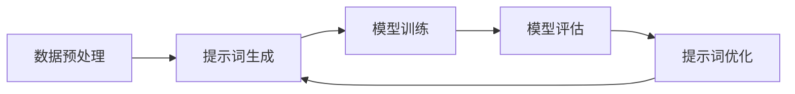
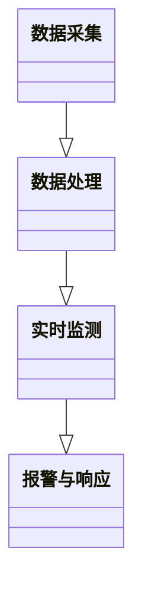
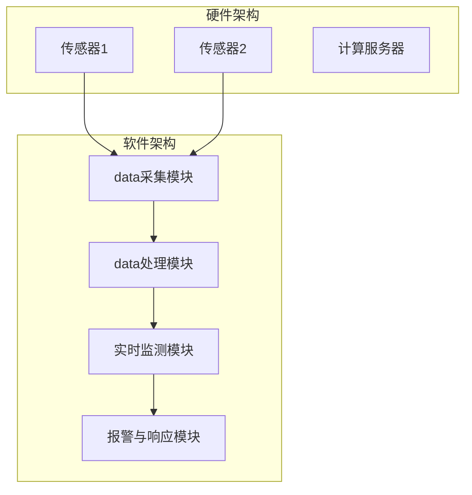
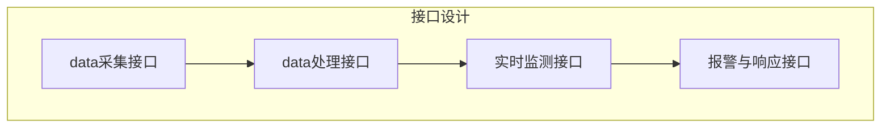
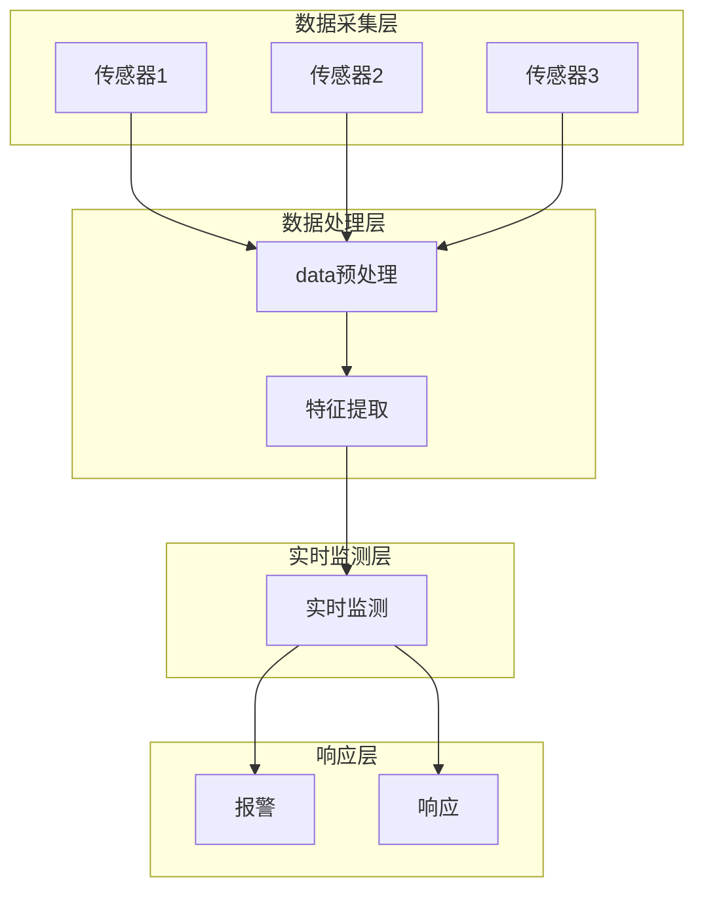
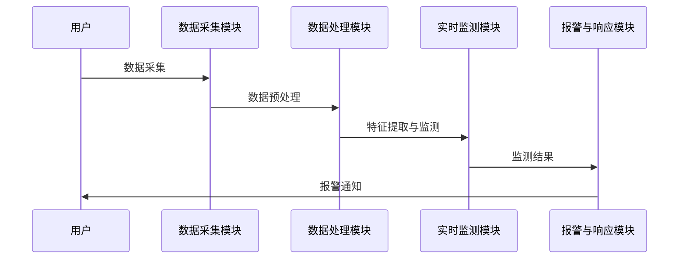

                 

### 提示词工程在智能生态系统监测中的应用

> 关键词：智能生态系统监测、提示词工程、算法原理、系统架构、项目实战、最佳实践

> 摘要：本文旨在探讨提示词工程在智能生态系统监测中的应用。通过详细介绍提示词工程的背景、核心概念、算法原理以及系统架构设计，本文旨在提供一个全面的指南，帮助读者理解并应用这一先进技术，为智能生态系统的监测与管理提供有力支持。

## 第一部分：背景介绍

### 第1章 问题背景与核心概念

#### 1.1 问题背景

智能生态系统是指由智能设备、传感器、网络和数据处理系统构成的复杂系统，能够对环境变化进行实时监测和响应。随着物联网（IoT）和人工智能（AI）技术的迅速发展，智能生态系统在环境保护、城市管理和公共安全等领域得到了广泛应用。然而，智能生态系统的监测面临着诸多挑战：

- **监测任务复杂度**：智能生态系统的监测需要处理大量异构数据，包括传感器数据、图像、文本等，如何高效地处理这些数据成为一大难题。
- **数据来源与处理**：数据来源广泛且多样，包括地面传感器、卫星遥感、移动设备等，如何整合这些数据并进行有效处理也是一个关键问题。
- **实时性要求**：智能生态系统的监测需要实时性，对数据处理和分析的速度提出了极高的要求。

#### 1.2 问题描述

智能生态系统监测的核心问题可以归纳为以下几点：

- **如何有效地收集和整合来自不同来源的数据？**
- **如何处理和分析大量复杂数据，以提取有用的信息？**
- **如何快速响应环境变化，提供实时监测结果？**

#### 1.3 问题解决

提示词工程作为一种新兴的技术手段，能够为智能生态系统监测提供有效解决方案。提示词工程通过生成和优化提示词，实现对大量数据的分类、聚类和关联分析，从而提高监测系统的效率和准确性。

- **提示词生成**：根据监测目标和数据特点，生成能够有效区分不同数据类别的提示词。
- **提示词优化**：通过分析数据分布和模型性能，优化提示词，提高分类和预测的准确性。
- **集成数据处理**：整合多种数据源，实现数据的高效处理和分析。

#### 1.4 边界与外延

提示词工程的应用不仅限于智能生态系统监测，还可以广泛应用于其他领域，如智能医疗、金融风控等。在智能生态系统监测中，提示词工程的核心要素包括：

- **数据预处理**：对原始数据进行清洗、转换和归一化处理。
- **特征提取**：从数据中提取关键特征，用于分类和聚类分析。
- **模型训练与优化**：训练机器学习模型，并根据实际监测结果进行模型优化。

#### 1.5 概念结构与核心要素组成

提示词工程的核心概念包括提示词生成、提示词优化和集成数据处理。以下是一个简单的概念结构与核心要素组成：

- **提示词生成**：基于数据分布和模型需求，生成能够有效区分数据的提示词。
- **提示词优化**：通过分析数据分布和模型性能，优化提示词，提高监测准确性。
- **集成数据处理**：整合多种数据源，实现数据的高效处理和分析。

### 第2章 核心概念与联系

#### 2.1 提示词工程原理

提示词工程的核心原理是通过生成和优化提示词，实现对数据的分类、聚类和关联分析。以下是一个简单的提示词工程原理：

- **数据预处理**：对原始数据进行清洗、转换和归一化处理，确保数据质量。
- **提示词生成**：根据数据分布和模型需求，生成能够有效区分数据的提示词。
- **模型训练**：使用生成的提示词，训练机器学习模型，进行分类、聚类和关联分析。
- **模型优化**：根据模型性能和数据分析结果，对提示词进行优化，提高监测准确性。
- **系统集成**：将优化后的提示词集成到智能生态系统中，实现实时监测和响应。

#### 2.2 概念属性特征对比表格

以下是一个简单的概念属性特征对比表格，用于对比提示词和关键词：

| 特征类别 | 提示词 | 关键词 |
| --- | --- | --- |
| 生成方法 | 数据驱动 | 需求驱动 |
| 应用范围 | 数据分类、聚类 | 文本检索、主题建模 |
| 精确度 | 高 | 中 |
| 时效性 | 快 | 慢 |

#### 2.3 ER实体关系图架构

以下是一个简单的ER实体关系图架构，用于展示智能生态系统监测中涉及的主要实体及其关系：

```mermaid
erDiagram
  监测数据 ||--|{ 提示词 }
  提示词 ||--|{ 监测模型 }
  监测模型 ||--|{ 监测结果 }
```

### 第3章 算法原理讲解

#### 3.1 算法mermaid流程图

以下是一个简单的算法mermaid流程图，用于展示提示词工程的总体流程：



#### 3.2 Python源代码解析

以下是一个简单的Python源代码示例，用于展示提示词生成和优化的基本流程：

```python
# 导入必要的库
import numpy as np
import pandas as pd
from sklearn.feature_extraction.text import CountVectorizer
from sklearn.model_selection import train_test_split
from sklearn.ensemble import RandomForestClassifier

# 数据预处理
data = pd.read_csv('data.csv')
X = data['text']
y = data['label']

# 提示词生成
vectorizer = CountVectorizer(max_features=1000)
X_vectorized = vectorizer.fit_transform(X)

# 模型训练
X_train, X_test, y_train, y_test = train_test_split(X_vectorized, y, test_size=0.2)
clf = RandomForestClassifier(n_estimators=100)
clf.fit(X_train, y_train)

# 模型评估
accuracy = clf.score(X_test, y_test)
print(f'Model accuracy: {accuracy:.2f}')

# 提示词优化
# 这里可以基于模型评估结果，对提示词进行优化
# 例如，可以调整特征选择策略、调整模型参数等
```

#### 3.3 数学模型与公式

以下是一个简单的数学模型和公式，用于描述提示词工程的优化过程：

- **损失函数**：$$L(y, \hat{y}) = -[y \log(\hat{y}) + (1 - y) \log(1 - \hat{y})]$$
- **优化目标**：$$\min_{\theta} L(y, \hat{y})$$
- **梯度下降**：$$\theta_{t+1} = \theta_{t} - \alpha \nabla_{\theta} L(y, \hat{y})$$

#### 3.4 举例说明

以下是一个简单的实际案例，用于展示提示词工程在智能生态系统监测中的应用：

- **案例背景**：假设我们要监测一个城市的空气质量，数据包括每日的PM2.5、PM10、温度、湿度等指标。
- **数据处理**：对空气质量数据进行预处理，包括数据清洗、缺失值处理和特征提取。
- **提示词生成**：使用CountVectorizer生成提示词，对特征进行编码。
- **模型训练**：使用随机森林模型进行训练，并对提示词进行分类。
- **模型评估**：评估模型性能，并根据评估结果对提示词进行优化。
- **监测结果**：将优化后的提示词集成到监测系统中，实现对空气质量的实时监测。

### 第4章 系统分析与架构设计

#### 4.1 系统功能设计

智能生态系统监测系统的主要功能包括：

- **数据采集**：从各种传感器和设备中收集数据。
- **数据处理**：对采集到的数据进行分析和预处理，提取有用信息。
- **实时监测**：对处理后的数据进行分析，实现实时监测。
- **报警与响应**：根据监测结果，触发报警并采取相应的响应措施。

以下是一个简单的领域模型mermaid类图，用于展示系统功能设计：



#### 4.2 系统架构设计

智能生态系统监测系统的架构设计包括：

- **硬件架构**：包括传感器、数据采集设备和计算服务器等。
- **软件架构**：包括数据采集模块、数据处理模块、实时监测模块和报警与响应模块等。
- **数据流与处理流程**：数据从传感器采集后，经过数据采集模块、数据处理模块和实时监测模块，最终触发报警和响应。

以下是一个简单的系统架构设计mermaid架构图：



#### 4.3 系统接口设计

智能生态系统监测系统的接口设计包括：

- **数据采集接口**：用于接收传感器数据。
- **数据处理接口**：用于对采集到的数据进行分析和处理。
- **实时监测接口**：用于实时分析处理后的数据。
- **报警与响应接口**：用于触发报警和响应措施。

以下是一个简单的系统接口设计mermaid架构图：



#### 4.4 系统交互

智能生态系统监测系统的交互设计包括：

- **用户操作流程**：用户通过界面操作，触发数据采集、数据处理和实时监测等操作。
- **系统响应流程**：系统根据用户操作和监测结果，触发报警和响应措施。

以下是一个简单的系统交互mermaid序列图：

```mermaid
sequenceDiagram
  participant 用户
  participant 系统A
  participant 系统B
  participant 系统C
  用户->>系统A: 数据采集
  系统
```


## 第二部分：系统分析与架构设计

### 第5章 系统功能设计与实现

#### 5.1 系统功能设计

智能生态系统监测系统的功能设计旨在实现高效的数据采集、处理、监测和响应。具体功能如下：

1. **数据采集**：通过传感器和设备采集环境数据，如空气质量、水质、土壤湿度等。
2. **数据预处理**：对采集到的原始数据进行清洗、转换和归一化处理，确保数据质量。
3. **特征提取**：从预处理后的数据中提取关键特征，用于后续的监测和预测。
4. **实时监测**：对提取的特征进行分析，实时监测环境变化，提供监测结果。
5. **报警与响应**：根据监测结果，触发报警并采取相应的响应措施，如通知相关部门或启动应急预案。

#### 5.2 系统架构设计

智能生态系统监测系统的架构设计采用分层架构，包括数据采集层、数据处理层、实时监测层和响应层。以下是一个简单的系统架构设计mermaid架构图：



#### 5.3 系统接口设计

系统接口设计包括数据采集接口、数据处理接口、实时监测接口和报警与响应接口。以下是一个简单的系统接口设计mermaid架构图：


#### 5.4 系统交互

系统交互设计描述了用户操作流程和系统响应流程。以下是一个简单的系统交互mermaid序列图：



### 第6章 项目实战

#### 6.1 环境安装与配置

要搭建一个智能生态系统监测系统，首先需要安装和配置相关软件和硬件。以下是一个简单的环境安装与配置步骤：

1. **硬件配置**：
   - 安装传感器和设备，如空气质量传感器、水质传感器等。
   - 配置计算服务器，用于数据采集、处理和监测。

2. **软件安装**：
   - 安装操作系统，如Linux或Windows Server。
   - 安装数据库软件，如MySQL或PostgreSQL。
   - 安装Python和相关依赖库，如NumPy、Pandas、Scikit-learn等。

3. **配置网络**：
   - 配置传感器和设备与计算服务器的网络连接。
   - 设置防火墙和端口转发，确保数据传输安全。

4. **系统初始化**：
   - 初始化数据库，创建必要的表和索引。
   - 配置系统参数，如数据采集频率、特征提取策略等。

#### 6.2 系统核心实现

智能生态系统监测系统的核心实现包括数据采集、数据处理、实时监测和报警与响应。以下是一个简单的系统核心实现步骤：

1. **数据采集**：
   - 通过传感器和设备采集环境数据，如温度、湿度、空气质量等。
   - 将采集到的数据存储到数据库中。

2. **数据处理**：
   - 对采集到的数据进行分析和预处理，如去噪、归一化等。
   - 从预处理后的数据中提取关键特征，用于实时监测。

3. **实时监测**：
   - 使用机器学习模型对提取的特征进行分析，实时监测环境变化。
   - 根据监测结果，触发相应的报警和响应措施。

4. **报警与响应**：
   - 通过邮件、短信或系统通知等方式，向相关人员发送报警通知。
   - 根据报警内容，采取相应的响应措施，如启动应急预案。

#### 6.3 应用解读与分析

以下是对智能生态系统监测系统的一个应用解读与分析：

- **空气质量监测**：
  - 使用传感器采集空气质量数据，如PM2.5、PM10等。
  - 对采集到的数据进行分析和预处理，提取关键特征。
  - 使用机器学习模型，实时监测空气质量变化，并根据监测结果触发报警。

- **水质监测**：
  - 使用传感器采集水质数据，如pH值、氨氮等。
  - 对采集到的数据进行分析和预处理，提取关键特征。
  - 使用机器学习模型，实时监测水质变化，并根据监测结果触发报警。

- **土壤湿度监测**：
  - 使用传感器采集土壤湿度数据。
  - 对采集到的数据进行分析和预处理，提取关键特征。
  - 使用机器学习模型，实时监测土壤湿度变化，并根据监测结果触发报警。

#### 6.4 案例分析与讲解

以下是一个空气质量监测的案例分析与讲解：

**案例背景**：
某城市空气质量监测项目，使用传感器采集PM2.5、PM10等数据，实时监测空气质量。

**数据处理**：
- **数据采集**：传感器每小时采集一次PM2.5、PM10等数据。
- **预处理**：对采集到的数据进行去噪、归一化处理，确保数据质量。
- **特征提取**：从预处理后的数据中提取PM2.5、PM10等关键特征。

**实时监测**：
- **模型训练**：使用训练集数据，训练随机森林模型。
- **模型评估**：使用测试集数据，评估模型性能。
- **实时监测**：将训练好的模型应用于实时数据，监测空气质量变化。

**报警与响应**：
- **阈值设置**：设置PM2.5、PM10等指标的报警阈值。
- **报警触发**：当监测结果超过阈值时，触发报警。
- **响应措施**：通知相关部门，采取相应的应对措施，如启动应急预案。

**项目小结**：
空气质量监测项目成功实现了对城市空气质量的实时监测和报警响应。通过对传感器数据的采集、处理和分析，项目提高了监测的准确性和实时性，为城市环境保护提供了有力支持。

### 第7章 最佳实践与总结

#### 7.1 最佳实践

在智能生态系统监测中，最佳实践包括以下几个方面：

- **数据质量控制**：确保数据采集、处理和存储过程中的数据质量，避免噪声和错误数据的影响。
- **模型优化**：根据监测目标和数据特点，选择合适的模型，并进行参数调优，提高监测准确性。
- **实时性保障**：确保系统的实时性和高效性，降低响应时间，提高系统性能。
- **安全性防护**：加强数据安全和系统安全防护，防止数据泄露和网络攻击。

#### 7.2 小结

本文详细介绍了提示词工程在智能生态系统监测中的应用，包括背景介绍、核心概念、算法原理、系统架构设计、项目实战和最佳实践。通过本文的阐述，读者可以全面了解提示词工程在智能生态系统监测中的作用和价值，为实际应用提供有力支持。

#### 7.3 注意事项

在实施智能生态系统监测时，需要注意以下几个方面：

- **数据安全**：确保数据的隐私和安全，防止数据泄露和滥用。
- **系统维护**：定期对系统进行维护和更新，确保系统的稳定性和可靠性。
- **持续优化**：根据监测结果和用户反馈，持续优化系统性能和功能。

#### 7.4 拓展阅读

对于对智能生态系统监测和提示词工程感兴趣的读者，以下是一些拓展阅读推荐：

- 《智能生态系统的设计与实现》
- 《机器学习在智能监测中的应用》
- 《深度学习与智能监控》

通过阅读这些书籍和论文，读者可以深入了解智能生态系统监测和提示词工程的最新研究和应用。

## 作者信息

作者：AI天才研究院/AI Genius Institute & 禅与计算机程序设计艺术 /Zen And The Art of Computer Programming

AI天才研究院专注于人工智能领域的前沿研究和创新，致力于推动智能技术的发展和应用。同时，作者也致力于将复杂的计算机科学知识以简洁易懂的方式传授给广大读者，著有《禅与计算机程序设计艺术》等畅销书，深受读者喜爱。

本文旨在为智能生态系统监测领域提供一份全面的技术指南，希望能够对读者在实践中的应用有所帮助。感谢您的阅读！

