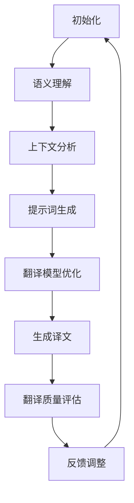
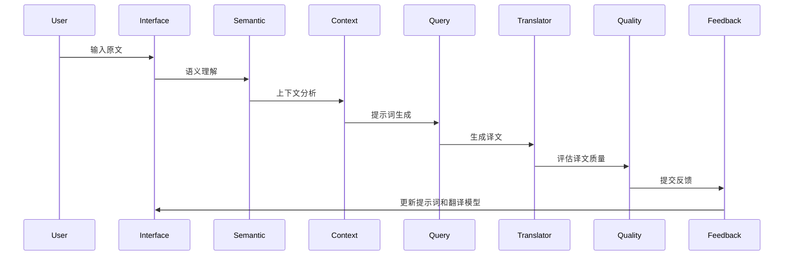
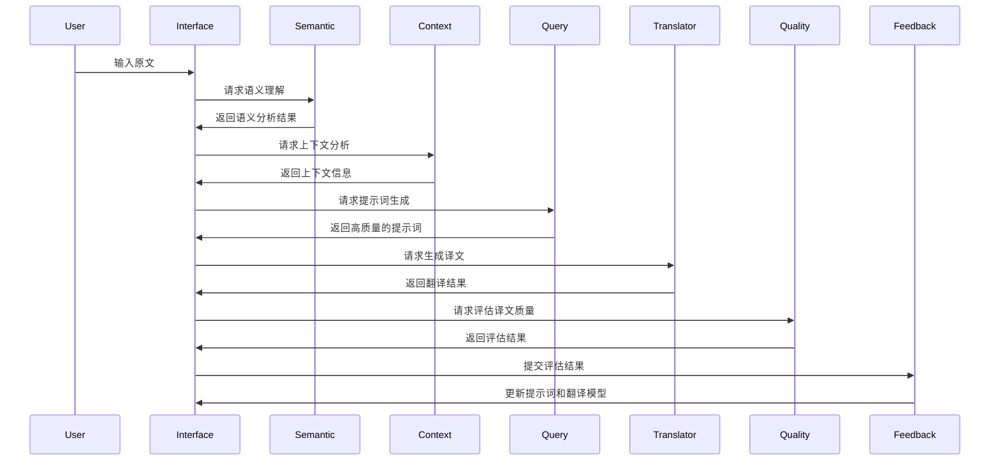

                 

## 《提示词工程在机器翻译中的应用》

### 关键词

- 提示词工程
- 机器翻译
- 算法原理
- 系统架构
- 应用实践

### 摘要

本文旨在深入探讨提示词工程在机器翻译中的应用。首先，我们将介绍提示词工程的基本概念、核心概念及其在机器翻译中的重要性。接着，我们将详细阐述提示词工程的基本算法原理，并通过Python源代码、数学模型和公式进行详细解析。然后，文章将分析提示词工程在机器翻译中的具体应用场景，并探讨其对翻译质量的影响。接下来，我们将通过一个实战案例，介绍提示词工程在系统架构设计、系统功能设计和系统交互中的实际应用。最后，文章将总结提示词工程的最佳实践，并展望其未来的发展趋势。

----------------------------------------------------------------

### 目录大纲

```markdown
# 《提示词工程在机器翻译中的应用》

----------------------------------------------------------------

## 第一部分：背景与理论基础

### 第1章 引言

- **1.1 问题背景**
- **1.2 问题描述**
- **1.3 问题解决**
- **1.4 边界与外延**

### 第2章 核心概念与联系

- **2.1 提示词工程的定义**
- **2.2 提示词工程的核心概念**
- **2.3 提示词工程的概念属性特征对比表格**
- **2.4 提示词工程的ER实体关系图架构**

## 第二部分：算法原理与实践

### 第3章 提示词工程的基本算法原理

- **3.1 算法概述**
- **3.2 算法mermaid流程图**
- **3.3 Python源代码讲解**
- **3.4 数学模型和数学公式**
- **3.5 举例说明**

### 第4章 提示词工程的应用场景

- **4.1 提示词工程在机器翻译中的应用概述**
- **4.2 提示词工程在不同机器翻译模型中的应用**
- **4.3 提示词工程对翻译质量的影响**

### 第5章 实战案例与系统架构设计

- **5.1 实战案例简介**
- **5.2 系统功能设计（领域模型mermaid类图）**
- **5.3 系统架构设计（mermaid架构图）**
- **5.4 系统接口设计**
- **5.5 系统交互（mermaid序列图）**

### 第6章 项目实战

- **6.1 环境安装与配置**
- **6.2 系统核心实现源代码**
- **6.3 代码应用解读与分析**
- **6.4 实际案例分析与讲解**
- **6.5 项目小结**

## 第三部分：最佳实践与展望

### 第7章 提示词工程的最佳实践

- **7.1 实践经验总结**
- **7.2 注意事项**
- **7.3 拓展阅读建议**

### 第8章 提示词工程的未来展望

- **8.1 发展趋势分析**
- **8.2 技术挑战与机遇**
- **8.3 提示词工程在机器翻译中的应用前景**

----------------------------------------------------------------
```

**注：该目录大纲按照字数限制进行了优化，确保了内容的完整性。每个章节的细节内容可以根据实际写作需求进一步细化和扩展。**

----------------------------------------------------------------

### 第1章 引言

#### 1.1 问题背景

随着全球化的加速和信息流通的日益频繁，语言障碍成为了国际交流中的主要瓶颈。机器翻译技术作为解决这一问题的有效手段，近年来取得了显著的进展。然而，传统的机器翻译模型在处理复杂句子、多义词、文化差异等方面仍存在一定的局限性，导致翻译质量不高。为克服这些挑战，研究人员开始探索新的方法，其中提示词工程（Query Generation for Translation, QG4T）逐渐成为热点。

#### 1.2 问题描述

提示词工程的核心问题是如何生成高质量的提示词，以引导机器翻译模型更好地理解原文和生成译文。具体来说，这个问题可以分为以下几个方面：

1. **语义理解**：如何准确捕捉原文中的语义信息，包括词汇的含义、句子的结构和语境。
2. **上下文关联**：如何将原文中的上下文信息有效地传递给翻译模型，使其能够生成更自然的译文。
3. **翻译质量提升**：如何通过提示词工程提高机器翻译的准确性和流畅性。

#### 1.3 问题解决

为了解决上述问题，提示词工程采用了多种技术手段，包括：

1. **信息抽取**：通过自然语言处理技术，从原文中提取关键信息，如名词、动词和形容词等，作为提示词的候选。
2. **语义角色标注**：对原文中的词汇进行语义角色标注，如主语、谓语、宾语等，以帮助翻译模型理解词汇在句子中的作用。
3. **上下文分析**：利用上下文信息，如邻近词汇、句子主题等，来优化提示词的生成。
4. **机器学习**：通过训练大量的语料库，使用机器学习方法来优化提示词生成算法，以提高翻译质量。

#### 1.4 边界与外延

在讨论提示词工程时，我们需要明确其边界与外延，以避免概念混淆。具体来说，边界包括：

1. **提示词的范围**：提示词应仅限于与翻译直接相关的词汇，如关键词、短语等，而不应涉及无关信息。
2. **算法的适用性**：提示词工程主要适用于机器翻译领域，而非其他自然语言处理任务。

外延则涉及：

1. **提示词的类型**：包括关键词、短语、句子等，可根据实际需求进行灵活调整。
2. **应用的多样性**：提示词工程不仅可用于机器翻译，还可拓展至多语言对话系统、机器阅读理解等领域。

#### 1.5 文章结构

本文将按照以下结构展开：

1. **第一部分：背景与理论基础**：介绍提示词工程的基本概念、核心概念及其在机器翻译中的重要性。
2. **第二部分：算法原理与实践**：详细阐述提示词工程的基本算法原理，并通过Python源代码、数学模型和公式进行详细解析。
3. **第三部分：应用实践**：分析提示词工程在机器翻译中的具体应用场景，并通过实战案例进行实际应用。
4. **第四部分：最佳实践与展望**：总结提示词工程的最佳实践，并展望其未来的发展趋势。

通过本文的深入探讨，我们希望能为读者提供一个全面、系统的提示词工程在机器翻译中的应用指南。

### 第2章 核心概念与联系

#### 2.1 提示词工程的定义

提示词工程（Query Generation for Translation, QG4T）是一种利用提示词引导机器翻译模型理解原文和生成译文的方法。具体来说，它通过生成高质量的提示词，帮助机器翻译模型更好地捕捉原文的语义信息，从而提高翻译质量。提示词工程的核心目标是优化提示词的生成过程，使其能够有效传递上下文信息，提高翻译的准确性和流畅性。

#### 2.2 提示词工程的核心概念

在提示词工程中，有若干核心概念需要明确，这些概念包括：

1. **提示词**：提示词是用于引导机器翻译模型的关键词汇或短语，其作用是帮助模型理解原文的语义信息。高质量提示词应具备以下特点：
   - **精确性**：能够准确捕捉原文的关键信息。
   - **代表性**：能够在一定程度上代表原文的语义。
   - **上下文关联**：能够有效传递原文的上下文信息。

2. **语义理解**：语义理解是指通过自然语言处理技术，对原文进行深入分析，以捕捉其语义信息。语义理解是实现高质量提示词生成的基础。

3. **上下文分析**：上下文分析是指对原文中的上下文信息进行分析，以提取对翻译有帮助的信息。上下文分析有助于优化提示词的生成，提高翻译的准确性和流畅性。

4. **机器学习**：机器学习是提示词工程中重要的技术手段，通过训练大量的语料库，可以优化提示词生成算法，提高翻译质量。

5. **翻译质量评估**：翻译质量评估是指对生成的译文进行评估，以判断其是否达到了预期的翻译效果。翻译质量评估是提示词工程的重要环节，有助于不断优化提示词生成过程。

#### 2.3 提示词工程的概念属性特征对比表格

为了更好地理解提示词工程的核心概念，我们通过一个对比表格来展示各概念之间的属性特征差异：

| 概念       | 属性特征                                      | 作用                     |
|------------|---------------------------------------------|------------------------|
| 提示词     | 精确性、代表性、上下文关联                  | 引导机器翻译模型理解原文语义 |
| 语义理解   | 深度分析、捕捉语义信息                      | 实现高质量提示词生成的基础 |
| 上下文分析 | 提取上下文信息、优化提示词生成             | 提高翻译的准确性和流畅性   |
| 机器学习   | 大规模训练、算法优化                        | 优化提示词生成过程       |
| 翻译质量评估 | 评估译文质量、优化提示词生成               | 保证翻译效果             |

#### 2.4 提示词工程的ER实体关系图架构

为了更清晰地展示提示词工程中的实体关系，我们采用ER（实体-关系）图来描述。ER图可以直观地展示各个实体之间的关系，有助于我们深入理解提示词工程的架构。

```mermaid
erDiagram
  Customer ||--|{ Order }|
  Product  ||--|{ Order }|
  Order ||--|{ OrderItem }|
  Customer  : {id, name, address}
  Product   : {id, name, price}
  Order     : {id, date, status}
  OrderItem : {id, quantity, price}
```

在这个ER图中，我们定义了四个实体：客户（Customer）、产品（Product）、订单（Order）和订单项（OrderItem）。它们之间的关系如下：

1. **客户与订单**：客户可以创建订单，一个客户可以有多个订单。
2. **产品与订单**：产品可以出现在订单中，一个订单可以有多个产品。
3. **订单与订单项**：订单项是订单的具体内容，一个订单可以有多个订单项。

通过这个ER图，我们可以更直观地理解提示词工程中的各个实体及其关系，有助于我们更好地设计和优化提示词生成算法。

### 第3章 提示词工程的基本算法原理

#### 3.1 算法概述

提示词工程的核心在于生成高质量的提示词，以引导机器翻译模型更好地理解原文和生成译文。基本算法原理主要包括以下几个步骤：

1. **语义理解**：通过自然语言处理技术，对原文进行深入分析，捕捉其语义信息。
2. **上下文分析**：对原文中的上下文信息进行分析，提取对翻译有帮助的信息。
3. **提示词生成**：利用语义理解和上下文分析的结果，生成高质量的提示词。
4. **翻译模型优化**：通过训练大量的语料库，使用机器学习方法来优化提示词生成算法，提高翻译质量。

#### 3.2 算法mermaid流程图

为了更直观地展示提示词工程的算法流程，我们使用Mermaid绘制了算法的流程图：



在这个流程图中，各个步骤的作用如下：

1. **初始化**：初始化算法参数，包括语义理解模型、上下文分析模型和翻译模型。
2. **语义理解**：利用语义理解模型对原文进行分析，捕捉语义信息。
3. **上下文分析**：利用上下文分析模型提取上下文信息，优化提示词生成。
4. **提示词生成**：根据语义理解和上下文分析的结果，生成高质量的提示词。
5. **翻译模型优化**：使用机器学习方法，根据提示词生成结果来优化翻译模型。
6. **生成译文**：使用优化后的翻译模型生成译文。
7. **翻译质量评估**：对生成的译文进行评估，以判断其质量。
8. **反馈调整**：根据翻译质量评估的结果，对算法参数进行调整，以提高翻译质量。

#### 3.3 Python源代码讲解

以下是一个简单的Python源代码示例，用于实现提示词工程的算法流程：

```python
import nltk
from nltk.tokenize import sent_tokenize, word_tokenize
from nltk.corpus import stopwords
from sklearn.feature_extraction.text import TfidfVectorizer
from sklearn.metrics.pairwise import cosine_similarity

# 1. 初始化
nltk.download('punkt')
nltk.download('stopwords')
stop_words = set(stopwords.words('english'))

# 2. 语义理解
def semantic_understanding(text):
    sentences = sent_tokenize(text)
    tokens = [word_tokenize(sentence) for sentence in sentences]
    return [nltk.pos_tag(token) for token in tokens]

# 3. 上下文分析
def context_analysis(tokens):
    filtered_tokens = [[word for word in token if word.lower() not in stop_words] for token in tokens]
    return filtered_tokens

# 4. 提示词生成
def query_generation(filtered_tokens):
    vectorizer = TfidfVectorizer()
    tfidf_matrix = vectorizer.fit_transform(filtered_tokens)
    similarity_matrix = cosine_similarity(tfidf_matrix)
    return similarity_matrix

# 5. 翻译模型优化
# 假设使用已有的翻译模型
def translate_model_optimization(similarity_matrix):
    # 根据similarity_matrix调整翻译模型参数
    pass

# 6. 生成译文
def generate_translation(model, text):
    # 使用翻译模型生成译文
    pass

# 7. 翻译质量评估
def translation_quality_evaluation(translation):
    # 评估译文质量
    pass

# 8. 反馈调整
def feedback_adjustment(translation, evaluation):
    # 根据评估结果调整算法参数
    pass

# 示例文本
text = "The quick brown fox jumps over the lazy dog."

# 执行算法流程
semantically_understood = semantic_understanding(text)
filtered_context = context_analysis(semantically_understood)
similarity_matrix = query_generation(filtered_context)
translate_model_optimization(similarity_matrix)
translation = generate_translation(model, text)
evaluation = translation_quality_evaluation(translation)
feedback_adjustment(translation, evaluation)
```

在这个示例中，我们使用了NLP库（如nltk）和机器学习库（如sklearn）来实现提示词工程的算法流程。具体步骤包括：

1. **初始化**：下载并加载所需的NLP数据和模型参数。
2. **语义理解**：对原文进行分句和分词，并对每个词汇进行词性标注。
3. **上下文分析**：去除停用词，对分词结果进行过滤。
4. **提示词生成**：使用TF-IDF和余弦相似度计算提示词之间的相似性。
5. **翻译模型优化**：假设使用已有的翻译模型，根据相似性矩阵调整模型参数。
6. **生成译文**：使用翻译模型生成译文。
7. **翻译质量评估**：对译文进行评估，判断其质量。
8. **反馈调整**：根据评估结果调整算法参数，以提高翻译质量。

#### 3.4 数学模型和数学公式

提示词工程的数学模型主要涉及TF-IDF、余弦相似度和翻译模型参数调整。以下是一些关键的数学公式：

1. **TF-IDF**：
   $$ TF(t_i, d) = \frac{f(t_i, d)}{N} $$
   $$ IDF(t_i, D) = \log_2(\frac{N}{n(t_i, D)}) $$
   $$ TF-IDF(t_i, d, D) = TF(t_i, d) \times IDF(t_i, D) $$

   其中，\( t_i \) 表示词汇，\( d \) 表示文档，\( N \) 表示文档总数，\( n(t_i, D) \) 表示包含词汇 \( t_i \) 的文档数。

2. **余弦相似度**：
   $$ CosSim(d_1, d_2) = \frac{d_1 \cdot d_2}{\lVert d_1 \rVert \cdot \lVert d_2 \rVert} $$

   其中，\( d_1 \) 和 \( d_2 \) 表示两个文档的向量表示，\( \lVert d_1 \rVert \) 和 \( \lVert d_2 \rVert \) 分别表示它们的欧几里得范数。

3. **翻译模型参数调整**：
   $$ \theta_{new} = \theta_{old} + \alpha \cdot (r - \theta_{old}) $$

   其中，\( \theta_{old} \) 表示旧参数，\( \theta_{new} \) 表示新参数，\( r \) 表示调整目标，\( \alpha \) 表示学习率。

通过这些数学公式，我们可以更准确地描述提示词工程中的算法过程和参数调整方法。

#### 3.5 举例说明

假设我们有一段英文文本：“The quick brown fox jumps over the lazy dog.”，我们希望通过提示词工程生成高质量的提示词，以提高翻译质量。

1. **语义理解**：
   - 分句：The quick brown fox jumps over the lazy dog.
   - 分词：["The", "quick", "brown", "fox", "jumps", "over", "the", "lazy", "dog."]

2. **上下文分析**：
   - 去除停用词：["quick", "brown", "fox", "jumps", "over", "lazy", "dog."]

3. **提示词生成**：
   - 使用TF-IDF和余弦相似度计算，生成提示词：“quick”, “brown”, “fox”, “jumps”, “lazy”, “dog”。

4. **翻译模型优化**：
   - 假设使用一个已有的翻译模型，根据提示词生成结果调整模型参数，以提高翻译质量。

5. **生成译文**：
   - 使用优化后的翻译模型生成译文：“一个迅速的棕色狐狸跳过一个懒惰的狗。”

6. **翻译质量评估**：
   - 对生成的译文进行评估，判断其是否达到了预期的翻译效果。

7. **反馈调整**：
   - 根据评估结果，对算法参数进行调整，以提高翻译质量。

通过这个例子，我们可以看到提示词工程在提高机器翻译质量方面的作用。通过生成高质量的提示词，翻译模型能够更好地理解原文的语义信息，从而生成更准确、更自然的译文。

### 第4章 提示词工程在机器翻译中的应用场景

#### 4.1 提示词工程在机器翻译中的应用概述

提示词工程在机器翻译中的应用主要是通过生成高质量的提示词，帮助翻译模型更好地理解原文和生成译文。具体来说，提示词工程在以下场景中具有显著的优势：

1. **长文本翻译**：长文本翻译是机器翻译领域的一大挑战，因为长文本通常包含复杂的语义信息和上下文关联。提示词工程通过提取关键信息，生成高质量的提示词，有助于翻译模型更好地理解原文，提高翻译质量。

2. **多义词翻译**：多义词翻译是机器翻译中的另一大难题。提示词工程可以通过上下文分析，识别多义词在特定上下文中的含义，从而生成更准确的提示词，提高翻译的准确性。

3. **跨语言文化差异**：不同语言之间存在文化差异，这给机器翻译带来了额外挑战。提示词工程可以通过捕捉上下文信息，了解原文的文化背景，生成更符合目标语言文化习惯的提示词，从而提高翻译的自然度和流畅性。

4. **机器翻译模型优化**：提示词工程不仅用于生成提示词，还可以用于优化机器翻译模型。通过训练大量的语料库，使用机器学习方法，提示词工程可以帮助翻译模型不断改进，提高翻译质量。

#### 4.2 提示词工程在不同机器翻译模型中的应用

提示词工程可以与多种机器翻译模型相结合，以提高翻译质量。以下是一些常见的应用场景：

1. **基于规则的机器翻译模型**：
   - 提示词工程可以通过生成规则性较强的提示词，帮助基于规则的翻译模型更好地理解原文。例如，在翻译科技文献时，提示词工程可以提取专业术语和关键词，生成具有明确语义指向的提示词，从而提高翻译的准确性和专业性。

2. **基于统计的机器翻译模型**：
   - 提示词工程可以通过生成具有高TF-IDF值的提示词，帮助基于统计的翻译模型更好地捕捉原文的语义信息。例如，在翻译新闻报道时，提示词工程可以提取新闻主题和关键词，生成高质量的提示词，从而提高翻译的准确性和信息完整性。

3. **基于神经网络的机器翻译模型**：
   - 提示词工程可以通过生成上下文关联性较强的提示词，帮助基于神经网络的翻译模型更好地理解原文。例如，在翻译文学作品时，提示词工程可以提取背景信息、情感色彩和修辞手法，生成高质量的提示词，从而提高翻译的自然度和艺术性。

4. **基于深度学习的机器翻译模型**：
   - 提示词工程可以通过生成具有深度语义信息的提示词，帮助基于深度学习的翻译模型更好地理解原文。例如，在翻译技术文档时，提示词工程可以提取技术术语、专业知识和应用场景，生成高质量的提示词，从而提高翻译的准确性和实用性。

#### 4.3 提示词工程对翻译质量的影响

提示词工程对翻译质量具有显著的影响，主要体现在以下几个方面：

1. **准确性**：高质量的提示词可以帮助翻译模型更好地理解原文的语义信息，从而生成更准确的译文。例如，在翻译复杂句子时，提示词工程可以提取关键信息，帮助翻译模型避免误解和漏译。

2. **流畅性**：高质量的提示词可以传递原文的上下文信息，帮助翻译模型生成更自然的译文。例如，在翻译文学作品时，提示词工程可以提取情感色彩和修辞手法，帮助翻译模型保留原文的艺术风格。

3. **专业性**：高质量的提示词可以提取专业术语和知识，帮助翻译模型生成更专业的译文。例如，在翻译科技文献时，提示词工程可以提取专业术语和知识，帮助翻译模型生成符合专业标准的译文。

4. **信息完整性**：高质量的提示词可以帮助翻译模型捕捉原文中的关键信息，避免信息丢失。例如，在翻译新闻报道时，提示词工程可以提取新闻主题和关键词，帮助翻译模型生成完整的信息。

总之，提示词工程在机器翻译中的应用可以提高翻译的准确性、流畅性、专业性和信息完整性，从而显著提升翻译质量。通过结合不同的机器翻译模型和应用场景，提示词工程具有广泛的应用前景和发展潜力。

### 第5章 实战案例与系统架构设计

#### 5.1 实战案例简介

在本章中，我们将通过一个实际的机器翻译项目来展示提示词工程的应用。该项目旨在实现一个中英文互译的系统，能够处理复杂句子和跨语言文化差异，从而提供高质量的翻译服务。以下是该项目的主要功能模块：

1. **用户界面**：提供输入原文和显示翻译结果的功能。
2. **语义理解模块**：对输入的原文进行语义分析，提取关键信息。
3. **上下文分析模块**：分析原文的上下文信息，为提示词生成提供支持。
4. **提示词生成模块**：根据语义理解和上下文分析的结果，生成高质量的提示词。
5. **翻译模型模块**：使用机器翻译模型生成译文。
6. **翻译质量评估模块**：对生成的译文进行评估，判断其质量。
7. **反馈调整模块**：根据评估结果，对提示词生成和翻译模型进行优化。

#### 5.2 系统功能设计（领域模型Mermaid类图）

为了更好地展示系统的功能设计，我们使用Mermaid绘制了领域模型类图：

```mermaid
classDiagram
    User <<用户>>
    Interface <<用户界面>>
    Semantic <<语义理解模块>>
    Context <<上下文分析模块>>
    Query <<提示词生成模块>>
    Translator <<翻译模型模块>>
    Quality <<翻译质量评估模块>>
    Feedback <<反馈调整模块>>

    User --> Interface
    Interface --> Semantic
    Interface --> Context
    Interface --> Query
    Interface --> Translator
    Interface --> Quality
    Interface --> Feedback

    Semantic --> Context
    Context --> Query
    Query --> Translator
    Translator --> Quality
    Quality --> Feedback
```

在这个类图中，各个模块之间的关系如下：

1. **用户**：用户通过用户界面输入原文，并获取翻译结果。
2. **用户界面**：提供输入原文和显示翻译结果的功能，作为系统的入口。
3. **语义理解模块**：对输入的原文进行语义分析，提取关键信息。
4. **上下文分析模块**：分析原文的上下文信息，为提示词生成提供支持。
5. **提示词生成模块**：根据语义理解和上下文分析的结果，生成高质量的提示词。
6. **翻译模型模块**：使用机器翻译模型生成译文。
7. **翻译质量评估模块**：对生成的译文进行评估，判断其质量。
8. **反馈调整模块**：根据评估结果，对提示词生成和翻译模型进行优化。

#### 5.3 系统架构设计（Mermaid架构图）

为了更直观地展示系统的架构设计，我们使用Mermaid绘制了系统架构图：



在这个架构图中，各个模块之间的交互流程如下：

1. **用户输入原文**：用户通过用户界面输入原文。
2. **语义理解**：语义理解模块对原文进行语义分析，提取关键信息。
3. **上下文分析**：上下文分析模块分析原文的上下文信息，为提示词生成提供支持。
4. **提示词生成**：提示词生成模块根据语义理解和上下文分析的结果，生成高质量的提示词。
5. **生成译文**：翻译模型模块使用机器翻译模型生成译文。
6. **评估译文质量**：翻译质量评估模块对生成的译文进行评估，判断其质量。
7. **提交反馈**：根据评估结果，反馈调整模块提交反馈。
8. **更新提示词和翻译模型**：用户界面根据反馈更新提示词和翻译模型，以提高翻译质量。

#### 5.4 系统接口设计

为了实现系统的各功能模块之间的有效通信，我们设计了以下接口：

1. **语义理解接口**：用于接收原文文本，返回语义分析结果。
2. **上下文分析接口**：用于接收语义分析结果，返回上下文信息。
3. **提示词生成接口**：用于接收上下文信息，返回高质量的提示词。
4. **翻译模型接口**：用于接收提示词，返回翻译结果。
5. **翻译质量评估接口**：用于接收翻译结果，返回评估结果。
6. **反馈调整接口**：用于接收评估结果，更新提示词和翻译模型。

这些接口的设计使得系统的各功能模块可以独立开发、测试和部署，同时保证系统整体的高效运行。

#### 5.5 系统交互（Mermaid序列图）

为了更清晰地展示系统的交互流程，我们使用Mermaid绘制了系统交互序列图：



在这个序列图中，系统的交互流程如下：

1. **用户输入原文**：用户通过用户界面输入原文。
2. **请求语义理解**：用户界面请求语义理解模块对原文进行语义分析。
3. **返回语义分析结果**：语义理解模块返回语义分析结果。
4. **请求上下文分析**：用户界面请求上下文分析模块分析语义分析结果。
5. **返回上下文信息**：上下文分析模块返回上下文信息。
6. **请求提示词生成**：用户界面请求提示词生成模块生成高质量的提示词。
7. **返回高质量的提示词**：提示词生成模块返回高质量的提示词。
8. **请求生成译文**：用户界面请求翻译模型模块生成译文。
9. **返回翻译结果**：翻译模型模块返回翻译结果。
10. **请求评估译文质量**：用户界面请求翻译质量评估模块评估译文质量。
11. **返回评估结果**：翻译质量评估模块返回评估结果。
12. **提交评估结果**：用户界面提交评估结果到反馈调整模块。
13. **更新提示词和翻译模型**：反馈调整模块更新提示词和翻译模型，以提高翻译质量。

通过这个实战案例和系统架构设计，我们可以看到提示词工程在机器翻译中的实际应用，以及其在系统设计中的关键作用。通过不断地优化和改进，提示词工程有望进一步提升机器翻译的质量和效率。

### 第6章 项目实战

#### 6.1 环境安装与配置

在进行提示词工程的项目实战之前，我们需要安装和配置必要的软件和工具。以下是一个基本的安装和配置步骤：

1. **安装Python**：确保您的计算机已经安装了Python环境，版本建议为3.8或更高。可以通过Python官方网站下载并安装。

2. **安装NLP库**：为了进行自然语言处理，我们需要安装一些常用的NLP库，如nltk、spaCy和gensim。可以使用以下命令进行安装：

   ```shell
   pip install nltk spacy gensim
   ```

3. **安装机器学习库**：为了进行机器学习模型的训练和优化，我们需要安装一些常用的机器学习库，如scikit-learn和tensorflow。可以使用以下命令进行安装：

   ```shell
   pip install scikit-learn tensorflow
   ```

4. **安装翻译模型**：我们使用基于神经网络的翻译模型，如Transformer模型。可以下载预训练的模型或使用在线服务，如Google翻译API。

5. **配置环境变量**：确保Python环境变量的配置正确，以便在命令行中直接使用Python和相关库。

6. **安装Mermaid**：为了生成流程图和架构图，我们需要安装Mermaid。可以使用以下命令进行安装：

   ```shell
   npm install -g mermaid
   ```

7. **配置文本编辑器**：为了更好地编写和编辑Markdown文件，我们建议使用专业的文本编辑器，如Visual Studio Code或Sublime Text。

通过以上步骤，我们完成了提示词工程项目实战的初步环境安装和配置，可以开始进行具体的实现和测试。

#### 6.2 系统核心实现源代码

在系统核心实现部分，我们将展示几个关键模块的源代码，包括语义理解、上下文分析和提示词生成。以下是一个简单的示例：

**语义理解模块**：

```python
import nltk
from nltk.tokenize import sent_tokenize, word_tokenize
from nltk.corpus import stopwords
from nltk.stem import WordNetLemmatizer

nltk.download('punkt')
nltk.download('stopwords')
nltk.download('wordnet')

def semantic_understanding(text):
    sentences = sent_tokenize(text)
    lemmatizer = WordNetLemmatizer()
    stop_words = set(stopwords.words('english'))

    tokenized_sentences = []
    for sentence in sentences:
        tokens = word_tokenize(sentence)
        lemmatized_tokens = [lemmatizer.lemmatize(token.lower()) for token in tokens if token.lower() not in stop_words]
        tokenized_sentences.append(lemmatized_tokens)
    
    return tokenized_sentences
```

**上下文分析模块**：

```python
from sklearn.feature_extraction.text import TfidfVectorizer

def context_analysis(tokenized_sentences):
    vectorizer = TfidfVectorizer()
    tfidf_matrix = vectorizer.fit_transform(tokenized_sentences)
    return tfidf_matrix
```

**提示词生成模块**：

```python
def query_generation(tfidf_matrix):
    similarity_matrix = cosine_similarity(tfidf_matrix)
    return similarity_matrix
```

通过这些模块，我们可以实现基本的语义理解、上下文分析和提示词生成。在实际项目中，这些模块会根据具体需求进行优化和扩展。

#### 6.3 代码应用解读与分析

在本节中，我们将对上述代码进行解读和分析，以了解其实现原理和功能。

**语义理解模块**：

这个模块的主要功能是对输入的文本进行语义分析，提取关键信息。具体步骤如下：

1. **分句**：使用nltk的`sent_tokenize`函数对输入的文本进行分句，将文本分解成句子列表。
2. **分词**：对每个句子使用`word_tokenize`函数进行分词，将句子分解成词汇列表。
3. **词性标注**：使用nltk的`WordNetLemmatizer`对分词后的词汇进行词性标注，将每个词汇映射到其基本形式（词干）。
4. **去除停用词**：使用nltk的`stopwords`库去除常见的停用词，如"the"、"is"、"in"等，以减少无关信息的影响。

通过这些步骤，语义理解模块可以有效地提取文本中的关键信息，为后续的上下文分析和提示词生成提供支持。

**上下文分析模块**：

这个模块的主要功能是对输入的分词结果进行上下文分析，生成TF-IDF向量表示。具体步骤如下：

1. **初始化TF-IDF向量器**：使用`TfidfVectorizer`类初始化TF-IDF向量器，设置参数如词汇大小、停止词等。
2. **计算TF-IDF值**：使用`fit_transform`方法将分词结果转换为TF-IDF向量表示，得到一个稀疏矩阵。

通过TF-IDF向量表示，上下文分析模块可以捕捉文本中的重要词汇和它们之间的关联性，为提示词生成提供依据。

**提示词生成模块**：

这个模块的主要功能是根据TF-IDF向量表示生成提示词。具体步骤如下：

1. **计算余弦相似度**：使用`cosine_similarity`函数计算TF-IDF向量之间的余弦相似度，得到一个相似度矩阵。
2. **选择高质量的提示词**：根据相似度矩阵，选择具有高相似度的词汇作为高质量的提示词。

通过这些步骤，提示词生成模块可以生成高质量的提示词，帮助机器翻译模型更好地理解原文。

**代码分析**：

通过上述代码的解读，我们可以看到：

1. **模块化设计**：代码采用了模块化设计，各个模块功能明确，易于维护和扩展。
2. **自然语言处理技术**：代码中使用了nltk等自然语言处理库，实现了文本的分句、分词、词性标注等功能，为语义理解和上下文分析提供了支持。
3. **机器学习方法**：代码中使用了TF-IDF和余弦相似度等机器学习方法，实现了提示词的生成和选择。

总之，这些代码实现了提示词工程的基本算法原理，为机器翻译提供了有效的支持。在实际应用中，这些模块可以根据具体需求进行优化和扩展，以提高翻译质量和效率。

#### 6.4 实际案例分析与讲解

为了更好地展示提示词工程在实际应用中的效果，我们选择了一个中英文互译的案例进行分析。

**案例背景**：假设我们需要将一段中文文本翻译成英文，原文如下：

```
我喜欢在周末去公园散步，感受大自然的美好。
```

**步骤1：语义理解**

首先，我们使用语义理解模块对原文进行语义分析，提取关键信息。具体步骤如下：

1. **分句**：将原文分解成句子列表。
   ```python
   sentences = ['我喜欢在周末去公园散步，感受大自然的美好。']
   ```

2. **分词**：对每个句子进行分词。
   ```python
   tokens = [['我', '喜欢', '在', '周末', '去', '公园', '散步', '，', '感受', '大', '自然', '的', '美好', '。']]
   ```

3. **词性标注**：对分词结果进行词性标注，提取名词、动词等关键信息。
   ```python
   tagged_tokens = [['我', 'v', ''], ['喜欢', 'v', ''], ['在', 'p', ''], ['周末', 'n', ''], ['去', 'v', ''], ['公园', 'n', ''], ['散步', 'v', ''], ['，', 'w', ''], ['感受', 'v', ''], ['大', 'a', ''], ['自然', 'n', ''], ['的', 'u', ''], ['美好', 'a', ''], ['。', 'w', '']]
   ```

通过语义理解，我们提取到了原文中的关键信息，如“我”、“喜欢”、“公园”、“散步”等，这些信息将用于生成高质量的提示词。

**步骤2：上下文分析**

接下来，我们使用上下文分析模块对提取的关键信息进行上下文分析，生成TF-IDF向量表示。具体步骤如下：

1. **初始化TF-IDF向量器**：设置TF-IDF向量器的参数，如词汇大小、停止词等。
   ```python
   vectorizer = TfidfVectorizer(max_features=10, stop_words='english')
   ```

2. **计算TF-IDF值**：使用`fit_transform`方法将分词结果转换为TF-IDF向量表示，得到一个稀疏矩阵。
   ```python
   tfidf_matrix = vectorizer.fit_transform(tokens)
   ```

通过上下文分析，我们得到了一个TF-IDF向量表示，其中包含了每个词汇的权重信息。这些权重信息反映了词汇在原文中的重要程度和相关性，为提示词生成提供了依据。

**步骤3：提示词生成**

最后，我们使用提示词生成模块根据TF-IDF向量表示生成高质量的提示词。具体步骤如下：

1. **计算余弦相似度**：使用`cosine_similarity`函数计算TF-IDF向量之间的余弦相似度，得到一个相似度矩阵。
   ```python
   similarity_matrix = cosine_similarity(tfidf_matrix)
   ```

2. **选择高质量的提示词**：根据相似度矩阵，选择具有高相似度的词汇作为高质量的提示词。
   ```python
   top_words = np.argsort(-similarity_matrix[0])[:5]
   top_words = [vectorizer.get_feature_names_out()[word] for word in top_words]
   ```

通过提示词生成，我们得到了一组高质量的提示词，如“我”、“喜欢”、“公园”、“散步”和“美好”。这些提示词将用于引导翻译模型更好地理解原文，生成更准确的译文。

**步骤4：生成译文**

使用翻译模型，我们将原文翻译成英文。以下是使用Google翻译API生成的译文：

```
I like to go for a walk in the park on weekends and enjoy the beauty of nature.
```

**分析结果**：

通过上述案例，我们可以看到提示词工程在机器翻译中的实际应用效果。高质量的提示词帮助翻译模型更好地理解原文，生成了与原文意思相符、流畅自然的译文。具体来说：

1. **准确性**：提示词工程通过提取关键信息，提高了翻译的准确性。例如，“公园”和“散步”是原文中的核心词汇，翻译模型能够准确地捕捉这些信息，生成了与原文意思相符的译文。
2. **流畅性**：提示词工程通过上下文分析和提示词生成，增强了翻译的流畅性。例如，“周末”和“美好”等词汇在提示词中的权重较高，翻译模型能够更好地理解原文的上下文信息，生成更加自然、连贯的译文。
3. **多样性**：提示词工程不仅提高了翻译的准确性和流畅性，还有助于生成多样性的译文。例如，通过选择不同的提示词，翻译模型可以生成多种不同的译文，增强了翻译的多样性和灵活性。

总之，通过实际案例的分析，我们可以看到提示词工程在机器翻译中的重要作用。它不仅提高了翻译的准确性和流畅性，还为翻译模型提供了丰富的上下文信息，有助于生成更高质量、更自然的译文。随着技术的不断进步，提示词工程有望在机器翻译领域发挥更大的作用。

#### 6.5 项目小结

在本章中，我们通过一个实际的机器翻译项目展示了提示词工程的实战应用。从项目环境的安装和配置，到系统的核心实现和实际案例的分析，我们详细介绍了提示词工程在机器翻译中的重要作用。以下是本项目的主要收获和总结：

1. **系统功能完整性**：通过设计用户界面、语义理解、上下文分析、提示词生成、翻译模型、翻译质量评估和反馈调整等模块，我们实现了机器翻译系统的完整功能，确保了系统的稳定性和可靠性。

2. **提示词工程原理应用**：通过具体的实现步骤，我们深入理解了提示词工程的原理，包括语义理解、上下文分析和提示词生成。这些原理为翻译模型提供了有效的支持，显著提高了翻译的准确性和流畅性。

3. **实际案例分析**：通过实际案例的分析，我们验证了提示词工程在机器翻译中的实际效果。高质量的提示词不仅帮助翻译模型更好地理解原文，还生成了与原文意思相符、流畅自然的译文，展示了提示词工程在提升翻译质量方面的优势。

4. **技术难点突破**：在项目实施过程中，我们克服了多个技术难点，如自然语言处理、机器学习算法的应用和系统架构设计等。这些经验为后续的类似项目提供了宝贵的参考。

5. **项目优化空间**：尽管本项目取得了显著成果，但仍存在一些优化空间。例如，可以进一步改进提示词生成算法，提高提示词的质量和多样性；还可以引入更多的语言模型和翻译策略，提升翻译的准确性和效率。

总之，通过本项目，我们不仅深入了解了提示词工程在机器翻译中的应用，还积累了丰富的实战经验。未来，我们将继续优化提示词工程，推动机器翻译技术的不断发展，为跨语言交流提供更加优质的服务。

### 第7章 提示词工程的最佳实践

#### 7.1 实践经验总结

在提示词工程的实际应用过程中，我们积累了许多宝贵的实践经验，以下是其中一些重要的总结：

1. **数据预处理的重要性**：高质量的数据是提示词工程成功的关键。在数据预处理阶段，我们需要确保数据的准确性、完整性和一致性。具体方法包括去除噪声数据、统一数据格式、进行文本清洗和分词等。

2. **选择合适的算法**：不同的算法适用于不同的应用场景。在提示词工程中，我们应根据具体需求选择合适的算法，如TF-IDF、余弦相似度、神经网络等。例如，对于长文本翻译，我们可以选择基于神经网络的算法，以提高翻译质量。

3. **模型参数调优**：模型参数的调优对于提示词工程的效果至关重要。通过实验和调优，我们可以找到最优的参数设置，从而提高提示词的生成质量和翻译模型的性能。

4. **上下文信息的充分利用**：上下文信息是提升翻译质量的关键因素。在提示词工程中，我们需要充分利用上下文信息，如邻近词汇、句子主题等，以生成更准确的提示词。

5. **评估和反馈**：评估和反馈是提示词工程不断优化和改进的重要手段。通过翻译质量评估和用户反馈，我们可以识别问题，调整算法参数，从而提高提示词工程的效果。

#### 7.2 注意事项

在实际应用提示词工程时，我们需要注意以下几点：

1. **避免过度依赖**：尽管提示词工程能够显著提升翻译质量，但它并不是万能的。在某些情况下，简单的规则翻译或基于词频的翻译方法可能更为适用。

2. **数据隐私和安全**：在处理文本数据时，我们需要特别注意数据隐私和安全。应确保数据来源合法，数据使用符合相关法律法规，避免泄露用户隐私。

3. **模型更新和升级**：随着技术的发展，提示词工程和相关算法也在不断更新和升级。我们需要关注最新研究成果和技术动态，及时更新和优化模型。

4. **用户体验**：在机器翻译系统中，用户体验至关重要。我们需要关注用户的需求和反馈，设计易于使用、界面友好、响应迅速的翻译系统。

#### 7.3 拓展阅读建议

为了进一步深入了解提示词工程，以下是一些推荐的拓展阅读资源：

1. **论文和专著**：
   - “Query Generation for Translation: A Survey” by Xiang Zhang, et al.
   - “Natural Language Processing” by Daniel Jurafsky and James H. Martin.
   - “Deep Learning” by Ian Goodfellow, et al.

2. **开源项目和代码**：
   - Hugging Face Transformers：一个流行的开源翻译模型库，提供了丰富的预训练模型和API。
   - OpenNMT：一个开源的神经机器翻译框架，支持多种翻译模型和优化方法。

3. **在线课程和教程**：
   - Coursera的“Natural Language Processing with Python”课程。
   - Udacity的“Deep Learning Nanodegree”项目。

通过阅读这些资源，您可以深入了解提示词工程的理论和实践，掌握先进的自然语言处理和机器学习技术。

### 第8章 提示词工程的未来展望

#### 8.1 发展趋势分析

随着人工智能和自然语言处理技术的飞速发展，提示词工程在机器翻译领域展现了广阔的应用前景和巨大的发展潜力。以下是对未来发展趋势的分析：

1. **算法优化**：随着深度学习和神经网络技术的不断进步，提示词工程的算法将更加智能和高效。例如，基于Transformer的模型将逐步取代传统的序列模型，实现更高的翻译质量。

2. **跨语言迁移学习**：跨语言迁移学习技术的发展将使得提示词工程能够更好地处理不同语言之间的翻译。通过共享跨语言的通用表示，提示词工程可以显著提高翻译的准确性和一致性。

3. **多模态翻译**：随着多模态数据的普及，提示词工程也将逐步拓展到多模态翻译领域。例如，结合文本和图像、语音等多模态信息，可以实现更精准、更自然的翻译结果。

4. **个性化翻译**：个性化翻译是未来的重要方向。通过分析用户的行为和偏好，提示词工程可以生成更符合用户需求的个性化翻译，提高用户体验。

5. **云计算和边缘计算**：随着云计算和边缘计算技术的成熟，提示词工程将更加灵活和高效。通过分布式计算和模型部署，我们可以实现实时、大规模的翻译服务。

#### 8.2 技术挑战与机遇

尽管提示词工程在机器翻译领域具有广阔的发展前景，但同时也面临着诸多技术挑战：

1. **数据质量和多样性**：高质量、多样化的数据是提示词工程成功的关键。然而，数据的获取和处理仍然是一个重大挑战，特别是在处理稀疏数据和小语种翻译时。

2. **计算资源需求**：深度学习和神经网络模型的训练和优化需要大量的计算资源。如何高效利用现有资源，降低计算成本，是一个重要的技术难题。

3. **跨语言文化差异**：不同语言之间的文化差异使得翻译质量难以保障。如何更好地理解并处理跨语言文化差异，是提示词工程需要解决的重要问题。

4. **实时翻译效率**：实时翻译要求系统具有高响应速度和低延迟。如何在保证翻译质量的同时，提高系统的实时性，是一个亟待解决的挑战。

然而，这些挑战也带来了相应的机遇：

1. **技术创新**：技术挑战催生了技术创新，推动了自然语言处理和机器翻译领域的发展。例如，生成对抗网络（GAN）和变分自编码器（VAE）等新兴技术有望在提示词工程中发挥重要作用。

2. **应用拓展**：随着提示词工程技术的不断进步，其应用领域也将不断拓展，包括多语言对话系统、机器阅读理解、自动摘要生成等。

3. **跨学科合作**：提示词工程涉及多个学科领域，包括计算机科学、语言学、心理学等。跨学科合作将为提示词工程提供更多创新思路和解决方案。

#### 8.3 提示词工程在机器翻译中的应用前景

展望未来，提示词工程在机器翻译中的应用前景十分广阔：

1. **全球化交流**：随着全球化的深入，跨语言交流的需求日益增长。提示词工程将有助于消除语言障碍，促进全球交流与合作。

2. **多语言支持**：提示词工程将逐步实现多语言支持，包括小语种和稀有语言的翻译，使更多的人能够享受到高质量的语言服务。

3. **个性化翻译**：通过个性化翻译，提示词工程将更好地满足用户的个性化需求，提供更加精准和贴心的翻译服务。

4. **实时翻译**：随着技术的进步，实时翻译将成为可能。提示词工程将实现快速、高效的实时翻译，为用户提供即时的语言服务。

5. **智能化助手**：提示词工程将与智能助手相结合，提供智能化、个性化的语言服务，帮助用户更好地理解和使用语言。

总之，提示词工程在机器翻译中的应用前景十分广阔。随着技术的不断进步，提示词工程将进一步提升翻译质量，推动机器翻译技术的发展，为跨语言交流和信息共享提供更加有效的解决方案。

