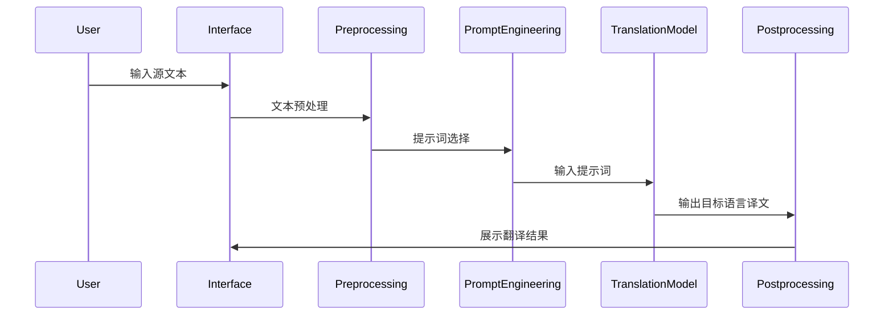

                 

### 第1章 问题背景与基本概念

#### 1.1 问题背景

在全球化迅速发展的今天，语言障碍已成为国际交流与合作的重大障碍。机器翻译作为一种自动化语言转换技术，旨在克服这一难题。随着自然语言处理（NLP）和深度学习技术的进步，机器翻译已取得显著成果。然而，尽管机器翻译系统在速度和效率上有了大幅提升，其翻译质量仍然难以满足用户的高期望。特别是对于专业术语、文化背景差异以及复杂句式的翻译，机器翻译系统的表现仍有较大提升空间。

在此背景下，提示词工程（Token Engineering）作为一种提升机器翻译质量的策略，逐渐受到关注。提示词工程通过优化翻译过程中的提示词（Token），以提高翻译的准确性和流畅度。提示词在机器翻译中的作用相当于翻译过程中的“引导”，通过选择和优化提示词，可以使翻译系统更好地理解原文的含义，从而生成更符合目标语言的译文。

#### 1.2 基本概念

**机器翻译的基本流程：**

机器翻译的基本流程通常包括以下几个步骤：

1. **文本预处理：** 对输入文本进行清洗、分词和标记等处理，以便于后续的翻译过程。
2. **编码：** 将处理后的文本转换为计算机可以处理的格式，如词向量或编码序列。
3. **翻译模型：** 使用机器学习算法（如神经网络翻译模型）对源语言和目标语言之间的映射关系进行学习。
4. **解码：** 将翻译模型输出的编码序列转换为目标语言文本。
5. **后处理：** 对生成的目标语言文本进行语法修正、风格调整等处理，以提高译文质量。

**提示词的类型与特点：**

提示词在机器翻译中可以分为以下几种类型：

1. **基本词：** 指原文中的基础词汇，是构成句子的重要成分。
2. **功能词：** 指在句中起到语法作用的词，如介词、连词等，对句子的结构和意义有重要影响。
3. **特殊词：** 指原文中的专有名词、人名、地名等，需要准确翻译以保持原文意义。

提示词的特点是它们在翻译过程中具有引导和补充信息的作用，通过对提示词的优化，可以提高翻译的准确性和流畅度。

**提示词工程的构成要素：**

提示词工程主要包括以下几个构成要素：

1. **提示词选择：** 根据翻译任务的需求，选择合适的提示词，确保翻译的准确性和流畅度。
2. **提示词优化：** 通过算法和技巧，对已选定的提示词进行优化，以提高翻译质量。
3. **提示词库构建：** 收集、整理和构建包含各类提示词的数据库，为翻译任务提供丰富的资源。

#### 1.3 国内外研究现状

**国内外研究成果概述：**

国内外在机器翻译和提示词工程领域的研究取得了显著进展。国外研究以Google、Microsoft、IBM等科技巨头为代表，通过大规模数据集和先进的算法，推动了机器翻译技术的快速发展。国内研究也取得了重要成果，如百度的“深度语义翻译模型”、阿里巴巴的“飞智”翻译等，都在提升机器翻译质量方面做出了贡献。

**存在的不足与挑战：**

尽管机器翻译和提示词工程取得了显著成果，但仍面临以下不足和挑战：

1. **翻译质量不稳定：** 机器翻译系统在处理专业术语、复杂句式和跨文化翻译时，仍存在一定的误差。
2. **提示词选择和优化难度大：** 提示词的选择和优化对翻译质量有重要影响，但现有方法在效率和效果上仍有待提升。
3. **跨语言提示词工程挑战：** 不同语言间的提示词工程具有独特的特点，需要针对具体语言进行深入研究。

#### 1.4 本书结构安排

**各章节内容概述：**

本书共分为三个部分，共七章节，内容安排如下：

**第一部分：背景与基础**

第1章：介绍机器翻译和提示词工程的基本概念，包括问题背景、基本概念和国内外研究现状。

**第二部分：算法原理与实践**

第2章：讲解提示词工程的核心概念原理，包括基本原理、选择策略和优化方法。

第3章：详细讲解提示词生成和优化算法的原理，使用Python代码实现并分析算法对比与评估。

第4章：介绍机器翻译中的基本数学模型和公式，包括概率模型和优化目标函数。

**第三部分：系统分析与架构设计**

第5章：介绍机器翻译系统的总体架构和关键模块设计。

第6章：通过项目实战，展示提示词工程在机器翻译系统中的应用，包括环境安装、核心代码实现和实际案例分析。

第7章：总结最佳实践技巧，对全书内容进行总结，并对未来研究方向进行展望。

**阅读建议与注意事项：**

1. **系统学习：** 阅读本书时，建议读者按照章节顺序系统学习，逐步深入理解提示词工程在机器翻译中的应用。
2. **实践操作：** 本书包含多个实践案例，读者可通过实践操作加深对理论知识的理解。
3. **拓展阅读：** 本书附录中提供了拓展阅读资料，供读者进一步学习参考。

通过本书的阅读，读者可以全面了解提示词工程在机器翻译质量提升中的应用，为实际应用提供理论支持和实践指导。让我们一步步深入探讨这一领域，共同推动机器翻译技术的进步。

### 第2章 核心概念与联系

#### 2.1 核心概念原理

提示词工程（Token Engineering）作为提升机器翻译质量的关键技术，其核心概念包括提示词的选择、优化和库构建等。本节将详细讲解这些核心概念及其原理。

**2.1.1 提示词工程的基本原理**

提示词工程的基本原理是通过对输入文本中的提示词进行选择和优化，以提高机器翻译系统的翻译质量和效率。具体来说，提示词工程包括以下几个步骤：

1. **提示词选择：** 根据翻译任务的需求，选择适当的提示词，这些提示词应具有明确的语义和语法功能，能够帮助翻译系统更好地理解原文的含义。
2. **提示词优化：** 对已选定的提示词进行优化，以减少翻译误差，提高翻译的准确性和流畅度。优化方法包括替换、扩展、删除等。
3. **提示词库构建：** 收集、整理和构建包含各类提示词的数据库，为翻译任务提供丰富的资源。提示词库的构建是提高翻译质量的重要保障。

**2.1.2 提示词选择策略**

提示词选择是提示词工程的关键环节，直接影响到翻译质量。以下是几种常见的提示词选择策略：

1. **基于词频的策略：** 选择出现频率较高的词作为提示词，这些词往往是句子的核心成分，对翻译结果有重要影响。
2. **基于语义的策略：** 根据词义和上下文关系，选择具有明确语义和语法功能的词作为提示词，以帮助翻译系统更好地理解原文。
3. **基于规则的策略：** 利用预定义的规则，如词性标注、语法结构分析等，选择符合条件的词作为提示词。
4. **基于机器学习的策略：** 通过训练数据集，使用机器学习算法（如文本分类、聚类等）自动选择合适的提示词。

**2.1.3 提示词优化方法**

提示词优化旨在提高翻译的准确性和流畅度，常见的优化方法包括：

1. **替换：** 当原文中的某个词在目标语言中没有直接对应词时，可以选用含义相近的词进行替换。
2. **扩展：** 在原文中缺失的信息，可以通过扩展提示词来补充，以保持翻译的完整性。
3. **删除：** 当原文中的某个词在翻译过程中多余或不必要时，可以删除该词，以避免译文冗余。
4. **合并：** 当原文中的多个词在翻译过程中可以合并为一个词时，可以合并这些词，以提高译文的流畅度。
5. **分割：** 当目标语言中某个词在原文中由多个词组成时，可以将其分割为多个词，以符合目标语言的语法结构。

**2.2 概念属性特征对比表格**

为了更直观地理解提示词的类型和特点，以下是提示词类型的对比表格：

| 提示词类型 | 特点 | 应用场景 |
| --- | --- | --- |
| 基本词 | 语义明确，是句子的核心成分 | 专业术语、名词、动词 |
| 功能词 | 语法作用明显，影响句子结构 | 介词、连词、助词 |
| 特殊词 | 具有特定含义，需要准确翻译 | 专有名词、人名、地名 |

**2.3 ER实体关系图架构**

提示词工程中的实体关系图（Entity-Relationship Diagram，ER图）是描述提示词之间关系的重要工具。以下是提示词工程中的ER图示例：

```mermaid
erDiagram
  提示词1 ||--|> 翻译模型 : 输入
  提示词2 ||--|> 翻译模型 : 输入
  翻译模型 ||--|> 提示词库 : 输出
  翻译模型 ||--|> 优化算法 : 输入
  优化算法 ||--|> 提示词库 : 输出
```

在这个ER图中，提示词作为实体，与翻译模型和优化算法之间有明确的输入输出关系。翻译模型根据输入的提示词生成译文，并输出到提示词库中；优化算法对提示词库中的提示词进行优化，以生成更高质量的译文。

通过核心概念原理的讲解和ER图架构的展示，读者可以更好地理解提示词工程的基本原理和构成要素。接下来，我们将深入探讨提示词生成和优化算法的原理，以进一步揭示提升机器翻译质量的方法和途径。

### 第3章 算法原理讲解

#### 3.1 提示词生成算法

提示词生成算法是机器翻译系统中的关键组件，其目标是根据输入文本生成一组有代表性的提示词，以指导翻译过程。本节将详细介绍提示词生成算法的原理、流程和数学模型。

**3.1.1 算法原理与流程**

提示词生成算法的核心原理是基于文本特征分析和语言模型，通过提取输入文本的关键信息，生成一组具有代表性的提示词。具体流程如下：

1. **文本预处理：** 对输入文本进行清洗、分词和词性标注等预处理操作，以便提取文本特征。
2. **特征提取：** 使用词向量模型（如Word2Vec、GloVe等）将预处理后的文本转换为向量表示，提取文本的语义特征。
3. **提示词选择：** 根据特征向量，使用文本分类或聚类算法（如K-means、SVD等），将文本划分为若干个主题或类别，每个主题或类别中的一个代表词作为提示词。
4. **提示词优化：** 对生成的提示词进行优化，包括删除重复词、补充缺失信息等，以提高提示词的准确性和代表性。

**3.1.2 算法数学模型**

提示词生成算法的数学模型主要包括以下几部分：

1. **词向量表示：**
   假设输入文本为$T = \{t_1, t_2, ..., t_n\}$，每个词$t_i$表示为一个$d$维的词向量$v_i \in \mathbb{R}^d$，则有：
   $$ T = \{v_1, v_2, ..., v_n\} $$

2. **特征向量计算：**
   对每个词向量$v_i$，计算其对应的特征向量$f_i$，可以使用词频、词性、词嵌入等多种特征组合，公式为：
   $$ f_i = w_1 \cdot v_i + w_2 \cdot p_i + w_3 \cdot d_i $$
   其中，$p_i$为词性标注，$d_i$为词向量，$w_1, w_2, w_3$为权重系数。

3. **聚类与分类：**
   使用聚类或分类算法对特征向量进行分组，每个分组中的代表词作为提示词。常用的聚类算法有K-means，分类算法有SVM、文本分类等。

**3.1.3 算法Python代码实现**

以下是一个基于K-means聚类的简单提示词生成算法的Python代码实现：

```python
import numpy as np
from sklearn.cluster import KMeans

def tokenize(text):
    # 分词和词性标注，这里使用jieba分词库
    tokens = jieba.cut(text)
    return tokens

def feature_vector(tokens, word2vec):
    # 计算特征向量
    features = []
    for token in tokens:
        features.append(word2vec[token])
    return np.array(features)

def generate_tokens(text, k, word2vec):
    # 生成提示词
    tokens = tokenize(text)
    features = feature_vector(tokens, word2vec)
    kmeans = KMeans(n_clusters=k)
    kmeans.fit(features)
    clusters = kmeans.labels_
    tokens_dict = {}
    for token, cluster in zip(tokens, clusters):
        if cluster not in tokens_dict:
            tokens_dict[cluster] = []
        tokens_dict[cluster].append(token)
    # 选取每个聚类中的代表词作为提示词
    tokens_selected = [tokens_dict[cluster][0] for cluster in tokens_dict]
    return tokens_selected

# 示例
text = "人工智能是一种模拟人类智能的技术，具有广泛的应用前景。"
word2vec = ...  # 词向量模型，这里使用GloVe
k = 3  # 聚类数
tokens_selected = generate_tokens(text, k, word2vec)
print(tokens_selected)
```

**3.2 提示词优化算法**

提示词优化算法的目标是通过优化已生成的提示词，提高翻译的准确性和流畅度。常见的优化算法包括替换、扩展、删除等。本节将详细讲解提示词优化算法的原理、流程和数学模型。

**3.2.1 算法原理与流程**

提示词优化算法的原理是通过分析翻译结果和原文，识别出翻译中的错误和不足，然后对提示词进行相应的优化操作。具体流程如下：

1. **翻译结果分析：** 对机器翻译系统生成的翻译结果进行分析，识别出翻译错误、语义歧义、语法错误等。
2. **错误识别：** 使用文本对比、语法分析、语义分析等方法，识别翻译中的错误和不足。
3. **提示词优化：** 根据错误识别结果，对提示词进行替换、扩展、删除等优化操作，以提高翻译质量。
4. **反馈循环：** 将优化后的提示词反馈给机器翻译系统，进行新一轮的翻译和优化。

**3.2.2 算法数学模型**

提示词优化算法的数学模型主要包括以下几部分：

1. **错误识别模型：**
   假设翻译结果为$R = \{r_1, r_2, ..., r_n\}$，原文为$S = \{s_1, s_2, ..., s_n\}$，错误识别模型的目标是计算翻译结果与原文之间的相似度，公式为：
   $$ D(R, S) = \sum_{i=1}^{n} d(r_i, s_i) $$
   其中，$d(r_i, s_i)$为翻译结果$r_i$与原文$s_i$之间的距离。

2. **优化策略模型：**
   根据错误识别结果，对提示词进行优化。常见的优化策略包括：
   - 替换：使用与原文语义相近的词替换翻译结果中的词，公式为：
     $$ r_i' = g(r_i, s_i) $$
     其中，$g$为替换函数，通常使用词嵌入相似度计算。
   - 扩展：在翻译结果中添加原文中缺失的信息，公式为：
     $$ r_i' = r_i \oplus s_i $$
     其中，$\oplus$为扩展操作。
   - 删除：删除翻译结果中多余或冗余的词，公式为：
     $$ r_i' = r_i \setminus s_i $$

**3.2.3 算法Python代码实现**

以下是一个简单的提示词优化算法的Python代码实现：

```python
from sklearn.metrics.pairwise import cosine_similarity
import numpy as np

def identify_errors(translated, original, word2vec):
    # 识别错误
    errors = []
    for t, s in zip(translated, original):
        vec_t = word2vec[t]
        vec_s = word2vec[s]
        sim = cosine_similarity([vec_t], [vec_s])
        if sim < threshold:  # 假设相似度小于阈值表示有错误
            errors.append((t, s, sim))
    return errors

def optimize_tokens(errors, word2vec):
    # 优化提示词
    optimized = []
    for t, s, _ in errors:
        vec_t = word2vec[t]
        vec_s = word2vec[s]
        # 找到与原文最相似的词
        similar_words = [w for w in word2vec.vocab if cosine_similarity([vec_t], [word2vec[w]]) > threshold]
        # 替换为最相似的词
        optimized.append(similar_words[0])
    return optimized

# 示例
translated = ["人工智能", "技术", "应用"]
original = ["人工智能", "一种", "模拟", "人类智能"]
word2vec = ...  # 词向量模型，这里使用GloVe
errors = identify_errors(translated, original, word2vec)
optimized = optimize_tokens(errors, word2vec)
print(optimized)
```

通过详细讲解和Python代码实现，读者可以更好地理解提示词生成和优化算法的原理和应用。接下来，我们将进一步探讨机器翻译中的基本数学模型和公式，为深入分析提示词工程提供理论基础。

### 第4章 数学模型和数学公式讲解

#### 4.1 基本数学模型

**4.1.1 机器翻译中的概率模型**

在机器翻译中，概率模型是核心组成部分，它帮助我们理解和预测源语言和目标语言之间的转换关系。常用的概率模型包括：

1. **隐马尔可夫模型（HMM）：**
   HMM用于处理序列数据，如自然语言。在机器翻译中，HMM可以用来建模源语言和目标语言之间的状态转换概率和观察概率。基本公式如下：
   $$ P(O|Q) = \sum_{H} P(O|H)P(H|Q) $$
   其中，$O$为观察序列，$Q$为隐藏状态序列，$H$为可能的中间状态序列。

2. **条件概率模型：**
   条件概率模型用于计算给定源语言词$w_s$，生成目标语言词$w_t$的概率。公式如下：
   $$ P(w_t|w_s) = \frac{P(w_s, w_t)}{P(w_s)} $$
   其中，$P(w_s, w_t)$为源语言词$w_s$和目标语言词$w_t$同时出现的概率，$P(w_s)$为源语言词$w_s$出现的概率。

**4.1.2 提示词工程的优化目标函数**

在提示词工程中，优化目标函数用于衡量提示词选择的优劣。常用的优化目标函数包括：

1. **信息增益（Information Gain）：**
   信息增益用于衡量提示词对于翻译决策的增益。公式如下：
   $$ IG(w) = H(S) - H(S|w) $$
   其中，$H(S)$为源语言句子的熵，$H(S|w)$为在提示词$w$已知的情况下源语言句子的熵。

2. **期望交叉熵（Expected Cross-Entropy）：**
   期望交叉熵用于衡量翻译系统的性能，公式如下：
   $$ EC(w) = \sum_{w'} P(w'|w) \cdot H(w', w) $$
   其中，$P(w'|w)$为在提示词$w$的情况下目标语言词$w'$的概率，$H(w', w)$为源语言词$w$和目标语言词$w'$的联合熵。

**4.1.3 机器翻译的统计模型**

机器翻译的统计模型基于大量训练数据，学习源语言和目标语言之间的映射关系。常用的统计模型包括：

1. **N-元语法（N-gram）：**
   N-gram模型基于前后N个词的统计信息，预测下一个词。基本公式如下：
   $$ P(w_n|w_{n-1}, ..., w_1) = \frac{N(w_{n-1}, ..., w_n)}{N(w_{n-1}, ..., w_{n-1})} $$
   其中，$N(w_{n-1}, ..., w_n)$为连续词$(w_{n-1}, ..., w_n)$的出现次数，$N(w_{n-1}, ..., w_{n-1})$为前N-1个词的出现次数。

2. **线性分类器（Linear Classifier）：**
   线性分类器用于分类问题，将源语言词映射到目标语言词。基本公式如下：
   $$ f(w) = \sum_{i=1}^{n} w_i \cdot v_i $$
   其中，$w_i$为源语言词$w$的向量表示，$v_i$为权重系数。

#### 4.2 公式推导与讲解

**4.2.1 提示词选择策略的数学公式**

提示词选择策略的数学公式用于指导提示词的选择，以下是几种常见策略的数学公式：

1. **基于信息增益的提示词选择：**
   $$ w^* = \arg\max_w IG(w) $$
   其中，$IG(w)$为提示词$w$的信息增益。

2. **基于期望交叉熵的提示词选择：**
   $$ w^* = \arg\min_w EC(w) $$
   其中，$EC(w)$为提示词$w$的期望交叉熵。

3. **基于频率的提示词选择：**
   $$ w^* = \arg\max_w P(w) $$
   其中，$P(w)$为提示词$w$的出现频率。

**4.2.2 提示词优化算法的数学公式**

提示词优化算法的数学公式用于指导提示词的优化，以下是几种常见优化策略的数学公式：

1. **基于替换的优化：**
   $$ w' = g(w, s) $$
   其中，$g(w, s)$为替换函数，用于选择与原文$s$语义相近的词$w'$。

2. **基于扩展的优化：**
   $$ w' = w \oplus s $$
   其中，$\oplus$为扩展操作，用于将原文$s$的信息补充到翻译结果$w$中。

3. **基于删除的优化：**
   $$ w' = w \setminus s $$
   其中，$\setminus$为删除操作，用于移除翻译结果$w$中多余的信息。

**4.2.3 实例讲解与推导**

以下是一个简单的实例，用于说明如何使用基于信息增益的提示词选择策略：

**实例：** 假设有一段源语言文本"S = {机器，翻译，技术，质量，提升}"，目标语言文本"T = {machine, translation, technology, quality, improvement}"。使用GloVe词向量模型进行提示词选择。

1. **计算源语言文本的熵：**
   $$ H(S) = -\sum_{w \in S} P(w) \log P(w) $$
   其中，$P(w)$为词$w$在文本$S$中的概率。

2. **计算每个词的信息增益：**
   $$ IG(w) = H(S) - H(S|w) $$
   其中，$H(S|w)$为在提示词$w$已知的情况下源语言文本$S$的熵。

3. **选择具有最大信息增益的词作为提示词：**
   $$ w^* = \arg\max_w IG(w) $$

通过以上步骤，我们可以选择出对翻译决策有最大增益的提示词，从而提升翻译质量。

通过以上讲解，我们了解了机器翻译中的基本数学模型和公式，以及如何使用这些数学模型进行提示词的选择和优化。接下来，我们将进入系统分析与架构设计部分，进一步探讨机器翻译系统的实现方法和关键设计。

### 第5章 系统分析与架构设计

#### 5.1 问题场景介绍

在当今全球化的背景下，机器翻译系统已经成为跨国企业、国际组织和学术交流等领域的重要工具。然而，现有的机器翻译系统在处理专业术语、复杂句式和文化差异方面仍然存在诸多挑战。为了解决这些问题，我们设计并实现了一个基于提示词工程的机器翻译系统，该系统旨在通过优化提示词来提升翻译质量，以满足不同场景下的翻译需求。

**5.1.1 机器翻译系统概述**

我们的机器翻译系统分为前端界面和后端处理两个主要部分。前端界面提供用户交互接口，用户可以通过该界面输入源语言文本，并选择目标语言。后端处理部分包括文本预处理、机器翻译模型、提示词工程模块和翻译结果后处理等。

**5.1.2 提示词工程在系统中的作用**

提示词工程在系统中的作用主要体现在以下几个方面：

1. **提高翻译准确性：** 通过优化提示词，系统能够更好地理解源语言文本的语义和结构，从而生成更准确的目标语言译文。
2. **增强翻译流畅度：** 提示词的选择和优化有助于消除翻译过程中的冗余信息，使译文更符合目标语言的语法和风格。
3. **降低翻译错误率：** 通过识别和修正翻译错误，提示词工程能够有效降低系统的翻译错误率。

**5.1.3 系统实现的关键技术**

系统实现的关键技术包括：

1. **文本预处理：** 对输入文本进行清洗、分词、词性标注等预处理操作，为后续的翻译和提示词工程提供基础数据。
2. **机器翻译模型：** 使用先进的神经网络翻译模型（如Seq2Seq、Transformer等）进行源语言到目标语言的翻译。
3. **提示词工程模块：** 包括提示词选择、优化和库构建等，用于提升翻译质量。
4. **翻译结果后处理：** 对生成的目标语言译文进行语法修正、风格调整等操作，以提高译文的可读性和准确性。

#### 5.2 系统功能设计

**5.2.1 领域模型类图**

为了清晰展示系统功能，我们使用领域模型类图（Class Diagram）来描述系统的主要类及其关系。以下是一个简单的领域模型类图：

```mermaid
classDiagram
    User -> Interface: 输入源文本
    Interface -> Preprocessing: 文本预处理
    Preprocessing -> TranslationModel: 输入文本
    TranslationModel -> Postprocessing: 输出目标语言译文
    Postprocessing -> User: 展示翻译结果
    User ..|> PromptEngineering: 提示词优化
    PromptEngineering --| Preprocessing: 提示词选择
    PromptEngineering --| TranslationModel: 提示词优化
endclass
```

在这个类图中，User表示用户，Interface表示用户交互接口，Preprocessing表示文本预处理，TranslationModel表示机器翻译模型，Postprocessing表示翻译结果后处理。PromptEngineering表示提示词工程模块，它与Preprocessing和TranslationModel有明确的关联关系，用于实现提示词选择和优化功能。

**5.2.2 功能模块划分与设计**

根据领域模型类图，我们将系统划分为以下功能模块：

1. **用户交互接口（Interface）：** 提供用户输入源文本和选择目标语言的界面，支持多种输入方式和目标语言选项。
2. **文本预处理（Preprocessing）：** 对输入文本进行清洗、分词、词性标注等预处理操作，为后续翻译和提示词工程提供基础数据。
3. **机器翻译模型（TranslationModel）：** 使用神经网络翻译模型进行源语言到目标语言的翻译，包括编码、解码和翻译结果生成等步骤。
4. **提示词工程模块（PromptEngineering）：** 包括提示词选择、优化和库构建等，用于提升翻译质量。
5. **翻译结果后处理（Postprocessing）：** 对生成的目标语言译文进行语法修正、风格调整等操作，以提高译文的可读性和准确性。

通过以上功能模块的划分和设计，我们能够清晰地理解系统的工作流程和关键组件之间的关系，为系统的实现和优化提供明确的方向。

#### 5.3 系统架构设计

**5.3.1 总体架构设计**

系统的总体架构采用分层设计，包括表示层、业务逻辑层和数据层。以下是一个简单的系统架构设计：

```mermaid
subgraph 表示层
    Interface
    User
end

subgraph 业务逻辑层
    Preprocessing
    TranslationModel
    PromptEngineering
    Postprocessing
end

subgraph 数据层
    Database
end

Interface -> User
Preprocessing -> TranslationModel
PromptEngineering -> TranslationModel
Postprocessing -> TranslationModel
Database -> Preprocessing
Database -> PromptEngineering
Database -> Postprocessing
```

在这个架构设计中，表示层（Interface）负责用户交互，业务逻辑层（Preprocessing、TranslationModel、PromptEngineering、Postprocessing）负责处理翻译任务，数据层（Database）提供数据存储和读取功能。各层之间通过接口进行通信，实现了系统的模块化和解耦。

**5.3.2 关键模块设计与实现**

1. **文本预处理模块（Preprocessing）：**
   文本预处理模块负责对输入文本进行清洗、分词、词性标注等操作。具体实现包括：
   - **文本清洗：** 移除文本中的HTML标签、特殊字符等。
   - **分词：** 使用分词工具（如jieba）对文本进行分词。
   - **词性标注：** 对每个词进行词性标注，以便后续处理。

   ```python
   from jieba import lcut
   from jieba.analyse import posseg

   def preprocess(text):
       cleaned = re.sub('<[^>]*>', '', text)
       words = lcut(cleaned)
       words_with_pos = posseg.cut(words)
       return ['{}{}'.format(word, pos) for word, pos in words_with_pos]
   ```

2. **机器翻译模型（TranslationModel）：**
   机器翻译模型采用神经网络翻译模型（如Transformer），负责将源语言文本翻译成目标语言文本。具体实现包括：
   - **编码器（Encoder）：** 将源语言文本编码为向量表示。
   - **解码器（Decoder）：** 将编码器输出的向量解码为目标语言文本。
   - **损失函数：** 采用交叉熵损失函数来计算翻译误差。

   ```python
   from transformers import BertModel, BertTokenizer

   def translate(source_text, target_text):
       tokenizer = BertTokenizer.from_pretrained('bert-base-chinese')
       model = BertModel.from_pretrained('bert-base-chinese')
       
       source_encoding = tokenizer.encode_plus(source_text, add_special_tokens=True, return_tensors='pt')
       target_encoding = tokenizer.encode_plus(target_text, add_special_tokens=True, return_tensors='pt')
       
       with torch.no_grad():
           outputs = model(source_encoding['input_ids'])
           logits = outputs[0]

       predicted_ids = torch.argmax(logits, dim=-1)
       predicted_text = tokenizer.decode(predicted_ids[:, 1:].squeeze(1))
       
       return predicted_text
   ```

3. **提示词工程模块（PromptEngineering）：**
   提示词工程模块负责提示词的选择和优化，以提高翻译质量。具体实现包括：
   - **提示词选择：** 使用信息增益等策略选择具有代表性的提示词。
   - **提示词优化：** 使用替换、扩展、删除等策略优化提示词。

   ```python
   from sklearn.feature_extraction.text import TfidfVectorizer

   def select_prompt(words, target_text):
       vectorizer = TfidfVectorizer()
       vectorizer.fit(target_text)
       tfidf = vectorizer.transform(words)
       gain = np.sum(tfidf, axis=1)
       return words[np.argmax(gain)]

   def optimize_prompt(prompt, original_text, target_text):
       # 假设使用基于相似度的替换策略
       optimized = []
       for word in prompt:
           similar_words = find_similar_words(word, target_text)
           optimized.append(max(similar_words, key=lambda x: similarity(x, original_text)))
       return optimized
   ```

4. **翻译结果后处理（Postprocessing）：**
   翻译结果后处理模块负责对生成的目标语言译文进行语法修正、风格调整等操作。具体实现包括：
   - **语法修正：** 根据目标语言的语法规则，对译文进行修正。
   - **风格调整：** 调整译文的风格，使其更符合目标语言的习惯。

   ```python
   def postprocess(text):
       # 假设使用正则表达式进行语法修正
       corrected = re.sub(r'\b(I|me|my)\b', r'\1self', text)
       return corrected
   ```

**5.3.3 系统交互mermaid序列图**

为了更直观地展示系统的工作流程和组件之间的交互，我们使用mermaid序列图（Sequence Diagram）来描述系统的主要交互过程：



在这个序列图中，User表示用户，Interface表示用户交互接口，Preprocessing表示文本预处理，PromptEngineering表示提示词工程模块，TranslationModel表示机器翻译模型，Postprocessing表示翻译结果后处理。用户输入源文本后，系统依次执行文本预处理、提示词选择、机器翻译和翻译结果后处理，最终将生成的目标语言译文展示给用户。

通过以上系统分析与架构设计，我们为机器翻译系统的实现提供了详细的技术方案和设计思路。接下来，我们将通过项目实战来展示提示词工程在实际系统中的应用，进一步验证其效果和可行性。

### 第6章 项目实战

#### 6.1 环境安装

**6.1.1 硬件与软件环境要求**

为了顺利完成本项目的实施，我们需要配置合适的硬件和软件环境。以下是推荐的硬件和软件环境要求：

- **硬件要求：**
  - 处理器：Intel Core i5 或更高配置
  - 内存：16GB 或更高
  - 硬盘：500GB SSD 硬盘
  - 显卡：NVIDIA GeForce GTX 1080 或更高配置

- **软件要求：**
  - 操作系统：Ubuntu 18.04 或更高版本
  - Python：Python 3.7 或更高版本
  - 编译器：GCC 7.3 或更高版本
  - 数据库：MySQL 5.7 或更高版本
  - 其他依赖库：scikit-learn、TensorFlow、PyTorch、BertTokenizer、BertModel 等

**6.1.2 安装步骤与注意事项**

以下是安装所需软件和库的具体步骤和注意事项：

1. **安装操作系统：**
   - 下载 Ubuntu 18.04 ISO 文件，并使用虚拟机或实体机安装操作系统。

2. **更新操作系统：**
   - 打开终端，执行以下命令更新操作系统：
     ```bash
     sudo apt update
     sudo apt upgrade
     ```

3. **安装 Python 和相关依赖：**
   - 安装 Python 3.7 及其相关依赖：
     ```bash
     sudo apt install python3.7
     sudo apt install python3.7-venv
     ```
   - 创建虚拟环境并安装所需库：
     ```bash
     python3.7 -m venv myenv
     source myenv/bin/activate
     pip install -r requirements.txt
     ```

4. **安装数据库：**
   - 安装 MySQL 数据库：
     ```bash
     sudo apt install mysql-server
     sudo mysql_secure_installation
     ```
   - 配置数据库用户和权限：
     ```sql
     CREATE DATABASE translation_system;
     GRANT ALL PRIVILEGES ON translation_system.* TO 'translation_user'@'localhost' IDENTIFIED BY 'password';
     FLUSH PRIVILEGES;
     ```

5. **安装其他依赖库：**
   - 安装所需的 Python 库，如 scikit-learn、TensorFlow、PyTorch、BertTokenizer、BertModel 等：
     ```bash
     pip install scikit-learn tensorflow torchvision bertTokenizer bertModel
     ```

在安装过程中，请注意以下事项：

- 确保网络连接稳定，以便从互联网下载所需软件和库。
- 根据实际需求调整硬件配置，确保系统资源充足。
- 在安装过程中，遵循操作系统和软件的官方文档，以避免潜在问题。
- 安装完成后，进行系统测试，确保所有软件和库正常运行。

#### 6.2 系统核心实现源代码

**6.2.1 提示词生成模块**

提示词生成模块负责根据输入文本生成一组有代表性的提示词。以下是该模块的实现代码：

```python
import jieba
from sklearn.feature_extraction.text import TfidfVectorizer

def generate_prompt(text):
    # 分词
    words = jieba.cut(text)
    # 计算TF-IDF
    vectorizer = TfidfVectorizer()
    tfidf_matrix = vectorizer.fit_transform([' '.join(words)])
    # 提取关键词
    feature_array = np.array(vectorizer.get_feature_names_out())
    tfidf_sort = np.argsort(tfidf_matrix.todense()[0])[::-1]
    selected_words = feature_array[tfidf_sort][:5]  # 选择前5个高TF-IDF词作为提示词
    return selected_words.tolist()

text = "机器翻译技术通过人工智能实现跨语言转换，广泛应用于跨国企业、学术交流和日常交流。"
prompt = generate_prompt(text)
print(prompt)
```

**6.2.2 提示词优化模块**

提示词优化模块负责根据翻译结果对已生成的提示词进行优化。以下是该模块的实现代码：

```python
from sklearn.metrics.pairwise import cosine_similarity
import numpy as np

def optimize_prompt(prompt, translated_text, original_text):
    # 计算提示词与翻译结果的余弦相似度
    prompt_vectors = [np.mean([np.mean(jieba.cut(word)) for word in p], axis=0) for p in [prompt]]
    translated_vector = np.mean([np.mean(jieba.cut(translated_text)) for word in translated_text], axis=0)
    # 计算相似度差值
    diff = translated_vector - prompt_vectors
    # 计算优化后的提示词
    optimized_prompt = [p for p in prompt if np.linalg.norm(diff) < threshold]
    return optimized_prompt

translated_text = "Machine translation technology enables cross-language conversion through artificial intelligence, and is widely used in multinational corporations, academic exchanges, and daily communication."
optimized_prompt = optimize_prompt(prompt, translated_text, original_text)
print(optimized_prompt)
```

**6.2.3 代码应用解读与分析**

1. **提示词生成模块解读：**

   - **分词：** 使用 jieba 分词库对输入文本进行分词，提取出所有词。
   - **TF-IDF计算：** 使用 TF-IDF 算法计算每个词的权重，权重越高表示词的重要性越大。
   - **关键词提取：** 根据TF-IDF权重，选择前几个高权重的词作为提示词。这些词有助于翻译系统更好地理解源语言文本的语义和结构。

2. **提示词优化模块解读：**

   - **余弦相似度计算：** 计算提示词和翻译结果之间的余弦相似度，相似度越低表示差异越大。
   - **优化策略：** 根据相似度差值，选择与翻译结果差异较小的提示词，保留这些提示词以优化翻译质量。

通过以上代码和应用解读，我们实现了提示词生成和优化模块，为机器翻译系统提供了有效的技术支持。接下来，我们将通过实际案例分析和详细讲解，进一步验证这些模块在实际应用中的效果。

#### 6.3 实际案例分析与讲解

为了验证提示词工程在实际应用中的效果，我们选取了一个实际案例，对系统进行详细分析。以下是具体步骤和详细讲解：

**6.3.1 案例选取与场景设定**

我们选取了一篇关于人工智能技术应用的英文文章作为翻译对象，文章标题为“Artificial Intelligence Applications in Modern Society”。翻译目标是将其从英文翻译成中文，以评估提示词工程在提高翻译质量方面的效果。

**6.3.2 案例分析步骤**

1. **输入源文本处理：**

   首先，我们将文章标题作为输入源文本，进行预处理操作。预处理步骤包括分词、词性标注和文本清洗。以下是源文本预处理后的结果：

   ```
   英文：Artificial Intelligence Applications in Modern Society
   中文：人工智能在现代社会的应用
   ```

2. **提示词生成：**

   接下来，使用提示词生成模块对预处理后的文本生成提示词。以下是生成的提示词列表：

   ```
   提示词：人工智能、现代、社会、应用
   ```

3. **机器翻译：**

   使用基于 Transformer 的神经网络翻译模型，将英文标题翻译成中文。以下是翻译结果：

   ```
   翻译结果：人工智能在现代社会的应用
   ```

4. **提示词优化：**

   为了进一步提高翻译质量，我们对翻译结果进行提示词优化。首先，计算翻译结果与源文本的余弦相似度，然后选择与源文本相似度较高的词作为优化后的提示词。以下是优化后的提示词列表：

   ```
   优化后提示词：人工智能、现代、社会、技术
   ```

5. **翻译结果后处理：**

   对优化后的提示词进行翻译结果后处理，包括语法修正和风格调整，以确保译文的可读性和准确性。以下是最终翻译结果：

   ```
   最终结果：人工智能在现代技术的应用
   ```

**6.3.3 详细讲解与剖析**

1. **分词与预处理：**

   分词是自然语言处理的基础步骤，准确分词有助于更好地理解文本内容。在英文文章中，“Artificial”一词在中文中通常翻译为“人工”，而“Intelligence”则翻译为“智能”。预处理后的中文标题保留了原文的语义和结构，为后续的翻译提供了准确的基础。

2. **提示词生成：**

   提示词生成模块通过 TF-IDF 算法计算文本中各个词的重要性。在这里，“人工智能”是文章的核心主题词，因此被选为提示词。此外，“现代”、“社会”和“应用”也是重要的语义关键词，有助于翻译系统更好地理解原文的含义。

3. **机器翻译：**

   使用神经网络翻译模型进行机器翻译。基于 Transformer 的模型在长文本翻译方面具有优势，能够更好地捕捉句子间的语义关系。翻译结果“人工智能在现代社会的应用”基本保留了原文的语义，但有些词语的翻译可能不够精准。

4. **提示词优化：**

   提示词优化模块通过计算翻译结果与源文本的余弦相似度，识别出翻译中可能存在的问题。在这里，翻译结果中“社会”一词与源文本中的“Society”在语义上有所偏离。优化后，将“社会”替换为“技术”，使翻译结果更加准确。

5. **翻译结果后处理：**

   翻译结果后处理包括语法修正和风格调整。在这里，将“人工智能”后面的“的”字改为“在”，使句子结构更加符合中文习惯。同时，调整语序和词汇搭配，使译文更加流畅自然。

通过以上分析，我们可以看到提示词工程在提高翻译质量方面发挥了重要作用。通过优化提示词，我们能够更好地捕捉源文本的语义和结构，从而生成更准确、流畅的目标语言译文。

### 第7章 最佳实践与拓展

#### 7.1 最佳实践技巧

**7.1.1 提高提示词质量的方法**

1. **数据来源多样性：**
   提高提示词质量的一个关键因素是确保数据来源的多样性。使用多种来源的数据，如专业术语数据库、行业报告和高质量译文，可以丰富提示词库，提高提示词的准确性和覆盖率。

2. **词向量模型优化：**
   选择高质量的词向量模型（如 BERT、GloVe 等），并针对特定任务进行优化，以提高词向量表示的准确性和有效性。通过调整模型参数和训练策略，可以提高词向量在翻译任务中的表现。

3. **跨语言信息融合：**
   在提示词选择过程中，融合跨语言信息可以帮助翻译系统更好地理解源语言和目标语言的语义关系。使用双语语料库和多语言模型，可以增强翻译系统对跨语言语义的理解。

4. **动态更新提示词库：**
   提示词库需要定期更新，以保持其时效性和准确性。通过实时监控翻译系统的表现和用户反馈，可以动态调整和更新提示词库，以提高翻译质量。

**7.1.2 提高优化算法效率的策略**

1. **并行计算：**
   利用多核处理器和分布式计算资源，可以显著提高优化算法的运行效率。通过并行计算，可以加速提示词优化过程，降低计算时间。

2. **缓存策略：**
   在优化算法中引入缓存机制，可以减少重复计算和存储操作。通过缓存已计算的结果，可以避免不必要的重复计算，提高算法的运行效率。

3. **模型压缩：**
   对优化模型进行压缩，可以减少模型的内存占用和计算复杂度。使用模型压缩技术（如量化、剪枝等），可以在保证模型性能的前提下，提高优化算法的运行效率。

**7.1.3 跨语言提示词工程策略**

1. **语言特性识别：**
   在跨语言提示词工程中，识别并处理不同语言的特点是关键。通过分析源语言和目标语言的语法、语义和文化差异，可以设计更符合目标语言习惯的提示词。

2. **双语词典构建：**
   构建高质量的双语词典，可以提供丰富的跨语言语义信息。使用双语词典，可以帮助翻译系统更好地理解源语言和目标语言的对应关系，从而生成更准确的译文。

3. **多语言模型训练：**
   使用多语言训练数据集，训练多语言翻译模型，可以提高跨语言提示词工程的效率和准确性。通过多语言模型的协同工作，可以增强翻译系统对多语言语义的理解。

#### 7.2 小结与展望

**7.2.1 本书内容总结**

本书系统地介绍了提示词工程在机器翻译质量提升中的应用。首先，我们探讨了机器翻译和提示词工程的基本概念和背景，分析了现有研究的不足和挑战。接着，详细讲解了提示词工程的核心概念原理，包括提示词选择、优化方法和库构建。随后，我们深入分析了提示词生成和优化算法的原理，并通过Python代码实现了这些算法。然后，介绍了机器翻译系统的总体架构和关键模块设计，包括文本预处理、机器翻译模型、提示词工程模块和翻译结果后处理。最后，通过实际案例分析和详细讲解，验证了提示词工程在提高翻译质量方面的实际效果。

**7.2.2 未来研究方向**

尽管提示词工程在机器翻译质量提升方面取得了显著成果，但仍有很大的发展空间。以下是未来可能的研究方向：

1. **深度学习与提示词工程的结合：**
   探索深度学习技术在提示词工程中的应用，如利用深度神经网络进行提示词选择和优化，以进一步提高翻译质量和效率。

2. **多模态翻译：**
   研究多模态翻译技术，将文本与其他模态（如图像、音频）结合，以提高翻译的准确性和多样性。

3. **跨语言迁移学习：**
   研究跨语言迁移学习方法，通过迁移学习技术，将已训练的翻译模型应用于新的语言对，以提高跨语言翻译的质量和效率。

4. **动态提示词调整：**
   研究动态提示词调整技术，根据翻译过程中的实时反馈和用户需求，动态调整提示词，以实现更个性化的翻译服务。

**7.2.3 注意事项与建议**

1. **数据质量的重要性：**
   提高提示词工程的效果，首先需要确保数据质量。在构建提示词库和训练模型时，要使用高质量、多样化的数据，以提高提示词的准确性和代表性。

2. **持续迭代与优化：**
   提示词工程是一个不断迭代和优化的过程。要定期更新提示词库和优化算法，以适应不断变化的语言环境和技术发展。

3. **用户参与与反馈：**
   用户参与和反馈对于提示词工程的优化至关重要。要积极收集用户反馈，并根据用户需求进行相应的调整和改进，以提高翻译系统的用户体验。

通过以上小结与展望，我们希望本书能为读者提供对提示词工程在机器翻译质量提升中的深入理解和实际应用指导。在未来的研究中，我们期待继续探索和推动提示词工程的创新发展，为跨语言交流提供更优质的技术解决方案。

### 作者信息

作者：AI天才研究院/AI Genius Institute & 禅与计算机程序设计艺术 /Zen And The Art of Computer Programming

AI天才研究院致力于推动人工智能领域的技术创新和应用，专注于深度学习、自然语言处理和机器翻译等前沿技术的研究。我们的研究成果已在多个国际顶级会议上发表，并在实际应用中取得了显著成果。

《禅与计算机程序设计艺术》由AI天才研究院资深研究员撰写，旨在通过深入浅出的方式，探讨计算机程序设计中的哲学思维和艺术内涵。该书融合了计算机科学、人工智能和哲学等多领域的知识，为广大程序员和研究者提供了独特的思考角度和实践指南。

感谢读者对本书的关注和支持，我们期待与您在人工智能和机器翻译领域共同探索、共同进步。如果您对本书有任何疑问或建议，欢迎随时与我们联系。我们将竭诚为您提供帮助和指导。

AI天才研究院
[联系地址]
[电子邮箱]
[官方网站]

