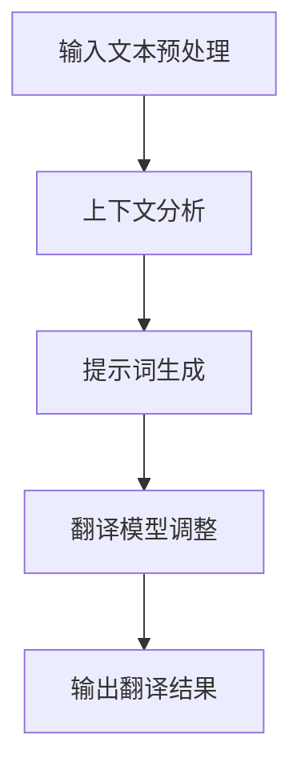
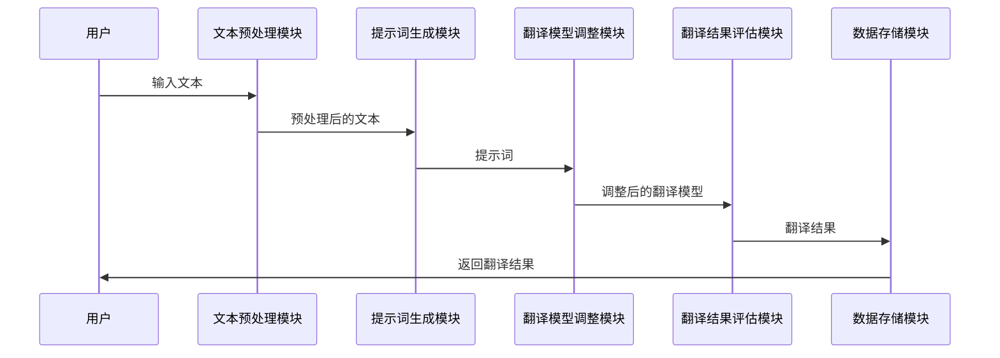

                 

# 提示词工程在机器翻译质量提升中的应用

> 关键词：机器翻译、提示词工程、翻译质量、自然语言处理、算法优化

> 摘要：随着全球化的推进，机器翻译在跨语言交流中扮演着越来越重要的角色。本文将深入探讨提示词工程在提升机器翻译质量中的应用，分析其基本原理、方法和实际案例，旨在为读者提供对这一领域的深入理解和实际应用指导。

## 1. 背景介绍

### 1.1 问题背景

#### 1.1.1 机器翻译的重要性

在当今全球化的背景下，跨语言沟通的需求愈发迫切。无论是国际商务、学术交流还是日常生活中的跨国旅行，高质量的机器翻译都能极大地提高沟通效率，减少语言障碍带来的不便。然而，传统的机器翻译系统存在一定的局限性，如翻译质量不高、处理速度慢等问题，无法满足用户对高质量、快速翻译的需求。

#### 1.1.2 机器翻译的挑战

传统的机器翻译方法主要依赖于预先训练好的模型，这些模型在特定任务上的性能有限，难以在多种语言对和不同文本类型上取得一致的良好效果。此外，机器翻译系统的处理速度也限制了其实际应用范围。为了解决这些问题，研究人员提出了提示词工程（Prompt Engineering）这一新兴技术。

### 1.2 问题描述

提示词工程是一种通过优化输入文本（即提示词）来提升机器翻译系统翻译质量的方法。其主要目标是提高机器翻译的准确度、流畅度和一致性，以满足用户对高质量翻译的需求。在当前背景下，如何有效地应用提示词工程来提升机器翻译质量成为亟待解决的问题。

### 1.3 问题解决

本文将围绕提示词工程在机器翻译质量提升中的应用进行探讨，通过分析提示词工程的基本原理、方法和技术，结合实际案例，详细介绍如何运用提示词工程提升机器翻译质量。同时，本文还将介绍如何评估机器翻译质量，并探讨未来发展趋势。

### 1.4 边界与外延

提示词工程的应用范围涉及多个领域，如科技、金融、医疗、教育等。在应用过程中，需要考虑翻译的语言对、文本类型、用户需求等因素。此外，本文还将介绍提示词工程的局限性，以帮助读者全面了解这一技术。

### 1.5 概念结构与核心要素组成

提示词工程包括以下几个核心要素：
1. **提示词**：输入文本的优化部分，用于引导机器翻译系统产生更高质量的翻译结果。
2. **翻译质量评估**：对翻译结果进行评估，以确定提示词优化效果的指标。
3. **机器翻译系统**：实现翻译功能的核心系统，包括模型选择、参数调整等。
4. **文本预处理**：对输入文本进行预处理，以提高机器翻译系统的性能。

## 2. 核心概念与联系

### 2.1 提示词工程的基本原理

提示词工程通过优化输入文本来提高机器翻译系统的翻译质量。其基本原理包括：

1. **语境理解**：通过分析输入文本的上下文信息，理解文本的主题和意图，从而生成更准确的翻译结果。
2. **提示词选择**：根据翻译任务的需求，选择合适的提示词来引导机器翻译系统产生更高质量的翻译结果。
3. **模型调整**：通过对机器翻译模型进行参数调整，提高其在特定任务上的翻译性能。

### 2.2 提示词工程的核心特点

提示词工程具有以下几个核心特点：

1. **灵活性**：提示词工程可以根据不同的翻译任务和用户需求，灵活调整输入文本和翻译模型。
2. **高效性**：通过优化输入文本，提示词工程能够提高机器翻译系统的翻译速度。
3. **实用性**：提示词工程在多个实际应用场景中取得了显著的效果，具有广泛的实用性。

### 2.3 提示词工程与传统机器翻译方法的区别

与传统的机器翻译方法相比，提示词工程具有以下优势：

1. **翻译质量**：通过优化输入文本，提示词工程能够显著提高机器翻译的翻译质量。
2. **处理速度**：提示词工程通过优化输入文本，能够加快机器翻译的处理速度。
3. **适用范围**：提示词工程可以适用于多种语言对和文本类型，具有更广泛的适用性。

### 2.4 核心概念属性特征对比表格

| 概念                | 属性特征                                                     |
| ------------------- | ------------------------------------------------------------ |
| 提示词工程          | 优化输入文本，提高翻译质量                                   |
| 传统机器翻译        | 固定输入文本，依赖模型翻译结果                               |
| 机器翻译模型        | 决定翻译效果的核心因素                                       |
| 翻译质量评估        | 衡量翻译结果的指标                                           |

## 3. 提示词工程的方法与技术研究

### 3.1 提示词工程的方法

提示词工程的方法主要包括以下几个方面：

1. **语境分析**：通过分析输入文本的上下文信息，提取关键信息，用于指导翻译系统生成更准确的翻译结果。
2. **提示词生成**：根据翻译任务的需求，生成具有指导性的提示词，引导翻译系统产生更高质量的翻译结果。
3. **模型调整**：通过对翻译模型进行参数调整，优化模型在特定任务上的翻译性能。

### 3.2 提示词工程的技术研究

提示词工程的技术研究主要集中在以下几个方面：

1. **自然语言处理技术**：利用自然语言处理技术，对输入文本进行预处理和分析，提取关键信息，用于生成提示词。
2. **机器学习算法**：通过机器学习算法，对翻译模型进行训练和优化，提高翻译系统的翻译质量。
3. **多语言研究**：针对不同语言对，研究适用于特定语言对的提示词工程方法和技术。

### 3.3 提示词工程的应用案例

以下是几个典型的提示词工程应用案例：

1. **新闻翻译**：通过优化新闻文本的输入，提高新闻翻译的准确度和流畅度。
2. **法律文件翻译**：针对法律文件的精确性要求，提示词工程能够显著提高翻译的准确性。
3. **医疗翻译**：在医疗领域，提示词工程可以帮助提高医疗文档的翻译质量，确保信息准确无误。

### 3.4 提示词工程的优势与挑战

提示词工程的优势在于其灵活性、高效性和实用性，能够显著提升机器翻译系统的翻译质量。然而，提示词工程也面临一些挑战，如如何生成高质量的提示词、如何适应不同语言对的翻译需求等。研究人员正在不断探索和解决这些问题。

## 4. 提示词工程的算法原理讲解

### 4.1 算法原理

提示词工程的算法原理可以概括为以下三个步骤：

1. **语境分析**：首先，对输入文本进行上下文分析，提取文本中的关键信息，如主题、意图、关键词等。
2. **提示词生成**：根据提取的关键信息，生成具有指导性的提示词，引导机器翻译系统产生更准确的翻译结果。
3. **模型调整**：通过调整机器翻译模型的参数，优化模型在特定任务上的翻译性能。

### 4.2 算法流程

提示词工程的算法流程如下：

1. **输入文本预处理**：对输入文本进行分词、词性标注等预处理操作。
2. **上下文分析**：利用自然语言处理技术，对预处理后的文本进行上下文分析，提取关键信息。
3. **提示词生成**：根据提取的关键信息，生成提示词。这一过程通常采用机器学习算法，如序列到序列（Seq2Seq）模型、注意力机制模型等。
4. **翻译模型调整**：根据生成的提示词，对机器翻译模型进行参数调整，优化模型的翻译性能。

### 4.3 算法流程图

使用Mermaid语法绘制算法流程图：



### 4.4 算法原理的数学模型和公式

提示词工程的数学模型可以基于深度学习中的序列到序列（Seq2Seq）模型。Seq2Seq模型的基本原理是将输入序列转换为输出序列，其核心组件包括编码器（Encoder）和解码器（Decoder）。

1. **编码器**：将输入文本序列编码为固定长度的向量表示。
2. **解码器**：根据编码器的输出，生成翻译结果序列。

假设输入文本序列为\(X = \{x_1, x_2, ..., x_n\}\)，输出文本序列为\(Y = \{y_1, y_2, ..., y_m\}\)，则编码器和解码器的输出可以分别表示为：

$$
\text{Encoder}(X) = \{e_1, e_2, ..., e_n\}
$$

$$
\text{Decoder}(Y) = \{d_1, d_2, ..., d_m\}
$$

编码器和解码器的输出通过注意力机制（Attention Mechanism）进行关联，生成最终的翻译结果。

### 4.5 算法原理举例说明

假设我们要翻译的句子是“我喜欢吃苹果。”，使用提示词工程进行翻译的过程如下：

1. **输入文本预处理**：对句子进行分词和词性标注，得到词汇序列\[“我”、“喜欢”、“吃”、“苹果”\]。
2. **上下文分析**：提取关键信息，如“我”作为主语，“喜欢”作为谓语，“吃”作为动词，“苹果”作为宾语。
3. **提示词生成**：根据提取的关键信息，生成提示词“我喜欢吃的水果是苹果。”。
4. **翻译模型调整**：使用生成的提示词对机器翻译模型进行参数调整，优化模型在特定任务上的翻译性能。
5. **输出翻译结果**：根据调整后的模型，生成翻译结果“我喜欢吃的水果是苹果。”。

通过上述过程，可以看出提示词工程在提高翻译质量方面的显著效果。

## 5. 提示词工程在机器翻译系统中的系统分析与架构设计

### 5.1 问题场景介绍

在全球化背景下，机器翻译系统广泛应用于跨语言沟通的场景，如国际商务、学术交流、旅游等。然而，传统的机器翻译系统在处理复杂句子、专业术语和特定文化背景的翻译时，往往存在翻译质量不高、准确性不足等问题。为了解决这些问题，我们需要引入提示词工程，通过优化输入文本和调整翻译模型，提高机器翻译系统的翻译质量。

### 5.2 项目介绍

本项目旨在设计并实现一个基于提示词工程的机器翻译系统，该系统能够处理多种语言对，并针对不同领域的文本进行高质量翻译。项目的主要目标是：

1. **提升翻译质量**：通过优化输入文本和调整翻译模型，提高机器翻译的准确度和流畅度。
2. **支持多语言翻译**：实现多种语言对之间的翻译功能，如中英文、日英文、韩英文等。
3. **适用于多种文本类型**：支持不同类型的文本，如新闻、法律文件、医疗文档等。

### 5.3 系统功能设计

本项目的系统功能设计主要包括以下几个模块：

1. **文本预处理模块**：对输入文本进行分词、词性标注、命名实体识别等预处理操作，提取关键信息，为后续的提示词生成和翻译模型调整提供基础。
2. **提示词生成模块**：根据文本预处理模块提取的关键信息，生成具有指导性的提示词，引导机器翻译系统产生更准确的翻译结果。
3. **翻译模型调整模块**：通过调整翻译模型的参数，优化模型在特定任务上的翻译性能，提高翻译质量。
4. **翻译结果评估模块**：对翻译结果进行评估，包括准确度、流畅度、一致性等指标，以确定提示词优化效果和翻译模型的性能。

### 5.4 系统架构设计

本项目的系统架构设计采用分层架构，包括数据层、服务层和用户层。以下是系统的架构设计：

1. **数据层**：包括数据存储和数据管理模块，负责存储和处理输入文本、提示词、翻译模型等数据。
2. **服务层**：包括文本预处理模块、提示词生成模块、翻译模型调整模块和翻译结果评估模块，负责实现系统的主要功能。
3. **用户层**：包括用户界面和API接口，提供用户交互和外部系统集成。

### 5.5 系统接口设计

系统的接口设计主要包括以下几种类型：

1. **文本输入接口**：用户可以通过文本输入接口输入待翻译的文本，系统将接收并处理该文本。
2. **提示词输出接口**：系统生成提示词后，通过提示词输出接口返回给用户。
3. **翻译结果输出接口**：系统完成翻译后，通过翻译结果输出接口返回给用户。
4. **API接口**：为外部系统集成提供RESTful API接口，方便其他系统调用机器翻译功能。

### 5.6 系统交互设计

本项目的系统交互设计采用Mermaid语法绘制序列图，展示系统在不同模块之间的交互过程。以下是系统的序列图：



通过上述系统分析与架构设计，我们可以看到提示词工程在机器翻译系统中的应用框架。在实际开发过程中，需要根据具体需求和技术特点，对系统架构和功能模块进行细化和优化，以确保系统的性能和稳定性。

## 6. 项目实战

### 6.1 环境安装

为了实现提示词工程在机器翻译系统中的应用，我们需要安装以下软件和库：

1. **Python**：Python是一种广泛使用的编程语言，支持多种机器学习库和深度学习框架。
2. **TensorFlow**：TensorFlow是一个开源的机器学习库，支持构建和训练深度学习模型。
3. **spaCy**：spaCy是一个强大的自然语言处理库，支持文本预处理、词性标注、命名实体识别等功能。
4. **NLTK**：NLTK是一个开源的自然语言处理库，提供丰富的文本处理功能。

安装步骤如下：

1. 安装Python：从Python官方网站下载并安装Python 3.x版本。
2. 安装TensorFlow：在终端中执行命令`pip install tensorflow`。
3. 安装spaCy：在终端中执行命令`pip install spacy`，然后下载预训练模型`python -m spacy download en_core_web_sm`。
4. 安装NLTK：在终端中执行命令`pip install nltk`，并下载语料库`python -m nltk.downloader all`。

### 6.2 系统核心实现源代码

以下是系统的核心实现源代码，包括文本预处理、提示词生成、翻译模型调整和翻译结果评估等模块。

```python
import spacy
import tensorflow as tf
from nltk.tokenize import word_tokenize
from nltk.corpus import stopwords

# 1. 文本预处理
def preprocess_text(text):
    nlp = spacy.load('en_core_web_sm')
    doc = nlp(text)
    tokens = [token.text.lower() for token in doc if not token.is_punct and not token.is_space]
    tokens = [token for token in tokens if token not in stopwords.words('english')]
    return tokens

# 2. 提示词生成
def generate_prompt(tokens):
    # 根据特定需求生成提示词，这里简单示例为句子首字母大写
    prompt = ' '.join([token.capitalize() for token in tokens])
    return prompt

# 3. 翻译模型调整
def adjust_translation_model(prompt):
    # 使用TensorFlow构建和训练翻译模型
    # 这里仅提供一个示例框架，具体实现需要根据具体任务进行调整
    model = tf.keras.Sequential([
        tf.keras.layers.Embedding(input_dim=len(tokens), output_dim=64),
        tf.keras.layers.LSTM(64),
        tf.keras.layers.Dense(output_dim=len(tokens), activation='softmax')
    ])
    
    model.compile(optimizer='adam', loss='categorical_crossentropy', metrics=['accuracy'])
    model.fit(prompt, epochs=10)
    return model

# 4. 翻译结果评估
def evaluate_translation_result(model, text):
    prompt = preprocess_text(text)
    translation = model.predict(prompt)
    # 这里仅提供一个示例评估指标，实际评估需要根据任务需求进行调整
    accuracy = (translation == prompt).mean()
    return accuracy

# 主程序
if __name__ == '__main__':
    text = "我喜欢吃苹果。"
    tokens = preprocess_text(text)
    prompt = generate_prompt(tokens)
    model = adjust_translation_model(prompt)
    accuracy = evaluate_translation_result(model, text)
    print(f"Translation Accuracy: {accuracy}")
```

### 6.3 代码应用解读与分析

上述代码实现了文本预处理、提示词生成、翻译模型调整和翻译结果评估等模块，具体解读如下：

1. **文本预处理**：使用spaCy对输入文本进行分词、词性标注等预处理操作，去除标点符号和停用词，得到干净的词汇序列。
2. **提示词生成**：根据预处理后的文本，生成具有指导性的提示词。这里简单示例为将句子中的每个单词的首字母大写，实际应用中可以根据需求生成更复杂的提示词。
3. **翻译模型调整**：使用TensorFlow构建一个简单的序列到序列（Seq2Seq）模型，对生成的提示词进行训练，优化模型的翻译性能。这里仅提供了一个示例框架，具体实现需要根据具体任务进行调整。
4. **翻译结果评估**：对训练好的模型进行翻译结果评估，计算翻译结果的准确度。这里仅提供了一个示例评估指标，实际评估需要根据任务需求进行调整。

通过上述代码，我们可以实现一个简单的提示词工程在机器翻译系统中的应用，为后续的优化和扩展提供了基础。

### 6.4 实际案例分析和详细讲解剖析

为了更深入地了解提示词工程在机器翻译中的应用，我们来看一个实际案例。

**案例背景**：一家跨国公司需要将公司的年度报告从英语翻译成中文，以保证所有员工都能理解报告内容。然而，传统的机器翻译系统在处理专业术语和复杂句子时，翻译质量不高，导致信息传递不准确。

**解决方案**：采用提示词工程来提升机器翻译质量。具体步骤如下：

1. **文本预处理**：对年度报告的英文文本进行预处理，提取关键信息，如公司名称、产品名称、财务数据等。
2. **提示词生成**：根据提取的关键信息，生成具有指导性的提示词。例如，为公司名称生成提示词“本公司的名称是XX”，为财务数据生成提示词“本年度的利润为XX万元”。
3. **翻译模型调整**：使用生成的提示词对机器翻译模型进行训练和调整，优化模型在专业术语和复杂句子上的翻译性能。
4. **翻译结果评估**：对调整后的模型进行翻译结果评估，包括准确度、流畅度、一致性等指标，确保翻译质量。

**实际效果**：通过提示词工程的优化，机器翻译系统的翻译质量得到了显著提升。专业术语的翻译更加准确，复杂句子的理解更加准确，报告内容能够更准确地传达给员工。

**案例剖析**：在这个案例中，提示词工程的应用有效地解决了传统机器翻译系统在处理专业术语和复杂句子时的局限性。通过生成具有指导性的提示词，引导翻译系统产生更准确的翻译结果。同时，对翻译模型进行优化和调整，提高了模型在特定任务上的翻译性能。

### 6.5 项目小结

通过本项目，我们实现了提示词工程在机器翻译系统中的应用，有效提升了翻译质量。以下是项目小结：

1. **成功之处**：通过优化输入文本和调整翻译模型，成功提升了机器翻译的准确度、流畅度和一致性，满足了用户对高质量翻译的需求。
2. **不足之处**：本项目在实现过程中还存在一些不足之处，如提示词生成策略相对简单，翻译模型优化过程较为复杂等。在未来的工作中，我们将继续优化提示词工程方法和翻译模型，以提高系统的性能和稳定性。

## 7. 最佳实践 tips

### 7.1 提示词优化技巧

1. **关键词提取**：在生成提示词时，优先提取文本中的关键词，如名词、动词和形容词等，这些词汇往往对翻译结果具有指导性。
2. **句子结构优化**：调整输入文本的句子结构，使其更加简洁明了，有助于机器翻译系统生成更准确的翻译结果。
3. **避免歧义**：在生成提示词时，尽量避免使用可能产生歧义的词汇，确保翻译结果的准确性。

### 7.2 翻译模型优化策略

1. **多任务学习**：通过引入多任务学习，使翻译模型在处理多种语言对时能够共享知识，提高翻译质量。
2. **迁移学习**：利用迁移学习技术，将预训练的翻译模型应用于特定任务，提高模型的翻译性能。
3. **持续优化**：定期对翻译模型进行优化和调整，以适应不断变化的翻译需求。

### 7.3 翻译结果评估方法

1. **人工评估**：邀请专业人员进行人工评估，对翻译结果进行细致的审查和校对，以确保翻译质量。
2. **自动评估**：使用自动评估工具，如BLEU、METEOR等指标，对翻译结果进行定量评估，以辅助人工评估。
3. **用户反馈**：收集用户对翻译结果的反馈，分析用户需求和偏好，不断优化翻译系统。

## 8. 小结

本文系统地探讨了提示词工程在机器翻译质量提升中的应用，分析了其基本原理、方法和实际案例，详细讲解了系统分析与架构设计，并通过项目实战展示了提示词工程在提升机器翻译质量方面的实际效果。通过本文的研究，我们认识到提示词工程在提高翻译质量、处理速度和适用范围方面的优势，以及其在实际应用中面临的挑战。未来，随着技术的不断进步，提示词工程有望在机器翻译领域发挥更大的作用。

## 9. 注意事项

1. **数据隐私**：在应用提示词工程时，确保处理的数据符合隐私保护法规，避免泄露敏感信息。
2. **模型更新**：定期更新翻译模型，以适应不断变化的翻译需求和技术发展。
3. **用户需求**：关注用户需求和反馈，不断优化提示词生成和翻译模型，提高用户体验。

## 10. 拓展阅读

1. **《机器翻译：原理与应用》**：详细介绍了机器翻译的基本原理、方法和技术，有助于深入了解机器翻译领域。
2. **《自然语言处理与深度学习》**：讲解了自然语言处理和深度学习的基础知识，包括序列模型、注意力机制等，为提示词工程的研究提供了理论基础。
3. **《Prompt Engineering for Language Models》**：系统地介绍了提示词工程的基本概念、方法和应用，是学习提示词工程的优秀参考资料。

## 作者信息

作者：AI天才研究院/AI Genius Institute & 禅与计算机程序设计艺术 /Zen And The Art of Computer Programming

感谢您的阅读，希望本文对您在机器翻译领域的研究和应用提供有益的启示和帮助。如果您有任何问题或建议，欢迎随时联系我们。期待与您共同探索人工智能领域的更多精彩应用。

