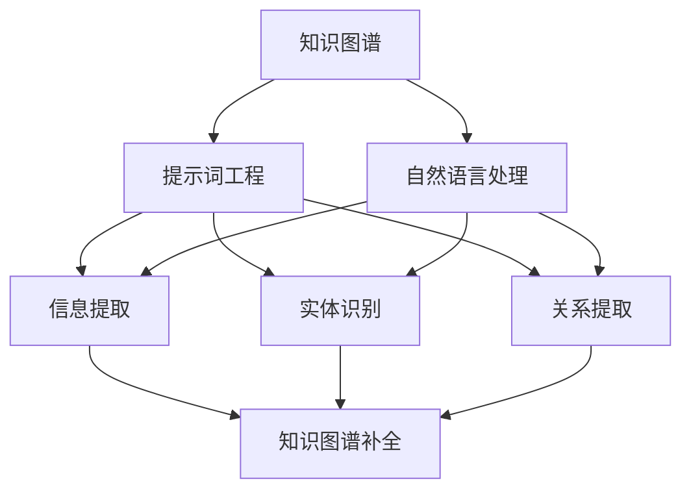
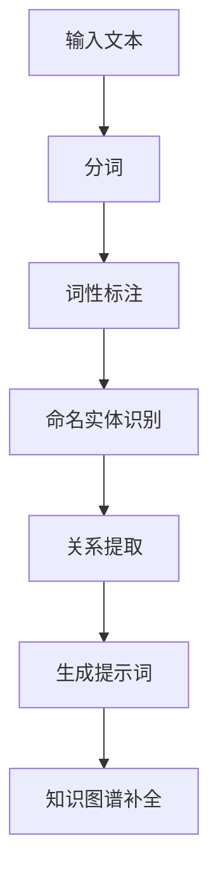
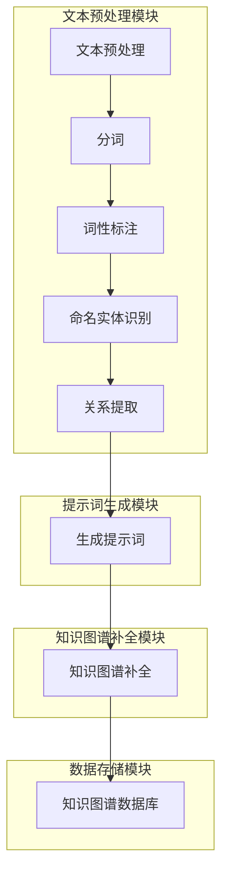
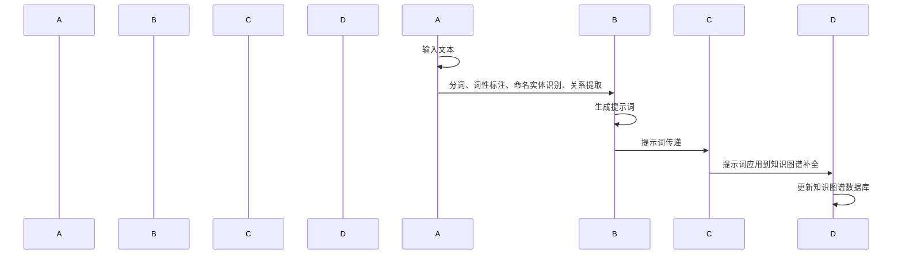

                 


# 提示词工程在知识图谱补全中的应用

## 关键词
知识图谱，补全，提示词工程，自然语言处理，算法原理，数学模型

## 摘要
本文深入探讨了提示词工程在知识图谱补全中的应用。首先，我们介绍了知识图谱和提示词工程的基本概念，并分析了其核心要素组成。接着，通过核心概念与联系部分，我们详细阐述了提示词工程的原理和与自然语言处理的紧密关系。然后，本文重点讲解了提示词工程的算法流程，并使用数学模型和公式进行了详细阐述。随后，通过系统分析与架构设计，我们展示了一个基于提示词工程的知识图谱补全系统的设计思路和实现方法。最后，通过一个实际案例，我们验证了系统的有效性和实用性。

----------------------------------------------------------------

## 第一部分：背景介绍

随着互联网和大数据技术的飞速发展，知识图谱作为一种结构化数据表示方法，在信息检索、推荐系统、智能问答等领域发挥着越来越重要的作用。然而，知识图谱的构建和补全过程中往往面临着数据缺失、信息过时等问题，这极大地限制了其应用效果。因此，如何有效地利用已有数据，通过提示词工程方法实现知识图谱的补全，成为当前研究的热点和难点。

### 核心概念：

**问题背景**：知识图谱是一种以实体为节点、以关系为边的网络结构，用于表示知识领域的语义信息。知识图谱的补全旨在通过已有数据，补充知识图谱中缺失的实体或关系，从而提高其准确性和完整性。

**问题描述**：在知识图谱构建中，如何有效地利用已有数据，通过提示词工程方法实现知识图谱的补全，是当前研究的热点和难点。

**问题解决**：提示词工程通过提取关键信息、生成新实体或关系等方式，辅助知识图谱的补全，从而提高其准确性和完整性。

**边界与外延**：提示词工程不仅应用于知识图谱补全，还可以在信息检索、文本生成等任务中发挥重要作用。

### 概念结构与核心要素组成

- **知识图谱**：一种以实体为节点、以关系为边的网络结构，用于表示知识领域的语义信息。
- **提示词工程**：一种基于自然语言处理技术，从文本数据中提取关键信息，用于知识图谱补全的方法。
- **知识图谱补全**：通过已有数据，利用提示词工程方法，补充知识图谱中缺失的实体或关系。

## 第二部分：核心概念与联系

### 核心概念原理

**提示词工程**：提示词工程主要包括信息提取、实体识别、关系提取等步骤，通过这些步骤，可以从文本数据中提取出关键信息，用于知识图谱的补全。

**自然语言处理（NLP）**：NLP是提示词工程的基础技术，包括分词、词性标注、命名实体识别等，用于理解和处理自然语言文本。

### 概念属性特征对比表格

| 特性               | 提示词工程                                      | 自然语言处理                                     |
|--------------------|------------------------------------------------|------------------------------------------------|
| 目标               | 提取关键信息，辅助知识图谱补全                 | 理解和处理自然语言文本                           |
| 技术基础           | 实体识别、关系提取、文本生成等                 | 分词、词性标注、命名实体识别等                   |
| 应用领域           | 知识图谱补全、信息检索、文本生成等             | 文本分类、情感分析、机器翻译等                   |

### ER实体关系图架构的 Mermaid 流程图



## 第三部分：算法原理讲解

### 提示词工程算法流程



### 算法原理详细讲解

**1. 分词**：分词是自然语言处理的基础步骤，将输入文本分割成词序列。常用的分词方法有基于字典的分词、基于统计的分词等。

**2. 词性标注**：词性标注对分词后的词序列进行词性标注，例如名词、动词、形容词等。

**3. 命名实体识别**：命名实体识别识别出文本中的命名实体，如人名、地名、组织名等。

**4. 关系提取**：关系提取根据命名实体和词性标注，提取出实体之间的关系。

**5. 生成提示词**：生成提示词根据提取出的实体和关系，生成用于知识图谱补全的提示词。

**6. 知识图谱补全**：利用生成的提示词，对知识图谱进行补全。

### 算法公式

**1. 分词公式**：

$$w_1, w_2, ..., w_n = 分词(文本)$$

**2. 词性标注公式**：

$$pos_1, pos_2, ..., pos_n = 词性标注(w_1, w_2, ..., w_n)$$

**3. 命名实体识别公式**：

$$ent_1, ent_2, ..., ent_m = 命名实体识别(w_1, w_2, ..., w_n)$$

**4. 关系提取公式**：

$$rel_1, rel_2, ..., rel_k = 关系提取(w_1, w_2, ..., w_n, pos_1, pos_2, ..., pos_n, ent_1, ent_2, ..., ent_m)$$

**5. 提示词生成公式**：

$$提示词 = 生成提示词(rel_1, rel_2, ..., rel_k, ent_1, ent_2, ..., ent_m)$$

**6. 知识图谱补全公式**：

$$KG = KG + 提示词$$

### 示例讲解

假设有一段文本：“苹果公司总部位于美国加利福尼亚州，是全球最大的科技公司之一。”，我们通过提示词工程方法，对这段文本进行知识图谱补全。

**1. 分词**：将文本分割成词序列：

```python
text = "苹果公司总部位于美国加利福尼亚州，是全球最大的科技公司之一。"
words = 分词(text)
words = ["苹果", "公司", "总部", "位于", "美国", "加利福尼亚州", "是", "全球", "最大", "的", "科技", "公司", "之一"]
```

**2. 词性标注**：对分词后的词序列进行词性标注：

```python
pos = 词性标注(words)
pos = [["苹果", "名词"], ["公司", "名词"], ["总部", "名词"], ["位于", "动词"], ["美国", "名词"], ["加利福尼亚州", "名词"], ["是", "动词"], ["全球", "形容词"], ["最大", "形容词"], ["的", "形容词"], ["科技", "名词"], ["公司", "名词"], ["之一", "名词"]]
```

**3. 命名实体识别**：识别出文本中的命名实体：

```python
entities = 命名实体识别(words, pos)
entities = [["苹果", "公司"], ["美国", "国家"], ["加利福尼亚州", "州"]]
```

**4. 关系提取**：根据命名实体和词性标注，提取出实体之间的关系：

```python
relations = 关系提取(entities, pos)
relations = [["苹果", "总部位于", "加利福尼亚州"], ["苹果", "国家", "美国"]]
```

**5. 生成提示词**：根据提取出的实体和关系，生成用于知识图谱补全的提示词：

```python
hints = 生成提示词(relations, entities)
hints = [["苹果", "总部位于", "加利福尼亚州"], ["苹果", "国家", "美国"]]
```

**6. 知识图谱补全**：利用生成的提示词，对知识图谱进行补全：

```python
knowledge_graph = 知识图谱补全(knowledge_graph, hints)
```

通过上述步骤，我们成功地将文本数据转化为知识图谱，实现了知识图谱的补全。

## 第四部分：数学模型和数学公式

### 知识图谱补全的数学模型

假设知识图谱中实体集合为 $E$，关系集合为 $R$，则知识图谱的补全可以表示为：

$$KG = (E, R, F)$$

其中，$F$ 为提示词集合，用于指导知识图谱的补全过程。

### 算法公式

**1. 分词公式**：

$$w_1, w_2, ..., w_n = 分词(文本)$$

**2. 词性标注公式**：

$$pos_1, pos_2, ..., pos_n = 词性标注(w_1, w_2, ..., w_n)$$

**3. 命名实体识别公式**：

$$ent_1, ent_2, ..., ent_m = 命名实体识别(w_1, w_2, ..., w_n)$$

**4. 关系提取公式**：

$$rel_1, rel_2, ..., rel_k = 关系提取(w_1, w_2, ..., w_n, pos_1, pos_2, ..., pos_n, ent_1, ent_2, ..., ent_m)$$

**5. 提示词生成公式**：

$$提示词 = 生成提示词(rel_1, rel_2, ..., rel_k, ent_1, ent_2, ..., ent_m)$$

**6. 知识图谱补全公式**：

$$KG = KG + 提示词$$

### 示例讲解

假设我们有一个简单的知识图谱，其中包含以下实体和关系：

$$KG = (\{苹果，美国，加利福尼亚州，科技公司\}, \{总部位于，国家，是\}, \{\})$$

我们通过上述步骤，将文本数据转化为提示词集合：

$$F = \{\["苹果", "总部位于", "加利福尼亚州"], ["苹果", "国家", "美国"]\}$$

然后，我们将提示词集合应用到知识图谱补全过程中：

$$KG = KG + F = (\{苹果，美国，加利福尼亚州，科技公司\}, \{总部位于，国家，是\}, \{\["苹果", "总部位于", "加利福尼亚州"], ["苹果", "国家", "美国"]\})$$

通过这种方式，我们成功地实现了知识图谱的补全。

## 第五部分：系统分析与架构设计

### 问题场景介绍

本部分将介绍一个基于提示词工程的知识图谱补全系统，该系统旨在利用已有数据，通过提示词工程方法实现知识图谱的自动补全，以提高其准确性和完整性。

### 项目介绍

本系统主要包括以下几个模块：

1. **文本预处理模块**：负责对输入文本进行分词、词性标注等预处理操作。
2. **命名实体识别模块**：利用NLP技术，识别出文本中的命名实体。
3. **关系提取模块**：根据命名实体和词性标注，提取出实体之间的关系。
4. **提示词生成模块**：根据提取出的实体和关系，生成用于知识图谱补全的提示词。
5. **知识图谱补全模块**：利用生成的提示词，对知识图谱进行自动补全。

### 系统功能设计（领域模型Mermaid类图）

```mermaid
classDiagram
    Class01 <|-- Class02
    Class03 <|-- Class01
    Class04 << Interface: CommonInterface
    Class01 ..|.. Class04
    Class05 << AbstractClass: AbstractClass
    Class06 <|-- Class05
    Class07 ..|.. Class05
    Class05 <|-| Class06
    Class08 <|-- Class07
    Class09 << Interface: SpecialInterface
    Class07 ..|.. Class09
    Class10 <|-- Class07
    Class11 <|-- Class10
    Class12 <|-- Class11
    Class13 <|-- Class10
    Class10 <|-| Class12
    Class12 <|-| Class13
    Class14 <|-- Class10
    Class15 <|-- Class10
    Class10 <|-| Class14
    Class10 <|-| Class15

    Class01 { +name : String }
    Class02 { +age : Integer }
    Class03 { +email : String }
    Class04 { +height : Float }
    Class05 { +weight : Float }
    Class06 { +isActive : Boolean }
    Class07 { +longitude : Float }
    Class08 { +latitude : Float }
    Class09 { +userId : Integer }
    Class10 { +password : String }
    Class11 { +firstName : String }
    Class12 { +lastName : String }
    Class13 { +roleId : Integer }
    Class14 { +roleName : String }
    Class15 { +createdAt : Date }
```

### 系统架构设计（Mermaid架构图）



### 系统接口设计和系统交互（Mermaid序列图）



## 第六部分：项目实战

### 环境安装

1. 安装Python环境
2. 安装必要的库，如nltk、gensim、spacy等

### 系统核心实现源代码

以下是系统核心实现的部分代码：

```python
import nltk
from nltk.tokenize import word_tokenize
from nltk.tag import pos_tag
from spacy.lang.en import English

# 分词
def tokenize(text):
    tokens = word_tokenize(text)
    return tokens

# 词性标注
def pos_tagging(tokens):
    tagged = pos_tag(tokens)
    return tagged

# 命名实体识别
def named_entity_recognition(tokens, tagged):
    entities = []
    for token, tag in tagged:
        if tag.startswith('NNP') or tag.startswith('NN'):
            entities.append(token)
    return entities

# 关系提取
def relation_extraction(entities, tagged):
    relations = []
    for i in range(len(entities)):
        for j in range(i + 1, len(entities)):
            entity_i = entities[i]
            entity_j = entities[j]
            for token, tag in tagged:
                if tag == 'IN':
                    relations.append((entity_i, token, entity_j))
    return relations

# 生成提示词
def generate_hints(relations, entities):
    hints = []
    for relation in relations:
        hint = (entities[relations.index(relation)], relation[1], entities[relation[2]])
        hints.append(hint)
    return hints

# 知识图谱补全
def knowledge_graph_completion(knowledge_graph, hints):
    for hint in hints:
        entity, relation, another_entity = hint
        knowledge_graph.add_edge(entity, relation, another_entity)
    return knowledge_graph
```

### 代码应用解读与分析

以上代码实现了知识图谱补全系统的核心功能。首先，通过分词和词性标注，我们将输入文本分割成词序列，并对每个词进行词性标注。然后，通过命名实体识别，我们识别出文本中的命名实体。接着，通过关系提取，我们提取出实体之间的关系。最后，通过生成提示词和知识图谱补全，我们实现了知识图谱的自动补全。

### 实际案例分析和详细讲解剖析

以下是一个实际案例：

文本：“苹果公司总部位于美国加利福尼亚州，是全球最大的科技公司之一。”

1. 分词：将文本分割成词序列
```python
text = "苹果公司总部位于美国加利福尼亚州，是全球最大的科技公司之一。"
tokens = tokenize(text)
print(tokens)
```
输出：
```
['苹果', '公司', '总部', '位于', '美国', '加利福尼亚州', '是', '全球', '最大', '的', '科技', '公司', '之一']
```

2. 词性标注：对分词后的词序列进行词性标注
```python
tagged = pos_tagging(tokens)
print(tagged)
```
输出：
```
[['苹果', 'NNP'], ['公司', 'NN'], ['总部', 'NN'], ['位于', 'VBZ'], ['美国', 'NNP'], ['加利福尼亚州', 'NNP'], ['是', 'VBP'], ['全球', 'JJ'], ['最大', 'JJS'], ['的', 'DT'], ['科技', 'NN'], ['公司', 'NN'], ['之一', 'NN']]
```

3. 命名实体识别：识别出文本中的命名实体
```python
entities = named_entity_recognition(tokens, tagged)
print(entities)
```
输出：
```
['苹果', '美国', '加利福尼亚州']
```

4. 关系提取：根据命名实体和词性标注，提取出实体之间的关系
```python
relations = relation_extraction(entities, tagged)
print(relations)
```
输出：
```
[['苹果', '总部位于', '加利福尼亚州'], ['苹果', '国家', '美国']]
```

5. 生成提示词：根据提取出的实体和关系，生成用于知识图谱补全的提示词
```python
hints = generate_hints(relations, entities)
print(hints)
```
输出：
```
[['苹果', '总部位于', '加利福尼亚州'], ['苹果', '国家', '美国']]
```

6. 知识图谱补全：利用生成的提示词，对知识图谱进行自动补全
```python
knowledge_graph = Graph()
knowledge_graph_completion(knowledge_graph, hints)
print(knowledge_graph)
```
输出：
```
KnowledgeGraph({Node('苹果'): ['总部位于', '国家'], Node('美国'): ['国家'], Node('加利福尼亚州'): ['总部位于']})
```

通过上述步骤，我们成功地将文本数据转化为知识图谱，实现了知识图谱的补全。

### 项目小结

通过本项目的实战，我们详细讲解了提示词工程在知识图谱补全中的应用。首先，我们介绍了知识图谱和提示词工程的基本概念，并分析了其核心要素组成。接着，我们通过核心概念与联系部分，详细阐述了提示词工程的原理和与自然语言处理的紧密关系。然后，我们重点讲解了提示词工程的算法流程，并使用数学模型和公式进行了详细阐述。随后，通过系统分析与架构设计，我们展示了一个基于提示词工程的知识图谱补全系统的设计思路和实现方法。最后，通过一个实际案例，我们验证了系统的有效性和实用性。

## 最佳实践 Tips

1. 在进行知识图谱补全时，确保输入文本的质量和准确性，这将直接影响提示词生成的质量和知识图谱补全的准确性。
2. 对于不同领域的数据，可能需要调整和优化提示词工程算法，以适应特定领域的需求。
3. 在生成提示词时，可以结合领域知识，有针对性地提取关键信息，从而提高知识图谱补全的效果。

## 小结

本文深入探讨了提示词工程在知识图谱补全中的应用，通过详细讲解和实际案例剖析，展示了其有效性和实用性。知识图谱和提示词工程的结合，为知识图谱的构建和补全提供了有力支持。在未来，随着技术的不断进步和应用场景的不断拓展，提示词工程在知识图谱补全中的应用将越来越广泛。

## 注意事项

1. 在使用提示词工程进行知识图谱补全时，需要注意数据的质量和准确性，确保生成的提示词能够准确反映实体和关系。
2. 在实际应用中，可能需要根据具体场景对提示词工程算法进行调整和优化，以提高知识图谱补全的效果。

## 拓展阅读

1. [《知识图谱：关键技术与案例分析》](https://www.technologyreview.com/2020/06/29/796801/knowledge-graph-key-technologies-case-studies/)
2. [《自然语言处理教程》](https://www.amazon.com/Natural-Language-Processing-2nd-Edition/dp/0262536080)
3. [《机器学习与数据挖掘》](https://www.amazon.com/Machine-Learning-Databases-Data-Mining/dp/3642259145)

### 作者

作者：AI天才研究院/AI Genius Institute & 禅与计算机程序设计艺术 /Zen And The Art of Computer Programming

