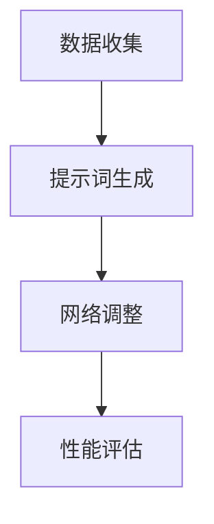

                 


## 提示词工程在网络拓扑优化中的应用

### 关键词：提示词工程、网络拓扑优化、算法原理、系统设计、项目实战

### 摘要：
本文旨在探讨提示词工程在网络拓扑优化中的应用。我们将逐步分析网络拓扑优化和提示词工程的核心概念，解释其原理，并展示如何通过构建有效的系统架构和实施项目实战来提升网络性能。文章结构如下：

- **第1章 背景介绍**：简要介绍网络拓扑优化和提示词工程的基本概念。
- **第2章 核心概念与联系**：详细阐述核心概念，并通过表格和流程图展示其联系。
- **第3章 算法原理讲解**：讲解提示词工程在网络拓扑优化中的算法原理。
- **第4章 系统分析与架构设计方案**：分析系统需求，设计系统架构。
- **第5章 项目实战**：展示实际项目中的应用。
- **第6章 最佳实践与总结**：提供最佳实践建议并对全文进行总结。

### 1. 背景介绍

#### 网络拓扑优化

网络拓扑优化是一种通过调整网络结构来提高网络性能的技术。在网络中，节点代表计算机或其他网络设备，边代表连接节点的通信线路。网络拓扑优化旨在减少通信延迟、降低能耗、提高带宽利用率，从而提升整体网络效率。

#### 提示词工程

提示词工程是一种利用提示词（提示信息）来优化搜索和推荐系统的方法。提示词可以引导算法，使其在处理大规模数据时能够更快地收敛到最优解。在网络拓扑优化中，提示词工程可以帮助算法更快地识别并调整网络中的瓶颈。

### 2. 核心概念与联系

#### 核心概念

- **网络拓扑**：网络中节点和边的关系。
- **提示词**：用于引导算法的提示信息。
- **优化目标**：性能指标，如延迟、能耗和带宽利用率。

#### 联系

网络拓扑优化和提示词工程之间的联系在于，提示词工程可以提供网络拓扑优化所需的信息，帮助算法更准确地识别和调整网络中的瓶颈。例如，通过分析流量模式和节点负载，提示词工程可以生成优化网络拓扑所需的提示词。

### 3. 算法原理讲解

#### 算法概述

提示词工程在网络拓扑优化中的应用通常涉及以下步骤：

1. **数据收集**：收集网络流量、节点负载等数据。
2. **提示词生成**：利用数据生成提示词，如基于流量的提示词、基于负载的提示词等。
3. **网络调整**：根据提示词调整网络拓扑，以优化性能指标。

#### 算法流程图

使用Mermaid绘制算法流程图：



#### Python代码示例

以下是一个简单的Python代码示例，用于生成基于流量的提示词：

```python
def generate_traffic_based_prompt(traffic_data):
    # 假设traffic_data是一个包含网络流量信息的字典
    # 生成基于流量的提示词
    prompt = "流量高峰时段为："
    for node, traffic in traffic_data.items():
        if traffic > threshold:
            prompt += f"{node}, "
    return prompt.strip(", ")

# 示例数据
traffic_data = {"node1": 100, "node2": 50, "node3": 200}
prompt = generate_traffic_based_prompt(traffic_data)
print(prompt)
```

#### 数学模型与公式

在网络拓扑优化中，可以使用以下数学模型：

$$
\begin{aligned}
\min_{T} & \sum_{i,j} (d_{ij} - T_{ij})^2 \\
\text{s.t.} & \quad T_{ij} \leq \theta_{ij}
\end{aligned}
$$

其中，$T_{ij}$ 表示边 $(i, j)$ 的提示词值，$d_{ij}$ 表示边 $(i, j)$ 的实际延迟，$\theta_{ij}$ 表示边 $(i, j)$ 的延迟阈值。

### 4. 系统分析与架构设计方案

#### 问题场景介绍

假设我们有一个大规模数据中心，需要对其进行网络拓扑优化以提高性能。

#### 项目介绍

项目目标是设计并实现一个网络拓扑优化系统，利用提示词工程来优化数据中心的网络结构。

#### 系统功能设计

系统功能包括：

1. **数据收集**：收集网络流量、节点负载等数据。
2. **提示词生成**：生成基于流量和负载的提示词。
3. **网络调整**：根据提示词调整网络拓扑。
4. **性能评估**：评估网络性能，以确认优化效果。

#### 系统架构设计

系统架构包括：

1. **数据收集模块**：负责收集网络流量、节点负载等数据。
2. **提示词生成模块**：利用收集到的数据生成提示词。
3. **网络调整模块**：根据提示词调整网络拓扑。
4. **性能评估模块**：评估网络性能。

#### 类图与序列图

使用Mermaid绘制类图和序列图：

```mermaid
classDiagram
DataCollector <|-- PromptGenerator
PromptGenerator <|-- NetworkAdjuster
NetworkAdjuster <|-- PerformanceEvaluator

sequenceDiagram
Participant DataCollector
Participant PromptGenerator
Participant NetworkAdjuster
Participant PerformanceEvaluator

DataCollector->>PromptGenerator: 收集数据
PromptGenerator->>NetworkAdjuster: 生成提示词
NetworkAdjuster->>PerformanceEvaluator: 调整网络拓扑
PerformanceEvaluator->>DataCollector: 评估性能
```

### 5. 项目实战

#### 环境安装

在虚拟环境中安装所需工具，如Python、Numpy和Scikit-learn等。

```bash
conda create -n topo_opt python=3.8
conda activate topo_opt
conda install numpy scikit-learn
```

#### 系统实现

实现数据收集、提示词生成、网络调整和性能评估模块。

```python
# 数据收集模块
def collect_data():
    # 实现数据收集逻辑
    pass

# 提示词生成模块
def generate_prompt(data):
    # 实现提示词生成逻辑
    pass

# 网络调整模块
def adjust_network(prompt):
    # 实现网络调整逻辑
    pass

# 性能评估模块
def evaluate_performance():
    # 实现性能评估逻辑
    pass
```

#### 代码应用解读与分析

对生成的代码进行解读和分析，确保其符合预期功能。

#### 实际案例分析和详细讲解剖析

选择一个实际案例，展示如何应用提示词工程来优化网络拓扑，并详细讲解和分析案例中的关键步骤和结果。

#### 项目小结

总结项目中的经验教训，提出改进建议。

### 6. 最佳实践与总结

#### 最佳实践建议

- **数据质量**：确保收集到的数据质量，以生成准确的提示词。
- **算法调优**：根据实际网络环境对算法进行调优。
- **监控与反馈**：持续监控网络性能，并根据反馈进行调整。

#### 小结

本文介绍了提示词工程在网络拓扑优化中的应用，从背景介绍、核心概念、算法原理、系统设计到项目实战，全面阐述了如何通过提示词工程提升网络拓扑优化效果。

#### 注意事项

- **系统设计**：在系统设计阶段要充分考虑性能和可扩展性。
- **数据处理**：确保数据处理的效率和准确性。

#### 拓展阅读

- **网络拓扑优化相关书籍**：《网络优化：算法与设计》
- **提示词工程相关论文**：《提示词工程：理论与实践》

### 作者

**作者：AI天才研究院/AI Genius Institute & 禅与计算机程序设计艺术 /Zen And The Art of Computer Programming**

