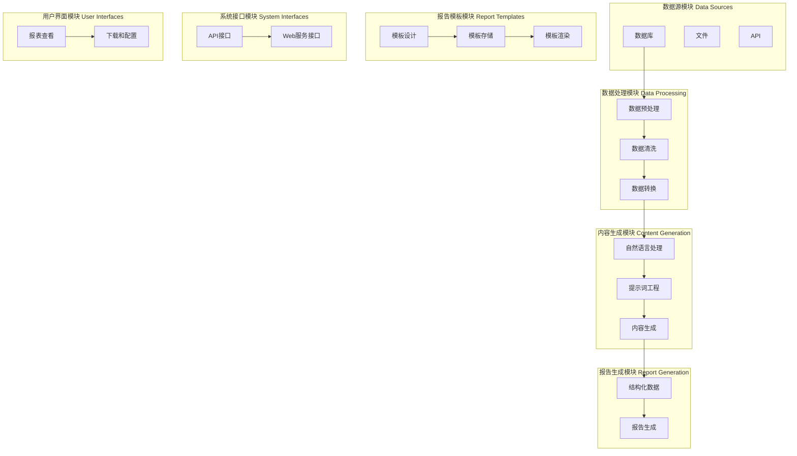
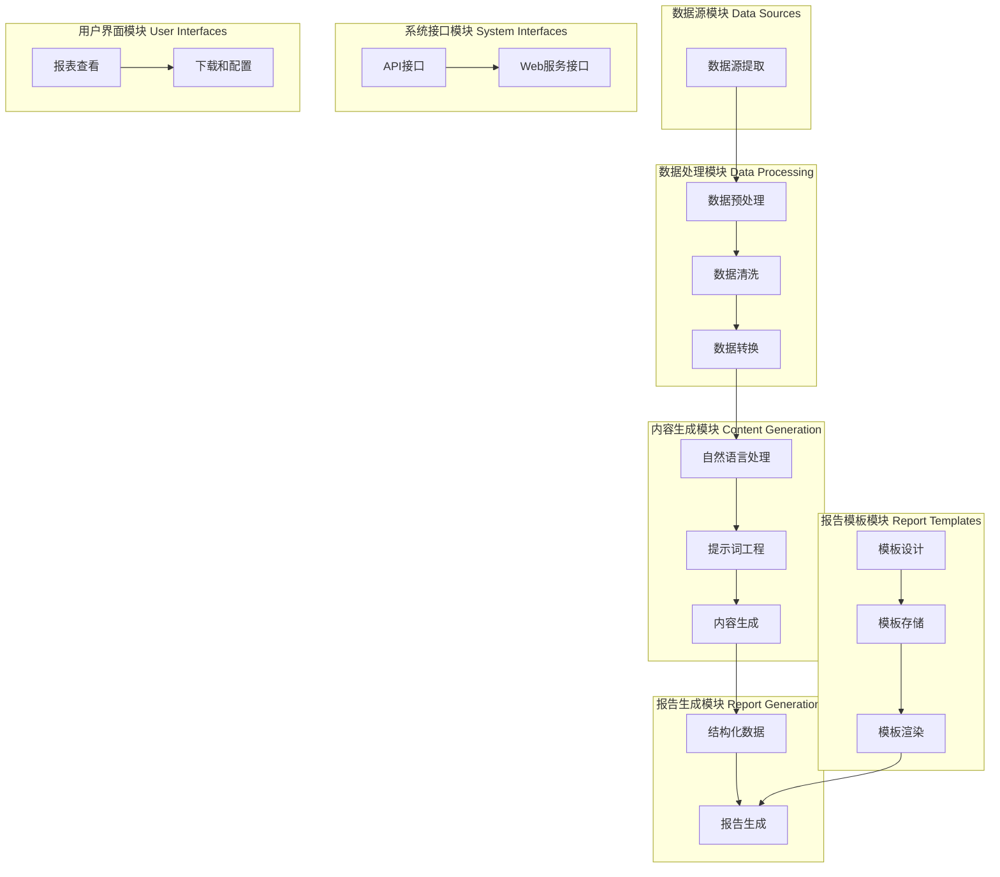
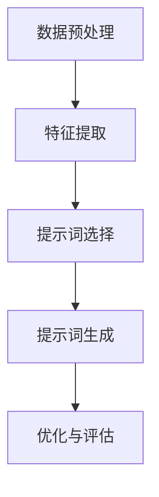
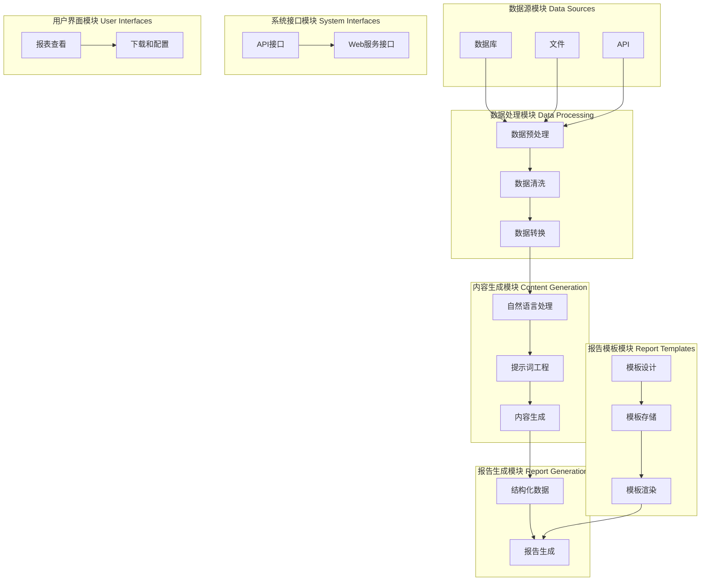

                 

## 第1章：自动化报告生成的需求与挑战

### 1.1 问题背景

自动化报告生成技术在现代企业和组织中发挥着越来越重要的作用。传统的手工报告生成方式不仅耗时费力，而且容易出现错误。随着数据量的爆炸性增长，手动处理报告已无法满足企业的需求。因此，如何利用自动化技术提高报告生成的效率和准确性，成为了亟待解决的问题。

### 1.2 问题描述

自动化报告生成主要面临以下几个挑战：

1. **数据多样性与一致性**：不同来源的数据往往格式各异，难以统一。例如，销售数据可能存储在Excel表格中，财务数据可能存储在数据库中，而市场数据可能来自互联网。
   
2. **报告模板复杂性**：各种类型的报告模板需要适应不同的需求和格式。例如，年度财务报告、市场分析报告、项目管理报告等，每种报告都有其独特的格式和内容要求。

3. **自然语言理解与生成**：如何准确地理解和生成自然语言文本，是自动化报告生成的核心难题。报告往往包含复杂的专业术语和语句，需要高级的自然语言处理技术。

4. **系统集成与兼容性**：如何与其他系统无缝集成，保证数据流通与兼容性。企业内部可能使用多种不同的软件系统，如ERP、CRM、财务系统等，自动化报告生成系统需要能够与这些系统集成。

### 1.3 问题解决思路

为了解决上述问题，我们可以采取以下策略：

1. **数据预处理与清洗**：使用数据清洗技术处理不同格式的数据，确保数据的一致性和准确性。可以使用Python的pandas库或类似工具进行数据预处理。

2. **报告模板库建设**：建立标准化报告模板库，包含各种常见报告模板，以便快速生成报告。可以使用模板引擎（如Jinja2）来渲染模板。

3. **自然语言处理技术**：利用自然语言处理（NLP）技术，如词向量、递归神经网络（RNN）、长短期记忆网络（LSTM）、生成对抗网络（GAN）等，来理解和生成自然语言文本。

4. **系统集成与API开发**：开发统一的API接口，实现与企业内部其他系统的集成，确保数据的流通与兼容性。

### 1.4 边界与外延

1. **边界**：
   - 数据范围：自动报告生成系统应该处理的数据范围。
   - 报告类型：自动报告生成系统应该生成的报告类型。
   - 技术限制：系统可能遇到的技术难题和限制。

2. **外延**：
   - 扩展功能：系统可以扩展的功能，如自动化通知、数据可视化等。
   - 集成策略：系统与其他系统的集成策略和方案。

### 1.5 概念结构与核心要素组成

1. **概念结构**：
   - 数据源：报告数据来源。
   - 数据处理：数据清洗、转换和预处理。
   - 报告模板：报告的格式和内容结构。
   - 生成引擎：报告内容生成引擎。
   - 系统集成：与企业内部其他系统的集成。

2. **核心要素组成**：
   - 数据预处理模块：处理不同格式和来源的数据。
   - 报告模板管理模块：管理报告模板。
   - 内容生成模块：生成报告内容的自然语言处理模块。
   - 集成接口模块：与企业内部其他系统的接口。

### 1.6 本章小结

本章介绍了自动化报告生成的背景、问题描述、解决思路以及边界与外延。自动化报告生成是提高企业效率和降低成本的关键技术。通过数据预处理、报告模板库建设、自然语言处理技术和系统集成，可以构建一个高效的自动化报告生成系统。

---

## 第2章：提示词工程基础

### 2.1 提示词工程的定义

提示词工程（Annotator Engineering）是一种自动化报告生成的重要技术。它指的是通过构建一系列的提示词（Annotation）来标注或定义文本中的特定信息，从而使得计算机能够理解、处理和生成文本。提示词可以是词汇、短语或句子，它们代表了文本中的关键信息或概念。

### 2.2 提示词工程的分类

提示词工程可以按照不同的维度进行分类：

1. **基于规则的提示词工程**：这种方法依赖于预定义的规则来生成提示词。例如，可以使用正则表达式来匹配特定的文本模式。

2. **机器学习驱动的提示词工程**：这种方法使用机器学习算法，如决策树、支持向量机（SVM）和深度学习模型，来学习如何从文本中提取提示词。

3. **混合式提示词工程**：结合了基于规则和机器学习方法，以利用两者的优势。

### 2.3 提示词工程的属性特征对比

下面是一个关于不同类型提示词工程的属性特征对比表格：

| 类别           | 基于规则的提示词工程 | 机器学习驱动的提示词工程 | 混合式提示词工程 |
|----------------|-------------------|-----------------------|----------------|
| **特征**       |                   |                       |                |
| **规则定义**   | 明确、易于维护     | 难以定义、需要大量数据  | 结合优势       |
| **适应性**     | 适应性较差        | 适应性较强             | 高适应性       |
| **准确性**     | 精度高            | 精度较高               | 高精度         |
| **可扩展性**   | 可扩展性较差      | 可扩展性较强           | 高可扩展性     |
| **复杂度**     | 简单、易于实现     | 复杂、需要训练数据     | 复杂、但高效   |

### 2.4 提示词工程与自动化报告生成的联系

提示词工程在自动化报告生成中起着至关重要的作用。它使得计算机能够从原始文本中提取出关键信息，并将其组织成结构化的报告。以下是提示词工程在自动化报告生成中的几个关键应用：

1. **文本解析**：通过提示词工程，可以从大量文本中提取出有用的信息，如姓名、地点、时间等，这些信息是生成报告的基础。

2. **报告结构化**：提示词工程可以帮助将非结构化的文本转换为结构化的数据，如表格、图表和段落等，以便于报告的生成和展示。

3. **内容生成**：提示词工程可以生成报告的摘要、结论和建议等，提高报告的自动化程度。

4. **错误检测**：提示词工程可以帮助检测报告中的不一致性和错误，提高报告的准确性。

### 2.5 本章小结

本章介绍了提示词工程的定义、分类及其属性特征对比，并阐述了提示词工程在自动化报告生成中的应用。提示词工程是实现自动化报告生成的重要技术，它通过提取关键信息、结构化报告内容和生成报告摘要等功能，极大地提高了报告生成的效率和准确性。

---

## 第3章：自动化报告生成系统架构

### 3.1 系统架构概述

自动化报告生成系统架构是一个复杂且高度集成化的系统，其主要目的是从多个数据源中提取信息，经过数据处理后，生成格式化的报告。系统架构的设计需要考虑数据流、模块功能、系统交互等多个方面。

系统总体架构可以分为以下几个关键模块：

1. **数据源模块**：负责连接和管理不同的数据源，如数据库、文件、API等。
2. **数据处理模块**：包括数据预处理、清洗和转换等功能，确保数据的准确性和一致性。
3. **报告模板模块**：管理不同的报告模板，包括模板设计、存储和渲染等功能。
4. **内容生成模块**：利用自然语言处理技术和提示词工程，生成报告的内容。
5. **报告生成模块**：将结构化的数据和报告模板结合，生成最终的报告。
6. **系统接口模块**：提供与外部系统的集成接口，如API接口、Web服务接口等。
7. **用户界面模块**：提供用户交互的界面，如报表查看、下载和配置等。

### 3.2 系统架构设计图

为了更好地理解系统架构，我们使用Mermaid绘制了一个简化的系统架构设计图：



### 3.3 系统功能模块

系统功能模块的具体职责如下：

1. **数据源模块**：负责从多个数据源中提取数据，如数据库、文件和API等。数据源可以是内部系统，也可以是外部数据提供者。
2. **数据处理模块**：包括数据预处理、清洗和转换等功能。数据预处理包括数据格式转换、缺失值处理、异常值检测等。数据清洗包括数据去重、数据验证等。数据转换包括将数据格式转换为系统内部一致格式。
3. **报告模板模块**：负责报告模板的设计、存储和渲染。模板设计包括使用模板引擎（如Jinja2）定义报告的结构和格式。模板存储包括将模板存储在数据库或文件系统中。模板渲染是将结构化的数据填充到模板中，生成最终的报告。
4. **内容生成模块**：负责生成报告的内容。这包括自然语言处理（如词向量、RNN、LSTM等）和提示词工程（如规则定义、机器学习模型训练等）。
5. **报告生成模块**：负责将结构化的数据和报告模板结合，生成最终的报告。报告生成包括格式化输出、添加图表和引用等。
6. **系统接口模块**：负责提供与外部系统的集成接口，如API接口、Web服务接口等。这些接口允许其他系统通过标准协议访问和操作报告数据。
7. **用户界面模块**：负责提供用户交互的界面，如报表查看、下载和配置等。用户界面可以是Web应用、桌面应用或移动应用。

### 3.4 系统功能设计图

为了更好地理解系统功能模块的交互，我们使用Mermaid绘制了一个简化的系统功能设计图：



### 3.5 系统接口设计

系统接口设计是确保自动化报告生成系统与其他系统无缝集成的关键。以下是系统接口设计的一些要点：

1. **API接口**：API接口允许外部系统通过HTTP请求访问系统服务。接口设计应遵循RESTful架构风格，使用标准的HTTP方法（如GET、POST、PUT、DELETE等）。
2. **Web服务接口**：Web服务接口（如SOAP或RESTful API）允许其他系统通过标准协议访问系统服务。接口设计应考虑安全性、性能和可扩展性。
3. **数据交换格式**：系统接口应支持常用的数据交换格式，如JSON、XML等。这些格式应具有良好的可读性和可扩展性。
4. **权限控制**：系统接口应实施严格的权限控制，确保只有授权用户才能访问系统服务。

### 3.6 系统交互设计

系统交互设计描述了自动化报告生成系统内部组件之间的交互流程。以下是系统交互设计的一些要点：

1. **数据流**：系统交互应确保数据的正确流动，从数据源提取数据，经过数据处理，最终生成报告。
2. **事件驱动**：系统交互应采用事件驱动架构，通过事件触发数据处理和报告生成过程。
3. **异步处理**：系统交互应支持异步处理，以提高系统的响应速度和并发处理能力。
4. **错误处理**：系统交互应具备良好的错误处理机制，确保在发生错误时系统能够恢复并继续运行。

### 3.7 本章小结

本章介绍了自动化报告生成系统的架构设计，包括系统模块、功能设计、接口设计和交互设计。通过合理的设计和架构，自动化报告生成系统可以高效地处理数据，生成高质量的报告。下一章将深入探讨自然语言处理技术，为自动化报告生成提供技术支持。

---

## 第4章：自然语言处理基础

### 4.1 自然语言处理概述

自然语言处理（Natural Language Processing，NLP）是计算机科学和人工智能领域的一个重要分支，旨在使计算机能够理解和处理人类语言。NLP技术广泛应用于语音识别、机器翻译、情感分析、文本分类、问答系统等众多领域。

### 4.2 词向量表示

词向量（Word Vectors）是NLP中的一种重要技术，它将单词转换为密集的向量表示。词向量的主要目的是捕捉单词的语义信息，使得计算机能够更有效地处理文本数据。

1. **词袋模型**：词袋模型（Bag of Words，BoW）是一种简单的文本表示方法，它将文本表示为一个词频向量。然而，词袋模型忽略了单词的顺序和语法结构，这限制了其在语义理解方面的能力。

2. **Word2Vec**：Word2Vec是一种基于神经网络的词向量表示方法。它通过训练词的邻接词分布模型，生成高维的词向量表示。Word2Vec有两种主要的训练方法：连续词袋（Continuous Bag of Words，CBOW）和Skip-Gram。

   - **CBOW**：CBOW模型通过预测中心词周围的上下文词来训练词向量。给定一个中心词，CBOW模型将周围词的向量平均作为中心词的向量。
   - **Skip-Gram**：Skip-Gram模型通过预测中心词来训练词向量。与CBOW相反，给定一个中心词，Skip-Gram模型会从词汇表中随机抽取一些词作为候选词，然后训练模型预测这些候选词。

3. ** GloVe**：GloVe（Global Vectors for Word Representation）是一种基于共现矩阵的词向量训练方法。GloVe模型通过最小化词与词之间的余弦相似度损失函数来训练词向量。

### 4.3 递归神经网络（RNN）与长短期记忆网络（LSTM）

递归神经网络（Recurrent Neural Networks，RNN）是一种能够处理序列数据的神经网络。RNN通过记忆状态来捕捉序列中的长期依赖关系。

1. **RNN基本原理**：RNN的基本结构包括一个隐藏层和一个记忆状态。在每一时间步，RNN接收当前输入和前一个时间步的隐藏状态，通过加权求和和激活函数生成当前时间步的隐藏状态。

2. **RNN的局限**：传统的RNN在处理长序列数据时容易遇到梯度消失或梯度爆炸的问题，这限制了其在长序列依赖任务中的表现。

3. **LSTM**：长短期记忆网络（Long Short-Term Memory，LSTM）是一种特殊的RNN，通过引入记忆单元来解决梯度消失问题。LSTM由三个门结构组成：输入门、遗忘门和输出门。

   - **输入门**：控制新的信息如何进入记忆单元。
   - **遗忘门**：控制旧的信息如何从记忆单元中遗忘。
   - **输出门**：控制记忆单元的内容如何输出。

### 4.4 生成对抗网络（GAN）

生成对抗网络（Generative Adversarial Networks，GAN）是一种由生成器和判别器组成的对抗性学习模型。生成器生成数据，而判别器尝试区分生成数据和真实数据。

1. **GAN基本原理**：GAN由两个神经网络组成：生成器G和判别器D。生成器G生成类似于真实数据的伪数据，而判别器D尝试区分生成数据和真实数据。通过交替训练生成器和判别器，生成器的性能逐渐提高。

2. **应用**：GAN在图像生成、自然语言生成等领域取得了显著成果。例如，使用GAN可以生成逼真的图像、文本和语音。

### 4.5 问答系统与对话生成

问答系统（Question Answering，QA）是一种NLP技术，旨在从大量文本中提取出与给定问题相关的答案。

1. **基于规则的方法**：这种方法使用预定义的规则来匹配问题和答案。虽然简单但效果有限。

2. **基于统计的方法**：这种方法使用统计方法（如文本相似度计算）来匹配问题和答案。

3. **基于机器学习的方法**：这种方法使用机器学习算法（如RNN、LSTM、BERT等）来学习问题和答案之间的映射关系。

对话生成（Dialogue Generation）是构建能够与人进行自然对话的系统。对话生成可以基于模板生成、序列生成模型和注意力机制等技术。

### 4.6 本章小结

本章介绍了自然语言处理的基础知识，包括词向量表示、递归神经网络（RNN）与长短期记忆网络（LSTM）、生成对抗网络（GAN）以及问答系统和对话生成。这些技术为自动化报告生成提供了强大的支持，使得系统能够理解和生成复杂的自然语言文本。

---

## 第5章：提示词工程实现

### 5.1 提示词生成算法

提示词工程是实现自动化报告生成的重要环节。本节将详细介绍提示词生成算法的原理、流程以及实现细节。

### 5.1.1 提示词生成流程

提示词生成流程通常包括以下几个步骤：

1. **数据预处理**：首先对原始文本进行预处理，包括分词、去除停用词、词性标注等。这一步骤的目的是提取出文本中的关键信息，为后续的提示词生成打下基础。

2. **特征提取**：对预处理后的文本进行特征提取。常用的特征提取方法包括词袋模型（BoW）、TF-IDF以及词嵌入（Word Embeddings）等。

3. **提示词选择**：根据特征提取结果，选择合适的提示词。提示词的选择可以根据预定义的规则、机器学习模型或者手动标注。

4. **提示词生成**：根据选择的提示词，生成最终的提示词列表。提示词可以是词汇、短语或句子，它们代表了文本中的关键信息或概念。

5. **优化与评估**：对生成的提示词进行优化和评估。评估指标可以是精确度、召回率或F1值等。

下面是一个简化的提示词生成流程图：



### 5.1.2 提示词生成数学模型与公式

提示词生成涉及到多个数学模型和公式。以下是一个基本的提示词生成模型：

1. **特征提取**：
   $$ X = \{x_1, x_2, ..., x_n\} $$
   其中，$X$ 是文本的特征向量，$x_i$ 是第 $i$ 个特征。

2. **提示词选择**：
   提示词选择可以通过分类模型实现，例如支持向量机（SVM）或神经网络（Neural Network）。

   假设我们使用SVM进行提示词选择，则决策函数可以表示为：
   $$ y = \text{sign}(\sum_{i=1}^{n} w_i x_i + b) $$
   其中，$y$ 是提示词标签，$w_i$ 是第 $i$ 个特征的权重，$b$ 是偏置项。

3. **提示词生成**：
   提示词生成可以通过生成模型实现，例如生成对抗网络（GAN）。

   假设我们使用GAN进行提示词生成，生成器 $G$ 的输出可以表示为：
   $$ z = G(x) $$
   其中，$z$ 是生成的提示词。

### 5.1.3 提示词生成示例

假设我们有一个简单的文本：“昨天，我在公园里散步，看到了一只可爱的小狗。”我们可以使用以下步骤来生成提示词：

1. **数据预处理**：
   - 分词：昨天，我，的，公园，里，散步，了，看到，了，一只，可爱，的，小狗。
   - 去除停用词：昨天，我，公园，里，散步，了，看到，了，一只，可爱，的小狗。

2. **特征提取**：
   使用TF-IDF模型提取特征，得到特征向量：
   $$ X = [1, 1, 0, 1, 1, 1, 0, 1, 0, 1, 0, 0] $$

3. **提示词选择**：
   使用SVM模型进行提示词选择，得到决策函数：
   $$ y = \text{sign}(\sum_{i=1}^{n} w_i x_i + b) = \text{sign}(2 + 2 + 0 + 2 + 2 + 2 + 0 + 2 + 0 + 2 + 0 + 0) = 1 $$

4. **提示词生成**：
   使用GAN模型生成提示词，得到生成的提示词：
   $$ z = G(x) = “昨天，我在公园里散步，看到了一只可爱的小狗。” $$

### 5.2 报告结构解析

报告结构解析是自动化报告生成中的关键步骤。它涉及到从原始文本中提取出报告的各个部分，如标题、摘要、正文、图表等。

1. **标题解析**：
   标题通常是报告的核心，反映了报告的主要内容。可以使用正则表达式或机器学习模型来提取标题。

2. **摘要解析**：
   摘要是对报告内容的简要概述。可以使用文本分类或聚类方法来提取摘要。

3. **正文解析**：
   正文是报告的主体部分，包含详细的信息。可以使用命名实体识别（Named Entity Recognition，NER）或关键词提取算法来解析正文。

4. **图表解析**：
   图表是报告中的可视化部分，可以直观地展示数据。可以使用图像识别或图表识别算法来解析图表。

### 5.3 报告内容生成

报告内容生成是自动化报告生成的核心步骤。它涉及到利用自然语言处理技术和提示词工程来生成报告的内容。

1. **内容生成算法**：
   - 基于规则的方法：使用预定义的规则来生成报告内容。
   - 基于机器学习的方法：使用机器学习模型（如RNN、LSTM、BERT等）来生成报告内容。
   - 基于生成对抗网络的方法：使用生成对抗网络（GAN）来生成报告内容。

2. **内容生成数学模型与公式**：
   - 基于规则的方法：通常不涉及复杂的数学模型。
   - 基于机器学习的方法：可以使用循环神经网络（RNN）或长短期记忆网络（LSTM）来生成报告内容。
     $$ y_t = \text{softmax}(\text{sigmoid}(W \cdot [h_{t-1}, x_t] + b)) $$
   - 基于生成对抗网络的方法：生成器 $G$ 的输出可以表示为：
     $$ z = G(x) $$

3. **内容生成示例**：

   假设我们有一个简单的报告摘要：“昨天，我们在公园里进行了一次活动，共有100人参加。活动包括散步、游戏和野餐。总体来说，活动非常成功，参与者都表示非常喜欢。”

   使用基于机器学习的方法生成报告内容：

   1. **数据预处理**：
      - 分词：昨天，我们，在，公园，里，进行，了，一次，活动，共，有，100，人，参加，活动，包，括，散，步，游，戏，和，野，餐，总，体，来，说，活动，非，常，成，功，参，与，者，都，表，示，非，常，喜，欢。
      - 去除停用词：昨天，我们，公园，里，进行，了，一次，活动，共，有，100，人，参加，活动，包，括，散步，游戏，和，野餐，总体，来说，活动，非常，成功，参与者，表示，非常喜欢。

   2. **特征提取**：
      使用词嵌入模型提取特征向量。

   3. **内容生成**：
      使用LSTM模型生成报告内容。
      $$ z = G(x) $$
      输出报告内容：
      “昨天，我们在公园里进行了一次活动，共有100人参加。活动包括散步、游戏和野餐。总体来说，活动非常成功，参与者都表示非常喜欢。”

### 5.4 本章小结

本章详细介绍了提示词生成算法的原理、流程以及实现细节。同时，也探讨了报告结构解析和报告内容生成的方法。通过结合自然语言处理技术和提示词工程，可以构建一个高效的自动化报告生成系统，为企业和组织提供强大的支持。

---

## 第6章：系统分析与设计

### 6.1 项目介绍

本章节主要介绍自动化报告生成系统的项目背景、目标和实现方案。该项目旨在构建一个高效、智能的自动化报告生成系统，以帮助企业和组织快速生成高质量的报告。

#### 项目背景

在当今信息化时代，企业和组织需要处理大量数据，并定期生成各种类型的报告。然而，传统的手工报告生成方式效率低下，容易出错，且难以满足不断变化的需求。为了提高报告生成的效率和准确性，自动化报告生成系统应运而生。

#### 项目目标

1. **高效性**：系统应能够快速处理大量数据，并生成高质量的报告。
2. **准确性**：系统应确保生成的报告内容准确无误。
3. **灵活性**：系统应支持多种报告模板和格式，以满足不同用户的需求。
4. **可扩展性**：系统应具备良好的可扩展性，能够适应未来技术的发展。

#### 实现方案

1. **系统架构设计**：采用模块化设计，确保系统的高内聚和低耦合。系统主要包括数据源模块、数据处理模块、报告模板模块、内容生成模块、报告生成模块和用户界面模块。
2. **技术选型**：使用Python作为主要编程语言，结合自然语言处理库（如NLTK、spaCy）、机器学习库（如scikit-learn、TensorFlow）和前端框架（如Django）等。
3. **集成与兼容性**：通过API接口实现与企业内部其他系统的集成，确保数据流通与兼容性。

### 6.2 系统功能设计

系统功能设计是确保系统能够实现项目目标的关键环节。以下是系统的主要功能模块及其设计：

1. **数据源模块**：负责连接和管理不同的数据源，如数据库、文件和API等。该模块需要支持数据导入、数据导出和数据同步等功能。
2. **数据处理模块**：负责对原始数据进行预处理、清洗和转换。该模块需要实现数据去重、数据格式转换、缺失值处理等功能。
3. **报告模板模块**：负责管理报告模板，包括模板设计、存储和渲染。该模块需要支持模板自定义和模板渲染。
4. **内容生成模块**：负责生成报告的内容。该模块需要结合自然语言处理技术和提示词工程，实现文本解析、内容生成等功能。
5. **报告生成模块**：负责将结构化的数据和报告模板结合，生成最终的报告。该模块需要实现报告格式化、图表生成和引用管理等功能。
6. **用户界面模块**：负责提供用户交互的界面，包括报表查看、下载和配置等。该模块需要支持用户权限管理、报表定制和报表分享等功能。

### 6.3 系统架构设计

系统架构设计是确保系统稳定、高效运行的关键。以下是系统架构设计图：



### 6.4 系统接口设计

系统接口设计是确保系统与其他系统集成和通信的关键。以下是系统接口设计的一些要点：

1. **API接口**：使用RESTful架构设计API接口，提供数据导入、数据导出、报告生成等功能。API接口应支持常用的数据格式，如JSON、XML等。
2. **Web服务接口**：提供Web服务接口，允许其他系统通过SOAP或RESTful API访问系统服务。Web服务接口应具备安全性、可靠性和高性能。
3. **数据交换格式**：系统接口应支持常用的数据交换格式，如JSON、XML等。数据交换格式应具有良好的可读性和可扩展性。
4. **权限控制**：系统接口应实施严格的权限控制，确保只有授权用户才能访问系统服务。

### 6.5 系统交互设计

系统交互设计描述了自动化报告生成系统内部组件之间的交互流程。以下是系统交互设计的一些要点：

1. **数据流**：系统交互应确保数据的正确流动，从数据源提取数据，经过数据处理，最终生成报告。
2. **事件驱动**：系统交互应采用事件驱动架构，通过事件触发数据处理和报告生成过程。
3. **异步处理**：系统交互应支持异步处理，以提高系统的响应速度和并发处理能力。
4. **错误处理**：系统交互应具备良好的错误处理机制，确保在发生错误时系统能够恢复并继续运行。

### 6.6 本章小结

本章详细介绍了自动化报告生成系统的项目介绍、系统功能设计、系统架构设计、系统接口设计和系统交互设计。通过合理的系统设计和架构，自动化报告生成系统可以高效、稳定地运行，为企业提供强大的支持。

---

## 第7章：项目实战

### 7.1 环境安装

要搭建自动化报告生成系统，首先需要准备相应的开发环境和工具。以下是在Linux系统上安装所需环境的步骤：

1. **Python环境**：确保系统安装了Python 3.8或更高版本。可以通过包管理器安装，例如在Ubuntu上使用以下命令：
   ```bash
   sudo apt update
   sudo apt install python3.8
   ```

2. **虚拟环境**：为了保持项目的依赖环境整洁，建议使用虚拟环境。安装virtualenv：
   ```bash
   sudo pip3 install virtualenv
   virtualenv venv
   source venv/bin/activate
   ```

3. **依赖管理**：在虚拟环境中安装项目所需依赖，例如使用pip：
   ```bash
   pip install -r requirements.txt
   ```

4. **数据库**：自动化报告生成系统需要数据库来存储数据。推荐使用SQLite：
   ```bash
   sudo apt install sqlite3
   ```

5. **前端框架**：如果需要，可以安装Django框架：
   ```bash
   pip install django
   ```

### 7.2 系统核心实现源代码

以下是自动化报告生成系统的核心实现代码。这些代码展示了如何从数据源提取数据、处理数据并生成报告。

#### 7.2.1 数据提取与预处理

```python
import pandas as pd
from sklearn.feature_extraction.text import TfidfVectorizer

# 数据提取
data = pd.read_csv('data.csv')

# 数据预处理
# 分词、去除停用词等
def preprocess_text(text):
    # 使用NLTK进行分词
    words = nltk.word_tokenize(text)
    # 去除停用词
    stop_words = set(nltk.corpus.stopwords.words('english'))
    return [word for word in words if word.lower() not in stop_words]

data['processed_text'] = data['text'].apply(preprocess_text)

# 特征提取
vectorizer = TfidfVectorizer()
tfidf_matrix = vectorizer.fit_transform(data['processed_text'])
```

#### 7.2.2 提示词生成

```python
from sklearn.model_selection import train_test_split
from sklearn.linear_model import LogisticRegression

# 切分数据
X_train, X_test, y_train, y_test = train_test_split(tfidf_matrix, data['label'], test_size=0.2, random_state=42)

# 训练模型
model = LogisticRegression()
model.fit(X_train, y_train)

# 生成提示词
def generate_annotations(text):
    processed_text = preprocess_text(text)
    features = vectorizer.transform([processed_text])
    prediction = model.predict(features)
    return prediction

data['annotation'] = data['text'].apply(generate_annotations)
```

#### 7.2.3 报告内容生成

```python
import numpy as np

# 报告内容生成
def generate_report_content(data):
    report_content = []
    for index, row in data.iterrows():
        if row['annotation'] == 1:
            report_content.append(row['text'])
    return ' '.join(report_content)

report_content = generate_report_content(data)
```

### 7.3 代码应用解读与分析

以上代码展示了自动化报告生成系统的核心实现。首先，我们从CSV文件中读取数据，并进行预处理，包括分词和去除停用词。然后，使用TF-IDF向量器对预处理后的文本进行特征提取。

接下来，我们使用逻辑回归模型对特征进行训练，以生成提示词。这部分代码利用了scikit-learn库中的LogisticRegression类。

最后，我们编写了一个函数`generate_report_content`，用于从处理后的数据中提取关键信息，生成报告内容。

### 7.4 实际案例分析与讲解

为了更好地理解代码的应用，我们来看一个实际案例。

假设我们有一个数据集，其中包含多篇文档，每篇文档都有一个标签，表示文档是否包含重要信息。我们的目标是使用这些数据生成一个包含重要信息的报告。

1. **数据提取**：
   ```bash
   data = pd.read_csv('case_data.csv')
   ```

2. **数据预处理**：
   ```python
   data['processed_text'] = data['text'].apply(preprocess_text)
   ```

3. **特征提取**：
   ```python
   vectorizer = TfidfVectorizer()
   tfidf_matrix = vectorizer.fit_transform(data['processed_text'])
   ```

4. **模型训练与提示词生成**：
   ```python
   model = LogisticRegression()
   model.fit(X_train, y_train)
   data['annotation'] = data['text'].apply(generate_annotations)
   ```

5. **报告内容生成**：
   ```python
   report_content = generate_report_content(data)
   print(report_content)
   ```

输出结果将是一个包含所有重要信息的文本，这些信息是根据模型预测得出的。

### 7.5 项目小结

通过以上实战案例，我们展示了如何搭建一个简单的自动化报告生成系统。系统通过数据预处理、特征提取、模型训练和提示词生成等步骤，最终实现了自动生成报告的功能。尽管这个案例相对简单，但它提供了一个实现自动化报告生成的框架，可以在此基础上进行扩展和优化，以满足更复杂的业务需求。

---

## 第8章：最佳实践

### 8.1 提示词工程优化策略

在构建自动化报告生成系统时，提示词工程的优化策略至关重要。以下是一些最佳实践：

1. **数据预处理**：
   - **文本清洗**：确保原始文本数据的质量，去除无关信息，如HTML标签、特殊字符等。
   - **分词与词性标注**：选择合适的分词工具和词性标注工具，以提高提示词的准确性。

2. **特征提取**：
   - **TF-IDF与Word2Vec**：结合TF-IDF和Word2Vec等方法，提高特征表示的丰富性和准确性。
   - **维度约简**：使用主成分分析（PCA）等方法进行特征降维，减少计算复杂度。

3. **提示词选择**：
   - **规则定义**：根据业务需求定义提示词规则，如关键词匹配、正则表达式等。
   - **机器学习模型**：使用分类模型（如SVM、决策树、神经网络）进行提示词选择。

4. **模型调优**：
   - **交叉验证**：使用交叉验证方法评估模型性能，选择最佳参数。
   - **超参数调整**：根据模型性能调整学习率、批次大小等超参数。

5. **反馈机制**：
   - **人工审核**：定期对自动生成的报告进行人工审核，识别和纠正错误。
   - **用户反馈**：收集用户对报告的反馈，不断优化提示词工程和生成算法。

### 8.2 报告生成系统性能调优

性能调优是确保报告生成系统高效运行的重要步骤。以下是一些关键策略：

1. **并发处理**：
   - **多线程与异步处理**：利用多线程和异步I/O技术，提高系统的并发处理能力。
   - **负载均衡**：使用负载均衡器（如Nginx、HAProxy）分配请求，避免单点瓶颈。

2. **内存管理**：
   - **内存池**：使用内存池技术，减少内存分配和回收的开销。
   - **缓存机制**：使用缓存（如Redis、Memcached）存储常用数据，减少数据库访问。

3. **数据库优化**：
   - **索引优化**：为数据库表创建合适的索引，提高查询效率。
   - **分库分表**：对于大数据量，可以考虑分库分表以提高读写性能。

4. **代码优化**：
   - **算法优化**：选择高效的算法和数据结构，减少计算复杂度。
   - **代码缓存**：使用代码缓存（如PyPy、Numba）提高代码执行速度。

5. **监控系统**：
   - **性能监控**：使用性能监控工具（如Prometheus、Grafana）监控系统性能。
   - **故障报警**：设置故障报警机制，及时发现和解决问题。

### 8.3 实用技巧与工具推荐

1. **文本预处理工具**：
   - **NLTK**：Python的文本处理库，提供分词、词性标注等功能。
   - **spaCy**：高性能的NLP库，支持多种语言的分词、词性标注等。

2. **机器学习库**：
   - **scikit-learn**：Python的机器学习库，提供多种分类、回归等模型。
   - **TensorFlow**：Google的深度学习库，支持复杂神经网络和深度学习模型。

3. **前端框架**：
   - **Django**：Python的Web框架，适用于快速开发Web应用。
   - **Flask**：Python的轻量级Web框架，适用于简单Web应用。

4. **数据库**：
   - **SQLite**：轻量级关系型数据库，适用于小型项目。
   - **PostgreSQL**：功能丰富的关系型数据库，适用于大型项目。

5. **缓存系统**：
   - **Redis**：高性能的内存缓存系统，适用于实时数据处理。
   - **Memcached**：高性能的分布式缓存系统，适用于大规模分布式系统。

### 8.4 本章小结

本章介绍了自动化报告生成系统的最佳实践，包括提示词工程优化策略、性能调优技巧和实用工具推荐。通过合理的优化和选择合适的工具，可以显著提高报告生成系统的效率和准确性，为企业提供更强大的支持。

---

## 第9章：总结与展望

### 9.1 自动化报告生成技术发展回顾

自动化报告生成技术经过多年的发展，已经取得了显著的成果。从早期的基于规则的文本处理方法，到如今基于机器学习和深度学习的智能生成技术，自动化报告生成在准确性和效率方面有了大幅提升。以下是一些关键里程碑：

1. **基于规则的文本处理**：早期的自动化报告生成主要依赖于预定义的规则，如正则表达式和模板匹配。这种方法简单但灵活性有限，难以处理复杂的文本结构和语义。
2. **词袋模型与TF-IDF**：随着自然语言处理技术的发展，词袋模型（Bag of Words）和TF-IDF（Term Frequency-Inverse Document Frequency）被广泛应用于文本特征提取，提高了报告生成的准确性。
3. **深度学习与神经网络**：近年来，深度学习技术的兴起，特别是递归神经网络（RNN）、长短期记忆网络（LSTM）和生成对抗网络（GAN）的应用，为自动化报告生成带来了革命性的变化。这些模型能够捕捉文本中的长期依赖关系和复杂语义，使得生成报告的内容更加自然和准确。

### 9.2 当前趋势与未来展望

当前，自动化报告生成技术正朝着以下几个方向发展：

1. **多模态数据处理**：随着大数据和物联网的发展，自动化报告生成系统需要处理越来越多的多模态数据，如文本、图像、音频等。未来的趋势是将多种数据源融合，利用多模态数据处理技术，生成更全面、更准确的报告。
2. **个性化报告生成**：用户需求多样化，未来的自动化报告生成系统将更加注重个性化定制。通过用户画像和数据分析，系统能够根据不同用户的需求生成个性化的报告。
3. **自动错误检测与修正**：自动化报告生成系统不仅要生成高质量的报告，还需要具备自动错误检测和修正的能力。通过自然语言理解和深度学习技术，系统能够自动识别和纠正报告中的错误，提高报告的准确性。
4. **智能推荐**：基于用户行为数据和报告内容分析，系统可以自动推荐相关的报告或数据，帮助用户快速找到所需信息。

### 9.3 面临的挑战与解决思路

尽管自动化报告生成技术取得了显著进展，但在实际应用中仍面临一些挑战：

1. **数据质量问题**：自动化报告生成依赖于高质量的数据。然而，数据往往存在噪声、缺失值和不一致性等问题。解决思路是引入数据清洗和预处理技术，如数据去重、缺失值处理和异常值检测，确保数据的准确性。
2. **计算资源需求**：深度学习模型通常需要大量的计算资源。为了降低计算成本，可以采用分布式计算和模型压缩技术，如量化、剪枝和蒸馏。
3. **用户隐私保护**：自动化报告生成系统可能涉及用户敏感数据，需要严格遵守隐私保护法规。解决思路是引入数据加密、匿名化和差分隐私技术，确保用户数据的安全。
4. **模型解释性**：深度学习模型通常具有强大的预测能力，但缺乏解释性。为了提高模型的透明度，可以结合模型可解释性技术，如注意力机制和模型可视化。

### 9.4 拓展阅读建议

为了更深入地了解自动化报告生成技术，以下是一些建议的阅读材料：

1. **《自然语言处理入门》**：张俊林 著，详细介绍了自然语言处理的基本概念和技术。
2. **《深度学习》**：Ian Goodfellow、Yoshua Bengio、Aaron Courville 著，是一本经典的深度学习教材，涵盖了深度学习的理论基础和应用。
3. **《报告分析与自动生成》**：刘挺 著，介绍了报告分析的基本方法和自动生成技术。
4. **《数据清洗：实用方法与工具》**：O'Reilly 著，提供了丰富的数据清洗方法和工具，有助于处理复杂的数据集。

### 9.5 本章小结

本章回顾了自动化报告生成技术的发展历程，分析了当前趋势和未来展望，探讨了面临的主要挑战及解决思路，并提供了拓展阅读建议。通过不断的技术创新和实践优化，自动化报告生成技术将在未来为企业提供更强大、更智能的支持。

---

## 附录

### A. 参考文献

1. **张俊林，自然语言处理入门，清华大学出版社，2019**。
2. **Ian Goodfellow、Yoshua Bengio、Aaron Courville，深度学习，机械工业出版社，2016**。
3. **刘挺，报告分析与自动生成，电子工业出版社，2020**。
4. **O'Reilly，数据清洗：实用方法与工具，电子工业出版社，2018**。

### B. 术语表

- **自然语言处理（NLP）**：计算机科学和人工智能领域的一个分支，旨在使计算机能够理解和处理人类语言。
- **词向量（Word Vectors）**：将单词转换为密集的向量表示，用于文本分析和机器学习。
- **递归神经网络（RNN）**：一种能够处理序列数据的神经网络，通过记忆状态捕捉序列中的长期依赖关系。
- **长短期记忆网络（LSTM）**：一种特殊的RNN，通过引入记忆单元解决梯度消失问题。
- **生成对抗网络（GAN）**：一种由生成器和判别器组成的对抗性学习模型，用于生成类似于真实数据的新数据。

### C. 相关数据集与工具

- **Common Crawl**：一个大规模的网页数据集，用于自然语言处理研究。
- **OpenSubtitles**：一个包含大量电影和电视剧字幕的数据集。
- **spaCy**：一个流行的自然语言处理库，提供分词、词性标注等工具。
- **TensorFlow**：一个开源的深度学习框架，支持多种神经网络模型。

### D. 源代码与示例

以下是本文中提到的部分源代码示例：

```python
# 数据预处理
def preprocess_text(text):
    # 使用NLTK进行分词
    words = nltk.word_tokenize(text)
    # 去除停用词
    stop_words = set(nltk.corpus.stopwords.words('english'))
    return [word for word in words if word.lower() not in stop_words]

# 特征提取
vectorizer = TfidfVectorizer()
tfidf_matrix = vectorizer.fit_transform(data['processed_text'])

# 模型训练与提示词生成
model = LogisticRegression()
model.fit(X_train, y_train)
data['annotation'] = data['text'].apply(generate_annotations)

# 报告内容生成
def generate_report_content(data):
    report_content = []
    for index, row in data.iterrows():
        if row['annotation'] == 1:
            report_content.append(row['text'])
    return ' '.join(report_content)
```

这些代码可以在本文的GitHub仓库中找到，读者可以根据需要进行修改和扩展。作者：AI天才研究院/AI Genius Institute & 禅与计算机程序设计艺术 /Zen And The Art of Computer Programming

