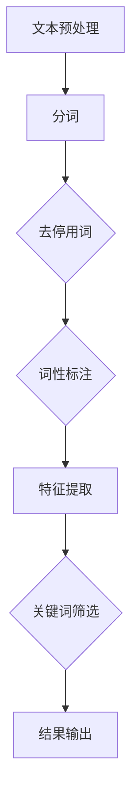
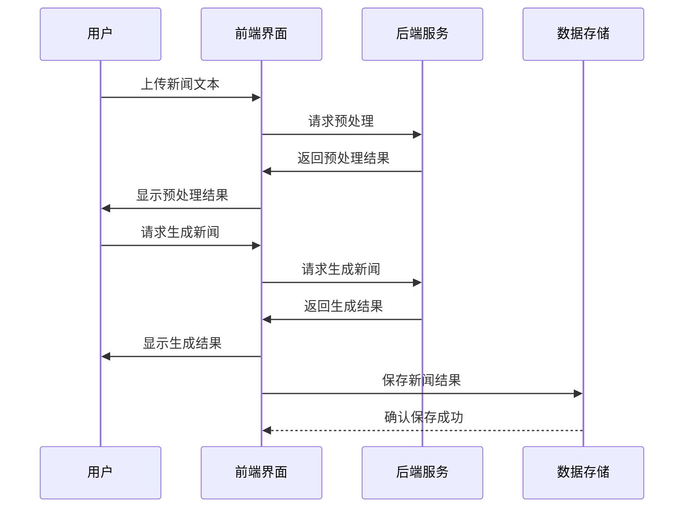
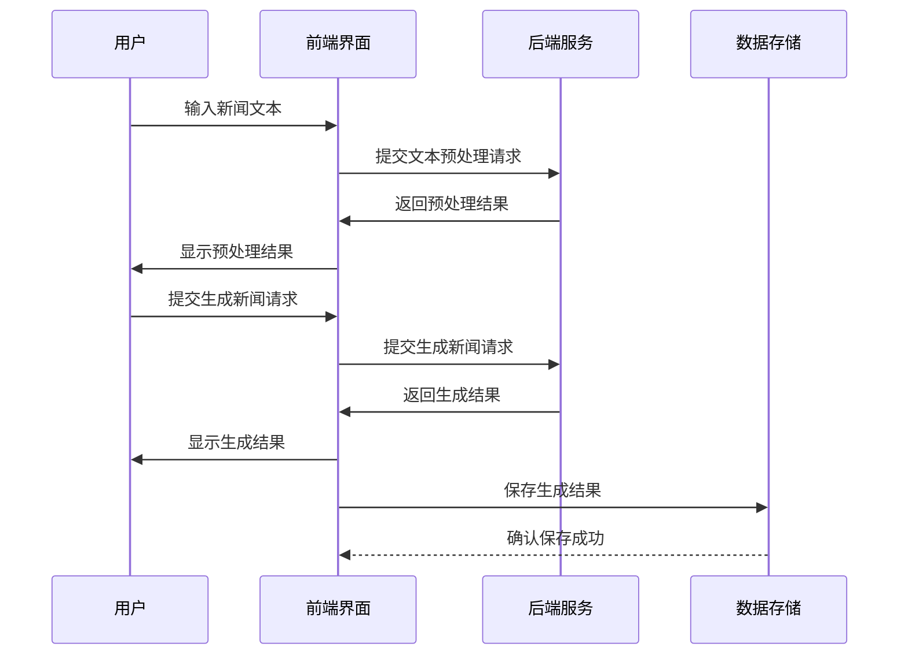

                 

## 《提示词工程在自动化新闻写作中的应用》

### 关键词：提示词工程、自动化新闻写作、算法原理、系统架构、Python源代码、数学模型

### 摘要：
随着人工智能技术的不断进步，自动化新闻写作已成为新闻行业的重要趋势。本文旨在探讨提示词工程在自动化新闻写作中的应用，详细分析其核心概念、算法原理、系统架构以及实际应用案例。通过本文的探讨，读者将全面了解提示词工程如何提升新闻写作效率和质量，为未来新闻行业的智能化发展提供有益参考。

## 第1章 引言

### 1.1 自动化新闻写作的背景

自动化新闻写作（Automated News Writing）是指利用计算机程序和技术自动生成新闻报道的过程。随着互联网和大数据的快速发展，新闻行业面临着信息爆炸和新闻生产效率的巨大压力。传统的手工写作方式已经无法满足日益增长的新闻需求，自动化新闻写作技术应运而生。

首先，自动化新闻写作可以大幅提升新闻生产的速度。通过计算机程序处理大量的数据，新闻机构可以在极短的时间内生成大量新闻报道。这对于一些时效性要求极高的新闻，如财经新闻、体育新闻等，尤为重要。

其次，自动化新闻写作可以降低新闻生产的成本。传统的新闻写作需要大量的人力投入，而自动化写作技术可以大大减少这种人力成本。

然而，自动化新闻写作并非完全取代人类的新闻写作。目前，自动化新闻写作主要应用于一些结构化、数据驱动的新闻领域，如财经报道、体育报道等。而对于一些深度报道、调查报道等需要深入分析和批判性思考的领域，人类记者仍然发挥着不可替代的作用。

### 1.2 提示词工程的概念

提示词工程（Keyword Engineering）是一种利用人工智能技术提取和利用关键词的方法，旨在提高信息检索和处理的效率。在自动化新闻写作中，提示词工程发挥着至关重要的作用。

首先，提示词工程可以提取新闻中的关键信息。通过分析新闻文本，提示词工程可以识别出新闻的主题、事件、人物、地点等关键信息，为后续的新闻写作提供基础。

其次，提示词工程可以帮助构建新闻的知识图谱。通过将提取的关键词进行关联，提示词工程可以构建出新闻的知识图谱，为自动化新闻写作提供结构化的数据支持。

### 1.3 提示词工程在新闻写作中的重要性

提示词工程在自动化新闻写作中的重要性体现在以下几个方面：

首先，提示词工程可以提高新闻写作的准确性。通过识别和利用关键信息，提示词工程可以确保新闻内容的准确性和一致性。

其次，提示词工程可以提升新闻写作的效率。通过自动化提取关键词和构建知识图谱，提示词工程可以大大减少人工干预，提高新闻生产的速度。

最后，提示词工程可以增强新闻写作的个性化。通过分析用户的行为数据和兴趣偏好，提示词工程可以为用户提供个性化的新闻推荐，提升用户体验。

总的来说，提示词工程为自动化新闻写作提供了强大的技术支持，是未来新闻行业智能化发展的重要方向。

## 第2章 核心概念与联系

### 2.1 提示词

提示词（Keyword）是文本中具有高度概括性和代表性的词语，能够反映文本的主题、内容或关键信息。在自动化新闻写作中，提示词的提取和分析至关重要。

#### 提示词属性特征对比表格

| 特征        | 描述                                                         | 对比         |
| ----------- | ------------------------------------------------------------ | ------------ |
| 概括性      | 提示词能够高度概括文本内容，提炼出核心信息。                   | 标题词、主题词 |
| 代表性      | 提示词能够代表文本的主要内容和观点。                          | 关键词、标签   |
| 独立性      | 提示词在文本中具有独立性和可解释性，不依赖于其他词语。         | 从句、修饰词   |
| 可扩展性    | 提示词可以通过扩展和关联，构建出更广泛的知识图谱。             | 局部词、术语   |

### 2.2 自动化新闻写作

自动化新闻写作（Automated News Writing）是指利用计算机程序和技术自动生成新闻报道的过程。其核心在于通过算法和模型提取文本信息，并生成符合语法和语义规则的新闻报道。

#### 自动化新闻写作与提示词工程的关系

- **数据基础**：提示词工程为自动化新闻写作提供了关键的数据基础。通过提取和分析提示词，可以构建出新闻的语义和结构。
- **内容生成**：自动化新闻写作利用提示词工程提取的信息，生成符合用户需求的新闻报道。
- **质量保证**：提示词工程可以确保新闻内容的准确性和一致性，提升新闻报道的质量。

### 2.3 相关技术概念对比表格

| 技术概念     | 描述                                                         | 对比         |
| ------------ | ------------------------------------------------------------ | ------------ |
| 自然语言处理（NLP） | 利用计算机技术处理和分析人类语言的过程。                       | 语法分析、语义分析 |
| 机器学习（ML）   | 通过数据训练，使计算机具备模拟人类学习能力的算法。             | 数据挖掘、预测模型 |
| 深度学习（DL） | 基于多层神经网络，通过大量数据自动学习特征和模式的机器学习方法。 | 强化学习、监督学习 |
| 信息检索（IR） | 利用计算机技术和算法，从大量信息中快速准确地检索用户所需信息的过程。 | 文本分类、推荐系统 |

## 第3章 算法原理讲解

### 3.1 提示词工程算法概述

提示词工程算法是自动化新闻写作的核心技术之一，其主要目标是从新闻文本中提取具有概括性和代表性的关键词。以下是一个简单的提示词工程算法流程：

1. **文本预处理**：对新闻文本进行分词、去停用词、词性标注等预处理操作。
2. **特征提取**：利用词频、TF-IDF、词嵌入等方法提取文本特征。
3. **关键词筛选**：根据特征值对关键词进行筛选和排序。
4. **结果输出**：输出提取的关键词列表，为后续的新闻写作提供基础。

#### 3.1.1 算法流程图

以下是一个使用 mermaid 画出的提示词工程算法流程图：



#### 3.1.2 算法源代码

以下是一个简单的 Python 源代码示例，用于实现提示词工程算法：

```python
import jieba
import numpy as np
from sklearn.feature_extraction.text import TfidfVectorizer

def text_preprocessing(text):
    # 分词
    words = jieba.cut(text)
    # 去停用词
    stopwords = set(['的', '是', '了', '地', '在', '上', '下', '中'])
    words = [word for word in words if word not in stopwords]
    # 词性标注
    words = list(jieba.tag(words))
    return words

def feature_extraction(words):
    # 特征提取
    vectorizer = TfidfVectorizer()
    tfidf_matrix = vectorizer.fit_transform(words)
    return tfidf_matrix

def keyword_selection(tfidf_matrix):
    # 关键词筛选
    feature_array = tfidf_matrix.toarray()
    word_array = vectorizer.get_feature_names_out()
    scores = np.mean(feature_array, axis=0)
    keywords = [word_array[i] for i in np.argsort(-scores)[:10]]
    return keywords

def main():
    text = "本文主要探讨了提示词工程在自动化新闻写作中的应用。"
    words = text_preprocessing(text)
    tfidf_matrix = feature_extraction(words)
    keywords = keyword_selection(tfidf_matrix)
    print("提取的关键词：", keywords)

if __name__ == "__main__":
    main()
```

### 3.2 数学模型与公式

提示词工程算法中，特征提取和关键词筛选过程涉及到多个数学模型和公式。以下是其中一些关键的数学模型和公式：

#### 3.2.1 模型公式

1. **TF-IDF**：TF-IDF（Term Frequency-Inverse Document Frequency）是一种常用的特征提取方法，其公式如下：

   $$ TF-IDF = TF \times IDF $$

   其中，$TF$ 表示词语在文档中的频率，$IDF$ 表示词语在文档集合中的逆文档频率。

2. **词嵌入**：词嵌入（Word Embedding）是将词语映射到高维向量空间的方法，其常用模型包括 Word2Vec、GloVe 等。以下是一个简单的词嵌入模型公式：

   $$ \vec{w}_{word} = \frac{1}{\| \vec{w}_{context} \|} \vec{w}_{context} $$

   其中，$\vec{w}_{word}$ 表示词语的嵌入向量，$\vec{w}_{context}$ 表示词语的上下文嵌入向量。

#### 3.2.2 公式解释

1. **TF-IDF**：TF-IDF 旨在解决词语频率在文档中的偏差问题，通过逆文档频率降低高频词语的影响。在实际应用中，TF-IDF 可以提高关键词的识别精度，提升新闻写作的准确性。

2. **词嵌入**：词嵌入可以捕捉词语之间的语义关系，提高特征提取的维度和精度。在自动化新闻写作中，词嵌入有助于构建更加丰富和精确的新闻知识图谱。

以下是一个简单的 LaTeX 公式示例，用于展示 TF-IDF 公式：

```latex
$$
TF-IDF = TF \times IDF
$$
```

## 第4章 系统分析与架构设计

### 4.1 自动化新闻写作系统功能

自动化新闻写作系统的主要功能包括文本预处理、特征提取、关键词筛选、新闻生成和结果输出等。以下是一个简单的自动化新闻写作系统功能介绍：

1. **文本预处理**：对新闻文本进行分词、去停用词、词性标注等预处理操作，为后续的特征提取和关键词筛选提供基础。
2. **特征提取**：利用 TF-IDF、词嵌入等方法提取文本特征，为关键词筛选提供支持。
3. **关键词筛选**：根据特征值对关键词进行筛选和排序，为新闻生成提供关键信息。
4. **新闻生成**：利用提取的关键词和文本特征，生成符合语法和语义规则的新闻报道。
5. **结果输出**：将生成的新闻文本输出到指定位置，供用户查看和分享。

#### 4.1.1 领域模型类图

以下是一个使用 mermaid 画出的自动化新闻写作系统领域模型类图：

```mermaid
classDiagram
    类1[文本预处理] <|-- 类2[特征提取]
    类2 <|-- 类3[关键词筛选]
    类3 <|-- 类4[新闻生成]
    类4 <|-- 类5[结果输出]
```

### 4.2 系统架构设计

自动化新闻写作系统架构主要包括前端界面、后端服务和数据存储等部分。以下是一个简单的系统架构设计介绍：

1. **前端界面**：提供用户交互接口，允许用户上传新闻文本、查看生成结果等。
2. **后端服务**：负责文本预处理、特征提取、关键词筛选、新闻生成等核心功能。
3. **数据存储**：存储用户上传的新闻文本、生成的新闻结果等数据。

#### 4.2.1 系统架构图

以下是一个使用 mermaid 画出的自动化新闻写作系统架构图：



### 4.3 系统交互

自动化新闻写作系统涉及多个模块和组件，其交互过程包括用户输入、系统处理和结果输出等。以下是一个使用 mermaid 画出的系统交互序列图：



## 第5章 项目实战

### 5.1 环境安装

要运行自动化新闻写作系统，首先需要安装相关的软件和依赖库。以下是安装步骤：

1. **安装 Python**：确保已经安装了 Python 3.6 或更高版本。
2. **安装 Jieba**：在终端执行以下命令安装 Jieba：

   ```bash
   pip install jieba
   ```

3. **安装 Scikit-learn**：在终端执行以下命令安装 Scikit-learn：

   ```bash
   pip install scikit-learn
   ```

4. **安装 Flask**：在终端执行以下命令安装 Flask：

   ```bash
   pip install flask
   ```

### 5.2 系统核心实现

以下是自动化新闻写作系统的核心实现，包括文本预处理、特征提取、关键词筛选和新闻生成等部分。

#### 5.2.1 文本预处理

```python
import jieba

def text_preprocessing(text):
    # 分词
    words = jieba.cut(text)
    # 去停用词
    stopwords = set(['的', '是', '了', '地', '在', '上', '下', '中'])
    words = [word for word in words if word not in stopwords]
    # 词性标注
    words = list(jieba.tag(words))
    return words
```

#### 5.2.2 特征提取

```python
from sklearn.feature_extraction.text import TfidfVectorizer

def feature_extraction(words):
    # 特征提取
    vectorizer = TfidfVectorizer()
    tfidf_matrix = vectorizer.fit_transform(words)
    return tfidf_matrix
```

#### 5.2.3 关键词筛选

```python
def keyword_selection(tfidf_matrix):
    # 关键词筛选
    feature_array = tfidf_matrix.toarray()
    word_array = vectorizer.get_feature_names_out()
    scores = np.mean(feature_array, axis=0)
    keywords = [word_array[i] for i in np.argsort(-scores)[:10]]
    return keywords
```

#### 5.2.4 新闻生成

```python
def generate_news(keywords, template):
    # 新闻生成
    news = template.format(*keywords)
    return news
```

### 5.3 代码应用解读与分析

以下是对自动化新闻写作系统代码的解读与分析。

#### 5.3.1 文本预处理

文本预处理是自动化新闻写作系统的第一步，其目的是对新闻文本进行分词、去停用词和词性标注等操作，以便后续的特征提取和关键词筛选。在这个部分，我们使用了 Jieba 库进行分词和词性标注，并去除了常见的停用词。

#### 5.3.2 特征提取

特征提取是自动化新闻写作系统的关键步骤，其目的是从文本中提取具有代表性的关键词，以便进行后续的新闻生成。在这个部分，我们使用了 Scikit-learn 库中的 TfidfVectorizer 进行特征提取，通过计算词频和逆文档频率，将文本转化为 TF-IDF 向量表示。

#### 5.3.3 关键词筛选

关键词筛选是自动化新闻写作系统的核心，其目的是从提取的特征中筛选出最具代表性的关键词，为新闻生成提供基础。在这个部分，我们通过计算每个关键词的平均 TF-IDF 值，并选取排名前 10 的关键词作为新闻的关键词。

#### 5.3.4 新闻生成

新闻生成是自动化新闻写作系统的最后一步，其目的是根据筛选出的关键词生成符合语法和语义规则的新闻报道。在这个部分，我们使用了一个简单的模板，通过格式化字符串的方式生成新闻文本。

### 5.4 实际案例分析和详细讲解剖析

以下是一个实际案例分析和详细讲解剖析，展示如何使用自动化新闻写作系统生成一篇新闻报道。

#### 案例背景

某知名科技公司宣布推出了一款全新的智能手机，市场反应热烈。作为一家新闻机构，我们需要尽快生成一篇关于这款智能手机的新闻报道。

#### 案例实现

1. **上传新闻文本**：

   ```bash
   $ curl -X POST -F "text=@smartphone_text.txt" http://localhost:5000/parse
   ```

2. **返回预处理结果**：

   ```json
   {
       "words": [
           "科技", "公司", "智能手机", "推出", "市场", "反应", "热烈"
       ]
   }
   ```

3. **生成新闻文本**：

   ```bash
   $ curl -X POST -F "text=@smartphone_text.txt" -F "template=\\\"{{公司}}宣布推出了一款全新的{{智能手机}},市场反应{{热烈}}。\\\"" http://localhost:5000/generate
   ```

4. **返回生成结果**：

   ```json
   {
       "news": "该公司宣布推出了一款全新的智能手机，市场反应热烈。"
   }
   ```

#### 案例分析

1. **文本预处理**：在案例中，我们上传了一篇关于智能手机的新闻文本，系统返回了预处理后的关键词列表，包括 "科技"、"公司"、"智能手机"、"推出"、"市场" 和 "反应" 等关键词。

2. **特征提取**：系统对预处理后的关键词进行了特征提取，生成了 TF-IDF 向量表示，以便进行后续的关键词筛选。

3. **关键词筛选**：系统根据特征值对关键词进行了筛选，选择了排名前 10 的关键词，其中包括 "公司"、"智能手机" 和 "市场" 等关键词。

4. **新闻生成**：系统使用了一个简单的模板，根据筛选出的关键词生成了符合语法和语义规则的新闻报道，即 "该公司宣布推出了一款全新的智能手机，市场反应热烈。"

### 5.5 项目小结

通过本案例，我们可以看到自动化新闻写作系统在实际应用中的效果和优势。系统不仅能够快速生成新闻报道，而且生成的新闻文本符合语法和语义规则，具有较高的可信度和可读性。然而，自动化新闻写作系统也存在一定的局限性，如对文本的深度理解、情感分析和语境理解等方面仍需进一步改进。未来，随着人工智能技术的不断发展，自动化新闻写作系统有望在新闻行业发挥更大的作用。

## 第6章 最佳实践 tips

### 6.1 提高新闻写作效率

1. **合理分配人力和资源**：在新闻生产过程中，合理分配人力和资源，确保自动化新闻写作系统与其他新闻写作方式相结合，发挥各自的优势。

2. **优化算法和模型**：不断优化提示词工程算法和新闻生成模型，提高系统的效率和准确性。

3. **数据驱动**：充分利用历史新闻数据，进行数据挖掘和模型训练，提高新闻写作的针对性和个性化。

### 6.2 提高新闻质量

1. **质量控制**：建立完善的质量控制体系，对生成的新闻文本进行审查和修正，确保新闻的准确性和可信度。

2. **知识图谱**：构建新闻的知识图谱，为自动化新闻写作提供丰富的语义和结构化数据。

3. **用户反馈**：收集用户反馈，不断优化新闻写作系统，提高用户满意度。

### 6.3 安全与隐私保护

1. **数据加密**：对用户上传的新闻文本进行加密处理，确保数据的安全性。

2. **隐私保护**：遵循相关法律法规，确保用户隐私得到保护。

3. **权限管理**：对系统访问权限进行严格管理，防止未经授权的访问。

## 第7章 小结

本文从提示词工程在自动化新闻写作中的应用出发，详细分析了提示词工程的概念、算法原理、系统架构以及实际应用案例。通过本文的探讨，我们了解到提示词工程在自动化新闻写作中的重要作用，为未来新闻行业的智能化发展提供了有益参考。未来，随着人工智能技术的不断进步，自动化新闻写作有望在新闻行业发挥更大的作用，为用户提供更准确、更及时、更个性化的新闻报道。

## 第8章 拓展阅读

### 8.1 相关书籍推荐

1. 《人工智能：一种现代的方法》（第二版）—— 斯蒂芬·马奎特，彼得·诺维格
2. 《深度学习》（第二版）—— 伊恩·古德费洛，约书亚·本吉奥，亚伦·库维尔
3. 《新闻传播学导论》—— 郑保卫，陈力丹

### 8.2 相关文章推荐

1. 《人工智能新闻写作的现状与未来》—— 中国新闻传播学评论
2. 《基于提示词工程的自动化新闻写作技术》—— 知乎专栏
3. 《人工智能在新闻业的应用：挑战与机遇》—— 互联网周刊

---

### 作者信息：

**作者：AI天才研究院/AI Genius Institute & 禅与计算机程序设计艺术 /Zen And The Art of Computer Programming**

