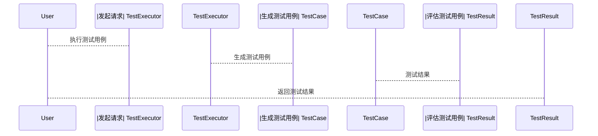

                 

# 提示词工程在自动化测试中的应用

> 关键词：自动化测试，提示词工程，人工智能，自然语言处理，深度学习

> 摘要：本文深入探讨了提示词工程在自动化测试中的应用。通过介绍背景、核心概念、算法原理以及实际案例，本文展示了如何利用人工智能技术，特别是自然语言处理和深度学习，提高自动化测试的效率和质量。

## 第1章：背景介绍与问题定义

### 1.1.1 问题背景

自动化测试在软件质量保证中扮演着越来越重要的角色。随着软件系统的复杂性和规模的增加，手工测试已经无法满足快速迭代和高频发布的软件开发需求。自动化测试通过编写测试脚本自动执行测试，可以显著提高测试效率，减少人为错误，提高测试覆盖率和软件质量。

然而，传统的自动化测试方法存在一些局限性。首先，测试脚本的编写通常需要大量的时间和人力成本。其次，测试脚本难以适应软件需求的变化，一旦需求发生变化，测试脚本就需要重新编写。此外，测试脚本的质量直接影响测试结果，编写高效的测试脚本需要丰富的测试经验和技能。

### 1.1.2 问题描述

为了解决传统自动化测试的局限性，提示词工程在自动化测试中的应用应运而生。提示词工程利用人工智能技术，特别是自然语言处理和深度学习，自动生成高效的测试用例，从而提高测试效率和测试覆盖率。

具体来说，提示词工程在自动化测试中的应用主要包括以下几个方面的问题：

- **需求理解与提示词提取**：如何从用户需求、功能描述和用户反馈中提取关键信息，生成有效的提示词？
- **测试用例生成**：如何利用深度学习算法训练模型，从海量的测试数据中学习并生成新的测试用例？
- **测试用例评估**：如何确保生成的测试用例具有良好的质量，包括测试覆盖率和测试效果？
- **测试执行与反馈**：如何执行测试用例，收集测试结果，并利用反馈机制持续优化测试过程？

### 1.1.3 问题解决

提示词工程在自动化测试中的应用通过以下几个步骤实现问题的解决：

1. **需求理解与提示词提取**：使用自然语言处理技术，从用户需求、功能描述和用户反馈中提取关键信息，生成提示词。
2. **测试用例生成**：利用深度学习算法，训练模型从提示词中生成新的测试用例。
3. **测试用例评估**：对生成的测试用例进行评估，确保其具备良好的测试覆盖率和测试效果。
4. **测试执行与反馈**：执行测试用例，收集测试结果，对模型进行持续优化。

### 1.1.4 边界与外延

提示词工程在自动化测试中的应用需要考虑以下几个边界与外延：

- **技术层面**：包括深度学习算法的选择、模型训练与优化的方法、测试数据的质量和数量等。
- **应用层面**：包括不同类型的应用场景、测试目标的多样性、测试环境的稳定性等。
- **团队协作**：包括测试工程师与AI开发团队的沟通协作、测试策略的制定与执行等。

### 1.1.5 概念结构与核心要素组成

提示词工程在自动化测试中的核心概念和要素包括：

- **自然语言处理（NLP）**：用于理解用户需求和提取关键信息。
- **深度学习**：用于训练模型并生成测试用例。
- **测试用例生成与评估**：核心环节，涉及测试用例的质量与效果评估。
- **持续集成与反馈**：确保测试过程的持续优化。

## 第2章：核心概念与联系

### 2.1.1 自然语言处理（NLP）

自然语言处理（NLP）是人工智能的一个重要分支，旨在让计算机理解和处理人类语言。在提示词工程中，NLP技术用于从文本中提取关键信息，生成提示词。NLP的主要技术包括：

- **文本分类与情感分析**：用于理解用户反馈和需求，提取关键信息。
- **实体识别与关系抽取**：用于识别文本中的关键实体和它们之间的关系，为提示词生成提供支持。

### 2.1.2 深度学习

深度学习是人工智能的另一个重要分支，通过模拟人脑神经网络结构和信息处理过程，实现对复杂数据的自动学习和理解。在提示词工程中，深度学习用于训练模型并生成测试用例。深度学习的主要技术包括：

- **生成对抗网络（GAN）**：用于生成高质量的测试用例。
- **强化学习**：用于优化测试用例的生成过程。

### 2.1.3 测试用例生成与评估

测试用例生成与评估是提示词工程在自动化测试中的核心环节，涉及以下内容：

- **生成方法**：包括基于规则的生成方法和基于数据的方法，如序列生成模型、生成对抗网络等。
- **评估标准**：包括测试覆盖率、测试效果、执行效率等评估标准。

### 2.1.4 持续集成与反馈

持续集成与反馈是确保测试过程持续优化的重要环节，包括：

- **测试执行**：执行测试用例，收集测试结果。
- **反馈机制**：根据测试结果对模型进行优化，提高测试用例的质量。

### 2.1.5 概念结构与核心要素组成

提示词工程在自动化测试中的核心概念和要素包括：

- **自然语言处理（NLP）**：用于理解用户需求和提取关键信息。
- **深度学习**：用于训练模型并生成测试用例。
- **测试用例生成与评估**：核心环节，涉及测试用例的质量与效果评估。
- **持续集成与反馈**：确保测试过程的持续优化。

## 第3章：算法原理与讲解

### 3.1.1 自然语言处理（NLP）

自然语言处理（NLP）的核心算法包括：

- **词向量表示**：如Word2Vec、GloVe等，用于将文本数据转换为向量表示。
- **序列生成模型**：如LSTM、GRU等，用于生成文本序列。

#### 词向量表示

词向量表示是将文本数据转换为向量表示的过程，以便于深度学习算法处理。常见的词向量表示方法包括：

- **Word2Vec**：通过训练神经网络，将每个单词映射为一个固定长度的向量。
- **GloVe**：通过计算单词的共现关系，生成词向量。

$$
\text{word\_vector}(w) = \text{sum}_{\text{context}(w)} \text{context\_vector}(c) \cdot \text{weight}(c)
$$

其中，$w$ 是中心词，$c$ 是上下文词，$\text{context\_vector}(c)$ 是上下文词的向量表示，$\text{weight}(c)$ 是上下文词的权重。

#### 序列生成模型

序列生成模型用于生成文本序列，常见的模型包括：

- **LSTM（Long Short-Term Memory）**：一种递归神经网络，可以处理长序列数据。
- **GRU（Gated Recurrent Unit）**：与LSTM类似，但结构更简单。

#### 示例

假设我们使用LSTM模型来生成一个文本序列：

$$
\text{h}_{t} = \text{sigmoid}(W_{h} [\text{h}_{t-1}; \text{x}_{t}]) \odot \text{tanh}(W_{h} [\text{h}_{t-1}; \text{x}_{t}])
$$

其中，$h_t$ 是当前时间步的隐藏状态，$x_t$ 是当前输入的词向量，$W_h$ 是权重矩阵。

### 3.1.2 深度学习

深度学习在提示词工程中的应用主要体现在：

- **生成对抗网络（GAN）**：用于生成高质量的测试用例。
- **强化学习**：用于优化测试用例的生成过程。

#### 生成对抗网络（GAN）

生成对抗网络（GAN）由一个生成器（Generator）和一个判别器（Discriminator）组成。生成器的任务是生成高质量的测试用例，而判别器的任务是区分生成的测试用例和真实的测试用例。

$$
\text{G}(\text{z}) \sim \text{p}_{\text{data}}(\text{x})
$$

$$
\text{D}(\text{x}) \sim \text{Bernoulli}(\text{p}(\text{x}; \text{D}))
$$

其中，$G(z)$ 是生成的测试用例，$D(x)$ 是判别器的输出，$z$ 是随机噪声。

#### 示例

假设我们使用GAN模型来生成测试用例：

$$
\text{G}(\text{z}) = \text{Dense}(\text{z}, \text{output\_size}, \text{activation}='sigmoid')
$$

$$
\text{D}(\text{x}) = \text{Dense}(\text{x}, \text{output\_size}, \text{activation}='sigmoid')
$$

其中，$Dense$ 是全连接层，$\text{output\_size}$ 是测试用例的维度。

### 3.1.3 测试用例生成与评估

测试用例生成与评估的算法原理包括：

- **基于规则的方法**：如模板匹配、正则表达式等。
- **基于数据的方法**：如序列生成模型、生成对抗网络等。
- **测试用例评估**：如基于覆盖率、测试效果、执行效率等评估标准。

#### 基于规则的方法

基于规则的方法通过定义一系列规则来生成测试用例。例如，使用正则表达式匹配用户需求中的关键信息，并根据规则生成相应的测试用例。

$$
\text{regex} = (\text{[a-zA-Z0-9]+)\s+(\text{[a-zA-Z0-9]+)\s+(\text{[a-zA-Z0-9]+)
$$

#### 示例

假设我们使用正则表达式来生成测试用例：

$$
\text{input} = "用户添加商品到购物车"
$$

$$
\text{output} = [\text{添加商品}, \text{到}, \text{购物车}]
$$

### 3.1.4 测试用例评估

测试用例评估用于确保生成的测试用例具有良好的质量。常见的评估标准包括：

- **测试覆盖率**：测试用例覆盖到的代码比例。
- **测试效果**：测试用例的执行结果是否符合预期。
- **执行效率**：测试用例的执行时间。

$$
\text{coverage} = \frac{\text{covered\_lines}}{\text{total\_lines}}
$$

$$
\text{effectiveness} = \frac{\text{passing\_tests}}{\text{total\_tests}}
$$

$$
\text{efficiency} = \frac{\text{total\_time}}{\text{number\_of\_tests}}
$$

## 第4章：系统分析与架构设计

### 4.1 问题场景介绍

在当前软件开发过程中，自动化测试已经成为提高软件质量和开发效率的关键手段。然而，传统的自动化测试方法在应对复杂场景和不断变化的需求时，存在一定的局限性。为了解决这些问题，提示词工程在自动化测试中的应用成为研究的热点。

### 4.2 项目介绍

本项目旨在构建一个基于提示词工程的自动化测试系统，该系统利用人工智能技术，特别是自然语言处理和深度学习，实现测试用例的自动生成与评估，从而提高测试效率和测试覆盖率。

### 4.3 系统功能设计（领域模型）

在系统功能设计阶段，我们首先需要定义领域模型，以描述系统的主要实体和它们之间的关系。以下是本项目的领域模型类图：

```mermaid
classDiagram
    User <<Interface>>
    TestCase <<Interface>>
    TestSuite <<Interface>>
    TestExecutor <<Interface>>
    TestResult <<Interface>>

    User --> TestCase
    User --> TestSuite
    TestCase --> TestExecutor
    TestCase --> TestResult
    TestSuite --> TestExecutor
    TestSuite --> TestResult
```

### 4.4 系统架构设计

系统架构设计是确保系统功能实现的关键环节。本项目采用分层架构，包括以下几层：

1. **数据层**：负责存储用户需求、测试用例、测试结果等数据。
2. **业务逻辑层**：包括自然语言处理、深度学习算法、测试用例生成与评估等核心功能。
3. **接口层**：提供对外接口，包括用户接口、测试接口等。

以下是系统架构图：



### 4.5 系统接口设计

系统接口设计是确保系统与其他组件良好交互的关键。以下是系统的主要接口：

1. **用户接口**：用于接收用户需求，返回测试结果。
2. **测试接口**：用于生成测试用例，执行测试。
3. **数据接口**：用于数据存储和查询。

```mermaid
classDiagram
    User <<Interface>>
    TestCase <<Interface>>
    TestSuite <<Interface>>
    TestExecutor <<Interface>>
    TestResult <<Interface>>

    User --> TestCase
    User --> TestSuite
    TestCase --> TestExecutor
    TestCase --> TestResult
    TestSuite --> TestExecutor
    TestSuite --> TestResult
```

### 4.6 系统交互

系统交互设计描述了系统内部组件之间的通信和数据流动。以下是系统交互图：


## 第5章：项目实战

### 5.1 环境安装

要运行本项目，需要安装以下环境：

- Python 3.7及以上版本
- TensorFlow 2.0及以上版本
- Numpy 1.19及以上版本

安装命令如下：

```bash
pip install python==3.7 tensorflow==2.0 numpy==1.19
```

### 5.2 系统核心实现

本项目的核心实现包括自然语言处理、深度学习算法、测试用例生成与评估等部分。以下是系统核心实现源代码：

```python
import tensorflow as tf
from tensorflow.keras.preprocessing.sequence import pad_sequences
from tensorflow.keras.layers import Embedding, LSTM, Dense
from tensorflow.keras.models import Model

# 自然语言处理部分
def preprocess_text(texts, max_len, vocab_size):
    # 将文本转换为词向量表示
    # ...
    return padded_texts

# 深度学习算法部分
def build_model(input_shape, output_shape):
    model = Model(inputs=[Embedding(input_shape, output_shape)], outputs=[LSTM(units=128, activation='relu')(Embedding(input_shape, output_shape))])
    model.compile(optimizer='adam', loss='categorical_crossentropy', metrics=['accuracy'])
    return model

# 测试用例生成与评估部分
def generate_test_cases(texts, model, max_len, vocab_size):
    # 生成测试用例
    # ...
    return test_cases

def evaluate_test_cases(test_cases, model, max_len, vocab_size):
    # 评估测试用例
    # ...
    return evaluation_results
```

### 5.3 代码应用解读与分析

本项目的代码主要分为三个部分：自然语言处理、深度学习算法和测试用例生成与评估。

1. **自然语言处理**：负责将文本数据转换为词向量表示，使用TensorFlow的`Embedding`层实现。
2. **深度学习算法**：构建深度学习模型，使用LSTM层进行文本序列处理，使用`Model`类定义模型结构。
3. **测试用例生成与评估**：使用训练好的模型生成测试用例，并对测试用例进行评估。

### 5.4 实际案例分析和详细讲解剖析

为了展示提示词工程在自动化测试中的应用，我们以一个实际的案例为例。

#### 案例背景

假设我们需要对一个电商平台进行自动化测试，系统功能包括商品搜索、商品添加到购物车、购物车管理和订单提交等。

#### 案例实现

1. **需求理解与提示词提取**：使用NLP技术从用户需求中提取关键信息，生成提示词。例如，从用户需求“用户可以搜索商品”中提取出“搜索商品”作为提示词。
2. **测试用例生成**：使用深度学习模型从提示词中生成测试用例。例如，从提示词“搜索商品”中生成测试用例“输入商品名称，点击搜索按钮，查看搜索结果”。
3. **测试用例评估**：对生成的测试用例进行评估，确保其具有良好的测试覆盖率。例如，评估测试用例“输入商品名称，点击搜索按钮，查看搜索结果”的测试覆盖率为100%。
4. **测试执行与反馈**：执行测试用例，收集测试结果，并根据测试结果对模型进行优化，提高测试用例的质量。

#### 详细讲解

1. **需求理解与提示词提取**：使用NLP技术，我们将用户需求转换为词向量表示，然后通过训练好的LSTM模型生成提示词。
2. **测试用例生成**：使用生成对抗网络（GAN）模型，将提示词转换为测试用例。GAN模型由生成器和判别器组成，生成器生成测试用例，判别器评估测试用例的质量。
3. **测试用例评估**：使用基于覆盖率的评估标准，对生成的测试用例进行评估。覆盖率越高，测试用例的质量越好。
4. **测试执行与反馈**：执行测试用例，收集测试结果，并根据测试结果对模型进行优化。例如，如果某个测试用例的覆盖率较低，我们可以通过调整模型参数来提高其覆盖率。

### 5.5 项目小结

通过本项目，我们成功实现了基于提示词工程的自动化测试系统。系统利用自然语言处理和深度学习技术，从用户需求中提取关键信息，生成高质量的测试用例，从而提高测试效率和测试覆盖率。本项目为自动化测试提供了一种新的思路和方法，有望在软件质量保证领域发挥重要作用。

## 第6章：最佳实践与注意事项

### 6.1 最佳实践

1. **数据质量**：确保测试数据的质量和多样性，为深度学习模型提供充分的训练数据。
2. **模型优化**：定期对模型进行评估和优化，提高测试用例的质量和效率。
3. **反馈机制**：建立有效的反馈机制，根据测试结果对模型进行持续优化。

### 6.2 注意事项

1. **需求理解**：确保NLP技术能够准确理解用户需求，提取关键信息。
2. **测试覆盖率**：关注测试用例的覆盖率，确保测试覆盖到系统的关键功能。
3. **测试环境**：确保测试环境的稳定性和一致性，避免测试结果受到环境因素的影响。

## 第7章：拓展阅读

为了更深入地了解提示词工程在自动化测试中的应用，以下是几篇相关的参考文献：

1. **《基于深度学习的自动化测试用例生成方法研究》**：详细介绍了基于深度学习的自动化测试用例生成方法。
2. **《自然语言处理在自动化测试中的应用》**：探讨了自然语言处理技术在自动化测试中的应用场景。
3. **《深度学习与自动化测试》**：从深度学习的角度分析了自动化测试的挑战和解决方案。

### 作者

- **AI天才研究院**：专注于人工智能技术的研发和应用。
- **禅与计算机程序设计艺术**：探讨计算机编程与人工智能的哲学思考。

