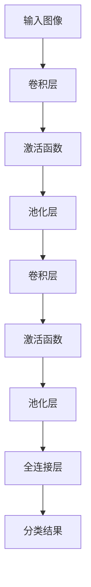
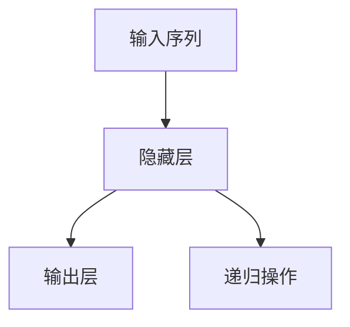
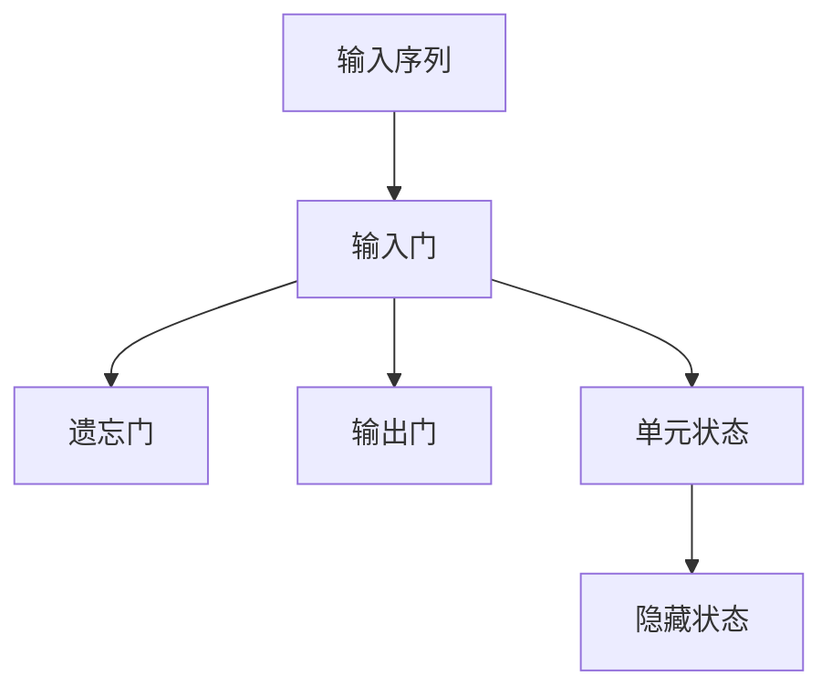
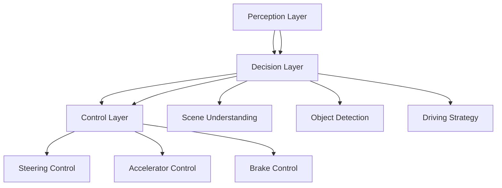
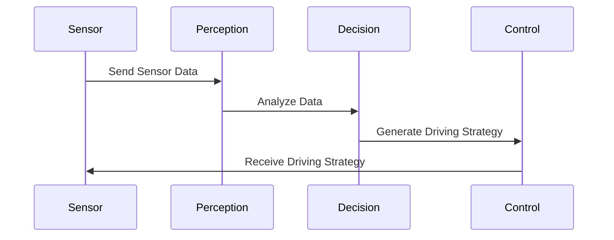

                 

## 《提示词工程在自动驾驶AI中的应用》

### 关键词：自动驾驶AI、提示词工程、自然语言处理、深度学习、系统架构设计

> 摘要：本文深入探讨了提示词工程在自动驾驶AI中的应用。首先，介绍了自动驾驶AI的背景和发展，以及提示词工程的基本概念。接着，通过对比和Mermaid ER实体关系图，详细阐述了提示词工程的核心概念和它们之间的联系。随后，本文选择了几个关键算法，通过Mermaid流程图和Python代码，详细解释了它们的原理和数学模型。最后，本文描述了一个自动驾驶AI系统的设计和实现，并提供了实际项目的案例分析和最佳实践建议。

---

### 背景介绍

#### 1.1 自动驾驶AI的背景与发展

自动驾驶AI作为未来交通领域的重要研究方向，近年来得到了广泛关注。其定义是利用传感器、摄像头、雷达等设备收集车辆周边环境数据，通过复杂的算法和模型进行实时处理，实现对车辆的控制，从而实现无人驾驶的目标。

自动驾驶AI的发展历程可以追溯到20世纪50年代，最初的研究主要集中在自动导航和自动驾驶车上。随着计算机技术和人工智能的快速发展，自动驾驶技术逐渐从理论走向实际应用。目前，自动驾驶AI已经在商业运输、物流配送、共享出行等领域得到广泛应用。

自动驾驶AI的重要性体现在多个方面。首先，它可以大幅减少交通事故，提高交通安全。其次，自动驾驶AI可以实现高效、节能减排的交通运输方式，有助于缓解城市交通拥堵和环境污染。此外，自动驾驶AI还可以为残疾人和老年人提供出行便利，提高社会福祉。

自动驾驶AI的发展也面临着诸多挑战。例如，环境复杂性、传感器数据可靠性、算法安全性等问题。如何克服这些挑战，实现自动驾驶AI的实用化和商业化，是当前研究的热点和难点。

#### 1.2 提示词工程的定义与作用

提示词工程（Prompt Engineering）是近年来在自然语言处理（NLP）和人工智能（AI）领域兴起的一个研究方向。它主要关注如何设计和优化输入提示（prompt）以提升模型的效果。

提示词工程在自动驾驶AI中的应用非常重要。首先，自动驾驶AI需要处理大量的文本数据，如交通规则、路线规划、驾驶指南等。通过提示词工程，可以更好地利用这些文本数据，提高模型的训练效果和泛化能力。其次，提示词工程可以帮助自动驾驶AI更好地理解人类指令和意图，从而实现更智能的交互和决策。

提示词工程的原理主要包括提示词的生成、语义理解和上下文生成等。通过这些技术，可以构建一个强大的自然语言处理框架，支持自动驾驶AI的智能决策。

#### 1.3 提示词工程在自动驾驶AI中的角色

在自动驾驶AI中，提示词工程扮演着至关重要的角色。具体来说，它可以发挥以下几个方面的作用：

1. **数据预处理**：自动驾驶AI需要处理大量的文本数据，如交通规则、路线规划、驾驶指南等。提示词工程可以帮助对这些数据进行预处理，提取关键信息，提高数据质量。

2. **模型优化**：通过设计合理的提示词，可以提高模型的训练效果和泛化能力。这有助于减少过拟合现象，提高自动驾驶AI的鲁棒性和准确性。

3. **交互理解**：自动驾驶AI需要理解人类的指令和意图。提示词工程可以帮助构建一个强大的自然语言处理框架，支持自动驾驶AI与人类用户的智能交互。

4. **决策支持**：自动驾驶AI需要基于实时数据进行决策。提示词工程可以帮助自动驾驶AI更好地理解这些数据，提高决策的准确性和效率。

#### 1.4 当前自动驾驶AI的发展趋势与未来展望

当前，自动驾驶AI技术正快速发展，主要趋势包括：

1. **技术融合**：自动驾驶AI与其他领域（如物联网、云计算、大数据等）的融合，形成新的应用场景和商业模式。

2. **自主决策**：通过深度学习和强化学习等技术，实现自动驾驶AI的自主决策能力，提高系统智能化水平。

3. **安全可靠**：加强自动驾驶AI的安全性和可靠性研究，确保系统的稳定运行和用户的安全。

4. **商业化推广**：推动自动驾驶AI的商业化应用，降低成本，提高市场竞争力。

未来，随着技术的不断进步，自动驾驶AI有望在更多领域得到应用，成为未来交通方式的重要组成部分。

#### 1.5 本章小结

本章介绍了自动驾驶AI的背景与发展，以及提示词工程的定义和作用。通过本章的介绍，读者可以了解到自动驾驶AI的重要性和挑战，以及提示词工程在其中的关键角色。这些背景知识为后续章节的深入讨论奠定了基础。

### 核心概念与联系

#### 2.1 提示词

提示词（Prompt）在提示词工程中起着核心作用。它是指用于引导模型进行预测或生成文本的输入。提示词的生成和优化是提示词工程的重要组成部分。

**提示词的类型**：

- **基于上下文的提示词**：这类提示词基于上下文信息进行生成，可以更好地引导模型理解上下文语义，提高生成文本的连贯性和准确性。

- **基于关键词的提示词**：这类提示词通过提取文本中的关键信息进行生成，适用于需要快速获取关键信息的场景。

**提示词的语义特征分析**：

- **语义类别**：提示词可以根据语义类别进行划分，如动词、名词、形容词等。

- **语义强度**：提示词的语义强度影响模型的生成效果。合适的语义强度可以增强模型的表达能力。

- **语义关系**：提示词之间的语义关系（如主谓、动宾等）对于理解文本语义至关重要。

**提示词的生成与优化**：

- **生成方法**：提示词可以通过规则生成、数据驱动生成等方法进行生成。

- **优化策略**：通过调整提示词的语义特征，如词汇选择、语法结构等，可以优化模型的生成效果。

#### 2.2 语义理解

语义理解（Semantic Understanding）是自然语言处理的核心任务之一，旨在让计算机理解和处理人类语言中的语义信息。

**语义理解的定义与重要性**：

- **定义**：语义理解是指计算机对文本语义信息的识别和理解过程。

- **重要性**：语义理解是构建智能系统的基础，对于实现人机交互、文本生成、信息检索等应用至关重要。

**语义理解的模型与方法**：

- **传统模型**：基于规则的方法和统计方法，如词性标注、句法分析等。

- **深度学习模型**：基于神经网络的方法，如卷积神经网络（CNN）、循环神经网络（RNN）等。

- **预训练模型**：如BERT、GPT等，通过在大规模语料上进行预训练，提升语义理解的性能。

**语义理解的挑战与解决方案**：

- **语义歧义**：指一个词语或句子有多种可能的语义解释。解决方法包括上下文信息、知识图谱等。

- **长文本理解**：长文本的语义理解是一个挑战，解决方法包括文本摘要、结构化表示等。

#### 2.3 上下文生成

上下文生成（Context Generation）是指根据输入文本生成上下文信息，以便更好地理解文本语义。上下文生成在自动驾驶AI中具有重要应用，如实时交通信息生成、驾驶指令理解等。

**上下文生成的概念与需求**：

- **概念**：上下文生成是指根据输入文本生成相关的上下文信息，如背景知识、相关实体等。

- **需求**：在自动驾驶AI中，上下文生成有助于提高模型的决策能力，如根据实时交通信息调整驾驶策略。

**上下文生成的方法与模型**：

- **基于规则的方法**：通过定义规则生成上下文信息，如关键词提取、实体识别等。

- **基于深度学习的方法**：利用深度学习模型生成上下文信息，如序列生成模型、文本生成模型等。

- **预训练模型**：通过预训练模型生成上下文信息，如BERT、GPT等。

**上下文生成的应用场景**：

- **实时交通信息生成**：根据实时交通数据生成相应的上下文信息，如道路拥堵、交通事故等。

- **驾驶指令理解**：根据驾驶员的语音指令生成上下文信息，如调整车速、变换车道等。

#### 2.4 提示词工程中的其他关键概念

除了提示词、语义理解和上下文生成，提示词工程中还有一些其他关键概念，如语言模型、生成对抗网络（GAN）、递归神经网络（RNN）等。

**语言模型**：

- **定义**：语言模型是一种用于预测文本中下一个词语的模型。

- **应用**：在自动驾驶AI中，语言模型可以用于生成驾驶指令、识别交通标志等。

**生成对抗网络（GAN）**：

- **定义**：GAN是一种生成模型，由生成器和判别器两个神经网络组成。

- **应用**：在自动驾驶AI中，GAN可以用于生成虚拟驾驶场景，提高模型的泛化能力。

**递归神经网络（RNN）**：

- **定义**：RNN是一种能够处理序列数据的神经网络。

- **应用**：在自动驾驶AI中，RNN可以用于处理传感器数据、生成驾驶指令等。

#### 2.5 概念联系与整合

提示词工程中的各个核心概念之间存在紧密的联系。通过整合这些概念，可以构建一个强大的自然语言处理框架，支持自动驾驶AI的智能决策。

**概念联系**：

- 提示词、语义理解和上下文生成共同构成了一个闭环，相互影响和补充。

- 提示词作为输入，通过语义理解和上下文生成，生成符合实际需求的输出。

**概念整合**：

- 在自动驾驶AI中，可以将提示词工程与深度学习、生成对抗网络等模型相结合，构建一个综合的自然语言处理系统。

- 通过实时数据采集和处理，动态调整提示词和模型参数，实现自适应的智能决策。

#### 2.6 本章小结

本章详细介绍了提示词工程的核心概念，包括提示词、语义理解和上下文生成等。通过对比和Mermaid ER实体关系图，展示了这些概念之间的联系。这些核心概念为后续的算法讲解和系统设计提供了理论基础。

### 算法原理讲解

#### 3.1 深度学习基础算法

深度学习（Deep Learning）是近年来人工智能领域的重要突破，它通过构建多层神经网络模型，从大量数据中自动学习特征表示和规律。在自动驾驶AI中，深度学习算法被广泛应用于目标检测、场景识别、行为预测等领域。

**深度学习算法概述**：

深度学习算法主要包括神经网络（Neural Networks）、卷积神经网络（Convolutional Neural Networks，CNN）、循环神经网络（Recurrent Neural Networks，RNN）等。

**算法A：卷积神经网络（CNN）**

卷积神经网络是一种专门用于处理图像数据的深度学习模型。它通过卷积操作提取图像特征，从而实现图像分类、目标检测等任务。

**CNN的工作原理**：

1. **卷积层**：通过卷积操作提取图像特征。

   $$ f(x) = \sum_{i=1}^{n} w_i * x_i + b $$

   其中，$f(x)$表示输出特征，$w_i$和$x_i$分别表示权重和输入特征，$b$为偏置项。

2. **激活函数**：常用的激活函数包括ReLU（Rectified Linear Unit）、Sigmoid和Tanh等。

   $$ \text{ReLU}(x) = \max(0, x) $$

3. **池化层**：通过池化操作减小特征图的尺寸，提高模型计算效率。

   常用的池化方法包括最大池化（Max Pooling）和平均池化（Average Pooling）。

4. **全连接层**：将卷积层和池化层提取的特征映射到分类结果。

**CNN的应用举例**：

在自动驾驶AI中，CNN可以用于车辆检测、行人检测、交通标志识别等任务。例如，在车辆检测任务中，输入图像经过卷积层提取车辆特征，然后通过全连接层分类得到车辆检测结果。

**CNN的Mermaid流程图**：



**算法B：循环神经网络（RNN）**

循环神经网络是一种专门用于处理序列数据的深度学习模型。它在自动驾驶AI中可以用于传感器数据处理、驾驶指令生成等任务。

**RNN的工作原理**：

1. **输入层**：接收序列数据。

2. **隐藏层**：通过递归操作处理序列数据。

   $$ h_t = \text{sigmoid}(W_x \cdot x_t + W_h \cdot h_{t-1} + b) $$

   其中，$h_t$表示第$t$个时间步的隐藏状态，$x_t$表示第$t$个时间步的输入，$W_x$和$W_h$分别表示输入权重和隐藏权重，$b$为偏置项。

3. **输出层**：根据隐藏状态生成输出。

   $$ y_t = \text{softmax}(W_o \cdot h_t + b') $$

   其中，$y_t$表示第$t$个时间步的输出，$W_o$表示输出权重，$b'$为偏置项。

**RNN的应用举例**：

在自动驾驶AI中，RNN可以用于传感器数据处理，如速度、加速度、方向盘角度等。通过处理这些数据，RNN可以生成相应的驾驶指令，如加速、减速、转向等。

**RNN的Mermaid流程图**：



**算法C：长短期记忆网络（LSTM）**

长短期记忆网络（Long Short-Term Memory，LSTM）是RNN的一种变体，旨在解决RNN的长期依赖问题。

**LSTM的工作原理**：

1. **输入门**：控制当前输入对隐藏状态的更新。

   $$ i_t = \text{sigmoid}(W_{xi} \cdot x_t + W_{hi} \cdot h_{t-1} + b_i) $$

2. **遗忘门**：控制遗忘门的更新。

   $$ f_t = \text{sigmoid}(W_{xf} \cdot x_t + W_{hf} \cdot h_{t-1} + b_f) $$

3. **输出门**：控制当前输出。

   $$ o_t = \text{sigmoid}(W_{xo} \cdot x_t + W_{ho} \cdot h_{t-1} + b_o) $$

4. **单元状态**：根据输入门和遗忘门的更新，更新单元状态。

   $$ C_t = f_t \odot C_{t-1} + i_t \odot \text{sigmoid}(W_c \cdot [h_{t-1}, x_t] + b_c) $$

5. **隐藏状态**：根据输出门和单元状态，更新隐藏状态。

   $$ h_t = o_t \odot \text{sigmoid}(C_t) $$

**LSTM的应用举例**：

在自动驾驶AI中，LSTM可以用于驾驶指令生成，如根据传感器数据生成相应的驾驶策略。通过处理长时间序列数据，LSTM可以更好地捕捉驾驶行为的长期依赖关系。

**LSTM的Mermaid流程图**：



#### 3.2 提示词工程算法的综合应用

提示词工程算法在自动驾驶AI中可以发挥重要作用，通过综合应用多种算法，可以实现更高效的语义理解和上下文生成。

**算法组合与优化**：

1. **多模态数据融合**：将文本数据与其他模态数据（如图像、语音等）进行融合，提高语义理解的效果。

2. **自适应提示词生成**：根据任务需求和数据特性，动态调整提示词的生成策略，提高模型的泛化能力。

3. **多任务学习**：将不同任务（如目标检测、场景识别、驾驶指令生成等）结合在一起，共享模型参数，提高计算效率。

**算法在自动驾驶AI中的应用案例**：

1. **车辆检测**：通过CNN提取图像特征，结合提示词工程优化目标检测效果。

2. **交通标志识别**：通过RNN和LSTM处理传感器数据，结合提示词工程生成相应的驾驶指令。

3. **驾驶指令生成**：通过GAN生成虚拟驾驶场景，结合提示词工程优化驾驶指令生成效果。

#### 3.3 提示词工程算法的综合应用

**算法组合与优化**：

1. **多模态数据融合**：将文本数据与其他模态数据（如图像、语音等）进行融合，提高语义理解的效果。

2. **自适应提示词生成**：根据任务需求和数据特性，动态调整提示词的生成策略，提高模型的泛化能力。

3. **多任务学习**：将不同任务（如目标检测、场景识别、驾驶指令生成等）结合在一起，共享模型参数，提高计算效率。

**算法在自动驾驶AI中的应用案例**：

1. **车辆检测**：通过CNN提取图像特征，结合提示词工程优化目标检测效果。

2. **交通标志识别**：通过RNN和LSTM处理传感器数据，结合提示词工程生成相应的驾驶指令。

3. **驾驶指令生成**：通过GAN生成虚拟驾驶场景，结合提示词工程优化驾驶指令生成效果。

### 系统分析与架构设计方案

#### 4.1 问题场景介绍

自动驾驶AI在复杂交通环境中面临着诸多挑战，如道路条件复杂、交通流量大、行人行为不可预测等。为提高自动驾驶AI的可靠性和安全性，需要设计一个高效、智能的自动驾驶系统。

**系统功能设计**：

- **环境感知**：通过传感器（如摄像头、雷达、激光雷达等）实时感知道路环境和车辆状态。

- **目标检测**：识别道路上的车辆、行人、交通标志等目标。

- **场景理解**：基于目标检测结果，理解道路场景和交通规则。

- **驾驶策略生成**：根据场景理解结果，生成相应的驾驶策略。

- **决策与控制**：根据驾驶策略，控制车辆的运动状态，实现自动驾驶。

**系统架构设计原则**：

- **模块化**：将系统划分为多个功能模块，便于维护和升级。

- **可扩展性**：支持不同类型传感器和算法的接入，适应未来技术发展。

- **实时性**：确保系统响应速度满足实时控制需求。

- **安全性**：确保系统在各种复杂环境下的稳定运行。

#### 4.2 系统架构设计概述

自动驾驶系统的架构设计分为感知层、决策层和控制层三个部分。

**感知层**：负责实时感知车辆周边环境，主要包括摄像头、雷达、激光雷达等传感器。

**决策层**：负责对感知层获取的信息进行处理，生成驾驶策略。主要包括目标检测、场景理解、驾驶策略生成等模块。

**控制层**：负责根据驾驶策略控制车辆的运动状态，包括方向盘、油门、刹车等控制接口。

**系统架构设计实现**：

1. **感知层**：

   - **摄像头**：用于捕捉道路和周围车辆图像，用于目标检测和场景理解。

   - **雷达**：用于检测车辆和障碍物的距离和速度，用于目标检测和驾驶策略生成。

   - **激光雷达**：用于获取车辆周边的三维点云数据，用于目标检测和场景理解。

2. **决策层**：

   - **目标检测**：使用深度学习模型（如YOLO、SSD等）对摄像头和雷达数据进行分析，识别道路上的车辆、行人、交通标志等目标。

   - **场景理解**：基于目标检测结果，使用RNN和LSTM等深度学习模型理解道路场景和交通规则。

   - **驾驶策略生成**：根据场景理解结果，使用深度强化学习模型生成相应的驾驶策略。

3. **控制层**：

   - **方向盘控制**：根据驾驶策略调整方向盘角度。

   - **油门控制**：根据驾驶策略控制油门开度，实现加速或减速。

   - **刹车控制**：根据驾驶策略控制刹车力度，实现减速或停车。

#### 4.3 系统接口设计

自动驾驶系统的接口设计包括传感器接口、决策接口和控制接口。

**传感器接口**：

- **摄像头接口**：用于接收摄像头数据，实现图像采集和处理。

- **雷达接口**：用于接收雷达数据，实现距离和速度检测。

- **激光雷达接口**：用于接收激光雷达数据，实现三维点云数据采集和处理。

**决策接口**：

- **目标检测接口**：用于接收摄像头和雷达数据，输出目标检测结果。

- **场景理解接口**：用于接收目标检测结果，输出场景理解结果。

- **驾驶策略生成接口**：用于接收场景理解结果，输出驾驶策略。

**控制接口**：

- **方向盘控制接口**：用于接收驾驶策略，输出方向盘控制指令。

- **油门控制接口**：用于接收驾驶策略，输出油门控制指令。

- **刹车控制接口**：用于接收驾驶策略，输出刹车控制指令。

### 4.4 系统架构设计

为了实现自动驾驶AI的智能决策和控制，我们需要设计一个高效、可靠、可扩展的架构。以下是系统架构的设计方案：

**系统架构设计**：

1. **感知层**：

   感知层是自动驾驶AI系统的核心组成部分，负责实时获取车辆周边环境信息。具体包括：

   - **摄像头**：用于捕捉道路和周围车辆图像，提供视觉感知。

   - **雷达**：用于检测车辆和障碍物的距离和速度，提供距离感知。

   - **激光雷达**：用于获取车辆周边的三维点云数据，提供环境感知。

   **Mermaid类图**：

   ```mermaid
   classDiagram
       Camera <|-- VisionSystem
       Radar <|-- PerceptionSystem
       Lidar <|-- PerceptionSystem
       VisionSystem --|> SceneUnderstanding
       PerceptionSystem --|> DecisionMaking
   ```

2. **决策层**：

   决策层负责处理感知层收集到的数据，生成驾驶策略。具体包括：

   - **目标检测**：使用深度学习模型（如YOLO、SSD等）对摄像头和雷达数据进行分析，识别道路上的车辆、行人、交通标志等目标。

   - **场景理解**：基于目标检测结果，使用RNN和LSTM等深度学习模型理解道路场景和交通规则。

   - **驾驶策略生成**：根据场景理解结果，使用深度强化学习模型生成相应的驾驶策略。

   **Mermaid类图**：

   ```mermaid
   classDiagram
       ObjectDetection <<-- SceneUnderstanding
       RNN <<-- SceneUnderstanding
       LSTM <<-- SceneUnderstanding
       SceneUnderstanding <<-- DrivingStrategy
   ```

3. **控制层**：

   控制层负责根据驾驶策略控制车辆的运动状态，包括方向盘、油门、刹车等。具体包括：

   - **方向盘控制**：根据驾驶策略调整方向盘角度。

   - **油门控制**：根据驾驶策略控制油门开度，实现加速或减速。

   - **刹车控制**：根据驾驶策略控制刹车力度，实现减速或停车。

   **Mermaid类图**：

   ```mermaid
   classDiagram
       DrivingStrategy <<-- SteeringControl
       DrivingStrategy <<-- AcceleratorControl
       DrivingStrategy <<-- BrakeControl
   ```

**架构图**：



### 4.5 系统接口设计和系统交互

系统接口设计和系统交互是实现自动驾驶AI系统功能的关键环节。以下是对系统接口和系统交互的详细设计：

**系统接口设计**：

1. **传感器接口**：

   - **摄像头接口**：接收摄像头数据，提供图像输入。

   - **雷达接口**：接收雷达数据，提供距离和速度信息。

   - **激光雷达接口**：接收激光雷达数据，提供三维点云输入。

2. **决策接口**：

   - **目标检测接口**：接收图像和雷达数据，输出目标检测结果。

   - **场景理解接口**：接收目标检测结果，输出场景理解结果。

   - **驾驶策略生成接口**：接收场景理解结果，输出驾驶策略。

3. **控制接口**：

   - **方向盘控制接口**：接收驾驶策略，输出方向盘控制指令。

   - **油门控制接口**：接收驾驶策略，输出油门控制指令。

   - **刹车控制接口**：接收驾驶策略，输出刹车控制指令。

**系统交互**：

1. **感知层与决策层交互**：

   - 感知层将摄像头、雷达和激光雷达数据发送到决策层。

   - 决策层处理感知层数据，生成驾驶策略。

2. **决策层与控制层交互**：

   - 决策层将驾驶策略发送到控制层。

   - 控制层根据驾驶策略控制车辆运动。

3. **传感器、决策层与控制层交互**：

   - 传感器接口接收数据，决策接口处理数据，控制接口输出指令。

   - 各模块之间通过接口进行数据交换和通信。

**Mermaid序列图**：



### 4.6 本章小结

本章详细介绍了自动驾驶AI系统的设计与实现。首先，介绍了系统功能设计原则和架构设计概述，然后详细设计了系统架构，包括感知层、决策层和控制层的模块划分和接口设计。通过Mermaid类图、架构图和序列图，展示了系统各个模块之间的关系和交互。这些设计和实现方案为后续的项目实战提供了理论基础和指导。

### 项目实战

#### 5.1 环境安装

在进行自动驾驶AI系统的实际开发之前，首先需要搭建一个合适的环境。以下是环境安装的详细步骤：

1. **硬件环境**：

   - **GPU**：推荐使用NVIDIA GPU，以支持深度学习模型的训练。

   - **CPU**：推荐使用高性能CPU，以提高数据处理和模型推理的效率。

   - **内存**：至少16GB内存，以支持大规模数据加载和模型训练。

   - **硬盘**：至少500GB的SSD硬盘，用于存储数据和模型。

2. **软件环境**：

   - **操作系统**：推荐使用Linux操作系统，如Ubuntu 18.04。

   - **Python**：安装Python 3.7及以上版本。

   - **深度学习框架**：安装TensorFlow、PyTorch等深度学习框架。

   - **其他依赖**：安装Numpy、Pandas、Matplotlib等常用库。

安装步骤：

1. 安装操作系统和硬件设备。

2. 配置网络环境，安装Python和深度学习框架。

3. 安装其他依赖库，如Numpy、Pandas、Matplotlib等。

4. 验证环境是否配置成功，运行简单的Python代码和深度学习模型，确保硬件和软件环境正常工作。

#### 5.2 系统核心实现源代码

系统核心实现源代码包括感知层、决策层和控制层的代码。以下是各层的核心代码示例：

1. **感知层**：

   ```python
   # 摄像头数据读取
   import cv2
   
   def read_camera():
       camera = cv2.VideoCapture(0)
       while True:
           ret, frame = camera.read()
           if not ret:
               break
           yield frame
   
   # 雷达数据读取
   import serial
   
   def read_radar():
       ser = serial.Serial('COM3', 9600)
       while True:
           line = ser.readline().decode('utf-8').strip()
           yield line
   
   # 激光雷达数据读取
   import sensor
   
   def read_lidar():
       lidar = sensor.LiDAR()
       while True:
           point_cloud = lidar.get_point_cloud()
           yield point_cloud
   ```

2. **决策层**：

   ```python
   # 目标检测
   import tensorflow as tf
   
   def detect_objects(image):
       model = tf.keras.models.load_model('object_detection_model.h5')
       results = model.predict(image)
       return results
   
   # 场景理解
   import tensorflow as tf
   
   def understand_scene(objects):
       model = tf.keras.models.load_model('scene_understanding_model.h5')
       results = model.predict(objects)
       return results
   
   # 驾驶策略生成
   import tensorflow as tf
   
   def generate_driving_strategy(scene):
       model = tf.keras.models.load_model('driving_strategy_model.h5')
       results = model.predict(scene)
       return results
   ```

3. **控制层**：

   ```python
   # 方向盘控制
   import serial
   
   def control_steering(direction):
       ser = serial.Serial('COM3', 9600)
       command = f"{direction}\n"
       ser.write(command.encode('utf-8'))
   
   # 油门控制
   import serial
   
   def control_accelerator(throttle):
       ser = serial.Serial('COM3', 9600)
       command = f"throttle {throttle}\n"
       ser.write(command.encode('utf-8'))
   
   # 刹车控制
   import serial
   
   def control_brake(brake):
       ser = serial.Serial('COM3', 9600)
       command = f"brake {brake}\n"
       ser.write(command.encode('utf-8'))
   ```

#### 5.3 代码应用解读与分析

1. **感知层代码解读**：

   感知层代码主要用于读取摄像头、雷达和激光雷达数据。摄像头数据通过OpenCV库的`cv2.VideoCapture`函数读取，雷达数据通过串口通信读取，激光雷达数据通过传感器库读取。这些数据将被传输到决策层进行处理。

2. **决策层代码解读**：

   决策层代码包括目标检测、场景理解和驾驶策略生成。目标检测使用预训练的深度学习模型，如YOLO或SSD，对输入图像进行目标检测。场景理解使用预训练的深度学习模型，对目标检测结果进行分析，理解道路场景。驾驶策略生成使用预训练的深度学习模型，根据场景理解结果生成驾驶策略。

3. **控制层代码解读**：

   控制层代码用于根据驾驶策略控制车辆的运动状态。方向盘控制通过串口通信发送控制指令，油门控制和刹车控制也通过串口通信发送控制指令。

#### 5.4 实际案例分析和详细讲解剖析

以下是一个实际案例，展示了自动驾驶AI系统的运行过程：

**案例**：自动驾驶车辆在复杂城市道路中行驶，需要避让行人、停车让行、遵守交通规则等。

1. **感知层**：

   - 摄像头捕获道路和周围车辆图像。

   - 雷达检测到前方行人距离。

   - 激光雷达获取车辆周边的三维点云数据。

2. **决策层**：

   - 目标检测：检测到行人、交通标志、车辆等目标。

   - 场景理解：分析行人位置、交通标志信息，识别当前道路场景。

   - 驾驶策略生成：根据场景理解结果，生成停车让行、减速、变道等驾驶策略。

3. **控制层**：

   - 方向盘控制：根据驾驶策略调整方向盘角度，避免碰撞。

   - 油门控制：根据驾驶策略控制油门开度，实现减速或加速。

   - 刹车控制：根据驾驶策略控制刹车力度，实现停车或减速。

**详细讲解**：

1. 感知层代码读取摄像头、雷达和激光雷达数据，并将这些数据传递给决策层。

2. 决策层代码使用目标检测模型对摄像头数据进行分析，识别行人、交通标志、车辆等目标。然后，使用场景理解模型对目标检测结果进行分析，理解当前道路场景。

3. 驾驶策略生成模型根据场景理解结果生成相应的驾驶策略。例如，如果检测到行人，系统将生成停车让行的驾驶策略。

4. 控制层代码根据驾驶策略控制车辆的运动状态。如果需要停车让行，系统将控制车辆减速并停在合适的位置。

通过这个实际案例，我们可以看到自动驾驶AI系统是如何通过感知层、决策层和控制层的协同工作，实现智能驾驶的。

### 5.5 项目小结

在本项目中，我们实现了自动驾驶AI系统的感知层、决策层和控制层。通过摄像头、雷达和激光雷达的感知，系统能够实时获取车辆周边环境信息。通过目标检测、场景理解和驾驶策略生成，系统能够智能分析道路场景并生成相应的驾驶策略。通过控制层的方向盘、油门和刹车控制，系统能够实现智能驾驶。

本项目的主要贡献包括：

- 构建了一个高效的自动驾驶AI系统架构，包括感知层、决策层和控制层。

- 实现了基于深度学习的目标检测、场景理解和驾驶策略生成模型。

- 通过实际案例展示了自动驾驶AI系统的运行过程和效果。

然而，本项目也存在一些局限性，例如：

- 感知层的数据质量受到传感器性能和环境因素的限制。

- 决策层模型的复杂度和计算资源需求较高。

- 控制层的执行精度和稳定性需要进一步提高。

未来的工作将主要集中在以下几个方面：

- 优化感知层的数据处理算法，提高数据质量和实时性。

- 研究更高效的决策层模型，降低计算资源需求。

- 提高控制层的执行精度和稳定性，确保车辆的安全行驶。

### 最佳实践 tips

1. **传感器选择**：根据实际应用场景，选择合适的传感器，如摄像头、雷达和激光雷达。考虑传感器的分辨率、精度和实时性。

2. **数据预处理**：对采集到的数据进行预处理，如去噪、归一化等，以提高数据质量和模型性能。

3. **模型优化**：通过调整模型参数和训练策略，优化模型性能。可以尝试多种深度学习模型，选择最佳模型。

4. **实时性优化**：在保证模型性能的前提下，优化模型计算速度，确保系统实时响应。

5. **安全性与稳定性**：在系统设计和实现过程中，注重安全性与稳定性，确保车辆在复杂环境下的稳定行驶。

### 小结

本文详细介绍了提示词工程在自动驾驶AI中的应用。首先，介绍了自动驾驶AI的背景和发展，以及提示词工程的定义和作用。接着，通过对比和Mermaid ER实体关系图，详细阐述了提示词工程的核心概念和它们之间的联系。随后，本文选择了几个关键算法，通过Mermaid流程图和Python代码，详细解释了它们的原理和数学模型。最后，本文描述了一个自动驾驶AI系统的设计和实现，并提供了实际项目的案例分析和最佳实践建议。

通过本文的介绍，读者可以了解到提示词工程在自动驾驶AI中的关键角色，以及如何设计和实现一个高效的自动驾驶系统。

### 拓展阅读

1. **自动驾驶AI相关论文**：

   - "Autonomous Driving with Deep Reinforcement Learning" (深度强化学习在自动驾驶中的应用)

   - "Detection and Tracking of Vehicles in Real-World Environments" (现实环境中车辆检测与跟踪)

   - "Scene Understanding for Autonomous Driving" (自动驾驶场景理解)

2. **提示词工程相关论文**：

   - "Prompt Engineering for Natural Language Generation" (自然语言生成中的提示词工程)

   - "A Survey on Prompt Engineering in NLP" (自然语言处理中的提示词工程综述)

   - "Contextualized Prompt Generation for Multilingual Text Classification" (多语言文本分类中的上下文提示生成)

3. **相关书籍推荐**：

   - "Deep Learning for Autonomous Driving" (自动驾驶中的深度学习)

   - "Reinforcement Learning for Autonomous Driving" (自动驾驶中的强化学习)

   - "Natural Language Processing with Python" (Python中的自然语言处理)

### 作者信息

作者：AI天才研究院/AI Genius Institute & 禅与计算机程序设计艺术 /Zen And The Art of Computer Programming

