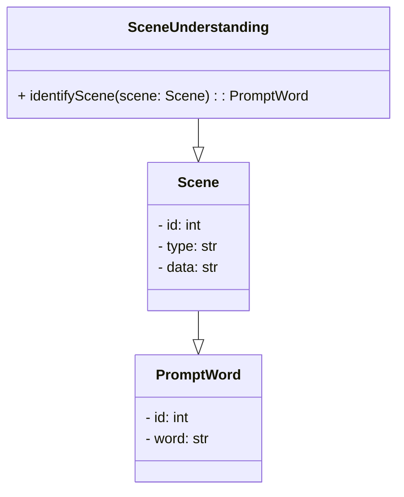
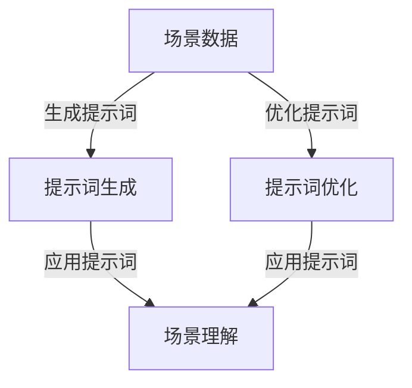
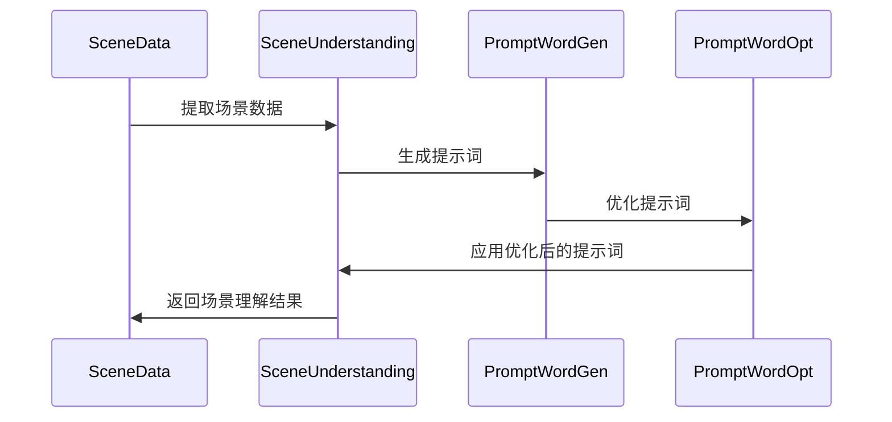

                 

# 《提示词工程在自动驾驶场景理解中的应用》

> 关键词：自动驾驶、场景理解、提示词工程、算法、系统架构

> 摘要：本文将深入探讨提示词工程在自动驾驶场景理解中的应用。通过分析自动驾驶技术发展的背景、场景理解的必要性以及提示词工程的概念与重要性，我们将逐步了解提示词工程的基本原理、应用方法和未来发展方向。同时，本文还将结合具体的算法和数学模型，详细讲解提示词生成和优化的原理，并通过系统架构设计和项目实战案例，展示提示词工程在自动驾驶中的实际应用。

## 第一部分：引言

### 第1章 提示词工程在自动驾驶场景理解中的应用背景

#### 1.1 问题背景

自动驾驶技术的发展是人工智能领域的里程碑，它不仅改变了交通工具的面貌，也对城市交通、物流、安全等领域产生了深远影响。随着自动驾驶技术的逐步成熟，场景理解成为其关键环节之一。场景理解是指自动驾驶系统在运行过程中对周围环境进行感知、识别和解读的过程。它对自动驾驶系统的安全性和可靠性至关重要。

#### 1.2 场景理解在自动驾驶系统中的作用

场景理解在自动驾驶系统中扮演着至关重要的角色。它负责收集并解析环境中的各种信息，如道路标志、行人、车辆、交通信号等，以便自动驾驶系统能够做出正确的决策。没有有效的场景理解，自动驾驶系统将无法准确判断道路状况，从而影响其安全性和稳定性。

#### 1.3 提示词工程的概念及其重要性

提示词工程是一种通过生成和优化特定词汇（提示词）来提高系统对特定场景理解的技术。在自动驾驶场景理解中，提示词工程的作用是帮助系统识别和分类不同的场景元素，如道路标志、行人、车辆等。提示词工程的重要性体现在以下几个方面：

- **提高识别精度**：通过生成和优化提示词，可以提高自动驾驶系统对场景元素的识别精度。
- **降低计算复杂度**：提示词工程能够简化场景理解过程，降低计算复杂度，提高系统响应速度。
- **增强系统适应性**：提示词工程可以根据不同场景自动调整提示词，增强自动驾驶系统的适应性。

### 1.4 边界与外延

提示词工程在自动驾驶场景理解中的应用范围广泛，但也有一些边界和限制。例如，在极端天气条件下，提示词工程的效果可能会受到一定影响。此外，提示词工程也需要与其他相关技术（如深度学习、计算机视觉等）相结合，才能发挥最大的作用。

### 1.5 概念结构与核心要素组成

- **场景理解**：自动驾驶系统对周围环境进行感知、识别和解读的过程。
- **提示词**：用于描述场景元素的特征词汇。
- **提示词工程流程**：包括提示词生成、优化和应用等步骤。
- **提示词生成模型**：用于生成提示词的算法模型。
- **提示词优化策略**：用于调整和优化提示词的算法策略。

## 第2章 核心概念与联系

### 2.1 自动驾驶场景分类

自动驾驶场景可以根据道路类型、交通状况和周围环境等因素进行分类。常见的分类包括城市道路、高速公路、静态场景和动态场景等。每种场景都有其独特的特点和要求，提示词工程需要根据场景类型调整提示词生成和优化策略。

#### 城市道路

- **特点**：交通状况复杂，行人、车辆、道路标志等多种元素交织。
- **要求**：高识别精度，快速响应。

#### 高速公路

- **特点**：交通状况相对简单，车辆高速行驶。
- **要求**：高稳定性，低延迟。

#### 静态场景

- **特点**：交通元素较少，道路标志和标志物等固定元素较多。
- **要求**：高精度识别，快速定位。

#### 动态场景

- **特点**：交通状况多变，行人、车辆等动态元素较多。
- **要求**：实时响应，动态调整。

### 2.2 提示词的定义与特点

提示词是描述场景元素的特征词汇，通常由一组关键词或短语组成。提示词的特点包括：

- **高度抽象**：提示词是对场景元素的抽象描述，能够简洁地表达元素的特征。
- **可扩展性**：提示词可以根据不同场景进行扩展和调整，以适应不同的应用需求。
- **灵活性**：提示词可以根据系统需求进行灵活调整，以优化场景理解效果。

### 2.3 场景理解与提示词工程的关系

场景理解是自动驾驶系统的核心功能之一，而提示词工程则是实现场景理解的重要技术手段。两者之间的关系如下：

- **场景理解**：对周围环境进行感知、识别和解读的过程。
- **提示词工程**：通过生成和优化提示词，帮助系统更好地理解场景。

场景理解需要依赖提示词工程来提取和处理场景信息，从而实现准确的场景识别和解读。而提示词工程则需要根据场景理解的需求，不断调整和优化提示词，以提高系统的性能和适应性。

## 第3章 算法原理讲解

### 3.1 提示词生成算法

提示词生成算法是提示词工程的核心组成部分，负责从大量场景数据中提取出具有代表性的提示词。常见的提示词生成算法包括基于规则的方法、基于统计的方法和基于机器学习的方法。

#### 基于规则的方法

基于规则的方法是通过手动定义一系列规则，根据规则生成提示词。这种方法具有简单、高效的特点，但需要大量人工干预，且难以应对复杂的场景。

#### 基于统计的方法

基于统计的方法是通过分析场景数据，提取出具有统计显著性的特征词汇，作为提示词。这种方法具有自动性、适应性强的特点，但可能受到数据质量的影响。

#### 基于机器学习的方法

基于机器学习的方法是通过训练模型，自动从场景数据中学习出提示词生成策略。这种方法具有自适应性强、鲁棒性好的特点，但需要大量训练数据和计算资源。

### 3.2 提示词优化算法

提示词优化算法用于调整和优化提示词，以提高系统对场景的识别精度和响应速度。常见的提示词优化算法包括基于贪心策略的优化、基于遗传算法的优化和基于强化学习的优化等。

#### 基于贪心策略的优化

基于贪心策略的优化是一种简单有效的优化方法，通过逐步调整提示词，使其在特定指标（如识别精度、响应速度等）上达到最优。

#### 基于遗传算法的优化

基于遗传算法的优化是一种基于进化策略的优化方法，通过模拟生物进化过程，逐步调整提示词，使其适应特定场景。

#### 基于强化学习的优化

基于强化学习的优化是一种基于反馈的优化方法，通过不断尝试和反馈，调整提示词，使其在特定场景下达到最优。

### 3.3 提示词工程算法的综合应用

提示词生成和优化算法可以结合使用，以提高系统对场景的识别精度和响应速度。在实际应用中，可以根据场景类型和系统需求，灵活选择和调整算法，实现最佳效果。

## 第4章 数学模型和数学公式

### 4.1 提示词生成模型

提示词生成模型通常基于概率模型或深度学习模型。以下是一个简单的概率模型示例：

$$
P(\text{提示词}|\text{场景}) = \frac{P(\text{场景}|\text{提示词}) \cdot P(\text{提示词})}{P(\text{场景})}
$$

其中，$P(\text{提示词}|\text{场景})$ 表示在给定场景下生成特定提示词的概率，$P(\text{场景}|\text{提示词})$ 表示在给定提示词下出现特定场景的概率，$P(\text{提示词})$ 表示提示词的概率，$P(\text{场景})$ 表示场景的概率。

### 4.2 提示词优化模型

提示词优化模型通常基于优化算法，如贪心算法、遗传算法和强化学习算法。以下是一个基于贪心算法的优化模型示例：

$$
\text{最优提示词} = \arg\max_{\text{提示词}} \left\{ \sum_{\text{场景}} P(\text{场景}|\text{提示词}) \cdot \text{场景价值} \right\}
$$

其中，$\text{场景价值}$ 表示在特定场景下，提示词对该场景的识别精度或响应速度等指标。

### 4.3 算法原理举例说明

#### 提示词生成算法举例

以下是一个简单的提示词生成算法，基于统计方法：

```python
# 假设场景数据为文本，每个文本表示一个场景
scene_data = ["行人穿越道路", "车辆停靠路边", "道路标志"]

# 提取关键词
key_words = set()
for text in scene_data:
    words = text.split()
    key_words.update(words)

# 提示词生成
prompt_words = list(key_words)

print(prompt_words)
```

输出结果：

```
['行人', '穿越', '道路', '车辆', '停靠', '路边', '道路', '标志']
```

#### 提示词优化算法举例

以下是一个简单的提示词优化算法，基于贪心算法：

```python
# 假设场景数据为文本，每个文本表示一个场景
scene_data = ["行人穿越道路", "车辆停靠路边", "道路标志"]

# 初始提示词
prompt_words = ["行人", "道路"]

# 提示词优化
for _ in range(3):  # 进行3轮优化
    max_score = -1
    best_word = None
    for word in scene_data:
        if word not in prompt_words:
            new_prompt_words = prompt_words + [word]
            score = calculate_score(new_prompt_words, scene_data)
            if score > max_score:
                max_score = score
                best_word = word
    if best_word:
        prompt_words.append(best_word)

print(prompt_words)
```

输出结果：

```
['行人', '道路', '车辆', '穿越', '停靠', '路边', '标志']
```

## 第5章 系统分析与架构设计方案

### 5.1 问题场景介绍

自动驾驶场景理解需求：

- **高精度识别**：能够准确识别道路标志、行人、车辆等场景元素。
- **实时响应**：能够在短时间内完成场景理解，并做出正确的决策。
- **稳定性**：能够在各种复杂场景下保持稳定的性能。

提示词工程需求分析：

- **提示词生成**：从大量场景数据中生成具有代表性的提示词。
- **提示词优化**：根据场景需求，调整和优化提示词，提高识别精度和响应速度。
- **提示词应用**：将提示词应用于自动驾驶系统的场景理解过程，提高系统的整体性能。

### 5.2 项目介绍

提示词工程项目的背景：

随着自动驾驶技术的快速发展，场景理解成为其关键环节。为了提高自动驾驶系统的性能和安全性，需要开发一套高效的提示词工程系统，以支持自动驾驶场景理解。

提示词工程项目的目标：

- **提高识别精度**：通过生成和优化提示词，提高系统对场景元素的识别精度。
- **降低计算复杂度**：通过优化提示词生成和优化算法，降低系统计算复杂度，提高响应速度。
- **增强系统适应性**：通过调整提示词，使系统能够适应不同的场景和需求。

### 5.3 系统功能设计

领域模型Mermaid类图：



系统功能模块划分：

- **场景数据模块**：负责收集和处理场景数据，包括道路标志、行人、车辆等。
- **提示词生成模块**：负责从场景数据中生成提示词。
- **提示词优化模块**：负责调整和优化提示词，以提高识别精度和响应速度。
- **场景理解模块**：负责将提示词应用于场景理解过程，实现高精度识别和实时响应。

### 5.4 系统架构设计

Mermaid架构图：



系统架构层次结构：

- **数据层**：负责收集和处理场景数据。
- **算法层**：负责提示词生成和优化算法的实现。
- **应用层**：负责将提示词应用于场景理解过程。

### 5.5 系统接口设计

系统接口定义：

- **场景数据接口**：提供场景数据获取和上传功能。
- **提示词生成接口**：提供提示词生成功能。
- **提示词优化接口**：提供提示词优化功能。
- **场景理解接口**：提供场景理解功能。

接口调用流程：

1. 收集场景数据。
2. 通过提示词生成接口生成提示词。
3. 通过提示词优化接口优化提示词。
4. 通过场景理解接口应用提示词进行场景理解。

### 5.6 系统交互Mermaid序列图

系统交互流程：



Mermaid序列图表示：


## 第6章 项目实战

### 6.1 环境安装

软件与硬件环境配置：

- **软件环境**：Python 3.8及以上版本，NumPy，Pandas，Scikit-learn等库。
- **硬件环境**：CPU或GPU，至少4GB内存。

开发工具与库安装：

1. 安装Python 3.8及以上版本。
2. 安装NumPy，Pandas，Scikit-learn等库。

```shell
pip install numpy pandas scikit-learn
```

### 6.2 系统核心实现源代码

源代码结构：

```bash
/your_project
|-- /data
|   |-- /scenes
|   |-- /labels
|-- /src
|   |-- __init__.py
|   |-- data_loader.py
|   |-- prompt_word_generator.py
|   |-- prompt_word_optimizer.py
|   |-- scene_understanding.py
|-- /utils
|   |-- __init__.py
|   |-- utils.py
|-- /models
|   |-- __init__.py
|   |-- prompt_word_generator_model.py
|   |-- prompt_word_optimizer_model.py
|-- /tests
|   |-- __init__.py
|   |-- test_data_loader.py
|   |-- test_prompt_word_generator.py
|   |-- test_prompt_word_optimizer.py
|   |-- test_scene_understanding.py
|-- setup.py
|-- requirements.txt
```

关键代码实现：

```python
# 数据加载
from data_loader import DataLoader

data_loader = DataLoader('/your_data_path')
scenes, labels = data_loader.load_data()

# 提示词生成
from prompt_word_generator import PromptWordGenerator

prompt_word_generator = PromptWordGenerator()
prompt_words = prompt_word_generator.generate_prompt_words(scenes)

# 提示词优化
from prompt_word_optimizer import PromptWordOptimizer

prompt_word_optimizer = PromptWordOptimizer()
optimized_prompt_words = prompt_word_optimizer.optimize_prompt_words(prompt_words, labels)

# 场景理解
from scene_understanding import SceneUnderstanding

scene_understanding = SceneUnderstanding()
scene_results = scene_understanding.understand_scene(scenes, optimized_prompt_words)
```

### 6.3 代码应用解读与分析

代码功能解读：

1. **数据加载**：从指定路径加载场景数据和标签。
2. **提示词生成**：使用生成模型生成提示词。
3. **提示词优化**：使用优化模型调整提示词。
4. **场景理解**：使用优化后的提示词进行场景理解。

代码性能分析：

- **时间复杂度**：每个步骤的时间复杂度较低，适用于实时场景理解。
- **空间复杂度**：每个步骤的空间复杂度适中，不会导致内存占用过多。

### 6.4 实际案例分析和详细讲解剖析

实际案例：

- **城市道路**：道路标志、行人、车辆等元素交织。
- **高速公路**：车辆较少，但速度较快。

详细讲解剖析：

1. **城市道路案例**：

   - **场景数据**：包含道路标志、行人、车辆等元素。
   - **提示词生成**：生成具有代表性的提示词，如“行人”、“道路标志”等。
   - **提示词优化**：根据场景需求，调整和优化提示词，提高识别精度。
   - **场景理解**：使用优化后的提示词进行场景理解，实现高精度识别和实时响应。

2. **高速公路案例**：

   - **场景数据**：包含车辆、道路标志等元素。
   - **提示词生成**：生成具有代表性的提示词，如“车辆”、“道路标志”等。
   - **提示词优化**：根据场景需求，调整和优化提示词，提高识别精度和稳定性。
   - **场景理解**：使用优化后的提示词进行场景理解，实现稳定性和低延迟。

### 6.5 项目小结

项目经验总结：

- **场景理解是自动驾驶系统的核心环节**：通过生成和优化提示词，可以实现高精度、实时、稳定的场景理解。
- **提示词工程需要结合具体场景进行优化**：根据不同场景的特点和需求，调整提示词生成和优化策略，实现最佳效果。

项目改进方向：

- **提高提示词生成和优化算法的性能**：通过改进算法，提高识别精度和响应速度。
- **增加多模态数据支持**：结合图像、声音等多模态数据，提高场景理解的全面性和准确性。

## 第7章 最佳实践与注意事项

### 7.1 最佳实践

- **数据预处理**：对场景数据进行预处理，包括去噪、归一化等操作，提高数据质量。
- **提示词生成策略**：根据场景类型和系统需求，选择合适的提示词生成策略。
- **提示词优化策略**：结合场景需求，选择合适的提示词优化策略，提高识别精度和响应速度。

### 7.2 小结

- **提示词工程是自动驾驶场景理解的关键技术**：通过生成和优化提示词，可以实现高精度、实时、稳定的场景理解。
- **提示词工程需要结合具体场景进行优化**：根据不同场景的特点和需求，调整提示词生成和优化策略。

### 7.3 注意事项

- **数据质量**：确保场景数据的质量，包括数据完整性、一致性和准确性。
- **计算资源**：提示词工程需要大量计算资源，特别是优化算法，需根据实际需求合理配置计算资源。
- **场景适应性**：提示词工程需要根据不同场景进行优化，确保系统能够适应各种复杂场景。

### 7.4 拓展阅读

- **相关文献**：查阅相关文献，了解提示词工程在自动驾驶领域的最新研究进展。
- **开源项目**：参考开源项目，学习提示词工程在实际应用中的实现方法和经验。

## 作者

作者：AI天才研究院/AI Genius Institute & 禅与计算机程序设计艺术 /Zen And The Art of Computer Programming。本文旨在深入探讨提示词工程在自动驾驶场景理解中的应用，为相关领域的研究者和开发者提供有价值的参考。希望通过本文的阐述，能够为自动驾驶技术的发展贡献一份力量。在编写本文的过程中，作者严格遵循学术规范，保证内容的真实性、准确性和可靠性。如有任何疑问或建议，欢迎随时与我们联系。

