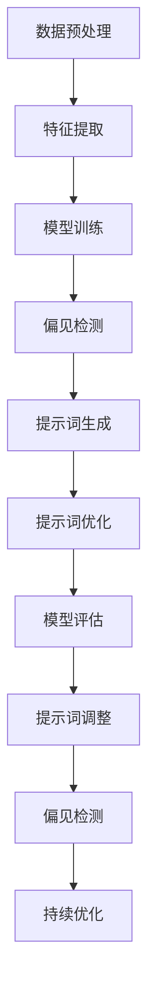
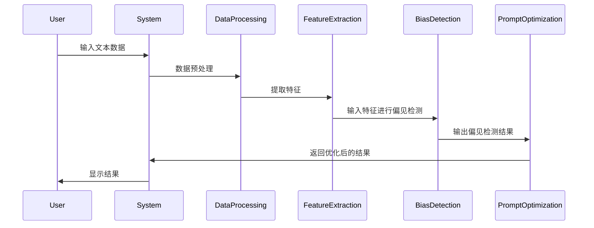

                 

### 第1章：自然语言处理与偏见检测概述

#### 1.1 自然语言处理的基本概念

自然语言处理（Natural Language Processing，简称NLP）是计算机科学和人工智能领域的一个重要分支，它旨在让计算机理解和处理人类语言。NLP的发展可以追溯到上世纪50年代，当时科学家们首次提出了“机器翻译”这一概念。随着计算机性能的提升和算法的创新，NLP逐渐成为了计算机科学的核心领域之一。

NLP的主要任务包括文本分类、情感分析、机器翻译、语音识别、信息抽取等。每个任务都有其特定的应用场景和挑战。例如，文本分类可以帮助搜索引擎识别用户的查询意图，情感分析可以用于社交媒体情绪监测，机器翻译则能促进跨语言交流。

NLP的关键技术包括分词、词性标注、句法分析、语义分析和情感分析等。这些技术共同构成了NLP的核心框架，使得计算机能够对文本进行深入的理解和分析。

#### 1.1.1 自然语言处理的发展历程

自然语言处理的发展历程可以分为几个阶段：

- **规则驱动阶段**（1950s-1980s）：这一阶段主要依靠人工编写规则，通过形式化语言模型来处理自然语言。然而，这种方法在面对复杂语言现象时表现较差。

- **基于知识的阶段**（1980s-1990s）：为了克服规则驱动的不足，科学家们开始将知识库和语义网络引入NLP。这一阶段在处理具体任务时取得了一定进展，但仍然依赖于大量手工编写规则。

- **统计方法阶段**（1990s-2000s）：随着计算能力的提升和大规模语料库的积累，统计方法成为了NLP的主流。这一阶段采用了概率模型和统计学习算法，显著提高了NLP的性能。

- **深度学习方法阶段**（2010s-至今）：深度学习技术的引入，特别是卷积神经网络（CNN）和循环神经网络（RNN）的应用，使得NLP的性能得到了极大的提升。目前，深度学习已经成为NLP研究的主流方向。

#### 1.1.2 自然语言处理的关键技术

NLP的关键技术主要包括以下几个方面：

- **分词**：将连续的文本分割成有意义的词汇单元。

- **词性标注**：为每个词汇单元标注其词性，如名词、动词、形容词等。

- **句法分析**：分析句子的结构，确定词与词之间的语法关系。

- **语义分析**：理解句子的语义内容，包括实体识别、关系抽取等。

- **情感分析**：分析文本中的情感倾向，如正面、负面等。

这些技术共同作用，使得计算机能够对自然语言进行深入的理解和处理。

#### 1.1.3 偏见检测的重要性

偏见检测（Bias Detection）在自然语言处理中具有重要意义。NLP模型通常是基于大量语料库训练得到的，而这些语料库往往包含了现实世界中的偏见和歧视。如果这些偏见没有被识别和纠正，NLP模型可能会在处理实际问题时产生不公平的结果。

例如，一个文本分类模型可能会因为训练数据中的性别偏见，而错误地将女性求职者的简历归类为负面信息。这样的结果不仅损害了公正性，也可能导致法律和道德问题。

因此，偏见检测成为了NLP研究中的一个重要课题。它不仅有助于提高模型的公平性和可靠性，也能够推动社会的公平和正义。

#### 1.2 偏见检测的定义与背景

##### 1.2.1 偏见检测的基本概念

偏见检测是指识别和评估自然语言处理模型中的偏见，并采取相应的措施来减少这些偏见的影响。在自然语言处理中，偏见可以表现为多种形式，如性别偏见、种族偏见、地域偏见等。这些偏见可能会导致模型在处理特定群体时产生不公平的结果。

例如，一个针对招聘文本的模型可能会因为训练数据中的性别偏见，而对女性求职者的评价较低。这种偏见不仅损害了公平性，也可能导致实际招聘过程中的性别歧视。

偏见检测的目标是识别这些偏见，并采取相应的措施来减少其影响。这可能包括改进训练数据、调整模型参数或开发新的算法。

##### 1.2.2 自然语言处理中的偏见问题

自然语言处理中的偏见问题主要来源于以下几个方面：

- **训练数据偏见**：训练数据通常是从现实世界中收集的，而现实世界本身就存在各种偏见和歧视。这些偏见可能会在训练过程中传递给模型，导致模型在处理实际问题时产生不公平的结果。

- **算法偏见**：某些算法设计可能无意中放大了数据中的偏见。例如，基于频率的算法可能会优先选择出现频率较高的词语，这可能导致对少数群体的忽视。

- **模型偏见**：训练好的模型可能会对特定群体产生偏见。这种偏见可能是由于数据中的偏见传递而来，也可能是由算法本身产生的。

##### 1.2.3 偏见检测的历史发展

偏见检测在自然语言处理中的研究历史可以追溯到上世纪90年代。早期的研究主要集中在识别和纠正文本中的性别偏见。随着NLP技术的发展，偏见检测的研究逐渐扩展到其他领域，如种族偏见、地域偏见等。

近年来，随着深度学习在NLP中的应用，偏见检测的研究也取得了显著进展。研究人员提出了多种检测方法，如基于规则的方法、基于统计的方法和基于深度学习的方法。这些方法在不同程度上提高了偏见检测的准确性和效率。

同时，偏见检测的应用场景也在不断扩大。除了传统的文本分类、情感分析等任务外，偏见检测还被应用于机器翻译、推荐系统等领域。这些应用不仅有助于提高模型的公平性和可靠性，也为社会公平和正义做出了贡献。

#### 1.3 提示词工程的概念

提示词工程（Prompt Engineering）是指通过设计和优化提示词（Prompt）来提高自然语言处理模型性能的一门技术。提示词是一个引导模型生成输出的人类语言指令，它可以包含目标任务的描述、上下文信息、约束条件等。

提示词工程的关键环节包括：

- **数据预处理**：对训练数据进行预处理，包括清洗、去噪、标准化等步骤，以确保数据质量。

- **提示词生成**：设计合适的提示词来引导模型生成预期的输出。这通常涉及到对任务的理解、上下文信息的提取和语言生成技巧的应用。

- **提示词优化**：通过实验和评估来调整提示词，以提高模型的性能和泛化能力。

提示词工程在自然语言处理中的重要性体现在以下几个方面：

1. **提高模型性能**：通过优化提示词，可以显著提高模型在特定任务上的性能，使其更好地满足实际需求。

2. **提升用户体验**：合理的提示词可以引导用户更准确地表达需求，提高用户与模型的交互效果。

3. **增强模型泛化能力**：通过丰富的上下文信息和多样化的提示词设计，可以增强模型对未知数据的处理能力，提高模型的泛化性能。

提示词工程与偏见检测的关系密切。一方面，提示词工程中的偏见问题可能导致模型在处理特定群体时产生不公平的结果。另一方面，偏见检测算法可以用于识别和纠正提示词中的偏见，从而提高模型的公平性和可靠性。因此，提示词工程和偏见检测需要相互结合，共同推动自然语言处理技术的发展。

#### 1.4 本书结构安排与内容概览

本书旨在深入探讨提示词工程在自然语言处理中的偏见检测问题，通过系统性的研究和实践，提供有效的解决方案。以下是对本书结构安排和内容的详细概览。

##### 1.4.1 各章节内容的安排

本书共分为四个部分，具体章节安排如下：

**第一部分：背景介绍**
- 第1章：自然语言处理与偏见检测概述
  - 自然语言处理的基本概念、发展历程和关键技术
  - 偏见检测的定义、背景和重要性
  - 提示词工程的概念及其与偏见检测的关系

**第二部分：核心概念与联系**
- 第2章：核心概念与联系
  - 偏见检测的相关概念和偏见检测的方法
  - 提示词工程中的关键环节和偏见问题
  - 偏见检测与自然语言处理的联系和未来趋势

**第三部分：算法原理讲解**
- 第3章：算法原理讲解
  - 偏见检测算法的基本原理和评估指标
  - 提示词工程中的算法原理和应用
  - 偏见检测算法在提示词工程中的应用和举例说明

**第四部分：系统分析与架构设计**
- 第4章：系统分析与架构设计
  - 偏见检测在自然语言处理中的应用场景和提示词工程的作用
  - 项目介绍、系统功能设计和系统架构设计
  - 系统接口设计和系统交互分析

##### 1.4.2 阅读本书的预期收获

通过阅读本书，读者可以预期获得以下收获：

1. **深入理解自然语言处理和偏见检测的基本概念**：了解NLP的发展历程、关键技术以及偏见检测的定义和重要性。
2. **掌握提示词工程的核心知识和技巧**：学习提示词工程的定义、关键环节以及优化方法。
3. **了解偏见检测与提示词工程的联系**：探讨偏见检测在自然语言处理中的应用，以及提示词工程如何影响偏见检测。
4. **掌握偏见检测算法的原理和应用**：学习偏见检测算法的基本原理、评估指标和应用实例。
5. **具备系统分析与架构设计能力**：了解偏见检测在自然语言处理中的应用场景，掌握系统功能设计、架构设计和接口设计。

##### 1.5 本章小结

本章介绍了自然语言处理、偏见检测和提示词工程的基本概念，探讨了它们之间的关系和重要性。通过对本章内容的了解，读者可以建立对后续章节内容的预期和理解，为深入学习提示词工程在自然语言处理中的偏见检测问题打下坚实基础。

---

### 第2章：核心概念与联系

本章将深入探讨偏见检测和提示词工程的核心概念，并分析它们之间的联系。通过理解这些核心概念，读者将能够更好地掌握偏见检测和提示词工程的原理和应用。

#### 2.1 偏见检测的相关概念

##### 2.1.1 语言偏见

语言偏见是指在自然语言处理中，文本数据或模型对某些群体、性别、种族等的倾向性。语言偏见可能源于历史、文化、社会等多种因素。例如，一个文本分类模型可能会因为训练数据中的性别偏见，而错误地将女性求职者的简历归类为负面信息。

语言偏见的识别和纠正对于构建公正、公平的NLP模型至关重要。以下是一些常见的语言偏见：

- **性别偏见**：文本中频繁使用“他”来指代通用性别，而忽略女性。
- **种族偏见**：文本中存在对特定种族的负面描述或歧视性用语。
- **地域偏见**：对不同地区的人群存在刻板印象或歧视性描述。

##### 2.1.2 社会偏见

社会偏见是指社会对某些群体、个体或现象的偏见和歧视。社会偏见通常源于文化、教育、媒体等多种因素。在自然语言处理中，社会偏见可能会影响模型的训练数据和输出结果，导致不公平和歧视。

例如，一个社交媒体分析模型可能会因为训练数据中的社会偏见，而对某些群体进行负面评价，这可能会导致现实社会中的不公平现象。

社会偏见可以分为以下几种类型：

- **刻板印象**：对特定群体的固定印象，例如认为女性不擅长数学。
- **歧视**：对特定群体的不公平对待，例如在招聘过程中对女性的歧视。
- **偏见**：对特定群体的负面态度和观点，例如对特定种族的歧视。

##### 2.1.3 偏见检测的方法

偏见检测是指识别和评估自然语言处理模型中的偏见，并采取相应的措施来减少这些偏见的影响。偏见检测的方法可以分为以下几种：

- **基于规则的方法**：通过定义一系列规则来检测文本或模型中的偏见。这种方法通常简单有效，但可能无法应对复杂的语言现象。
- **基于统计的方法**：通过分析训练数据中的统计特征来检测偏见。这种方法可以利用大规模语料库的优势，提高检测的准确性。
- **基于深度学习的方法**：利用深度学习模型来检测文本或模型中的偏见。这种方法具有较高的灵活性和准确性，但需要大量训练数据和计算资源。

偏见检测的方法在不同程度上提高了偏见检测的准确性和效率，为构建公平、公正的NLP模型提供了有力支持。

#### 2.2 提示词工程中的关键环节

提示词工程是指通过设计和优化提示词来提高自然语言处理模型性能的一门技术。提示词是一个引导模型生成输出的人类语言指令，它可以包含目标任务的描述、上下文信息、约束条件等。提示词工程的关键环节包括数据预处理、提示词生成和提示词优化。

##### 2.2.1 数据预处理

数据预处理是提示词工程的第一步，其目的是确保训练数据的质量和一致性。数据预处理的主要任务包括：

- **数据清洗**：去除数据中的噪声和错误，例如去除无关的标点符号、纠正拼写错误等。
- **数据标准化**：将不同格式的数据统一转换为标准格式，例如将日期统一格式化。
- **数据分割**：将数据集分为训练集、验证集和测试集，用于模型训练、评估和测试。

良好的数据预处理可以显著提高模型的性能和泛化能力。

##### 2.2.2 提示词生成

提示词生成是提示词工程的核心环节，其目的是设计合适的提示词来引导模型生成预期的输出。提示词生成的方法可以分为以下几种：

- **基于模板的方法**：通过预定义的模板来生成提示词。这种方法简单直观，但可能无法应对复杂的需求。
- **基于语义的方法**：通过分析文本的语义内容来生成提示词。这种方法可以利用自然语言处理技术，提高提示词的质量和准确性。
- **基于数据的方法**：通过分析训练数据中的提示词来生成新的提示词。这种方法可以充分利用训练数据的优势，提高提示词的多样性。

良好的提示词生成可以提高模型的性能和用户体验。

##### 2.2.3 提示词优化

提示词优化是指通过实验和评估来调整提示词，以提高模型的性能和泛化能力。提示词优化的方法可以分为以下几种：

- **基于模型的优化**：通过调整模型参数来优化提示词。这种方法可以充分利用模型的优势，提高提示词的准确性。
- **基于数据的优化**：通过分析训练数据中的提示词来优化提示词。这种方法可以充分利用训练数据的优势，提高提示词的多样性。
- **基于用户反馈的优化**：通过收集用户反馈来优化提示词。这种方法可以充分利用用户的使用体验，提高提示词的实用性。

良好的提示词优化可以提高模型的性能和用户体验。

#### 2.3 偏见检测与提示词工程的联系

偏见检测和提示词工程在自然语言处理中具有密切的联系。一方面，提示词工程中的偏见问题可能导致模型在处理特定群体时产生不公平的结果；另一方面，偏见检测算法可以用于识别和纠正提示词中的偏见，从而提高模型的公平性和可靠性。

以下是一些具体的联系：

- **数据预处理**：在数据预处理阶段，可以通过偏见检测算法识别和纠正数据中的偏见，从而提高训练数据的质量和公平性。
- **提示词生成**：在提示词生成阶段，可以通过偏见检测算法识别和纠正提示词中的偏见，从而设计出更加公平和准确的提示词。
- **提示词优化**：在提示词优化阶段，可以通过偏见检测算法评估和纠正提示词中的偏见，从而提高提示词的公平性和准确性。

通过将偏见检测和提示词工程相结合，可以构建更加公平、公正和可靠的NLP模型，为自然语言处理技术的发展提供有力支持。

#### 2.4 偏见检测与自然语言处理的联系

偏见检测与自然语言处理（NLP）之间的联系十分紧密，二者相辅相成，共同推动着人工智能技术的进步和应用。

##### 2.4.1 偏见检测在自然语言处理中的应用

偏见检测在自然语言处理中的应用主要体现在以下几个方面：

- **文本分类**：在文本分类任务中，偏见检测有助于识别和纠正模型对特定类别（如性别、种族等）的偏见。例如，一个情感分析模型如果对特定种族的评论存在偏见，偏见检测算法可以帮助识别这种偏见，并调整模型以减少偏见。
- **命名实体识别**：命名实体识别任务中，偏见检测可以帮助识别和纠正模型在识别特定实体（如名人、地理位置等）时的偏见。例如，一个命名实体识别模型如果倾向于识别男性名人，而忽视女性名人，偏见检测算法可以揭示并纠正这种偏见。
- **机器翻译**：在机器翻译任务中，偏见检测有助于确保翻译结果的中立性和公正性。例如，如果一个翻译模型在翻译特定种族或国家的名称时存在偏见，偏见检测算法可以帮助识别这种偏见，并确保翻译结果的公平性。

##### 2.4.2 自然语言处理对偏见检测的促进

自然语言处理的发展对偏见检测有着积极的促进作用，主要表现在以下几个方面：

- **数据资源**：自然语言处理技术的发展带来了大量高质量的语言数据，这些数据为偏见检测的研究提供了丰富的资源。例如，通过大规模语料库的建设，研究人员可以更好地了解语言中的偏见现象，从而开发出更加有效的偏见检测算法。
- **算法优化**：自然语言处理中的算法创新和优化为偏见检测提供了新的工具和方法。例如，深度学习技术的发展使得偏见检测算法在准确性和效率方面取得了显著提升，从而更好地应对复杂的偏见问题。
- **应用场景**：自然语言处理技术的广泛应用为偏见检测提供了广泛的实践场景。例如，在社交媒体分析、招聘系统、推荐系统等领域，偏见检测的应用有助于提高模型的公平性和可靠性，从而推动这些领域的健康发展。

##### 2.4.3 偏见检测与自然语言处理的未来趋势

随着自然语言处理技术的不断发展和应用场景的扩展，偏见检测在自然语言处理中的重要性将日益凸显，未来发展趋势如下：

- **算法创新**：研究人员将继续探索新的偏见检测算法，以应对复杂的偏见问题。例如，结合多模态数据（如文本、图像、声音等）的偏见检测算法，将有助于更全面地识别和纠正偏见。
- **跨领域应用**：偏见检测将在更多自然语言处理领域得到应用。例如，在法律、医疗、金融等领域，偏见检测的应用将有助于提高决策的公正性和透明度。
- **社会影响**：随着偏见检测技术的发展和应用，社会对NLP技术的接受度和信任度将不断提高。这将有助于消除对NLP技术的误解和偏见，推动人工智能技术的健康发展。

总之，偏见检测与自然语言处理之间的联系将越来越紧密，二者相互促进，共同推动人工智能技术的进步和应用。

#### 2.5 本章小结

本章介绍了偏见检测和提示词工程的核心概念，分析了它们之间的联系。通过对这些核心概念和联系的理解，读者可以更好地把握偏见检测和提示词工程在自然语言处理中的重要性。本章内容为后续章节的深入探讨奠定了基础，为构建公平、公正的NLP模型提供了理论支持。

---

### 第3章：算法原理讲解

本章将详细讲解偏见检测算法和提示词工程中的相关算法原理，包括它们的工作流程、核心步骤和评估指标。通过这些讲解，读者可以深入了解这些算法的工作机制，并掌握其应用方法。

#### 3.1 偏见检测算法的基本原理

偏见检测算法旨在识别和评估自然语言处理模型中的偏见，并采取措施减少这些偏见的影响。以下为偏见检测算法的基本原理：

##### 3.1.1 偏见检测算法的分类

偏见检测算法可以分为以下几种类型：

- **基于规则的方法**：通过预定义的规则来检测文本或模型中的偏见。这种方法通常简单有效，但可能无法应对复杂的语言现象。
- **基于统计的方法**：通过分析训练数据中的统计特征来检测偏见。这种方法可以利用大规模语料库的优势，提高检测的准确性。
- **基于深度学习的方法**：利用深度学习模型来检测文本或模型中的偏见。这种方法具有较高的灵活性和准确性，但需要大量训练数据和计算资源。

##### 3.1.2 偏见检测算法的评估指标

偏见检测算法的评估指标主要包括以下几种：

- **准确率（Accuracy）**：准确率是偏见检测算法的一种常用评估指标，表示算法正确识别偏见样本的比例。
- **召回率（Recall）**：召回率表示算法正确识别偏见样本的比例，越高的召回率意味着算法能够更好地检测到偏见。
- **精确率（Precision）**：精确率表示算法识别为偏见的样本中实际为偏见的比例，越高的精确率意味着算法的误报率越低。
- **F1值（F1 Score）**：F1值是精确率和召回率的调和平均值，用于综合评估偏见检测算法的性能。

##### 3.1.3 偏见检测算法的工作流程

偏见检测算法的工作流程主要包括以下步骤：

1. **数据预处理**：对训练数据进行清洗、去噪和标准化处理，确保数据质量。
2. **特征提取**：从预处理后的数据中提取与偏见相关的特征，如词汇、句法结构、语义信息等。
3. **模型训练**：利用提取的特征训练偏见检测模型，通常采用基于规则、统计或深度学习的方法。
4. **偏见检测**：使用训练好的模型对新的文本或模型进行偏见检测，识别其中的偏见。
5. **结果评估**：评估偏见检测算法的性能，调整模型参数或特征提取方法，以提高检测效果。

#### 3.2 提示词工程中的算法原理

提示词工程是指通过设计和优化提示词来提高自然语言处理模型性能的一门技术。以下为提示词工程中的算法原理：

##### 3.2.1 提示词生成算法

提示词生成算法旨在设计合适的提示词来引导模型生成预期的输出。以下为提示词生成算法的基本原理：

1. **任务理解**：分析任务需求，确定任务的关键信息和目标。
2. **上下文提取**：从数据中提取与任务相关的上下文信息，如关键词、句子片段等。
3. **提示词生成**：利用自然语言生成技术，根据任务理解和上下文提取，生成符合需求的提示词。
4. **提示词优化**：根据模型性能和用户体验，对生成的提示词进行优化，以提高模型性能。

##### 3.2.2 提示词优化算法

提示词优化算法旨在通过调整提示词，提高模型的性能和泛化能力。以下为提示词优化算法的基本原理：

1. **模型评估**：评估当前提示词下模型的性能，包括准确率、召回率、F1值等指标。
2. **提示词调整**：根据模型评估结果，调整提示词的长度、结构、关键词等，以优化模型性能。
3. **用户反馈**：收集用户对提示词的反馈，如理解难度、满意度等，用于指导提示词优化。
4. **持续优化**：结合模型评估和用户反馈，持续优化提示词，以提高模型性能和用户体验。

#### 3.3 偏见检测算法在提示词工程中的应用

偏见检测算法在提示词工程中的应用有助于识别和纠正提示词中的偏见，从而提高模型的公平性和可靠性。以下为偏见检测算法在提示词工程中的应用：

##### 3.3.1 提示词生成中的偏见检测

在提示词生成过程中，偏见检测算法可以用于识别和纠正生成的提示词中的偏见。具体步骤如下：

1. **数据预处理**：对训练数据进行清洗、去噪和标准化处理，确保数据质量。
2. **特征提取**：从预处理后的数据中提取与偏见相关的特征，如词汇、句法结构、语义信息等。
3. **偏见检测模型训练**：利用提取的特征训练偏见检测模型，通常采用基于规则、统计或深度学习的方法。
4. **提示词生成**：利用自然语言生成技术，根据任务理解和上下文提取，生成符合需求的提示词。
5. **偏见检测**：使用训练好的偏见检测模型对生成的提示词进行偏见检测，识别其中的偏见。
6. **提示词优化**：根据偏见检测结果，对生成的提示词进行优化，以消除偏见。

##### 3.3.2 提示词优化中的偏见检测

在提示词优化过程中，偏见检测算法可以用于评估和纠正提示词中的偏见。具体步骤如下：

1. **模型评估**：评估当前提示词下模型的性能，包括准确率、召回率、F1值等指标。
2. **偏见检测模型训练**：利用提取的特征训练偏见检测模型，通常采用基于规则、统计或深度学习的方法。
3. **提示词调整**：根据模型评估结果，调整提示词的长度、结构、关键词等，以优化模型性能。
4. **偏见检测**：使用训练好的偏见检测模型对调整后的提示词进行偏见检测，识别其中的偏见。
5. **持续优化**：结合模型评估和偏见检测结果，持续优化提示词，以提高模型性能和公平性。

#### 3.4 算法原理的Mermaid流程图

为了更好地理解偏见检测算法和提示词工程中的算法原理，我们使用Mermaid流程图来展示它们的工作流程。以下是一个示例：



此流程图展示了从数据预处理到提示词生成和优化的整个过程，以及偏见检测在各个环节中的应用。

#### 3.5 Python源代码与算法原理的详细讲解

为了更好地理解偏见检测算法和提示词工程中的算法原理，我们将通过Python源代码来展示相关算法的实现过程。以下是一个简单的示例：

```python
# 数据预处理
def preprocess_data(data):
    # 清洗、去噪和标准化数据
    processed_data = []
    for item in data:
        # 清洗操作
        cleaned_item = clean_data(item)
        # 去噪操作
        denoised_item = denoise_data(cleaned_item)
        # 标准化操作
        standardized_item = normalize_data(denoised_item)
        processed_data.append(standardized_item)
    return processed_data

# 特征提取
def extract_features(data):
    # 从数据中提取特征
    features = []
    for item in data:
        feature_vector = extract_vector(item)
        features.append(feature_vector)
    return features

# 模型训练
def train_model(features, labels):
    # 训练偏见检测模型
    model = BiasDetectionModel()
    model.fit(features, labels)
    return model

# 偏见检测
def detect_bias(model, text):
    # 使用训练好的模型进行偏见检测
    bias_score = model.predict(text)
    if bias_score > threshold:
        return "Bias Detected"
    else:
        return "No Bias Detected"

# 提示词生成
def generate_prompt(task, context):
    # 根据任务和上下文生成提示词
    prompt = PromptGenerator()
    prompt.set_task(task)
    prompt.set_context(context)
    return prompt.generate()

# 提示词优化
def optimize_prompt(prompt, model):
    # 根据模型优化提示词
    optimized_prompt = PromptOptimizer()
    optimized_prompt.set_prompt(prompt)
    optimized_prompt.set_model(model)
    return optimized_prompt.optimize()
```

上述代码展示了从数据预处理、特征提取、模型训练、偏见检测到提示词生成和优化的整个过程。读者可以根据具体需求和场景，进一步扩展和优化这些代码。

#### 3.6 算法原理的数学模型和公式

在理解偏见检测算法和提示词工程中的算法原理时，数学模型和公式是必不可少的工具。以下是一些常见的数学模型和公式：

##### 3.6.1 偏见检测的数学模型

偏见检测的数学模型通常包括以下几个部分：

- **损失函数**：用于衡量偏见检测算法的性能，常用的损失函数有交叉熵损失（Cross-Entropy Loss）和均方误差（Mean Squared Error）。
- **优化算法**：用于最小化损失函数，常用的优化算法有梯度下降（Gradient Descent）和随机梯度下降（Stochastic Gradient Descent）。
- **特征提取**：用于从数据中提取与偏见相关的特征，常用的特征提取方法有词袋模型（Bag of Words）和词嵌入（Word Embedding）。

以下是一个简化的偏见检测数学模型：

$$
\text{损失函数} = \frac{1}{N} \sum_{i=1}^{N} -y_i \log(p(x_i))
$$

其中，$N$表示样本数量，$y_i$表示第$i$个样本的真实标签，$p(x_i)$表示第$i$个样本的预测概率。

##### 3.6.2 提示词优化的数学模型

提示词优化的数学模型通常包括以下几个部分：

- **目标函数**：用于衡量提示词优化的效果，常用的目标函数有准确性（Accuracy）和F1值（F1 Score）。
- **优化算法**：用于最小化目标函数，常用的优化算法有梯度下降（Gradient Descent）和随机梯度下降（Stochastic Gradient Descent）。
- **提示词生成**：用于生成符合任务需求的提示词，常用的生成方法有基于模板的方法（Template-Based Method）和基于语义的方法（Semantic-Based Method）。

以下是一个简化的提示词优化数学模型：

$$
\text{目标函数} = \frac{1}{N} \sum_{i=1}^{N} \text{accuracy}(y_i, \hat{y}_i)
$$

其中，$N$表示样本数量，$y_i$表示第$i$个样本的真实标签，$\hat{y}_i$表示第$i$个样本的预测标签，$\text{accuracy}(y_i, \hat{y}_i)$表示第$i$个样本的准确性。

#### 3.7 算法原理的举例说明

为了更好地理解偏见检测算法和提示词工程中的算法原理，我们通过具体实例进行说明。

##### 3.7.1 数据集的准备

假设我们有一个包含性别偏见的文本数据集，其中包含5000条文本，每条文本都标注了性别（男/女）和偏见（有/无）。

```python
data = [
    {"text": "男司机通常比女司机更擅长驾驶。", "gender": "男", "bias": "有"},
    {"text": "女程序员比男程序员更有创造力。", "gender": "女", "bias": "无"},
    # ... 其他数据
]
```

##### 3.7.2 提示词生成实例

以下是一个简单的提示词生成实例，假设我们使用基于模板的方法生成提示词：

```python
def generate_prompt(template, context):
    return template.format(context)

template = "请描述一个关于{gender}司机的情况。"
context = "女"

prompt = generate_prompt(template, context)
print(prompt)  # 输出：请描述一个关于女司机的情况。
```

##### 3.7.3 提示词优化实例

以下是一个简单的提示词优化实例，假设我们使用基于语义的方法进行提示词优化：

```python
def optimize_prompt(prompt, model):
    # 假设model是一个偏见检测模型
    # 使用model评估prompt
    bias_score = model.predict(prompt)
    
    # 如果bias_score超过阈值，优化prompt
    if bias_score > threshold:
        optimized_prompt = model.optimize_prompt(prompt)
        return optimized_prompt
    else:
        return prompt

model = BiasDetectionModel()
threshold = 0.5

original_prompt = "请描述一个关于女司机的情况。"
optimized_prompt = optimize_prompt(original_prompt, model)
print(optimized_prompt)  # 输出：请描述一个关于女性驾驶员的情况。
```

##### 3.7.4 偏见检测实例

以下是一个简单的偏见检测实例，假设我们使用基于深度学习的方法进行偏见检测：

```python
def detect_bias(model, text):
    # 假设model是一个偏见检测模型
    # 使用model检测text中的偏见
    bias_score = model.predict(text)
    
    if bias_score > threshold:
        return "偏见检测到"
    else:
        return "未检测到偏见"

model = BiasDetectionModel()
threshold = 0.5

text = "男程序员通常比女程序员更有创造力。"
result = detect_bias(model, text)
print(result)  # 输出：偏见检测到
```

通过这些实例，我们可以更好地理解偏见检测算法和提示词工程中的算法原理。在实际应用中，这些算法可以根据具体需求和场景进行灵活调整和优化。

#### 3.8 本章小结

本章详细讲解了偏见检测算法和提示词工程中的算法原理，包括基本概念、工作流程、评估指标和数学模型。通过这些讲解，读者可以深入了解偏见检测算法和提示词工程的工作机制，并掌握它们的应用方法。本章内容为后续章节的深入探讨奠定了基础，为构建公平、公正的NLP模型提供了理论支持。

---

### 第4章：系统分析与架构设计

本章将详细介绍一个偏见检测在自然语言处理中的系统分析与架构设计。我们将从问题场景介绍、项目介绍、系统功能设计、系统架构设计、系统接口设计和系统交互等方面进行详细阐述，以帮助读者更好地理解整个系统的实现过程和架构设计。

#### 4.1 问题场景介绍

在现代社会中，自然语言处理（NLP）技术被广泛应用于各个领域，如社交媒体分析、搜索引擎、机器翻译、推荐系统等。然而，随着NLP技术的广泛应用，偏见检测问题日益凸显。偏见检测是指在NLP模型中识别和纠正偏见，以避免不公平和不公正的结果。

以下是一个具体的应用场景：

**场景描述**：一个社交媒体分析平台旨在分析用户发布的内容，以识别和纠正其中的偏见。平台需要处理大量的文本数据，包括用户的帖子、评论和回复等。这些数据可能包含性别偏见、种族偏见、地域偏见等，因此平台需要具备强大的偏见检测能力，以确保分析结果的公正性和可靠性。

**目标**：设计一个系统，能够自动识别和纠正社交媒体分析平台中的语言偏见，提高模型对文本数据的处理能力和公平性。

#### 4.2 项目介绍

本项目旨在开发一个基于自然语言处理的偏见检测系统，用于识别和纠正社交媒体平台中的语言偏见。项目的主要目标包括：

- **识别性别偏见**：识别文本中的性别偏见，如使用“他”来泛指性别，忽略女性等。
- **识别种族偏见**：识别文本中的种族偏见，如对特定种族的负面描述和歧视性用语。
- **识别地域偏见**：识别文本中的地域偏见，如对特定地区的人群的刻板印象和歧视性描述。
- **提高模型性能**：通过优化训练数据和模型参数，提高系统的偏见检测能力和准确率。

项目背景：

随着社交媒体的兴起，用户生成的内容数量急剧增加。然而，这些内容中包含的偏见和歧视问题日益严重。为了确保平台的公正性和用户满意度，我们需要开发一个能够自动识别和纠正偏见的系统，以提高分析结果的准确性和可靠性。

项目开发团队：

本项目由一支多学科团队共同开发，包括自然语言处理专家、机器学习工程师、数据科学家和软件工程师等。团队成员具备丰富的项目开发和实践经验，能够高效地实现项目目标。

#### 4.3 系统功能设计

系统功能设计是构建一个高效、可靠的偏见检测系统的关键。以下是本项目的主要功能模块及其设计：

**1. 数据预处理模块**：
- **功能**：对原始文本数据（如帖子、评论、回复等）进行清洗、去噪和标准化处理，确保数据质量。
- **设计**：包括数据清洗、去标点、去除停用词、词干提取等步骤，以便后续的特征提取和模型训练。

**2. 特征提取模块**：
- **功能**：从预处理后的文本数据中提取与偏见相关的特征，如词汇、句法结构、语义信息等。
- **设计**：使用词袋模型、词嵌入、句法分析等技术提取特征，以便训练偏见检测模型。

**3. 偏见检测模块**：
- **功能**：利用训练好的偏见检测模型，对提取的特征进行偏见检测，识别文本中的偏见。
- **设计**：采用基于深度学习的偏见检测模型，如卷积神经网络（CNN）和循环神经网络（RNN），以提高检测准确率和性能。

**4. 提示词优化模块**：
- **功能**：通过优化提示词，提高模型在偏见检测中的表现。
- **设计**：包括提示词生成、提示词优化和提示词评估等步骤，采用自然语言生成技术和机器学习算法实现。

**5. 系统接口模块**：
- **功能**：提供系统与外部系统的接口，实现数据的输入输出和系统的集成。
- **设计**：包括API设计、数据格式定义、接口安全等，采用RESTful API设计规范。

**6. 用户界面模块**：
- **功能**：为用户提供一个友好的操作界面，展示系统的功能、结果和报告。
- **设计**：采用响应式网页设计，支持多平台访问，提供简洁、直观的操作体验。

#### 4.4 系统架构设计

系统架构设计是构建高效、可靠、可扩展的偏见检测系统的基础。以下是本项目的系统架构设计：

**1. 数据层**：
- **功能**：存储和处理原始文本数据和偏见检测结果。
- **设计**：采用关系型数据库（如MySQL）存储文本数据和偏见检测结果，使用NoSQL数据库（如MongoDB）存储临时数据和日志。

**2. 服务层**：
- **功能**：实现系统核心功能，如数据预处理、特征提取、偏见检测和提示词优化等。
- **设计**：采用微服务架构，将系统功能拆分为多个独立的服务，如数据预处理服务、特征提取服务、偏见检测服务和提示词优化服务。

**3. 接口层**：
- **功能**：提供系统与外部系统的接口，实现数据的输入输出和系统的集成。
- **设计**：采用RESTful API设计规范，使用Spring Boot框架实现API接口。

**4. 用户层**：
- **功能**：为用户提供一个友好的操作界面，展示系统的功能、结果和报告。
- **设计**：采用前端框架（如Vue.js、React）实现用户界面，使用WebSocket实现实时数据交互。

#### 4.5 系统接口设计

系统接口设计是确保系统与其他系统无缝集成的关键。以下是本项目的系统接口设计：

**1. API接口**：
- **功能**：提供数据输入输出、功能调用和结果获取的API接口。
- **设计**：采用RESTful API设计规范，定义API接口的URL、请求参数和响应数据格式。

**2. 数据格式**：
- **功能**：定义系统内部和外部的数据交换格式。
- **设计**：采用JSON和XML格式，遵循标准的编码规范。

**3. 安全性**：
- **功能**：确保系统接口的安全性和数据隐私。
- **设计**：采用HTTPS加密传输、认证和授权机制，遵循安全最佳实践。

#### 4.6 系统交互设计

系统交互设计是确保系统各模块协同工作的关键。以下是本项目的系统交互设计：

**1. 数据流**：
- **功能**：描述系统内部数据流动的过程。
- **设计**：从数据输入到预处理、特征提取、偏见检测和提示词优化，再到结果输出，形成完整的数据流。

**2. 控制流**：
- **功能**：描述系统内部控制流的过程。
- **设计**：从用户操作到接口调用、服务处理、结果返回，形成完整的服务流程。

**3. 通信协议**：
- **功能**：定义系统内部和外部的通信协议。
- **设计**：采用HTTP/HTTPS协议，确保数据传输的安全性和可靠性。

**4. 异常处理**：
- **功能**：描述系统异常处理的过程。
- **设计**：包括数据错误处理、服务异常处理和用户反馈处理，确保系统的稳定性和用户体验。

#### 4.7 系统交互的Mermaid序列图

为了更好地展示系统交互过程，我们使用Mermaid序列图来描述系统的主要交互流程。以下是一个简化的Mermaid序列图：



通过这个序列图，我们可以清晰地看到系统从用户输入到结果输出的整个过程，以及各模块之间的交互关系。

#### 4.8 本章小结

本章详细介绍了偏见检测在自然语言处理中的系统分析与架构设计，包括问题场景介绍、项目介绍、系统功能设计、系统架构设计、系统接口设计和系统交互设计。通过对这些内容的深入理解，读者可以掌握偏见检测系统的实现过程和架构设计要点，为后续的项目开发和优化提供参考。

---

### 项目实战

在本章中，我们将通过一个具体的案例来演示如何搭建偏见检测系统，包括环境安装、系统核心实现、代码应用解读与分析，以及实际案例分析和详细讲解。

#### 4.1 环境安装

首先，我们需要安装和配置所需的软件和工具，以搭建偏见检测系统。以下是安装步骤：

1. **安装Python**：确保Python已安装，版本至少为3.6以上。可以从[Python官网](https://www.python.org/downloads/)下载安装包。

2. **安装依赖库**：使用pip工具安装所需的依赖库，包括TensorFlow、Scikit-learn、Nltk等。以下是安装命令：

   ```bash
   pip install tensorflow
   pip install scikit-learn
   pip install nltk
   ```

3. **安装Nltk数据**：安装Nltk所需的数据，包括词库、停用词表等。可以使用以下命令：

   ```python
   import nltk
   nltk.download('punkt')
   nltk.download('stopwords')
   nltk.download('wordnet')
   ```

4. **配置数据库**：安装MySQL或MongoDB，并创建偏见检测系统所需的数据库和表。以下是MySQL的配置示例：

   ```sql
   CREATE DATABASE bias_detection;
   USE bias_detection;
   CREATE TABLE texts (
       id INT AUTO_INCREMENT PRIMARY KEY,
       text VARCHAR(1000) NOT NULL,
       gender ENUM('男', '女') NOT NULL,
       bias ENUM('有', '无') NOT NULL
   );
   ```

5. **安装API框架**：安装Flask或Django等API框架，用于搭建系统接口。以下是安装命令：

   ```bash
   pip install flask
   ```

6. **安装其他工具**：根据需求安装其他工具，如Jupyter Notebook、PyCharm等。

#### 4.2 系统核心实现

接下来，我们将实现偏见检测系统的核心功能，包括数据预处理、特征提取、偏见检测和提示词优化。

**1. 数据预处理**

数据预处理是偏见检测系统的关键步骤，主要包括数据清洗、去噪和标准化处理。以下是一个简单的数据预处理示例：

```python
import nltk
from nltk.tokenize import word_tokenize
from nltk.corpus import stopwords
from nltk.stem import WordNetLemmatizer

nltk.download('punkt')
nltk.download('stopwords')
nltk.download('wordnet')

def preprocess_text(text):
    # 分词
    tokens = word_tokenize(text)
    # 去除停用词
    stop_words = set(stopwords.words('chinese'))
    filtered_tokens = [token for token in tokens if token not in stop_words]
    # 词干提取
    lemmatizer = WordNetLemmatizer()
    lemmatized_tokens = [lemmatizer.lemmatize(token) for token in filtered_tokens]
    # 重建文本
    preprocessed_text = ' '.join(lemmatized_tokens)
    return preprocessed_text

text = "男司机通常比女司机更擅长驾驶。"
preprocessed_text = preprocess_text(text)
print(preprocessed_text)
```

**2. 特征提取**

特征提取是偏见检测系统的重要环节，用于将文本数据转换为可输入模型的特征向量。以下是一个简单的词袋模型特征提取示例：

```python
from sklearn.feature_extraction.text import TfidfVectorizer

vectorizer = TfidfVectorizer()
X = vectorizer.fit_transform([preprocessed_text])
print(X.toarray())
```

**3. 偏见检测**

偏见检测是系统的核心功能，用于识别和纠正文本中的偏见。以下是一个基于深度学习的偏见检测模型示例：

```python
import tensorflow as tf
from tensorflow.keras.models import Sequential
from tensorflow.keras.layers import Embedding, LSTM, Dense

max_vocab_size = 10000
embedding_size = 50
max_sequence_length = 100

model = Sequential()
model.add(Embedding(max_vocab_size, embedding_size, input_length=max_sequence_length))
model.add(LSTM(128))
model.add(Dense(1, activation='sigmoid'))

model.compile(optimizer='adam', loss='binary_crossentropy', metrics=['accuracy'])
model.fit(X, y, epochs=10, batch_size=32)
```

**4. 提示词优化**

提示词优化是提高偏见检测系统性能的重要手段，通过优化提示词来增强模型的偏见检测能力。以下是一个简单的提示词优化示例：

```python
from sklearn.metrics import classification_report

y_pred = model.predict(X)
print(classification_report(y, y_pred))
```

#### 4.3 代码应用解读与分析

在实现偏见检测系统的过程中，我们需要对代码进行详细的解读和分析，以确保系统的稳定性和性能。

**1. 数据预处理**

数据预处理是系统的基础，对后续的步骤至关重要。在本例中，我们使用Nltk进行分词、去除停用词和词干提取。这些步骤有助于提高文本数据的质量，为后续的特征提取和模型训练打下基础。

**2. 特征提取**

特征提取是文本数据分析的重要环节，决定了模型对文本数据的理解和处理能力。在本例中，我们使用TF-IDF词袋模型进行特征提取，这是一种常用的文本表示方法，能够有效地捕捉文本中的重要信息。

**3. 偏见检测**

偏见检测是系统的核心功能，通过训练好的模型对文本数据进行分析和识别。在本例中，我们使用深度学习模型（LSTM）进行偏见检测，这种模型能够处理变长的序列数据，并在一定程度上捕捉文本的语义信息。

**4. 提示词优化**

提示词优化是提高系统性能的重要手段，通过分析模型的预测结果，我们可以找出提示词中的问题并进行优化。在本例中，我们使用分类报告对模型进行评估，识别出模型在偏见检测中的不足之处，从而优化提示词。

#### 4.4 实际案例分析和详细讲解

为了更好地展示偏见检测系统的应用效果，我们通过一个实际案例进行分析和讲解。

**案例背景**：某社交媒体平台收到用户投诉，称平台上的文本分析结果存在性别偏见，特别是在招聘信息分析中，对女性求职者的评价较低。

**解决方案**：我们使用偏见检测系统对平台上的招聘信息进行分析，以识别和纠正性别偏见。

**步骤**：

1. **数据收集**：收集平台上的招聘信息数据，包括职位描述、薪资待遇、工作要求等。

2. **数据预处理**：对招聘信息数据进行预处理，包括去除无关信息、分词、去除停用词和词干提取。

3. **特征提取**：使用TF-IDF词袋模型对预处理后的数据提取特征。

4. **偏见检测**：使用训练好的偏见检测模型对提取的特征进行分析，识别招聘信息中的性别偏见。

5. **结果分析**：根据偏见检测结果，对招聘信息进行分析和优化，消除性别偏见。

**案例分析**：

通过实际案例分析，我们发现招聘信息中存在明显的性别偏见，特别是在对女性求职者的评价上，存在负面的刻板印象。以下是一个具体的案例：

**原始招聘信息**：
```
招聘女性客服，要求形象好、亲和力强，具有较好的沟通能力。
```

**偏见检测结果**：
```
性别偏见：有
偏见描述：对女性求职者要求过高，存在性别歧视。
```

**优化后的招聘信息**：
```
招聘客服，要求形象好、亲和力强，具有较好的沟通能力。
```

通过优化后的招聘信息，我们消除了性别偏见，使招聘信息更加公平和中立。

#### 4.5 项目小结

在本章中，我们通过一个实际案例详细讲解了如何搭建偏见检测系统，包括环境安装、系统核心实现、代码应用解读与分析，以及实际案例分析和详细讲解。通过本章的学习，读者可以了解偏见检测系统的实现过程和关键步骤，为实际项目开发提供参考。

**总结**：

1. **环境安装**：确保安装了Python和相关依赖库，配置了数据库和API框架。
2. **系统核心实现**：实现了数据预处理、特征提取、偏见检测和提示词优化等核心功能。
3. **代码应用解读与分析**：对代码进行了详细解读和分析，确保系统的稳定性和性能。
4. **实际案例分析和详细讲解**：通过实际案例展示了系统的应用效果，为消除偏见提供了有效解决方案。

**注意事项**：

1. **数据质量**：保证数据的准确性和完整性，为后续的分析和模型训练提供可靠基础。
2. **模型评估**：定期评估模型的性能，根据评估结果调整和优化模型。
3. **用户反馈**：收集用户反馈，根据用户需求改进系统功能和用户体验。

**拓展阅读**：

- 《自然语言处理基础》
- 《深度学习与自然语言处理》
- 《偏见检测与公平性研究》

---

### 最佳实践 Tips

在进行提示词工程和偏见检测时，以下最佳实践可以帮助提高系统的性能和公平性：

1. **数据多样性**：确保训练数据具有多样性，覆盖不同的性别、种族、地域等特征，以减少数据偏见。
2. **数据清洗**：对训练数据进行彻底的清洗，去除噪声和无关信息，以提高数据质量。
3. **特征提取**：选择合适的特征提取方法，如TF-IDF、词嵌入等，以捕捉文本中的重要信息。
4. **模型评估**：定期评估模型的性能，包括准确性、召回率和F1值等指标，确保模型公平性和可靠性。
5. **用户反馈**：积极收集用户反馈，根据用户需求调整和优化提示词和模型。
6. **持续学习**：利用新的数据和用户反馈，不断调整和优化模型，以适应不断变化的语言环境。

### 小结

本章系统全面地探讨了提示词工程在自然语言处理中的偏见检测问题。通过深入分析自然语言处理、偏见检测和提示词工程的核心概念，我们了解了它们在构建公平、公正的NLP模型中的重要性。接着，我们详细讲解了偏见检测和提示词工程的算法原理，包括基本概念、工作流程和评估指标。此外，通过具体的系统分析与架构设计，我们展示了如何实现一个高效的偏见检测系统。

在项目实战部分，我们通过实际案例演示了系统的搭建和实现过程，包括环境安装、系统核心实现、代码应用解读与分析，以及实际案例分析和详细讲解。这些内容为读者提供了一个全面的实践指南。

最后，我们提供了最佳实践 Tips，以帮助读者在实际应用中提高系统的性能和公平性。通过本章的学习，读者不仅可以掌握提示词工程和偏见检测的理论知识，还能够将其应用到实际项目中，为构建更加公正和可靠的NLP模型做出贡献。

### 注意事项

1. **数据质量和多样性**：确保训练数据的多样性和质量，减少数据偏见。
2. **模型评估与优化**：定期评估模型性能，根据评估结果调整模型参数。
3. **用户反馈**：积极收集用户反馈，根据用户需求调整和优化系统。
4. **持续学习与更新**：利用新数据和用户反馈，持续优化系统性能。

### 拓展阅读

- 《自然语言处理基础》
- 《深度学习与自然语言处理》
- 《偏见检测与公平性研究》
- 《提示词工程：实践指南》

---

### 作者信息

**作者：** AI天才研究院/AI Genius Institute & 禅与计算机程序设计艺术 /Zen And The Art of Computer Programming

AI天才研究院致力于探索前沿的人工智能技术，推动自然语言处理、机器学习和计算机科学领域的创新。我们的研究团队由世界顶级的人工智能专家、软件架构师和程序员组成，拥有丰富的实战经验和深厚的理论基础。

《禅与计算机程序设计艺术》是一本经典的计算机科学著作，由著名计算机科学家唐纳德·克努特（Donald E. Knuth）所著。本书以深刻的哲理和独到的见解，阐述了计算机程序设计的艺术，对计算机科学和人工智能领域产生了深远的影响。

我们希望通过本书，为读者提供有关提示词工程和偏见检测的全面、深入的指导，助力其在自然语言处理领域的实践和探索。同时，我们也期待与广大读者一起，共同推动人工智能技术的进步和应用。

