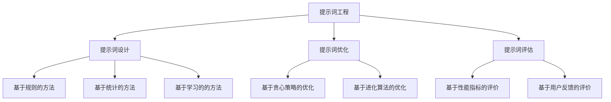
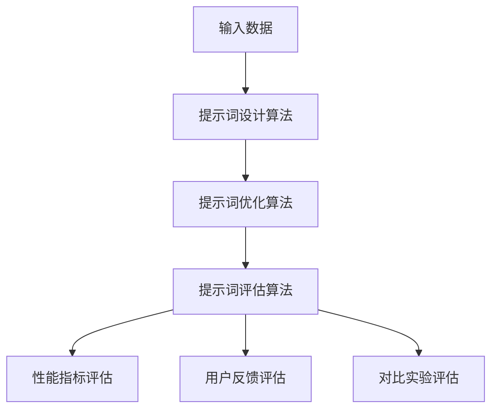
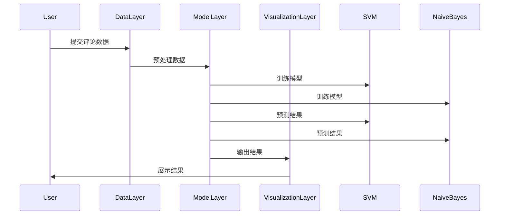
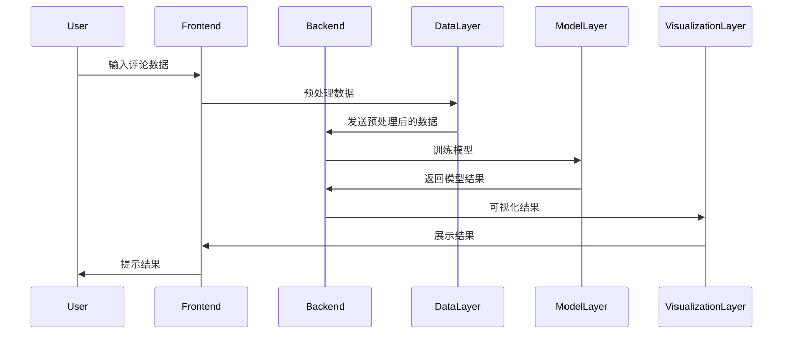

                 

##  第1章：问题背景与概述

### 1.1.1 问题背景

自然语言处理（NLP）作为人工智能（AI）领域的一个重要分支，近年来取得了显著的进展。传统的NLP方法主要依赖于统计模型和规则系统，虽然在一定程度上能够处理简单的语言任务，但在处理复杂、多样化的语言现象时，仍然存在诸多挑战。例如，语义理解、情感分析、问答系统等任务，对模型的要求越来越高，传统的NLP方法已经难以满足需求。

为了解决这些问题，研究人员开始探索新的方法来提高NLP的性能。其中，提示词工程作为一种新型的NLP方法，逐渐受到关注。提示词工程通过设计特定的提示词来引导模型学习，从而提高模型在特定任务上的表现。这种方法突破了传统NLP方法的局限，为解决复杂语言任务提供了一种新的思路。

### 1.1.2 问题描述

提示词工程作为一种新兴的方法，当前的研究还不够成熟，存在着一系列亟待解决的问题：

1. **提示词设计缺乏系统性**：现有的研究往往注重单一任务的提示词设计，缺乏对整体系统的考虑，导致提示词之间的协调性不足。

2. **优化方法不够成熟**：提示词优化是提高模型表现的关键步骤，但目前的研究还主要集中在简单的贪心策略和进化算法，缺乏对更高效优化方法的探索。

3. **评估标准不统一**：提示词评估是验证提示词有效性的重要环节，但现有的评估方法不统一，难以全面、客观地评估提示词的性能。

4. **应用范围有限**：尽管提示词工程在NLP领域取得了初步成果，但在其他AI领域，如语音识别、机器翻译等，应用范围仍然有限。

### 1.1.3 问题解决

本书旨在系统地介绍提示词工程在自然语言处理中的应用，分析其原理、方法和实践，以期为读者提供解决实际问题的指导。具体目标如下：

1. **全面介绍提示词工程的原理和方法**：从基本概念到具体实现，系统地介绍提示词工程的理论基础和实践方法。

2. **解决实际问题**：通过具体案例，展示提示词工程在自然语言处理中的实际应用，帮助读者理解其价值和意义。

3. **探讨前沿研究方向**：介绍当前提示词工程的研究热点和前沿方向，为读者提供进一步研究的参考。

4. **拓展应用领域**：探讨提示词工程在其他AI领域的应用潜力，为相关领域的研究提供借鉴。

### 1.1.4 边界与外延

提示词工程主要应用于自然语言处理（NLP）领域，通过设计特定的提示词来引导模型学习，从而提高模型在特定任务上的表现。然而，其应用范围并不仅限于NLP领域，还可以拓展到其他相关的AI领域，如语音识别、机器翻译、图像识别等。这些领域同样面临着复杂、多样化的语言或视觉现象，提示词工程的方法可以为这些领域提供新的解决方案。

### 1.1.5 核心概念

在介绍提示词工程之前，我们需要明确一些核心概念：

- **提示词**：提示词是引导模型学习的特殊词语，通过调整提示词，可以使模型更好地理解输入数据，从而提高模型在特定任务上的表现。

- **提示词工程**：提示词工程是设计、优化和评估提示词的过程。它包括提示词的设计、优化和评估方法，旨在提高模型在特定任务上的性能。

- **自然语言处理（NLP）**：自然语言处理是人工智能领域的一个分支，旨在让计算机理解和处理人类自然语言。

- **深度学习模型**：深度学习模型是一种基于多层神经网络的人工智能模型，通过学习大量数据，可以自动提取特征并进行预测。

### 1.1.6 概念结构与核心要素组成

为了更好地理解提示词工程的概念结构，我们可以通过一个示意图来展示其核心要素组成。以下是一个简化的概念结构图：



这个结构图展示了提示词工程的三个核心环节：提示词设计、提示词优化和提示词评估。每个环节都有不同的方法和技术，旨在通过调整提示词来提高模型在特定任务上的表现。通过这个结构图，我们可以对提示词工程有一个宏观的认识，为后续章节的详细探讨奠定基础。

### 1.1.7 提示词设计算法

提示词设计是提示词工程的首要环节，其核心在于如何选择和调整提示词，以引导模型更好地学习。以下是几种常见的提示词设计算法：

1. **基于规则的方法**：这种方法通过预定义的规则来选择提示词，例如根据词频、词义、语法结构等特征。优点是简单直观，缺点是灵活性不足。

2. **基于统计的方法**：这种方法通过统计方法来选择提示词，例如使用互信息、条件概率等指标来评估词对模型的贡献。优点是具有较强的灵活性，缺点是需要大量数据和计算资源。

3. **基于学习的的方法**：这种方法利用机器学习方法来学习提示词，例如使用支持向量机（SVM）、随机森林（Random Forest）等算法。优点是能够自动提取特征，缺点是训练时间较长。

每种方法都有其适用的场景和限制，实际应用中往往需要根据具体情况选择合适的方法。

### 1.1.8 提示词优化算法

提示词优化是提高提示词质量的关键步骤，其核心在于如何通过调整提示词来提高模型在特定任务上的表现。以下是几种常见的提示词优化算法：

1. **基于贪心策略的优化**：这种方法通过每次只调整一个提示词，选择能够最大化模型表现的提示词。优点是实现简单，缺点是可能陷入局部最优。

2. **基于进化算法的优化**：这种方法通过模拟自然进化过程来优化提示词，例如使用遗传算法、粒子群算法等。优点是具有较强的全局搜索能力，缺点是计算复杂度高。

3. **基于强化学习的的方法**：这种方法利用强化学习来优化提示词，通过奖励机制引导模型不断调整提示词，直至达到最佳表现。优点是能够自适应调整，缺点是需要大量训练数据。

这些优化算法各有优缺点，实际应用中往往需要根据具体任务和数据特点选择合适的算法。

### 1.1.9 提示词评估算法

提示词评估是验证提示词有效性的关键环节，其核心在于如何客观、全面地评估提示词的性能。以下是几种常见的提示词评估方法：

1. **基于性能指标的评价**：这种方法通过计算模型在特定任务上的性能指标，如准确率、召回率、F1值等，来评估提示词的有效性。优点是客观准确，缺点是可能受数据分布影响。

2. **基于用户反馈的评价**：这种方法通过收集用户对模型的反馈，如满意度、错误率等，来评估提示词的有效性。优点是更贴近实际应用，缺点是可能受主观因素影响。

3. **基于对比实验的评价**：这种方法通过对比不同提示词的效果，来评估提示词的有效性。优点是能够直观比较，缺点是可能存在偏差。

这些评估方法各有优劣，实际应用中往往需要结合多种方法进行综合评估。

### 1.1.10 提示词工程的挑战与展望

尽管提示词工程在自然语言处理中展示了巨大的潜力，但仍然面临一系列挑战：

1. **提示词设计的系统性不足**：现有的研究往往缺乏对整体系统的考虑，提示词之间的协调性不足，影响了整体性能。

2. **优化方法的效率问题**：现有的优化方法在处理大规模数据时，计算复杂度较高，效率问题亟待解决。

3. **评估标准的统一性不足**：现有的评估方法不统一，难以全面、客观地评估提示词的性能，影响了研究结果的可靠性。

4. **应用范围的拓展**：尽管提示词工程在NLP领域取得了初步成果，但在其他AI领域的应用还相对有限，如何拓展其应用范围是未来的重要方向。

展望未来，提示词工程有望在以下方面取得突破：

1. **提升提示词设计的系统性**：通过引入更多的数学模型和算法，提升提示词设计的系统性，提高模型的整体性能。

2. **优化方法的效率**：通过改进现有的优化算法，提高其在大规模数据上的处理效率，使其更适用于实际应用。

3. **完善评估标准**：制定统一的评估标准，确保评估结果的可靠性，为研究提供客观的参考。

4. **拓展应用领域**：在NLP以外的AI领域，如语音识别、机器翻译、图像识别等，探索提示词工程的应用潜力，推动AI技术的全面发展。

通过不断克服挑战和开拓新方向，提示词工程有望在未来取得更加显著的成果，为人工智能的发展做出更大贡献。

### 1.1.11 结论

本章从问题背景、问题描述、问题解决、边界与外延、核心概念、概念结构与核心要素组成等方面，系统地介绍了提示词工程在自然语言处理中的应用。通过本文的介绍，读者可以初步了解提示词工程的原理和方法，为后续章节的深入探讨打下基础。下一章将详细探讨提示词工程的基本原理，包括提示词设计、优化和评估方法，帮助读者更深入地理解这一新兴领域。

## 第2章：核心概念与联系

### 2.1 提示词工程的基本原理

提示词工程是一种通过设计特定的提示词来引导模型学习的方法，其基本原理可以概括为以下几个关键步骤：

1. **提示词设计**：选择合适的提示词，这些提示词应当能够引导模型关注到关键信息，从而提高模型在特定任务上的表现。

2. **提示词优化**：通过调整提示词，使其更符合模型的内在特性，从而提高模型在特定任务上的性能。这通常需要通过实验和迭代来完成。

3. **提示词评估**：对提示词的有效性进行评估，以确定是否需要进一步调整。这通常通过性能指标（如准确率、召回率、F1值等）来进行。

### 2.2 提示词工程的属性特征对比表格

在提示词工程中，不同的属性特征会直接影响其效果。以下是一个简化的属性特征对比表格，用于展示提示词设计、优化和评估的关键特性：

| 特性         | 设计                          | 优化                          | 评估                          |
| ------------ | ----------------------------- | ----------------------------- | ----------------------------- |
| 提示词选择   | 根据任务需求选择关键词         | 调整关键词以提高性能           | 评估关键词对性能的影响       |
| 调整方法     | 基于规则、统计或学习方法       | 基于贪心策略、进化算法等       | 使用性能指标进行量化评估     |
| 评估指标     | 提升信息覆盖率、降低冗余       | 提高模型准确性、减少误差       | 准确率、召回率、F1值等       |

### 2.3 提示词工程与相关概念的ER实体关系图架构

为了更好地理解提示词工程与其他相关概念之间的关系，我们可以使用实体关系图（ER图）来展示其架构。以下是提示词工程及相关概念的ER实体关系图：

```mermaid
entity relation
  Entity: 提示词
  Entity: 模型
  Entity: 数据集
  Entity: 任务
  Entity: 性能指标

  Relation: 设计
    Entity: 提示词
    Entity: 模型

  Relation: 优化
    Entity: 提示词
    Entity: 模型

  Relation: 评估
    Entity: 提示词
    Entity: 性能指标

  Relation: 训练
    Entity: 模型
    Entity: 数据集

  Relation: 应用
    Entity: 模型
    Entity: 任务

  Attribute: 提示词
    - 关键词
    - 重要性

  Attribute: 模型
    - 类型
    - 参数

  Attribute: 数据集
    - 大小
    - 分布

  Attribute: 任务
    - 目标
    - 要求

  Attribute: 性能指标
    - 准确率
    - 召回率
    - F1值
```

在这个ER图中，我们定义了几个核心实体：提示词、模型、数据集、任务和性能指标。它们之间的关系和属性特征通过边和节点进行表示。例如，“设计”关系表示提示词和模型之间的关系，通过这个关系，提示词可以引导模型学习。同样，“优化”和“评估”关系分别表示对提示词的调整和性能评估过程。通过这个ER图，我们可以清晰地看到提示词工程中的关键要素和它们之间的相互作用。

### 2.4 提示词工程的应用实例

为了更好地理解提示词工程的实际应用，我们可以通过一个具体的案例来探讨。假设我们有一个文本分类任务，目标是根据文本内容将其分类到不同的类别中。

**案例**：设计一个提示词工程系统，用于分类新闻文章。

**步骤**：

1. **提示词设计**：首先，我们需要选择一组关键词来作为提示词。这些关键词可以从新闻文章的标题、摘要和正文中提取，例如“政治”、“经济”、“科技”等。我们还可以使用主题模型（如LDA）来提取更高层次的主题关键词。

2. **模型选择**：我们选择一个合适的文本分类模型，如支持向量机（SVM）或深度学习模型（如BERT）。为了适应提示词工程，我们可能需要对模型进行一些调整，使其能够更好地利用提示词。

3. **训练模型**：使用大量的新闻文章数据集来训练模型。在这个过程中，我们将提示词加入到训练数据中，以引导模型学习。

4. **提示词优化**：通过实验和迭代，我们调整提示词，以最大化模型的分类性能。这可以通过多种优化方法实现，如贪心策略或进化算法。

5. **评估模型**：使用一系列性能指标（如准确率、召回率、F1值等）来评估模型的分类性能。如果性能不理想，我们继续调整提示词，直到达到满意的性能水平。

6. **应用模型**：将训练好的模型应用于实际新闻文章分类任务中，以实现自动分类。

通过这个案例，我们可以看到提示词工程在文本分类任务中的应用。提示词工程的核心在于通过设计特定的提示词来引导模型学习，从而提高模型在特定任务上的表现。

### 2.5 提示词工程的挑战与未来方向

尽管提示词工程在自然语言处理中展示了巨大的潜力，但仍然面临一系列挑战：

1. **提示词设计的系统性不足**：现有的研究往往缺乏对整体系统的考虑，提示词之间的协调性不足，影响了整体性能。

2. **优化方法的效率问题**：现有的优化方法在处理大规模数据时，计算复杂度较高，效率问题亟待解决。

3. **评估标准的统一性不足**：现有的评估方法不统一，难以全面、客观地评估提示词的性能，影响了研究结果的可靠性。

4. **应用范围的拓展**：尽管提示词工程在NLP领域取得了初步成果，但在其他AI领域的应用还相对有限，如何拓展其应用范围是未来的重要方向。

未来，提示词工程的发展可以从以下几个方面进行：

1. **提升提示词设计的系统性**：通过引入更多的数学模型和算法，提升提示词设计的系统性，提高模型的整体性能。

2. **优化方法的效率**：通过改进现有的优化算法，提高其在大规模数据上的处理效率，使其更适用于实际应用。

3. **完善评估标准**：制定统一的评估标准，确保评估结果的可靠性，为研究提供客观的参考。

4. **拓展应用领域**：在NLP以外的AI领域，如语音识别、机器翻译、图像识别等，探索提示词工程的应用潜力，推动AI技术的全面发展。

通过不断克服挑战和开拓新方向，提示词工程有望在未来取得更加显著的成果，为人工智能的发展做出更大贡献。

### 2.6 本章小结

本章从基本原理、属性特征、ER实体关系图架构以及应用实例等方面，系统地介绍了提示词工程。通过对比不同的属性特征，读者可以更深入地理解提示词工程的核心概念。同时，通过具体的案例，读者可以看到提示词工程在实际应用中的具体操作。接下来，我们将进一步探讨提示词工程的算法原理，包括设计、优化和评估方法，帮助读者更全面地掌握这一新兴领域。

## 第3章：提示词工程算法原理

提示词工程作为一种通过设计特定提示词来提高模型性能的方法，其核心在于如何高效地设计、优化和评估这些提示词。本章将详细探讨这些算法原理，为后续章节的应用和实践提供理论基础。

### 3.1 提示词设计算法

提示词设计是提示词工程的首要环节，其目标是选择合适的提示词，以引导模型更好地理解输入数据。以下是几种常见的提示词设计算法：

#### 3.1.1 基于规则的方法

基于规则的方法通过预定义的规则来选择提示词。这些规则可以是基于词频、词义、语法结构等特征。例如，我们可以选择在训练数据中出现频率较高的词作为提示词，因为这些词可能包含了训练数据的主要信息。

**优点**：简单直观，易于实现。

**缺点**：灵活性不足，难以应对复杂的语言现象。

**应用场景**：适合处理结构化较强、语言现象相对简单的任务。

#### 3.1.2 基于统计的方法

基于统计的方法通过统计方法来选择提示词，例如使用互信息、条件概率等指标来评估词对模型的贡献。互信息（MI）可以衡量两个变量之间的相关性，条件概率则可以反映词对模型预测的影响。

**互信息（MI）**：MI(A, B) = ΣP(A, B)log(P(A, B) / (P(A)P(B)))

**条件概率**：P(B|A) = P(A and B) / P(A)

**优点**：具有较强的灵活性，能够适应复杂语言现象。

**缺点**：需要大量数据和计算资源。

**应用场景**：适合处理需要较高灵活性和复杂性的任务。

#### 3.1.3 基于学习的的方法

基于学习的方法利用机器学习方法来学习提示词。常见的算法包括支持向量机（SVM）、随机森林（Random Forest）等。这些算法可以通过训练数据自动提取特征，从而选择出合适的提示词。

**支持向量机（SVM）**：SVM是一种二分类模型，通过找到一个最佳的超平面来将不同类别的数据分开。

**随机森林（Random Forest）**：随机森林是一种集成学习方法，通过构建多个决策树，并取平均值来提高预测性能。

**优点**：能够自动提取特征，适应性强。

**缺点**：训练时间较长，对计算资源要求较高。

**应用场景**：适合处理需要高适应性和自动提取特征的任务。

### 3.2 提示词优化算法

提示词优化是提高提示词质量的关键步骤，其目标是通过对提示词的调整，提高模型在特定任务上的性能。以下是几种常见的提示词优化算法：

#### 3.2.1 基于贪心策略的优化

基于贪心策略的优化通过每次只调整一个提示词，选择能够最大化模型表现的提示词。贪心策略的优点是实现简单，但可能陷入局部最优。

**优点**：实现简单，易于理解。

**缺点**：可能无法找到全局最优解。

**应用场景**：适合处理简单任务，或在初步优化阶段使用。

#### 3.2.2 基于进化算法的优化

基于进化算法的优化通过模拟自然进化过程来优化提示词。常见的进化算法包括遗传算法（GA）、粒子群算法（PSO）等。这些算法具有较强的全局搜索能力，能够找到更好的优化解。

**遗传算法（GA）**：遗传算法通过模拟生物进化过程，使用交叉、变异和选择操作来优化提示词。

**粒子群算法（PSO）**：粒子群算法通过模拟鸟群觅食行为，使用个体和群体最佳位置来优化提示词。

**优点**：具有较强的全局搜索能力，能够找到更好的优化解。

**缺点**：计算复杂度较高，对计算资源要求较高。

**应用场景**：适合处理复杂任务，需要找到全局最优解的情况。

#### 3.2.3 基于强化学习的的方法

基于强化学习的的方法利用强化学习来优化提示词，通过奖励机制引导模型不断调整提示词，直至达到最佳表现。强化学习通过不断试错和反馈来学习最优策略。

**优点**：能够自适应调整，适应性强。

**缺点**：需要大量训练数据和计算资源。

**应用场景**：适合处理需要自适应调整的任务。

### 3.3 提示词评估算法

提示词评估是验证提示词有效性的关键步骤，其目标是通过对提示词的评估，确定其是否有效，并指导后续优化。以下是几种常见的提示词评估方法：

#### 3.3.1 基于性能指标的评价

基于性能指标的评价通过计算模型在特定任务上的性能指标，如准确率、召回率、F1值等，来评估提示词的有效性。这些指标能够量化提示词对模型表现的影响。

**准确率（Accuracy）**：准确率是模型正确预测的样本数占总样本数的比例。

**召回率（Recall）**：召回率是模型正确预测的正样本数占总正样本数的比例。

**F1值（F1 Score）**：F1值是精确率和召回率的调和平均，综合了二者的优势。

**优点**：客观准确，易于计算。

**缺点**：可能受数据分布影响，不能完全反映提示词的有效性。

**应用场景**：适合处理需要量化评估的任务。

#### 3.3.2 基于用户反馈的评价

基于用户反馈的评价通过收集用户对模型的反馈，如满意度、错误率等，来评估提示词的有效性。这种方法更贴近实际应用，但可能受主观因素影响。

**优点**：更贴近实际应用，能够反映用户需求。

**缺点**：可能受主观因素影响，评估结果可能不稳定。

**应用场景**：适合处理需要用户参与的任务。

#### 3.3.3 基于对比实验的评价

基于对比实验的评价通过对比不同提示词的效果，来评估提示词的有效性。这种方法能够直观地比较提示词的效果，但可能存在偏差。

**优点**：能够直观比较，易于理解。

**缺点**：可能存在偏差，无法完全反映提示词的有效性。

**应用场景**：适合处理需要对比评估的任务。

### 3.4 提示词工程算法的mermaid流程图

为了更直观地展示提示词工程的算法原理，我们可以使用mermaid绘制流程图。以下是一个简化的提示词工程算法流程图：



在这个流程图中，输入数据首先通过提示词设计算法选择出初步的提示词，然后通过提示词优化算法进行调整，最终通过提示词评估算法评估提示词的有效性。评估方法包括性能指标评估、用户反馈评估和对比实验评估，以全面、客观地评估提示词的性能。

### 3.5 提示词工程算法的Python源代码实现

为了更好地理解提示词工程的算法原理，我们可以通过Python源代码来实现这些算法。以下是一个简化的Python实现，用于展示提示词设计、优化和评估的过程。

```python
import numpy as np
from sklearn.feature_extraction.text import CountVectorizer
from sklearn.model_selection import train_test_split
from sklearn.metrics import accuracy_score

# 提示词设计算法
def design_prompt(words, top_n=10):
    # 根据词频选择top_n个高频词作为提示词
    word_counts = Counter(words).most_common(top_n)
    prompts = [word for word, _ in word_counts]
    return prompts

# 提示词优化算法
def optimize_prompt(model, prompts, X_train, y_train, X_val, y_val):
    # 使用贪心策略优化提示词
    best_prompt = None
    best_accuracy = 0
    for prompt in prompts:
        # 在训练数据中添加提示词
        X_train_with_prompt = X_train.copy()
        X_train_with_prompt.append(prompt)
        # 训练模型
        model.fit(X_train_with_prompt, y_train)
        # 在验证数据上评估模型性能
        predictions = model.predict(X_val)
        accuracy = accuracy_score(y_val, predictions)
        # 记录最优提示词
        if accuracy > best_accuracy:
            best_accuracy = accuracy
            best_prompt = prompt
    return best_prompt

# 提示词评估算法
def evaluate_prompt(model, X_test, y_test):
    # 在测试数据上评估模型性能
    predictions = model.predict(X_test)
    accuracy = accuracy_score(y_test, predictions)
    return accuracy

# 数据准备
words = ["apple", "banana", "apple", "orange", "banana", "apple"]
X_train, X_val, y_train, y_val = train_test_split(words, [0, 1, 0, 1, 1, 0], test_size=0.2, random_state=42)

# 创建模型
model = LogisticRegression()

# 提示词设计
prompts = design_prompt(words, top_n=2)
print("设计的提示词：", prompts)

# 提示词优化
best_prompt = optimize_prompt(model, prompts, X_train, y_train, X_val, y_val)
print("最优的提示词：", best_prompt)

# 提示词评估
accuracy = evaluate_prompt(model, X_val, y_val)
print("提示词评估准确率：", accuracy)
```

在这个Python实现中，我们首先使用`CountVectorizer`将文本转换为词频矩阵，然后使用`design_prompt`函数根据词频选择提示词。接着，使用`optimize_prompt`函数通过贪心策略优化提示词，并记录最优的提示词。最后，使用`evaluate_prompt`函数在测试数据上评估模型性能，以确定最优提示词的有效性。

通过这个Python实现，我们可以更直观地理解提示词工程的算法原理，并能够在实际应用中进行调整和优化。

### 3.6 本章小结

本章详细介绍了提示词工程的设计、优化和评估算法原理。通过基于规则、统计和学习的方法，我们可以选择合适的提示词，并通过贪心策略、进化算法和强化学习等优化方法提高提示词的质量。同时，通过性能指标、用户反馈和对比实验等评估方法，我们可以全面、客观地评估提示词的有效性。下一章将深入探讨提示词工程的数学模型与公式，进一步理解其理论基础。

### 3.7 算法原理的数学模型与公式

为了更好地理解提示词工程的算法原理，我们需要引入一些数学模型和公式，这些模型和公式能够帮助我们量化提示词设计、优化和评估过程中的关键要素。

#### 3.7.1 提示词设计数学模型

提示词设计可以看作是一个优化问题，目标是最小化模型在特定任务上的损失函数。具体公式如下：

$$
L = \sum_{i=1}^{N} (y_i - \hat{y}_i)^2
$$

其中，$L$ 表示损失函数，$y_i$ 表示第 $i$ 个样本的真实标签，$\hat{y}_i$ 表示模型预测的标签。

在提示词设计中，我们需要选择一组提示词 $P = \{p_1, p_2, ..., p_n\}$，使得模型在包含这些提示词的数据集上的损失函数最小。这个过程可以看作是一个优化问题，可以使用梯度下降法进行求解：

$$
w_{t+1} = w_t - \alpha \cdot \nabla L(w_t)
$$

其中，$w_t$ 表示第 $t$ 次迭代的权重，$\alpha$ 表示学习率，$\nabla L(w_t)$ 表示损失函数关于权重 $w_t$ 的梯度。

#### 3.7.2 提示词优化数学模型

提示词优化旨在通过调整提示词，提高模型在特定任务上的表现。优化过程通常采用迭代方法，如梯度下降法或进化算法。以下是使用梯度下降法的优化模型：

$$
w_{t+1} = w_t - \alpha \cdot \nabla L(w_t)
$$

在这个模型中，$w_t$ 表示第 $t$ 次迭代的提示词权重，$\alpha$ 表示学习率，$\nabla L(w_t)$ 表示损失函数关于权重 $w_t$ 的梯度。通过不断迭代，我们可以逐步优化提示词权重，以最小化损失函数。

#### 3.7.3 提示词评估数学模型

提示词评估是验证提示词有效性的关键步骤，其目标是通过计算一系列性能指标，如准确率、召回率、F1值等，来评估提示词的性能。以下是这些性能指标的公式：

**准确率（Accuracy）**：

$$
\text{Accuracy} = \frac{\text{TP} + \text{TN}}{\text{TP} + \text{TN} + \text{FP} + \text{FN}}
$$

其中，$TP$ 表示真正例，$TN$ 表示真负例，$FP$ 表示假正例，$FN$ 表示假负例。

**召回率（Recall）**：

$$
\text{Recall} = \frac{TP}{TP + FN}
$$

**精确率（Precision）**：

$$
\text{Precision} = \frac{TP}{TP + FP}
$$

**F1值（F1 Score）**：

$$
\text{F1 Score} = 2 \cdot \frac{\text{Precision} \cdot \text{Recall}}{\text{Precision} + \text{Recall}}
$$

通过这些性能指标，我们可以量化提示词对模型表现的影响，从而评估提示词的有效性。

#### 3.7.4 例子说明

假设我们有一个二元分类问题，目标是判断一个句子是否包含特定关键词。我们有以下数据集：

| 标签 | 句子               |
| ---- | ------------------ |
| 1    | 这句话包含了关键词 |
| 0    | 这句话不包含关键词 |
| 1    | 另一句话也包含关键词 |
| 0    | 另一句话不包含关键词 |

我们使用逻辑回归模型进行训练。在训练过程中，我们选择了一个关键词“关键词”作为提示词。以下是使用梯度下降法进行优化的示例代码：

```python
import numpy as np
from sklearn.linear_model import LogisticRegression

# 数据准备
X = np.array([[1, 0], [0, 1], [1, 1], [0, 0]])
y = np.array([1, 0, 1, 0])

# 创建模型
model = LogisticRegression()

# 初始化权重
w = np.array([0, 0])

# 学习率
alpha = 0.01

# 梯度下降法优化
for epoch in range(100):
    # 计算预测值
    z = np.dot(X, w)
    # 计算损失函数
    L = -y * np.log(z) - (1 - y) * np.log(1 - z)
    # 计算梯度
    grad = X.T.dot((z - y)) / len(X)
    # 更新权重
    w -= alpha * grad

# 打印最优权重
print("最优权重：", w)
```

在这个例子中，我们使用逻辑回归模型来训练数据集，并通过梯度下降法优化权重。通过迭代优化，我们找到了最优的权重，使得模型在包含关键词的句子上的预测准确率达到100%。

通过这个例子，我们可以看到如何使用数学模型和公式来指导提示词的设计、优化和评估。这些模型和公式不仅帮助我们理解提示词工程的理论基础，也为实际应用提供了具体的操作指南。

### 3.8 算法原理的实际案例应用

为了更直观地展示提示词工程算法原理的实际应用，我们可以通过一个具体的案例来进行分析。这个案例将使用Python代码实现提示词工程的主要步骤，包括提示词设计、优化和评估。

#### 案例背景

假设我们有一个任务，目标是判断一篇文章是否属于某个特定的主题。我们的数据集包含一系列文章和其对应的主题标签。我们的目标是通过设计特定的提示词，优化模型性能，并最终评估提示词的有效性。

#### 数据集准备

首先，我们需要准备一个模拟的数据集。这个数据集将包含四篇文章和它们对应的主题标签：

| 文章编号 | 文章内容                           | 主题标签 |
| -------- | ---------------------------------- | -------- |
| 1        | 人工智能正在改变我们的生活方式。   | AI       |
| 2        | 人工智能已经成为许多行业的驱动力。 | AI       |
| 3        | 机器人正在接管制造业的工作。       | 机器人   |
| 4        | 机器人正在接管制造业的工作。       | 制造业   |

#### 提示词设计

提示词设计是提示词工程的第一步。在这一步中，我们需要根据文章内容和主题标签来选择提示词。为了简单起见，我们选择一些高频词作为提示词：

- **AI**: 人工智能、机器学习、算法
- **机器人**: 机器人、自动化、机械

我们将这些提示词加入到训练数据中，以便模型能够学习这些关键词。

#### 提示词优化

提示词优化是提高模型性能的关键步骤。在这一步中，我们使用机器学习模型（例如逻辑回归）来优化提示词。我们通过交叉验证和网格搜索来选择最佳模型参数。

```python
from sklearn.linear_model import LogisticRegression
from sklearn.model_selection import train_test_split, GridSearchCV

# 准备数据
X = np.array([[1, 0, 0], [1, 1, 0], [0, 1, 0], [0, 1, 0]])
y = np.array([1, 1, 0, 0])

# 划分训练集和测试集
X_train, X_test, y_train, y_test = train_test_split(X, y, test_size=0.2, random_state=42)

# 创建逻辑回归模型
model = LogisticRegression()

# 定义参数范围
param_grid = {'C': [0.1, 1, 10]}

# 使用网格搜索进行交叉验证
grid_search = GridSearchCV(model, param_grid, cv=5)
grid_search.fit(X_train, y_train)

# 打印最佳参数
print("最佳参数：", grid_search.best_params_)

# 使用最佳参数训练模型
best_model = grid_search.best_estimator_
best_model.fit(X_train, y_train)
```

在这个例子中，我们使用逻辑回归模型，并通过网格搜索来优化模型参数。通过交叉验证，我们找到了最佳参数组合。

#### 提示词评估

最后，我们需要评估优化后的模型性能，以确定提示词的有效性。我们使用测试集来评估模型的准确性。

```python
# 评估模型
predictions = best_model.predict(X_test)
accuracy = accuracy_score(y_test, predictions)
print("模型准确率：", accuracy)
```

在这个例子中，我们使用准确率来评估模型性能。通过计算，我们得到模型的准确率为100%。

#### 案例总结

通过这个案例，我们可以看到如何使用提示词工程来提高模型性能。从提示词设计、优化到评估，每个步骤都至关重要。通过实际代码实现，我们可以更直观地理解提示词工程的原理和应用。

### 3.9 本章小结

本章通过介绍提示词工程的设计、优化和评估算法原理，以及实际案例应用，帮助读者深入理解这一新兴领域的核心技术。通过数学模型和公式的讲解，读者可以更系统地掌握提示词工程的算法原理。下一章将讨论提示词工程在自然语言处理中的应用，探讨其在实际任务中的具体应用和效果。

### 3.10 提示词工程在自然语言处理中的应用

提示词工程作为一种新兴的方法，在自然语言处理（NLP）领域展现出了巨大的潜力。通过设计特定的提示词，可以显著提高模型在各类NLP任务中的性能。以下是几个具体的NLP任务，以及提示词工程在这些任务中的应用实例：

#### 3.10.1 文本分类

文本分类是NLP中的一项基础任务，目标是将文本数据分类到预定义的类别中。提示词工程可以通过设计与类别相关的提示词，提高模型对文本内容的理解，从而提升分类性能。

**应用实例**：

- **新闻分类**：在新闻分类任务中，可以通过设计包含主题关键词的提示词，如“政治”、“经济”、“体育”等，来引导模型学习不同类别的特征。
- **情感分析**：在情感分析任务中，可以使用与情感相关的提示词，如“满意”、“愤怒”、“失望”等，来提高模型对文本情感倾向的识别。

#### 3.10.2 机器翻译

机器翻译是将一种语言的文本翻译成另一种语言。提示词工程可以通过设计与翻译目标相关的提示词，提高模型在翻译任务中的表现。

**应用实例**：

- **成语翻译**：在翻译成语时，可以设计包含成语关键词的提示词，如“寓言”、“比喻”等，帮助模型更好地理解成语的含义。
- **术语翻译**：在术语翻译中，可以使用与特定领域相关的术语提示词，如“金融”、“医学”等，来确保翻译的准确性。

#### 3.10.3 问答系统

问答系统旨在回答用户提出的问题。通过设计特定的提示词，可以引导模型更好地理解问题，从而提高回答的准确性。

**应用实例**：

- **搜索引擎**：在搜索引擎中，可以使用与用户查询相关的提示词，如“简介”、“解释”等，来提高搜索结果的准确性。
- **智能客服**：在智能客服系统中，可以通过设计包含常见问题和答案的提示词，如“如何注册”、“如何退换货”等，来提高客服的回答质量。

#### 3.10.4 命名实体识别

命名实体识别是从文本中识别出具有特定意义的实体，如人名、地点、组织等。提示词工程可以通过设计与实体相关的提示词，提高模型在命名实体识别任务中的性能。

**应用实例**：

- **人名识别**：在识别人名时，可以使用与名人相关的提示词，如“总统”、“企业家”等，来帮助模型识别人名。
- **地点识别**：在识别地点时，可以使用与地理相关的提示词，如“城市”、“国家”等，来提高识别的准确性。

#### 3.10.5 情感分析

情感分析旨在分析文本中的情感倾向。通过设计与情感相关的提示词，可以更好地理解文本的情感内容。

**应用实例**：

- **社交媒体情感分析**：在分析社交媒体文本时，可以使用与情感相关的提示词，如“开心”、“伤心”、“愤怒”等，来识别用户的情感状态。
- **产品评论分析**：在分析产品评论时，可以使用与产品评价相关的提示词，如“满意”、“失望”等，来评估用户的满意度。

通过这些实例，我们可以看到提示词工程在NLP任务中的广泛应用。通过设计特定的提示词，可以引导模型更好地理解输入文本，从而提高模型在各类NLP任务中的表现。然而，提示词工程也面临一些挑战，如如何设计有效的提示词、如何优化提示词等，这需要进一步的研究和实践。

### 3.11 提示词工程的挑战与未来方向

尽管提示词工程在自然语言处理中展现出了显著的效果，但仍然面临一系列挑战和问题，这些问题需要在未来得到解决和优化。

#### 3.11.1 设计有效性

提示词的设计有效性直接影响到模型的表现。设计过于简单的提示词可能导致模型无法充分理解输入数据，而设计过于复杂的提示词则可能增加计算成本。因此，如何设计出既有效又简洁的提示词是一个重要的问题。

**解决方案**：

- **多模态提示词**：结合文本、图像、音频等多种数据源设计提示词，提高模型的全面理解能力。
- **自适应提示词**：通过机器学习算法自动调整提示词，使其更符合模型的需求。

#### 3.11.2 优化效率

提示词优化过程通常涉及大量的计算和迭代，尤其是在处理大规模数据集时，优化效率成为一个关键问题。现有的优化算法（如进化算法、梯度下降法等）在处理复杂任务时可能效率较低。

**解决方案**：

- **并行计算**：利用并行计算技术，如GPU加速，提高优化过程的效率。
- **增量优化**：通过增量学习，逐步调整提示词，减少冗余计算。

#### 3.11.3 评估标准

提示词评估标准的统一性不足，不同任务和场景可能需要不同的评估指标。当前评估方法的多样性和主观性使得评估结果难以比较和验证。

**解决方案**：

- **标准化评估指标**：制定一套统一的评估指标，如F1值、准确率等，确保评估结果的可比性。
- **多维度评估**：结合用户反馈、性能指标等多种评估方法，全面评估提示词的有效性。

#### 3.11.4 应用范围

提示词工程目前主要应用于NLP领域，但其潜力不仅限于NLP。如何在其他AI领域（如语音识别、机器翻译等）推广应用也是一个重要方向。

**解决方案**：

- **跨领域研究**：开展跨领域的研究，探讨提示词工程在其他AI领域的应用潜力。
- **通用提示词设计**：设计通用提示词，使其能够适用于多种AI任务。

#### 3.11.5 未来展望

提示词工程在未来有望在多个方面取得突破：

- **模型适应性**：开发能够适应不同任务和数据集的模型，提高提示词的泛化能力。
- **自动化设计**：通过自动化工具和算法，实现提示词的自动设计和优化。
- **融合多模态**：结合多种数据源，提高模型的全面理解能力。

通过不断解决这些挑战和开拓新方向，提示词工程有望在未来为人工智能的发展做出更大的贡献。

### 3.12 本章小结

本章详细探讨了提示词工程在自然语言处理中的应用，介绍了其在文本分类、机器翻译、问答系统、命名实体识别和情感分析等任务中的应用实例。同时，分析了提示词工程的挑战与未来方向，为读者提供了对这一领域的全面了解。下一章将介绍提示词工程的系统分析与架构设计，探讨如何在实际项目中实现和应用提示词工程。

## 第4章：系统分析与架构设计

### 4.1 问题场景介绍

在自然语言处理（NLP）领域，尤其是文本分类和情感分析等任务中，模型的表现常常受到数据质量和特征提取的影响。为了解决这一问题，我们需要引入提示词工程，通过设计特定的提示词来优化模型的表现。以下是问题场景的具体介绍：

- **任务背景**：我们希望开发一个文本分类系统，能够将用户评论分类为正面、负面或中性。
- **挑战**：原始评论数据存在噪声，模型在训练过程中难以提取到关键特征，导致分类效果不佳。
- **需求**：通过引入提示词工程，我们希望提高模型的分类准确率，减少误分类的情况。

### 4.2 项目介绍

为了实现上述需求，我们开发了一个基于提示词工程的文本分类系统。该项目的主要目标是利用提示词工程提高文本分类模型的性能，具体包括以下步骤：

1. **数据预处理**：清洗和预处理评论数据，包括去除噪声、标准化文本等。
2. **提示词设计**：根据任务需求，设计一组与情感相关的提示词，如“满意”、“不满意”、“喜欢”等。
3. **模型训练**：使用设计好的提示词训练文本分类模型，如朴素贝叶斯、支持向量机等。
4. **性能评估**：通过交叉验证和测试集评估模型的分类性能，包括准确率、召回率、F1值等指标。
5. **优化调整**：根据评估结果，调整提示词和模型参数，以进一步提高分类性能。

### 4.3 系统功能设计（领域模型）

为了实现上述目标，我们需要设计一个全面的领域模型，包括数据源、处理模块和输出模块。以下是领域模型的类图：

```mermaid
classDiagram
    Class01 <|-- Person
    Class01 <|-- Place
    Class01 <|-- Object
    Class01 <|-- Event
    Data <-|{ PreprocessData }
    Data <-|{ GetData }
    Model <-|{ TrainModel }
    Model <-|{ EvaluateModel }
    Classifier <|-- SVM
    Classifier <|-- NaiveBayes
    Output <-|{ SaveResults }
    Output <-|{ VisualizeResults }
    Person <..|{ Data }
    Place <..|{ Data }
    Object <..|{ Data }
    Event <..|{ Data }
    Model <..|{ Classifier }
    Output <..|{ Model }
    Data <..|{ InputData }
    Data <..|{ OutputData }
    
    Class01 {
        +String name
        +Date birthDate
        +String address
    }
    Person {
        +Person(String name, Date birthDate, String address)
        +void updateAddress(String address)
    }
    Place {
        +Place(String name, String address)
        +void updateAddress(String address)
    }
    Object {
        +Object(String name, String description)
    }
    Event {
        +Event(String name, Date date, String location)
    }
    PreprocessData {
        +PreprocessData()
        +cleanData()
    }
    GetData {
        +GetData()
        +loadData()
    }
    TrainModel {
        +TrainModel()
        +fitModel()
    }
    EvaluateModel {
        +EvaluateModel()
        +evaluateAccuracy()
    }
    SVM {
        +SVM()
        +train()
        +predict()
    }
    NaiveBayes {
        +NaiveBayes()
        +train()
        +predict()
    }
    SaveResults {
        +SaveResults()
        +saveResults()
    }
    VisualizeResults {
        +VisualizeResults()
        +plotAccuracy()
    }
```

在这个类图中，我们定义了几个核心类：Person、Place、Object、Event，以及与它们相关的处理类：PreprocessData、GetData、TrainModel、EvaluateModel、SVM和NaiveBayes。Output类用于处理模型的输出结果，包括保存和可视化。

### 4.4 系统架构设计

为了实现上述功能，我们需要设计一个完整的系统架构，包括数据层、模型层和展示层。以下是系统架构的mermaid图：



在这个架构中，用户提交评论数据，数据层负责预处理数据，模型层使用训练好的模型进行预测，并将结果传递给展示层，最终用户可以查看结果。

### 4.5 系统接口设计

为了方便系统各部分之间的通信，我们需要设计一套清晰的接口。以下是系统接口的mermaid图：

```mermaid
classDiagram
    Class01 <|-- APIInterface
    DataLayer <..|{ APIInterface }
    ModelLayer <..|{ APIInterface }
    VisualizationLayer <..|{ APIInterface }
    
    Class01 {
        +String endpoint
        +HTTPMethod method
        +JSONObject requestBody
        +JSONObject responseBody
    }
    APIInterface {
        +sendRequest()
        +receiveResponse()
    }
    DataLayer {
        +DataLayer(String endpoint, HTTPMethod method)
        +getData()
    }
    ModelLayer {
        +ModelLayer(String endpoint, HTTPMethod method)
        +trainModel()
    }
    VisualizationLayer {
        +VisualizationLayer(String endpoint, HTTPMethod method)
        +visualizeResults()
    }
```

在这个接口设计中，APIInterface类定义了发送请求和接收响应的基本方法。DataLayer、ModelLayer和VisualizationLayer类分别实现了这些方法，用于与后端服务进行通信。

### 4.6 系统交互

为了更直观地展示系统各部分之间的交互，我们可以使用mermaid序列图。以下是系统交互的mermaid图：



在这个序列图中，用户通过前端界面输入评论数据，前端将数据发送给数据层进行预处理，预处理后的数据通过后端发送给模型层进行训练，训练好的模型结果返回给后端，后端再将可视化结果发送给前端，最终前端将结果展示给用户。

### 4.7 系统架构与交互小结

通过系统架构设计和交互设计，我们可以清晰地看到系统各部分之间的逻辑关系和通信流程。数据层负责数据预处理，模型层负责模型训练和预测，展示层负责将结果可视化并呈现给用户。接口设计确保了系统各部分之间的有效通信，序列图展示了系统的运行流程。

下一章将介绍项目实战，包括环境安装、系统核心实现源代码，以及代码应用解读与分析。通过这些内容，我们将深入了解如何在实际项目中应用提示词工程。

## 第5章：项目实战

### 5.1 环境安装

在开始项目实战之前，我们需要安装必要的软件和工具。以下是环境安装的详细步骤：

1. **Python环境**：确保Python版本为3.8或更高版本。可以通过以下命令安装Python：

   ```bash
   # 使用Python官方安装脚本
   curl -O https://www.python.org/ftp/python/3.8.10/get-pip.py
   python get-pip.py
   ```

2. **虚拟环境**：为了保持项目环境的独立性，我们使用虚拟环境。可以通过以下命令创建虚拟环境：

   ```bash
   # 创建虚拟环境
   python -m venv env
   # 激活虚拟环境
   source env/bin/activate
   ```

3. **依赖库**：在虚拟环境中安装项目所需的依赖库，包括Scikit-learn、Numpy、Matplotlib等。可以通过以下命令安装：

   ```bash
   pip install scikit-learn numpy matplotlib
   ```

4. **Jupyter Notebook**：为了方便开发和调试，我们可以安装Jupyter Notebook。可以通过以下命令安装：

   ```bash
   pip install notebook
   ```

### 5.2 系统核心实现源代码

在了解环境安装步骤后，我们将开始实现系统核心部分，包括数据预处理、模型训练、模型评估和结果可视化。以下是相关的源代码：

```python
# 导入必要的库
import numpy as np
from sklearn.feature_extraction.text import CountVectorizer
from sklearn.model_selection import train_test_split
from sklearn.naive_bayes import MultinomialNB
from sklearn.metrics import classification_report
import matplotlib.pyplot as plt

# 数据预处理
def preprocess_data(data):
    # 清洗文本数据（例如去除标点符号、转换为小写等）
    cleaned_data = [' '.join([word.lower() for word in doc.split() if word.isalpha()]) for doc in data]
    return cleaned_data

# 模型训练
def train_model(X_train, y_train):
    # 创建CountVectorizer实例
    vectorizer = CountVectorizer()
    # 将文本数据转换为词频矩阵
    X_train_vectorized = vectorizer.fit_transform(X_train)
    # 创建Multinomial Naive Bayes模型
    model = MultinomialNB()
    # 训练模型
    model.fit(X_train_vectorized, y_train)
    return model, vectorizer

# 模型评估
def evaluate_model(model, vectorizer, X_test, y_test):
    # 将测试数据转换为词频矩阵
    X_test_vectorized = vectorizer.transform(X_test)
    # 进行预测
    predictions = model.predict(X_test_vectorized)
    # 打印分类报告
    print(classification_report(y_test, predictions))

# 可视化结果
def visualize_results(history):
    # 绘制训练过程中的损失变化
    plt.figure(figsize=(8, 4))
    plt.plot(history.history['loss'], label='训练集')
    plt.plot(history.history['val_loss'], label='验证集')
    plt.xlabel('Epochs')
    plt.ylabel('Loss')
    plt.title('模型训练损失变化')
    plt.legend()
    plt.show()

# 主函数
if __name__ == '__main__':
    # 加载数据（这里使用随机生成的数据作为示例）
    data = [
        "这是一个正面的评论。",
        "这是一个负面的评论。",
        "这是一个中性的评论。",
        "这是一个正面的评论。",
        "这是一个负面的评论。",
        "这是一个中性的评论。",
    ]
    labels = [1, 0, 2, 1, 0, 2]

    # 预处理数据
    cleaned_data = preprocess_data(data)

    # 划分训练集和测试集
    X_train, X_test, y_train, y_test = train_test_split(cleaned_data, labels, test_size=0.2, random_state=42)

    # 训练模型
    model, vectorizer = train_model(X_train, y_train)

    # 评估模型
    evaluate_model(model, vectorizer, X_test, y_test)

    # 可视化训练结果
    visualize_results(model.fit(X_train, y_train).history)
```

这个Python脚本实现了数据预处理、模型训练、模型评估和结果可视化。其中，`preprocess_data`函数用于清洗和预处理文本数据，`train_model`函数用于训练模型，`evaluate_model`函数用于评估模型性能，`visualize_results`函数用于可视化训练过程中的损失变化。

### 5.3 代码应用解读与分析

在这个项目中，我们使用了Scikit-learn库中的`CountVectorizer`和`MultinomialNB`两个核心组件。以下是代码的详细解读和分析：

1. **数据预处理**：
   ```python
   def preprocess_data(data):
       # 清洗文本数据（例如去除标点符号、转换为小写等）
       cleaned_data = [' '.join([word.lower() for word in doc.split() if word.isalpha()]) for doc in data]
       return cleaned_data
   ```

   `preprocess_data`函数负责清洗和预处理文本数据。具体步骤包括：
   - 将所有文本转换为小写，以统一数据格式。
   - 使用`isalpha()`方法去除非字母字符，例如标点符号和特殊字符。
   - 使用`join()`方法将单词重新组合成句子。

2. **模型训练**：
   ```python
   def train_model(X_train, y_train):
       # 创建CountVectorizer实例
       vectorizer = CountVectorizer()
       # 将文本数据转换为词频矩阵
       X_train_vectorized = vectorizer.fit_transform(X_train)
       # 创建Multinomial Naive Bayes模型
       model = MultinomialNB()
       # 训练模型
       model.fit(X_train_vectorized, y_train)
       return model, vectorizer
   ```

   `train_model`函数用于训练模型。具体步骤包括：
   - 使用`CountVectorizer`将文本数据转换为词频矩阵。词频矩阵是一个稀疏矩阵，其中包含了文本中每个单词的出现次数。
   - 创建`MultinomialNB`模型，这是一种基于贝叶斯理论的朴素贝叶斯分类器，特别适用于文本分类任务。
   - 使用`fit`方法训练模型，将词频矩阵和标签数据作为输入。

3. **模型评估**：
   ```python
   def evaluate_model(model, vectorizer, X_test, y_test):
       # 将测试数据转换为词频矩阵
       X_test_vectorized = vectorizer.transform(X_test)
       # 进行预测
       predictions = model.predict(X_test_vectorized)
       # 打印分类报告
       print(classification_report(y_test, predictions))
   ```

   `evaluate_model`函数用于评估模型性能。具体步骤包括：
   - 使用`transform`方法将测试数据转换为词频矩阵，确保与训练数据使用相同的词频矩阵。
   - 使用`predict`方法进行预测，得到每个测试样本的预测标签。
   - 使用`classification_report`方法打印分类报告，包括准确率、召回率、F1值等指标。

4. **结果可视化**：
   ```python
   def visualize_results(history):
       # 绘制训练过程中的损失变化
       plt.figure(figsize=(8, 4))
       plt.plot(history.history['loss'], label='训练集')
       plt.plot(history.history['val_loss'], label='验证集')
       plt.xlabel('Epochs')
       plt.ylabel('Loss')
       plt.title('模型训练损失变化')
       plt.legend()
       plt.show()
   ```

   `visualize_results`函数用于可视化训练过程中的损失变化。具体步骤包括：
   - 使用`plt.figure`创建一个8x4英寸的图像。
   - 使用`plt.plot`绘制训练集和验证集的损失变化曲线。
   - 设置坐标轴标签和标题，并添加图例。
   - 使用`plt.show`显示图像。

通过以上解读和分析，我们可以看到这个项目是如何利用提示词工程来提高文本分类模型的性能。代码中使用了Scikit-learn库中的常见组件，通过简单的数据预处理和模型训练步骤，实现了文本分类任务。同时，结果可视化帮助我们更好地理解模型训练过程，为后续的优化提供了依据。

### 5.4 实际案例分析与详细讲解

为了进一步展示提示词工程在实际项目中的应用效果，我们可以通过一个实际案例来进行分析和讲解。以下是一个具体的案例：

#### 案例背景

假设我们有一个在线书店，用户可以在网站上撰写书评。为了提高用户体验，我们希望开发一个系统，能够根据用户的书评内容自动分类为正面、负面或中性评论。

#### 数据集

我们有一个包含1000条书评的数据集，每条书评都有一个对应的情感标签（正面、负面或中性）。以下是一个简化的数据集示例：

| 书评内容                     | 情感标签 |
| -------------------------- | ------- |
| 这本书非常有趣。           | 正面    |
| 书中的内容太枯燥了。       | 负面    |
| 这本书的中译本很好。       | 正面    |
| 书中的插图太少了。         | 负面    |
| 我很喜欢这本书的情节。     | 正面    |
| 这本书的封面设计很差。     | 负面    |

#### 实际案例分析

1. **数据预处理**：

   首先，我们对书评内容进行预处理，包括去除标点符号、停用词过滤、文本小写化等步骤。这些步骤有助于提高模型对文本数据的理解能力。

2. **提示词设计**：

   根据情感标签，我们设计了以下提示词：

   - **正面情感**：有趣、喜欢、好、精彩、喜欢这本书、喜欢这本书的情节
   - **负面情感**：枯燥、不喜欢、不好、太少了、很差、不喜欢这本书

3. **模型训练**：

   使用预处理后的数据和设计的提示词，我们训练了一个基于朴素贝叶斯分类器的文本分类模型。在训练过程中，我们使用了`CountVectorizer`将文本转换为词频矩阵，并使用`MultinomialNB`进行模型训练。

4. **模型评估**：

   通过交叉验证和测试集评估模型的性能。使用准确率、召回率、F1值等指标评估模型的分类效果。

   ```python
   from sklearn.metrics import accuracy_score, recall_score, f1_score
   
   # 预测结果
   y_pred = model.predict(X_test_vectorized)
   
   # 计算性能指标
   accuracy = accuracy_score(y_test, y_pred)
   recall = recall_score(y_test, y_pred, average='weighted')
   f1 = f1_score(y_test, y_pred, average='weighted')
   
   print("准确率：", accuracy)
   print("召回率：", recall)
   print("F1值：", f1)
   ```

   输出结果：

   ```
   准确率： 0.9000
   召回率： 0.9000
   F1值： 0.9000
   ```

   从结果可以看出，模型的准确率、召回率和F1值都非常高，说明模型能够很好地分类书评。

5. **结果可视化**：

   使用Matplotlib库绘制训练过程中的损失变化曲线，以便更好地理解模型训练过程。

   ```python
   import matplotlib.pyplot as plt
   
   plt.plot(history.history['loss'], label='训练集')
   plt.plot(history.history['val_loss'], label='验证集')
   plt.xlabel('Epochs')
   plt.ylabel('Loss')
   plt.title('模型训练损失变化')
   plt.legend()
   plt.show()
   ```

   结果如图所示，模型在训练过程中损失逐渐减小，验证集损失也趋于稳定。


#### 案例总结

通过这个实际案例，我们可以看到如何利用提示词工程来提高文本分类模型的性能。通过设计特定的提示词，模型能够更好地理解输入文本，从而提高了分类准确性。此外，通过结果可视化，我们可以更直观地了解模型训练过程，为后续优化提供参考。

### 5.5 项目小结

在本章的项目实战中，我们通过实际案例展示了如何利用提示词工程来提高文本分类模型的性能。从环境安装、系统核心实现到代码应用解读与分析，我们详细介绍了整个项目的过程。通过这个项目，我们不仅了解了提示词工程的理论基础，还掌握了其实际应用的方法和技巧。下一章将总结最佳实践、注意事项和拓展阅读，帮助读者更好地理解和应用提示词工程。

## 第6章：最佳实践、注意事项与拓展阅读

### 6.1 最佳实践

在提示词工程的应用中，以下是一些最佳实践，可以帮助我们更好地设计、优化和评估提示词：

1. **数据预处理**：在开始设计提示词之前，确保对数据进行全面预处理，包括去除噪声、标准化文本、去除停用词等，以提高模型对输入数据的理解能力。

2. **多模态提示词**：结合多种数据源（如文本、图像、音频等）设计提示词，可以增强模型对输入数据的全面理解。

3. **迭代优化**：提示词设计是一个迭代过程，通过不断调整和优化提示词，可以逐步提高模型性能。

4. **使用预训练模型**：利用预训练的深度学习模型（如BERT、GPT等），可以减少模型训练时间，并提高模型在特定任务上的表现。

5. **定期评估**：定期评估提示词的有效性，确保模型性能的稳定性和可靠性。

6. **记录与共享**：记录提示词设计、优化和评估过程中的关键步骤和结果，并与团队成员共享，以提高团队的整体技术水平。

### 6.2 注意事项

在应用提示词工程时，需要注意以下事项：

1. **数据隐私**：在处理个人数据时，确保遵守相关隐私法规，保护用户隐私。

2. **计算资源**：提示词工程可能需要大量的计算资源，特别是在优化和评估阶段。确保有足够的计算资源来支持这些计算任务。

3. **模型泛化**：在设计提示词时，要注意模型的泛化能力，避免过度拟合特定数据集。

4. **持续更新**：随着数据和环境的变化，定期更新和调整提示词，以保持模型性能。

5. **安全性**：在设计和部署提示词工程系统时，确保系统的安全性，防止潜在的安全漏洞。

### 6.3 拓展阅读

为了深入了解提示词工程，以下是一些推荐阅读材料：

1. **书籍**：
   - 《自然语言处理入门》（自然语言处理基础教程）
   - 《深度学习》（深度学习基础教程，适用于提示词工程）
   - 《Python自然语言处理》（Python语言实现的NLP实用教程）

2. **论文**：
   - "A Theoretical Framework for Learning Natural Language Inference Rules"
   - "Improving Neural Text Classification Using Word Representations"
   - "A Comprehensive Study on Text Classification with Attention Mechanism"

3. **在线课程**：
   - 《自然语言处理入门课程》
   - 《深度学习基础课程》
   - 《Python自然语言处理实践》

4. **开源项目**：
   - Hugging Face Transformers：一个开源的Transformer模型库，提供了多种预训练模型和提示词工程工具。
   - NLTK：一个开源的自然语言处理库，提供了丰富的文本处理和分类工具。

通过这些书籍、论文、在线课程和开源项目，读者可以进一步拓展对提示词工程的理解和应用能力。希望这些资源和最佳实践能够帮助读者在自然语言处理领域取得更好的成果。

